# Cardinal SDK — Complete Documentation Reference

> **Purpose**: This document consolidates the entire Cardinal SDK documentation into a single reference 
> optimized for LLM context. It is intended to be used by an AI assistant to create and improve an MCP 
> server for the Cardinal SDK.
>
> **Cardinal SDK** is a multi-language SDK (Kotlin, TypeScript, Python, Dart) for building healthcare 
> applications with end-to-end encryption. It provides CRUD operations, filtering/querying, real-time 
> event subscriptions, and cryptographic key management for medical data entities like Patients, Contacts, 
> Services, HealthElements, Documents, and more.

---

# TABLE OF CONTENTS

## Part 1: Introduction
- SDK Overview and purpose

## Part 2: Quickstart Guides
- Kotlin setup
- TypeScript setup  
- Python setup
- Dart (Flutter) setup
- React Native setup

## Part 3: Tutorials
### 3.1 Introductory Tutorial
- SDK Initialization
- Creating Patients
- Creating and Encrypting Medical Data (Contacts, Services, Documents, HealthElements)
- Searching Data with Filters
- Sharing Encrypted Data (with HCPs and Patients)
- Using Codification Systems (SNOMED, LOINC, ICD-10)

### 3.2 Real-time Communication Tutorial
- Publisher: Creating medical data as a patient user
- Subscriber: Receiving and processing data in real-time via WebSocket events
- Running the example

## Part 4: How-To Guides
### 4.1 SDK Initialization
- Base SDK initialization
- Authentication with Secret Provider
- CAPTCHA integration
- Configuring encrypted fields
- Expo/React Native setup

### 4.2–4.15 Practical Guides
- Basic CRUD operations (create, get, modify, delete, share)
- Querying data with filters (filter options, combining, sorted, cross-entity)
- Subscribing to real-time events (WebSocket subscriptions, buffering, reconnection)
- Registering users (self-registration, invitation-based, patient crypto init)
- Cryptographic key management
- Sharing data with many users (hierarchical HCPs)
- Contact group IDs (splitting examinations across contacts)
- Storing unstructured data (documents, attachments)
- User roles management
- Two-factor authentication
- Persistent sessions (remember-me)
- Multi-group environment
- Deleting user data

## Part 5: Data Model Reference
- Entity overview (base vs encryptable entities)
- Patient, Contact, Service, Content, SubContact
- HealthElement, Document, Message, Topic
- HealthcareParty, Device, User
- Code, CodeStub, Identifier
- Agenda, CalendarItem, TimeTable

## Part 6: End-to-End Encryption
- Encryption overview
- Data owners and access control
- Encrypted links (secret IDs)
- Secure delegations
- Crypto strategies
- Cryptography implementation details
- Key verification

## Part 7: Filter Reference
- Complete filter options for all entities

## Part 8: Troubleshooting
- Encryption issues

---
---


================================================================================
# PART 1: INTRODUCTION
================================================================================

<!-- Source: sdk/intro.md -->

# Introduction

This documentation will guide you through the functionalities of the Cardinal SDK, that can be integrated in your logic
to access the functionalities of the Cardinal Backend.

The main purpose of the SDK is the **end-to-end encryption**: it encrypts the data before creating or modifying them and
it decrypts when retrieving. The only exceptions are the [base entities](/explanations/data-model/#base-entities) as
they are not supposed to contain sensitive data.

The SDK is currently available for Kotlin, Python, Typescript, and Dart. In each article of this documentation, you will find
the examples for all the languages.

This documentation is structured as follows:

- In the [Quickstart](/quickstart/index) section, you will find instructions and boilerplate code to quickly set up a project with Cardinal in
all the supported languages.
- In the [Tutorial](/tutorial) section, you will find example applications for the most common base use cases. The
code of these examples is fully explained and available in public GitHub repositories.
- In the [How To](/how-to/index) section, you will find explanations about how to implement your features with the
Cardinal SDK, each one with code examples in all the supported languages.
- In the [Explanation](/explanations/index) section, you will find additional material to understand the structure 
of the Cardinal SDK.


> **note:**
Before start using the Cardinal SDK, you have to [create your account on the Cockpit](cockpit/how-to/how-to-create-your-account)

---


================================================================================
# PART 2: QUICKSTART GUIDES
================================================================================

<!-- Source: sdk/quickstart/kotlin.mdx -->

# Kotlin

To include the SDK in your kotlin project, you just need to add the dependency to your gradle configuration.

```bash
dependencies {
    implementation(group = "com.icure", name = "cardinal-sdk", version = "2.1.3")
}
```
## Template app

We provide a [template for Kotlin](https://github.com/icure/cardinal-introductory-tutorial) that showcases several self-contained use cases that highlight the main features of the Cardinal SDK.

### To Launching the Tutorial in Kotlin:

To run the tutorial in Kotlin, clone this repository:

```bash
git clone https://github.com/icure/cardinal-introductory-tutorial.git
```

Then, open the folder in IntelliJ and run the [main function](https://github.com/icure/cardinal-introductory-tutorial/blob/main/kotlin/src/main/kotlin/com/cardinal/Main.kt)

## Cardinal SDK Introductory Tutorial

Please proceed to the [Introductory Tutorial](/tutorial/basic/sdk-basic-tutorial/) to discover how the Cardinal solution enables you to create, search, and share medical data. This will guide you in understanding your next steps toward integrating Cardinal.

---

<!-- Source: sdk/quickstart/typescript.mdx -->

# Typescript

To use the Cardinal SDK in Typescript, you can install it using yarn:
```bash
yarn add @icure/cardinal-sdk@2.1.3
```
You can also use npm:
```bash
npm install @icure/cardinal-sdk@2.1.3
```

We strongly recommend using [strict null checks](https://www.typescriptlang.org/tsconfig/#strictNullChecks) when 
developing your application.


> **note:**
To use the Cardinal SDK on node, you need node 19 or greater.


## Template app

We provide a [template for TypeScript](https://github.com/icure/cardinal-introductory-tutorial) that showcases several self-contained use cases that highlight the main features of the Cardinal SDK.

### Launching the Tutorial in Typescript
To run the tutorial in Typescript, clone this repository:

```bash
git clone https://github.com/icure/cardinal-introductory-tutorial.git
cd cardinal-introductory-tutorial
```

The minimum supported Node version is 19. You can install it using [nvm](https://github.com/nvm-sh/nvm).

```bash
nvm install 19
nvm use 19
```

Then, you can navigate to the typescript directory and install the required dependencies using yarn.

```bash
cd typescript
yarn install
```

Finally, run the example Typescript code using [yarn](https://yarnpkg.com/):

```bash
yarn ts-node --esm src/main.ts
```

## Boilerplate

We provide a [boilerplate for React](https://github.com/icure/cardinal-sdk-react-js-template) that already includes
the dependencies, the registration/login flow, and some example usage of the sdk.

## Cardinal SDK Introductory Tutorial

Please proceed to the [Introductory Tutorial](/tutorial/basic/sdk-basic-tutorial/) to discover how the Cardinal solution enables you to create, search, and share medical data. This will guide you in understanding your next steps toward integrating Cardinal.

---

<!-- Source: sdk/quickstart/python.mdx -->

# Python

To use the sdk in Python, you can install it from PyPi.


> **note:**
To use the Cardinal SDK, you need Python **3.9** or greater.


```bash
pip install cardinal-sdk
```

## Template app

We provide a [template for Python](https://github.com/icure/cardinal-introductory-tutorial) that showcases several self-contained use cases that highlight the main features of the Cardinal SDK.

### To Launching the Tutorial in Python:

To run the tutorial in Python, clone this repository:

```python
git clone https://github.com/icure/cardinal-introductory-tutorial.git
cd cardinal-introductory-tutorial
```

It is recommended to use a virtual environment, to avoid conflicting dependencies. The minimum supported Python version is 3.9.

```python
cd python
python3 -m venv venv
source venv/bin/activate
```

Then, install the Cardinal SDK from PyPI.

```python
pip install cardinal-sdk
```

Finally, run the example Python code.

```python
python src/main.py
```

## Cardinal SDK Introductory Tutorial

Please proceed to the [Introductory Tutorial](/tutorial/basic/sdk-basic-tutorial/) to discover how the Cardinal solution enables you to create, search, and share medical data. This will guide you in understanding your next steps toward integrating Cardinal.

---

<!-- Source: sdk/quickstart/dart.mdx -->

# Dart (flutter)

## Dependency

The Cardinal SDK is available as a flutter plugin.

```bash
flutter pub add cardinal_sdk
```


> **note:**
The Cardinal Dart SDK currently supports only the Android and iOS platforms.
Web support will come with a future update.


## Boilerplate

We provide a [boilerplate for flutter](https://github.com/icure/cardinal-sdk-flutter-boilerplate) that already includes
the dependencies, the registration/login flow, and some example usage of the sdk.

## Cardinal SDK Introductory Tutorial

Please proceed to the [Introductory Tutorial](/tutorial/basic/sdk-basic-tutorial/) to discover how the Cardinal solution enables you to create, search, and share medical data. This will guide you in understanding your next steps toward integrating Cardinal.

---

<!-- Source: sdk/quickstart/react-native.mdx -->

# React Native

🚧 This page is under construction 🚧


> **warning:**
React Native is a bit special concerning the setup (Some changes are required on the cryptography since WebCrypto is not available).
We provide a boilerplate project that you can clone and use as a starting point for your own project.

You can find it here: [Cardinal React Native Boilerplate](https://github.com/icure/expo-medtech-boilerplate)


## Cardinal SDK Introductory Tutorial

Please proceed to the [Introductory Tutorial](/tutorial/basic/sdk-basic-tutorial/) to discover how the Cardinal solution enables you to create, search, and share medical data. This will guide you in understanding your next steps toward integrating Cardinal.

---


================================================================================
# PART 3: TUTORIALS
================================================================================

<!-- Source: sdk/tutorial/index.mdx -->

# Cardinal Tutorials

In this section you will find several self-contained and runnable tutorials that explore
the main functionalities and use cases of the Cardinal SDK.

- [Introductory tutorial](/tutorial/basic/sdk-basic-tutorial): this tutorial will
help you making the first step with the Cardinal SDK. It explains how to create patients 
and medical data, how to share data among doctors and patients, how to search data and how
to use codification systems. The full code of the tutorial is available
[here](https://github.com/icure/cardinal-introductory-tutorial) for Kotlin, Python, and Typescript. The Dart tutorial 
code is instead available [in this repo](https://github.com/icure/cardinal-dart-introductory-tutorial).
- [Real-time communication tutorial](/tutorial/pubsub/): this tutorial will follow the
use case of a patient-oriented application that publishes medical data and a backend 
service (e.g. an AI algorithm) that has to  perform an analysis whenever a new piece of
information is created. The full code of the tutorial is available [here](https://github.com/icure/cardinal-real-time-analysis-tutorial). The Dart tutorial code is instead available
[in this repo](https://github.com/icure/cardinal-dart-real-time-analysis-tutorial).

---


================================================================================
## 3.1 Introductory Tutorial
================================================================================

<!-- Source: sdk/tutorial/basic/index.mdx -->

# Cardinal SDK Introductory Tutorial

In this tutorial, you will discover how the Cardinal solution can be used in common digital health scenarios to create,
search and share medical data.

Before starting, be sure to follow the [onboarding procedure](/cockpit/how-to/how-to-create-your-account) to register to
Cardinal and create database and [create a healthcare party user to the database](/cockpit/how-to/how-to-manage-hcp).

The examples may use some functions (e.g. to create UUIDs or date in the YYYMMMDD format), that are not defined by the 
language nor described in the code samples. This is intentional, to let the examples focus on the Cardinal SDK code, and 
it is especially true for the Dart examples, where all the UI code is left out. You can check the full code examples in
the GitHub repository to have the whole picture.


> **note:**
Be sure to [generate an authentication token](/cockpit/how-to/how-to-manage-hcp#generating-an-authentication-token) (i.e.
a temporary password) for your healthcare party to be able to instantiate the SDK in the code examples.


> **note:**
The full code examples in Kotlin, Python, and TypeScript are available [in this repo](https://github.com/icure/cardinal-introductory-tutorial), 
where you will find a folder for each language.

The Dart code is available [in this repo](https://github.com/icure/cardinal-dart-introductory-tutorial) along with the instructions to run it on the Android and iOS simulator.

---

<!-- Source: sdk/tutorial/basic/modules/0_sdk_initialization.mdx -->

# Initialize the SDK

After you have [created a first database and a healthcare party user with a token](/tutorial/basic/sdk-basic-tutorial),
you can use those credentials to instantiate a new iCure SDK.


**kotlin:**


In the following example, the username and password are retrieved from the standard input:

```kotlin test-AADW
private const val CARDINAL_URL = "https://api.icure.cloud"

print("Login: ")
val username = readln().trim()
print("Password: ")
val password = readln().trim()
val sdk = CardinalSdk.initialize(
	projectId = null,
	baseUrl = CARDINAL_URL,
	authenticationMethod = AuthenticationMethod.UsingCredentials(
		UsernamePassword(username, password)
	),
	baseStorage = FileStorageFacade("./scratch/storage")
)
```

The `initialize` function creates an instance of the SDK with the provided username and password. It also attempts to
load existing cryptographic keys for the user from the `./scratch/storage` folder. If no key is found for the user in
that folder, a new cryptographic key will be generated and stored there.


**python:**


In the following example, the username and password are retrieved from the standard input:

```python
CARDINAL_URL = "https://api.icure.cloud"

username = input("Username: ")
password = input("Password: ")
sdk = CardinalSdk(
	application_id=None,
	baseurl=CARDINAL_URL,
	authentication_method=UsernamePassword(username, password),
	storage_facade=FileSystemStorage("./scratch/storage")
)
```

The `initialize` function creates an instance of the SDK with the provided username and password. It also attempts to
load existing cryptographic keys for the user from the `./scratch/storage` folder. If no key is found for the user in
that folder, a new cryptographic key will be generated and stored there.


**typescript:**


In the following example, the username and password are retrieved from the standard input:

```typescript test-WAXO
const CARDINAL_URL = "https://api.icure.cloud"

const username = await readLn("Login: ")
const password = await readLn("Password: ")
const sdk = await CardinalSdk.initialize(
	undefined,
	CARDINAL_URL,
	new AuthenticationMethod.UsingCredentials.UsernamePassword(username, password),
	StorageFacade.usingFileSystem("./scratch/storage")
)
```

The `initialize` function creates an instance of the SDK with the provided username and password. It also attempts to
load existing cryptographic keys for the user from the `./scratch/storage` folder. If no key is found for the user in
that folder, a new cryptographic key will be generated and stored there.


**dart:**


In the following example, the function initializes an SDK with a username and a password retrieved from the app UI:

```dart
const cardinalUrl = "https://api.icure.cloud";

Future<CardinalSdk> createSdk(String username, String password) async {
  final sdk = await CardinalSdk.initialize(
      null,
      cardinalUrl,
      AuthenticationMethod.UsingCredentials(Credentials.UsernamePassword(username, password)),
      StorageOptions.PlatformDefault
  );
  return sdk;
}
```

The `initialize` function creates an instance of the SDK with the provided username and password. It also attempts to
load existing cryptographic keys for the user from the native storage implementation (Androidx DataStore for Android,
NSUserDefaults for iOS, iPadOS, macOS & watchOS). If no key is found for the user, a new cryptographic key will be generated
and stored.


If you want to know more about the SDK initialization parameters, check [this how to](/how-to/initialize-the-sdk/).

---

<!-- Source: sdk/tutorial/basic/modules/1_create_patient.mdx -->

# Create a Patient

In Cardinal, a patient is represented by the `Patient` entity.


**kotlin:**


In the following example, the user reads a first name and last name from the standard input and instantiates a patient entity:

```kotlin test-AADX
val firstName = readln().trim()
print("Last name: ")
val lastName = readln().trim()
val patient = DecryptedPatient(
	id = UUID.randomUUID().toString(),
	firstName = firstName,
	lastName = lastName,
)
```


**python:**


In the following example, the user reads a first name and last name from the standard input and instantiates a patient entity:

```python
first_name = input("First name: ")
last_name = input("Last name: ")
patient = DecryptedPatient(
	id=str(uuid.uuid4()),
	first_name=first_name,
	last_name=last_name,
)
```


**typescript:**


In the following example, the user reads a first name and last name from the standard input and instantiates a patient entity:

```typescript test-SOGI
const firstName = await readLn("First name: ")
const lastName = await readLn("Last name: ")
const patient = new DecryptedPatient({
	id: uuid(),
	firstName: firstName,
	lastName: lastName,
})
```


**dart:**


In the following example, the user instantiates a patient entity using a `firstName` and `lastName` that are provided by 
the UI:

```dart
final patient = DecryptedPatient(
  generateUuid(),
  firstName: firstName,
  lastName: lastName,
);
```


A `Patient` is an encryptable entity, meaning it will be encrypted on the device that creates it and then sent
encrypted to the cloud. Since it is decrypted at the moment of creation, a `DecryptedPatient` is instantiated. Besides
`firstName` and `lastName`, the `id` must also be set on the entity. Using a
[UUID v4](https://en.wikipedia.org/wiki/Universally_unique_identifier) is strongly recommended.

Next, the metadata required for the encryption of the entity must be initialized:


**kotlin:**


```kotlin test-AADY
val patientWithMetadata = sdk.patient.withEncryptionMetadata(patient)
```


**python:**


```python
patient_with_metadata = sdk.patient.with_encryption_metadata_blocking(patient)
```


**typescript:**


```typescript test-MOJO
const patientWithMetadata = await sdk.patient.withEncryptionMetadata(patient)
```


**dart:**


```dart
final patientWithMetadata = await sdk.patient.withEncryptionMetadata(patient);
```


This step is mandatory and also shares the newly created Patient with the user creating it, who will initially be the only
one able to read the entity's encrypted fields.

After this step, the entity can finally be encrypted and stored in the cloud:


**kotlin:**


```kotlin test-AADZ
val createdPatient = sdk.patient.createPatient(patientWithMetadata)
```


**python:**


```python
created_patient = sdk.patient.create_patient_blocking(patient_with_metadata)
```


**typescript:**


```typescript test-BOZE
const createdPatient = await sdk.patient.createPatient(patientWithMetadata)
```


**dart:**


```dart
final createdPatient = await sdk.patient.createPatient(patientWithMetadata);
```


**kotlin:**


Once created, the entity can be modified. In the following example, a date of birth is read from the standard input
and added to the patient:

```kotlin test-AAEA
print("Date of birth (YYYYMMDD): ")
val dateOfBirth = readln().toInt()
val patientWithBirth = createdPatient.copy(
	dateOfBirth = dateOfBirth
)
val updatedPatient = sdk.patient.modifyPatient(patientWithBirth)
```


**python:**


Once created, the entity can be modified. In the following example, a date of birth is read from the standard input
and added to the patient:

```python
date_of_birth = int(input("Date of birth (YYYYMMDD): "))
created_patient.date_of_birth = date_of_birth
updated_patient = sdk.patient.modify_patient_blocking(created_patient)
```


**typescript:**


Once created, the entity can be modified. In the following example, a date of birth is read from the standard input
and added to the patient:

```typescript test-JIDO
const dateOfBirth = parseInt((await readLn("Date of birth (YYYYMMDD): ")).trim())
const patientWithBirth = new DecryptedPatient({
	...createdPatient,
	dateOfBirth: dateOfBirth,
})
const updatedPatient = await sdk.patient.modifyPatient(patientWithBirth)
```


**dart:**


Once created, the entity can be modified. In the following example, a date of birth is retrieved from the UI
and added to the patient:

```dart
int dateAsYYYYMMDD = // This is provided by the user through the UI
createdPatient.dateOfBirth = dateAsYYYYMMDD;
final updatedPatient = await sdk.patient.modifyPatient(createdPatient);
```


The date of birth in the patient is stored in the `dateOfBirth` field as an integer in the `YYYYMMDD` format. It is worth
noting that since the entity is already created and the encryption metadata are already initialized, there is no need
to call `withEncryptionMetadata` again.

After creation, it is also possible to retrieve the entity from the cloud. In the following example, the patient
is retrieved using its ID:


**kotlin:**


```kotlin test-AAEB
println("Retrieving patient by ID:")
val retrievedPatient = sdk.patient.getPatient(updatedPatient.id)
```


**python:**


```python
print("The retrieved patient is:")
retrieved_patient = sdk.patient.get_patient_blocking(updated_patient.id)
```


**typescript:**


```typescript test-QISU
console.log("The retrieved patient is:")
const retrievedPatient = await sdk.patient.getPatient(updatedPatient.id)
```


**dart:**


```dart
final retrievedPatient = sdk.patient.getPatient(updatedPatient.id);
```


More advanced methods for retrieving entities are available and will be explained in
[another section of this tutorial](/tutorial/basic/modules/basic-tutorial-search-data) and [in more depth here](/how-to/querying-data).

---

<!-- Source: sdk/tutorial/basic/modules/2_create_medical_data.mdx -->

# Create and Encrypt Medical Data

The example in this section demonstrates how to register a medical examination, where some medical exams are performed
and a diagnosis is elaborated.

## Initiating a Medical Examination

In Cardinal, the concept of a medical examination is represented through the `Contact` entity. Generally, a `Contact`
represents a moment when medical data are produced and involves a patient and, usually, one or more healthcare actors.
For more details, check the [Contact explanation](/explanations/data-model/contact).

As the first step, the user can choose to use an existing Patient or create a new one:


**kotlin:**


```kotlin test-AAEY
print("Insert the id of a Patient (blank to create a new one): ")
val patientId = readlnOrNull()
val patient = if (patientId.isNullOrBlank()) {
	sdk.patient.createPatient(
		DecryptedPatient(
			id = UUID.randomUUID().toString(),
			firstName = "Annabelle",
			lastName = "Hall",
		).let { sdk.patient.withEncryptionMetadata(it) }
	)
} else {
	sdk.patient.getPatient(patientId)
}
```


**python:**


```python
patient_id = input("Insert the id of a Patient (blank to create a new one): ")
if len(patient_id) == 0:
	patient = sdk.patient.create_patient_blocking(
		sdk.patient.with_encryption_metadata_blocking(
			DecryptedPatient(
				id=str(uuid.uuid4()),
				first_name="Annabelle",
				last_name="Hall"
			)
		)
	)
else:
	patient = sdk.patient.get_patient_blocking(patient_id)
```


**typescript:**


```typescript test-TAKI
const patientId = await readLn("Insert the id of a Patient (blank to create a new one): ")
let patient: DecryptedPatient
if(patientId.length === 0) {
	patient = await sdk.patient.createPatient(
		await sdk.patient.withEncryptionMetadata(
			new DecryptedPatient({
				id: uuid(),
				firstName: "Annabelle",
				lastName: "Hall",
			})
		)
	)
} else {
	patient = await sdk.patient.getPatient(patientId)
}
```


**dart:**


```dart
String patientId = // This is provided by the user through the UI
final patient = patientId.trim().isEmpty
    ? await sdk.patient.createPatient(
		await sdk.patient.withEncryptionMetadata(
			DecryptedPatient(
				generateUuid(),
				firstName: "Annabelle",
				lastName: "Hall",
			)
		)
	) : await sdk.patient.getPatient(patientId);
```


Next, a new `Contact` is instantiated with a custom description provided by the user:


**kotlin:**


```kotlin test-AAEZ
val formatter = DateTimeFormatter.ofPattern("yyyyMMddHHmmss")
print("Examination description: ")
val description = readln().trim()
val contact = DecryptedContact(
	id = UUID.randomUUID().toString(),
	descr = description,
	openingDate = LocalDateTime.now().format(formatter).toLong()
)
```


**python:**


```python
description = input("Examination description: ")
contact = DecryptedContact(
	id=str(uuid.uuid4()),
	descr=description,
	opening_date=int(datetime.now().strftime("%Y%m%d%H%M%S"))
)
```


**typescript:**


```typescript test-GOGU
const description = await readLn("Examination description: ")
const contact = new DecryptedContact({
	id: uuid(),
	descr: description,
	openingDate: currentFuzzyDate()
})
```


**dart:**


```dart
String description = // This is provided by the user through the UI
final contact = DecryptedContact(
    generateUuid(),
    descr: description,
    openingDate: currentDateAsYYYYMMddHHmmSS()
);
```


A `Contact` is an encryptable entity, so a `DecryptedContact` is used when instantiating it. Besides the description,
both the `id` and `openingDate` must be set. The `openingDate` represents the moment when the medical examination
starts. Generally, it marks the beginning of the event during which medical data are created.

Being an encryptable entity, the encryption metadata need to be initialized before creating the `Contact`, just as with the `Patient`:


**kotlin:**


```kotlin test-AAFA
val contactWithMetadata = sdk.contact.withEncryptionMetadata(contact, patient)
```


**python:**


```python
contact_with_metadata = sdk.contact.with_encryption_metadata_blocking(contact, patient)
```


**typescript:**


```typescript test-POBI
const contactWithMetadata = await sdk.contact.withEncryptionMetadata(contact, patient)
```


**dart:**


```dart
final contactWithMetadata = await sdk.contact.withEncryptionMetadata(contact, patient);
```


In this case, the initialization step differs slightly from that of the patient. The function takes two parameters as
input: the contact itself and a patient. This is because the metadata will also include a link to the Patient who is
the subject of this examination. To prevent data leaks, this link is encrypted, and only users with access to the
contact will be able to decipher it.

Finally, the `Contact` can be encrypted and stored in the cloud:


**kotlin:**


```kotlin test-AAFB
val createdContact = sdk.contact.createContact(contactWithMetadata)
```


**python:**


```python
created_contact = sdk.contact.create_contact_blocking(contact_with_metadata)
```


**typescript:**


```typescript test-TUCU
const createdContact = await sdk.contact.createContact(contactWithMetadata)
```


**dart:**


```dart
final createdContact = await sdk.contact.createContact(contactWithMetadata);
```


## Registering Medical Data

After the `Contact` is created, you can add medical data to it. Medical information is registered using a
`Service` encryptable entity nested within a `Contact`. In the following examples, data in different formats will be
added to the contact that was just created.

### Creating Scalar Medical Data (Blood Pressure)

The first piece of information added to the contact is a blood pressure measurement. In the following snippet, a
`Service` (using its `DecryptedService` variation, since `Service` is an encryptable entity) is instantiated with the
result of the exam:


**kotlin:**


```kotlin test-AAFC
import kotlin.random.Random

val bloodPressureService = DecryptedService(
	id = UUID.randomUUID().toString(),
	label = "Blood pressure",
	identifier = listOf(Identifier(system = "cardinal", value = "bloodPressure")),
	content = mapOf(
		"en" to DecryptedContent(
			measureValue = Measure(
				value = Random.nextInt(80, 120).toDouble(),
				unit = "mmHg"
			)
		)
	)
)
```


**python:**


```python
blood_pressure_service = DecryptedService(
	id=str(uuid.uuid4()),
	label="Blood pressure",
	identifier=[Identifier(system="cardinal", value="bloodPressure")],
	content={
		"en": DecryptedContent(
			measure_value=Measure(
				value=float(random.randint(80, 120)),
				unit="mmHg"
			)
		)
	}
)
```


**typescript:**


```typescript test-FUVE
const bloodPressureService = new DecryptedService({
	id: uuid(),
	label: "Blood pressure",
	identifier: [new Identifier({system: "cardinal", value: "bloodPressure"})],
	content: {
		"en": new DecryptedContent({
			measureValue: new Measure({
				value: random(80, 120),
				unit: "mmHg"
			})
		})
	}
})
```


**dart:**


```dart
final bloodPressureService = DecryptedService(
	generateUuid(),
	label: "Blood pressure",
	identifier: [Identifier(system: "cardinal", value: "bloodPressure")],
	content: {
		"en": DecryptedContent(
			measureValue: Measure(
				value: (80 + Random().nextInt(41)).toDouble(),
				unit: "mmHg"
			)
		)
	}
);
```


In this case, a free-text `label` provides a description for the `Service`, and an `identifier` allows for a
more structured labeling.


> **caution:**
When adding sensitive information to an encryptable entity, always remember that not all fields are encrypted.
You can customize the encrypted fields as explained in [this how to](/how-to/initialize-the-sdk/configure-what-to-encrypt).


The actual measurement is stored in the `content` of the `Service`. This field is a map that associates an
[ISO language code](https://en.wikipedia.org/wiki/List_of_ISO_639_language_codes) with `Content`. In this case,
the content contains a measure value that holds the blood pressure result and its unit.

The `Service` can now be added to the existing `Contact`:


**kotlin:**


```kotlin test-AAFD
val contactWithBloodPressure = sdk.contact.modifyContact(
	createdContact.copy(
		services = setOf(bloodPressureService)
	)
)
```


**python:**


```python
created_contact.services = [blood_pressure_service]
contact_with_blood_pressure = sdk.contact.modify_contact_blocking(
	created_contact
)
```


**typescript:**


```typescript test-FELI
const contactWithBloodPressure = await sdk.contact.modifyContact(
	new DecryptedContact({
		...createdContact,
		services: [...createdContact.services, bloodPressureService]
	})
)
```


**dart:**


```dart
createdContact.services = { bloodPressureService };
final contactWithBloodPressure = await sdk.contact.modifyContact(createdContact);
```


It is worth noting that even though `Service` is an encryptable entity, there is no need to call the
`withEncryptionMetadata` method because the entity is nested within another encryptable entity and will inherit
its encryption metadata. This means that if the enclosing entity was shared with another user,
the nested entity will automatically be shared as well.

### Creating Signal-like Medical Data (Electrocardiography)

A `Service` can also hold time-series data, signals, and, in general, vector-like data. In the following example,
the resulting signal from an [ECG (Electrocardiography)](https://en.wikipedia.org/wiki/Electrocardiography) exam is
added to the `Contact` through a `Service`:


**kotlin:**


```kotlin test-AAFE
val ecgSignal = List(10) { Random.nextInt(0, 100) / 100.0 }
val heartRateService = DecryptedService(
	id = UUID.randomUUID().toString(),
	identifier = listOf(Identifier(system = "cardinal", value = "ecg")),
	label = "Heart rate",
	content = mapOf(
		"en" to DecryptedContent(
			timeSeries = TimeSeries(
				samples = listOf(ecgSignal)
			)
		)
	)
)
val contactWithECG = sdk.contact.modifyContact(
	contactWithBloodPressure.copy(
		services = contactWithBloodPressure.services + heartRateService
	)
)
```


**python:**


```python
ecg_signal = [round(float(random.uniform(0, 1)), 2) for _ in range(10)]
heart_rate_service = DecryptedService(
	id=str(uuid.uuid4()),
	identifier=[Identifier(system="cardinal", value="ecg")],
	label="Heart rate",
	content={
		"en": DecryptedContent(
			time_series=TimeSeries(
				samples=[ecg_signal]
			)
		)
	}
)
contact_with_blood_pressure.services = contact_with_blood_pressure.services + [heart_rate_service]
contact_with_ecg = sdk.contact.modify_contact_blocking(contact_with_blood_pressure)
```


**typescript:**


```typescript test-COLU
const ecgSignal = Array.from({ length: 10 }, () => random(0, 100)/100.0 )
const heartRateService = new  DecryptedService({
	id: uuid(),
	identifier: [new Identifier({system: "cardinal", value: "ecg"})],
	label: "Heart rate",
	content: {
		"en": new DecryptedContent({
			timeSeries: new TimeSeries({
				samples: [ecgSignal]
			})
		})
	}
})
const contactWithECG = await sdk.contact.modifyContact(
	new DecryptedContact({
		...contactWithBloodPressure,
		services: [...contactWithBloodPressure.services, heartRateService]
	})
)
```


**dart:**


```dart
final ecgSignal = List.generate(10, (_) => Random().nextInt(100) / 100.0);
final heartRateService = DecryptedService(
	generateUuid(),
	identifier: [Identifier(system: "cardinal", value: "ecg")],
	label: "Heart rate",
	content: {
		"en": DecryptedContent(
			timeSeries: TimeSeries(
				samples: [ecgSignal]
			)
		)
	}
);
contactWithBloodPressure.services.add(heartRateService);
final contactWithECG = await sdk.contact.modifyContact(contactWithBloodPressure);
```


The structure of this `Service` is almost identical to that of the previous example, with the only difference being
that the medical data are stored as `timeSeries` in the Content instead of `measureValue`. A `TimeSeries` entity
can contain both 1-dimensional and 2-dimensional signals, as well as aggregated data such as minimum, maximum, and
average values.

### Creating Medical Image Data

Due to their larger size, the process of uploading medical images (such as those from X-Ray or CT exams, as well as
simple photos) differs from uploading single measurements or signals. This difference is intended to avoid
performance loss when querying and retrieving entities that contain large files.


> **note:**
A `Content` has a `binaryData` field that can be used to store binary data, but for the aforementioned reasons,
it should not be used to store large amounts of data.


The first step in uploading a medical image (or another large file) is to create a new `Document` entity.
A `Document` is an encryptable entity that represents medical documents (e.g., reports, certificates, images) in any format.


**kotlin:**


```kotlin test-AAFF
val document = DecryptedDocument(
	id = UUID.randomUUID().toString(),
	documentType = DocumentType.Labresult
)
```


**python:**


```python
document = DecryptedDocument(
	id=str(uuid.uuid4()),
	document_type=DocumentType.Labresult
)
```


**typescript:**


```typescript test-SEGA
const document = new DecryptedDocument({
	id: uuid(),
	documentType: DocumentType.Labresult
})
```


**dart:**


```dart
final document = DecryptedDocument(
	generateUuid(),
	documentType: DocumentType.labresult
);
```


In this example, a new `DecryptedDocument` is instantiated with the type set to a laboratory result. Since a `Document`
is encryptable, the encryption metadata must be initialized before it is created on the cloud.


**kotlin:**


```kotlin test-AAFG
val createdDocument = sdk.document.createDocument(
	sdk.document.withEncryptionMetadataUnlinked(document, null)
)
```


**python:**


```python
created_document = sdk.document.create_document_blocking(
	sdk.document.with_encryption_metadata_blocking(document, None)
)
```


**typescript:**


```typescript test-LOWU
const createdDocument = await sdk.document.createDocument(
	await sdk.document.withEncryptionMetadataUnlinked(document)
)
```


**dart:**


```dart
final createdDocument = await sdk.document.createDocument(
	await sdk.document.withEncryptionMetadataUnlinked(document, null)
);
```


Note that in this case, the `withEncryptionMetadata` method takes a null second parameter. This is because there is no
need to link the `Document` directly to the `Patient`, as the document will be linked to a `Service` that, in turn,
will be linked to the `Patient`.

Next, you can load the image as an attachment to the `Document`. A `Document` can have a single main attachment and
multiple secondary attachments. In this case, an "image" is loaded as the main attachment to the document.


**kotlin:**


```kotlin test-AAFH
val xRayImage = Random.nextBytes(100)
val documentWithAttachment = sdk.document.encryptAndSetMainAttachment(
	document = createdDocument,
	utis = listOf("public.tiff"),
	attachment = xRayImage
)
```


**python:**


```python
x_ray_image = bytearray(secrets.token_bytes(100))
document_with_attachment = sdk.document.encrypt_and_set_main_attachment_blocking(
	document=created_document,
	utis=["public.tiff"],
	attachment=x_ray_image
)
```


**typescript:**


```typescript test-NIDA
const xRayImage = new Int8Array(100)
for (let i = 0; i < 100; i++) {
	xRayImage[i] = random(-127, 128)
}
const documentWithAttachment = await sdk.document.encryptAndSetMainAttachment(
	createdDocument,
	["public.tiff"],
	xRayImage
)
```


**dart:**


```dart
Uint8List xRayImage = Uint8List(100);
for (int i = 0; i < xRayImage.length; i++) {
	xRayImage[i] = Random().nextInt(256);
}
final documentWithAttachment = await sdk.document.encryptAndSetMainAttachment(
	createdDocument,
	["public.tiff"],
	xRayImage
);
```


The bytes composing the image are encrypted and set as the attachment of the `Document`. Information about the
[UTI](https://en.wikipedia.org/wiki/Uniform_Type_Identifier) of the attachment is also set.

Finally, it is possible to link this `Document` with a new `Service` representing the X-Ray image and add it to the `Contact`.


**kotlin:**


```kotlin test-AAFI
val xRayService = DecryptedService(
	id = UUID.randomUUID().toString(),
	label = "X-Ray image",
	identifier = listOf(Identifier(system = "cardinal", value = "xRay")),
	content = mapOf(
		"en" to DecryptedContent(
			documentId = documentWithAttachment.id
		)
	)
)
val contactWithImage = sdk.contact.modifyContact(
	contactWithECG.copy(
		services = contactWithECG.services + xRayService
	)
)
```


**python:**


```python
x_ray_service = DecryptedService(
	id=str(uuid.uuid4()),
	label="X-Ray image",
	identifier=[Identifier(system="cardinal", value="xRay")],
	content={
		"en": DecryptedContent(
			document_id=document_with_attachment.id
		)
	}
)
contact_with_ecg.services = contact_with_ecg.services + [x_ray_service]
contact_with_image = sdk.contact.modify_contact_blocking(contact_with_ecg)
```


**typescript:**


```typescript test-XEQU
const xRayService = new DecryptedService({
	id: uuid(),
	label: "X-Ray image",
	identifier: [new Identifier({system: "cardinal", value: "xRay"})],
	content: {
		"en": new DecryptedContent({
			documentId: documentWithAttachment.id
		})
	}
})
const contactWithImage = await sdk.contact.modifyContact(
	new DecryptedContact({
		...contactWithECG,
		services: [...contactWithECG.services, xRayService]
	})
)
```


**dart:**


```dart
final xRayService = DecryptedService(
	generateUuid(),
	label: "X-Ray image",
	identifier: [Identifier(system: "cardinal", value: "xRay")],
	content: {
		"en": DecryptedContent(
			documentId: documentWithAttachment.id
		)
	}
);
contactWithECG.services.add(xRayService);
final contactWithImage = await sdk.contact.modifyContact(contactWithECG);
```


## Adding a Diagnosis

Diagnoses and other medical contexts that define the health condition of a patient are represented by a
`HealthElement` encryptable entity. In this example, the user will create a `HealthElement` containing the
diagnosis elaborated after the examination.


**kotlin:**


```kotlin test-AAFJ
print("What is the diagnosis?: ")
val diagnosis = readln().trim()
val healthElement = DecryptedHealthElement(
	id = UUID.randomUUID().toString(),
	descr = diagnosis
)
val createdDiagnosis = sdk.healthElement.createHealthElement(
	sdk.healthElement.withEncryptionMetadata(healthElement, patient)
)
```


**python:**


```python
diagnosis = input("What is the diagnosis?: ")
health_element = DecryptedHealthElement(
	id=str(uuid.uuid4()),
	descr=diagnosis
)
created_diagnosis = sdk.health_element.create_health_element_blocking(
	sdk.health_element.with_encryption_metadata_blocking(health_element, patient)
)
```


**typescript:**


```typescript test-LUKO
const diagnosis = await readLn("What is the diagnosis?: ")
const healthElement = new DecryptedHealthElement({
	id: uuid(),
	descr: diagnosis
})
const createdDiagnosis = await sdk.healthElement.createHealthElement(
	await sdk.healthElement.withEncryptionMetadata(healthElement, patient)
)
```


**dart:**


```dart
const diagnosis = await readLn("What is the diagnosis?: ")
const healthElement = new DecryptedHealthElement({
	id: uuid(),
	descr: diagnosis
})
const createdDiagnosis = await sdk.healthElement.createHealthElement(
	await sdk.healthElement.withEncryptionMetadata(healthElement, patient)
)
```


A `HealthElement` is an encryptable entity, so like a `Contact`, first a `DecryptedHealthElement`
is instantiated with the desired information. Then, the encryption metadata are initialized, linking the
`HealthElement` to a Patient and sharing the entity with the current user. Finally, the entity is created.

It is possible to associate the `HealthElement` with a `Contact` by linking it to a `SubContact`:


**kotlin:**


```kotlin test-AAFK
val contactWithDiagnosis = sdk.contact.modifyContact(
	contactWithImage.copy(
		subContacts = setOf(DecryptedSubContact(
			descr = "Diagnosis",
			healthElementId = createdDiagnosis.id
		))
	)
)
```


**python:**


```python
contact_with_image.sub_contacts = [
	DecryptedSubContact(
		descr="Diagnosis",
		health_element_id=created_diagnosis.id
	)
]
contact_with_diagnosis = sdk.contact.modify_contact_blocking(contact_with_image)
```


**typescript:**


```typescript test-REHE
const contactWithDiagnosis = await sdk.contact.modifyContact(
	new DecryptedContact({
		...contactWithImage,
		subContacts: [
			new DecryptedSubContact({
				descr: "Diagnosis",
				healthElementId: createdDiagnosis.id
			})
		]
	})
)
```


**dart:**


```dart
String diagnosis = // This is provided by the user through the UI
final healthElement = DecryptedHealthElement(
	generateUuid(),
	descr: diagnosis
);
final createdDiagnosis = await sdk.healthElement.createHealthElement(
await sdk.healthElement.withEncryptionMetadata(healthElement, patient)
);
contactWithImage.subContacts = {
DecryptedSubContact(
descr: "Diagnosis",
healthElementId: createdDiagnosis.id
)
};
final contactWithDiagnosis = await sdk.contact.modifyContact(contactWithImage);
```


## Closing the Examination

To indicate that the medical examination has concluded, you can set the `closingDate` on the corresponding `Contact`.
This action signifies that the data collection session is finished and, ideally, that the `Contact` will not be
modified further.


**kotlin:**


```kotlin test-AAFL
val finalContact = sdk.contact.modifyContact(
	contactWithDiagnosis.copy(
		closingDate = LocalDateTime.now().format(formatter).toLong()
	)
)
```


**python:**


```python
contact_with_diagnosis.closing_date = int(datetime.now().strftime("%Y%m%d%H%M%S"))
final_contact = sdk.contact.modify_contact_blocking(contact_with_diagnosis)
```


**typescript:**


```typescript test-MIZA
const finalContact = await sdk.contact.modifyContact(
	new DecryptedContact({
		...contactWithDiagnosis,
		closingDate: currentFuzzyDate()
	})
)
```


**dart:**


```dart
contactWithDiagnosis.closingDate = currentDateAsYYYYMMddHHmmSS();
final finalContact = await sdk.contact.modifyContact(contactWithDiagnosis);
```


Like `openingDate`, the `closingDate` is an instant, precise to the second, represented in the `YYYYMMDDhhmmss` format.

---

<!-- Source: sdk/tutorial/basic/modules/3_searching_data.mdx -->

# Search Data

Once an entity (such as a patient or a medical record) is created, you can always retrieve it using its ID.
However, in most cases, you might not have the ID of the entity you need. Therefore, the Cardinal SDK allows you to search
data by their content using filters.

The following examples provide insights into how to search data using the filter mechanism. For a more comprehensive
understanding, check [this how to](/how-to/querying-data).

In the first code snippet, all patients whose name matches the query string provided by the user and who are shared
with the current user will be returned:


**kotlin:**


```kotlin test-AAFN
print("Enter a name: ")
val nameToSearch = readln()
val patientIterator = sdk.patient.filterPatientsBy(
	PatientFilters.byNameForSelf(nameToSearch)
)
```


**python:**


```python
name_to_search = input("Enter a name: ")
patient_iterator = sdk.patient.filter_patients_by_blocking(
	PatientFilters.by_name_for_self(name_to_search)
)
```


**typescript:**


```typescript test-FENA
const nameToSearch = await readLn("Enter a name: ")
const patientIterator = await sdk.patient.filterPatientsBy(
	PatientFilters.byNameForSelf(nameToSearch)
)
```


**dart:**


```dart
String nameToSearch = // This is provided by the user through the UI
final patientIterator = await sdk.patient.filterPatientsBy(
	await PatientFilters.byNameForSelf(nameToSearch)
);
```


`PatientFilters.byNameForSelf` defines the options used to retrieve the patients, while the `filterPatientsBy` method
is responsible for actually getting them. This method returns an iterator with two methods: `hasNext()`, which returns
`true` if there is at least one more entity available, and `next(X)`, which retrieves up to the next X available
entities, with a minimum of 1.

Here’s an example of how to use this iterator:


**kotlin:**


```kotlin test-AAFO
var patient: Patient? = null
while (patientIterator.hasNext() && patient == null) {
	val p = patientIterator.next(1).first()
	prettyPrint(p)
	print("Use this patient? [y/N]: ")
	val use = readln().trim().lowercase() == "y"
	if (use) {
		patient = p
	}
}

if (patient == null) {
	error("No matching patient found")
}
```


**python:**


```python
patient = None
while patient_iterator.has_next_blocking() and patient is None:
	p = patient_iterator.next_blocking(1)[0]
	pretty_print_patient(p)
	use = input("Use this patient? [y/N]: ").strip().lower() == "y"
	if use:
		patient = p

if patient is None:
	print("No matching patient found")
	return
```


**typescript:**


```typescript test-NOTO
let patient: Patient | null = null
while ((await patientIterator.hasNext()) && patient == null) {
	const p = (await patientIterator.next(1))[0]
	prettyPrintPatient(p)
	const use = (await readLn("Use this patient? [y/N]: ")).trim().toLowerCase() === "y"
	if (use) {
		patient = p
	}
}

if (patient == null) {
	console.log("No matching patient found")
	return
}
```


**dart:**


```dart
Patient? patient;
while ((await patientIterator.hasNext()) && patient == null) {
	final p = (await patientIterator.next(1)).first;
	showPatientOnTheUi(p);
	final use = readChoiceOfTheUser();
	if (use) {
		patient = p;
	}
}
```


The same logic can be applied to medical data, where you can leverage the
[secret link](/tutorial/basic/modules/basic-tutorial-create-medical-data#initiating-a-medical-examination) between
a patient and another entity:


**kotlin:**


```kotlin test-AAFP
val contactIterator = sdk.contact.filterContactsBy(
	ContactFilters.byPatientsForSelf(listOf(patient))
)

if (!contactIterator.hasNext()) {
	println("No matching contacts found")
}

while(contactIterator.hasNext()) {
	val contact = contactIterator.next(1).first()
	prettyPrint(contact)
	print("Press enter for next contact")
	readln()
}
```


**python:**


```python
contact_iterator = sdk.contact.filter_contacts_by_blocking(
	ContactFilters.by_patients_for_self([patient])
)

if not contact_iterator.has_next_blocking():
	print("No matching contacts found")

while contact_iterator.has_next_blocking():
	contact = contact_iterator.next_blocking(1)[0]
	pretty_print_contact(contact)
	input("Press enter for next contact")
```


**typescript:**


```typescript test-SAGU
const contactIterator = await sdk.contact.filterContactsBy(
	ContactFilters.byPatientsForSelf([patient])
)

if (!(await contactIterator.hasNext())) {
	console.log("No matching contacts found")
}

while(await contactIterator.hasNext()) {
	const contact = (await contactIterator.next(1))[0]
	prettyPrintContact(contact)
	await readLn("Press enter for next contact")
}
```


**dart:**


```dart
final contactIterator = await sdk.contact.filterContactsBy(
	await ContactFilters.byPatientsForSelf([patient])
);
if (!(await contactIterator.hasNext())) {
	showErrorMessageForNoContactsFound();
}

while(await contactIterator.hasNext()) {
	final contact = (await contactIterator.next(1)).first;
	showContactOnTheUI(contact);
	await waitForUserConfirmationToShowNext();
}
```


In this case, the filter method returns all the `Contacts` shared with the current user that have an encrypted link to
one of the `Patients` passed as a parameter.


> **note:**
Since the link between `Patient` and `Contact` is encrypted, the user must also have access to the `Patient` to use this filter.


As with the previous example, the method returns an iterator that can be used to retrieve all the matching `Contacts`.

The additional information stored in an entity to provide additional context (like the
[identifiers in a Service](/tutorial/basic/modules/basic-tutorial-create-medical-data#creating-scalar-medical-data-blood-pressure))
can also be used for filtering:


**kotlin:**


```kotlin test-AAFQ
var choice = -1
while (choice < 0 || choice >= 3) {
	println("0. blood pressure")
	println("1. heart rate")
	println("2. x ray")
	print("Enter your choice: ")
	choice = readln().trim().toIntOrNull() ?: 0
}

val identifier = when(choice) {
	0 -> Identifier(system = "cardinal", value = "bloodPressure")
	1 -> Identifier(system = "cardinal", value = "ecg")
	2 -> Identifier(system = "cardinal", value = "xRay")
	else -> throw IllegalArgumentException("Invalid choice")
}

val serviceIterator = sdk.contact.filterServicesBy(
	ServiceFilters.byIdentifiersForSelf(listOf(identifier))
)

if (!serviceIterator.hasNext()) {
	println("No matching services found")
}

while (serviceIterator.hasNext()) {
	val service = serviceIterator.next(1).first()
	prettyPrint(service)
	print("Press enter for next service")
	readln()
}
```


**python:**


```python
choice = -1
while choice < 0 or choice >= 3:
	print("0. blood pressure")
	print("1. heart rate")
	print("2. x ray")
	try:
		choice = int(input("Enter your choice: ").strip())
	except ValueError:
		choice = -1

if choice == 0:
	identifier = Identifier(system="cardinal", value="bloodPressure")
elif choice == 1:
	identifier = Identifier(system="cardinal", value="ecg")
else:
	identifier = Identifier(system="cardinal", value="xRay")

service_iterator = sdk.contact.filter_services_by_blocking(
	ServiceFilters.by_identifiers_for_self([identifier])
)

if not service_iterator.has_next_blocking():
	print("No matching services found")

while service_iterator.has_next_blocking():
	service = service_iterator.next_blocking(1)[0]
	pretty_print_service(service)
	input("Press enter for next service")
```


**typescript:**


```typescript test-MOKA
let choice = -1
while (choice < 0 || choice >= 3) {
	console.log("0. blood pressure")
	console.log("1. heart rate")
	console.log("2. x ray")
	choice = parseInt((await readLn("Enter your choice: ")).trim())
}

let identifier: Identifier
switch (choice) {
	case 0:
		identifier = new Identifier({system: "cardinal", value: "bloodPressure"})
		break
	case 1:
		identifier = new Identifier({system: "cardinal", value: "ecg"})
		break
	default:
		identifier = new Identifier({system: "cardinal", value: "xRay"})
		break
}

const serviceIterator = await sdk.contact.filterServicesBy(
	ServiceFilters.byIdentifiersForSelf([identifier])
)

if (!(await serviceIterator.hasNext())) {
	console.log("No matching services found")
}

while (await serviceIterator.hasNext()) {
	const service = (await serviceIterator.next(1))[0]
	prettyPrintService(service)
	await readLn("Press enter for next service")
}
```


**dart:**


```dart
int choice = readChoiceFromUI();
Identifier identifier;
switch(choice) {
	case 0:
		identifier = Identifier(system: "cardinal", value: "bloodPressure");
	case 1:
		identifier = Identifier(system: "cardinal", value: "ecg");
	case 2:
		identifier = Identifier(system: "cardinal", value: "xRay");
	default:
		throw ArgumentError("Invalid choice");
}

final serviceIterator = await sdk.contact.filterServicesBy(
	await ServiceFilters.byIdentifiersForSelf([identifier])
);

if (!(await serviceIterator.hasNext())) {
	showErrorForNoContactsFound();
}

while (await serviceIterator.hasNext()) {
	final service = (await serviceIterator.next(1)).first;
	showServiceOnUI();
	await readLn("Press enter for next service")
}
```


In this example, the filter method returns all the `Services` that have the provided identifier in the `identifiers` filter.

---

<!-- Source: sdk/tutorial/basic/modules/4_share_data.mdx -->

# Share Encrypted Data

Sharing a piece of encrypted information means allowing another user to read it by encrypting the
cryptographic key associated with the data using the recipient's key.


> **note:**
You can only share encrypted data with **Data Owners**, such as Healthcare Parties, Patients, or Devices. Additionally,
the recipient Data Owner must have initialized their cryptographic keys. To initialize the keys, a Data Owner must log
in to the SDK. Therefore, the Data Owner must be associated with a valid user to successfully complete the login and
participate in a data-sharing procedure.


## Share Data with a Healthcare Party

### Share an Existing Entity with a Healthcare Party

For this example, you need another Healthcare Party user. You can create one in the Cockpit by
[following this guide](http://localhost:3000/cockpit/how-to/how-to-manage-hcp).

Once you have created the new user, log in to initialize their cryptographic keys:


**kotlin:**


```kotlin test-AAEF
print("Login of the other HCP: ")
val username = readln().trim()
print("Insert the password for this HCP: ")
val otherPassword = readln()
val otherSdk = CardinalSdk.initialize(
	projectId = null,
	baseUrl = CARDINAL_URL,
	authenticationMethod = AuthenticationMethod.UsingCredentials(
		UsernamePassword(username, otherPassword)
	),
	baseStorage = FileStorageFacade("./scratch/storage")
)
val otherHcp = otherSdk.healthcareParty.getCurrentHealthcareParty()
```


**python:**


```python
username = input("Login of the other hcp: ").strip()
other_password = input("Insert the password for this hcp: ")
other_sdk = CardinalSdk(
	application_id=None,
	baseurl=CARDINAL_URL,
	authentication_method=UsernamePassword(username, other_password),
	storage_facade=FileSystemStorage("./scratch/storage")
)
other_hcp = other_sdk.healthcare_party.get_current_healthcare_party_blocking()
```


**typescript:**


```typescript test-WITE
const username = (await readLn("Login of the other hcp: ")).trim()
const otherPassword = await readLn("Insert the password for this hcp: ")
const otherSdk = await CardinalSdk.initialize(
	undefined,
	CARDINAL_URL,
	new AuthenticationMethod.UsingCredentials.UsernamePassword(username, otherPassword),
	StorageFacade.usingFileSystem("../scratch/storage")
)
const otherHcp = await otherSdk.healthcareParty.getCurrentHealthcareParty()
```


**dart:**


```dart
final username = getUsernameFromUI();
final otherPassword = getPasswordFromTheUI();
final otherSdk = await CardinalSdk.initialize(
	null,
	cardinalUrl,
	AuthenticationMethod.UsingCredentials(Credentials.UsernamePassword(username, otherPassword)),
	StorageOptions.PlatformDefault
);
final otherHcp = await otherSdk.healthcareParty.getCurrentHealthcareParty();
```


Consider a `Document` entity created with the initial Healthcare Party user:


**kotlin:**


```kotlin test-AAEG
val oldDocument = sdk.document.createDocument(
	DecryptedDocument(
		id = UUID.randomUUID().toString(),
		name = "An important document"
	).let {
		sdk.document.withEncryptionMetadataUnlinked(it, null)
	}
)
```


**python:**


```python
old_document_without_encryption_meta = DecryptedDocument(
	id=str(uuid.uuid4()),
	name="An important document"
)
old_document = sdk.document.create_document_blocking(
	sdk.document.with_encryption_metadata_blocking(old_document_without_encryption_meta, None)
)
```


**typescript:**


```typescript test-ZESO
const oldDocument = await sdk.document.createDocument(
	await sdk.document.withEncryptionMetadataUnlinked(new DecryptedDocument({
			id: uuid(),
			name: "An important document"
		})
	)
)
```


**dart:**


```dart
final oldDocument = await sdk.document.createDocument(
	await sdk.document.withEncryptionMetadataUnlinked(
		DecryptedDocument(
			generateUuid(),
			name: "An important document"
		),
		null
	)
);
```


If the other Healthcare Party tries to access it using the ID, the operation will fail with an error:


**kotlin:**


```kotlin test-AAEH
try {
	otherSdk.document.getDocument(oldDocument.id)
} catch (e: Exception) {
	println("This means I am not authorized to read the document -> \${e.message}")
}
```


**python:**


```python
try:
	other_sdk.document.get_document_blocking(old_document.id)
except Exception as e:
	print(f"This means I am not authorized to read the document -> {e}")
```


**typescript:**


```typescript test-KIXO
try {
	await otherSdk.document.getDocument(oldDocument.id)
} catch (e) {
	console.error("This means I am not authorized to read the document -> ", e)
}
```


**dart:**


```dart
try {
	await otherSdk.document.getDocument(oldDocument.id);
} on Exception catch (e) {
	print("This means I am not authorized to read the document -> $e")
}
```


The initial Healthcare Party can then grant access using the `shareWith` method. This method takes two parameters:
the ID of the recipient Data Owner (i.e., the Healthcare Party, Patient, or Device) and the entity to share:


**kotlin:**


```kotlin test-AAEI
val updatedDocument = sdk.document.shareWith(
	delegateId = otherHcp.id,
	document = oldDocument
)
```


**python:**


```python
updated_document = sdk.document.share_with_blocking(
	delegate_id=other_hcp.id,
	document=old_document
)
```


**typescript:**


```typescript test-VEKO
const updatedDocument = await sdk.document.shareWith(
	otherHcp.id,
	oldDocument
)
```


**dart:**


```dart
final updatedDocument = await sdk.document.shareWith(otherHcp.id, oldDocument);
```


At this point, the other Healthcare Party can access the document successfully:


**kotlin:**


```kotlin test-AAEJ
val oldDocumentOtherHcp = otherSdk.document.getDocument(oldDocument.id)
```


**python:**


```python
old_document_other_hcp = other_sdk.document.get_document_blocking(old_document.id)
```


**typescript:**


```typescript test-BUNA
const oldDocumentOtherHcp = await otherSdk.document.getDocument(oldDocument.id)
```


**dart:**


```dart
final oldDocumentOtherHcp = await otherSdk.document.getDocument(oldDocument.id);
```


### Share a New Entity with a Healthcare Party

When creating an entity, you can directly specify the other Data Owner to share the entity with by including them when
initializing the encryption metadata:


**kotlin:**


```kotlin test-AAEK
val newDocument = DecryptedDocument(
	id = UUID.randomUUID().toString(),
	name = "Another important document"
)

val newDocumentWithMetadata = sdk.document.withEncryptionMetadataUnlinked(
	newDocument,
	null,
	delegates = mapOf(otherHcp.id to AccessLevel.Read)
)

val createdNewDocument = sdk.document.createDocument(newDocumentWithMetadata)
```


**python:**


```python
new_document = DecryptedDocument(
	id=str(uuid.uuid4()),
	name="Another important document"
)
new_document_with_metadata = sdk.document.with_encryption_metadata_blocking(
	new_document,
	None,
	delegates={other_hcp.id: AccessLevel.Read}
)
created_new_document = sdk.document.create_document_blocking(new_document_with_metadata)
```


**typescript:**


```typescript test-GEJU
const newDocument = new DecryptedDocument({
	id: uuid(),
	name: "Another important document"
})
const newDocumentWithMetadata = await sdk.document.withEncryptionMetadataUnlinked(
	newDocument,
	{ delegates: { [otherHcp.id]:  AccessLevel.Read } }
)
const createdNewDocument = await sdk.document.createDocument(newDocumentWithMetadata)
```


**dart:**


```dart
final newDocument = DecryptedDocument(
	generateUuid(),
	name: "Another important document"
);
final newDocumentWithMetadata = await sdk.document.withEncryptionMetadataUnlinked(
	newDocument,
	null,
	delegates: { otherHcp.id: AccessLevel.read }
);
final createdNewDocument = await sdk.document.createDocument(newDocumentWithMetadata);
```


The other Healthcare Party is a delegate for the new `Document` with Read permissions. This means they can access the
entity and read the encrypted information but cannot modify it:


**kotlin:**


```kotlin test-AAEL
val newDocumentOtherHcp = otherSdk.document.getDocument(createdNewDocument.id)
```


**python:**


```python
new_document_other_hcp = other_sdk.document.get_document_blocking(created_new_document.id)
```


**typescript:**


```typescript test-HAJI
const newDocumentOtherHcp = await otherSdk.document.getDocument(createdNewDocument.id)
```


**dart:**


```dart
final newDocumentOtherHcp = await otherSdk.document.getDocument(createdNewDocument.id)
```


## Share Data with a Patient

The flow to share data with a Patient user is the same as to share data with a Healthcare Party user. However, it is
not possible to initialize a Patient User using the Cockpit.

To create a Patient user, you first need to create a Patient:


**kotlin:**


```kotlin test-AAEM
val newPatient = DecryptedPatient(
	id = UUID.randomUUID().toString(),
	firstName = "Edmond",
	lastName = "Dantes",
)
val patientWithMetadata = sdk.patient.withEncryptionMetadata(newPatient)
val createdPatient = sdk.patient.createPatient(patientWithMetadata)
```


**python:**


```python
new_patient = DecryptedPatient(
	id=str(uuid.uuid4()),
	first_name="Edmond",
	last_name="Dantes",
)
patient_with_metadata = sdk.patient.with_encryption_metadata_blocking(new_patient)
created_patient = sdk.patient.create_patient_blocking(patient_with_metadata)
```


**typescript:**


```typescript test-BACA
const newPatient = new DecryptedPatient({
	id: uuid(),
	firstName: "Edmond",
	lastName: "Dantes",
})
const patientWithMetadata = await sdk.patient.withEncryptionMetadata(newPatient)
const createdPatient = await sdk.patient.createPatient(patientWithMetadata)
```


**dart:**


```dart
final newPatient = DecryptedPatient(
	generateUuid(),
	firstName: "Edmond",
	lastName: "Dantes",
);
final patientWithMetadata = await sdk.patient.withEncryptionMetadata(newPatient);
final createdPatient = await sdk.patient.createPatient(patientWithMetadata);
```


Then, you need to create a User for that Patient. You can link the User to the Patient by setting the `patientId`
property on the User to the id of the newly created Patient.


**kotlin:**


```kotlin test-AAEN
val login = "edmond.dantes.${UUID.randomUUID().toString().substring(0, 6)}@icure.com"
val patientUser = User(
	id = UUID.randomUUID().toString(),
	patientId = createdPatient.id,
	login = login,
	email = login
)
val createdUser = sdk.user.createUser(patientUser)
```


**python:**


```python
login = f"edmond.dantes.{str(uuid.uuid4())[0:6]}@icure.com"
patient_user = User(
	id=str(uuid.uuid4()),
	patient_id=created_patient.id,
	login=login,
	email=login
)
created_user = sdk.user.create_user_blocking(patient_user)
```


**typescript:**


```typescript test-TUNI
const login = `edmond.dantes.${uuid().substring(0, 6)}@icure.com`
const patientUser = new User({
	id: uuid(),
	patientId: createdPatient.id,
	login: login,
	email: login
})
const createdUser = await sdk.user.createUser(patientUser)
```


**dart:**


```dart
final login = "edmond.dantes.${generateUuid().substring(0, 6)}@icure.com";
final patientUser = User(
	generateUuid(),
	patientId: createdPatient.id,
	login: login,
	email: login
);
final createdUser = await sdk.user.createUser(patientUser);
```


Finally, you have to create a temporary access token for the User, so that they can log in.


**kotlin:**


```kotlin test-AAEO
val loginToken = sdk.user.getToken(createdUser.id, "login")
```


**python:**


```python
login_token = sdk.user.get_token_blocking(created_user.id, "login")
```


**typescript:**


```typescript test-GAZA
const loginToken = await sdk.user.getToken(createdUser.id, "login")
```


**dart:**


```dart
final loginToken = await sdk.user.getToken(createdUser.id, "login");
```


Now, the User can log in to the SDK, initializing their cryptographic keys:


**kotlin:**


```kotlin test-AAEP
CardinalSdk.initialize(
	projectId = null,
	baseUrl = CARDINAL_URL,
	authenticationMethod = AuthenticationMethod.UsingCredentials(
		UsernamePassword(login, loginToken)
	),
	baseStorage = FileStorageFacade("./scratch/storage")
)
```


**python:**


```python
CardinalSdk(
	application_id=None,
	baseurl=CARDINAL_URL,
	authentication_method=UsernamePassword(login, login_token),
	storage_facade=FileSystemStorage("./scratch/storage")
)
```


**typescript:**


```typescript test-LUDI
await CardinalSdk.initialize(
	undefined,
	CARDINAL_URL,
	new AuthenticationMethod.UsingCredentials.UsernamePassword(login, loginToken),
	StorageFacade.usingFileSystem("../scratch/storage")
)
```


**dart:**


```dart
await CardinalSdk.initialize(
	null,
	cardinalUrl,
	AuthenticationMethod.UsingCredentials(Credentials.UsernamePassword(login, loginToken)),
	StorageOptions.PlatformDefault
);
```


However, the Patient User cannot access itself, as the Patient entity could not be shared with them as the
cryptographic keys were not initialized yet. Now that they are, the Healthcare Party that is managing this registration
can share the Patient:


**kotlin:**


```kotlin test-AAEQ
val patient = sdk.patient.shareWith(
	delegateId = createdPatient.id,
	patient = createdPatient,
	options = PatientShareOptions(
		shareSecretIds = SecretIdShareOptions.AllAvailable(true),
		shareEncryptionKey = ShareMetadataBehaviour.IfAvailable,
		requestedPermissions = RequestedPermission.MaxWrite
	)
)
```


**python:**


```python
patient = sdk.patient.share_with_blocking(
	delegate_id=created_patient.id,
	patient=created_patient,
	options=PatientShareOptions(
		share_secret_ids=SecretIdShareOptionsAllAvailable(True),
		share_encryption_key=ShareMetadataBehaviour.IfAvailable,
		requested_permissions=RequestedPermission.MaxWrite
	)
)
```


**typescript:**


```typescript test-BOKI
const patient = await sdk.patient.shareWith(
	createdPatient.id,
	createdPatient,
	{
		options: new PatientShareOptions({
			shareSecretIds: new SecretIdShareOptions.AllAvailable({requireAtLeastOne: true}),
			shareEncryptionKey: ShareMetadataBehaviour.IfAvailable,
			requestedPermissions: RequestedPermission.MaxWrite
		})
	}
)
```


**dart:**


```dart
const patient = await sdk.patient.shareWith(
	createdPatient.id,
	createdPatient,
	{
		options: new PatientShareOptions({
			shareSecretIds: new SecretIdShareOptions.AllAvailable({requireAtLeastOne: true}),
			shareEncryptionKey: ShareMetadataBehaviour.IfAvailable,
			requestedPermissions: RequestedPermission.MaxWrite
		})
	}
)
```


> **note:**
A user that acts as a patient must be able to access their own patient entity to create, read, and share data
through Cardinal.


Now, the Patient can finally log in and have access to their full information:


**kotlin:**


```kotlin test-AAER
val patientSdk = CardinalSdk.initialize(
	projectId = null,
	baseUrl = CARDINAL_URL,
	authenticationMethod = AuthenticationMethod.UsingCredentials(
		UsernamePassword(login, loginToken)
	),
	baseStorage = FileStorageFacade("./scratch/storage")
)
```


**python:**


```python
patient_sdk = CardinalSdk(
	application_id=None,
	baseurl=CARDINAL_URL,
	authentication_method=UsernamePassword(login, login_token),
	storage_facade=FileSystemStorage("./scratch/storage")
)
```


**typescript:**


```typescript test-LIHA
const patientSdk = await CardinalSdk.initialize(
	undefined,
	CARDINAL_URL,
	new AuthenticationMethod.UsingCredentials.UsernamePassword(login, loginToken),
	StorageFacade.usingFileSystem("../scratch/storage")
)
```


**dart:**


```dart
const patientSdk = await CardinalSdk.initialize(
	null,
	cardinalUrl,
	AuthenticationMethod.UsingCredentials(Credentials.UsernamePassword(login, loginToken)),
	StorageOptions.PlatformDefault
);
```


> **caution:**
This registration flow makes sense only in the context of this example, to make it self-contained.
To learn how to register a Patient in a real context, check [this how to](/how-to/registering-users).


### Share an Existing Entity with a Patient

Sharing an entity with a Patient follows the same flow as sharing with a Healthcare Party. First, the Healthcare Party
needs to create an entity, such as a `HealthElement`, to represent a medical condition or prolonged context:


**kotlin:**


```kotlin test-AAES
val healthElement = DecryptedHealthElement(
	id = UUID.randomUUID().toString(),
	descr = "This is some medical context"
)

val healthElementWithMetadata = sdk.healthElement.withEncryptionMetadata(healthElement, patient)
val createdHealthElement = sdk.healthElement.createHealthElement(healthElementWithMetadata)
```


**python:**


```python
health_element = DecryptedHealthElement(
	id=str(uuid.uuid4()),
	descr="This is some medical context"
)
health_element_with_metadata = sdk.health_element.with_encryption_metadata_blocking(health_element, patient)
created_health_element = sdk.health_element.create_health_element_blocking(health_element_with_metadata)
```


**typescript:**


```typescript test-FEHI
const healthElement = new DecryptedHealthElement({
	id: uuid(),
	descr: "This is some medical context"
})
const healthElementWithMetadata = await sdk.healthElement.withEncryptionMetadata(healthElement, patient)
const createdHealthElement = await sdk.healthElement.createHealthElement(healthElementWithMetadata)
```


**dart:**


```dart
final healthElement = DecryptedHealthElement(
	generateUuid(),
	descr: "This is some medical context"
);
final healthElementWithMetadata = await sdk.healthElement.withEncryptionMetadata(healthElement, patient);
final createdHealthElement = await sdk.healthElement.createHealthElement(healthElementWithMetadata);
```


It is important to note that even though the `HealthElement` is linked to the patient by the encryption metadata,
the Patient does not yet have the right to access it:


**kotlin:**


```kotlin test-AAET
try {
	patientSdk.healthElement.getHealthElement(createdHealthElement.id)
} catch (e: Exception) {
	println("This means the patient cannot access this health element -> \${e.message}")
}
```


**python:**


```python
try:
	patient_sdk.health_element.get_health_element_blocking(created_health_element.id)
except Exception as e:
	print(f"This means the patient cannot get this health element -> {e}")
```


**typescript:**


```typescript test-XALO
try {
	await patientSdk.healthElement.getHealthElement(createdHealthElement.id)
} catch (e) {
	console.error("This means the patient cannot get this health element", e)
}
```


**dart:**


```dart
try {
	await patientSdk.healthElement.getHealthElement(createdHealthElement.id);
} catch (e) {
	print("This means the patient cannot get this health element -> $e");
}
```


Next, the Healthcare Party can share the entity with the Patient:


**kotlin:**


```kotlin test-AAEU
val healthElement = sdk.healthElement.shareWith(
	delegateId = patient.id,
	healthElement = createdHealthElement
)
```


**python:**


```python
health_element = sdk.health_element.share_with_blocking(
	delegate_id=patient.id,
	health_element=created_health_element
)
```


**typescript:**


```typescript test-DUCO
const healthElement = await sdk.healthElement.shareWith(
	patient.id,
	createdHealthElement
)
```


**dart:**


```dart
final healthElement = await sdk.healthElement.shareWith(patient.id, createdHealthElement);
```


Finally, the Patient can access it:


**kotlin:**


```kotlin test-AAEV
patientSdk.healthElement.getHealthElement(createdHealthElement.id)
```


**python:**


```python
patient_sdk.health_element.get_health_element_blocking(created_health_element.id)
```


**typescript:**


```typescript test-KUFA
await patientSdk.healthElement.getHealthElement(createdHealthElement.id)
```


**dart:**


```dart
await patientSdk.healthElement.getHealthElement(createdHealthElement.id);
```


### Share a New Entity with a Patient

As with the Healthcare Party case, a Patient can be directly included in the delegations of the encryption metadata for
a newly created entity.


**kotlin:**


```kotlin test-AAEW
val newHealthElement = DecryptedHealthElement(
	id = UUID.randomUUID().toString(),
	descr = "This is some other medical context"
)

val newHealthElementWithMetadata = sdk.healthElement.withEncryptionMetadata(
	newHealthElement,
	patient,
	delegates = mapOf(patient.id to AccessLevel.Write)
)

val newCreatedHealthElement = sdk.healthElement.createHealthElement(newHealthElementWithMetadata)
```


**python:**


```python
new_health_element = DecryptedHealthElement(
	id=str(uuid.uuid4()),
	descr="This is some other medical context"
)
new_health_element_with_metadata = sdk.health_element.with_encryption_metadata_blocking(
	new_health_element,
	patient,
	delegates={patient.id: AccessLevel.Write}
)
new_created_health_element = sdk.health_element.create_health_element_blocking(new_health_element_with_metadata)
```


**typescript:**


```typescript test-XEFE
const newHealthElement = new DecryptedHealthElement({
	id: uuid(),
	descr: "This is some other medical context"
})
const newHealthElementWithMetadata = await sdk.healthElement.withEncryptionMetadata(
	newHealthElement,
	patient,
	{ delegates: { [patient.id]: AccessLevel.Write } }
)
const newCreatedHealthElement = await sdk.healthElement.createHealthElement(newHealthElementWithMetadata)
```


**dart:**


```dart
final newHealthElement = DecryptedHealthElement(
	generateUuid(),
	descr: "This is some other medical context"
);
final newHealthElementWithMetadata = await sdk.healthElement.withEncryptionMetadata(
	newHealthElement,
	patient,
	delegates: { patient.id: AccessLevel.write }
);
final newCreatedHealthElement = await sdk.healthElement.createHealthElement(newHealthElementWithMetadata);
```


It is important to note that the Patient linked to an entity is entirely separate from a patient with a delegation for
the entity: setting up a delegation does not create a link between the patient and the entity,
and creating the link does not set up a delegation.

Now, the Patient has read and write access to the entity and can directly retrieve it:


**kotlin:**


```kotlin test-AAEX
val retrievedHealthElement = patientSdk.healthElement.getHealthElement(newCreatedHealthElement.id)
```


**python:**


```python
retrieved_health_element = patient_sdk.health_element.get_health_element_blocking(new_created_health_element.id)
```


**typescript:**


```typescript test-NUZA
const retrievedHealthElement = await patientSdk.healthElement.getHealthElement(newCreatedHealthElement.id)
```


**dart:**


```dart
final retrievedHealthElement = await patientSdk.healthElement.getHealthElement(newCreatedHealthElement.id)
```

---

<!-- Source: sdk/tutorial/basic/modules/5_use_codification_system.mdx -->

# Use Codification Systems

Codifications like [SNOMED CT](https://www.snomed.org/what-is-snomed-ct), [ICD-10](https://icd.who.int/browse10/2019/en),
or [LOINC](https://loinc.org/) are used to express medical concepts in a formal and unambiguous way.

In Cardinal, codifications are represented through the `Code` entity, which can also be used to represent internal
codification systems:


**kotlin:**


```kotlin test-AAEC
sdk.code.createCode(Code(
	id = "INTERNAL|ANALYSIS|1",
	type = "INTERNAL",
	code = "ANALYSIS",
	version = "1",
	label = mapOf("en" to "Internal analysis code")
))

sdk.code.createCodes(listOf(
	Code(
		id = "SNOMED|45007003|1",
		type = "SNOMED",
		code = "45007003",
		version = "1",
		label = mapOf("en" to "Low blood pressure")
	),
	Code(
		id = "SNOMED|38341003|1",
		type = "SNOMED",
		code = "38341003",
		version = "1",
		label = mapOf("en" to "High blood pressure")
	),
	Code(
		id = "SNOMED|2004005|1",
		type = "SNOMED",
		code = "2004005",
		version = "1",
		label = mapOf("en" to "Normal blood pressure")
	)
))
```


**python:**


```python
internal_code = sdk.code.create_code_blocking(
	Code(
		id="INTERNAL|ANALYSIS|1",
		type="INTERNAL",
		code="ANALYSIS",
		version="1",
		label={"en": "Internal analysis code"}
	)
)

sdk.code.create_codes_blocking(
	Code(
		id="SNOMED|45007003|1",
		type="SNOMED",
		code="45007003",
		version="1",
		label={"en": "Low blood pressure"}
	),
	Code(
		id="SNOMED|38341003|1",
		type="SNOMED",
		code="38341003",
		version="1",
		label={"en": "High blood pressure"}
	),
	Code(
		id="SNOMED|2004005|1",
		type="SNOMED",
		code="2004005",
		version="1",
		label={"en": "Normal blood pressure"}
	)
)
```


**typescript:**


```typescript test-TIWU
const internalCode = await sdk.code.createCode(new Code({
	id: "INTERNAL|ANALYSIS|1",
	type: "INTERNAL",
	code: "ANALYSIS",
	version: "1",
	label: {"en": "Internal analysis code"}
}))
await sdk.code.createCodes([
	new Code({
		id: "SNOMED|45007003|1",
		type: "SNOMED",
		code: "45007003",
		version: "1",
		label: {"en": "Low blood pressure"}
	}),
	new Code({
		id: "SNOMED|38341003|1",
		type: "SNOMED",
		code: "38341003",
		version: "1",
		label: {"en": "High blood pressure"}
	}),
	new Code({
		id: "SNOMED|2004005|1",
		type: "SNOMED",
		code: "2004005",
		version: "1",
		label: {"en": "Normal blood pressure"}
	})
])
```


**dart:**


```dart
await sdk.code.createCode(Code(
	"INTERNAL|ANALYSIS|1",
	type: "INTERNAL",
	code: "ANALYSIS",
	version: "1",
	label: {"en": "Internal analysis code"}
));
await sdk.code.createCodes([
	Code(
		"SNOMED|45007003|1",
		type: "SNOMED",
		code: "45007003",
		version: "1",
		label: {"en": "Low blood pressure"}
	),
	Code(
		"SNOMED|38341003|1",
		type: "SNOMED",
		code: "38341003",
		version: "1",
		label: {"en": "High blood pressure"}
	),
	Code(
		"SNOMED|2004005|1",
		type: "SNOMED",
		code: "2004005",
		version: "1",
		label: {"en": "Normal blood pressure"}
	)
]);
```


> **note:**
The codification systems are supported, but the codes themselves are not present by default in the cloud.


A `Code` is defined by three properties:
- `type`: Represents the codification system the code belongs to.
- `code`: Represents the unique ID of the code within the codification system.
- `version`: Allows versioning of the code, enabling the maintenance of both old and new versions when something in the
`Code` is updated (such as the label or metadata). In this case, a new `Code` entity is created with the updated content
and a new version.

A `Code` is uniquely identified by the `type`, `code`, `version` triple, so the ID of a `Code` is not a UUID but rather
the string `type|code|version`.

A `Code` can be used to add additional context to other entities. In the following example, it is used to add a tag to
a `Service`.

Like other entities, it is possible to search code to facilitate the retrieval: for example, it is possible to retrieve
codes of a certain type searching for a word that is present in the label for a specific language:


**kotlin:**


```kotlin test-AAED
val codeIterator = sdk.code.filterCodesBy(
	CodeFilters.byLanguageTypeLabelRegion(
		language = "en",
		label = "blood",
		type = "SNOMED"
	)
)

var selectedCode: Code? = null
while (codeIterator.hasNext() && selectedCode == null) {
	val code = codeIterator.next(1).first()
	prettyPrint(code)
	print("Use this code? [y/N]: ")
	val use = readln().trim().lowercase() == "y"
	if (use) {
		selectedCode = code
	}
}
requireNotNull(selectedCode) { "No code was selected" }

val patient = sdk.patient.createPatient(
	DecryptedPatient(
		id = UUID.randomUUID().toString(),
		firstName = "Annabelle",
		lastName = "Hall",
	).let { sdk.patient.withEncryptionMetadata(it) }
)

val formatter = DateTimeFormatter.ofPattern("yyyyMMddHHmmss")
val contact = DecryptedContact(
	id = UUID.randomUUID().toString(),
	descr = "Blood pressure measurement",
	openingDate = LocalDateTime.now().format(formatter).toLong(),
	services = setOf(
		DecryptedService(
			id = UUID.randomUUID().toString(),
			label = "Blood pressure",
			content = mapOf(
				"en" to DecryptedContent(
					measureValue = Measure(
						value = Random.nextInt(80, 120).toDouble(),
						unit = "mmHg"
					)
				)
			),
			tags = setOf(
				CodeStub(
					id = selectedCode.id,
					type = selectedCode.type,
					code = selectedCode.code,
					version = selectedCode.version
				)
			)
		)
	)
)

val createdContact = sdk.contact.createContact(
	sdk.contact.withEncryptionMetadata(contact, patient)
)
```


**python:**


```python
code_iterator = sdk.code.filter_codes_by_blocking(
	CodeFilters.by_language_type_label_region(
		language="en",
		label="blood",
		type="SNOMED"
	)
)

selected_code = None
while selected_code is None and code_iterator.has_next_blocking():
	code = code_iterator.next_blocking(1)[0]
	pretty_print_code(code)
	choice = input("Use this code [y/N]: ")
	if choice.lower() == "y":
		selected_code = code
		break

patient = sdk.patient.create_patient_blocking(
	sdk.patient.with_encryption_metadata_blocking(
		DecryptedPatient(
			id=str(uuid.uuid4()),
			first_name="Annabelle",
			last_name="Hall"
		)
	)
)

contact = DecryptedContact(
	id=str(uuid.uuid4()),
	descr="Blood pressure measurement",
	opening_date=int(datetime.now().strftime("%Y%m%d%H%M%S")),
	services=[
		DecryptedService(
			id=str(uuid.uuid4()),
			label="Blood pressure",
			content={
				"en": DecryptedContent(
					measure_value=Measure(
						value=float(random.randint(80, 120)),
						unit="mmHg"
					)
				)
			},
			tags=[
				CodeStub(
					id=selected_code.id,
					type=selected_code.type,
					code=selected_code.code,
					version=selected_code.version
				)
			]
		)
	]
)
created_contact = sdk.contact.create_contact_blocking(
	sdk.contact.with_encryption_metadata_blocking(contact, patient)
)
```


**typescript:**


```typescript test-MEQI
const codeIterator = await sdk.code.filterCodesBy(
	CodeFilters.byLanguageTypeLabelRegion(
		"en",
		"SNOMED",
		{ label: "blood" }
	)
)

let selectedCode: Code | null = null
while ((await codeIterator.hasNext()) && selectedCode == null) {
	const code = (await codeIterator.next(1))[0]
	prettyPrintCode(code)
	const use = (await readLn("Use this code? [y/N]: ")).trim().toLowerCase() === "y"
	if (use) {
		selectedCode = code
	}
}

if (selectedCode == null) {
	console.log("No code was selected")
	return
}

const patient = await sdk.patient.createPatient(
	await sdk.patient.withEncryptionMetadata(
		new DecryptedPatient({
			id: uuid(),
			firstName: "Annabelle",
			lastName: "Hall",
		})
	)
)

const contact = new DecryptedContact({
	id: uuid(),
	descr: "Blood pressure measurement",
	openingDate: currentFuzzyDate(),
	services: [
		new DecryptedService({
			id: uuid(),
			label: "Blood pressure",
			content: {
				"en": new DecryptedContent({
					measureValue: new Measure({
						value: random(80, 120),
						unit: "mmHg"
					})
				})
			}
		})
	],
	tags: [
		new CodeStub({
			id: selectedCode.id,
			type: selectedCode.type,
			code: selectedCode.code,
			version: selectedCode.version
		})
	]
})
const createdContact = await sdk.contact.createContact(
	await sdk.contact.withEncryptionMetadata(contact, patient)
)
```


**dart:**


```dart
final codeIterator = await sdk.code.filterCodesBy(
	await CodeFilters.byLanguageTypeLabelRegion(
		"en",
		"SNOMED",
		label: "blood",
	)
);

Code? selectedCode;
while ((await codeIterator.hasNext()) && selectedCode == null) {
	final code = (await codeIterator.next(1)).first;
	displayCodeOnTheUI(code);
	final use = await checkForUserConfirmation();
	if (use) {
		selectedCode = code;
	}
}

final patient = await sdk.patient.createPatient(
	await sdk.patient.withEncryptionMetadata(
		DecryptedPatient(
			generateUuid(),
			firstName: "Annabelle",
			lastName: "Hall",
		)
	)
);

final contact = DecryptedContact(
	generateUuid(),
	descr: "Blood pressure measurement",
	openingDate: currentDateAsYYYYMMddHHmmSS(),
	services: {
		DecryptedService(
			generateUuid(),
			label: "Blood pressure",
			content: {
				"en": DecryptedContent(
					measureValue: Measure(
						value: (80 + Random().nextInt(41)).toDouble(),
						unit: "mmHg"
					)
				)
			},
			tags: {
				CodeStub(
					id: selectedCode.id,
					type: selectedCode.type,
					code: selectedCode.code,
					version: selectedCode.version
				)
			}
		)
	}
);
final createdContact = await sdk.contact.createContact(
	await sdk.contact.withEncryptionMetadata(contact, patient)
);
```


In this snippet, the user can choose a `Code` from all the SNOMED codes that contain the word "blood"  in their label 
in English. Then, a `Contact` is created that contains a `Service` for a blood pressure measurement, and a tag is added 
for the SNOMED code of high, low, or normal blood pressure as a `CodeStub`, a reference to a `Code` that 
includes only the `type`, `code`, and `version`.

`Codes` can also be used to filter entities:


**kotlin:**


```kotlin test-AAEE
val serviceIterator = sdk.contact.filterServicesBy(
	ServiceFilters.byTagAndValueDateForSelf(
		tagType = selectedCode.type!!,
		tagCode = selectedCode.code
	)
)

println("Result of searching by code: \${selectedCode.id}")
while (serviceIterator.hasNext()) {
	val service = serviceIterator.next(1).first()
	prettyPrint(service)
}
```


**python:**


```python
service_iterator = sdk.contact.filter_services_by_blocking(
	ServiceFilters.by_tag_and_value_date_for_self(
		tag_type=selected_code.type,
		tag_code=selected_code.code
	)
)
print(f"Result of searching Services by code: {selected_code.id}")
while service_iterator.has_next_blocking():
	service = service_iterator.next_blocking(1)[0]
	pretty_print_service(service)
```


**typescript:**


```typescript test-FIKE
const serviceIterator = await sdk.contact.filterServicesBy(
	ServiceFilters.byTagAndValueDateForSelf(
		selectedCode.type,
		{ tagCode: selectedCode.code }
	)
)

console.log(`Result of searching Services by code: ${selectedCode.id}`)
while (await serviceIterator.hasNext()) {
	const service = (await serviceIterator.next(1))[0]
	prettyPrintService(service)
}
```


**dart:**


```dart
final serviceIterator = await sdk.contact.filterServicesBy(
	await ServiceFilters.byTagAndValueDateForSelf(
		selectedCode.type!,
		tagCode: selectedCode.code
	)
);

while (await serviceIterator.hasNext()) {
	final service = (await serviceIterator.next(1)).first;
	displayServiceToUI(service);
}
```


This example shows how to retrieve all the `Services` that have a tag with the specified `type` and `code` and are
shared with the current user.

---


================================================================================
## 3.2 Real-time Communication Tutorial
================================================================================

<!-- Source: sdk/tutorial/pubsub/index.mdx -->

# Real-time Communication and Analysis Tutorial

## Overview

This tutorial demonstrates an example application with two concurrent components: a **publisher** and a **subscriber**.

- **Publisher**: Simulates a patient application where a device measures the [blood glucose level](https://en.wikipedia.org/wiki/Blood_sugar_level) and creates a new reading using Cardinal.
- **Subscriber**: Receives the created medical data in real time and modifies it with the analysis results.

This example is useful for scenarios where a backend service (e.g., an AI algorithm) needs to continuously analyze data 
as soon as it's created.


> **note:**
You will not find the Subscriber Dart examples, as it is designed to represent a back-end application use case. You can
still test your Publisher in Dart by launching the Subscriber in any other language.


## Prerequisites

Before starting, ensure you have:

1. Completed the [onboarding procedure](/cockpit/how-to/how-to-create-your-account) to register for Cardinal.
2. Created a database and [added a healthcare party user](/cockpit/how-to/how-to-manage-hcp).
3. Familiarized yourself with the Cardinal SDK by following the [introductory tutorial](/tutorial/basic/sdk-basic-tutorial).


> **note:**
Be sure to [generate an authentication token](/cockpit/how-to/how-to-manage-hcp#generating-an-authentication-token) (i.e.
a temporary password) for your healthcare party to be able to instantiate the SDK in the code examples.


> **note:**
The full code examples in Kotlin, Python, and TypeScript are available [in this repo](https://github.com/icure/cardinal-real-time-analysis-tutorial),
where you will find a folder for each language.

The Dart code is available [in this repo](https://github.com/icure/cardinal-dart-real-time-analysis-tutorial) along with the instructions to run it on the Android and iOS simulator.

---

<!-- Source: sdk/tutorial/pubsub/modules/0_publisher.mdx -->

# Implement the Publisher

## Publisher Application Overview

The Publisher is any application that a patient can use to create medical data. In this example, it is a CLI that
creates samples simulating a device that measures the sugar level in blood.

Since patient users cannot be created directly through the cockpit and to keep this tutorial self-contained, the
application will first log in as a healthcare party to create the patient user. This newly created patient user will
then be used for the rest of the example.

## Create the Patient User


**kotlin:**


First, the user will be prompted to insert the credentials of a [healthcare party created through the cockpit](/cockpit/how-to/how-to-manage-hcp).
An SDK instance will be initialized for that healthcare party.

```kotlin test-AADD
private const val CARDINAL_URL = "https://api.icure.cloud"

print("Login: ")
val username = readln().trim()
print("Password: ")
val password = readln().trim()
val sdk = CardinalSdk.initialize(
	projectId = null,
	baseUrl = CARDINAL_URL,
	authenticationMethod = AuthenticationMethod.UsingCredentials(
		UsernamePassword(username, password)
	),
	baseStorage = FileStorageFacade("./scratch/storage")
)
```


**python:**


First, the user will be prompted to insert the credentials of a [healthcare party created through the cockpit](/cockpit/how-to/how-to-manage-hcp).
An SDK instance will be initialized for that healthcare party.

```python
CARDINAL_URL = "https://api.icure.cloud"

username = input("Username: ")
password = input("Password: ")
sdk = CardinalSdk(
	application_id=None,
	baseurl=CARDINAL_URL,
	authentication_method=UsernamePassword(username, password),
	storage_facade=FileSystemStorage("../scratch/storage")
)
```


**typescript:**


First, the user will be prompted to insert the credentials of a [healthcare party created through the cockpit](/cockpit/how-to/how-to-manage-hcp).
An SDK instance will be initialized for that healthcare party.

```typescript test-GOSI
const CARDINAL_URL = "https://api.icure.cloud"

const username = await readLn("Login: ")
const password = await readLn("Password: ")
sdk = await CardinalSdk.initialize(
	undefined,
	CARDINAL_URL,
	new AuthenticationMethod.UsingCredentials.UsernamePassword(username, password),
	StorageFacade.usingFileSystem("../scratch/storage")
)
```


**dart:**


In the following example, the function initializes an SDK with a username and a password retrieved from the app UI:

```dart
const cardinalUrl = "https://api.icure.cloud";

Future<CardinalSdk> createSdk(String username, String password) async {
  final sdk = await CardinalSdk.initialize(
      null,
      cardinalUrl,
      AuthenticationMethod.UsingCredentials(Credentials.UsernamePassword(username, password)),
      StorageOptions.PlatformDefault
  );
  return sdk;
}
```


Npw, the healthcare party user can create a Patient entity.


**kotlin:**


```kotlin test-AADE
val newPatient = DecryptedPatient(
	id = UUID.randomUUID().toString(),
	firstName = "Edmond",
	lastName = "Dantes",
)
val patientWithMetadata = sdk.patient.withEncryptionMetadata(newPatient)
val createdPatient = sdk.patient.createPatient(patientWithMetadata)
```


**python:**


```python
new_patient = DecryptedPatient(
	id=str(uuid.uuid4()),
	first_name="Edmond",
	last_name="Dantes",
)
patient_with_metadata = sdk.patient.with_encryption_metadata_blocking(new_patient)
created_patient = sdk.patient.create_patient_blocking(patient_with_metadata)
```


**typescript:**


```typescript test-MIWE
const newPatient = new DecryptedPatient({
	id: uuid(),
	firstName: "Edmond",
	lastName: "Dantes",
})
const patientWithMetadata = await sdk.patient.withEncryptionMetadata(newPatient)
const createdPatient = await sdk.patient.createPatient(patientWithMetadata)
```


**dart:**


```dart
final newPatient = DecryptedPatient(
	generateUuid(),
	firstName: "Edmond",
	lastName: "Dantes",
);
final patientWithMetadata = await sdk.patient.withEncryptionMetadata(newPatient);
final createdPatient = await sdk.patient.createPatient(patientWithMetadata);
```


Then, it creates a user associated to the patient. The healthcare party also creates a temporary token that will allow
the new user to log in.


**kotlin:**


```kotlin test-AADF
val login = "edmond.dantes.${UUID.randomUUID().toString().substring(0, 6)}@icure.com"
val patientUser = User(
	id = UUID.randomUUID().toString(),
	patientId = createdPatient.id,
	login = login,
	email = login
)
val createdUser = sdk.user.createUser(patientUser)
val loginToken = sdk.user.getToken(createdUser.id, "login")
```


**python:**


```python
login = f"edmond.dantes.{str(uuid.uuid4())[0:6]}@icure.com"
patient_user = User(
	id=str(uuid.uuid4()),
	patient_id=created_patient.id,
	login=login,
	email=login
)
created_user = sdk.user.create_user_blocking(patient_user)
login_token = sdk.user.get_token_blocking(created_user.id, "login")
```


**typescript:**


```typescript test-NUTE
const login = `edmond.dantes.${uuid().substring(0, 6)}@icure.com`
const patientUser = new User({
	id: uuid(),
	patientId: createdPatient.id,
	login: login,
	email: login
})
const createdUser = await sdk.user.createUser(patientUser)
const loginToken = await sdk.user.getToken(createdUser.id, "login")
```


**dart:**


```dart
final login = "edmond.dantes.${generateUuid().substring(0, 6)}@icure.com";
final patientUser = User(
	generateUuid(),
	patientId: createdPatient.id,
	login: login,
	email: login
);
final createdUser = await sdk.user.createUser(patientUser);
final loginToken = await sdk.user.getToken(createdUser.id, "login");
```


Now, the patient user can log in and instantiate a new sdk. By doing so, they will also initialize their cryptographic key.


**kotlin:**


```kotlin test-AADG
CardinalSdk.initialize(
	projectId = null,
	baseUrl = CARDINAL_URL,
	authenticationMethod = AuthenticationMethod.UsingCredentials(
		UsernamePassword(login, loginToken)
	),
	baseStorage = FileStorageFacade("./scratch/storage")
)
```


**python:**


```python
CardinalSdk(
	application_id=None,
	baseurl=CARDINAL_URL,
	authentication_method=UsernamePassword(login, login_token),
	storage_facade=FileSystemStorage("../scratch/storage")
)
```


**typescript:**


```typescript test-FABE
await CardinalSdk.initialize(
	undefined,
	CARDINAL_URL,
	new AuthenticationMethod.UsingCredentials.UsernamePassword(login, loginToken),
	StorageFacade.usingFileSystem("../scratch/storage")
)
```


**dart:**


```dart
await CardinalSdk.initialize(
	null,
	cardinalUrl,
	AuthenticationMethod.UsingCredentials(Credentials.UsernamePassword(username, password)),
	StorageOptions.PlatformDefault
);
```


However, the Patient (entity) is an encrypted entity. The healthcare party user could not share it with the Patient (user),
because their key were not initialized yet. Now that they are, the healthcare party can share the patient with itself.


> **note:**
A user that acts as a patient must be able to access their own patient entity to create, read, and share data
through Cardinal.


**kotlin:**


```kotlin test-AADH
val patient = sdk.patient.shareWith(
	delegateId = createdPatient.id,
	patient = createdPatient,
	options = PatientShareOptions(
		shareSecretIds = SecretIdShareOptions.AllAvailable(true),
		shareEncryptionKey = ShareMetadataBehaviour.IfAvailable,
		requestedPermissions = RequestedPermission.MaxWrite
	)
)
```


**python:**


```python
patient = sdk.patient.share_with_blocking(
	delegate_id=created_patient.id,
	patient=created_patient,
	options=PatientShareOptions(
		share_secret_ids=SecretIdShareOptionsAllAvailable(True),
		share_encryption_key=ShareMetadataBehaviour.IfAvailable,
		requested_permissions=RequestedPermission.MaxWrite
	)
)
```


**typescript:**


```typescript test-QOHO
const patient = await sdk.patient.shareWith(
	createdPatient.id,
	createdPatient,
	{
		options: new PatientShareOptions({
			shareSecretIds: new SecretIdShareOptions.AllAvailable({ requireAtLeastOne: true }),
			shareEncryptionKey: ShareMetadataBehaviour.IfAvailable,
			requestedPermissions: RequestedPermission.MaxWrite
		})
	}
)
```


**dart:**


```dart
await sdk.patient.shareWith(
	createdPatient.id,
	createdPatient,
	options: PatientShareOptions(
		shareSecretIds: SecretIdShareOptionsAllAvailable(true),
		shareEncryptionKey: ShareMetadataBehaviour.ifAvailable,
		requestedPermissions: RequestedPermission.maxWrite
	)
);
```


Now that the patient has the permission to access their own information, it can log in and create data.


**kotlin:**


```kotlin test-AADI
val patientSdk = CardinalSdk.initialize(
	projectId = null,
	baseUrl = CARDINAL_URL,
	authenticationMethod = AuthenticationMethod.UsingCredentials(
		UsernamePassword(login, loginToken)
	),
	baseStorage = FileStorageFacade("./scratch/storage")
)
```


**python:**


```python
patient_sdk = CardinalSdk(
	application_id=None,
	baseurl=CARDINAL_URL,
	authentication_method=UsernamePassword(login, login_token),
	storage_facade=FileSystemStorage("../scratch/storage")
)
```


**typescript:**


```typescript test-ZORI
const patientSdk = await CardinalSdk.initialize(
	undefined,
	CARDINAL_URL,
	new AuthenticationMethod.UsingCredentials.UsernamePassword(login, loginToken),
	StorageFacade.usingFileSystem("../scratch/storage")
)
```


**dart:**


```dart
const patientSdk = await CardinalSdk.initialize(
	null,
	cardinalUrl,
	AuthenticationMethod.UsingCredentials(Credentials.UsernamePassword(username, password)),
	StorageOptions.PlatformDefault
);
```


> **caution:**
This registration flow makes sense only in the context of this example, to make it self-contained.
To learn how to register a Patient in a real context, check [this how to](/how-to/registering-users).


## Create Medical Data

The patient user is now completely initialized and can start creating data. The Publisher simulates a medical
device capable of measuring glycemia. This measurement is stored through the Cardinal SDK as a `Service` inside of a
`Contact`, as explained in the [previous tutorial](/tutorial/basic/modules/basic-tutorial-create-medical-data).


**kotlin:**


```kotlin test-AADJ
val glycemiaValue = Random.nextInt(60, 160).toDouble()
val formatter = DateTimeFormatter.ofPattern("yyyyMMddHHmmss")
val contact = DecryptedContact(
	id = UUID.randomUUID().toString(),
	openingDate = LocalDateTime.now().format(formatter).toLong(),
	services = setOf(
		DecryptedService(
			id = UUID.randomUUID().toString(),
			content = mapOf(
				"en" to DecryptedContent(
					measureValue = Measure(
						value = glycemiaValue,
						unitCodes = setOf(
							CodeStub(
								id = "UCUM|mmol/L|1",
								type="UCUM",
								code="mmol/L",
								version="1"
							)
						)
					)
				)
			),
			tags = setOf(
				CodeStub(
					id="LOINC|2339-0|1",
					type="LOINC",
					code="2339-0",
					version="1"
				),
				CodeStub(
					id="CARDINAL|TO_BE_ANALYZED|1",
					type="CARDINAL",
					code="TO_BE_ANALYZED",
					version="1"
				)
			)
		)
	)
)
```


**python:**


```python
glycemia_value = float(random.randint(60, 160))
contact = DecryptedContact(
	id=str(uuid.uuid4()),
	opening_date=int(datetime.now().strftime("%Y%m%d%H%M%S")),
	services=[
		DecryptedService(
			id=str(uuid.uuid4()),
			content={
				"en": DecryptedContent(
					measure_value=Measure(
						value=glycemia_value,
						unit_codes=[
							CodeStub(
								id="UCUM|mmol/L|1",
								type="UCUM",
								code="mmol/L",
								version="1"
							)
						]
					)
				)
			},
			tags=[
				CodeStub(
					id="LOINC|2339-0|1",
					type="LOINC",
					code="2339-0",
					version="1"
				),
				CodeStub(
					id="CARDINAL|TO_BE_ANALYZED|1",
					type="CARDINAL",
					code="TO_BE_ANALYZED",
					version="1"
				)
			]
		)
	]
)
```


**typescript:**


```typescript test-BIJA
const glycemiaValue = random(60, 160)
const contact = new DecryptedContact({
	id: uuid(),
	openingDate: currentFuzzyDate(),
	services: [
		new DecryptedService({
			id: uuid(),
			content: {
				"en": new DecryptedContent({
					measureValue: new Measure({
						value: glycemiaValue,
						unitCodes: [
							new CodeStub({
								id: "UCUM|mmol/L|1",
								type: "UCUM",
								code: "mmol/L",
								version: "1"
							})
						]
					})
				})
			},
			tags: [
				new CodeStub({
					id: "LOINC|2339-0|1",
					type: "LOINC",
					code: "2339-0",
					version: "1"
				}),
				new CodeStub({
					id: "CARDINAL|TO_BE_ANALYZED|1",
					type: "CARDINAL",
					code: "TO_BE_ANALYZED",
					version: "1"
				})
			]
		})
	]
})
```


**dart:**


```dart
final glycemiaValue = (100 + Random().nextInt(60)).toDouble();
final contact = DecryptedContact(
	generateUuid(),
	openingDate: currentDateAsYYYYMMddHHmmSS(),
	services: {
	DecryptedService(
		generateUuid(),
		content: {
			"en": DecryptedContent(
				measureValue: Measure(
					value: glycemiaValue,
					unitCodes: {
						CodeStub(
							id: "UCUM|mmol/L|1",
							type: "UCUM",
							code: "mmol/L",
							version: "1"
						)
					}
				)
			)
		},
		tags: {
			CodeStub(
				id: "LOINC|2339-0|1",
				type: "LOINC",
				code: "2339-0",
				version: "1"
			),
			CodeStub(
				id: "CARDINAL|TO_BE_ANALYZED|1",
				type: "CARDINAL",
				code: "TO_BE_ANALYZED",
				version: "1"
			)
		}
	)}
);
```


Three different codifications were used in the Service:

- One (`UCUM|mmol/L|1`) was used in the `Measure` to associate to the number the [UCUM](https://ucum.org/ucum) code for mmol/L, the standard unit for glycemia tests.
- Another (`LOINC|2339-0|1`) was used to include the information that the service represents a glycemia test. For that, a [LOINC code](https://loinc.org/) (2339-0) was used.
- The last one (`CARDINAL|TO_BE_ANALYZED|1`) was also used to annotate the service, but this time is an internal code that will be used by the subscriber to recognize the entity that it has to analyze.

Now, the Publisher can initialize the encryption metadata of the entity, sharing it with the healthcare party at the same
time, and create it.

For simplicity's sake, the Publisher is getting the id of the healthcare party to share the data with from the `responsible`
field of the patient. This is a field automatically filled at patient creating with the id of the healthcare party who
created it. For more information about sharing data, check our tutorial on [data sharing](/tutorial/basic/modules/basic-tutorial-share-data).


**kotlin:**


```kotlin test-AADK
val recipientHcp = patient.responsible ?: throw IllegalStateException("Patient has no responsible")
val contactWithEncryptionMetadata = patientSdk.contact.withEncryptionMetadata(
	base = contact,
	patient = patient,
	delegates = mapOf(recipientHcp to AccessLevel.Write)
)
patientSdk.contact.createContact(contactWithEncryptionMetadata)
```


**python:**


```python
recipient_hcp = patient.responsible
contact_with_encryption_metadata = patient_sdk.contact.with_encryption_metadata_blocking(
	base=contact,
	patient=patient,
	delegates={recipient_hcp: AccessLevel.Write}
)
patient_sdk.contact.create_contact_blocking(contact_with_encryption_metadata)
```


**typescript:**


```typescript test-JICE
const recipientHcp = patient.responsible
const contactWithEncryptionMetadata = await patientSdk.contact.withEncryptionMetadata(
	contact,
	patient,
	{ delegates: { [recipientHcp]: AccessLevel.Write}}
)
await patientSdk.contact.createContact(contactWithEncryptionMetadata)
```


**dart:**


```dart
final recipientHcp = patient.responsible;
if (recipientHcp == null) {
	throw ArgumentError("Patient has no responsible");
}
final contactWithEncryptionMetadata = await patientSdk.contact.withEncryptionMetadata(
	contact,
	patient,
	delegates: { recipientHcp: AccessLevel.write }
);
return patientSdk.contact.createContact(contactWithEncryptionMetadata);
```


At the same time, the Subscriber will immediately receive the created entity and will perform its analysis.

## Review the Analysis Result

In the full code example available on the repository, the user will be able to register multiple glycemia measurements.
After that, they will be asked if they want to display the results of the analysis performed by the Subscriber, that
will add a [SNOMED-CT](https://www.snomed.org/what-is-snomed-ct) code for the diagnosis and an internal code to signal
that a Service has been analyzed.

To retrieve the Service where the Subscriber completed the analysis, the Publisher creates a filter.


**kotlin:**


```kotlin test-AADL
val filter = ServiceFilters.byTagAndValueDateForSelf(
	tagType = "CARDINAL",
	tagCode = "ANALYZED"
)
val serviceIterator = patientSdk.contact.filterServicesBy(filter)
```


**python:**


```python
service_filter = ServiceFilters.by_tag_and_value_date_for_self(
	tag_type="CARDINAL",
	tag_code="ANALYZED"
)
service_iterator = patient_sdk.contact.filter_services_by_blocking(service_filter)
```


**typescript:**


```typescript test-MAZU
const filter = ServiceFilters.byTagAndValueDateForSelf(
	"CARDINAL",
	{ tagCode: "ANALYZED" }
)
const serviceIterator = await patientSdk.contact.filterServicesBy(filter)
```


**dart:**


```dart
final filter = await ServiceFilters.byTagAndValueDateForSelf(
	"CARDINAL",
	tagCode: "ANALYZED"
);
final serviceIterator = await patientSdk.contact.filterServicesBy(filter);
```


This filter will retrieve all the services shared with the Patient that have in the tag field a CodeStub with type `CARDINAL` and code `ANALYZED`.

Finally, for each retrieved service, the first CodeStub with type `SNOMED` is taken, the full Code is retrieved from the
cloud and the label is shown.


**kotlin:**


```kotlin test-AADM
while(serviceIterator.hasNext()) {
	val service = serviceIterator.next(1).first()
	val diagnosisOrNull = service.tags.firstOrNull { it.type == "SNOMED" }
	if (diagnosisOrNull != null) {
		val code = patientSdk.code.getCode(diagnosisOrNull.id!!)!!
		println("The diagnosis for sample ${service.id} is ${code.label?.getValue("en")}")
	} else {
		println("No diagnosis for this sample")
	}
}
```


**python:**


```python
while service_iterator.has_next_blocking():
	service = service_iterator.next_blocking(1)[0]
	diagnosis_or_none = next((tag for tag in service.tags if tag.type == "SNOMED"), None)
	if diagnosis_or_none is not None:
		code = patient_sdk.code.get_code_blocking(diagnosis_or_none.id)
		print(f"The diagnosis for sample {service.id} is {code.label['en']}")
	else:
		print("No diagnosis for this sample")
```


**typescript:**


```typescript test-PEXO
while(await serviceIterator.hasNext()) {
	const service = (await serviceIterator.next(1))[0]
	const diagnosisOrNull = service.tags.find( it => it.type == "SNOMED")
	if (diagnosisOrNull !== undefined) {
		const code = await patientSdk.code.getCode(diagnosisOrNull.id)
		console.log(`The diagnosis for sample ${service.id} is ${code.label["en"]}`)
	} else {
		console.log("No diagnosis for this sample")
	}
}
```


**dart:**


```dart
List<String> diagnoses = [];
while(await serviceIterator.hasNext()) {
	final service = (await serviceIterator.next(1)).first;
	final diagnosisOrNull = service.tags.firstWhereOrNull((tag) => tag.type == "SNOMED");
	if (diagnosisOrNull != null) {
		final code = await patientSdk.code.getCode(diagnosisOrNull.id!);
		diagnoses.add("The diagnosis for sample ${service.id} is ${code.label?["en"]}");
	}
}
```

---

<!-- Source: sdk/tutorial/pubsub/modules/1_subscriber.mdx -->

# Implement the Subscriber

## Subscriber Application Overview

A Subscriber is any application that runs on a backend and has to perform an action immediately when data are created,
modified, or deleted. An example could be an AI-algorithm that has to perform inference on medical samples when they are
created.

In this example, the Subscriber will listen to the newly created samples of a certain type and will assign a label to 
them based on their value.

## Initialize the Subscriber

The first step for the Subscriber is to log in as a healthcare party to initialize the SDK. You can use the credentials
that you obtained from the cockpit and those should be the same credentials you used to initialize the Publisher.


**kotlin:**


```kotlin test-AADN
private const val CARDINAL_URL = "https://api.icure.cloud"

print("Login: ")
val username = readln().trim()
print("Password: ")
val password = readln().trim()
val sdk = CardinalSdk.initialize(
	projectId = null,
	baseUrl = CARDINAL_URL,
	authenticationMethod = AuthenticationMethod.UsingCredentials(
		UsernamePassword(username, password)
	),
	baseStorage = FileStorageFacade("./scratch/storage")
)
```


**python:**


```python
CARDINAL_URL = "https://api.icure.cloud"

username = input("Username: ")
password = input("Password: ")
sdk = CardinalSdk(
	application_id=None,
	baseurl=CARDINAL_URL,
	authentication_method=UsernamePassword(username, password),
	storage_facade=FileSystemStorage("../scratch/storage")
)
```


**typescript:**


```typescript test-MIXI
const CARDINAL_URL = "https://api.icure.cloud"

const username = await readLn("Login: ")
const password = await readLn("Password: ")
sdk = await CardinalSdk.initialize(
	undefined,
	CARDINAL_URL,
	new AuthenticationMethod.UsingCredentials.UsernamePassword(username, password),
	StorageFacade.usingFileSystem("../scratch/storage")
)
```


Then, the Subscriber which types of data it wants to receive and it can do using a [filter](/how-to/querying-data).
The following filter includes all the service entities that are:

- Shared with the healthcare party.
- Have a CodeStub in the `tag` field with type `LOINC` and code `2339-0`.
- Have a CodeStub in the `tag` field with type `CARDINAL` and code `TO_BE_ANALYZED`.


**kotlin:**


```kotlin test-AADO
val filter = ServiceFilters.byTagAndValueDateForSelf(
	tagType = "LOINC",
	tagCode = "2339-0"
).and(
	ServiceFilters.byTagAndValueDateForSelf(
		tagType = "CARDINAL",
		tagCode = "TO_BE_ANALYZED"
	)
)
```


**python:**


```python
service_filter = intersection(
	ServiceFilters.by_tag_and_value_date_for_self(
		tag_type="LOINC",
		tag_code="2339-0"
	),
	ServiceFilters.by_tag_and_value_date_for_self(
		tag_type="CARDINAL",
		tag_code="TO_BE_ANALYZED"
	)
)
```


**typescript:**


```typescript test-JOGA
const filter = intersection(
	ServiceFilters.byTagAndValueDateForSelf(
		"LOINC",
		{tagCode: "2339-0"}
	),
	ServiceFilters.byTagAndValueDateForSelf(
		"CARDINAL",
		{tagCode: "TO_BE_ANALYZED"}
	)
)
```


Finally, the Subscriber can open the connection using the filter, receiving an event whenever a service that matches
the filter is created or updated.

For more information about subscriptions and events, check [this how-to](/how-to/how-to-subscribe-to-events).


**kotlin:**


```kotlin test-AADP
val subscription = sdk.contact.subscribeToServiceCreateOrUpdateEvents(
	filter = filter
)
```


**python:**


```python
subscription = sdk.contact.subscribe_to_service_create_or_update_events_blocking(
	filter=service_filter
)
```


**typescript:**


```typescript test-GOQU
const subscription = await sdk.contact.subscribeToServiceCreateOrUpdateEvents(
	filter
)
```


## React to Events

Once the subscription is opened, the Subscriber can wait for the events to be produced:


**kotlin:**


```kotlin test-AADQ
for (event in subscription.eventChannel) {
	// The code for handling the event will go here
}
```


**python:**


```python
while subscription.get_close_reason() is None:
	event = subscription.wait_for_event_blocking(timedelta(seconds=10))
	# The code for handling the event will go here
```


**typescript:**


```typescript test-CEGU
while (!subscription.isClosed) {
	const event = await subscription.waitForEvent(10 * 1000)
	// The code for handling the event will go here
}
```


[Different types of events can be produced](/how-to/how-to-subscribe-to-events#buffered-events) by the channel. In
this example, the Subscriber will handle only the events related to opening a connection and receiving an entity.


**kotlin:**


```kotlin test-AADR
for (event in subscription.eventChannel) {
	when (event) {
		EntitySubscriptionEvent.Connected -> {
			println("Successfully opened connection")
		}
		is EntitySubscriptionEvent.EntityNotification -> {
			// The rest of the code to handle the entity will go here
		}
		else -> println("Unexpected event: $event")
	}
}
```


**python:**


```python
while subscription.get_close_reason() is None:
	event = subscription.wait_for_event_blocking(timedelta(seconds=10))
	if event is None:
		print("No event yet")
	elif event.type == EntitySubscriptionEvent.Type.Connected:
		print("Successfully opened connection")
	elif event.type == EntitySubscriptionEvent.Type.EntityNotification:
		# The rest of the code to handle the entity will go here
	else:
		print(f"Unexpected event: {event.type}")
```


**typescript:**


```typescript test-WIPO
while (!subscription.isClosed) {
	const event = await subscription.waitForEvent(10 * 1000)
	if (event === null) {
		console.log("No event yet")
	} else if (event.$ktClass === EntitySubscriptionEvent.Connected.$ktClass) {
		console.log("Successfully opened connection")
	} else if (event instanceof EntitySubscriptionEvent.EntityNotification) {
		// The rest of the code to handle the entity will go here
	} else {
		console.log(`Unexpected event: ${event.$ktClass}`)
	}
}
```


When a new service shared with the healthcare party and with the defined tags is created or updated, the appropriate 
event is fired. The event also contains the encrypted entity, so the first step for the Subscriber is to decrypt it.


**kotlin:**


```kotlin test-AADS
when (event) {
	is EntitySubscriptionEvent.EntityNotification -> {
		val service = sdk.contact.decryptService(event.entity)
		println("Received service ${service.id}")
		// The rest of the code to handle the entity will go here
	}
	else -> {}
}
```


**python:**


```python
elif event.type == EntitySubscriptionEvent.Type.EntityNotification:
	service = sdk.contact.decrypt_service_blocking(event.entity)
	print(f"Received service {service.id}")
```


**typescript:**


```typescript test-LUXI
if (event instanceof EntitySubscriptionEvent.EntityNotification) {
	const service = await sdk.contact.decryptService(event.entity)
	console.log(`Received service ${service.id}`)
	// The rest of the code to handle the entity will go here
}
```


Now the Subscriber can check if the service has a blood sugar level measurement. If it has, it will choose a CodeStub
to represent the diagnosis based on that value.


**kotlin:**


```kotlin test-AADT
when (event) {
	is EntitySubscriptionEvent.EntityNotification -> {
		val service = sdk.contact.decryptService(event.entity)
		println("Received service ${service.id}")
		val measureOrNull = service.content["en"]?.measureValue?.value
		if (measureOrNull != null) {
			val inferenceResult = when {
				measureOrNull < 80 -> {
					CodeStub( // Snomed code for Hypoglycemia
						id = "SNOMED|302866003|1",
						type = "SNOMED",
						code = "302866003",
						version = "1"
					)
				}
				measureOrNull > 130 -> {
					CodeStub( // Snomed code for Hyperglycemia
						id = "SNOMED|80394007|1",
						type = "SNOMED",
						code = "80394007",
						version = "1"
					)
				}
				else -> {
					CodeStub( // Snomed code for normal range
						id = "SNOMED|260395002|1",
						type = "SNOMED",
						code = "260395002",
						version = "1"
					)
				}
			}
			// The rest of the code to handle the entity will go here
		} else {
			println("Service with id ${service.id} does not contain a valid measure.")
		}
	}
	else -> {}
}
```


**python:**


```python
elif event.type == EntitySubscriptionEvent.Type.EntityNotification:
	service = sdk.contact.decrypt_service_blocking(event.entity)
	print(f"Received service {service.id}")
	
	content = service.content.get("en")
	if content is not None and content.measure_value.value is not None:
		measure = content.measure_value.value
		if measure < 80:
			inference_result = CodeStub(  # Snomed code for Hypoglycemia
				id="SNOMED|302866003|1",
				type="SNOMED",
				code="302866003",
				version="1"
			)
		elif measure > 130:
			inference_result = CodeStub(  # Snomed code for Hyperglycemia
				id="SNOMED|80394007|1",
				type="SNOMED",
				code="80394007",
				version="1"
			)
		else:
			inference_result = CodeStub(  # Snomed code for normal range
				id="SNOMED|260395002|1",
				type="SNOMED",
				code="260395002",
				version="1"
			)
		# The rest of the code to handle the entity will go here
	else:
		print(f"Service with id {service.id} does not contain a valid measure.")
```


**typescript:**


```typescript test-WUNI
if (event instanceof EntitySubscriptionEvent.EntityNotification) {
	const service = await sdk.contact.decryptService(event.entity)
	console.log(`Received service ${service.id}`)
	const measure = service.content["en"]?.measureValue?.value
	if (!!measure) {
		let inferenceResult: CodeStub
		if (measure < 80) {
			// Snomed code for Hypoglycemia
			inferenceResult = new CodeStub({
				id: "SNOMED|302866003|1",
				type: "SNOMED",
				code: "302866003",
				version: "1"
			})
		} else if (measure > 130) {
			// Snomed code for Hyperglycemia
			inferenceResult = new CodeStub({
				id: "SNOMED|80394007|1",
				type: "SNOMED",
				code: "80394007",
				version: "1"
			})
		} else {
			// Snomed code for normal range
			inferenceResult = new CodeStub({
				id: "SNOMED|260395002|1",
				type: "SNOMED",
				code: "260395002",
				version: "1"
			})
		}
		// The rest of the code to handle the entity will go here
	} else {
		console.log(`Service with id ${service.id} does not contain a valid measure.`)
	}
}
```


Finally, the Subscriber updates the service by removing the internal `TO_BE_ANALYZED` tag and putting the tag for the 
diagnosis plus another internal tag to signal that the service was updated.

However, a service is a nested entity inside a contact, therefore the Subscriber must access the contact and update the 
service inside it. To access the contact containing the service, it is possible to use the `contactId` field on the
service, that is automatically filled during the creation.


**kotlin:**


```kotlin test-AAGK
when (event) {
	is EntitySubscriptionEvent.EntityNotification -> {
		val service = sdk.contact.decryptService(event.entity)
		println("Received service ${service.id}")
		val measureOrNull = service.content["en"]?.measureValue?.value
		if (measureOrNull != null) {
			val inferenceResult = when {
				measureOrNull < 80 -> {
					CodeStub( // Snomed code for Hypoglycemia
						id = "SNOMED|302866003|1",
						type = "SNOMED",
						code = "302866003",
						version = "1"
					)
				}
				measureOrNull > 130 -> {
					CodeStub( // Snomed code for Hyperglycemia
						id = "SNOMED|80394007|1",
						type = "SNOMED",
						code = "80394007",
						version = "1"
					)
				}
				else -> {
					CodeStub( // Snomed code for normal range
						id = "SNOMED|260395002|1",
						type = "SNOMED",
						code = "260395002",
						version = "1"
					)
				}
			}
			val analyzedCodeStub = CodeStub(
				id = "CARDINAL|ANALYZED|1",
				type = "CARDINAL",
				code = "ANALYZED",
				version = "1"
			)
			val updatedService = service.copy(
				tags = service.tags.filterNot {
					it.type == "CARDINAL" && it.code == "TO_BE_ANALYZED"
				}.toSet() + setOf(inferenceResult, analyzedCodeStub)
			)
			if (service.contactId != null) {
				val contact = sdk.contact.getContact(service.contactId!!)!!
				sdk.contact.modifyContact(
					contact.copy(
						services = contact.services.filterNot {
							it.id == updatedService.id
						}.toSet() + setOf(updatedService)
					)
				)
				println("Successfully updated contact")
			} else {
				println("Cannot find parent contact")
			}
		} else {
			println("Service with id ${service.id} does not contain a valid measure.")
		}
	}
	else -> {}
}
```


**python:**


```python
elif event.type == EntitySubscriptionEvent.Type.EntityNotification:
	service = sdk.contact.decrypt_service_blocking(event.entity)
	print(f"Received service {service.id}")
	
	content = service.content.get("en")
	if content is not None and content.measure_value.value is not None:
		measure = content.measure_value.value
		if measure < 80:
			inference_result = CodeStub(  # Snomed code for Hypoglycemia
				id="SNOMED|302866003|1",
				type="SNOMED",
				code="302866003",
				version="1"
			)
		elif measure > 130:
			inference_result = CodeStub(  # Snomed code for Hyperglycemia
				id="SNOMED|80394007|1",
				type="SNOMED",
				code="80394007",
				version="1"
			)
		else:
			inference_result = CodeStub(  # Snomed code for normal range
				id="SNOMED|260395002|1",
				type="SNOMED",
				code="260395002",
				version="1"
			)
		analyzed_code_stub = CodeStub(
			id="CARDINAL|ANALYZED|1",
			type="CARDINAL",
			code="ANALYZED",
			version="1"
		)
		filtered_tags = [tag for tag in service.tags if not (tag.type == "CARDINAL" and tag.code == "TO_BE_ANALYZED")]
		service.tags = filtered_tags + [inference_result, analyzed_code_stub]
		if service.contact_id is not None:
			contact = sdk.contact.get_contact_blocking(service.contact_id)
			filtered_services = [s for s in contact.services if s.id != service.id]
			contact.services = filtered_services + [service]
			sdk.contact.modify_contact_blocking(contact)
			print("Successfully updated contact")
		else:
			print("Cannot find parent contact")
	else:
		print(f"Service with id {service.id} does not contain a valid measure.")
```


**typescript:**


```typescript test-DUPI
if (event instanceof EntitySubscriptionEvent.EntityNotification) {
	const service = await sdk.contact.decryptService(event.entity)
	console.log(`Received service ${service.id}`)
	const measure = service.content["en"]?.measureValue?.value
	if (!!measure) {
		let inferenceResult: CodeStub
		if (measure < 80) {
			// Snomed code for Hypoglycemia
			inferenceResult = new CodeStub({
				id: "SNOMED|302866003|1",
				type: "SNOMED",
				code: "302866003",
				version: "1"
			})
		} else if (measure > 130) {
			// Snomed code for Hyperglycemia
			inferenceResult = new CodeStub({
				id: "SNOMED|80394007|1",
				type: "SNOMED",
				code: "80394007",
				version: "1"
			})
		} else {
			// Snomed code for normal range
			inferenceResult = new CodeStub({
				id: "SNOMED|260395002|1",
				type: "SNOMED",
				code: "260395002",
				version: "1"
			})
		}

		const analyzedCodeStub = new CodeStub({
			id: "CARDINAL|ANALYZED|1",
			type: "CARDINAL",
			code: "ANALYZED",
			version: "1"
		})
		const updatedService = new DecryptedService({
			...service,
			tags: service.tags
				.filter(it => it.type !== "CARDINAL" || it.code !== "TO_BE_ANALYZED")
				.concat(inferenceResult, analyzedCodeStub)
		})
		const contactId = (service as any).contactId as string | undefined
		if (!!contactId) {
			const contact = await sdk.contact.getContact(contactId)
			await sdk.contact.modifyContact(
				new DecryptedContact({
					...contact,
					services: contact.services
						.filter(it => it.id !== updatedService.id)
						.concat(updatedService)
				})
			)
			console.log("Successfully updated contact")
		} else {
			console.log("Cannot find parent contact")
		}
	} else {
		console.log(`Service with id ${service.id} does not contain a valid measure.`)
	}
}
```


After updating the contact, the Subscriber will go back and wait for the following event.

Below, you will find the complete code of the loop for receiving and handling the events.


**kotlin:**


```kotlin test-AAGL
	for (event in subscription.eventChannel) {
	when (event) {
		EntitySubscriptionEvent.Connected -> {
			println("Successfully opened connection")
		}
		is EntitySubscriptionEvent.EntityNotification -> {
			val service = sdk.contact.decryptService(event.entity)
			println("Received service ${service.id}")
			val measureOrNull = service.content["en"]?.measureValue?.value
			if (measureOrNull != null) {
				val inferenceResult = when {
					measureOrNull < 80 -> {
						CodeStub( // Snomed code for Hypoglycemia
							id = "SNOMED|302866003|1",
							type = "SNOMED",
							code = "302866003",
							version = "1"
						)
					}
					measureOrNull > 130 -> {
						CodeStub( // Snomed code for Hyperglycemia
							id = "SNOMED|80394007|1",
							type = "SNOMED",
							code = "80394007",
							version = "1"
						)
					}
					else -> {
						CodeStub( // Snomed code for normal range
							id = "SNOMED|260395002|1",
							type = "SNOMED",
							code = "260395002",
							version = "1"
						)
					}
				}
				val analyzedCodeStub = CodeStub(
					id = "CARDINAL|ANALYZED|1",
					type = "CARDINAL",
					code = "ANALYZED",
					version = "1"
				)
				val updatedService = service.copy(
					tags = service.tags.filterNot {
						it.type == "CARDINAL" && it.code == "TO_BE_ANALYZED"
					}.toSet() + setOf(inferenceResult, analyzedCodeStub)
				)
				if (service.contactId != null) {
					val contact = sdk.contact.getContact(service.contactId!!)!!
					sdk.contact.modifyContact(
						contact.copy(
							services = contact.services.filterNot {
								it.id == updatedService.id
							}.toSet() + setOf(updatedService)
						)
					)
					println("Successfully updated contact")
				} else {
					println("Cannot find parent contact")
				}
			} else {
				println("Service with id ${service.id} does not contain a valid measure.")
			}
		}
		else -> println("Unexpected event: $event")
	}
}
```


**python:**


```python
while subscription.get_close_reason() is None:
	event = subscription.wait_for_event_blocking(timedelta(seconds=10))
	if event is None:
		print("No event yet")
	elif event.type == EntitySubscriptionEvent.Type.Connected:
		print("Successfully opened connection")
	elif event.type == EntitySubscriptionEvent.Type.EntityNotification:
		service = sdk.contact.decrypt_service_blocking(event.entity)
		print(f"Received service {service.id}")

		content = service.content.get("en")
		if content is not None and content.measure_value.value is not None:
			measure = content.measure_value.value
			if measure < 80:
				inference_result = CodeStub(  # Snomed code for Hypoglycemia
					id="SNOMED|302866003|1",
					type="SNOMED",
					code="302866003",
					version="1"
				)
			elif measure > 130:
				inference_result = CodeStub(  # Snomed code for Hyperglycemia
					id="SNOMED|80394007|1",
					type="SNOMED",
					code="80394007",
					version="1"
				)
			else:
				inference_result = CodeStub(  # Snomed code for normal range
					id="SNOMED|260395002|1",
					type="SNOMED",
					code="260395002",
					version="1"
				)
			analyzed_code_stub = CodeStub(
				id="CARDINAL|ANALYZED|1",
				type="CARDINAL",
				code="ANALYZED",
				version="1"
			)
			filtered_tags = [tag for tag in service.tags if not (tag.type == "CARDINAL" and tag.code == "TO_BE_ANALYZED")]
			service.tags = filtered_tags + [inference_result, analyzed_code_stub]
			if service.contact_id is not None:
				contact = sdk.contact.get_contact_blocking(service.contact_id)
				filtered_services = [s for s in contact.services if s.id != service.id]
				contact.services = filtered_services + [service]
				sdk.contact.modify_contact_blocking(contact)
				print("Successfully updated contact")
			else:
				print("Cannot find parent contact")
		else:
			print(f"Service with id {service.id} does not contain a valid measure.")
	else:
		print(f"Unexpected event: {event.type}")
```


**typescript:**


```typescript test-JEXO
while (!subscription.isClosed) {
	const event = await subscription.waitForEvent(10 * 1000)
	if (event === null) {
		console.log("No event yet")
	} else if (event.$ktClass === EntitySubscriptionEvent.Connected.$ktClass) {
		console.log("Successfully opened connection")
	} else if (event instanceof EntitySubscriptionEvent.EntityNotification) {
		const service = await sdk.contact.decryptService(event.entity)
		console.log(`Received service ${service.id}`)
		const measure = service.content["en"]?.measureValue?.value
		if (!!measure) {
			let inferenceResult: CodeStub
			if (measure < 80) {
				// Snomed code for Hypoglycemia
				inferenceResult = new CodeStub({
					id: "SNOMED|302866003|1",
					type: "SNOMED",
					code: "302866003",
					version: "1"
				})
			} else if (measure > 130) {
				// Snomed code for Hyperglycemia
				inferenceResult = new CodeStub({
					id: "SNOMED|80394007|1",
					type: "SNOMED",
					code: "80394007",
					version: "1"
				})
			} else {
				// Snomed code for normal range
				inferenceResult = new CodeStub({
					id: "SNOMED|260395002|1",
					type: "SNOMED",
					code: "260395002",
					version: "1"
				})
			}
			const analyzedCodeStub = new CodeStub({
				id: "CARDINAL|ANALYZED|1",
				type: "CARDINAL",
				code: "ANALYZED",
				version: "1"
			})
			const updatedService = new DecryptedService({
				...service,
				tags: service.tags
					.filter(it => it.type !== "CARDINAL" || it.code !== "TO_BE_ANALYZED")
					.concat(inferenceResult, analyzedCodeStub)
			})
			const contactId = (service as any).contactId as string | undefined
			if (!!contactId) {
				const contact = await sdk.contact.getContact(contactId)
				await sdk.contact.modifyContact(
					new DecryptedContact({
						...contact,
						services: contact.services
							.filter(it => it.id !== updatedService.id)
							.concat(updatedService)
					})
				)
				console.log("Successfully updated contact")
			} else {
				console.log("Cannot find parent contact")
			}
		} else {
			console.log(`Service with id ${service.id} does not contain a valid measure.`)
		}
	} else {
		console.log(`Unexpected event: ${event.$ktClass}`)
	}
}
```

---

<!-- Source: sdk/tutorial/pubsub/modules/2_run.mdx -->

# Run the Example

You can run the example by executing the Subscriber application and then the Publisher application. Below you will
find the instruction on how to run them in the different programming languages.

Be sure of running the Subscriber first, as the subscription will only be triggered by services created after the
initialization.


> **caution:**
Both the Publisher and the Subscriber will ask for a login and a password. You can use the email and an authentication
token for a healthcare party user [created through the Cockpit](/cockpit/how-to/how-to-manage-hcp).

Make sure to use the same credentials for both the Publisher and Subscriber. The patient created in the Publisher will
share data with the healthcare party associated with the logged-in credentials, and the Subscriber can only access the
services that have been shared with that same healthcare party.


> **info:**
The Publisher and Subscriber are fully interoperable, even if they are written in different programming languages.
For example, you could run the Publisher in Kotlin and the Subscriber in Python, and you would achieve the same result
as if both were written in the same language.


## Prerequisite

Clone the [GitHub repository](https://github.com/icure/cardinal-real-time-analysis-tutorial) and navigate to the folder:

```bash
git clone https://github.com/icure/cardinal-real-time-analysis-tutorial.git
cd cardinal-real-time-analysis-tutorial
```

## Launch the tutorial using Kotlin

Open the project folder using [IntelliJ](https://www.jetbrains.com/idea/) and wait for the indexing to finish.
When it finishes, run the `main` function in the `Subscriber.kt` file to run the Subscriber and the `main` functon in
the `Publisher.kt` file to run the Publisher.

## Launch the tutorial using Python

To launch the tutorial in Python, navigate to the `python` folder in the tutorial repository. The minimum supported
Python version is 3.9.

```bash
cd python
```

It is a good practice to set up a virtual environment to avoid conflict in dependencies.

```bash
python3 -m venv venv
source venv/bin/activate
```

Then, install the Cardinal sdk from PyPi.

```bash
pip install cardinal-sdk
```

Then you can run the Subscriber.

```bash
python src/subscriber.py
```

Finally, open a new terminal, navigate again to the python folder and ensure that the virtual environment is activated.

```bash
cd cardinal-real-time-analysis-tutorial/python
source venv/bin/activate
```

Now you can run the Publisher.

```bash
python src/publisher.py
```

## Launch the tutorial using Typescript

To launch the Publisher and Subscriber in Typescript, you need a version of node >= 19. You can install it using
[nvm](https://github.com/nvm-sh/nvm). You will also need the `yarn` package manager.

```bash
nvm install 19
nvm use 19
npm install -G yarn
```

Now, navigate to the `typescript` directory in the repository and install the dependencies.

```bash
cd typescript
yarn install
```

You can now run the Subscriber:

```bash
yarn ts-node --esm src/subscriber.ts
```

Then, open another terminal, navigate to the `typescript` folder, activate node 19 and run the Publisher.

```bash
cd cardinal-real-time-analysis-tutorial/python
nvm use 19
yarn ts-node --esm src/publisher.ts
```

## Launch the tutorial using Dart


> **caution:**
As the Subscriber part of this tutorial is designed to represent the use case of a back-end application and so it was 
not implemented in Dart.

You can still run the Publisher part in Dart, using the subscriber from any other language.


To launch the Publisher in dart, clone the [dart tutorial repository](https://github.com/icure/cardinal-dart-real-time-analysis-tutorial).
Then, open a terminal and install the dependencies using pub and the iOS pod:

```bash
cd cardinal-dart-real-time-analysis-tutorial
flutter pub get
cd ios
pod install
cd ..
```
Now you can run the application using flutter:

```bash
flutter run
```

---


================================================================================
# PART 4: HOW-TO GUIDES
================================================================================

<!-- Source: sdk/how-to/initialize-the-sdk/index.mdx -->

# Initialize the SDK

## Introduction

The `CardinalSdk` interface is the access point to all the features of Cardinal.

The initialization of the SDK requires that you provide some mandatory parameters such as the user authentication
details, and some optional additional configurations that you can provide through the `SdkOptions` parameter.


**kotlin:**


```kotlin test-AACB
import com.icure.cardinal.sdk.CardinalSdk
import com.icure.cardinal.sdk.auth.UsernamePassword
import com.icure.cardinal.sdk.options.AuthenticationMethod
import com.icure.cardinal.sdk.options.EncryptedFieldsConfiguration
import com.icure.cardinal.sdk.options.SdkOptions
import com.icure.cardinal.sdk.storage.impl.FileStorageFacade

suspend fun initializeMySdk(username: String, password: String) =
	CardinalSdk.initialize(
		"com.mycompany.mycardinalapp",
		"https://api.icure.cloud",
		AuthenticationMethod.UsingCredentials(UsernamePassword(username, password)),
		FileStorageFacade("/path/to/storage/directory"),
		SdkOptions(
			encryptedFields = EncryptedFieldsConfiguration(
				patient = setOf("notes", "addresses")
			)
		)
	)
```


**typescript:**


```typescript test-VETE

function initializeMySdk(username: string, password: string): Promise<CardinalSdk> {
	return CardinalSdk.initialize(
		"com.mycompany.mycardinalapp",
		"https://api.icure.cloud",
		new AuthenticationMethod.UsingCredentials.UsernamePassword(username, password),
		StorageFacade.usingFileSystem("/path/to/storage/directory"),
		{
			encryptedFields: {
				patient: ["notes", "addresses"]
			}
		}
	)
}
```


**python:**


```python
from cardinal_sdk import CardinalSdk
from cardinal_sdk.authentication import UsernamePassword
from cardinal_sdk.storage import FileSystemStorage
from cardinal_sdk.options import SdkOptions, EncryptedFieldsConfiguration

sdk = CardinalSdk(
	"com.mycompany.mycardinalapp",
	"https://api.icure.cloud",
	UsernamePassword("username", "password"),
	FileSystemStorage("/path/to/storage/directory"),
	SdkOptions(
		encrypted_fields=EncryptedFieldsConfiguration(
			patient=["notes", "addresses"]
		)
	)
)
```


**dart:**


```dart
import 'package:cardinal_sdk/auth/authentication_method.dart';
import 'package:cardinal_sdk/auth/credentials.dart';
import 'package:cardinal_sdk/cardinal_sdk.dart';
import 'package:cardinal_sdk/options/sdk_options.dart';
import 'package:cardinal_sdk/options/storage_options.dart';

Future<CardinalSdk> initializeMySdk(String username, String password) {
	return CardinalSdk.initialize(
		"com.mycompany.mycardinalapp",
		"https://api.icure.cloud",
		AuthenticationMethod.UsingCredentials(Credentials.UsernamePassword(username, password)),
		StorageOptions.PlatformDefault,
		options: SdkOptions(
			encryptedFields: EncryptedFieldsConfiguration(
				patient: {"notes", "addresses"}
			)
		)
	);
}
```


The SDK initialization process will automatically log in the user to the Cardinal backend and load or initialize his
cryptographic keys.

## Application id

The application id is used to isolate different applications.
If the authentication method of a user allows accessing different databases, only those matching the provided
application id will be considered.

You can configure the application id for your solution through the cockpit, and different solutions can use the same
application ids.

We recommend using reverse domain name notation for application ids (for example `com.mycompany.myapp`).
You can configure the application id for your

## Backend URL

You can access the Cardinal backend through multiple urls, which follow different release schedules.

<!-- TODO which ones -->

## Authentication method

There are three main authentication methods supported by the Cardinal SDK: using credentials provided to the SDK at
initialization time, using an authentication process, or using a custom secret provider.

During initialization, the SDK will use the provided authentication method to login the user and request JSON web tokens
which will be used to authenticate the user for the future requests.


> **info:**
You don't need to worry about managing the login and JWTs of the user, you only need to provide the authentication method
for the api initialization.
The SDK will automatically manage the JWT and refresh them as needed.


### Authentication with initialization credentials

You can provide different types of user credentials:
- The username/email/phone and user-chosen password
- The username/email/phone and a temporary login token generated by the Cardinal backend
- A supported third party authentication token

#### Username + password


**kotlin:**


```kotlin test-AACC
import com.icure.cardinal.sdk.auth.UsernamePassword
import com.icure.cardinal.sdk.options.AuthenticationMethod

val auth = AuthenticationMethod.UsingCredentials(UsernamePassword("username", "password"))
```


**typescript:**


```typescript test-NUQI

const auth = new AuthenticationMethod.UsingCredentials.UsernamePassword("username", "password")
```


**python:**


```python
from cardinal_sdk.authentication import UsernamePassword

auth = UsernamePassword("username", "password")
```


**dart:**


```dart
import 'package:cardinal_sdk/auth/authentication_method.dart';
import 'package:cardinal_sdk/auth/credentials.dart';

final auth = AuthenticationMethod.UsingCredentials(Credentials.UsernamePassword("username", "password"));
```


#### Username + login token

You can generate login token through the [cockpit](/cockpit/how-to/how-to-manage-hcp#generating-an-authentication-token)
or through the Cardinal SDK itself (:construction:).
The lifespan of a login token is configurable, and there may be multiple login tokens associated with a user.
Login tokens can be revoked, but any JWTs generated through that login token won't be automatically revoked.


**kotlin:**


```kotlin test-AACD
import com.icure.cardinal.sdk.auth.UsernameLongToken
import com.icure.cardinal.sdk.options.AuthenticationMethod

val auth = AuthenticationMethod.UsingCredentials(UsernameLongToken("username", "token"))
```


**typescript:**


```typescript test-BADA

const auth = new AuthenticationMethod.UsingCredentials.UsernameLongToken("username", "token")
```


**python:**


```python
from cardinal_sdk.authentication import UsernameLongToken

auth = UsernameLongToken("username", "token")
```


**dart:**


```dart
import 'package:cardinal_sdk/auth/authentication_method.dart';
import 'package:cardinal_sdk/auth/credentials.dart';

final auth = AuthenticationMethod.UsingCredentials(Credentials.UsernameLongToken("username", "token"));
```


#### Third party authentication

<!-- TODO probably requires work to allow our users to set their own site-key or equivalent -->


**kotlin:**


```kotlin test-AACE
import com.icure.cardinal.sdk.auth.ExternalAuthenticationToken
import com.icure.cardinal.sdk.options.AuthenticationMethod

val auth = AuthenticationMethod.UsingCredentials(ExternalAuthenticationToken("my-auth-config-id", "google-token"))
```


**typescript:**


```typescript test-JAJO

const auth = new AuthenticationMethod.UsingCredentials.ExternalAuthenticationToken("my-auth-config-id", "google-token")
```


**python:**


```python
from cardinal_sdk.authentication import ExternalAuthenticationToken

auth = ExternalAuthenticationToken("my-auth-config-id", "google-token")
```


**dart:**


```dart
import 'package:cardinal_sdk/auth/authentication_method.dart';
import 'package:cardinal_sdk/auth/credentials.dart';

final auth = AuthenticationMethod.UsingCredentials(
	Credentials.ExternalAuthenticationToken("my-auth-config-id", "google-token")
);
```


### Authentication with a process

You can use authentication processes to authenticate users using one-time tokens sent via email or SMS.

In this case authentication is done in two steps: the first step will generate a one-time token and send it to the user
via email or sms, then, once the user provides the received token, the second step will actually complete the
authentication and initialize the SDK.

To initialize the SDK with an authentication process, you need to use a different initialization method which also 
requires some additional parameters.


**kotlin:**


```kotlin test-AACF
import com.icure.cardinal.sdk.CardinalSdk
import com.icure.cardinal.sdk.auth.AuthenticationProcessTelecomType
import com.icure.cardinal.sdk.auth.AuthenticationProcessTemplateParameters
import com.icure.cardinal.sdk.auth.CaptchaOptions
import com.icure.cardinal.sdk.options.EncryptedFieldsConfiguration
import com.icure.cardinal.sdk.options.SdkOptions
import com.icure.cardinal.sdk.storage.impl.FileStorageFacade

suspend fun initializeMySdk(
	userEmail: String
): CardinalSdk {
	// The authentication with a process uses a different method, with additional parameters.
	val authenticationStep = CardinalSdk.initializeWithProcess(
		"com.mycompany.mycardinalapp",
		"https://api.icure.cloud",
		"https://msg-gw.icure.cloud",
		// Retrieve this from the cockpit, constant for your application.
		specId,
		// Retrieve this from the cockpit, constant for your application.
		processId,
		AuthenticationProcessTelecomType.Email,
		userEmail,
		CaptchaOptions.Kerberus.Delegated { progress -> println("Progress: ${progress * 100}%") },
		FileStorageFacade("/path/to/storage/directory"),
		// Process template parameters are additional parameters which
		// may be used by the SMS/email template to the user.
		// If you are not using them in your template you can omit them.
		AuthenticationProcessTemplateParameters(),
		SdkOptions(
			encryptedFields = EncryptedFieldsConfiguration(
				patient = setOf("notes", "addresses")
			)
		)
	)
	// The authentication is not yet complete.
	// The user will receive a mail with the validation code required to proceed.
	val validationCode = askValidationCode()
	return authenticationStep.completeAuthentication(validationCode)
}
```


**typescript:**


```typescript test-ZIMO
import {
	AuthenticationProcessTelecomType,
	CardinalSdk,
	StorageFacade,
	CaptchaOptions
} from "@icure/cardinal-sdk";

async function initializeMySdk(
	userEmail: string
): Promise<CardinalSdk> {
	// The authentication with a process uses a different method, with additional parameters.
	const authenticationStep = await CardinalSdk.initializeWithProcess(
		"com.mycompany.mycardinalapp",
		"https://api.icure.cloud",
		"https://msg-gw.icure.cloud",
		// Retrieve this from the cockpit, constant for your application.
		specId,
		// Retrieve this from the cockpit, constant for your application.
		processId,
		AuthenticationProcessTelecomType.Email,
		userEmail,
		new CaptchaOptions.Kerberus.Delegated({onProgress: (x) => console.log('Progress', x)}),
		StorageFacade.usingFileSystem("/path/to/storage/directory"),
		// Process template parameters are additional parameters which
		// may be used by the SMS/email template to the user.
		// If you are not using them in your template you can omit them.
		{},
		{
			encryptedFields: {
				patient: ["notes", "addresses"]
			}
		}
	)
	// The authentication is not yet complete.
	// The user will receive a mail with the validation code required to proceed.
	const validationCode = await askValidationCode()
	return authenticationStep.completeAuthentication(validationCode)
}
```


**python:**


> **info:**
This authentication method is unavailable on the Cardinal python SDK


**dart:**


```dart
import 'package:cardinal_sdk/auth/authentication_process_telecom_type.dart';
import 'package:cardinal_sdk/auth/authentication_process_template_parameters.dart';
import 'package:cardinal_sdk/auth/captcha_options.dart';
import 'package:cardinal_sdk/cardinal_sdk.dart';
import 'package:cardinal_sdk/options/sdk_options.dart';
import 'package:cardinal_sdk/options/storage_options.dart';

Future<CardinalSdk> initializeMySdk(
	String userEmail,
	String captchaToken
) async {
	// The authentication with a process uses a different method, with additional parameters.
	final authenticationStep = await CardinalSdk.initializeWithProcess(
		"com.mycompany.mycardinalapp",
		"https://api.icure.cloud",
		"https://msg-gw.icure.cloud",
		// Retrieve this from the cockpit, constant for your application.
		specId,
		// Retrieve this from the cockpit, constant for your application.
		processId,
		AuthenticationProcessTelecomType.email,
		userEmail,
		CaptchaOptions.KerberusDelegated(),
		StorageOptions.PlatformDefault,
		// Process template parameters are additional parameters which
		// may be used by the SMS/email template to the user.
		// If you are not using them in your template you can omit them.
		authenticationProcessTemplateParameters: const AuthenticationProcessTemplateParameters(),
		options: SdkOptions(
			encryptedFields: EncryptedFieldsConfiguration(
				patient: { "notes", "addresses" }
			)
		)
	);
	// The authentication is not yet complete.
	// The user will receive a mail with the validation code required to proceed.
	final validationCode = await askValidationCode();
	return await authenticationStep.completeAuthentication(validationCode);
} 
```


#### Message gateway URL

The message gateway is the component of Cardinal backend that generates one-time tokens and sends them to the users.

This is a separate component from the main backend, and therefore you also need to provide its URL.
Currently, there is only one deployed message gateway which is available at `https://msg-gw.icure.cloud`

#### `specId` and `processId`

The `specId` is unique to your organization and allows the message gateway to connect to the external services linked to
your organization, which are used for example to send SMS to the users.

The `processId` instead links to the type of authentication process and respective configuration.
You may have different types of processes, for example, some processes may only be used for the login of existing users
via email or phone, but others may also allow to register patient and healthcare party users.
The configuration of the process always includes the email/SMS template, but may also include other parameters depending
on the type of process.

The type of process you're using also determines whether you have to pass the email or phone number of the user.

You can get the `specId` and `processId` from the cockpit.
For a quick start, we suggest that you use the demo setup during the [cockpit onboarding](/cockpit/how-to/how-to-start),
but you can also configure your services and custom processes.

#### Captcha

To prevent abuse of the messaging system when using the authentication with a process also requires that you provide
a captcha.

Currently, the Cardinal SDK supports [reCAPTCHA v3](https://developers.google.com/recaptcha/docs/v3),
[FriendlyCaptcha](https://friendlycaptcha.com/) and [Kerberus](https://github.com/icure/kerberus).
You can configure which service to use through the cockpit, but if you're using the demo setup you will need to use
Kerberus.

Refer to the documentation [here](./captcha) to learn how to integrate them in your application.

### Authentication with secret provider

The last authentication method supported by the SDK is based on a secret provider.

A secret provider is essentially a callback that the SDK can use when it needs to get an authentication secret of the user.
Implementing a secret provider requires more effort than providing initialization credentials; however, the authentication
with a secret provider is much more flexible when the user needs to perform sensitive operations.

In Cardinal SDK some operations such as the creation of a login token are considered sensitive and can only be performed
if the user logged in using a certain category of secrets (configurable for each group).
By default, if the user logged in using any secret other than long-lived authentication tokens the api will be allowed
to perform sensitive operations.
This is because long-lived authentication tokens are considered the least secure authentication secret because they're
often cached (for example, saved in the browser local storage) to implement mechanisms such as "remember me".

This means that if you initialize the SDK with long-lived token credentials, the SDK instance can't perform any sensitive
operation.
Using a secret provider, instead, you can perform the initial login using a long-lived token then, if later you need to
perform a sensitive operation, the SDK will automatically ask the secret provider for a better secret.
Your secret provider implementation, in turn, may prompt the user for his password and then return it to the SDK.

The following code provides an example implementation of a authentication secret provider that uses a long-lived token
when possible and as fallback asks the user for its password.
If you want more information on authentication with a secret provider refer to the [dedicated documentation page](/how-to/initialize-the-sdk/authentication-with-secret-provider)


**kotlin:**


```kotlin test-AACG
import com.icure.cardinal.sdk.auth.AuthSecretDetails
import com.icure.cardinal.sdk.auth.AuthSecretProvider
import com.icure.cardinal.sdk.auth.AuthenticationProcessApi
import com.icure.cardinal.sdk.model.embed.AuthenticationClass
import com.icure.cardinal.sdk.options.AuthenticationMethod

val auth = AuthenticationMethod.UsingSecretProvider(
	loginUsername = username,
	secretProvider = object : AuthSecretProvider {
		override suspend fun getSecret(
			acceptedSecrets: Set<AuthenticationClass>,
			previousAttempts: List<AuthSecretDetails>,
			authProcessApi: AuthenticationProcessApi
		): AuthSecretDetails {
			// If we can use a secret that doesn't require user interaction we prioritize using that.
			if (AuthenticationClass.LongLivedToken in acceptedSecrets) {
				val cachedToken = getCachedToken()
				if (cachedToken != null && previousAttempts.none { it.secret == cachedToken }) {
					return AuthSecretDetails.LongLivedTokenDetails(cachedToken)
				}
			}
			// If the SDK is performing a sensitive operation and the long lived token is not sufficient
			// we will provide the password
			if (AuthenticationClass.Password in acceptedSecrets) {
				return AuthSecretDetails.PasswordDetails(askUserPassword())
			}
			// If our group uses the default configuration, the password will always be an accepted secret
			// We can throw an exception if for some reason that is not the case.
			throw UnsupportedOperationException(
				"This secret provider only support password and long lived tokens."
			)
		}
	}
)
```


**typescript:**


```typescript test-LOVO
import {
	AuthenticationClass,
	AuthenticationMethod,
	AuthenticationProcessApi,
	AuthSecretDetails
} from "@icure/cardinal-sdk";

const auth = new AuthenticationMethod.UsingSecretProvider(
	{
		async getSecret(
			acceptedSecrets: Array<AuthenticationClass>,
			previousAttempts: Array<AuthSecretDetails>,
			authProcessApi: AuthenticationProcessApi
		): Promise<AuthSecretDetails> {
			// If we can use a secret that doesn't require user interaction we prioritize using that.
			if (AuthenticationClass.LongLivedToken in acceptedSecrets) {
				const cachedToken = getCachedToken()
				if (cachedToken != null && previousAttempts.every((x) => x.secret != cachedToken)) {
					return new AuthSecretDetails.LongLivedTokenDetails(cachedToken)
				}
			}
			// If the SDK is performing a sensitive operation and the long lived token is not sufficient
			// we will provide the password
			if (AuthenticationClass.Password in acceptedSecrets) {
				return new AuthSecretDetails.PasswordDetails(await askUserPassword())
			}
			// If our group uses the default configuration, the password will always be an accepted secret
			// We can throw an exception if for some reason that is not the case.
			throw Error(
				"This secret provider only support password and long lived tokens."
			)
		}
	},
	{ loginUsername: username }
)
```


**python:**


> **note:**
This authentication method is unavailable on the Cardinal python SDK


**dart:**


> **note:**
This authentication method is currently unavailable on the Cardinal dart SDK


## Storage facade

The Cardinal SDK needs access to some persistent storage solution to save the cryptographic keys of the user and some
associated metadata. When initializing the SDK you have to provide a `StorageFacade` which interfaces the SDK with
the storage solution you want to use.

Each version of the SDK comes with one or more storage facade implementations, depending on the platform.
For example, on the Cardinal Typescript SDK an implementation that uses the local storage (for browser environments), and
another that stores the data as files on the filesystem (for node or other desktop js runtimes).

If none of the provided implementations included in the SDK suits your needs, you can always provide a custom implementation.


**kotlin:**


On the kotlin multiplatform SDK the storage solutions available depend on the actual platform being used.

From the common code you can access a `FileStorageFacade` which uses the platform file system (not available on js
outside of node).

On kotlin/js the SDK also provides a storage implementation which uses the browser local storage.

```kotlin test-AACH
import com.icure.cardinal.sdk.storage.StorageFacade
import com.icure.cardinal.sdk.storage.impl.FileStorageFacade
import com.icure.cardinal.sdk.storage.impl.LocalStorageStorageFacade

// Note: the file storage initialization on kotlin is suspend
suspend fun createFileStorage(): StorageFacade =
	FileStorageFacade("/path/to/storage/directory")

// Local storage facade is available only on kotlin/js
fun createLocalStorage(): StorageFacade =
	LocalStorageStorageFacade()

// Custom storage implementation
class MyVolatileStorage : StorageFacade {
	private val storedData = mutableMapOf<String, String>()

	override suspend fun getItem(key: String): String? {
		return storedData[key]
	}

	override suspend fun setItem(key: String, value: String) {
		storedData[key] = value
	}

	override suspend fun removeItem(key: String) {
		storedData.remove(key)
	}
}
```


**typescript:**


On typescript you can use file-system storage when running on node, or local storage when running on browser.

On other platforms you will need to provide your own storage implementation.


> **info:**
If you are on react-native we provide a supplementary package a storage facade and other required components.
Refer to the expo boilerplate for more information (:construction:).


```typescript test-TECO

// On the typescript SDK the pre-implemented storage solutions are not available for use directly.
// Instead you have `CardinalStorageOptions` which will be used by the SDK initializer to instantiate the
// appropriate `StorageFacade`
// In all Cardinal SDK methods `StorageFacade` and `CardinalStorageOptions` are interchangeable.

// The file storage works only on node
const fileStorage: CardinalStorageOptions =
	StorageFacade.usingFileSystem("/path/to/storage/directory")

// Local storage facade works only on browser
const localStorage: CardinalStorageOptions =
	StorageFacade.usingBrowserLocalStorage()

// Custom storage implementation
class MyVolatileStorage implements StorageFacade {
	private readonly data: { [key: string]: string } = {}

	async getItem(key: string): Promise<string | undefined> {
		return this.data[key]
	}

	async setItem(key: string, value: string): Promise<void> {
		this.data[key] = value
	}

	async removeItem(key: string): Promise<void> {
		delete this.data[key]
	}
}
```


**python:**


On python you can use file-system storage or provide your own implementation.

```python
from typing import Optional
from cardinal_sdk.storage import FileSystemStorage, CustomStorageFacade, StorageOptions

fileStorage: StorageOptions = FileSystemStorage("/path/to/storage/directory")

class MyVolatileStorage(CustomStorageFacade):
	data: dict[str, str] = {}

	def get_item(self, key: str) -> Optional[str]:
		return self.data.get(key)

	def set_item(self, key: str, value: str):
		self.data[key] = value

	def remove_item(self, key: str):
		self.data.pop(key, None)

customStorage: StorageOptions = MyVolatileStorage()
```


**dart:**


On dart currently the only storage option is the "platform default".
This option uses the DataStore on Android and the UserDefaults on iOs.


> **info:**
The platform default will use local storage on web.  


```dart
import 'package:cardinal_sdk/options/storage_options.dart';

final storageOptions = StorageOptions.PlatformDefault;
```


## Optional parameters

When initializing the SDK you can provide some optional configurations through the `SdkOptions` parameter.

Not all optional configuration parameters are available on all platforms.


> **caution:**
The parameters marked as occasionally required in the following sections are actually required if certain conditions
are met, and the SDK initialization will fail if they aren't provided.

Refer to the content of the section to learn what are these conditions.


### Encrypted fields configuration

Encrypting data is always a trade-off between usability and security.
The parts of the data that the Cardinal SDK encrypts by default should be a good compromise between usability and
security for most applications.
However, the default configuration may not be optimal for your application.
If you want to change which parts of your user's data is encrypted, you can provide an `EncryptedFieldsConfiguration`
object at the SDK initialization time.

To learn more about the syntax of the encrypted fields configuration and for more tips on how to configure it you can
refer to the [dedicated documentation page](/how-to/initialize-the-sdk/configure-what-to-encrypt)


**kotlin:**


```kotlin test-AACI
import com.icure.cardinal.sdk.options.EncryptedFieldsConfiguration
import com.icure.cardinal.sdk.options.SdkOptions

val options = SdkOptions(
	encryptedFields = EncryptedFieldsConfiguration(
		patient = setOf("notes", "addresses")
	)
)
```


**typescript:**


```typescript test-GESA

const options: SdkOptions = {
	encryptedFields: {
		patient: ["notes", "addresses"]
	}
}
```


**python:**


```python
from cardinal_sdk.options import SdkOptions, EncryptedFieldsConfiguration

options = SdkOptions(
	encrypted_fields=EncryptedFieldsConfiguration(
		patient=["notes", "addresses"]
	)
)
```


**dart:**


```dart
import 'package:cardinal_sdk/options/sdk_options.dart';

final options = SdkOptions(
	encryptedFields: EncryptedFieldsConfiguration(
		patient: { "notes", "addresses" }
	)
);
```


### Key storage

By default, the cryptographic keys of the user are exported to pkcs8/spki, encoded, and then stored using the storage
facade provided through the mandatory parameters. However, you can also customize the key storage solution, by providing
an implementation of `KeyStorageFacade`.

Like for the standard `StorageFacade` the SDK comes with some implementations of `KeyStorageFacade` but you can also
implement your own.
The implementations currently provided by the SDK are wrappers around a standard storage facade that use different
encoding solutions for the keys (for example, encoding the key as a JsonWebKey then storing it using a `StorageFacade`).


> **note:**
Custom key storage facades aren't yet supported on the python SDK.


**kotlin:**


```kotlin test-AACJ
import com.icure.cardinal.sdk.storage.impl.FileStorageFacade
import com.icure.cardinal.sdk.storage.impl.JsonAndBase64KeyStorage
import com.icure.cardinal.sdk.storage.impl.JwkKeyStorage

// This is the same encoding method as the default, but you can use a different underlying storage facade,
// which for example, could store the key files at a different location from everything else
suspend fun base64EncodedKeyStorage() =
	JsonAndBase64KeyStorage(FileStorageFacade("/path/to/key/storage"))

suspend fun jwkEncodedKeyStorage() =
	JwkKeyStorage(FileStorageFacade("/path/to/key/storage"))
```


**typescript:**


```typescript test-NUCO

// This is the same encoding method as the default, but you can use a different underlying storage facade,
// which for example, could store the key files at a different location from everything else
const base64EncodedKeyStorage =
	KeyStorageFacade.encodingAsBase64(StorageFacade.usingFileSystem("/path/to/key/storage"))

const jwkEncodedKeyStorage =
	KeyStorageFacade.encodingAsJwk(StorageFacade.usingFileSystem("/path/to/key/storage"))
```


**dart:**


> **note:**
Custom key storage facades aren't supported on the dart SDK.


### Group selector (occasionally required)


> **info:**
if you don't know what groups and applications are in the Cardinal ecosystem you should read the dedicated documentation
page (:construction:).


If your application uses a multi-group structure, you may have the same person or organization may have multiple users
in different groups, potentially with different roles and different cryptographic keys.
In some situations, the authentication method provided to the SDK may be valid for the login of multiple users in
different groups.
This can happen, for example, when the user uses a third party authentication provider to login.

An instance of the Cardinal SDK, however, is bound to a specific instance of user in a group.
In cases where the chosen authentication method allows the user to access multiple groups you need to provide a `groupSelector`
which tells the SDK in which group the user should login.

The implementation of this group selector depends on the needs and intended use of your application.
For example, assume you're developing an application for GPs and you have a group for each practice.
In some cases, the same GP may work in multiple practices, and therefore exist in multiple groups.
If your application is going to be installed on laptops and the doctor can use it in both clinics you should have your
group selector interact with the user and ask in which group he wants to login to.
However, if your application is going to be installed only on desktop computers, you may have a configuration file that
specifies the id of the group that the installation should use.

This group selector is used only during the initialization of the SDK.
You can also change the group of an initialized SDK at a later moment using the `switchGroup` method on the SDK instance.

### Client-side password hashing

The Cardinal SDK hashes the password of the user before sending it to the backend (in addition to salting on the backend
before storing the passwords).
This ensures that the clear password of the user is never available to us.

The client-side hashing is done using the application id as a salt.

If you want to disable this behavior set the `saltPasswordWithApplicationId` property of the `SdkOptions` to false.

### Cryptography configurations

You can configure the way the Cardinal SDK does some of its cryptographic operations.
For example, you can implement custom key recovery solutions.
You can also reduce the trust you put on the Cardinal backend by providing a custom key verification method, to make sure
that the users are sharing data with who they intend.

These topics are a bit advanced, but we recommend that you read about them after you've familiarized with the cardinal SDK.
The parameters that allow you to configure the cryptographic operations of the Cardinal SDK are:
- `cryptoStrategies`: allows you to provide custom key generation, recovery and verification solutions (:construction:).
- `createTransferKeys`: allows you to disable the automatic creation of information that allows to recover newly created
keys using previously existing lost but verified keys of the user (:construction:).
- `useHierarchicalDataOwners`: enables the hierarchical data owners key management when set to true.
The SDK will expect to have keys for the [data owners parents](/how-to/share-data-with-many-users) (if any).

### Http client configuration (kotlin only)

You can configure the ktor client used by the SDK perform requests to the backend through the `httpClient` property.
If you configure the client you should also provide the configured Json serializer through the `httpClientJson` property,
or there may be some inconsistencies in the behavior of the SDK.

If you don't provide a custom client the SDK uses a client shared across all instances of the SDK. If you need to
close this client you can use the `CardinalSdk.closeSharedClient` method.

### Cryptographic primitives service configuration (occasionally required)

All the cryptographic operations performed by the Cardinal SDK use some cryptographic primitives such as RSA or AES.
On each platform, the Cardinal SDK uses the native cryptographic primitives solutions (for example, subtle crypto on js,
or SecKey on apple platforms).

However, there are some situations where the SDK can't figure out automatically which cryptographic primitives can be
used, and in those cases you need to provide a `CryptoService` instance through the `SdkOptions`.

Currently, this is the case only for the typescript SDK when it is used on react-native.
Refer to the boilerplate documentation for more information on how you can provide the appropriate crypto service to
the SDK (:construction:).

### Legacy support configurations

The configuration options that were omitted from this page are used only to support the migration of legacy data.

You will not need to use these configurations unless you've been instructed to do so by our team.

---

<!-- Source: sdk/how-to/initialize-the-sdk/base-sdk.mdx -->

# Base sdk

🚧 This page is under construction 🚧

---

<!-- Source: sdk/how-to/initialize-the-sdk/authentication-with-secret-provider.mdx -->

# Authentication with a secret provider

## Overview


> **note:**
This feature is unavailable on the Cardinal Python SDK


When you authenticate a user using the Cardinal SDK, you can choose among several types of credentials:

- Username + long token (i.e. an authentication token with a duration greater than 5 minutes, like the one used to
  [implement a remember me functionality](/how-to/remember-me)
- Username + short token (i.e. an authentication token with a duration less than or equal to 5 minutes)
- Username + password
- Username + OTP from two-factor authentication
- OAuth


> **info:**
To use the two-factor authentication to authorize a user, you need first to enable it as explained in [this how-to](/how-to/set-up-2fa).


The secret provider is a callback that you can define to ask your user their credentials among one of those types. The
Cardinal SDK will then call it whenever it needs to get credentials from the user.

## Implement the secret provider

To implement a secret provider, you need to define a class that implements the `AuthSecretProvider` interface., that
defines a single method: `getSecret`. This is the method that will be called by the SDK whenever new credentials are needed;
it has 3 parameters that can be used in its implementation:

- `acceptedSecrets`: the types of credentials that will be accepted by the provider for that specific call. On certain
  operations (e.g. create a short token, enabling or disabling the 2FA) only the safest credentials option can be used.
  For more details, check the [sensitive operations](/how-to/initialize-the-sdk/authentication-with-secret-provider#sensitive-operations)
  section.
- `previousAttempts`: if the credentials returned by the method are invalid (the token expired, the user typed the
  password wrong, etc.) the `getSecret` method will be called again and this parameter will contain all the previous
  credentials type that were not valid. The first element of this array correspond to the oldest attempts, while the last
  element corresponds to the latest failed attempt.
- `authProcessApi`: an instance of the `AuthProcessApi` that can be used to create a short token for the user when needed.

Below you will find an example implementation of a secret provider.


**kotlin:**


```kotlin test-AABX
import com.icure.cardinal.sdk.auth.AuthSecretDetails
import com.icure.cardinal.sdk.auth.AuthSecretProvider
import com.icure.cardinal.sdk.auth.AuthenticationProcessApi
import com.icure.cardinal.sdk.auth.AuthenticationProcessRequest
import com.icure.cardinal.sdk.auth.AuthenticationProcessTelecomType
import com.icure.cardinal.sdk.auth.CaptchaOptions
import com.icure.cardinal.sdk.model.embed.AuthenticationClass

fun promptInvalidPasswordMessage() {
	// This is a mock method, you will have to implement this according to your logic
	println("The provided password was wrong")
}

fun loadRememberMe(): AuthSecretDetails.LongLivedTokenDetails {
	// This is a mock method, you will have to implement this according to your logic
	return AuthSecretDetails.LongLivedTokenDetails("a_secret_token")
}

fun askPreferredMethodToUser(acceptedSecrets: Set<AuthenticationClass>): AuthenticationClass {
	// This is a mock method, you will have to implement this according to your logic
	return acceptedSecrets.random()
}

fun authenticateUsingThirdParty(): AuthSecretDetails.ConfiguredExternalAuthenticationDetails {
	// This is a mock method, you will have to implement this according to your logic
	return AuthSecretDetails.ConfiguredExternalAuthenticationDetails(
		configId = "my-auth-config-id",
		secret = "token_received_from_oauth_flow"
	)
}

fun askForUserPassword(): AuthSecretDetails.PasswordDetails {
	// This is a mock method, you will have to implement this according to your logic
	return AuthSecretDetails.PasswordDetails("correct horse battery staple")
}

fun askForTotp(): AuthSecretDetails.TwoFactorAuthTokenDetails {
	// This is a mock method, you will have to implement this according to your logic
	return AuthSecretDetails.TwoFactorAuthTokenDetails("424242")
}

fun askForShortTokenReceivedByMail(process: AuthenticationProcessRequest): AuthSecretDetails.ShortLivedTokenDetails {
	// This is a mock method, you will have to implement this according to your logic
	return AuthSecretDetails.ShortLivedTokenDetails("424242", process)
}


val secretProvider = object : AuthSecretProvider {
	override suspend fun getSecret(
		acceptedSecrets: Set<AuthenticationClass>,
		previousAttempts: List<AuthSecretDetails>,
		authProcessApi: AuthenticationProcessApi
	): AuthSecretDetails {
		// First, it checks if the last failed attempt was made with a password. In this case, it will prompt a
		// message saying that the password was wrong.
		if(previousAttempts.lastOrNull() is AuthSecretDetails.PasswordDetails) {
			promptInvalidPasswordMessage()
		}

		// Then, if a remember-me token (long token) can be used and was not already tried, it loads that
		if(AuthenticationClass.LongLivedToken in acceptedSecrets
			&& previousAttempts.none { it.type == AuthenticationClass.LongLivedToken }) {
			return loadRememberMe()
		}

		// Then, the user is asked for the preferred authentication method.
		val choice = askPreferredMethodToUser(acceptedSecrets)

		return when(choice) {
			AuthenticationClass.DigitalId -> {
				throw UnsupportedOperationException("Digital id is not supported")
			}
			AuthenticationClass.ExternalAuthentication -> {
				authenticateUsingThirdParty()
			}
			AuthenticationClass.Password -> {
				askForUserPassword()
			}
			AuthenticationClass.TwoFactorAuthentication -> {
				askForTotp()
			}
			AuthenticationClass.LongLivedToken -> {
				throw IllegalStateException("If a long token was available, it would have been used")
			}
			AuthenticationClass.ShortLivedToken -> {
				// This implementation creates a short token for the user and sends it to them via email or SMS
				val process = authProcessApi.executeProcess(
					messageGatewayUrl = "https://msg-gw.icure.cloud",
					externalServicesSpecId = "/*You can find it in the Cockpit*/",
					processId = "/*You can find it in the Cockpit*/",
					captcha = CaptchaOptions.FriendlyCaptcha("/*The captcha key returned upon captcha completion*/"), // You can also use CaptchaOptions.Recaptcha
					userTelecomType = AuthenticationProcessTelecomType.Email, // You can also use MobilePhone
					userTelecom = "email.of.your.user@email.com"
				)

				askForShortTokenReceivedByMail(process)
			}
		}

	}

}
```


**typescript:**


```typescript test-ZATE
import {
	AuthenticationClass,
	AuthenticationProcessApi,
	AuthenticationProcessRequest, AuthenticationProcessTelecomType,
	AuthSecretDetails,
	CaptchaOptions
} from "@icure/cardinal-sdk";

const promptInvalidPasswordMessage = async () => {
	// This is a mock method, you will have to implement this according to your logic
	console.log("The provided password was wrong")
}

const loadRememberMe = async (): Promise<AuthSecretDetails.LongLivedTokenDetails> => {
	// This is a mock method, you will have to implement this according to your logic
	return new AuthSecretDetails.LongLivedTokenDetails("a_secret_token")
}

const askPreferredMethodToUser = async (acceptedSecrets: AuthenticationClass[]): Promise<AuthenticationClass> => {
	// This is a mock method, you will have to implement this according to your logic
	const randomIndex = Math.floor(Math.random() * acceptedSecrets.length)
	return acceptedSecrets[randomIndex]
}

const authenticateUsingThirdParty = async (): Promise<AuthSecretDetails.ConfiguredExternalAuthenticationDetails> => {
	// This is a mock method, you will have to implement this according to your logic
	return new AuthSecretDetails.ConfiguredExternalAuthenticationDetails(
		"my-auth-config-id",
		"token_received_from_oauth_flow"
	)
}

const askForUserPassword = async (): Promise<AuthSecretDetails.PasswordDetails> => {
	// This is a mock method, you will have to implement this according to your logic
	return new AuthSecretDetails.PasswordDetails("correct horse battery staple")
}

const askForTotp = async (): Promise<AuthSecretDetails.TwoFactorAuthTokenDetails> => {
	// This is a mock method, you will have to implement this according to your logic
	return new AuthSecretDetails.TwoFactorAuthTokenDetails("424242")
}

const askForShortTokenReceivedByMail = async (process: AuthenticationProcessRequest): Promise<AuthSecretDetails.ShortLivedTokenDetails> => {
	// This is a mock method, you will have to implement this according to your logic
	return new AuthSecretDetails.ShortLivedTokenDetails("424242", process)
}


const secretProvider = {
	getSecret: async (
		acceptedSecrets: Array<AuthenticationClass>,
		previousAttempts: Array<AuthSecretDetails>,
		authProcessApi: AuthenticationProcessApi
	): Promise<AuthSecretDetails> => {
		// First, it checks if the last failed attempt was made with a password. In this case, it will prompt a
		// message saying that the password was wrong.
		if(previousAttempts.length > 0 && previousAttempts[previousAttempts.length-1] instanceof AuthSecretDetails.PasswordDetails) {
			await promptInvalidPasswordMessage()
		}

		// Then, if a remember-me token (long token) can be used and was not already tried, it loads that
		if(AuthenticationClass.LongLivedToken in acceptedSecrets
			&& previousAttempts.every(it => !(it instanceof AuthSecretDetails.LongLivedTokenDetails))) {
			return loadRememberMe()
		}

		// Then, the user is asked for the preferred authentication method.
		const choice = await askPreferredMethodToUser(acceptedSecrets)

		if(choice === AuthenticationClass.DigitalId) {
			throw new Error("Digital id is not supported")
		} else if (choice === AuthenticationClass.ExternalAuthentication) {
			return await authenticateUsingThirdParty()
		} else if (choice === AuthenticationClass.Password) {
			return await askForUserPassword()
		} else if (choice === AuthenticationClass.TwoFactorAuthentication) {
			return await askForTotp()
		} else if (choice === AuthenticationClass.ShortLivedToken) {
			// This implementation creates a short token for the user and sends it to them via email or SMS
			const process = await authProcessApi.executeProcess(
				"https://msg-gw.icure.cloud",
				"/*You can find the spec id in the Cockpit*/",
				"/*You can find the process id in the Cockpit*/",
				AuthenticationProcessTelecomType.Email, // You can also use MobilePhone
				"email.of.your.user@email.com",
				new CaptchaOptions.FriendlyCaptcha({solution: "/*The captcha key returned upon captcha completion*/"}) // You can also use CaptchaOptions.Recaptcha
			)

			return await askForShortTokenReceivedByMail(process)
		} else {
			throw new Error(`Invalid option: ${choice}`)
		}
	}

}
```


### Instantiate the SDK with the secret provider

Once your secret provider is created, you can use it to instantiate the Cardinal SDK:


**kotlin:**


```kotlin test-AABY
import com.icure.cardinal.sdk.CardinalSdk
import com.icure.cardinal.sdk.options.AuthenticationMethod
import com.icure.cardinal.sdk.storage.impl.FileStorageFacade

val sdk = CardinalSdk.initialize(
	projectId = null,
	baseUrl = "https://api.icure.cloud",
	authenticationMethod = AuthenticationMethod.UsingSecretProvider(
		secretProvider = secretProvider,
		loginUsername = ""/* The username for the login */,
		initialSecret = AuthenticationMethod.UsingSecretProvider.InitialSecret.Password("A password"),
		cacheSecrets = true /* Whether to try and cache credentials when possible */,
	),
	baseStorage = FileStorageFacade("./scratch/storage")
)
```


**typescript:**


```typescript test-FUPI
import {
	AuthenticationMethod,
	CardinalSdk,
	SecretProviderAuthenticationOptions, 
	StorageFacade
} from "@icure/cardinal-sdk";

const sdk = await CardinalSdk.initialize(
	undefined,
	"https://api.icure.cloud",
	new AuthenticationMethod.UsingSecretProvider(
		secretProvider,
		{
			loginUsername: "", /* The username for the login */
			initialSecret: new SecretProviderAuthenticationOptions.InitialSecret.Password("A password"),
			cacheSecrets: true /* Whether to try and cache credentials when possible */,
		}
	),
	StorageFacade.usingBrowserLocalStorage()
)
```


Along with the secret provider, you can also specify additional options to further customize the behaviour of your 
secret provider:

- `loginUsername`: the `login`, `email`, or `mobilePhone` of your user to per form the login. If you don't provide this
field, only the authentication methods that do not require a username (i.e. `DigitalId` and `ExternalAuthentication`) can 
be used.
- `initialSecret`: an existing, valid secret for the user that can be used to login. You can use either the password, a 
long-lived token or the token from an OAuth authentication flow. If the initial secret is not passed, the SDK will 
immediately ask for credentials using the secret provider.
- `cacheSecret`: if true, the SDK instance will cache the secrets provided by the user in the volatile memory, to try 
and minimize the secrets asked to the user.

## Sensitive operations
The different types of credentials that the secret provider can ask and use are not deemed equal in terms of security.
In fact, they are ranked as follows (from the more secure to the least secure):

- `DigitalId`
- `TwoFactorAuthentication`
- `ShortLivedToken`
- `ExternalAuthentication`
- `Password`
- `LongLivedToken`

In the SDK, some operations are deemed safety critical and can only be executed if a user logged in with credentials 
considered safe enough, even if it has the appropriate permission to do so. In those cases, the SDK will use the 
secret provider to ask new safe credentials to the user.

The minimum required credentials for all the safe operations can be modifying the `minimumAuthenticationClassForElevatedPrivileges`
property through the `GroupApi`. 
By default, this value is set to `Password`.

### Example: creating a short-lived token
As short-lived token are considered safe credentials, creating one requires an elevated security context.

Let's take into account a use case where the sdk was initialized with a secret provider and an initial long token:


**kotlin:**


```kotlin test-AABZ
import com.icure.cardinal.sdk.CardinalSdk
import com.icure.cardinal.sdk.options.AuthenticationMethod
import com.icure.cardinal.sdk.storage.impl.FileStorageFacade

val sdk = CardinalSdk.initialize(
	projectId = null,
	baseUrl = "https://api.icure.cloud",
	authenticationMethod = AuthenticationMethod.UsingSecretProvider(
		secretProvider = secretProvider,
		loginUsername = "" /*The username*/,
		initialSecret = AuthenticationMethod.UsingSecretProvider.InitialSecret.LongLivedToken("" /*Your existing long token*/),
		cacheSecrets = true,
	),
	baseStorage = FileStorageFacade("./scratch/storage")
)
```


**typescript:**


```typescript test-FOSE
import {
	AuthenticationMethod,
	CardinalSdk,
	SecretProviderAuthenticationOptions, 
	StorageFacade
} from "@icure/cardinal-sdk";

const sdk = await CardinalSdk.initialize(
	undefined,
	"https://api.icure.cloud",
	new AuthenticationMethod.UsingSecretProvider(
		secretProvider,
		{
			loginUsername: username, // The username
			initialSecret: new SecretProviderAuthenticationOptions.InitialSecret.LongLivedToken(longToken), // Your existing long token
			cacheSecrets: true,
		}
	),
	StorageFacade.usingBrowserLocalStorage()
)
```


Since the `loginUsername` to long token combination is valid for most operations, the user will not be asked additional
credentials for their initial operations.

However, if they try to create a short token:


**kotlin:**


```kotlin test-AACA
val user = sdk.user.getCurrentUser()
val token = sdk.user.getToken(user.id, "test token", 600)
```


**typescript:**


```typescript test-BARU
const user = await sdk.user.getCurrentUser()
const token = await sdk.user.getToken(user.id, "test token", { tokenValidity: 600 })
```


Then the User will be asked for more secure credentials through the secret provider. In this case, the `acceptedSecret`
parameter of the `getSecret` function will only contain the credential type that are as safe or more safe as the threshold
specified in the group (so `Password` or higher in the default case).

If the user provides valid credentials, it will be responsibility of the SDK to ensure that the original operation 
completes successfully without any additional step.

### Sensitive operations list
The following operations are considered safety critical and will require stronger credentials compared to the rest:

- Create a short token
- Enable or disable the two-factor authentication for a user.
- Modify the password or the roles for a user.
- Hard-delete a group.

---

<!-- Source: sdk/how-to/initialize-the-sdk/captcha.mdx -->

# Capctha options for authentication process

In this section, we will see how to use the different captcha options available in the Cardinal SDK.


> **note:**
Authentication processes aren't supported on the Cardinal python SDK


## Available captcha systems

### Friendly Captcha (v1)

You can use Friendly Captcha as a captcha option in the Cardinal SDK. Friendly Captcha is a privacy-focused captcha
service that is GDPR compliant. You can check it out [here](https://developer.friendlycaptcha.com/docs/v1/)


**kotlin:**


```kotlin test-AABT
import com.icure.cardinal.sdk.CardinalSdk
import com.icure.cardinal.sdk.auth.AuthenticationProcessTelecomType
import com.icure.cardinal.sdk.auth.CaptchaOptions
import com.icure.cardinal.sdk.storage.impl.FileStorageFacade

val process = CardinalSdk.initializeWithProcess(
	projectId = null,
	baseUrl = "https://api.icure.cloud",
	messageGatewayUrl = "https://msg-gw.icure.cloud",
	externalServicesSpecId = specId,
	processId = processId,
	userTelecomType = AuthenticationProcessTelecomType.Email,
	userTelecom = "johndoe@example.com",
	captcha = CaptchaOptions.FriendlyCaptcha(friendlyCaptchaResponse),
	baseStorage = FileStorageFacade("FILE_PATH"),
)
```


**typescript:**


```typescript test-FUFO
import {
	AuthenticationProcessTelecomType,
	CaptchaOptions,
	CardinalSdk,
	StorageFacade
} from "@icure/cardinal-sdk";

const authenticationStep = await CardinalSdk.initializeWithProcess(
	"com.mycompany.mycardinalapp",
	"https://api.icure.cloud",
	"https://msg-gw.icure.cloud",
	specId,
	processId,
	AuthenticationProcessTelecomType.Email,
	email,
	new CaptchaOptions.FriendlyCaptcha({solution: friendlyCaptchaResponse}),
	StorageFacade.usingBrowserLocalStorage(),
)
```


**dart:**


```dart
import 'package:cardinal_sdk/auth/authentication_process_telecom_type.dart';
import 'package:cardinal_sdk/auth/captcha_options.dart';
import 'package:cardinal_sdk/cardinal_sdk.dart';
import 'package:cardinal_sdk/options/storage_options.dart';

final authenticationStep = CardinalSdk.initializeWithProcess(
	"com.mycompany.mycardinalapp",
	"https://api.icure.cloud",
	"https://msg-gw.icure.cloud",
	specId,
	processId,
	AuthenticationProcessTelecomType.email,
	email,
	CaptchaOptions.FriendlyCaptcha(friendlyCaptchaResponse),
	StorageOptions.PlatformDefault,
);
```


### Google reCAPTCHA (v3)

You can use Google reCAPTCHA as a captcha option in the Cardinal SDK. Google reCAPTCHA is a captcha service that is
widely used across the internet. You can check it out [here](https://developers.google.com/recaptcha/docs/v3)


**kotlin:**


```kotlin test-AABU
import com.icure.cardinal.sdk.CardinalSdk
import com.icure.cardinal.sdk.auth.AuthenticationProcessTelecomType
import com.icure.cardinal.sdk.auth.CaptchaOptions
import com.icure.cardinal.sdk.storage.impl.FileStorageFacade

val process = CardinalSdk.initializeWithProcess(
	projectId = null,
	baseUrl = "https://api.icure.cloud",
	messageGatewayUrl = "https://msg-gw.icure.cloud",
	externalServicesSpecId = specId,
	userTelecom = "johndoe@example.com",
	userTelecomType = AuthenticationProcessTelecomType.Email,
	baseStorage = FileStorageFacade("FILE_PATH"),
	processId = processId,
	captcha = CaptchaOptions.Recaptcha(reCaptchaResponse),
)
```


**typescript:**


```typescript test-TUDA
import {
	AuthenticationProcessTelecomType,
	CaptchaOptions,
	CardinalSdk,
	StorageFacade
} from "@icure/cardinal-sdk";

const authenticationStep = await CardinalSdk.initializeWithProcess(
	"com.mycompany.mycardinalapp",
	"https://api.icure.cloud",
	"https://msg-gw.icure.cloud",
	specId,
	processId,
	AuthenticationProcessTelecomType.Email,
	email,
	new CaptchaOptions.Recaptcha({solution: reCaptchaResponse}),
	StorageFacade.usingBrowserLocalStorage(),
)
```


**dart:**


```dart
import 'package:cardinal_sdk/auth/authentication_process_telecom_type.dart';
import 'package:cardinal_sdk/auth/captcha_options.dart';
import 'package:cardinal_sdk/cardinal_sdk.dart';
import 'package:cardinal_sdk/options/storage_options.dart';

final authenticationStep = CardinalSdk.initializeWithProcess(
	"com.mycompany.mycardinalapp",
	"https://api.icure.cloud",
	"https://msg-gw.icure.cloud",
	specId,
	processId,
	AuthenticationProcessTelecomType.email,
	email,
	CaptchaOptions.Recaptcha(reCaptchaResponse),
	StorageOptions.PlatformDefault,
);
```


### Kerberus

Kerberus is an open-source Kotlin Multiplatform proof of work captcha library. You can use it without any UI elements.
You can check it out [here](https://github.com/icure/kerberus)

## How to use Kerberus with the Cardinal SDK?

The easiet way to use Kerberus is by using the `Delegated` option in the Cardinal SDK. This option will automatically
handle the challenge and resolution of the Kerberus captcha.


**kotlin:**


```kotlin test-AABV
import com.icure.cardinal.sdk.CardinalSdk
import com.icure.cardinal.sdk.auth.AuthenticationProcessTelecomType
import com.icure.cardinal.sdk.auth.CaptchaOptions
import com.icure.cardinal.sdk.storage.impl.FileStorageFacade

val process = CardinalSdk.initializeWithProcess(
	projectId = "com.mycompany.mycardinalapp",
	baseUrl = "https://api.icure.cloud",
	messageGatewayUrl = "https://msg-gw.icure.cloud",
	externalServicesSpecId = specId,
	processId = processId,
	userTelecomType = AuthenticationProcessTelecomType.Email,
	userTelecom = "johndoe@example.be",
	captcha = CaptchaOptions.Kerberus.Delegated { progress -> println("Progress: ${progress * 100}%") },
	baseStorage = FileStorageFacade("FILE_PATH"),
)
```


**typescript:**


```typescript test-SEDU
import {
	AuthenticationProcessTelecomType,
	CaptchaOptions,
	CardinalSdk,
	StorageFacade
} from "@icure/cardinal-sdk";

const authenticationStep = await CardinalSdk.initializeWithProcess(
	"com.mycompany.mycardinalapp",
	"https://api.icure.cloud",
	"https://msg-gw.icure.cloud",
	specId,
	processId,
	AuthenticationProcessTelecomType.Email,
	email,
	new CaptchaOptions.Kerberus.Delegated({onProgress: (x) => console.log('Progress', x)}),
	StorageFacade.usingBrowserLocalStorage(),
)
```


**dart:**


> **note:**
The Cardinal dart SDK doesn't support the onProgress callback.


```dart
import 'package:cardinal_sdk/auth/authentication_process_telecom_type.dart';
import 'package:cardinal_sdk/auth/captcha_options.dart';
import 'package:cardinal_sdk/cardinal_sdk.dart';
import 'package:cardinal_sdk/options/storage_options.dart';

final authenticationStep = CardinalSdk.initializeWithProcess(
	"com.mycompany.mycardinalapp",
	"https://api.icure.cloud",
	"https://msg-gw.icure.cloud",
	specId,
	processId,
	AuthenticationProcessTelecomType.email,
	email,
	CaptchaOptions.KerberusDelegated(),
	StorageOptions.PlatformDefault,
);
```


> **tip:**
`onProgress` callback is optional.


### Smoothening the user experience

If you use the `Kerberus.Delegated` captcha options, the SDK automatically handles the challenge request and resolution,
but this means that after the user provides their information for login or registration, there will be an additional
delay before authentication continues.

As an alternative, you can request and begin solving the challenge while the user is still filling in their information,
which will smoothen the user experience. You can provide the pre-computed solution using the `Kerberus.Computed` captcha
options.

To do so, you need to:

1. Request a new Kerberus challenge by making a `GET` request to the URL `https://msg-gw.icure.cloud/{SPECID}/challenge`.
2. Compute the challenge solution using the method `resolveChallenge`.
3. Initialize the Cardinal SDK with the pre-computed solution.


> **caution:**
In Expo, you need to pass the `CryptoService` to the `resolveChallenge` method.

You can refer to the [dedicated documentation page](./expo) to learn how to get the
`CryptoService` and why it is required.


**kotlin:**


```kotlin test-AABW
import com.icure.cardinal.sdk.CardinalSdk
import com.icure.cardinal.sdk.auth.AuthenticationProcessTelecomType
import com.icure.cardinal.sdk.auth.CaptchaOptions
import com.icure.cardinal.sdk.storage.impl.FileStorageFacade
import com.icure.kerberus.Challenge
import com.icure.kerberus.Solution
import com.icure.kerberus.resolveChallenge
import io.ktor.client.HttpClient
import io.ktor.client.call.body
import io.ktor.client.engine.cio.CIO
import io.ktor.client.plugins.contentnegotiation.ContentNegotiation
import io.ktor.client.request.accept
import io.ktor.client.request.get
import io.ktor.http.ContentType
import io.ktor.serialization.kotlinx.json.json

val client = HttpClient(CIO) {
	install(ContentNegotiation) {
		json()
	}
}

val msgGwUrl = "https://msg-gw.icure.cloud"
val specId = "SPEC_ID" // Fill from cockpit
val processId = "PROCESS_ID" // Fill from cockpit

suspend fun getAndSolveKerberusChallenge(): Solution {
	val challenge = client.get("${msgGwUrl}/${specId}/challenge"){
		accept(ContentType.Application.Json)
	}.body<Challenge>()
	return resolveChallenge(challenge, specId) { progress ->
		println("Progress: ${progress * 100}%")
	}
}

suspend fun startSdkAuth(
	userEmail: String
) = CardinalSdk.initializeWithProcess(
	projectId = "com.mycompany.mycardinalapp",
	baseUrl = "https://api.icure.cloud",
	messageGatewayUrl = msgGwUrl,
	externalServicesSpecId = specId,
	processId = processId,
	userTelecomType = AuthenticationProcessTelecomType.Email,
	userTelecom = userEmail,
	captcha = CaptchaOptions.Kerberus.Computed(getAndSolveKerberusChallenge()),
	baseStorage = FileStorageFacade("FILE_PATH"),
)

```


**typescript:**


```typescript test-SEHU
import {
	AuthenticationProcessTelecomType,
	CaptchaOptions,
	CardinalSdk, resolveChallenge, Solution,
	StorageFacade
} from "@icure/cardinal-sdk";

const msgGwUrl = "https://msg-gw.icure.cloud"
const specId = "SPEC_ID" // Fill from cockpit
const processId = "PROCESS_ID" // Fill from cockpit

async function startSdkAuth(
	userEmail: string
) {
	await CardinalSdk.initializeWithProcess(
		"com.mycompany.mycardinalapp",
		"https://api.icure.cloud",
		msgGwUrl,
		specId,
		processId,
		AuthenticationProcessTelecomType.Email,
		userEmail,
		new CaptchaOptions.Kerberus.Computed({ solution: await getAndSolveKerberusChallenge() }),
		StorageFacade.usingBrowserLocalStorage(),
	)
}

async function getAndSolveKerberusChallenge(): Promise<Solution> {
	const challenge = await fetch(`${msgGwUrl}/${specId}/challenge`).then((x) => x.json()) as any
	return resolveChallenge(
		challenge,
		specId,
		undefined,
		(progress) => { console.log(`Progress: ${progress * 100}%`) }
	)
}

```


**dart:**


```dart
import 'package:cardinal_sdk/auth/authentication_process_telecom_type.dart';
import 'package:cardinal_sdk/auth/captcha_options.dart';
import 'package:cardinal_sdk/cardinal_sdk.dart';
import 'package:cardinal_sdk/options/storage_options.dart';
import 'package:kerberus/challenge.dart';
import 'package:kerberus/kerberus.dart';
import 'package:http/http.dart' as http;


const msgGwUrl = "https://msg-gw.icure.cloud";
const specId = "SPEC_ID"; // fill from cockpit
const processId = "PROCESS_ID"; // fill from cockpit

Future<AuthenticationWithProcessStep> startSdkAuth(
    String userEmail
    ) async {
  return CardinalSdk.initializeWithProcess(
    "com.mycompany.mycardinalapp",
    "https://api.icure.cloud",
    msgGwUrl,
    specId,
    processId,
    AuthenticationProcessTelecomType.email,
    userEmail,
    CaptchaOptions.KerberusComputed(await getAndSolveKerberusChallenge()),
    StorageOptions.PlatformDefault,
  );
}

Future<Solution> getAndSolveKerberusChallenge() async {
  final challengeRequestResponse = await http.get(Uri.parse("$msgGwUrl/$specId/challenge"));
  if (challengeRequestResponse.statusCode != 200) {
    throw Exception('Failed to get challenge');
  }
  final kerberusSolution = await resolveChallenge(
      Challenge.fromJsonString(challengeRequestResponse.body),
      specId,
      onProgress: (progress) => print(progress)
  );
  return Solution(kerberusSolution.id, kerberusSolution.nonces);
}
```

---

<!-- Source: sdk/how-to/initialize-the-sdk/configure-what-to-encrypt.mdx -->

# ADVANCED: Configure what is encrypted

The Cardinal SDK uses encryption to better protect the privacy of your end-users, but encryption always comes at a cost.
By default, the SDK encrypts the data in a way that should be a good compromise between security and usability of the
data for most applications.
However, the default behavior may not be ideal for some applications, which is why when initializing the SDK you can
provide a configuration to specify which parts of the various entities should be encrypted.

In this page, we will first cover what you need to consider when choosing what to encrypt, and then we will explain the
encrypted fields configuration syntax.

## Choosing what to encrypt

We recommend that you encrypt at least everything that could contain identifying information.
In particular, you should encrypt data coming from free text fields and raw documents (such as pdfs and pictures),
since these entries may contain the patient name or other similar information.


> **note:**
The Cardinal SDK automatically creates and encrypts links between entities when needed.
For example, when creating medical data, the SDK will automatically create a link to the patient.
You don't need to manually add the patient id to the medical data, and you don't need to explicitly request for the
link to be encrypted.


You can always configure the SDK to encrypt more than the content potentially containing identifying information,
however, you should consider that in some cases the additional encryption may have some negative impact on your
application.

### Impact on querying

The biggest and most impactful downside of encryption in the Cardinal SDK is that encrypted data is not queryable.
All the filtering options provided by the [querying system](/how-to/querying-data) work only if the properties
used by the filter are readable by the backend: if you encrypt them the filter will not work.

The default configuration of the SDK leaves all properties used by filter options unencrypted, including some sensitive
information such as the patients' addresses.
However, if you don't need to use the filters that depend on these sensitive properties, you can configure the SDK to
encrypt them.

### Impact on sensitive data sharing

In most applications, you want to use the data produced by the end users for some internal processes, such as compiling
statistics or training AI models.
Some of these processes may require access to sensitive data, but this is not always the case: for example, if you're
only interested in the number of times each type of exam was performed in a hospital, you don't need to know the results
of the exam or the patient that was examined.

If you leave the non-sensitive data unencrypted, you will be able to use it easily in your internal processes, and you
will not need to do any form of sharing from the end-user application.
However, if you decide to encrypt this data, the end-users will have to share with you the encryption keys of the
entities they create.
Aside from the increase in computational costs, this also means that you will also gain access to some sensitive data
that you don't need.

For these reasons, we recommend that you leave any non-sensitive data you may need to access unencrypted.

## Encrypted fields configuration

You can configure which parts of entities need to be encrypted when you initialize the SDK by providing an instance of
`EncryptedFieldsConfiguration` through the `SdkOptions`.
For example, the following configuration customizes how patients and documents are encrypted, while all other entities
use the default configuration.


**kotlin:**


```kotlin test-AACK
import com.icure.cardinal.sdk.CardinalSdk
import com.icure.cardinal.sdk.auth.UsernamePassword
import com.icure.cardinal.sdk.options.AuthenticationMethod
import com.icure.cardinal.sdk.options.EncryptedFieldsConfiguration
import com.icure.cardinal.sdk.options.SdkOptions
import com.icure.cardinal.sdk.storage.impl.FileStorageFacade

suspend fun initializeMySdk(username: String, password: String) =
	CardinalSdk.initialize(
		"com.mycompany.mycardinalapp",
		"https://api.icure.cloud",
		AuthenticationMethod.UsingCredentials(UsernamePassword(username, password)),
		FileStorageFacade("/path/to/storage/directory"),
		SdkOptions(
			encryptedFields = EncryptedFieldsConfiguration(
				patient = setOf("notes", "addresses"),
				document = setOf("name")
			)
		)
	)
```


**typescript:**


```typescript test-BUVA

function initializeMySdk(username: string, password: string): Promise<CardinalSdk> {
	return CardinalSdk.initialize(
		"com.mycompany.mycardinalapp",
		"https://api.icure.cloud",
		new AuthenticationMethod.UsingCredentials.UsernamePassword(username, password),
		StorageFacade.usingFileSystem("/path/to/storage/directory"),
		{
			encryptedFields: {
				patient: ["notes", "addresses"],
				document: ["name"]
			}
		}
	)
}
```


**python:**


```python
from cardinal_sdk import CardinalSdk
from cardinal_sdk.authentication import UsernamePassword
from cardinal_sdk.storage import FileSystemStorage
from cardinal_sdk.options import SdkOptions, EncryptedFieldsConfiguration

sdk = CardinalSdk(
	"com.mycompany.mycardinalapp",
	"https://api.icure.cloud",
	UsernamePassword("username", "password"),
	FileSystemStorage("/path/to/storage/directory"),
	SdkOptions(
		encrypted_fields=EncryptedFieldsConfiguration(
			patient=["notes", "addresses"],
			document=["name"]
		)
	)
)
```


**dart:**


```python
import 'package:cardinal_sdk/auth/authentication_method.dart';
import 'package:cardinal_sdk/auth/credentials.dart';
import 'package:cardinal_sdk/cardinal_sdk.dart';
import 'package:cardinal_sdk/options/sdk_options.dart';
import 'package:cardinal_sdk/options/storage_options.dart';

Future<CardinalSdk> initializeMySdk(String username, String password) {
	return CardinalSdk.initialize(
		"com.mycompany.mycardinalapp",
		"https://api.icure.cloud",
		AuthenticationMethod.UsingCredentials(Credentials.UsernamePassword(username, password)),
		StorageOptions.PlatformDefault,
		options: SdkOptions(
			encryptedFields: EncryptedFieldsConfiguration(
				patient: {"notes", "addresses"},
				document: {"name"}
			)
		)
	);
}
```


> **caution:**
If you're developing multiple applications connected to the same database, you should make sure that the encrypted
fields configuration between the applications is aligned: if not, you may have inconsistent behaviors.

For example, you may have an application creating data with some encrypted sensitive content, and the other application
modifying the data and leaving the sensitive content unencrypted.


### Syntax

The encrypted fields configuration acts at the level of the base Cardinal SDK data model's json representation.
Your entities are converted to the base data model (if you aren't already using the base data model), then encoded
to json and only then they're encrypted.

Therefore, when specifying the encrypted fields you will need to use the json names of the entities properties.
The json names of properties, unless specified otherwise, are always the camel case representation of that property.


> **info:**
If you're using the kotlin or typescript SDK the model classes properties names are the same as the json names.

If you're using python you will need to convert the snake_case representation.
For example if you want to encrypt the patient `first_name` you need to use `firstName` in the encrypted fields
configuration.


The grammar for each encrypted field entry is the following:

```
fieldName :=
	regex([a-zA-Z_][a-zA-Z0-9_]+)
encryptedField :=
	fieldName
	| fieldName + ("." | ".*." | "[].") + encryptedField
```

This grammar allows you to specify the fields to encrypt for the object and recursively for nested objects.
- A string containing only a single `fieldName` will encrypt the field with the given name.
- A string starting with `fieldName.` allows to specify the encrypted fields of a nested object.
  The encrypted values of the fields in the nested object will be saved in the nested object.
- A string starting with `fieldName.*.` treats `fieldName` as a map/dictionary data structure and allows to specify the
  encrypted fields of map values.
  Note that the values of the map must be objects as well.
  The encrypted content of each map value is stored in that value.
- A string starting with `fieldName[].` treats `fieldName` as an array and allows to specify the encrypted fields for
  the array values.
  Note that the values of the array must be objects as well.
  The encrypted content of each array element is stored in that element.


> **DANGER:**
You can't encrypt the security and encrypted links metadata added automatically by the SDK.	


#### Example

Consider the following object

```json
{
	a: { x: 0, y: 1 },
	b: "hello",
	c: [ { public: "a", secret: "b" }, { public: "c", secret: "d" } ],
	d: "ok",
	e: {
		info: "something",
		private: "secret",
		dataMap: {
			"en": {
				a: 1,
				b: 2
			},
			"fr": {
				a: 3,
				b: 4
			}
		}
	}
}
```

and encryption keys

```json
[
	"a",
	"c[].secret",
	"d",
	"e.private",
	"e.datamap.*.a"
]
```

The encrypted entity json will have the following form:
```json
{
	b: "hello",
	c: [
		{ public: "a", encryptedSelf: "encrypted+encoded({ secret: \"b\" })" },
		{ public: "c", encryptedSelf: "encrypted+encoded({ secret: \"d\" })" }
	],
	e: {
		info: "something",
		dataMap: {
			"en": { b: 2, encryptedSelf: "encrypted+encoded({ a: 1 })" },
			"fr": { b: 4, encryptedSelf: "encrypted+encoded({ a: 3 })" }
		},
		encryptedSelf: "encrypted+encoded({ private: \"secret\" })"
	},
	encryptedSelf: "encrypted+encoded({ a: { x: 0, y: 1 }, d: \"ok\" })"
}
```

#### Shortened representation

You can also group encrypted fields having the same prefix by concatenating to the prefix the JSON representation of an
array of all the postfixes.
For example, the following encrypted fields:

```json
["a.b.c.d.e.f1", "a.b.c.d.e.f2", "a.b.c.d.e.f3", "a.b.c.d.e.f4"]
```

can be shortened to

```json
["a.b.c.d.e.[\"f1\",\"f2\",\"f3\",\"f4\"]"]
```

Note that if you use the shortened representation, you may need to escape nested json representations.

### Contact, service, and service content encryption

You can't customize the encryption of services through the contacts' encrypted fields configuration.
Instead, the encrypted fields configuration has a dedicated entry for the configuration of services encryption.
This allows more easily handling the potentially recursive nature of services (services can be recursively nested using
the `compoundValue` in their content).

Additionally, you can't customize the encryption of services content.
The content of services is always encrypted in the following way:
- If the content contains an entry for the compound value and all other entries are missing, null, or empty, then
  the contained services will be recursively encrypted.
- In all other cases, the content is fully encrypted and included in the `encryptedSelf` at the root of the service.

### Changing encrypted fields configuration

The encrypted fields configuration is used only when encrypting data (or validating encrypted data).
When decrypting entities, the configuration is not needed.

This means that you can change the encrypted fields configuration without impacting the accessibility of existing data:
the existing data won't be automatically updated to use the new encrypted fields configuration, but it will still be
readable without issues.

However, if you update an entity that was encrypted using an older configuration, it will be re-encrypted using the
current configuration.
This may be a problem if some sensitive data was encrypted using the old configuration and is not using the new one.
Make sure to never remove encrypted fields that could have sensitive information when changing your encrypted fields
configuration.

---

<!-- Source: sdk/how-to/initialize-the-sdk/expo.mdx -->

# Expo

🚧 This page is under construction 🚧

---


================================================================================
## 4.2 Basic CRUD Operations
================================================================================

<!-- Source: sdk/how-to/basic-operations.mdx -->

# Basic operations on entities

When using the Cardinal SDK you will be working mostly with end-to-end encrypted data.
The patients, the encounters with practitioners, diagnoses, appointments, the exam results and more.
All the entities used to represent these concepts are at least in part encrypted to protect the privacy of the end
users.

Usually end-to-end encryption comes with many challenges, but the Cardinal SDK abstracts this complexity away, allowing
you to work almost as if there was no encryption happening.

In this page we cover the basic operations that you can do when working with the Cardinal SDK


> **note:**
All entities directly connected to patients and medical data in the Cardinal SDK are encrypted end-to-end.
However, there are also some entities like `HealthcareParty` that are never encrypted.
We will refer to the first kind of entities as "encryptable", and to the second kind as "non-encryptable".


## Creating new entities


You can create non-encryptable entities by instantiating an instance of their model class and then passing it to the
create method of the corresponding api, which "commits" the creation and saves the new entity in the backend.


**kotlin:**


```kotlin test-AAAA
import com.icure.cardinal.sdk.CardinalSdk
import com.icure.cardinal.sdk.model.HealthcareParty
import com.icure.kryptom.crypto.defaultCryptoService

suspend fun createDoctor(sdk: CardinalSdk, firstName: String, lastName: String): HealthcareParty {
	return sdk.healthcareParty.createHealthcareParty(
		HealthcareParty(
			id = defaultCryptoService.strongRandom.randomUUID(),
			firstName = firstName,
			lastName = lastName
		)
	)
}
```


**typescript:**


```typescript test-MANE

async function createDoctor(sdk: CardinalSdk, firstName: string, lastName: string): Promise<HealthcareParty> {
	return sdk.healthcareParty.createHealthcareParty(
		new HealthcareParty({
			id: randomUuid(),
			firstName: firstName,
			lastName: lastName
		})
	)
}
```


**python:**


```python
import uuid
from cardinal_sdk import CardinalSdk
from cardinal_sdk.model import HealthcareParty

def create_doctor(sdk: CardinalSdk, first_name: str, last_name: str) -> HealthcareParty:
	return sdk.healthcare_party.create_healthcare_party_blocking(
		HealthcareParty(
			id=str(uuid.uuid4()),
			first_name=first_name,
			last_name=last_name
		)
	)
```


For encryptable entities, however, you will also need to initialize some metadata used for encryption and access
control before you can create the entity.
You can do this using the `withEncryptionMetadata` method of the corresponding api.
Note that you will still have to commit the creation using the create method after initializing the metadata.


**kotlin:**


```kotlin test-AAAB
import com.icure.cardinal.sdk.CardinalSdk
import com.icure.cardinal.sdk.model.DecryptedPatient
import com.icure.kryptom.crypto.defaultCryptoService

suspend fun createPatient(sdk: CardinalSdk, firstName: String, lastName: String): DecryptedPatient {
	// Initialize the metadata for the patient. Note that this doesn't save the patient in the backend.
	val initializedPatient = sdk.patient.withEncryptionMetadata(
		DecryptedPatient(
			id = defaultCryptoService.strongRandom.randomUUID(),
			firstName = firstName,
			lastName = lastName,
		)
	)
	// Save the patient. If you didn't initialize the metadata this method will throw an exception.
	return sdk.patient.createPatient(initializedPatient)
}
```


**typescript:**


```typescript test-LOXO

async function createPatient(sdk: CardinalSdk, firstName: string, lastName: string): Promise<DecryptedPatient> {
	// Initialize the metadata for the patient. Note that this doesn't save the patient in the backend.
	const initializedPatient = await sdk.patient.withEncryptionMetadata(
		new DecryptedPatient({
			id: randomUuid(),
			firstName: firstName,
			lastName: lastName,
		})
	)
	// Save the patient. If you didn't initialize the metadata this method will throw an exception.
	return sdk.patient.createPatient(initializedPatient)
}
```


**python:**


```python
import uuid
from cardinal_sdk import CardinalSdk
from cardinal_sdk.model import DecryptedPatient

def create_patient(sdk: CardinalSdk, first_name: str, last_name: str) -> DecryptedPatient:
	# Initialize the metadata for the patient. Note that this doesn't save the patient in the backend.
	initialized_patient = sdk.patient.with_encryption_metadata_blocking(
		DecryptedPatient(
			id=str(uuid.uuid4()),
			first_name=first_name,
			last_name=last_name
		)
	)
	# Save the patient. If you didn't initialize the metadata this method will throw an exception.
	return sdk.patient.create_patient_blocking(initialized_patient)

```


The result of the create methods (for both encryptable and non-encryptable entities) is the input entity with an
updated revision (`rev`).
This revision value is used for optimistic locking by the methods that modify entities.

### Encryptable entity initialization

The encryptable entities initialization method can take in input various parameters:

#### Linked entities

Some types of encryptable entities can be linked to other entities; for example, each health element is always linked to
a patient.
These links are always encrypted to protect the privacy of the patients, and for this reason they're initialized with
the rest of the encryption metadata.

For example, when you initialize the encryption metadata of a health element, you also have to pass the linked patient.


**kotlin:**


```kotlin test-AAAC
import com.icure.cardinal.sdk.CardinalSdk
import com.icure.cardinal.sdk.model.DecryptedHealthElement
import com.icure.cardinal.sdk.model.Patient
import com.icure.kryptom.crypto.defaultCryptoService

suspend fun createHealthElementForPatient(
	sdk: CardinalSdk,
	patient: Patient,
	description: String
): DecryptedHealthElement {
	val initializedHealthElement = sdk.healthElement.withEncryptionMetadata(
		DecryptedHealthElement(
			id = defaultCryptoService.strongRandom.randomUUID(),
			descr= description
		),
		patient // This is mandatory
	)
	return sdk.healthElement.createHealthElement(initializedHealthElement)
}
```


**typescript:**


```typescript test-TELE

async function createHealthElementForPatient(
	sdk: CardinalSdk,
	patient: Patient,
	description: string
): Promise<DecryptedHealthElement> {
	const initializedHealthElement = await sdk.healthElement.withEncryptionMetadata(
		new DecryptedHealthElement({
			id: randomUuid(),
			descr: description
		}),
		patient // This is mandatory
	)
	return sdk.healthElement.createHealthElement(initializedHealthElement)
}
```


**python:**


```python
import uuid
from cardinal_sdk import CardinalSdk
from cardinal_sdk.model import Patient, DecryptedHealthElement

def create_health_element_for_patient(
	sdk: CardinalSdk,
	patient: Patient,
	description: str
) -> DecryptedHealthElement:
	initialized_health_element = sdk.health_element.with_encryption_metadata_blocking(
		DecryptedHealthElement(
			id=str(uuid.uuid4()),
			descr=description
		),
		patient  # This is mandatory
	)
	return sdk.health_element.create_patient_blocking(initialized_health_element)
```


> **info:**
Refer to the [encrypted links explanation page](/explanations/end-to-end-encryption/encrypted-links) to learn more about how the
encrypted links works.


> **note:**
Encrypted links are "directional", and you have to pass the linked entity only for one direction of the link.

For example, in the Patient-HealthElement link you only pass the patient when initializing the health element, and you
never pass health elements when initializing the patient.


#### A base for the entity to initialize:

The entity with initialized metadata will copy its content from the base (as shown in the previous example).

If not passed, the returned entity will only have the id and encryption metadata set, and you will have to modify it
to add your content before commiting the entity creation.


**kotlin:**


```kotlin test-AAAD
import com.icure.cardinal.sdk.CardinalSdk
import com.icure.cardinal.sdk.model.DecryptedPatient

suspend fun createPatient(sdk: CardinalSdk, firstName: String, lastName: String): DecryptedPatient {
	val patientWithInitializedMetadata = sdk.patient.withEncryptionMetadata(base = null)
	val initializedPatient = patientWithInitializedMetadata.copy(
		firstName = firstName,
		lastName = lastName,
	)
	return sdk.patient.createPatient(initializedPatient)
}
```


**typescript:**


```typescript test-NUHA

async function createPatient(sdk: CardinalSdk, firstName: string, lastName: string): Promise<DecryptedPatient> {
	const initializedPatient = await sdk.patient.withEncryptionMetadata(null)
	initializedPatient.firstName = firstName
	initializedPatient.lastName = lastName
	return sdk.patient.createPatient(initializedPatient)
}
```


**python:**


```python
from cardinal_sdk import CardinalSdk
from cardinal_sdk.model import DecryptedPatient

def create_patient(sdk: CardinalSdk, first_name: str, last_name: str) -> DecryptedPatient:
	initialized_patient = sdk.patient.with_encryption_metadata_blocking(None)
	initialized_patient.first_name = first_name
	initialized_patient.last_name = last_name
	return sdk.patient.create_patient_blocking()
```


#### Initial delegates for the entity {#initial-delegates}

This is a map of other data owners (delegates) that will immediately have access to the entity as soon as it is created.
For each of them, you can specify the access level granted on the entity (read or read+write).
When sharing an entity this way, all the encrypted information of the entity will be shared as well, including any
information for the resolution of encrypted links.

You can always [share an entity with the delegates at a later point](#sharing).
However, if you know already that the entity should be shared with someone else, and you want to fully share the entity
encrypted information, it is better to do it while initializing the metadata.
This is especially the case if you want the other delegates to be able to [listen to the creation event for that entity](/how-to/how-to-subscribe-to-events).


**kotlin:**


```kotlin test-AAAE
import com.icure.cardinal.sdk.CardinalSdk
import com.icure.cardinal.sdk.model.DecryptedPatient
import com.icure.cardinal.sdk.model.embed.AccessLevel
import com.icure.kryptom.crypto.defaultCryptoService

suspend fun createPatient(sdk: CardinalSdk, firstName: String, lastName: String, sharedWith: String?): DecryptedPatient {
	val initializedPatient = sdk.patient.withEncryptionMetadata(
		DecryptedPatient(
			id = defaultCryptoService.strongRandom.randomUUID(),
			firstName = firstName,
			lastName = lastName,
		),
		delegates = sharedWith?.let { mapOf(it to AccessLevel.Write) }.orEmpty()
	)
	return sdk.patient.createPatient(initializedPatient)
}
```


**typescript:**


```typescript test-XINO

async function createPatient(
	sdk: CardinalSdk,
	firstName: string,
	lastName: string,
	sharedWith: string | null
): Promise<DecryptedPatient> {
	const initializedPatient = await sdk.patient.withEncryptionMetadata(
		new DecryptedPatient({
			id: randomUuid(),
			firstName: firstName,
			lastName: lastName,
		}),
		{
			delegates: sharedWith != null ? { [sharedWith]: AccessLevel.Write } : {}
		}
	)
	return sdk.patient.createPatient(initializedPatient)
}
```


**python:**


```python
import uuid
from cardinal_sdk import CardinalSdk
from cardinal_sdk.model import DecryptedPatient, AccessLevel
from typing import Optional

def create_patient(
		sdk: CardinalSdk,
		first_name: str,
		last_name: str,
		shared_with: Optional[str]
) -> DecryptedPatient:
	initialized_patient = sdk.patient.with_encryption_metadata_blocking(
		DecryptedPatient(
			id=str(uuid.uuid4()),
			first_name=first_name,
			last_name=last_name
		),
		delegates={
			shared_with: AccessLevel.Write
		} if shared_with is not None else {}
	)
	return sdk.patient.create_patient_blocking(initialized_patient)

```


#### Auto delegations {#auto-delegations}

If you're using the auto-delegations system (:construction:) you can pass the current sdk user instance (with the configured
auto-delegations).

If you do, any auto-delegation setup for the user will be used in addition to any provided initial-delegate.
Auto-delegations will be ignored if you don't pass the user.


> **caution:**
The configuration for initial delegates takes priority over auto-delegations.
If the same data owner appears in both the auto-delegations and initial delegates the SDK will use the configuration
provided through the initial delegates.


**kotlin:**


```kotlin test-AAAF
import com.icure.cardinal.sdk.CardinalSdk
import com.icure.cardinal.sdk.model.DecryptedPatient
import com.icure.cardinal.sdk.model.User
import com.icure.kryptom.crypto.defaultCryptoService

suspend fun createPatient(sdk: CardinalSdk, currentUser: User, firstName: String, lastName: String): DecryptedPatient {
	val initializedPatient = sdk.patient.withEncryptionMetadata(
		DecryptedPatient(
			id = defaultCryptoService.strongRandom.randomUUID(),
			firstName = firstName,
			lastName = lastName,
		),
		user = currentUser
	)
	return sdk.patient.createPatient(initializedPatient)
}
```


**typescript:**


```typescript test-QIWA

async function createPatient(
	sdk: CardinalSdk,
	currentUser: User,
	firstName: string,
	lastName: string
): Promise<DecryptedPatient> {
	const initializedPatient = await sdk.patient.withEncryptionMetadata(
		new DecryptedPatient({
			id: randomUuid(),
			firstName: firstName,
			lastName: lastName,
		}),
		{ user: currentUser }
	)
	return sdk.patient.createPatient(initializedPatient)
}
```


**python:**


```python
import uuid
from cardinal_sdk import CardinalSdk
from cardinal_sdk.model import DecryptedPatient, AccessLevel, User

def create_patient(
		sdk: CardinalSdk,
		current_user: User,
		first_name: str,
		last_name: str,
) -> DecryptedPatient:
	initialized_patient = sdk.patient.with_encryption_metadata_blocking(
		DecryptedPatient(
			id=str(uuid.uuid4()),
			first_name=first_name,
			last_name=last_name
		),
		user=current_user
	)
	return sdk.patient.create_patient_blocking(initialized_patient)
```


## Retrieving entities

You can retrieve an entity by using the get of the corresponding api.
The SDK will automatically decrypt any retrieved encryptable entity.


**kotlin:**


```kotlin test-AAAG
import com.icure.cardinal.sdk.CardinalSdk
import com.icure.cardinal.sdk.model.DecryptedPatient
import com.icure.cardinal.sdk.model.User

suspend fun getPatientOfUser(sdk: CardinalSdk, user: User): DecryptedPatient {
	return sdk.patient.getPatient(requireNotNull(user.patientId) { "Not a patient user"})!!
}
```


**typescript:**


```typescript test-VOCO

async function getPatientOfUser(sdk: CardinalSdk, user: User): Promise<DecryptedPatient> {
	if (!user.patientId) throw new Error("Not a patient user")
	return sdk.patient.getPatient(user.patientId)
}
```


**python:**


```python
from cardinal_sdk import CardinalSdk
from cardinal_sdk.model import DecryptedPatient, User

def get_patient_of_user(sdk: CardinalSdk, user: User) -> DecryptedPatient:
	if user.patient_id is None: raise Exception("Not a patient user")
	return sdk.patient.get_patient_blocking(user.patient_id)
```


The Cardinal SDK also provides a filtering system that allows you to query the backend for entities matching certain
characteristics:


**kotlin:**


```kotlin test-AAAH
import com.icure.cardinal.sdk.CardinalSdk
import com.icure.cardinal.sdk.filters.ContactFilters
import com.icure.cardinal.sdk.model.DecryptedContact
import com.icure.cardinal.sdk.model.Patient

suspend fun getContactsOfPatient(sdk: CardinalSdk, patient: Patient, limit: Int): List<DecryptedContact> {
	val contactsIterator = sdk.contact.filterContactsBy(ContactFilters.byPatientsForSelf(listOf(patient)))
	return contactsIterator.next(limit)
}
```


**typescript:**


```typescript test-MECI

async function getContactsOfPatient(sdk: CardinalSdk, patient: Patient, limit: number): Promise<DecryptedContact[]> {
	const contactsIterator = await sdk.contact.filterContactsBy(ContactFilters.byPatientsForSelf([patient]))
	return contactsIterator.next(limit)
}
```


**python:**


```python
from typing import List
from cardinal_sdk import CardinalSdk
from cardinal_sdk.filters import ContactFilters
from cardinal_sdk.model import DecryptedContact, Patient

def get_contacts_of_patient(sdk: CardinalSdk, patient: Patient, limit: int) -> List[DecryptedContact]:
	contact_iterator = sdk.contact.filter_contacts_by_blocking(ContactFilters.by_patients_for_self([patient]))
	return contact_iterator.next_blocking(limit)
```


If you want to learn more about the querying system refer to the [dedicated page](/how-to/querying-data).

### Required permissions

Access to non-encryptable entities is restricted only by the permissions available to the user.
Some types of non-encryptable entities are fully accessible to all users regardless of their permissions (such as codes)
while others require specific permissions (devices).
There are also entities that have partially restricted access.
For example, any user may get an `HealthcareParty`, regardless of their permissions, but if the user doesn't have the
`HealthcarePartyManagement.FullRead` permission part of the returned entity content will be omitted.
Finally, for some types of entities, there is a "Search" permission that is required to use the various query methods.

For encryptable entities, instead, the user needs to have explicit access to the retrieved entity.
This is only possible if the user created the entity, or if another user with access to the entity [shared](#sharing) it with
the user.
There are some permissions that allow to relax or bypass this restriction.
For example in the case of `Patient`s:
- If the user has the `PatientManagement.ExtendedRead.Any` permission they can get any patient, regardless of whether
  they have explicit read access to the entity or not.
  This permission is also necessary to use certain filters that don't restrict the search to only entities shared with
  the user.
- If the user has the `PatientManagement.ExtendedRead.DelegatedToParents` permission they can get also patient that are
  shared with one of their [parent data owners](/how-to/share-data-with-many-users).

## Updating entities

You can update an entity using the update method of the corresponding API.


**kotlin:**


```kotlin test-AAAI
import com.icure.cardinal.sdk.CardinalSdk
import com.icure.cardinal.sdk.model.DecryptedPatient

suspend fun setPatientNote(sdk: CardinalSdk, patient: DecryptedPatient, newNote: String): DecryptedPatient {
	return sdk.patient.modifyPatient(patient.copy(note = newNote))
}
```


**typescript:**


```typescript test-WERU

async function setPatientNote(sdk: CardinalSdk, patient: DecryptedPatient, newNote: string): Promise<DecryptedPatient> {
	return sdk.patient.modifyPatient(new DecryptedPatient({ ...patient, note: newNote }))
}
```


**python:**


```python
from copy import copy
from typing import List
from cardinal_sdk import CardinalSdk
from cardinal_sdk.model import DecryptedPatient

def set_patient_note(sdk: CardinalSdk, patient: DecryptedPatient, new_note: str) -> List[DecryptedPatient]:
	updated_patient = copy(patient)
	updated_patient.note = new_note
	return sdk.patient.modify_patient_blocking(updated_patient)
```


The update method returns the updated entity with a new revision.

This method requires that the revision of the entity you pass matches the revision stored in the backend.
In case of a mismatch, the method will fail and throw a *Conflict* exception.

This could happen if another user updated the entity after you retrieved it and before you committed the update, which
in a collaborative environment could be a normal occurrence.

If the logic of your application could allow multiple users to work on a single entity at the same time, you should
handle the conflict exceptions, requesting the end-user help if necessary:


**kotlin:**


```kotlin test-AAAJ
import com.icure.cardinal.sdk.CardinalSdk
import com.icure.cardinal.sdk.exceptions.RevisionConflictException
import com.icure.cardinal.sdk.model.DecryptedPatient

tailrec suspend fun setPatientNote(sdk: CardinalSdk, patient: DecryptedPatient, newNote: String): DecryptedPatient {
	val updatedPatient = try {
		sdk.patient.modifyPatient(patient.copy(note = newNote))
	} catch (_: RevisionConflictException) {
		null
	}
	return if (updatedPatient != null) updatedPatient else {
		val latestPatient = sdk.patient.getPatient(patient.id)!!
		when (latestPatient.note) {
			newNote -> latestPatient
			patient.note -> setPatientNote(sdk, latestPatient, newNote)
			else -> setPatientNote(
				sdk,
				latestPatient,
				askUserToResolveNoteConflict(latestPatient.note, newNote) // Implement this yourself
			)
		}
	}
}
```


**typescript:**


```typescript test-KONE

async function setPatientNote(sdk: CardinalSdk, patient: DecryptedPatient, newNote: string): Promise<DecryptedPatient> {
	try {
		return await sdk.patient.modifyPatient(new DecryptedPatient({ ...patient, note: newNote }))
	} catch (e) {
		if (!(e instanceof RevisionConflictException)) throw e
		const latestPatient = await sdk.patient.getPatient(patient.id)
		if (latestPatient.note == newNote) {
			return latestPatient
		} else if (latestPatient.note == patient.note) {
			return setPatientNote(sdk, latestPatient, newNote)
		} else {
			return setPatientNote(
				sdk,
				latestPatient,
				askUserToResolveNoteConflict(latestPatient.note, newNote) // Implement this yourself
			)
		}
	}
}
```


**python:**


```python
from copy import copy
from typing import List
from cardinal_sdk import CardinalSdk
from cardinal_sdk.model import DecryptedPatient
from cardinal_sdk.errors import RevisionConflictError

def set_patient_note(sdk: CardinalSdk, patient: DecryptedPatient, new_note: str) -> List[DecryptedPatient]:
	updated_patient = copy(patient)
	updated_patient.note = new_note
	try:
		return sdk.patient.modify_patient_blocking(updated_patient)
	except RevisionConflictError:
		latest_patient = sdk.patient.get_patient_blocking(patient.id)
		if latest_patient.note == new_note:
			return latest_patient
		elif latest_patient.note == patient.note:
			return set_patient_note(sdk, latest_patient, new_note)
		else:
			return set_patient_note(
				sdk,
				latest_patient,
				ask_user_to_resolve_note_conflict(latest_patient.note, new_note) # Implement yourself
			)
```


> **note:**
The revision of an entity changes on every update of that entity.
This includes updates that only modify the metadata of the entity, such as updates following a request to share the
entity with other delegates.


### Required permissions

For each non-encryptable entity type there are permissions that allow users to update the entities.

For encryptable entities, the user instead needs to have write access to the entity being updated.
This is the case if the user created the entity or if another user with write access to the entity shared it with the
user and granted the write access.
Similarly to the read permissions, there are also extended update permissions that allow to bypass or relax this
requirement.

Finally, for both encryptable and non-encryptable entities, there are some fields that are protected by additional
permissions: to modify these fields, the user needs the standard update permission and the permission to modify that
piece of protected content.

Some permissions allow users to bypass this requirement.
For example, admin user can update any encryptable entity, even if it wasn't shared with them.

## Delete

The cardinal SDK supports two different kinds of deletion: "soft" deletion and "hard" deletion.

Soft deletion adds a marker on the deleted entity but doesn't destroy its data.
This marker will hide the deleted entity from most filters, but it will still be possible to get the entity by id, or by
using filters specifically designed to find (soft) deleted entity.
Removing the marker from a soft deleted entity restores it.
You can soft-delete entities using the `delete` methods and you can restore soft-deleted entities using the `undelete`
methods.

Hard deletion, instead, destroys the data.
When you hard-delete an entity, it will be removed from the database, and you won't be able to restore its content
anymore.
You can hard-delete entities using the `purge` methods.

Similarly to the update methods, the `delete`, `undelete`, and `purge` methods requires that you provide the latest
revision of the affected entity, or the method will fail and throw a *conflict* exception.
Each of these methods comes in two variants: one variant takes in input the full entity to update, and the other
(*byId*) takes directly the id and rev of the entity.


**kotlin:**


```kotlin test-AAAK
import com.icure.cardinal.sdk.CardinalSdk
import com.icure.cardinal.sdk.model.DecryptedPatient
import com.icure.cardinal.sdk.model.Patient
import com.icure.cardinal.sdk.model.User
import com.icure.cardinal.sdk.model.StoredDocumentIdentifier

suspend fun deletePatient(sdk: CardinalSdk, patient: Patient) {
  val deletedInfo: StoredDocumentIdentifier = sdk.patient.deletePatient(patient)
  println("Delete patient ${deletedInfo.id}, to undelete use revision ${deletedInfo.rev}")
}

suspend fun undeletePatient(sdk: CardinalSdk, patientId: String, patientRev: String): DecryptedPatient {
  return sdk.patient.undeletePatientById(patientId, patientRev)
}

suspend fun purgeUser(sdk: CardinalSdk, user: User) {
  sdk.user.purgeUser(user) // purge returns nothing
}
```


**typescript:**


```typescript test-FESE
import {
	CardinalSdk,
	DecryptedPatient,
	DocIdentifier,
	Patient,
	User
} from "@icure/cardinal-sdk";

async function deletePatient(sdk: CardinalSdk, patient: Patient): Promise<void> {
	const deletedInfo: DocIdentifier = await sdk.patient.deletePatient(patient)
	console.log(`Delete patient ${deletedInfo.id}, to undelete use revision ${deletedInfo.rev}`)
}

async function undeletePatient(sdk: CardinalSdk, patientId: string, patientRev: string): Promise<DecryptedPatient> {
	return sdk.patient.undeletePatientById(patientId, patientRev)
}

async function purgeUser(sdk: CardinalSdk, user: User) {
	await sdk.user.purgeUser(user) // purge returns nothing
}
```


**python:**


```python
from cardinal_sdk import CardinalSdk
from cardinal_sdk.model import Patient, DocIdentifier, DecryptedPatient, User

def delete_patient(sdk: CardinalSdk, patient: Patient):
	deleted_info: DocIdentifier = sdk.patient.delete_patient_blocking(patient)
	print(f"Delete patient {deleted_info.id}, to undelete use revision {deleted_info.rev}")

def undelete_patient(sdk: CardinalSdk, patient_id: str, patient_rev: str) -> DecryptedPatient:
	return sdk.patient.undelete_patient_by_id_blocking(patient_id, patient_rev)

def purge_user(sdk: CardinalSdk, user: User):
	return sdk.user.purge_user_blocking(user)  # purge returns nothing
```


### Required permissions

For both encryptable and non-encryptable entities the (soft) delete and undelete methods use the same permissions as the
update method.

For the purge methods on non-encryptable entities there is a corresponding permission.

On encryptable entities the user needs write access and the purge permission for that entity (for example
`PatientManagement.Purge` for purging patients).
Like for the retrieve and update methods, there are extended purge permissions that allow to relax or bypass the entity
access requirements.

## Bulk methods

The Cardinal SDK provides bulk methods for the basic CRUD operations.

The bulk read, update, and delete methods, unlike their single-entity counterparts, won't throw an exception in case
you don't have access to one of the entities or (for update and delete) in case you provide the wrong revision.
Instead, any inaccessible or conflicting entity will be ignored and won't be included in the returned entities.

## Flavours

By default, the Cardinal SDK decrypts all retrieved entities.

However, you don't always need access to the encrypted content of an entity, and since the decryption could be a slow
process, it would be better to skip it when unnecessary.

Similarly, your application may have situation where a user sometimes has access only to the unencrypted part of an
entity, and other times has access to the full entity.
In both situations, you want to show as much as possible of the entity to your user.

To help you cover all these scenarios, the encryptable entities and corresponding apis come in three "flavors".

For each encryptable entity, the SDK model provides three different types: a decrypted type (for example
`DecryptedPatient`), an encrypted type (`EncryptedPatient`), and a polymorphic type (`Patient`).
These types are de-facto identical; the division exists only to support the development of applications by providing
better type checking.


> **info:**
Depending on the language you're using, the encryptable entities flavors will be represents in different ways.

For example, in kotlin the polymorphic type is a sealed interface, and the encrypted and decrypted types are classes.

Instead, in python and typescript, the encrypted and decrypted types are classes, and the polymorphic type is a union
type of the two implementations.


Similarly, the api for each encryptable entity comes in three flavors.
Most methods that you use directly from the api take/return the decrypted flavor of the corresponding entity, but you
can use the `encrypted` and the `tryAndRecover` properties of the api to access versions of the methods that work with
the encrypted and polymorphic flavors of the entity, respectively.


> **note:**
Not all methods of the main api are available in the multiple flavors.
For example, the methods for the creation of entities are available only in the decrypted flavor.


The following table summarizes the behavior of the APIs' flavors.

|                             | Input                                                                                                                                                                                 | Output                                                                                                                 | Example use case                                                                                           |
|-----------------------------|---------------------------------------------------------------------------------------------------------------------------------------------------------------------------------------|------------------------------------------------------------------------------------------------------------------------|------------------------------------------------------------------------------------------------------------|
| Decrypted                   | Encrypts the entities, fails if not possible for some entity (the user can't access the encryption key of the entity).                                                                | Decrypts the entities, fails if not possible for some entity (the user can't access the encryption key of the entity). | You need to access the encrypted content of an entity                                                      |
| Encrypted                   | Best-effort validation to verify that the entities don't contain any data which should be encrypted according to the configuration. Fails if some entity doesn't pass the validation. | Returns the entities as is.                                                                                            | You don't need the encrypted content of an entity                                                          |
| Polymorphic (tryAndRecover) | Encrypts or validate the entity depending on the actual type. Fails if some entity can't be encrypted or doesn't pass validation.                                                     | Tries to decrypt the entities, any entity that can't be decrypted is returned as is.                                   | You don't know if the user can decrypt the entity but you want to display as much information as possible. |


> **caution:**
The validation of encrypted input performed by the encrypted and polymorphic flavors of the apis are best-effort and
may not always be accurate.
There are some edge cases where you can perform illegal changes to an entity that the SDK can't detect.

The goal of this validation is only to help identify mistakes in the logic of your application, and you shouldn't
rely solely on it for validation.
For example, you should avoid allowing your user to freely modify an encrypted entity and then passing the updated
entity to the api wrapping the call in a `try catch` to recover from illegal changes.
You should instead design your UI in a way that prevents the user from modifying the fields that need to be encrypted.


**kotlin:**


```kotlin test-AAAL
import com.icure.cardinal.sdk.CardinalSdk
import com.icure.cardinal.sdk.filters.FilterOptions
import com.icure.cardinal.sdk.model.DecryptedPatient
import com.icure.cardinal.sdk.model.Patient

suspend fun printMatchingPatientNames(
	sdk: CardinalSdk,
	filter: FilterOptions<Patient>,
	limit: Int
) {
	// Names aren't encrypted in the configuration of this application, no need to decrypt
	val iterator = sdk.patient.encrypted.filterPatientsBy(filter)
	iterator.next(limit).forEach { println("${it.firstName} ${it.lastName}") }
	if (iterator.hasNext()) println("...")
}

suspend fun printPatientDetails(
	sdk: CardinalSdk,
	patientId: String
) {
	// This application doesn't encrypt the name but encrypts the note
	val patient = sdk.patient.tryAndRecover.getPatient(patientId)!!
	println("First name: ${patient.firstName}")
	println("Last name: ${patient.lastName}")
	if (patient is DecryptedPatient) {
		println("Note: ${patient.note}")
	} else {
		println("Encrypted data is not accessible")
	}
}
```


**typescript:**


```typescript test-GACE

async function printMatchingPatientNames(
	sdk: CardinalSdk,
	filter: FilterOptions<Patient>,
	limit: number
) {
	// Names aren't encrypted in the configuration of this application, no need to decrypt
	const iterator = await sdk.patient.encrypted.filterPatientsBy(filter)
	for (const p of (await iterator.next(limit))) {
		console.log(`${p.firstName} ${p.lastName}`)
	}
	if (await iterator.hasNext()) console.log("...")
}

async function printPatientDetails(
	sdk: CardinalSdk,
	patientId: string
) {
	// This application doesn't encrypt the name but encrypts the note
	const patient = await sdk.patient.tryAndRecover.getPatient(patientId)
	console.log(`First name: ${patient.firstName}`)
	console.log(`Last name: ${patient.lastName}`)
	if (patient instanceof DecryptedPatient) {
		console.log(`Note: ${patient.note}`)
	} else {
		console.log("Encrypted data is not accessible")
	}
}
```


**python:**


```python
from cardinal_sdk import CardinalSdk
from cardinal_sdk.filters import FilterOptions
from cardinal_sdk.model import DecryptedPatient, Patient

def print_matching_patient_names(
	sdk: CardinalSdk,
	data_filter: FilterOptions<Patient>,
	limit: int
):
	# Names aren't encrypted in the configuration of this application, no need to decrypt
	iterator = sdk.patient.encrypted.filter_patients_by_blocking(data_filter)
	for p in iterator.next_blocking(limit):
		print(f"{p.firstName} {p.lastName}")
	if iterator.has_next_blocking():
		print("...")

def print_patient_details(
	sdk: CardinalSdk,
	patient_id: str
):
	# This application doesn't encrypt the name but encrypts the note
	patient = sdk.patient.try_and_recover.get_patient_blocking(patient_id)
	print(f"First name: {patient.firstName}")
	print(f"Last name: {patient.lastName}")
	if isinstance(patient, DecryptedPatient):
		print(f"Note: {patient.note}")
	else:
		print("Encrypted data is not accessible")
```


## Sharing entities {#sharing}

The Cardinal SDK is controlled using an entity-based access control for encryptable entities.
Each encryptable entity is by default accessible only to its creator unless it is shared with other data owners.

We already saw that you can share entities with other data owners at creation time using
[initial delegates](#initial-delegates) or [auto-delegations](#auto-delegations), but you can also share an existing
entity using the share method of the corresponding api.

### Configuration options

When you share an entity this way, you have to pass some "share options" that allow you to configure how the entity
is shared with the new delegate.

The exact parameters you can configure depend on the type of entity being shared, but the possible options are the
following:

#### `shareEncryptionKey` (always present)

This configuration specifies if the share method should share the entity encryption key with the delegate, or if it
should share only the unencrypted data.

Possible values for this configuration are:
- `ShareMetadataBehaviour.Required`: the delegator will share the encryption key with the delegate.
  If the delegator can't access the encryption key of the entity, the sharing will fail.
- `ShareMetadataBehaviour.IfAvailable`: the delegator will share the encryption key with the delegate if it is available.
  If the delegator can't access the encryption key of the entity, then it won't be shared.
- `ShareMetadataBehaviour.Never`: the delegator will not share the encryption key with the delegate, even if it is available.

The default configuration for this option is always `ShareMetadataBehaviour.IfAvailable`.

#### `requestedPermissions` (always present)

This configuration option specifies if the delegate will have only read access to the entity or also write access.

Possible values for this configuration are:
- `RequestedPermission.FullWrite`: the delegate will get write access to the full entity.
  If the delegator is not allowed to give write access, the sharing will fail
- `RequestedPermission.MaxWrite`: the delegate will get the highest permissions that the current user can grant.
  In the current version of the SDK this means that if the delegator can grant full write access,
  the delegate will have full write access, otherwise the delegate will have full read access.
- `RequestedPermission.FullRead`: gives the delegate full read access to the entity, failing if the delegator can't
  grant read access to the full entity.
  In the current version of the SDK this can never fail (as long as the delegator has access to the entity).
- `RequestedPermission.MaxRead`: gives the delegate as much read access to the entity as the delegator can give.
  In the current version of the SDK as long this is equivalent to FullRead.

The default configuration for this option is always `RequestedPermission.MaxWrite`.

#### `shareSecretIds` (always present)

This configuration option specifies which secret ids of the entity will be shared with the delegate.

Possible values for this configuration are
- `SecretIdShareOptions.AllAvailable(requireAtLeastOne)`: share all secret ids of the entity that are available to the
  current user.
  If `requireAtLeastOne` is true and the current user can't access any secret id of the entity the sharing will fail.
- `SecretIdShareOptions.UseExactly(secretIds, createUnknownSecretIds)`: share exactly the provided `secretIds`.
  If some of the provided secret ids aren't found by the SDK using the keys of the current user and
  `createUnknownSecretIds` is false the sharing will fail, otherwise the SDK will create new secret ids.

The default configuration for this option is always `SecretIdShareOptions.AllAvailable(false)`

#### `share[OwningEntity]Ids`

This configuration option is only present for entity types that can have an encrypted link to other entities, and the
exact name of this option depends on the type of the linked entity.
For example, in the share options for contacts you have the option `sharePatientIds`.

This configuration option uses the same values as the `shareEncryptionKey`

When present, the default configuration for this option is always `ShareMetadataBehaviour.IfAvailable`.

### Example


**kotlin:**


```kotlin test-AAAM
import com.icure.cardinal.sdk.CardinalSdk
import com.icure.cardinal.sdk.crypto.entities.HealthElementShareOptions
import com.icure.cardinal.sdk.crypto.entities.SecretIdShareOptions
import com.icure.cardinal.sdk.crypto.entities.ShareMetadataBehaviour
import com.icure.cardinal.sdk.model.DecryptedHealthElement
import com.icure.cardinal.sdk.model.requests.RequestedPermission

const val STATISTICS_DATA_OWNER_ID = "..."

// Example: the statistics data owner is used by a script that compiles some statistics about your data.
suspend fun shareHealthElementForStatistics(
	sdk: CardinalSdk,
	healthElement: DecryptedHealthElement
): DecryptedHealthElement =
	sdk.healthElement.shareWith(
		// You already know the data owner id
		STATISTICS_DATA_OWNER_ID,
		healthElement,
		HealthElementShareOptions(
			// The statistics script doesn't need to modify data
			requestedPermissions = RequestedPermission.FullRead,
			// The statistics script doesn't need to link patients with health elements
			sharePatientId = ShareMetadataBehaviour.Never,
			// The statistics script needs access to the encrypted content
			shareEncryptionKey = ShareMetadataBehaviour.Required,
			// The statistics script doesn't need the secret ids of the health element
			shareSecretIds = SecretIdShareOptions.UseExactly(emptySet(), false)
		)
	)
```


**typescript:**


```typescript test-XELU
import {
	CardinalSdk,
	DecryptedHealthElement,
	HealthElementShareOptions,
	RequestedPermission,
	SecretIdShareOptions,
	ShareMetadataBehaviour
} from "@icure/cardinal-sdk";

const STATISTICS_DATA_OWNER_ID = "..."

// Example: the statistics data owner is used by a script that compiles some statistics about your data.
async function shareHealthElementForStatistics(
	sdk: CardinalSdk,
	healthElement: DecryptedHealthElement
): Promise<DecryptedHealthElement> {
	return sdk.healthElement.shareWith(
		// You already know the data owner id
		STATISTICS_DATA_OWNER_ID,
		healthElement,
		{
			options: new HealthElementShareOptions({
				// The statistics script doesn't need to modify data
				requestedPermissions: RequestedPermission.FullRead,
				// The statistics script doesn't need to link patients with health elements
				sharePatientId: ShareMetadataBehaviour.Never,
				// The statistics script needs access to the encrypted content
				shareEncryptionKey: ShareMetadataBehaviour.Required,
				// The statistics script doesn't need the secret ids of the health element
				shareSecretIds: new SecretIdShareOptions.UseExactly({ secretIds: [], createUnknownSecretIds: false })
			})
		}
	)
}
```


**python:**


```python
from cardinal_sdk import CardinalSdk
from cardinal_sdk.model import DecryptedHealthElement, HealthElementShareOptions, RequestedPermission, \
	ShareMetadataBehaviour, SecretIdShareOptionsUseExactly

__STATISTICS_DATA_OWNER_ID = "..."

# Example: the statistics data owner is used by a script that compiles some statistics about your data.
def share_health_element_for_statistics(
	sdk: CardinalSdk,
	health_element: DecryptedHealthElement
) -> DecryptedHealthElement:
	return sdk.health_element.share_with_blocking(
		# You already know the data owner id
		__STATISTICS_DATA_OWNER_ID,
		health_element,
		HealthElementShareOptions(
			# The statistics script doesn't need to modify data
			requested_permissions=RequestedPermission.FullRead,
			# The statistics script doesn't need to link patients with health elements
			share_patient_id=ShareMetadataBehaviour.Never,
			# The statistics script needs access to the encrypted content
			share_encryption_key=ShareMetadataBehaviour.Required,
			# The statistics script doesn't need the secret ids of the health element
			share_secret_ids=SecretIdShareOptionsUseExactly(secret_ids=[], create_unknown_secret_ids=False)
		)
	)
```

---


================================================================================
## 4.3 Querying Data
================================================================================

<!-- Source: sdk/how-to/querying-data.mdx -->

# Querying data

This page explains how you can use the iCure SDK to query stored data.

## Filter options

Filter options are at the core of queries in iCure. For each kind of entity, the SDK provides a factory that allows
you to create various types of filter options that check different properties on the entities.

For example, you can create filter options that match all healthcare parties with a name (first or last name) that
contains "joh":


**kotlin:**


```kotlin test-AAAU
import com.icure.cardinal.sdk.filters.HealthcarePartyFilters

val hcpWithName = HealthcarePartyFilters.byName("joh")
```


**typescript:**


```typescript test-WUVO

const hcpWithName = HealthcarePartyFilters.byName("joh")
```


**python:**


```python
from cardinal_sdk.filters import HealthcarePartyFilters

hcpWithName = HealthcarePartyFilters.by_name("joh")
```


> **info:**
In this page we're showing how to use filter options for querying data, but they're also used in other contexts.
For example, when setting up a realtime event listener, you need to provide filter options which will determine the
entities for which you will get a notification.


> **note:**
In this page we only explain the concepts of filter options and how they can be used for querying.

If you want a comprehensive list of the available filter options refer to [Everything about filters](/explanations/everything-about-filters)


### Data owners in filters


> **info:**
[This section will be clearer if you have a good understanding of data owners and access control in iCure.](/explanations/end-to-end-encryption/data-owners-and-access-control)


For the entities where the access control policy is entity-based, the filter options always require you to provide a
data owner id.
In these cases, the filter will match only entities the provided data owner can "access" (with some limitations,
explained later).

For convenience, since you usually need to retrieve data that is accessible to the current data owner, the factory
methods for these filter options come in two versions:
- A *for-self* version (for example `PatientFilters.byIdentifiersForSelf`) where the data owner id is automatically filled
with the current data owner id. Unless you're using a special configuration for data owners ([such as hierarchical
healthcare parties](/how-to/share-data-with-many-users.mdx)), you should only be using these filter options in your application for the end-users.
- A *for-data-owner* version (for example `PatientFilters.byIdentifiersForDataOwner`) where you need to explicit specify
the id of the data owner.
Unless you're using a special configuration for data owners ([such as hierarchical healthcare parties](/how-to/share-data-with-many-users.mdx)), this is
only needed when you're querying the data as a non-data-owner user.
For example, this could be the case if you, acting as the system administrator, are compiling some statistics on the
patients registered to your app.
Note that using a for-data-owner filter option with a data owner id other than the current data owner id may require
special permissions, depending on which method they're used for.

#### Access for filter options


> **info:**
We recommend you understand the concepts of [hierarchical healthcare parties](/how-to/share-data-with-many-users.mdx)]
and pseudo-anonymised data owners (:construction:) before you read this section.


Previously, we said that in the filter options for EBAC entities, you need to specify the id of a data owner and the
filter options will only match entities that the provided data owner can access.
While, this is true in basic scenarios, if you're using hierarchical healthcare parties or anonymous delegations for data
owners (which is usually the case when you have patient data owners), this is not entirely correct: there may be cases
where a data owner has access to an entity, but the filter for that data owner does not return that entity.

When you're using a hierarchical data owner configuration, the filter options won't be taking the data owner hierarchy in
consideration: for example, if a child HCP has access to an entity only through a parent HCP, any filter option *for-self*
will not return that entity.
To get that entity the child HCP needs to use *for-data-owner* filter options with the parent id.

Similarly, when using filter options for a data owner that has anonymous delegations, only that data owner will be able
to find the entities that he can access only through an anonymous delegation.
Due to the nature of anonymous delegations, all other users, regardless of their permissions, will not be able to find
these entities.

### Combining filter options

Filter options can be used individually, but you often need to query data using multiple conditions that can't be
covered by one filter option alone.

The SDK provides you three different operations that can be used to combine filter options:
- *intersection* takes two or more filter options and returns filter options that match the entities that match all
provided filters
- *union* takes two or more filter options and returns filter options that match the entities matching at least one of
the provided filters
- *difference* takes in input exactly two filter options and returns filter options that match entities that are matching
the first provided filter but not the second.

In the following example we use these operators to get filter options that match all male patients born between 1960 and
2000 and all female patients born between 1950 and 2000.


**kotlin:**


```kotlin test-AAAV
import com.icure.cardinal.sdk.filters.PatientFilters
import com.icure.cardinal.sdk.filters.intersection
import com.icure.cardinal.sdk.filters.union
import com.icure.cardinal.sdk.model.embed.Gender

val myFilter = union(
	intersection(
		PatientFilters.byGenderEducationProfessionForSelf(Gender.Male),
		PatientFilters.byDateOfBirthBetweenForSelf(fromDate = 19600101, toDate = 19991231)
	),
	intersection(
		PatientFilters.byGenderEducationProfessionForSelf(Gender.Female),
		PatientFilters.byDateOfBirthBetweenForSelf(fromDate = 19500101, toDate = 19991231)
	)
)

// In kotlin you can also use infix functions to build combined filters
val myFilterWithOperators = (
	PatientFilters.byGenderEducationProfessionForSelf(
		Gender.Male
	) and PatientFilters.byDateOfBirthBetweenForSelf(
		fromDate = 19600101,
		toDate = 19991231
	)
) or (
	PatientFilters.byGenderEducationProfessionForSelf(
		Gender.Female
	) and PatientFilters.byDateOfBirthBetweenForSelf(
		fromDate = 19500101,
		toDate = 19991231
	)
)
```


**typescript:**


```typescript test-POMO

const myFilter = union(
	intersection(
		PatientFilters.byGenderEducationProfessionForSelf(Gender.Male),
		PatientFilters.byDateOfBirthBetweenForSelf(19600101, 19991231)
	),
	intersection(
		PatientFilters.byGenderEducationProfessionForSelf(Gender.Female),
		PatientFilters.byDateOfBirthBetweenForSelf(19500101, 19991231)
	)
)
```


**python:**


```python
from cardinal_sdk.model import Gender
from cardinal_sdk.filters import union, intersection, PatientFilters

myFilter = union(
	intersection(
		PatientFilters.by_gender_education_profession_for_self(Gender.Male),
		PatientFilters.by_date_of_birth_between_for_self(19600101, 19991231)
	),
	intersection(
		PatientFilters.by_gender_education_profession_for_self(Gender.Female),
		PatientFilters.by_date_of_birth_between_for_self(19500101, 19991231)
	)
)
```


## Retrieve entities matching a filter

To retrieve the entities matching the filter options you've created you can use the filter and match methods of the
corresponding api.

The match method returns the ids of all the entity matching the provided filter options.


**kotlin:**


```kotlin test-AAAW

import com.icure.cardinal.sdk.CardinalSdk
import com.icure.cardinal.sdk.filters.FilterOptions
import com.icure.cardinal.sdk.model.Patient

suspend fun getIdsOfPatientsMatching(sdk: CardinalSdk, patientFilterOptions: FilterOptions<Patient>): List<String> =
	sdk.patient.matchPatientsBy(patientFilterOptions)
```


**typescript:**


```typescript test-TEWO

function getIdsOfPatientsMatching(sdk: CardinalSdk, patientFilterOptions: FilterOptions<Patient>): Promise<Array<string>> {
	return sdk.patient.matchPatientsBy(patientFilterOptions)
}
```


**python:**


```python
from cardinal_sdk.model import Patient
from cardinal_sdk.filters import FilterOptions
from cardinal_sdk import CardinalSdk
from typing import List

def get_ids_of_patients_matching(sdk: CardinalSdk, patient_filter_options: FilterOptions[Patient]) -> List[str]:
	return sdk.patient.match_patients_by_blocking(patient_filter_options)

```


The filter method returns an iterator that retrieves the matching entities from the backend over multiple pages if needed.
For encryptable entities this method is flavoured: the method on the main api returns the decrypted entities, but you
can also retrieve the entities using the encrypted and polymorphic flavours.


**kotlin:**


```kotlin test-AAAX
import com.icure.cardinal.sdk.CardinalSdk
import com.icure.cardinal.sdk.filters.FilterOptions
import com.icure.cardinal.sdk.model.DecryptedPatient
import com.icure.cardinal.sdk.model.EncryptedPatient
import com.icure.cardinal.sdk.model.Patient
import com.icure.cardinal.sdk.utils.pagination.PaginatedListIterator

// Get the iterator over decrypted patients.
// If one of the retrieved patients can't be decrypted you will get an exception when using the iterator
suspend fun getDecryptedPatientsIterator(sdk: CardinalSdk, patientFilterOptions: FilterOptions<Patient>): PaginatedListIterator<DecryptedPatient> =
	sdk.patient.filterPatientsBy(patientFilterOptions)

// Get the iterator over encrypted patients.
suspend fun getEncryptedPatientsIterator(sdk: CardinalSdk, patientFilterOptions: FilterOptions<Patient>): PaginatedListIterator<EncryptedPatient> =
	sdk.patient.encrypted.filterPatientsBy(patientFilterOptions)

// Get the iterator over patients, attempting to decrypt them.
// If one of the retrieved patients can't be decrypted you will get the encrypted patient.
suspend fun getPatientsIterator(sdk: CardinalSdk, patientFilterOptions: FilterOptions<Patient>): PaginatedListIterator<Patient> =
	sdk.patient.tryAndRecover.filterPatientsBy(patientFilterOptions)

// Print 10 patients at a time until we've printed all patients of the iterator
suspend fun printAllPatientsBy10(patientsIterator: PaginatedListIterator<Patient>) {
	while (patientsIterator.hasNext()) {
		println(patientsIterator.next(10))
	}
}
```


**typescript:**


```typescript test-XICA
import {
	DecryptedPatient,
	EncryptedPatient,
	FilterOptions,
	CardinalSdk,
	PaginatedListIterator,
	Patient
} from "@icure/cardinal-sdk";

// Get the iterator over decrypted patients.
// If one of the retrieved patients can't be decrypted you will get an exception when using the iterator
function getDecryptedPatientsIterator(sdk: CardinalSdk, patientFilterOptions: FilterOptions<Patient>): Promise<PaginatedListIterator<DecryptedPatient>> {
	return sdk.patient.filterPatientsBy(patientFilterOptions)
}

// Get the iterator over encrypted patients.
function getEncryptedPatientsIterator(sdk: CardinalSdk, patientFilterOptions: FilterOptions<Patient>): Promise<PaginatedListIterator<EncryptedPatient>> {
	return sdk.patient.encrypted.filterPatientsBy(patientFilterOptions)
}

// Get the iterator over patients, attempting to decrypt them.
// If one of the retrieved patients can't be decrypted you will get the encrypted patient.
function getPatientsIterator(sdk: CardinalSdk, patientFilterOptions: FilterOptions<Patient>): Promise<PaginatedListIterator<Patient>> {
	return sdk.patient.tryAndRecover.filterPatientsBy(patientFilterOptions)
}

// Print 10 patients at a time until we've printed all patients of the iterator
async function printAllPatientsBy10(patientsIterator: PaginatedListIterator<Patient>) {
	while (await patientsIterator.hasNext()) {
		console.log(await patientsIterator.next(10))
	}
}
```


**python:**


```python
from cardinal_sdk.model import Patient, DecryptedPatient, EncryptedPatient
from cardinal_sdk.filters import FilterOptions
from cardinal_sdk import CardinalSdk
from cardinal_sdk.pagination.PaginatedListIterator import PaginatedListIterator

# Get the iterator over decrypted patients.
# If one of the retrieved patients can't be decrypted you will get an exception when using the iterator
def get_decrypted_patients_iterator(sdk: CardinalSdk, patient_filter_options: FilterOptions[Patient]) -> PaginatedListIterator[DecryptedPatient]:
	return sdk.patient.filter_patients_by_blocking(patient_filter_options)

# Get the iterator over encrypted patients.
def get_encrypted_patients_iterator(sdk: CardinalSdk, patient_filter_options: FilterOptions[Patient]) -> PaginatedListIterator[EncryptedPatient]:
	return sdk.patient.encrypted.filter_patients_by_blocking(patient_filter_options)

# Get the iterator over patients, attempting to decrypt them.
# If one of the retrieved patients can't be decrypted you will get the encrypted patient.
def get_patients_iterator(sdk: CardinalSdk, patient_filter_options: FilterOptions[Patient]) -> PaginatedListIterator[Patient]:
	return sdk.patient.try_and_recover.filter_patients_by_blocking(patient_filter_options)

# Print 10 patients at a time until we've printed all patients of the iterator
def print_all_patients_by_10(patients_iterator: PaginatedListIterator[Patient]):
	while patients_iterator.has_next_blocking():
		print(patients_iterator.next_blocking(10))
```


### Sorted queries

Some filter options are sortable, meaning that you can use them to sort data according to certain properties as defined
by the filter options.

If you want to retrieve sorted data using sortable filter options you can use the filterSorted/matchSorted variant
of the filter/match method. If you don't need sorted data, you should always prefer using the standard version of
the filter/match method, as it may be faster, depending on the actual query.


> **note:**
You may notice that sometimes data is consistently sorted according to the filter options even when using the standard
variant of the filter/match method.
However, this may change across different versions of the iCure SDK or backend, therefore, if you need your data to be
sorted, you should switch to the sorted variant of the method.


In some cases, composite filter options are also sortable: if the first filter options of an intersection or difference
are sortable, then the resulting filter options are sortable using the criteria of those options, regardless of the
sortability of the other provided options. Union filter options are never sortable.

For example, you can create a filter that gets all diagnoses (health element) of long or acute covid for a certain patient,
sorting from most to least recent:


**kotlin:**


```kotlin test-AAAY
import com.icure.cardinal.sdk.CardinalSdk
import com.icure.cardinal.sdk.filters.HealthElementFilters
import com.icure.cardinal.sdk.filters.SortableFilterOptions
import com.icure.cardinal.sdk.model.DecryptedHealthElement
import com.icure.cardinal.sdk.model.HealthElement
import com.icure.cardinal.sdk.model.Patient
import com.icure.cardinal.sdk.utils.pagination.PaginatedListIterator

suspend fun getSortedAcuteOrLongCovidDiagnosesForPatient(sdk: CardinalSdk, patient: Patient): PaginatedListIterator<DecryptedHealthElement> {
	val filter: SortableFilterOptions<HealthElement> = HealthElementFilters.byPatientsOpeningDateForSelf(
		listOf(patient),
		descending = true
	) and (
		HealthElementFilters.byCodeForSelf(
			"SNOMED",
			"1119302008"
		) or HealthElementFilters.byCodeForSelf(
			"SNOMED",
			"1119304009"
		)
	)
	return sdk.healthElement.filterHealthElementsBySorted(filter)
}
```


**typescript:**


```typescript test-QOMO
import {
	DecryptedHealthElement,
	HealthElement,
	HealthElementFilters,
	CardinalSdk,
	intersection,
	PaginatedListIterator,
	Patient,
	SortableFilterOptions,
	union
} from "@icure/cardinal-sdk";

function getSortedAcuteOrLongCovidDiagnosesForPatient(sdk: CardinalSdk, patient: Patient): Promise<PaginatedListIterator<DecryptedHealthElement>> {
	const filter: SortableFilterOptions<HealthElement> = intersection(
		HealthElementFilters.byPatientsOpeningDateForSelf(
			[patient],
			{ descending: true }
		),
		union(
			HealthElementFilters.byCodeForSelf(
				"SNOMED",
				{ codeCode: "1119302008" }
			),
			HealthElementFilters.byCodeForSelf(
				"SNOMED",
				{ codeCode: "1119304009" }
			)
		)
	)
	return sdk.healthElement.filterHealthElementsBySorted(filter)
}
```


**python:**


```python
from cardinal_sdk.filters import HealthElementFilters, union, intersection, SortableFilterOptions
from cardinal_sdk import CardinalSdk
from cardinal_sdk.model import Patient, DecryptedHealthElement, HealthElement
from cardinal_sdk.pagination.PaginatedListIterator import PaginatedListIterator

def get_sorted_acute_or_long_covid_diagnoses_for_patient(sdk: CardinalSdk, patient: Patient) -> PaginatedListIterator[DecryptedHealthElement]:
	filter_options: SortableFilterOptions[HealthElement] = intersection(
		HealthElementFilters.by_patients_opening_date_for_self(
			[patient],
			descending=True
		),
		union(
			HealthElementFilters.by_code_for_self(
				"SNOMED",
				"1119302008"
			),
			HealthElementFilters.by_code_for_self(
				"SNOMED",
				"1119304009"
			)
		)
	)
	return sdk.health_element.filterHealthElementsBySorted(filter_options)
```


## Cross-entity queries

Sometimes you need to perform queries that span across multiple types of entities.
For example, you may want to get all heart rate measurements (services) for patients born between within a certain year
range.

In iCure, you can achieve this by querying first for one entity, then use the result of the first query to build the
filter options for the second entity.
Referring back to the previous example, we first get all patients born within the chosen range (in the code sample
1990 and 2000), then we get all the services that have a tag for heart rate measurement and are linked to one of the
retrieved patients.


**kotlin:**


```kotlin test-AAAZ
import com.icure.cardinal.sdk.CardinalSdk
import com.icure.cardinal.sdk.filters.PatientFilters
import com.icure.cardinal.sdk.filters.ServiceFilters
import com.icure.cardinal.sdk.filters.intersection
import com.icure.cardinal.sdk.model.embed.DecryptedService
import com.icure.cardinal.sdk.utils.pagination.PaginatedListIterator

suspend fun getHeartRateMeasurements(sdk: CardinalSdk): PaginatedListIterator<DecryptedService> {
	val allMatchingPatients = sdk.patient.getPatients(
		sdk.patient.matchPatientsBy(PatientFilters.byDateOfBirthBetweenForSelf(19900101, 19991231))
	)
	val serviceFilter = intersection(
		ServiceFilters.byPatientsForSelf(allMatchingPatients),
		ServiceFilters.byTagAndValueDateForSelf("SNOMED", "364075005")
	)
	return sdk.contact.filterServicesBy(serviceFilter)
}
```


**typescript:**


```typescript test-FAJU
import {
	DecryptedService,
	CardinalSdk,
	intersection,
	PaginatedListIterator,
	PatientFilters,
	ServiceFilters
} from "@icure/cardinal-sdk";

async function getHeartRateMeasurements(sdk: CardinalSdk): Promise<PaginatedListIterator<DecryptedService>> {
	const allMatchingPatients = await sdk.patient.getPatients(
		await sdk.patient.matchPatientsBy(PatientFilters.byDateOfBirthBetweenForSelf(19900101, 19991231))
	)
	const serviceFilter = intersection(
		ServiceFilters.byPatientsForSelf(allMatchingPatients),
		ServiceFilters.byTagAndValueDateForSelf("SNOMED", { tagCode: "364075005" })
	)
	return sdk.contact.filterServicesBy(serviceFilter)
}
```


**python:**


```python
from cardinal_sdk.filters import ServiceFilters, PatientFilters, intersection
from cardinal_sdk import CardinalSdk
from cardinal_sdk.model import DecryptedService
from cardinal_sdk.pagination.PaginatedListIterator import PaginatedListIterator

def get_heart_rate_measurements(sdk: CardinalSdk) -> PaginatedListIterator[DecryptedService]:
	all_matching_patients = sdk.patient.get_patients_blocking(
		sdk.patient.matchPatientsBy(PatientFilters.by_date_of_birth_between_for_self(19900101, 19991231))
	)
	service_filter = intersection(
		ServiceFilters.by_patients_for_self(all_matching_patients),
		ServiceFilters.by_tag_and_value_date_for_self("SNOMED", "364075005")
	)
	return sdk.contact.filter_services_by_blocking(service_filter)
```


Note that this requires that the user performing the query has access to all the [secret ids](/explanations/end-to-end-encryption/encrypted-links) of the patients
obtained from the first query.
If not, some items will be missing from the final result.

### Cross-entity queries with data denormalization.

An alternative approach to the two-step query proposed early is to denormalize your data: if you know that you will
often need to query services based on the gender and age of the patient, you may start adding some custom tags to each
service containing the patient's year of birth.

An advantage of this approach is that you wouldn't need to get the patients to perform a patient-service cross-entity
query, and more importantly, you don't need to have access to the secret ids of the patients.

However, this approach has some major flaws.

The first and most obvious flaw is that the duplicated has some cost, in terms of storage space, amounts of data
transferred, but most importantly maintenance: today you want to filter services using only the age of the patients, but
what if tomorrow you also want to filter depending on the gender of the patient?
If you only added a tag for the patient's year of birth, you will have to either update all the services or go back to
performing the query in two steps.

The other flaw of this approach is that any patient information we add to the service could be used to de-anonymize
the patients.
Today (in the 2020s) if we add to the services a tag that says the patient was born between the years 1940 and 1950,
we're significantly restricting the set of patients that the service could be referring to.
We're still probably within a safe range, but what about 10 years from now?
The number of patients born between 1940 and 1950 will be drastically reduced, making de-anonymization of these patients
simpler and simpler, especially when this information is combined with the metadata added by iCure.

In general, this approach is much more challenging to manage and implement properly.
Unless you're certain that this brings value to your solution, and that it will not harm the privacy of your users we
recommend you to avoid this.

---


================================================================================
## 4.4 Subscribing to Events
================================================================================

<!-- Source: sdk/how-to/how-to-subscribe-to-events.mdx -->

# How to subscribe to events ?

## Introduction

In some cases, you may want to react to the creation or update of data in Cardinal. Since this data is encrypted,
we cannot host this code in Cardinal. That's why we provide you with the tools to implement a microservice/backend
that can subscribe to these different events and react accordingly.

## Example use cases

- Analyze a measurement taken on a patient using a machine learning model
- Send an email to a patient when a new appointment is created
- Update a patient's status in an external system when their health status changes
- etc.

## Setup

You will need to host a service that can subscribe to these events using the Cardinal SDK. The service
in question must have access to the events, so you will need to share health data with the user that
will be used by the service.

In this example, we will focus on the code used to subscribe to events. Let's start by creating a service
that subscribes to the creation of new `HealthElement` objects with the tag `INTERNAL_INFERENCE_STATUS` having the value
`TO_BE_STARTED` and logs them in the console.


**kotlin:**


The `subscribeToEvents` method allows you to subscribe to the creation events of an
`HealthElement`. In this example, we filter the events to receive only those with the tag type `INTERNAL_INFERENCE_STATUS`
and the tag code `TO_BE_STARTED`.

This method returns a `ReceiveChannel` that allows us to consume the events.

```kotlin test-AABA
import com.icure.cardinal.sdk.filters.ServiceFilters
import com.icure.cardinal.sdk.subscription.SubscriptionEventType
import com.icure.cardinal.sdk.subscription.EntitySubscriptionConfiguration
import kotlin.time.Duration.Companion.seconds
import kotlinx.coroutines.channels.consumeEach

sdk.healthElement.subscribeToEvents (
	setOf(SubscriptionEventType.Create),
	HealthElementFilters.byTagForSelf(
		tagType = "INTERNAL_INFERENCE_STATUS",
		tagCode = "TO_BE_STARTED",
	),
	EntitySubscriptionConfiguration(
		channelBufferCapacity = 100,
		onBufferFull = EntitySubscriptionConfiguration.FullBufferBehaviour.Close,
		reconnectionDelay = 2.seconds,
		retryDelayExponentFactor = 2.0,
		connectionMaxRetries = 5,
	)
).eventChannel.consumeEach {
	println("HealthElement created: $it")
}
```


> **note:**
This code needs to be executed in a coroutine context. The part managing this has been omitted
for simplicity.


**typescript:**


The `subscribeToEvents` method allows you to subscribe to the creation events of an
`HealthElement`. In this example, we filter the events to receive only those with the tag type `INTERNAL_INFERENCE_STATUS`
and the tag code `TO_BE_STARTED`.

This method returns an `EntitySubscription` that allows us to consume the events.

To consume the events, we use the `waitForEvent` method, which lets us wait for an event for a certain time. If no event
is received, the method returns `null`.

We loop as long as the `EntitySubscription` is not closed.

```typescript test-DUNO
import {
	EntitySubscriptionConfiguration,
	ServiceFilters,
} from "@icure/cardinal-sdk";

const subscription = await sdk.healthElement.subscribeToEvents(
	[SubscriptionEventType.Create],
	HealthElementFilters.byTagForSelf(
		'INTERNAL_INFERENCE_STATUS',
		{
			tagCode: 'TO_BE_STARTED',
		},
	),
	{
		subscriptionConfig: new EntitySubscriptionConfiguration(
			{
				channelBufferCapacity: 100,
				onBufferFull: EntitySubscriptionConfiguration.FullBufferBehaviour.Close,
				reconnectionDelay: 2 * 1000,
				retryDelayExponentFactor: 2.0,
				connectionMaxRetries: 5,
			},
		),
	},
)

while (!subscription.isClosed) {
	const event = await subscription.waitForEvent(10 * 1000)
	if (event !== null) {
		console.log(`Received event: ${JSON.stringify(event)}`)
	} else {
		console.log('No new event yet')
	}
}
```


**python:**


The `subscribe_to_events_blocking` method allows you to subscribe to the creation events of an
`HealthElement`. In this example, we filter the events to receive only those with the tag type `INTERNAL_INFERENCE_STATUS`
and the tag code `TO_BE_STARTED`.

This method returns an `EntitySubscription` that allows us to consume the events.

To consume the events, we use the `wait_for_event_blocking` method, which lets us wait for an event for a
certain time. If no event is received, the method returns `None`.

We loop as long as the `EntitySubscription` is not closed.

```python
from cardinal_sdk.filters import ServiceFilters
from cardinal_sdk.model import EntitySubscriptionConfiguration
from datetime import timedelta

subscription = sdk.health_element.subscribe_to_events_blocking(
	[SubscriptionEventType.Create],
	HealthElementFilters.by_tag_for_self(
		"INTERNAL_INFERENCE_STATUS",
		"TO_BE_STARTED",
	),
	EntitySubscriptionConfiguration(
		channel_buffer_capacity=100,
		on_buffer_full=EntitySubscriptionConfiguration.FullBufferBehaviour.Close,
		reconnection_delay=timedelta(seconds=5),
		retry_delay_exponent_factor=2.0,
		connection_max_retries=5,
	)
)

while subscription.get_close_reason() is None:
	event = subscription.wait_for_event_blocking(timedelta(seconds=10))
	if event is not None:
		print(event)
	else:
		print("No new event yet")
```


> **info:**
All events received by the SDK are encrypted. Therefore, you will need to decrypt them before processing.


## Some explanations

### Buffered events

We have completely abstracted the various concepts used to establish the connection and consume events.
The goal is to provide you with a tool that allows you to react to events without worrying about setting up
a WebSocket connection, handling connection errors, etc.

Events are sent by the Cardinal backend, and this event is then added to a buffer. You can specify
the size of this buffer and the behavior to adopt if the buffer is full.

This buffer contains events that have not yet been consumed. An event can be:
- A connection event (emitted once during the initial connection)
- An error event:
	- An error event due to a missed ping from the server
	- An error event due to backend closure
	- An unexpected error event
- A reconnection event (automatically initiated in case of a non-fatal error)
- An event with an entity (Service, Contact, etc.) that has been created or modified (depending on your filter)
- A deserialization error event (if an event cannot be deserialized)

This mechanism allows you to continue consuming events even if the connection is lost, without losing
those already collected before the connection loss.

We will provide a more complete example later in this document.

### Ping mechanism

Cardinal SDK uses a ping mechanism to check the connection with the backend. This ping/pong is initiated by the backend
after receiving the subscription message from the client.

The client must respond to this ping with a pong within a given time window. If the client does not respond,
the backend considers the connection lost and closes the connection. Conversely, the client expects to receive
a ping from the backend within a given time window. If the client does not receive a ping, it considers
the connection lost and closes the connection.

In both cases, the client attempts to reconnect automatically in the event of a connection loss. You can specify
the reconnection delay, the reconnection delay exponent factor, and the number of reconnection attempts.

If, after the number of reconnection attempts, the connection cannot be restored, a close event is emitted
with the reason for the closure.

### Close reasons

Possible close reasons are as follows:
- `ChannelFull`: The buffer is full, and the close behavior is set to `Close`
- `ConnectionLost`: The connection was lost, and the maximum number of reconnection attempts was reached
- `IntentionallyClosed`: The connection was intentionally closed by the client
  Dans le cas où le nombre de tentatives de reconnexion est atteint, la connexion est fermée. Vous pouvez consultez la raison
  de la fermeture de la connexion et réagir en conséquence.


**kotlin:**


```kotlin test-AABB
import com.icure.cardinal.sdk.subscription.EntitySubscriptionCloseReason

subscription.closeReason?.let {
    when (it) {
        EntitySubscriptionCloseReason.ChannelFull -> println("Channel full")
        EntitySubscriptionCloseReason.ConnectionLost -> println("Connection lost")
        EntitySubscriptionCloseReason.IntentionallyClosed -> println("Subscription closed")
    }
}
```


**typescript:**


```typescript test-HIHE
import {
  EntitySubscriptionCloseReason,
} from "@icure/cardinal-sdk";

switch (subscription.closeReason) {
  case null:
    console.log("Subscription closed")
    break
  case EntitySubscriptionCloseReason.IntentionallyClosed:
    console.log("Subscription closed intentionally")
    break
  case EntitySubscriptionCloseReason.ChannelFull:
    console.log("Subscription closed because channel is full")
    break
  case EntitySubscriptionCloseReason.ConnectionLost:
    console.log("Subscription closed because connection was lost")
    break
  default:
    console.log("Subscription closed for unknown reason")
}
```


**python:**


```python
from cardinal_sdk.model import EntitySubscriptionCloseReason

if subscription.get_close_reason() == EntitySubscriptionCloseReason.IntentionallyClosed:
    print("Subscription closed intentionally")
elif subscription.get_close_reason() == EntitySubscriptionCloseReason.ChannelFull:
    print("Subscription closed because channel is full")
elif subscription.get_close_reason() == EntitySubscriptionCloseReason.ConnectionLost:
    print("Subscription closed because connection was lost")
else:
    print("Subscription closed for unknown reason")
```


## Advanced usage

Now that we know the basics, we can determine how to handle different error cases and enable your service
to react accordingly.

### Recover from a connection error

During a connection issue, the SDK automatically attempts to reconnect. You can respond to the `Reconnected` event upon
receiving it.

Our documentation focuses on practical aspects, so how to react to this event shouldn't be directly copied in a production
environment. You will need to adapt your recovery strategy based on your environment and how you consume events. Feel 
free to reach out to us to discuss your use case and the best way to get back on track after a reconnection.

In our case, the approach is as follows: upon the `Connected` or `Reconnected` event, we attempt to retrieve the missed
events, a process handled by the `getMissedEvents` / `get_missed_event` method.

`getMissedEvents` / `get_missed_event` allows for retrieving missed events by filtering them using `filterHealthElementsBy`
/ `filter_health_elements_by_blocking`.

Each processed element is added to a queue for handling, and once an element is processed, it is updated with a new tag 
`INTERNAL_INFERENCE_STATUS` with the value `DONE`, and therefore will no longer match the initial filter.

At application startup, we retrieve the missed events and process them. We then wait for new events and process them as
they come. If a reconnection event is received, we retrieve and process the missed events.

In this example, the number of reconnection attempts is limited to 5. If the limit is reached, the connection will be closed.


**kotlin:**


```kotlin test-AABC
import com.icure.cardinal.sdk.filters.HealthElementFilters
import com.icure.cardinal.sdk.subscription.EntitySubscriptionConfiguration
import com.icure.cardinal.sdk.subscription.EntitySubscriptionEvent
import com.icure.cardinal.sdk.subscription.SubscriptionEventType
import com.icure.cardinal.sdk.utils.pagination.forEach
import com.icure.kryptom.crypto.defaultCryptoService
import kotlinx.coroutines.channels.consumeEach
import kotlin.time.Duration.Companion.seconds

suspend fun getMissedEvents() {
    sdk.healthElement.filterHealthElementsBy(
        HealthElementFilters.byTagForSelf(
            tagType = "INTERNAL_INFERENCE_STATUS",
            tagCode = "TO_BE_STARTED",
        )
    ).forEach {
        addToQueueToProcess(it)
    }
}

sdk.healthElement.subscribeToEvents(
    setOf(SubscriptionEventType.Create),
    HealthElementFilters.byTagForSelf(
        tagType = "INTERNAL_INFERENCE_STATUS",
        tagCode = "TO_BE_STARTED",
    ),
    EntitySubscriptionConfiguration(
        channelBufferCapacity = 100,
        onBufferFull = EntitySubscriptionConfiguration.FullBufferBehaviour.Close,
        reconnectionDelay = 2.seconds,
        retryDelayExponentFactor = 2.0,
        connectionMaxRetries = 5,
    )
).eventChannel.consumeEach {
    when(it) {
        is EntitySubscriptionEvent.Connected -> {
            println("Starting listening for events, processing missed events")
            getMissedEvents()
        }
        is EntitySubscriptionEvent.Reconnected -> {
            println("Reconnected, starting to process missed events")
            getMissedEvents()
        }
        is EntitySubscriptionEvent.EntityNotification -> {
            // addToQueueToProcess(sdk.healthElement.decrypt(it.entity))
            addToQueueToProcess(it.entity)
        }
        else -> println("Unexpected event: $it")
    }
}
```


**typescript:**


```typescript test-KANU
import {
  DecryptedHealthElement,
  EntitySubscriptionConfiguration,
  EntitySubscriptionEvent,
  HealthElement,
  HealthElementFilters,
  StorageFacade,
  SubscriptionEventType,
} from "@icure/cardinal-sdk";
import UsernamePassword = AuthenticationMethod.UsingCredentials.UsernamePassword;
import EntityNotification = EntitySubscriptionEvent.EntityNotification;

const getMissedEvents = async (): Promise<Array<DecryptedHealthElement>> => {
  const paginatedListIterator = await sdk.healthElement.encrypted.filterHealthElementsBy(
    HealthElementFilters.byTagForSelf(
      "INTERNAL_INFERENCE_STATUS",
      {
        tagCode: "TO_BE_STARTED",
      }
    )
  )

  const batch = 100
  const events = []

  while (await paginatedListIterator.hasNext()) {
    const page = await paginatedListIterator.next(batch)
    events.push(...page)
  }

  return events
}

const subscription = await sdk.healthElement.subscribeToEvents(
  [SubscriptionEventType.Create],
  HealthElementFilters.byTagForSelf(
    "INTERNAL_INFERENCE_STATUS",
    {
      tagCode: "TO_BE_STARTED",
    },
  ),
  {
    subscriptionConfig: new EntitySubscriptionConfiguration(
      {
        channelBufferCapacity: 100,
        onBufferFull: EntitySubscriptionConfiguration.FullBufferBehaviour.Close,
        reconnectionDelay: 2 * 1000,
        retryDelayExponentFactor: 2.0,
        connectionMaxRetries: 5
      }
    )
  }
)

while (!subscription.isClosed) {
  const event = await subscription.waitForEvent(10 * 1000)
  if (event !== null) {
    if (event instanceof EntityNotification) {
      // await addToQueueToProcess(await sdk.healthElement.decrypt(event.entity))
      await addToQueueToProcess(event.entity)
    }
    if (event.$ktClass == EntitySubscriptionEvent.Connected.$ktClass || event.$ktClass == EntitySubscriptionEvent.Reconnected.$ktClass) {
      const missedEvents = await getMissedEvents()
      for (const missedEvent of missedEvents) {
        await addToQueueToProcess(missedEvent)
      }
    }

  }
  else {
    console.log("No new event yet")
  }
}
```


**python:**


```python
from cardinal_sdk.filters import HealthElementFilters
from cardinal_sdk.model import EntitySubscriptionConfiguration, SubscriptionEventType
from cardinal_sdk.subscription import EntitySubscriptionEvent
from typing import List

def get_missed_event() -> List[DecryptedHealthElement]:
    iterator = sdk.health_element.filter_health_elements_by_blocking(
        HealthElementFilters.by_tag_for_self(
            "INTERNAL_INFERENCE_STATUS",
            "TO_BE_STARTED",
        )
    )
    elements = []
    batch_size = 100
    while iterator.has_next_blocking():
        elements.extend(iterator.next_blocking(batch_size))
    return elements

subscription = sdk.health_element.subscribe_to_events_blocking(
    [SubscriptionEventType.Create],
    HealthElementFilters.by_tag_for_self(
        "INTERNAL_INFERENCE_STATUS",
        "TO_BE_STARTED",
    ),
    EntitySubscriptionConfiguration(
        channel_buffer_capacity=100,
        on_buffer_full=EntitySubscriptionConfiguration.FullBufferBehaviour.Close,
        reconnection_delay=timedelta(seconds=5),
        retry_delay_exponent_factor=2.0,
        connection_max_retries=5,
    )
)

while subscription.get_close_reason() is None:
    event = subscription.wait_for_event_blocking(timedelta(seconds=10))
    if event is not None:
        if event.type in [EntitySubscriptionEvent.Type.Connected, EntitySubscriptionEvent.Type.Reconnected]:
            missed_events = get_missed_event()
            for missed_event in missed_events:
                addToQueueToProcess(missed_event)
        elif event.type == EntitySubscriptionEvent.Type.EntityNotification:
            # addToQueueToProcess(sdk.health_element.decrypt_blocking(event.entity))
            addToQueueToProcess(event.entity)
    else:
        print("No new event yet")
```

---


================================================================================
## 4.5 Registering Users
================================================================================

<!-- Source: sdk/how-to/registering-users.mdx -->

# Registering users

There are two primary approaches you can use to enroll new users in your application using the Cardinal SDK:
self-registration and invitation-based registration.

The self-registration approach allows new users to register autonomously through your application by providing basic
information such as their email address, name, and other details.
For example, you could do use this approach in a patient-oriented digital wellbeing application.

The invitation-based approach, on the other hand, requires that new users are invited by administrators or other users
with certain permissions.
For example, you could use this approach in an EHR application for general practitioners, which will be invited directly
by you.
Meanwhile, a related application that allows patients to view digital prescriptions created through the first
application could have the doctors inviting their patients.

You can also combine both approaches in your applications.
For example, HCP users might require an invitation, while patient users can register autonomously.

## Implementing user self-registration


If you want to allow users to self-register in your application, you first need to create a registration process for the
application through the cockpit (:construction:).

You can register the user to your application by initializing an instance of the Cardinal SDK using the registration
process id.
For more information on how to instantiate the SDK using a process, refer to the
[SDK initialization documentation](/how-to/initialize-the-sdk/#authentication-with-a-process).


> **note:**
Since authentication with processes is not supported on the Cardinal python SDK you can't have user self-registration
on python applications.


**kotlin:**


```kotlin test-AABF
import com.icure.cardinal.sdk.CardinalSdk
import com.icure.cardinal.sdk.auth.AuthenticationProcessTelecomType
import com.icure.cardinal.sdk.auth.AuthenticationProcessTemplateParameters
import com.icure.cardinal.sdk.auth.CaptchaOptions
import com.icure.cardinal.sdk.options.EncryptedFieldsConfiguration
import com.icure.cardinal.sdk.options.SdkOptions
import com.icure.cardinal.sdk.storage.impl.FileStorageFacade

// Take these ids from the cockpit. The type of user created depends on the process id used.
private const val REGISTRATION_PROCESS_ID = "..."
private const val SPEC_ID = "..."

suspend fun registerAndLogin(
	email: String,
	firstName: String,
	lastName: String,
	captcha: String
): CardinalSdk {
	val authStep = CardinalSdk.initializeWithProcess(
		"com.mycompany.mycardinalapp",
		"https://api.icure.cloud",
		"https://msg-gw.icure.cloud",
		SPEC_ID,
		REGISTRATION_PROCESS_ID,
		AuthenticationProcessTelecomType.Email,
		email,
		CaptchaOptions.FriendlyCaptcha(captcha),
		FileStorageFacade("/path/to/storage/directory"),
		AuthenticationProcessTemplateParameters(
			firstName = firstName,
			lastName = lastName
		)
	)
	val validationCode = askUserValidationCode()
	return authStep.completeAuthentication(validationCode)
}
```


**typescript:**


```typescript test-XIMO
import {
	AuthenticationProcessTelecomType,
	CaptchaOptions,
	CardinalSdk,
	StorageFacade
} from "@icure/cardinal-sdk";

// Take these ids from the cockpit. The type of user created depends on the process id used.
const REGISTRATION_PROCESS_ID = "..."
const SPEC_ID = "..."

async function registerAndLogin(
	email: string,
	firstName: string,
	lastName: string,
	captcha: string
): Promise<CardinalSdk> {
	const authStep = await CardinalSdk.initializeWithProcess(
		"com.mycompany.mycardinalapp",
		"https://api.icure.cloud",
		"https://msg-gw.icure.cloud",
		SPEC_ID,
		REGISTRATION_PROCESS_ID,
		AuthenticationProcessTelecomType.Email,
		email,
		new CaptchaOptions.FriendlyCaptcha({solution: captcha}),
		StorageFacade.usingFileSystem("/path/to/storage/directory"),
		{ firstName, lastName }
	)
	const validationCode = await askUserValidationCode()
	return authStep.completeAuthentication(validationCode)
}
```


> **info:**
After registration, the user can login again using the same process as for registration, since registration processes
can also work as login processes.
However, if you want to use a different template for the login email or sms you will need to create a login process.

Alternatively, immediately after the first login you can ask the user to initialize a password, which they will be able
to use for future login.


## Implementing user invitation

If you want to allow users to register only through invitation, you first need to create a login process for the
application or for the solution through the cockpit (:construction:).
Make sure to not create a registration process instead, as this could allow malicious actors to retrieve the process
ID from your application and use it to register users bypassing the invitation requirement.

To implement the invitation system, you will have to use the Cardinal SDK to create the data owner for the new user (if
it doesn't already exist), and a user linked to the data owner.
You need to specify at least the email or mobile phone for the newly created user, otherwise they will not be able to
login.


**kotlin:**


```kotlin test-AABG
import com.icure.cardinal.sdk.CardinalSdk
import com.icure.cardinal.sdk.model.Patient
import com.icure.cardinal.sdk.model.User
import com.icure.kryptom.crypto.defaultCryptoService

suspend fun inviteExistingPatientAsUser(
	doctorSdk: CardinalSdk,
	email: String,
	patient: Patient
) {
	// The user logged in to the SDK must have the UserManagement.Create.Patient permission
	// This permission is given for example to users with the role PATIENT_USER_MANAGER
	doctorSdk.user.createUser(
		User(
			id = defaultCryptoService.strongRandom.randomUUID(),
			email = email,
			patientId = patient.id
		)
	)
}
```


**typescript:**


```typescript test-QOJA

async function inviteExistingPatientAsUser(
	doctorSdk: CardinalSdk,
	email: string,
	patient: Patient
) {
	// The user logged in to the SDK must have the UserManagement.Create.Patient permission
	// This permission is given for example to users with the role PATIENT_USER_MANAGER
	await doctorSdk.user.createUser(
		new User({
			id: randomUuid(),
			email: email,
			patientId: patient.id
		})
	)
}
```


**python:**


```python
from cardinal_sdk import CardinalSdk
from cardinal_sdk.model import Patient, User
import uuid

def invite_existing_patient_as_user(
	doctor_sdk: CardinalSdk,
	email: str,
	patient: Patient
):
	doctor_sdk.user.create_user_blocking(
		User(
			id=str(uuid.uuid4()),
			email=email,
			patient_id=patient.id
		)
	)
```


After that the new user can login using the provided email/phone and a login process for your application or solution.


> **note:**
You can invite users from the Cardinal python SDK, but they will only be able to login using other SDKs, since
authentication with processes is not supported on python.


**kotlin:**


```kotlin test-AABH
import com.icure.cardinal.sdk.CardinalSdk
import com.icure.cardinal.sdk.auth.AuthenticationProcessTelecomType
import com.icure.cardinal.sdk.auth.AuthenticationProcessTemplateParameters
import com.icure.cardinal.sdk.auth.CaptchaOptions
import com.icure.cardinal.sdk.options.EncryptedFieldsConfiguration
import com.icure.cardinal.sdk.options.SdkOptions
import com.icure.cardinal.sdk.storage.impl.FileStorageFacade

// Take these ids from the cockpit.
private const val LOGIN_PROCESS_ID = "..."
private const val SPEC_ID = "..."

suspend fun login(
	email: String,
	captcha: String
): CardinalSdk {
	val authStep = CardinalSdk.initializeWithProcess(
		"com.mycompany.mycardinalapp",
		"https://api.icure.cloud",
		"https://msg-gw.icure.cloud",
		SPEC_ID,
		LOGIN_PROCESS_ID,
		AuthenticationProcessTelecomType.Email,
		email,
		CaptchaOptions.FriendlyCaptcha(captcha),
		FileStorageFacade("/path/to/storage/directory"),
		AuthenticationProcessTemplateParameters()
	)
	val validationCode = askUserValidationCode()
	return authStep.completeAuthentication(validationCode)
}
```


**typescript:**


```typescript test-BEQO
// Take these ids from the cockpit.
import {
	AuthenticationProcessTelecomType,
	CaptchaOptions,
	CardinalSdk,
	StorageFacade
} from "@icure/cardinal-sdk";

const LOGIN_PROCESS_ID = "..."
const SPEC_ID = "..."

async function login(
	email: string,
	captcha: string
): Promise<CardinalSdk> {
	const authStep = await CardinalSdk.initializeWithProcess(
		"com.mycompany.mycardinalapp",
		"https://api.icure.cloud",
		"https://msg-gw.icure.cloud",
		SPEC_ID,
		LOGIN_PROCESS_ID,
		AuthenticationProcessTelecomType.Email,
		email,
		new CaptchaOptions.FriendlyCaptcha({solution: captcha}),
		StorageFacade.usingFileSystem("/path/to/storage/directory"),
		{}
	)
	const validationCode = await askUserValidationCode()
	return authStep.completeAuthentication(validationCode)
}
```


## Patient user cryptography initialization

When a patient user logs in for the first time, there are a few scenarios that could occur:
- The patient is self-registered, so their information exists on the backend but has no associated encryption metadata.
- The patient user was created starting from an existing patient, and there is already some encryption metadata for the
  patient, but the patient can't access it.
  This could also happen if the patient had lost his previous private key and had to create a new one.

In these cases, the SDK will have two main limitations:
- The SDK won't be able to use encrypted fields of the patient entity, due to the lack of an (accessible) encryption key
- The SDK won't be able to create any data linked to the patient (like contacts or health element), due to the lack of
  an (accessible) secret id.

Since this is usually an issue for most applications, the SDK provides a method that you can use to initialize the
encryption metadata of the current user's patient.
The `ensureEncryptionMetadataForSelfIsInitialized` method of the patient api will:
- Initialize an encryption key and secret id for the patient if there is no encryption metadata initialized
- Initialize a secret id for the patient if the encryption metadata is already initialized, and there is no secret id
  available to the current user.
- If there is already a secret id available to the current user the method does nothing.

This way you can be sure that the SDK will be able to at least create data linked to the current patient.


**kotlin:**


```kotlin test-AABI
import com.icure.cardinal.sdk.CardinalSdk
import com.icure.cardinal.sdk.auth.UsernamePassword
import com.icure.cardinal.sdk.options.AuthenticationMethod
import com.icure.cardinal.sdk.storage.impl.FileStorageFacade

suspend fun initializePatientSdk(username: String, password: String): CardinalSdk {
	val sdk = CardinalSdk.initialize(
		"com.mycompany.mycardinalapp",
		"https://api.icure.cloud",
		AuthenticationMethod.UsingCredentials(UsernamePassword(username, password)),
		FileStorageFacade("/path/to/storage/directory")
	)
	sdk.patient.ensureEncryptionMetadataForSelfIsInitialized()
	return sdk
}
```


**typescript:**


```typescript test-VOMA
import {
	AuthenticationMethod,
	CardinalSdk,
	StorageFacade
} from "@icure/cardinal-sdk";

async function initializePatientSdk(username: string, password: string): Promise<CardinalSdk> {
	const sdk = await CardinalSdk.initialize(
		"com.mycompany.mycardinalapp",
		"https://api.icure.cloud",
		new AuthenticationMethod.UsingCredentials.UsernamePassword(username, password),
		StorageFacade.usingFileSystem("/Users/trema/pthonto/storage")
	)
	await sdk.patient.ensureEncryptionMetadataForSelfIsInitialized()
	return sdk
}
```


**python:**


```python
from cardinal_sdk import CardinalSdk
from cardinal_sdk.authentication import UsernamePassword
from cardinal_sdk.storage import FileSystemStorage

def initialize_patient_sdk(username: str, password: str) -> CardinalSdk:
	sdk = CardinalSdk(
		"com.mycompany.mycardinalapp",
		"https://api.icure.cloud",
		UsernamePassword(username, password),
		FileSystemStorage("/path/to/storage/directory")
	)
	sdk.patient.ensure_encryption_metadata_for_self_is_initialized_blocking()
	return sdk
```


> **note:**
In cases where a doctor invited the patient user, we recommend [pre-sharing the patient information](#pre-share) instead
of creating a new secret id through the `ensureEncryptionMetadataForSelfIsInitialized` method.


### Ensuring the doctor can find data created by the patient

If there was already some encryption metadata initialized for the current user's patient, and the
`ensureEncryptionMetadataForSelfIsInitialized` created a new [secret id](/explanations/end-to-end-encryption/encrypted-links) for it,
any data owner that had access to the patient won't be able to find new data you created by the patient when they use
[filters](/how-to/querying-data).

If you want to make sure that other users will be able to find the data created by the patient user you can pass the
id of those data owners to the `ensureEncryptionMetadataForSelfIsInitialized` method.
This will cause any encryption metadata created by that method to be immediately shared with these data owners (note
that this also includes the encryption key if the patient had no encryption metadata initialized).

## Pre-sharing data with invited patients {#pre-share}

A common scenario that may occur in your application is a patient being invited during a doctor's visit.
In this scenario the doctor wants to immediately share the data from the current visit (and potentially past visits)
with the patient so that they can see it as soon as they log in.
However, the patient typically won't log in during the visit and, as a result, won't have any keypair generated.
Since the SDK forbids sharing data with data owners who don't have a keypair (as this is usually a mistake), the
doctor will be unable to share the data right after inviting the patient using the standard sharing mechanisms.

To cover this specific scenario, the Cardinal SDK provides a method to allow you to forcefully start sharing data with a
patient even if they don't have yet initialized a keypair.

The full process is:

1. Use the doctor SDK to call the `forceInitializeExchangeDataToNewlyInvitedPatient` method on the patient API.
   This will initialize the metadata necessary to share data from the doctor to the patient even if the patient has no
   keypair, returning true if it was indeed necessary.
2. Use the doctor SDK to share all data that the patient needs to access using the standard "share with" methods of the
   various [entities apis](/how-to/basic-operations#sharing).
3. If the method at step 1 returned `true`, the exchange data that was forcefully initialized (and therefore all data
   shared at step 2) will not be immediately accessible to the patient.
   To complete the sharing procedure, you will need to:
   1. Create exchange data recovery information for the patient using the doctor's SDK.
   2. Give the key to the recovery data to the patient.
      This could be done using physical means, such as a custom QR code, or using an email.
   3. When the patient logins and initializes a keypair they can provide the recovery key to get access to all the
      pre-shared.
      In this case you shouldn't use the `ensureEncryptionMetadataForSelfIsInitialized` until after using the recovery
      key, since the doctor may have pre-shared the patient, or if you're certain of it, there is no need to use the
      method at all.
4. The doctor can still share more data like in step 2 without having to recreate the exchange data recovery information.

The process on the doctor app side could be:


**kotlin:**


```kotlin test-AABJ
import com.icure.cardinal.sdk.CardinalSdk
import com.icure.cardinal.sdk.crypto.entities.PatientShareOptions
import com.icure.cardinal.sdk.crypto.entities.SecretIdShareOptions
import com.icure.cardinal.sdk.crypto.entities.ShareMetadataBehaviour
import com.icure.cardinal.sdk.model.DecryptedPatient
import com.icure.cardinal.sdk.model.User
import com.icure.cardinal.sdk.model.requests.RequestedPermission
import com.icure.kryptom.crypto.defaultCryptoService

suspend fun invitePatientAndPreShare(
	doctorSdk: CardinalSdk,
	patient: DecryptedPatient,
	patientEmail: String
) {
	doctorSdk.user.createUser(
		User(
			id = defaultCryptoService.strongRandom.randomUUID(),
			email = patientEmail,
			patientId = patient.id
		)
	)
	val didForceInitialize = doctorSdk.patient.forceInitializeExchangeDataToNewlyInvitedPatient(patient.id)
	doctorSdk.patient.shareWith(
		patient.id,
		patient,
		PatientShareOptions(
			requestedPermissions = RequestedPermission.FullWrite,
			shareEncryptionKey = ShareMetadataBehaviour.Required,
			shareSecretIds = SecretIdShareOptions.AllAvailable(requireAtLeastOne = true)
		)
	)
	// You can do this before or after sharing
	if (didForceInitialize) {
		val recoveryKey = doctorSdk.recovery.createExchangeDataRecoveryInfo(patient.id)!!
		showRecoveryKey(recoveryKey.asBase32()) // Implement this yourself
	}
}
```


**typescript:**


```typescript test-GIZU
import {
	CardinalSdk,
	DecryptedPatient,
	PatientShareOptions,
	randomUuid,
	RequestedPermission,
	SecretIdShareOptions,
	ShareMetadataBehaviour,
	User
} from "@icure/cardinal-sdk";

async function invitePatientAndPreShare(
	doctorSdk: CardinalSdk,
	patient: DecryptedPatient,
	patientEmail: string
) {
	await doctorSdk.user.createUser(
		new User({
			id: randomUuid(),
			email: patientEmail,
			patientId: patient.id
		})
	)
	const didForceInitialize = await doctorSdk.patient.forceInitializeExchangeDataToNewlyInvitedPatient(patient.id)
	await doctorSdk.patient.shareWith(
		patient.id,
		patient,
        { options: new PatientShareOptions({
			requestedPermissions: RequestedPermission.FullWrite,
			shareEncryptionKey: ShareMetadataBehaviour.Required,
			shareSecretIds: new SecretIdShareOptions.AllAvailable({ requireAtLeastOne: true })
		}) }
	)
	// You can do this before or after sharing
	if (didForceInitialize) {
		const recoveryKey = await doctorSdk.recovery.createExchangeDataRecoveryInfo(patient.id)
		showRecoveryKey(recoveryKey) // Implement this yourself
	}
}
```


And on the patient side, after login:


**kotlin:**


```kotlin test-AABK
import com.icure.cardinal.sdk.CardinalSdk
import com.icure.cardinal.sdk.auth.AuthenticationProcessTelecomType
import com.icure.cardinal.sdk.auth.CaptchaOptions
import com.icure.cardinal.sdk.crypto.entities.RecoveryDataKey
import com.icure.cardinal.sdk.storage.impl.FileStorageFacade

private const val SPEC_ID = "..."
private const val PROCESS_ID = "..."

suspend fun initializePatientSdkAfterInvite(
	email: String,
	captcha: String,
): CardinalSdk {
	val sdkInitializationStep = CardinalSdk.initializeWithProcess(
		"com.mycompany.mycardinalapp",
		"https://api.icure.cloud",
		"https://msg-gw.icure.cloud",
		SPEC_ID,
		PROCESS_ID,
		AuthenticationProcessTelecomType.Email,
		email,
		CaptchaOptions.Recaptcha(captcha),
		FileStorageFacade("/path/to/storage/directory")
	)
	val validationCode = askValidationCode() // Implement this yourself
	val sdk = sdkInitializationStep.completeAuthentication(validationCode)

	val recoveryKey = askRecoveryKey() // Implement this yourself
	val recoveryResult = sdk.recovery.recoverExchangeData(RecoveryDataKey.fromBase32(recoveryKey))
	if (recoveryResult != null) throw IllegalArgumentException("Invalid recovery key for reason $recoveryResult")

	// No need to `ensureEncryptionMetadataForSelfIsInitialized()` since the doctor always pre-shares the patient
	// metadata in our application.

	return sdk
}
```


**typescript:**


```typescript test-GANO
import {
	AuthenticationProcessTelecomType,
	CaptchaOptions,
	CardinalSdk,
	StorageFacade
} from "@icure/cardinal-sdk";

const SPEC_ID = "..."
const PROCESS_ID = "..."

async function initializePatientSdkAfterInvite(
	email: string,
	captcha: string,
): Promise<CardinalSdk> {
	const sdkInitializationStep = await CardinalSdk.initializeWithProcess(
		"com.mycompany.mycardinalapp",
		"https://api.icure.cloud",
		"https://msg-gw.icure.cloud",
		SPEC_ID,
		PROCESS_ID,
		AuthenticationProcessTelecomType.Email,
		email,
		new CaptchaOptions.Recaptcha({solution: captcha}),
		StorageFacade.usingFileSystem("/path/to/storage/directory")
	)
	const validationCode = await askValidationCode() // Implement this yourself
	const sdk = await sdkInitializationStep.completeAuthentication(validationCode)

	const recoveryKey = await askRecoveryKey() // Implement this yourself
	const recoveryResult = await sdk.recovery.recoverExchangeData(recoveryKey)
	if (recoveryResult != null) throw Error("Invalid recovery key for reason $recoveryResult")

	// No need to `ensureEncryptionMetadataForSelfIsInitialized()` since the doctor always pre-shares the patient
	// metadata in our application.

	return sdk
}
```


<!--TODO more info link to the recovery data?-->

---


================================================================================
## 4.6 Key Management
================================================================================

<!-- Source: sdk/how-to/key-management.mdx -->

# Key management and data recovery

The Cardinal SDK uses end-to-end encryption to protect your end-users' data, ensuring that only the original creator and
their authorized users can decrypt it.
Neither the Cardinal team nor you will be able to access the encrypted data unless explicitly authorized by the creator.

A drawback of this approach, however, is that if the user loses their key, they will also lose access to their data, and
neither you nor the cardinal team can help to recover it.

When using the Cardinal SDK you should educate the user on the importance of their key, and provide backup and recovery
solutions to prevent catastrophic loss of data.
The Cardinal SDK provides support for different backup and recovery options so that you can use the best solution for
your application.

In general, there are three categories of approaches you can take:
- Create backup of the user keys
- Share data with multiple users and ask for access back in case of key loss
- Use the notary system to safely share a backup of the key with other people


> **DANGER:**
If a user loses their key and can't get it back through a backup or through notaries, any data they've created and
haven't shared with other users will be permanently lost.


## Creating and using key backups

The Cardinal SDK automatically stores and retrieves keys using the (key) storage facade provided during initialization.
However, if the storage is cleared, you will need to recover the user's keys before they can access their data.
This could occur, for instance, if you're building a web app that uses local storage, and the user deletes their
browsing data.
In mobile or desktop applications, this might happen if the user changes their device.

To prevent data loss, we recommend including a solution in your application to export/backup and recover user keys
before release.

### Exporting available keys

You can use the `currentDataOwnerKeys` method from the crypto api to access all the keys for the current data owner
available to the SDK.
If you're using [hierarchical data owners](/how-to/share-data-with-many-users) the SDK will also give all keys available
for parent data owners.

The method returns the keys as a map `data owner id (self or parent) → key fingerprint → private key in pkcs8 format`.
You can export the keys any way you think fits your application, but we suggest keeping this structure as it will
simplify the re-import process.


**kotlin:**


On kotlin/jvm we can encode the map as json, encoding the pkcs8 key bytes as base64, then save it to a file

```kotlin test-AACL
import com.icure.cardinal.sdk.CardinalSdk
import com.icure.cardinal.sdk.utils.base64Encode
import kotlinx.coroutines.Dispatchers
import kotlinx.coroutines.withContext
import kotlinx.serialization.encodeToString
import kotlinx.serialization.json.Json
import java.io.FileWriter

suspend fun exportKeysToFile(
	sdk: CardinalSdk,
	filename: String
) {
	val encodedKeys = sdk.crypto.currentDataOwnerKeys().mapValues { (_, keysByFingerprint) ->
		keysByFingerprint.mapValues { (_, pkcs8Key) ->
			pkcs8Key.bytes.base64Encode()
		}
	}.let { Json.encodeToString(it) }
	withContext(Dispatchers.IO) {
		FileWriter(filename).use { fw -> fw.write(encodedKeys) }
	}
}
```


**typescript:**


On browser you can export the keys as json and let the user download them as a file.

```typescript test-KOGO

async function exportAndDownloadKeysFile(sdk: CardinalSdk) {
	const keysJson = JSON.stringify(
		await sdk.crypto.currentDataOwnerKeys(),
		(key, value) => {
			if (value instanceof Int8Array) {
				return base64Encode(value)
			} else return value
		}
	)
	const blob = new Blob([keysJson], { type: 'application/octet-stream' });
	const url = window.URL.createObjectURL(blob);
	window.open(url);
}
```


### Restore keys backups

During initialization, the Cardinal SDK automatically checks if all the keys of the current data owner (and parents) are
available.
If one or more keys are missing, the SDK will try to use the `CryptoStrategies` to recover any missing keys.


> **note:**
In this how-to we cover only the basic principles of key recovery.
We recommend reading the [crypto strategies](/explanations/end-to-end-encryption/crypto-strategies) documentation to have a better
understanding about how to customize the way the Cardinal SDK manages the user keys and handles end-to-end encryption.


You can provide custom crypto strategies to the api initialization method that allow the user to re-import keys exported
using a past instance of the SDK.


**kotlin:**


On kotlin/jvm we ask the user to provide the file with the exported keys and load it.

```kotlin test-AACM
import com.icure.cardinal.sdk.CardinalSdk
import com.icure.cardinal.sdk.auth.UsernamePassword
import com.icure.cardinal.sdk.crypto.CryptoStrategies
import com.icure.cardinal.sdk.crypto.KeyPairRecoverer
import com.icure.cardinal.sdk.model.specializations.Base64String
import com.icure.cardinal.sdk.model.specializations.KeypairFingerprintV1String
import com.icure.cardinal.sdk.options.AuthenticationMethod
import com.icure.cardinal.sdk.options.SdkOptions
import com.icure.cardinal.sdk.storage.impl.FileStorageFacade
import com.icure.cardinal.sdk.utils.decode
import com.icure.kryptom.crypto.CryptoService
import kotlinx.coroutines.Dispatchers
import kotlinx.coroutines.withContext
import kotlinx.serialization.json.Json
import java.io.File

class MyCryptoStrategies : CryptoStrategies {
	override suspend fun recoverAndVerifySelfHierarchyKeys(
		keysData: List<CryptoStrategies.KeyDataRecoveryRequest>,
		cryptoPrimitives: CryptoService,
		keyPairRecoverer: KeyPairRecoverer
	): Map<String, CryptoStrategies.RecoveredKeyData> {
		// Load the keys from the exported keys file
		val backupFile = promptUserForBackupFile()
		val recoveredKeys = if (backupFile != null) {
			Json.decodeFromString<Map<String, Map<KeypairFingerprintV1String, Base64String>>>(
				withContext(Dispatchers.IO) { backupFile.readText() }
			)
		} else emptyMap()
		// If any of the unavailable keys are in exported keys file return them
		return keysData.associate { recoveryRequest ->
			val dataOwner = recoveryRequest.dataOwnerDetails.dataOwner
			dataOwner.id to CryptoStrategies.RecoveredKeyData(
				recoveredKeys = recoveryRequest.unavailableKeys.mapNotNull { unavailableKeyInfo ->
					val fp = unavailableKeyInfo.publicKey.fingerprintV1()
					recoveredKeys[dataOwner.id]?.get(fp)?.let { recoveredKeyB64 ->
						fp to cryptoPrimitives.rsa.loadKeyPairPkcs8(
							unavailableKeyInfo.keyAlgorithm,
							recoveredKeyB64.decode()
						)
					}
				}.toMap(),
				keyAuthenticity = emptyMap()
			)
		}
		// No need to save recovered keys: they will automatically be saved to the storage
	}

	private suspend fun promptUserForBackupFile(): File? {
		TODO("Implement this yourself")
	}
}

suspend fun initializeSdk(
	username: String,
	password: String
): CardinalSdk = CardinalSdk.initialize(
	"MyApplication",
	"https://api.icure.cloud",
	AuthenticationMethod.UsingCredentials(UsernamePassword(username, password)),
	FileStorageFacade("/path/to/key/storage"),
	// Provide the crypto strategies with the recovery method
	SdkOptions(cryptoStrategies = MyCryptoStrategies())
)
```


**typescript:**


On browser you can ask the user to upload the file with the previously exported keys.

```typescript test-ZUFE
import {
	CryptoStrategies,
	KeyPairRecoverer,
	SpkiHexString,
	XCryptoService,
	XRsaKeypair,
	KeypairFingerprintV1String,
	spkiHexKeyToFingerprintV1,
	RecoveryResult,
	CardinalSdk,
	AuthenticationMethod,
	StorageFacade,
	DataOwnerWithType,
	base64Decode
} from "@icure/cardinal-sdk";

class MyCryptoStrategies extends CryptoStrategies {
	async recoverAndVerifySelfHierarchyKeys(
		keysData: Array<CryptoStrategies.KeyDataRecoveryRequest>,
		cryptoPrimitives: XCryptoService,
		keyPairRecoverer: KeyPairRecoverer
	): Promise<{[dataOwnerId: string]: CryptoStrategies.RecoveredKeyData}> {
		let recoveredResult: RecoveryResult<{ [dataOwnerId: string]: { [pub: SpkiHexString]: XRsaKeypair } }>
		const recoveredFromFile = await this.loadKeysFromFile(await this.askKeyBackupFile())
		// If any of the unavailable keys are in exported keys file return them
		const result: { [dataOwnerId: string]: CryptoStrategies.RecoveredKeyData } = {}
		for (const recoveryRequest of keysData) {
			const dataOwner = recoveryRequest.dataOwnerDetails.dataOwner
			const currDataOwnerRecoveredData = recoveredFromFile[dataOwner.id]
			const currRecoveryResult: { [fp: KeypairFingerprintV1String]: XRsaKeypair } = {}
			if (currDataOwnerRecoveredData != undefined) {
				for (const unavailableKeyInfo of recoveryRequest.unavailableKeys) {
					const fingerprint = spkiHexKeyToFingerprintV1(unavailableKeyInfo.publicKey)
					const recoveredKey = currDataOwnerRecoveredData[fingerprint]
					if (recoveredKey != undefined) {
						currRecoveryResult[fingerprint] = await cryptoPrimitives.rsa.loadKeyPairPkcs8(
							unavailableKeyInfo.keyAlgorithm,
							base64Decode(recoveredKey)
						)
					}
				}
			}
			result[dataOwner.id] = {
				recoveredKeys: currRecoveryResult,
				keyAuthenticity: {}
			}
		}
		// No need to save recovered keys: they will automatically be saved to the storage
		return result
	}

	async loadKeysFromFile(
		file: File
	): Promise<{ [dataOwnerId: string ]: { [keyFp: KeypairFingerprintV1String]: string }}> {
		const content = await new Promise<string>((resolve, reject) => {
			const reader = new FileReader();
			reader.onload = () => {
				if (typeof reader.result === 'string') {
					resolve(reader.result);
				} else {
					reject(new Error('Unexpected result type'));
				}
			};
			reader.onerror = () => {
				reject(new Error('Error reading file'));
			};
			reader.readAsText(file);
		})
		let contentJson: any
		try {
			contentJson = JSON.parse(content)
		} catch {
			throw new Error("Invalid key backup file")
		}
		if (
			typeof contentJson !== 'object' ||
			Object.values(contentJson).some((dataOwnerKeys: any) => {
				return typeof dataOwnerKeys !== 'object' || Object.values(dataOwnerKeys).some((key) => {
					return typeof key !== 'string'
				})
			})
		) throw new Error("Invalid key backup file")
		return contentJson
	}

	async askKeyBackupFile(): Promise<File> {
		throw new Error("Implement this yourself")
	}
}

async function initializeSdk(
	username: string,
	password: string
) {
	const sdk = await CardinalSdk.initialize(
		"MyApplication",
		"https://api.icure.cloud",
		new AuthenticationMethod.UsingCredentials.UsernameLongToken(username, password),
		StorageFacade.usingBrowserLocalStorage(),
		// Provide the crypto strategies with the recovery method
		{ cryptoStrategies: new MyCryptoStrategies() }
	)
}
```


### Export newly created key

During initialization, the SDK ensures that the logged user has at least a key available.
If the user doesn't have a key, or if none of their keys was found in the storage or recovered by the crypto strategies,
the SDK needs to create a new key.

If this happened, after the rest of the SDK is successfully initialized, the method `notifyNewKeyCreated` will be called
with the newly created key.
You can use this method to prompt the user to export key.


> **note:**
The SDK can only create a new key for the current data owner.
If you're using hierarchical data owners, and there is no key available for one of the parent data owners, the SDK
initialization will fail.


**kotlin:**


```kotlin test-AACN
import com.icure.cardinal.sdk.CardinalApis
import com.icure.cardinal.sdk.crypto.CryptoStrategies
import com.icure.kryptom.crypto.CryptoService
import com.icure.kryptom.crypto.RsaAlgorithm
import com.icure.kryptom.crypto.RsaKeypair

class MyCryptoStrategies : CryptoStrategies {
	override suspend fun notifyNewKeyCreated(
		apis: CardinalApis,
		key: RsaKeypair<RsaAlgorithm.RsaEncryptionAlgorithm.OaepWithSha256>,
		cryptoPrimitives: CryptoService
	) {
		promptUserForNewExportedKeysFilePath()?.also { filename ->
			// Like previous example
			val encodedKeys = apis.crypto.currentDataOwnerKeys().mapValues { (_, keysByFingerprint) ->
				keysByFingerprint.mapValues { (_, pkcs8Key) ->
					pkcs8Key.bytes.base64Encode()
				}
			}.let { Json.encodeToString(it) }
			withContext(Dispatchers.IO) {
				FileWriter(filename).use { fw -> fw.write(encodedKeys) }
			}
		}
	}

	suspend fun promptUserForNewExportedKeysFilePath(): String? =
		TODO("Implement this yourself")
}
```


**typescript:**


```typescript test-SUTU
import {
	CryptoStrategies,
	XCryptoService,
	XRsaKeypair,
	CardinalApis, base64Encode
} from "@icure/cardinal-sdk";

class MyCryptoStrategies extends CryptoStrategies {
	async notifyNewKeyCreated(apis: CardinalApis, key: XRsaKeypair, cryptoPrimitives: XCryptoService): Promise<void> {
		if (await this.askUserToDownloadNewKey()) {
			// Like previous example
			const keysJson = JSON.stringify(
				await apis.crypto.currentDataOwnerKeys(),
				(key, value) => {
					if (value instanceof Int8Array) {
						return base64Encode(value)
					} else return value
				}
			)
			const blob = new Blob([keysJson], { type: 'application/octet-stream' });
			const url = window.URL.createObjectURL(blob);
			window.open(url);
		}
	}

	askUserToDownloadNewKey(): Promise<boolean> {
		throw new Error("Implement this yourself")
	}
}
```


### Keys backup representation

Exporting the keys of the user as files, like shown in the previous examples, can work in desktop applications.
However, managing files on a mobile device is often a cumbersome operation.
A more user-friendly solution for mobile applications could be to use QR codes: you could allow your users to instantly
recover keys using a QR code generated in the past, or generated on-the-fly by another device that has the key.
However, if you try to generate a QR code for an RSA key, you can see that the resulting code is quite big, and older or
low-end devices may have troubles reading it.

To help with this issue, you can use the recovery data system of the Cardinal SDK.
The recovery data system allows storing encrypted data on the Cardinal backend using a small encryption key (AES-128 or
AES-256 &rarr; 16 or 32 bytes).
Your user can create recovery data containing his private keys and save the encryption key for the recovery data
somewhere.
At a later moment, if the user loses their private keys, they can login and use the recovery data key to get them back.

This way, instead of having to provide all the missing keys the user has to provide only the recovery data key.
This allows recovery with smaller QR codes, or even with manual input if you encode the recovery key using
human-friendly representation such as base32.


**kotlin:**


```kotlin test-AACO
import com.icure.cardinal.sdk.CardinalSdk
import com.icure.cardinal.sdk.crypto.entities.RecoveryKeyOptions
import com.icure.cardinal.sdk.crypto.entities.RecoveryKeySize

suspend fun createRecoveryDataAndPrintKey(
	sdk: CardinalSdk
) {
	val recoveryKey = sdk.recovery.createRecoveryInfoForAvailableKeyPairs(
		includeParentsKeys = true,
		recoveryKeyOptions = RecoveryKeyOptions.Generate(RecoveryKeySize.Bytes32),
	)
	println("Your new recovery key is: ${recoveryKey.asBase32().chunked(4).joinToString("-")}")
	// Your new recovery key is: UALR-WKWD-NWLX-AWOK-KRUQ-G42Q-WUPS-EOHC-TMPP-CXP7-HDDV-XFAE-LWGQ
}
```


**typescript:**


```typescript test-XIKU
import {
	CardinalSdk,
	RecoveryKeySize
} from "@icure/cardinal-sdk";

async function createRecoveryDataAndPrintKey(sdk: CardinalSdk): Promise<void> {
	const recoveryKey = await sdk.recovery.createRecoveryInfoForAvailableKeyPairs({
		includeParentsKeys: true,
		recoveryKeyOptions: new RecoveryKeyOptions.Generate({
			recoveryKeySize: RecoveryKeySize.Bytes32,
		}),
	});

	const formattedKey = recoveryKey.asBase32().match(/.{1,4}/g)?.join('-');
	console.log(`Your new recovery key is: ${formattedKey}`);
	// Your new recovery key is: UALR-WKWD-NWLX-AWOK-KRUQ-G42Q-WUPS-EOHC-TMPP-CXP7-HDDV-XFAE-LWGQ
}
```


You can use the recovery data key to directly in the crypto strategies through the `keyPairRecoverer` parameter.


**kotlin:**


```kotlin test-AACP
import com.icure.cardinal.sdk.crypto.CryptoStrategies
import com.icure.cardinal.sdk.crypto.KeyPairRecoverer
import com.icure.cardinal.sdk.crypto.entities.RecoveryDataKey
import com.icure.cardinal.sdk.crypto.entities.RecoveryResult
import com.icure.cardinal.sdk.model.specializations.SpkiHexString
import com.icure.kryptom.crypto.CryptoService
import com.icure.kryptom.crypto.RsaAlgorithm
import com.icure.kryptom.crypto.RsaKeypair

class MyCryptoStrategies : CryptoStrategies {
	override suspend fun recoverAndVerifySelfHierarchyKeys(
		keysData: List<CryptoStrategies.KeyDataRecoveryRequest>,
		cryptoPrimitives: CryptoService,
		keyPairRecoverer: KeyPairRecoverer
	): Map<String, CryptoStrategies.RecoveredKeyData> {
		var recoveryResult: RecoveryResult<Map<String, Map<SpkiHexString, RsaKeypair<RsaAlgorithm.RsaEncryptionAlgorithm>>>>
		do {
			recoveryResult = keyPairRecoverer.recoverWithRecoveryKey(
				RecoveryDataKey.fromBase32(promptUserForRecoveryKey()),
				autoDelete = true // true -> the recovery data to be deleted after use
			)
		} while (!recoveryResult.isSuccess)
		return keysData.associate { recoveryRequest ->
			val dataOwner = recoveryRequest.dataOwnerDetails.dataOwner
			dataOwner.id to CryptoStrategies.RecoveredKeyData(
				recoveredKeys = recoveryRequest.unavailableKeys.mapNotNull { unavailableKeyInfo ->
					val pub = unavailableKeyInfo.publicKey
					recoveryResult.value[dataOwner.id]?.get(pub)?.let { recoveredKey ->
						pub.fingerprintV1() to recoveredKey
					}
				}.toMap(),
				keyAuthenticity = emptyMap()
			)
		}
	}

	private suspend fun promptUserForRecoveryKey(): String {
		TODO("Implement this yourself")
	}
}
```


**typescript:**


```typescript test-HIRA
import {
	CryptoStrategies,
	KeyPairRecoverer,
	SpkiHexString,
	RecoveryDataKey,
	XCryptoService,
	XRsaKeypair,
	KeypairFingerprintV1String,
	spkiHexKeyToFingerprintV1,
	RecoveryResult
} from "@icure/cardinal-sdk";

class MyCryptoStrategies extends CryptoStrategies {
	async recoverAndVerifySelfHierarchyKeys(
		keysData: Array<CryptoStrategies.KeyDataRecoveryRequest>,
		cryptoPrimitives: XCryptoService,
		keyPairRecoverer: KeyPairRecoverer
	): Promise<{[dataOwnerId: string]: CryptoStrategies.RecoveredKeyData}> {
		let recovered: RecoveryResult<{ [dataOwnerId: string]: { [pub: SpkiHexString]: XRsaKeypair } }>
		do {
			recovered = await keyPairRecoverer.recoverWithRecoveryKey(
				RecoveryDataKey.fromBase32(await this.promptUserForRecoveryKey()),
				false
			)
		} while (recovered instanceof RecoveryResult.Failure)
		const result: { [dataOwnerId: string]: CryptoStrategies.RecoveredKeyData } = {}
		for (const recoveryRequest of keysData) {
			const dataOwner = recoveryRequest.dataOwnerDetails.dataOwner
			const currDataOwnerRecoveredData = recovered.data[dataOwner.id]
			const currRecoveryResult: { [fp: KeypairFingerprintV1String]: XRsaKeypair } = {}
			if (currDataOwnerRecoveredData != undefined) {
				for (const unavailableKeyInfo of recoveryRequest.unavailableKeys) {
					const recoveredKey = currDataOwnerRecoveredData[unavailableKeyInfo.publicKey]
					if (recoveredKey != undefined) {
						currRecoveryResult[spkiHexKeyToFingerprintV1(unavailableKeyInfo.publicKey)] = recoveredKey
					}
				}
			}
			result[dataOwner.id] = {
				recoveredKeys: currRecoveryResult,
				keyAuthenticity: {}
			}
		}
		return result
	}

	private async promptUserForRecoveryKey(): Promise<string> {
		throw new Error("Implement this yourself")
	}
}
```


### Multi-device key management

If a user is using the cardinal SDK from multiple devices, you should make sure the same private keys are available on
both devices.
If the same user is logged in on two different devices with different available private keys, the data available on a
device could be different from the data available on the other.

To prevent this situation from happening, we suggest that you provide a simple way to copy keys from a device to another.
For example, you could use the recovery data mechanism explained previously to create some short-lived key recovery
data.


**kotlin:**


```kotlin test-AACQ
import com.icure.cardinal.sdk.CardinalSdk
import com.icure.cardinal.sdk.crypto.entities.RecoveryKeyOptions
import com.icure.cardinal.sdk.crypto.entities.RecoveryKeySize

suspend fun createShortRecoveryDataAndPrintKey(
	sdk: CardinalSdk
) {
	val recoveryKey = sdk.recovery.createRecoveryInfoForAvailableKeyPairs(
		includeParentsKeys = true,
		// Since we're creating this recovery data only to transfer keys between devices,
		// we should give it a limited lifespan
		lifetimeSeconds = 5 * 60,
		// We want to use a shorter recovery data key to simplify the transfer
		recoveryKeyOptions = RecoveryKeyOptions.Generate(RecoveryKeySize.Bytes16),
	)
	println("Your temporary recovery key is: ${recoveryKey.asBase32().chunked(4).joinToString("-")}")
	// Your temporary recovery key is: NQ2I-HTJ7-Y3CK-GUIH-EMKK-M7CY-HA
}
```


**typescript:**


```typescript test-ZUNO
import {
	CardinalSdk,
	RecoveryKeySize
} from "@icure/cardinal-sdk";

async function createShortRecoveryDataAndPrintKey(sdk: CardinalSdk): Promise<void> {
	const recoveryKey = await sdk.recovery.createRecoveryInfoForAvailableKeyPairs({
		includeParentsKeys: true,
		// We want to use a shorter recovery data key to simplify the transfer
		recoveryKeyOptions: new RecoveryKeyOptions.Generate({
			recoveryKeySize: RecoveryKeySize.Bytes16,
		}),
		// Since we're creating this recovery data only to transfer keys between devices,
		// we should give it a limited lifespan
		lifetimeSeconds: 5 * 60
	});

	const formattedKey = recoveryKey.asBase32().match(/.{1,4}/g)?.join('-');
	console.log(`Your temporary recovery key is: ${formattedKey}`);
	// Your temporary recovery key is: NQ2I-HTJ7-Y3CK-GUIH-EMKK-M7CY-HA
}
```


## Regaining access to shared data after key loss

If the user has completely lost their key, and can't recover it, they could still be able to regain access to their
data if they had previously shared it with other users.

The user will have to create a new keypair during the initialization of the SDK, then notify the other users that he
shared data with (or that shared data with him) that he needs access back to the entities.
We call this a "give access back" request.
You can do this using some external method that suits your application, or internally to the Cardinal SDK by using
maintenance tasks.


**kotlin:**


```kotlin test-AACR
import com.icure.cardinal.sdk.CardinalApis
import com.icure.cardinal.sdk.crypto.CryptoStrategies
import com.icure.cardinal.sdk.crypto.impl.exportSpkiHex
import com.icure.cardinal.sdk.model.extensions.publicKeysSpki
import com.icure.kryptom.crypto.CryptoService
import com.icure.kryptom.crypto.RsaAlgorithm
import com.icure.kryptom.crypto.RsaKeypair

class MyCryptoStrategies : CryptoStrategies {
	override suspend fun notifyNewKeyCreated(
		apis: CardinalApis,
		key: RsaKeypair<RsaAlgorithm.RsaEncryptionAlgorithm.OaepWithSha256>,
		cryptoPrimitives: CryptoService
	) {
		val pubKeyHex = cryptoPrimitives.rsa.exportSpkiHex(key.public)
		val self = apis.dataOwner.getCurrentDataOwnerStub().stub
		if (self.publicKeysSpki.size > 1) {
			// This is not the first key created for the user
			// We may have some data shared with other users using a previous key
			apis.cardinalMaintenanceTask.createKeyPairUpdateNotificationsToAllDelegationCounterparts(pubKeyHex)
		}
	}
}
```


**typescript:**


```typescript test-TELU
import {
	CardinalSdk,
	CryptoStrategies,
	XRsaKeypair,
	XCryptoService,
	hexEncode,
	allPublicKeysOf
} from "@icure/cardinal-sdk";

class MyCryptoStrategies extends CryptoStrategies {
	override async notifyNewKeyCreated(
		sdk: CardinalSdk,
		key: XRsaKeypair,
		cryptoPrimitives: XCryptoService
	) {
		const pubKeyHex = hexEncode(await cryptoPrimitives.rsa.exportPublicKeySpki(key.public)) as SpkiHexString
		const self = (await sdk.dataOwner.getCurrentDataOwnerStub()).stub
		if (allPublicKeysOf(self).length > 1) {
			// This is not the first key created for the user
			// We may have some data shared with other users using a previous key
			await sdk.cardinalMaintenanceTask.createKeyPairUpdateNotificationsToAllDelegationCounterparts(pubKeyHex)
		}
	}
}
```


Now the recipient of the give-access-back can respond to it and give back access to the user: this can be done either
directly by updating the give-access-back with the new public key of the requester, or indirectly by using the recovery
data system.


> **info:**
Both give-access-back solutions don't need to directly update the medical data.
Even if you have thousands of contacts and patients with different encryption keys shared between the sender and
recipient of the give-access-back request, there is no need to update them to resolve the request.

The only entities updated by the give-access-back request are the metadata entities used to store the
[exchange keys](/explanations/end-to-end-encryption/cryptography-details).


### Indirect give-access-back with recovery data

The recovery data mechanism explained earlier for recovery of private keys can also be used with the give-access-back
mechanism.
In this case, the recipient of the give-access-back request can create recovery data containing the decrypted
[exchange keys](/explanations/end-to-end-encryption/cryptography-details) between the sender and recipient of the request.
The recipient can now share the recovery data key with the sender, which the sender can use to access again all exchange
keys, and in turn all entities, shared between them.


**kotlin:**


```kotlin test-AACS
import com.icure.cardinal.sdk.CardinalSdk
import com.icure.cardinal.sdk.crypto.entities.RecoveryDataKey

// Used by the recipient of the give-access-back request
suspend fun createRecoveryDataForGiveAccessBackAndPrint(
	sdk: CardinalSdk,
	dataOwnerWithLostKeyId: String
) {
	val recoveryKey = sdk.recovery.createExchangeDataRecoveryInfo(delegateId = dataOwnerWithLostKeyId)!!
	println("Share this recovery key with $dataOwnerWithLostKeyId: ${recoveryKey.asBase32()}")
}

//Used by the sender of the give-access-back after getting a recovery key
suspend fun useRecoveryDataFromGiveAccessBack(
	sdk: CardinalSdk,
	recoveryKey: String
) {
	val recoveryResult = sdk.recovery.recoverExchangeData(RecoveryDataKey.fromBase32(recoveryKey))
	if (recoveryResult != null) throw IllegalArgumentException(
		"Failed to use recovery key $recoveryKey for reason: $recoveryResult"
	)
}
```


**typescript:**


```typescript test-WACE

// Used by the recipient of the give-access-back request
async function createRecoveryDataForGiveAccessBackAndPrint(
	sdk: CardinalSdk,
	dataOwnerWithLostKeyId: string
): Promise<void> {
	const recoveryKey = await sdk.recovery.createExchangeDataRecoveryInfo(dataOwnerWithLostKeyId)
	console.log(`Share this recovery key with ${dataOwnerWithLostKeyId}: ${recoveryKey.asBase32()}`)
}

//Used by the sender of the give-access-back after getting a recovery key
async function useRecoveryDataFromGiveAccessBack(
	sdk: CardinalSdk,
	recoveryKey: string
): Promise<void> {
	const recoveryResult = await sdk.recovery.recoverExchangeData(RecoveryDataKey.fromBase32(recoveryKey))
	if (recoveryResult != undefined) {
		throw new Error(`Failed to use recovery key ${recoveryKey} for reason: ${recoveryResult}`)
	}
}
```


> **info:**
When using the exchange data recovery key the SDK will automatically update the exchange data between the sender and
recipient of the give-access-back request, so that the sender can access it with their new private key.


### Direct give-access-back using new public key

If the give-access-back request includes the public key of the sender, then the recipient can directly update the
[exchange keys](/explanations/end-to-end-encryption/cryptography-details) to allow the sender to access them through their new personal key.

This could be done, for example, if the give-access-back request was done through maintenance tasks:


**kotlin:**


```kotlin test-AACT
import com.icure.cardinal.sdk.CardinalSdk
import com.icure.cardinal.sdk.filters.MaintenanceTaskFilters
import com.icure.cardinal.sdk.model.MaintenanceTask
import com.icure.cardinal.sdk.model.sdk.KeyPairUpdateNotification
import com.icure.cardinal.sdk.utils.pagination.forEach

suspend fun promptGiveAccessBackConfirmation(request: KeyPairUpdateNotification): Boolean {
	TODO("Implement this yourself")
}

suspend fun resolveGiveAccessBackRequests(sdk: CardinalSdk) {
	var maintenanceTasksToDelete = mutableListOf<MaintenanceTask>()
	try {
		val selfId = sdk.dataOwner.getCurrentDataOwnerId()
		val giveAccessBackRequests = sdk.maintenanceTask.filterMaintenanceTasksBy(
			MaintenanceTaskFilters.byTypeForSelf(KeyPairUpdateNotification.TASK_TYPE)
		)
		giveAccessBackRequests.forEach { rawMaintenanceTask ->
			val parsedRequest = KeyPairUpdateNotification.parseFromMaintenanceTask(rawMaintenanceTask)
			// The filter could also retrieve maintenance tasks created by the current data owner
			if (parsedRequest.concernedDataOwnerId != selfId && promptGiveAccessBackConfirmation(parsedRequest)) {
				sdk.cardinalMaintenanceTask.applyKeyPairUpdate(parsedRequest)
				maintenanceTasksToDelete.add(rawMaintenanceTask)
			}
		}
	} finally {
		// Delete the resolved maintenance tasks so we don't check them next time.
		sdk.maintenanceTask.deleteMaintenanceTasks(maintenanceTasksToDelete)
	}
}
```


**typescript:**


```typescript test-KUFO
import {
	CardinalSdk,
	KeyPairUpdateNotification,
	MaintenanceTask,
	MaintenanceTaskFilters,
} from "@icure/cardinal-sdk";

async function resolveGiveAccessBackRequests(sdk: CardinalSdk): Promise<void> {
	const maintenanceTasksToDelete: MaintenanceTask[] = [];

	try {
		const selfId = await sdk.dataOwner.getCurrentDataOwnerId();
		const giveAccessBackRequests = await sdk.maintenanceTask.filterMaintenanceTasksBy(
			MaintenanceTaskFilters.byTypeForSelf(KeyPairUpdateNotification.TASK_TYPE)
		);
		while (await giveAccessBackRequests.hasNext()) {
			const rawMaintenanceTaskBatch = await giveAccessBackRequests.next(100)
			for (const rawMaintenanceTask of rawMaintenanceTaskBatch) {
				const parsedRequest = KeyPairUpdateNotification.parseFromMaintenanceTask(rawMaintenanceTask);

				// The filter could also retrieve maintenance tasks created by the current data owner
				if (parsedRequest.concernedDataOwnerId !== selfId && await promptGiveAccessBackConfirmation(parsedRequest)) {
					await sdk.cardinalMaintenanceTask.applyKeyPairUpdate(parsedRequest);
					maintenanceTasksToDelete.push(rawMaintenanceTask);
				}
			}
		}
	} finally {
		// Delete the resolved maintenance tasks so we don't check them next time.
		await sdk.maintenanceTask.deleteMaintenanceTasks(maintenanceTasksToDelete);
	}
}

async function promptGiveAccessBackConfirmation(request: KeyPairUpdateNotification): Promise<boolean> {
	throw new Error("Implement this yourself");
}
```


> **DANGER:**
We strongly recommend using this give-access-back solution only if you're using external solutions to verify the
authenticity of the public keys stored in the Cardinal backend.

For more information, we recommend reading the [end-to-end encryption explanation page](/explanations/end-to-end-encryption)


## Notary system

:construction: This section is under construction :construction:

The notary system is an alternative to key backups.
Instead of (or in addition to) a private backup of the key, a user can designate a group of trusted notaries that each
will hold a piece of the user's private key.
If the user loses his key, he can ask the notaries for the piece of key they were holding and reconstruct the full key.

At its base, this system uses [shamir's secret sharing algorithm](https://en.wikipedia.org/wiki/Shamir%27s_secret_sharing).
This allows also specifying a threshold of pieces needed to reconstruct the keys that is lower than the number of pieces
created.
This system is safer than directly sharing a key backup or medical data because even if some notaries (depending on the
chosen threshold) become untrustworthy, the data remains secure.

The notaries system enables secure data recovery even when the data was never explicitly shared with other users, a
critical requirement for some systems.
For instance, consider a Cardinal-based EHR application used by a solo GP.
The data is end-to-end encrypted, meaning only the GP can read it.
If the GP were to go missing, patient data would be lost permanently, which would not only be a disservice to most
patients but could also delay treatment to patients with life-threatening conditions.
However, if the GP had designated notaries, the private key can be recovered, allowing access to patient data even in
this extreme scenario.

---


================================================================================
## 4.7 Sharing Data with Many Users
================================================================================

<!-- Source: sdk/how-to/share-data-with-many-users.mdx -->

# Sharing data between many data owners

In some applications, you have groups of collaborating doctors each sharing the data of their patients with all their
colleagues.

A basic implementation for this scenario could have each doctor sharing each patient and piece of medical data they
create with all their colleagues.
However, every time a piece of data is shared between two users, the Cardinal SDK adds some metadata to the shared 
entity.
As long as there are few doctors involved in these collaborating groups, or as long as only a few documents require full
sharing between all the doctors, the space overhead used by the sharing metadata should be negligible.
In other cases, however, the overhead may start to become significant. 

An alternative solution to cover these cases would be instead to use hierarchical data owners.

## Hierarchical data owners

Healthcare parties can be organized hierarchically using a tree structure, where each healthcare party can have a 
parent.
You can use these hierarchies to group the healthcare parties.
For example, you can have an HCP representing the hospital at the root. 
Then you have HCPs representing different departments such as cardiology or radiology as children to the hospital HCP.
Finally, you have the actual doctors that are children to the HCP representing their department.

This hierarchy could be used to represent the organization of a hospital, but this is not its main purpose.
Instead, the main purpose of healthcare party hierarchies is to provide more flexibility in the entity sharing processes
and access control when working in complex scenarios.
Normally, healthcare parties have access only to the data that was created by or directly shared with them.
If you enable hierarchical data owners for your application, however, the healthcare parties will also gain access to
all data that was created by or shared with any of their ancestors.

This allows more easily sharing data with large groups of doctors: if a doctor needs to share data with its entire 
department instead of sharing it with each other doctor in the department, they only need to share it with the 
HCP for their department.


> **info:**
Currently, only healthcare parties can be part of data owner hierarchies.

However, the general concepts for data owner hierarchies could apply also to other types of data owners if implemented 
in the future.


### Set up hierarchical data owners

Setting up hierarchical data owners for your application, you need to:

1. Configure the hierarchy in the data owners entity
2. Assign the hierarchical data owner roles to the affected users
3. Configure the SDK initialization to use the hierarchical data owners 
4. Have key pairs for the parent data owners and distribute them to the children  

#### Configuring the data owners hierarchy

You will have to decide a hierarchy that is suitable for your use case and apply it to any existing healthcare party,
using a user with the appropriate permissions.
When working with the default roles only admins and users with the `HCP_USER_MANAGER` role can do this.

You will also have to make sure that you properly set the parent id when creating the new users. 

#### Assigning roles

The HCPs need special permissions to be allowed to retrieve data shared with their parents.
When using default roles, you can provide these permissions through the `HIERARCHICAL_DATA_OWNER` role.

We recommend that you use the cockpit to configure the default roles for healthcare parties in your group to include the
`HIERARCHICAL_DATA_OWNER` role (:construction:).

#### Configure the SDK

When initializing the SDK you will have to say that you want to use hierarchical data owners, to have it load and use
all the keypairs for parent data owners.

This is done by setting `useHierarchicalDataOwners` to true in the `SdkOptions`:


**kotlin:**


```kotlin test-AABS
import com.icure.cardinal.sdk.CardinalSdk
import com.icure.cardinal.sdk.auth.UsernamePassword
import com.icure.cardinal.sdk.options.AuthenticationMethod
import com.icure.cardinal.sdk.options.EncryptedFieldsConfiguration
import com.icure.cardinal.sdk.options.SdkOptions
import com.icure.cardinal.sdk.storage.impl.FileStorageFacade

suspend fun initializeMySdk(username: String, password: String) =
	CardinalSdk.initialize(
		"com.mycompany.mycardinalapp",
		"https://api.icure.cloud",
		AuthenticationMethod.UsingCredentials(UsernamePassword(username, password)),
		FileStorageFacade("/path/to/storage/directory"),
		SdkOptions(
			useHierarchicalDataOwners = true
		)
	)
```


**typescript:**


```typescript test-VONO

function initializeMySdk(username: string, password: string): Promise<CardinalSdk> {
	return CardinalSdk.initialize(
		"com.mycompany.mycardinalapp",
		"https://api.icure.cloud",
		new AuthenticationMethod.UsingCredentials.UsernamePassword(username, password),
		StorageFacade.usingFileSystem("/path/to/storage/directory"),
		{
			useHierarchicalDataOwners: true
		}
	)
}
```


**python:**


```python
from cardinal_sdk import CardinalSdk
from cardinal_sdk.authentication import UsernamePassword
from cardinal_sdk.storage import FileSystemStorage
from cardinal_sdk.options import SdkOptions, EncryptedFieldsConfiguration

sdk = CardinalSdk(
	"com.mycompany.mycardinalapp",
	"https://api.icure.cloud",
	UsernamePassword("username", "password"),
	FileSystemStorage("/path/to/storage/directory"),
	SdkOptions(
		use_hierarchical_data_owners=True
	)
)
```


#### Configure keypairs for the parent data owners

Healthcare parties can't create keypairs for their parents: the initialization of the keypairs for a parent data owner
can instead be done by an administrator of the organization.

### Sharing data with parents and siblings

Sharing data with other healthcare parties in a hierarchical environment is done using in the same way as in any other
environment. 
The only thing you should consider is that when a user is sharing data with another data owner, they're implicitly
sharing data also with all the children of that data owner.

Therefore, if a doctor wants to share data with all other doctors in the hospital they can share the data with the
hospital HCP.
If, instead, the doctor only wants to share data with a specific colleague they will have to share the data directly 
only with that colleague.

<!-- TODO find somewhere to talk about partitioning using (confidential) secret id -->

---


================================================================================
## 4.8 Contact Group ID
================================================================================

<!-- Source: sdk/how-to/contact-group-id.mdx -->

# Share different parts of the same medical event with different actors

## Overview

In some cases, you may want to share different parts of the same Contact with different actors. Let's consider this
example:

A doctor visit a patient, measure their blood pressure, their heart rate, and finally adds a diagnosis and a prescription
for a pill.

Using the Cardinal SDK, this translates to create a [Contact](/explanations/data-model/contact) with 3 [Service](/explanations/data-model/service)s
(one for the blood pressure, one for the [ECG](https://en.wikipedia.org/wiki/Electrocardiography), one for the prescription), and a note for the diagnosis.

Then the doctor asks the patient if they want to participate in a research study. For the study, the patient
has to share their ECG with the doctor responsible for the study.

This is not possible if only one Contact is created, as it is not possible to share different entities with different
data owners. Instead, the data should be split into different Contacts. All of these contacts should have the same
[groupId](/explanations/data-model/contact#groupid), that marks them as belonging to the same "Logical Contact".

When retrieving multiple Contacts with the same group, you can decide to combine them after retrieval for an easier
visualization.

Below, you will find a code example for this use case.

## Prerequisites

For this use case example, let's consider to doctors: the first that is performing the visit and the second that is
responsible for the research study. They both have to log in and initialize the SDK.


**kotlin:**


```kotlin test-AAAN
import com.icure.cardinal.sdk.CardinalSdk
import com.icure.cardinal.sdk.auth.UsernamePassword
import com.icure.cardinal.sdk.options.AuthenticationMethod
import com.icure.cardinal.sdk.storage.impl.FileStorageFacade

val CARDINAL_URL = "https://api.icure.cloud"

val visitingDoctorUsername = VISITING_DOCTOR_USERNAME
val visitingDoctorPassword = VISITING_DOCTOR_PASSWORD

val researchDoctorUsername = RESEARCH_DOCTOR_USERNAME
val researchDoctorPassword = RESEARCH_DOCTOR_PASSWORD

val visitingDoctorSdk = CardinalSdk.initialize(
	projectId = null,
	baseUrl = CARDINAL_URL,
	authenticationMethod = AuthenticationMethod.UsingCredentials(
		UsernamePassword(visitingDoctorUsername, visitingDoctorPassword)
	),
	baseStorage = FileStorageFacade("./scratch/storage")
)
val researchDoctorSdk = CardinalSdk.initialize(
	projectId = null,
	baseUrl = CARDINAL_URL,
	authenticationMethod = AuthenticationMethod.UsingCredentials(
		UsernamePassword(researchDoctorUsername, researchDoctorPassword)
	),
	baseStorage = FileStorageFacade("./scratch/storage")
)
```


**typescript:**


```typescript test-JUSO

const CARDINAL_URL = "https://api.icure.cloud"

const visitingDoctorUsername = VISITING_DOCTOR_USERNAME
const visitingDoctorPassword = VISITING_DOCTOR_PASSWORD

const researchDoctorUsername = RESEARCH_DOCTOR_USERNAME
const researchDoctorPassword = RESEARCH_DOCTOR_PASSWORD

const visitingDoctorSdk = await CardinalSdk.initialize(
	undefined,
	CARDINAL_URL,
	new AuthenticationMethod.UsingCredentials.UsernamePassword(visitingDoctorUsername, visitingDoctorPassword),
	StorageFacade.usingFileSystem("../scratch/storage")
)
const researchDoctorSdk = await CardinalSdk.initialize(
	undefined,
	CARDINAL_URL,
	new AuthenticationMethod.UsingCredentials.UsernamePassword(researchDoctorUsername, researchDoctorPassword),
	StorageFacade.usingFileSystem("../scratch/storage")
)
```


**python:**


```python
from cardinal_sdk import CardinalSdk
from cardinal_sdk.authentication.AuthenticationMethod import UsernamePassword
from cardinal_sdk.storage.StorageFacadeOptions import FileSystemStorage

CARDINAL_URL = "https://api.icure.cloud"

visiting_doctor_username = VISITING_DOCTOR_USERNAME
visiting_doctor_password = VISITING_DOCTOR_PASSWORD

research_doctor_username = RESEARCH_DOCTOR_USERNAME
research_doctor_password = RESEARCH_DOCTOR_PASSWORD

visiting_doctor_sdk = CardinalSdk(
	application_id=None,
	baseurl=CARDINAL_URL,
	authentication_method=UsernamePassword(visiting_doctor_username, visiting_doctor_password),
	storage_facade=FileSystemStorage("../scratch/storage")
)
research_doctor_sdk = CardinalSdk(
	application_id=None,
	baseurl=CARDINAL_URL,
	authentication_method=UsernamePassword(research_doctor_username, research_doctor_password),
	storage_facade=FileSystemStorage("../scratch/storage")
)
```


Then, we assume that the patient is not registered yet in the system, so the doctor that is doing the examination creates
it.

Notice that the doctor does not set up any delegation for the patient when creating it, meaning that the doctor responsible
for the research study will not be able to access it.


**kotlin:**


```kotlin test-AAAO
import com.icure.cardinal.sdk.model.DecryptedPatient
import java.util.UUID

val patientToCreate = DecryptedPatient(
	id = UUID.randomUUID().toString(),
	firstName = "Rupert",
	lastName = "Venables",
)
val patient = visitingDoctorSdk.patient.createPatient(
	visitingDoctorSdk.patient.withEncryptionMetadata(patientToCreate)
)
```


**typescript:**


```typescript test-PUPA


const patientToCreate = new DecryptedPatient({
	id: uuid(),
	firstName: "Rupert",
	lastName: "Venables",
})
const patient = await visitingDoctorSdk.patient.createPatient(
	await visitingDoctorSdk.patient.withEncryptionMetadata(patientToCreate)
)
```


**python:**


```python
import uuid
from cardinal_sdk.model import DecryptedPatient

patient_to_create = DecryptedPatient(
	id=str(uuid.uuid4()),
	first_name="Rupert",
	last_name="Venables"
)
patient = visiting_doctor_sdk.patient.create_patient_blocking(
	visiting_doctor_sdk.patient.with_encryption_metadata_blocking(patient_to_create)
)
```


Finally, the doctor performing the visit needs the id of the doctor responsible for the research study to share data
with them. In a real case, this means searching for the doctor and getting the id but, for the sake of the example, we
assume that this already happened before.


**kotlin:**


```kotlin test-AAAP
// In a real scenario, the first doctor would need to search for the other doctor.
// For the sake of the example, it will be in the following variable
val researchDoctorId = researchDoctorSdk.healthcareParty.getCurrentHealthcareParty().id
```


**typescript:**


```typescript test-GAWU
// In a real scenario, the first doctor would need to search for the other doctor.
// For the sake of the example, it will be in the following variable
const researchDoctorId = (await researchDoctorSdk.healthcareParty.getCurrentHealthcareParty()).id
```


**python:**


```python
# In a real scenario, the first doctor would need to search for the other doctor.
# For the sake of the example, it will be in the following variable
research_doctor_id = research_doctor_sdk.healthcare_party.get_current_healthcare_party_blocking().id
```


## Dividing the result of the examination in multiple contacts

Now, the doctor has to register the data acquired during the examination: the heart rate, the blood pressure, and the
medication prescribed. The doctor will instantiate a Service for each of those.


**kotlin:**


```kotlin test-AAAQ
import com.icure.cardinal.sdk.model.embed.DecryptedContent
import com.icure.cardinal.sdk.model.embed.DecryptedService
import com.icure.cardinal.sdk.model.embed.Measure
import com.icure.cardinal.sdk.model.embed.Medication
import com.icure.cardinal.sdk.model.embed.Substanceproduct
import com.icure.cardinal.sdk.model.embed.TimeSeries
import java.util.UUID
import kotlin.random.Random

val bloodPressureService = DecryptedService(
	id = UUID.randomUUID().toString(),
	label = "Blood pressure",
	valueDate = 20240920154600,
	content = mapOf(
		"en" to DecryptedContent(
			measureValue = Measure(
				value = Random.nextInt(80, 120).toDouble(),
				unit = "mmHg"
			)
		)
	)
)

val ecgSignal = List(10) { Random.nextInt(0, 100) / 100.0 }
val heartRateService = DecryptedService(
	id = UUID.randomUUID().toString(),
	label = "Heart rate",
	valueDate = 20240920154600,
	content = mapOf(
		"en" to DecryptedContent(
			timeSeries = TimeSeries(
				samples = listOf(ecgSignal)
			)
		)
	)
)

val medicationService = DecryptedService(
	id = UUID.randomUUID().toString(),
	label = "Prescription",
	valueDate = 20240920154600,
	content = mapOf(
		"en" to DecryptedContent(
			medicationValue = Medication(
				substanceProduct = Substanceproduct(
					deliveredname = "lisinopril"
				),
				instructionForPatient = "10mg before breakfast."
			)
		)
	)
)
```


**typescript:**


```typescript test-TERO
import {
	DecryptedContent,
	DecryptedService,
	Measure,
	Medication,
	Substanceproduct,
	TimeSeries
} from "@icure/cardinal-sdk";

const bloodPressureService = new DecryptedService({
	id: uuid(),
	label: "Blood pressure",
	valueDate: 20240920154600,
	content: {
		"en": new DecryptedContent({
			measureValue: new Measure({
				value: Math.floor(Math.random() * (80 - 120 + 1)) + 120,
				unit: "mmHg"
			})
		})
	}
})

const ecgSignal = Array.from({ length: 10 }, () => (Math.floor(Math.random() * (0 - 100 + 1)) + 100)/100.0 )
const heartRateService = new DecryptedService({
	id: uuid(),
	label: "Heart rate",
	valueDate: 20240920154600,
	content:{
		"en": new DecryptedContent({
			timeSeries: new TimeSeries({
				samples: [ecgSignal]
			})
		})
	}
})

const medicationService = new DecryptedService({
	id: uuid(),
	label: "Prescription",
	valueDate: 20240920154600,
	content: {
		"en": new DecryptedContent({
			medicationValue: new Medication({
				substanceProduct: new Substanceproduct({
					deliveredname: "lisinopril"
				}),
				instructionForPatient: "10mg before breakfast."
			})
		})
	}
})
```


**python:**


```python
import uuid
from cardinal_sdk.model import DecryptedContent, DecryptedService, Measure, Medication, Substanceproduct, TimeSeries

blood_pressure_service = DecryptedService(
	id=str(uuid.uuid4()),
	label="Blood pressure",
	value_date=20240920154600,
	content={
		"en": DecryptedContent(
			measure_value=Measure(
				value=float(random.randint(80, 120)),
				unit="mmHg"
			)
		)
	}
)

ecg_signal = [round(float(random.uniform(0, 1)), 2) for _ in range(10)]
heart_rate_service = DecryptedService(
	id=str(uuid.uuid4()),
	label="Heart rate",
	value_date=20240920154600,
	content={
		"en": DecryptedContent(
			time_series=TimeSeries(
				samples=[ecg_signal]
			)
		)
	}
)

medication_service = DecryptedService(
	id=str(uuid.uuid4()),
	label="Prescription",
	value_date=20240920154600,
	content={
		"en": DecryptedContent(
			medication_value=Medication(
				substance_product=Substanceproduct(
					deliveredname="lisinopril"
				),
				instruction_for_patient="10mg before breakfast."
			)
		)
	}
)
```


Then, the doctor will divide these Services into 2 Contacts: one containing the blood pressure, the prescription, and the
diagnosis as a note, the other only containing the result of the ECG. The first contact will not be shared with the
other doctor, while the second one will be shared with the other doctor with read permission.

Both Contacts will share the same `groupId`: this way, they can be recognized as part of a single examination.


**kotlin:**


```kotlin test-AAAR
import com.icure.cardinal.sdk.model.DecryptedContact
import com.icure.cardinal.sdk.model.embed.AccessLevel
import com.icure.cardinal.sdk.model.embed.Annotation
import java.util.UUID

// The id of the "Logical Contact"
val groupId = UUID.randomUUID().toString()

val contactForResearch = DecryptedContact(
	id = UUID.randomUUID().toString(),
	openingDate = 20240920154460,
	groupId = groupId, // This indicates that the Contact is part of a "Logical Contact"
	services = setOf(
		heartRateService
	)
)

val contact = DecryptedContact(
	id = UUID.randomUUID().toString(),
	closingDate = 20240920164460,
	groupId = groupId, // This indicates that the Contact is part of a "Logical Contact"
	notes = listOf(
		Annotation(
			id = UUID.randomUUID().toString(),
			markdown = mapOf(
				"en" to "The Patient has hypertension."
			)
		)

	),
	services = setOf(
		bloodPressureService,
		medicationService
	)
)

visitingDoctorSdk.contact.createContact(
	visitingDoctorSdk.contact.withEncryptionMetadata(contact, patient)
)

visitingDoctorSdk.contact.createContact(
	visitingDoctorSdk.contact.withEncryptionMetadata(
		contactForResearch,
		patient,
		delegates = mapOf(researchDoctorId to AccessLevel.Read)
	)
)
```


**typescript:**


```typescript test-NURA


// The id of the "Logical Contact"
const groupId = uuid()

const contactForResearch = new DecryptedContact({
	id: uuid(),
	openingDate: 20240920154460,
	groupId: groupId, // This indicates that the Contact is part of a "Logical Contact"
	services: [heartRateService]
})

const contact = new DecryptedContact({
	id: uuid(),
	closingDate: 20240920164460,
	groupId: groupId, // This indicates that the Contact is part of a "Logical Contact"
	notes: [
		new Annotation({
			id: uuid(),
			markdown: {"en": "The Patient has hypertension."}
		})
	],
	services: [bloodPressureService, medicationService]
})

await visitingDoctorSdk.contact.createContact(
	await visitingDoctorSdk.contact.withEncryptionMetadata(contact, patient)
)

await visitingDoctorSdk.contact.createContact(
	await visitingDoctorSdk.contact.withEncryptionMetadata(
		contactForResearch,
		patient,
		{ delegates: {[researchDoctorId]: AccessLevel.Read} }
	)
)
```


**python:**


```python
import uuid
from cardinal_sdk.model import AccessLevel, Annotation, DecryptedContact

# The id of the "Logical Contact"
group_id = str(uuid.uuid4())

contact_for_research = DecryptedContact(
	id=str(uuid.uuid4()),
	opening_date=20240920154460,
	group_id=group_id,  # This indicates that the Contact is part of a "Logical Contact"
	services=[heart_rate_service]
)

contact = DecryptedContact(
	id=str(uuid.uuid4()),
	closing_date=20240920164460,
	group_id=group_id,  # This indicates that the Contact is part of a "Logical Contact"
	notes=[
		Annotation(
			id=str(uuid.uuid4()),
			markdown={"en": "The Patient has hypertension."}
		)
	],
	services=[blood_pressure_service, medication_service]
)

visiting_doctor_sdk.contact.create_contact_blocking(
	visiting_doctor_sdk.contact.with_encryption_metadata_blocking(contact, patient)
)

visiting_doctor_sdk.contact.create_contact_blocking(
	visiting_doctor_sdk.contact.with_encryption_metadata_blocking(
		contact_for_research,
		patient,
		delegates={research_doctor_id: AccessLevel.Read}
	)
)
```


## Retrieving the data

Now both doctors can retrieve the part of that medical examination they can access.

The doctor that performed the visit has full access to both Contacts and to the Patient, so it will retrieve all the
Services based on the [link with the Patient](/explanations/end-to-end-encryption/encrypted-links) using a filter.


**kotlin:**


```kotlin test-AAAS
import com.icure.cardinal.sdk.filters.ServiceFilters

val allServicesIterator = visitingDoctorSdk.contact.filterServicesBy(
	ServiceFilters.byPatientsForSelf(listOf(patient))
)

while (allServicesIterator.hasNext()) {
	allServicesIterator.next(10).forEach { service ->
		println(service)
	}
}
```


**typescript:**


```typescript test-SIJO

const allServicesIterator = await visitingDoctorSdk.contact.filterServicesBy(
	ServiceFilters.byPatientsForSelf([patient])
)

while (await allServicesIterator.hasNext()) {
	(await allServicesIterator.next(10)).forEach( service =>
		console.log(service)
	)
}
```


**python:**


```python
from cardinal_sdk.filters import ServiceFilters

all_services_iterator = visiting_doctor_sdk.contact.filter_services_by_blocking(
	ServiceFilters.by_patients_for_self([patient])
)

while all_services_iterator.has_next_blocking():
	for service in all_services_iterator.next_blocking(10):
		print(service)
```


On the other hand, the doctor responsible for the research study cannot access the Patient, but only the anonymous part
of the Contact shared with them. Therefore, they will search based on the `openingDate` of the Contact using a filter.
This will return only the Contact that they can access, the one with the ECG result.


**kotlin:**


```kotlin test-AAAT
import com.icure.cardinal.sdk.filters.ContactFilters

val researchContactIterator = researchDoctorSdk.contact.filterContactsBy(
	ContactFilters.byOpeningDateForSelf(
		startDate = 20240920000000
	)
)

while (researchContactIterator.hasNext()) {
	researchContactIterator.next(10).forEach { researchContact ->
		researchContact.services.forEach { service ->
			println(service)
		}
	}
}
```


**typescript:**


```typescript test-VUNE

const researchContactIterator = await researchDoctorSdk.contact.filterContactsBy(
	ContactFilters.byOpeningDateForSelf(
		{startDate: 20240920000000}
	)
)

while (await researchContactIterator.hasNext()) {
	(await researchContactIterator.next(10)).forEach(researchContact =>
		researchContact.services.forEach(service =>
			console.log(service)
		)
	)
}
```


**python:**


```python
from cardinal_sdk.filters import ContactFilters

research_contact_iterator = research_doctor_sdk.contact.filter_contacts_by_blocking(
	ContactFilters.by_opening_date_for_self(
		start_date=20240920000000
	)
)

while research_contact_iterator.has_next_blocking():
	for research_contact in research_contact_iterator.next_blocking(10):
		for service in research_contact.services:
			print(service)
```

---


================================================================================
## 4.9 Storing Unstructured Data
================================================================================

<!-- Source: sdk/how-to/store-unstructured-data.mdx -->

# Store unstructured data

While building your application, you may need to store data that do not fit in the Cardinal SDK data model, like medical
documents or images. To encrypt and store them, you can leverage the Attachment mechanism of the Document entity.

An Attachment can contain any type of unstructured data of any size and is part of a Document, even though it is stored
separately to avoid performance loss when querying and retrieving data.

## Creating an attachment
To upload an Attachment, first you have to create a Document:


**kotlin:**


```kotlin test-AACU
import com.icure.cardinal.sdk.model.DecryptedDocument
import java.util.UUID

val document = sdk.document.createDocument(
	sdk.document.withEncryptionMetadataUnlinked(
		DecryptedDocument(
			id = UUID.randomUUID().toString(),
			name = "My medical document"
		),
		null
	)
)
```


**typescript:**


```typescript test-NUDI


const document = await sdk.document.createDocument(
	await sdk.document.withEncryptionMetadataUnlinked(
		new DecryptedDocument({
			id: uuid(),
			name: "My medical document"
		}),
		null
	)
)
```


**python:**


```python
import uuid
from cardinal_sdk.model import DecryptedDocument

document = sdk.document.create_document_blocking(
	sdk.document.with_encryption_metadata_blocking(
		DecryptedDocument(
			id=str(uuid.uuid4()),
			name="My medical document"
		),
		None
	)
)
```


You can find more information about the Document entity in the [explanation](/explanations/data-model/document).

Then, you can store your data (in this case, an XML document) as the primary attachment of the document:


**kotlin:**


```kotlin test-AACV
val xmlData = """
		<root>
		    <data>Very important data</data>
		    <value>42</value>
		</root>
	""".trimIndent()

val documentWithMainAttachment = sdk.document.encryptAndSetMainAttachment(document, listOf("public.xml"), xmlData.toByteArray(Charsets.UTF_8))
```


**typescript:**


```typescript test-MUFE
const xmlData = `
		<root>
			<data>Very important data</data>
			<value>42</value>
		</root>
	`
const documentWithMainAttachment = await sdk.document.encryptAndSetMainAttachment(document, ["public.xml"], new Int8Array(new TextEncoder().encode(xmlData)))
```


**python:**


```python
xml_data = """
		<root>
			<data>Very important data</data>
			<value>42</value>
		</root>
	"""
document_with_main_attachment = sdk.document.encrypt_and_set_main_attachment_blocking(document, ["public.xml"], bytearray(xml_data, 'utf-8'))
```


Any attachment needs to be converted to a byte array before being encrypted and saved. In addition, you will also have
to specify the [UTI](https://developer.apple.com/library/archive/documentation/FileManagement/Conceptual/understanding_utis/understand_utis_conc/understand_utis_conc.html#//apple_ref/doc/uid/TP40001319-CH202-CHDHIJDE)s that describe the type of data being saved.

You can also store the Attachment unencrypted, using the appropriate method:


**kotlin:**


```kotlin test-AACW
sdk.document.setRawMainAttachment(document.id, checkNotNull(document.rev), listOf("public.xml"), xmlData.toByteArray(Charsets.UTF_8), false)
```


**typescript:**


```typescript test-BUZE
await sdk.document.setRawMainAttachment(document.id, document.rev!, ["public.xml"], new Int8Array(new TextEncoder().encode(xmlData)), false)
```


**python:**


```python
sdk.document.set_raw_main_attachment_blocking(document.id, document.rev, ["public.xml"], bytearray(xml_data, 'utf-8'), False)
```


Each Document can have one main attachment and many secondary attachments. Each secondary attachment must be identified by
a unique identifier and can be stored both as an encrypted or unencrypted byte array.


**kotlin:**


```kotlin test-AACX
import kotlin.random.Random

val image = Random.nextBytes(100)
val attachmentId = "medical-image-20240609161200"
val decryptedAttachmentId = "decrypted-medical-image-20240609161200"

val documentWithSecondaryAttachment = sdk.document.encryptAndSetSecondaryAttachment(documentWithMainAttachment, attachmentId, listOf("public.tiff"), image)
val documentWithUnencryptedSecondaryAttachment = sdk.document.setRawSecondaryAttachment(documentWithSecondaryAttachment.id, decryptedAttachmentId, checkNotNull(documentWithSecondaryAttachment.rev), listOf("public.tiff"), image, false)
```


**typescript:**


```typescript test-XUTA
const image = new Int8Array(100)
const attachmentId = "medical-image-20240609161200"
const decryptedAttachmentId = "decrypted-medical-image-20240609161200"

const documentWithSecondaryAttachment = await sdk.document.encryptAndSetSecondaryAttachment(documentWithMainAttachment, attachmentId, ["public.tiff"], image)
const documentWithUnencryptedSecondaryAttachment = await sdk.document.setRawSecondaryAttachment(documentWithSecondaryAttachment.id, decryptedAttachmentId, documentWithSecondaryAttachment.rev, ["public.tiff"], image, false)
```


**python:**


```python
import secrets

image = bytearray(secrets.token_bytes(100))
attachment_id = "medical-image-20240609161200"
decrypted_attachment_id = "decrypted-medical-image-20240609161200"

document_with_secondary_attachment = sdk.document.encrypt_and_set_secondary_attachment_blocking(document_with_main_attachment, attachment_id, ["public.tiff"], image)
document_with_unencrypted_secondary_attachment = sdk.document.set_raw_secondary_attachment_blocking(document_with_secondary_attachment.id, decrypted_attachment_id, document_with_secondary_attachment.rev, ["public.tiff"], image, False)
```


## Retrieving an attachment
Once an attachment is created, you can choose whether to retrieve it encrypted or decrypted.


**kotlin:**


```kotlin test-AACY
val retrievedDocument = sdk.document.getDocument(document.id)!!
val retrievedMainAttachment = sdk.document.getAndDecryptMainAttachment(retrievedDocument)
val retrievedEncryptedMainAttachment = sdk.document.getRawMainAttachment(retrievedDocument.id)
```


**typescript:**


```typescript test-DOLE
const retrievedDocument = await sdk.document.getDocument(document.id)
const retrievedMainAttachment = await sdk.document.getAndDecryptMainAttachment(retrievedDocument)
const retrievedEncryptedMainAttachment = await sdk.document.getRawMainAttachment(retrievedDocument.id)
```


**python:**


```python
retrieved_document = sdk.document.get_document_blocking(document.id)
retrieved_main_attachment = sdk.document.get_and_decrypt_main_attachment_blocking(retrieved_document)
retrieved_encrypted_main_attachment = sdk.document.get_raw_main_attachment_blocking(retrieved_document.id)
```


> **info:**
The `getAndDecryptMainAttachment` function has an optional secondary parameter that is a function that takes as input
the decrypted attachment and returns true if the document was decrypted correctly and false otherwise.

This can help in advanced use-cases where there are Documents edited manually with multiple encryption keys for multiple
attachments.


**kotlin:**


```kotlin test-AACZ
val retrievedDocument = sdk.document.getDocument(document.id)!!
fun isValidXml(xmlAsBytes: ByteArray): Boolean {
	// This is an XML validator
	return true
}
sdk.document.getAndDecryptMainAttachment(retrievedDocument) { decryptedAttachment ->
	isValidXml(decryptedAttachment)
}
```


**typescript:**


```typescript test-QUCO
const retrievedDocument = await sdk.document.getDocument(document.id)

function isValidXml(xmlAsBytes: Int8Array): Promise<boolean> {
	// This is an XML validator
	return Promise.resolve(true)
}

await sdk.document.getAndDecryptMainAttachment(retrievedDocument, { decryptedAttachmentValidator: isValidXml })
```


**python:**


```python
retrieved_document = sdk.document.get_document_blocking(document.id)

def is_valid_xml(xml_as_bytes: bytearray) -> bool:
	# This is an XML validator
	return True

sdk.document.get_and_decrypt_main_attachment_blocking(retrieved_document, is_valid_xml)
```


To retrieve a secondary attachment, you also need the identifier of the attachment:


**kotlin:**


```kotlin test-AADA
val retrievedSecondaryAttachment = sdk.document.getAndDecryptSecondaryAttachment(retrievedDocument, attachmentId)
val retrievedEncryptedSecondaryAttachment = sdk.document.getRawSecondaryAttachment(retrievedDocument.id, attachmentId)
```


**typescript:**


```typescript test-TAFO
const retrievedSecondaryAttachment = await sdk.document.getAndDecryptSecondaryAttachment(retrievedDocument, attachmentId)
const retrievedDecryptedSecondaryAttachment = await sdk.document.getRawSecondaryAttachment(retrievedDocument.id, attachmentId)
```


**python:**


```python
retrieved_secondary_attachment = sdk.document.get_and_decrypt_secondary_attachment_blocking(retrieved_document, attachment_id)
retrieved_encrypted_secondary_attachment = sdk.document.get_raw_secondary_attachment_blocking(retrieved_document.id, attachment_id)
```


## Deleting an attachment
The following call will allow you to delete the attachments associated to a document:


**kotlin:**


```kotlin test-AADB
val documentWithoutMainAttachment = sdk.document.deleteMainAttachment(retrievedDocument.id, checkNotNull(retrievedDocument.rev))
val documentWithoutAttachments = sdk.document.deleteSecondaryAttachment(documentWithoutMainAttachment.id, attachmentId, checkNotNull(documentWithoutMainAttachment.rev))

println(documentWithoutAttachments.deletedAttachments)
```


**typescript:**


```typescript test-MESA
const documentWithoutMainAttachment = await sdk.document.deleteMainAttachment(retrievedDocument.id, retrievedDocument.rev)
const documentWithoutAttachments = await sdk.document.deleteSecondaryAttachment(documentWithoutMainAttachment.id, attachmentId, documentWithoutMainAttachment.rev)

console.log(documentWithoutAttachments.deletedAttachments)
```


**python:**


```python
document_without_main_attachment = sdk.document.delete_main_attachment_blocking(retrieved_document.id, retrieved_document.rev)
document_without_attachments = sdk.document.delete_secondary_attachment_blocking(document_without_main_attachment.id, attachment_id, document_without_main_attachment.rev)

print(document_without_attachments.deleted_attachments)
```


The information about deleted attachment, including id and deletion date, is stored in the `deletedAttachments` property
of the document.


> **note:**
Once an attachment is deleted, there is no way of recovering it. Also, the deletion process may not be immediate: you may
still be able to read the attachment content for some time after deletion.


## What happens if the Document is deleted or purged?
When a Document is deleted, nothing happens to its attachments: you may always decide to undelete the document at a
later time, so the attachment will stay available as the rest of the Document content.

Instead, if you purge a Document, all its attachment will be irrevocably purged as well.

---


================================================================================
## 4.10 User Roles
================================================================================

<!-- Source: sdk/how-to/define-user-roles.mdx -->

# Modify user roles

The operations that a user can do on an entity are determined by two factors:

- The roles of the user.
- Whether the entity was shared with the user (if the entity is encryptable and the user a Data Owner).

This how-to focuses on assigning and removing roles from a user. You can read more about permissions and Data Owner
users in [this explanation](/explanations/end-to-end-encryption/data-owners-and-access-control).

## Check user roles
The user roles information are stored in the [systemMetadata](/explanations/data-model/user#systemmetadata) property.
This property has 3 fields:

- `isAdmin` is a boolean field that is `true` if the user is an admin.
- `roles` is a set of the ids of all the roles assigned to the user.
- `inheritsRoles` is a boolean field that is `true` if the user has no role set and so inherits the default roles from
the group configuration.

## Default Roles
Each database has its own default roles, that are set when the group is created. You can edit the default roles and
check which permissions they grant in the Cockpit (:construction:).

Roles are assigned based on the user type:

- If the user is a HealthcareParty user (i.e. the `healthcarePartyId` field is not empty), it will receive all the `HCP` roles.
- If the user is a Patient user (i.e. the `patientId` field is not empty), it will receive all the `PATIENT` roles.
- If the user is a Device user (i.e. the `deviceId` field is not empty), it will receive all the `DEVICE` roles.
- If the user is not a Data Owner user, it will receive all the `USER` roles.

If you assign a new role to a User, it will lose all the default roles.

## Assign a role to a user
To assign a role to a user, you first need to identify which role you want to give. You can retrieve all the available
roles using the `getAllRoles` method in the `role` section of the sdk.


**kotlin:**


```kotlin test-AABL
val allRoles = sdk.role.getAllRoles()
```


**typescript:**


```typescript test-WEGE
const allRoles = await sdk.role.getAllRoles()
```


**python:**


```python
all_roles = sdk.role.get_all_roles_blocking()
```


Then, you can update the roles for a user adding the id of the new role to the existing ones for the user. For the
sake of the example, we will use the first role in the result.


**kotlin:**


```kotlin test-AABM
// val userId = The id of the user to update
val user = sdk.user.getUser(userId)!!
sdk.user.setUserRoles(userId, (user.systemMetadata!!.roles + allRoles.first()).toList())
```


**typescript:**


```typescript test-JALU
// const userId = The id of the user to update
const user = await sdk.user.getUser(userId)
await sdk.user.setUserRoles(userId, user.systemMetadata.roles + allRoles[0])
```


**python:**


```python
# user_id =  The id of the user to update
user = sdk.user.get_user_blocking(user_id)
sdk.user.set_user_roles_blocking(userId, user.system_metadata.roles + [all_roles[0]])
```


Now the users has all their previous roles plus the new one.


> **warning:**
This operation sets the roles for a user, so it can be used both to add and remove roles: to add a role, just like in
the example, you have to pass all the previous roles plus the ones that you want to add. To remove a role, you have to
pass all the previous roles except for the one that you want to remove.


> **note:**
You can also modify the roles of a user manually in the Cockpit (:construction:)


## Reset user roles
To remove any role configuration from a user and revert it to the configuration defined in the group, you can use the
`removeRolesFromUser` method of the SDK:


**kotlin:**


```kotlin test-AABN
sdk.user.resetUserRoles(userId)
```


**typescript:**


```typescript test-NUBU
await sdk.user.resetUserRoles(userId)
```


**python:**


```python
sdk.user.reset_user_roles_blocking(userId)
```


## Creating custom roles
It is not possible to create custom roles from existing permissions using Cardinal. However, this feature will be added
in a release in the near future.

---


================================================================================
## 4.11 Two-Factor Authentication
================================================================================

<!-- Source: sdk/how-to/set-up-2fa.mdx -->

# Set up and use 2FA

The Cardinal SDK already includes all the functionalities to set up and use two-factor authentication for the user. A
user of your platform can be asked to provide their 2FA token for all the operations that require an elevated security
context (:construction:).

## Set up 2FA

To enable 2FA for a user, you need to specify the length of the OTP that the backend should expect and the key used to
generate and verify the OTP. The key should be generated using a Sha256-based HMAC algorithm and encoded as a Base32
string.


> **note:**
Enabling the 2FA for a user is a security-critical operation that requires the permission to edit the user and an
[elevated security context](/how-to/initialize-the-sdk/authentication-with-secret-provider#sensitive-operations).


**kotlin:**


```kotlin test-AABO
import com.icure.cardinal.sdk.model.security.Enable2faRequest
import com.icure.kotp.Totp

// val userId = The id of the user
val otpLength = 8
// val otpSecret = A Base32-encoded HMAC-Sha256 key
sdk.user.enable2faForUser(userId, Enable2faRequest(otpSecret, otpLength))
```


**typescript:**


```typescript test-WUCU

// const userId = The id of the user
const otpLength = 8
// const otpSecret = A Base32-encoded HMAC-Sha256 key
await sdk.user.enable2faForUser(userId, new Enable2faRequest({ secret: otpSecret, otpLength}))
```


**python:**


```python
from cardinal_sdk.model import Enable2faRequest

# user_id = The id of the user
otp_length = 8
# otp_secret =  A Base32-encoded HMAC-Sha256 key
sdk.user.enable_2fa_for_user_blocking(user_id, Enable2faRequest(otp_length, otp_secret))
```


## Use 2FA with the Smart Authentication Manager

The Cardinal SDK will ask you for the 2FA OTP whenever you try to execute an operation that is critical for security.
You can define how your applications asks the OTP by defining a `SecretProvider` and passing to the SDK when you
instantiate it.

Below you will find an example of a basic SecretProvider that asks for the 2FA token. To learn more about the SecretProvider,
check this [how to](/how-to/initialize-the-sdk/authentication-with-secret-provider)


> **note:**
This functionality is not available on Python.


**kotlin:**


```kotlin test-AABP
import com.icure.cardinal.sdk.auth.AuthSecretProvider
import com.icure.cardinal.sdk.model.embed.AuthenticationClass
import com.icure.cardinal.sdk.auth.AuthSecretDetails
import com.icure.cardinal.sdk.auth.AuthenticationProcessApi

fun askOneTimeCode(): String {
	// This function will ask the user to enter their OTP
	return "00000000"
}

val authSecretProvider = object : AuthSecretProvider {
	override suspend fun getSecret(
		acceptedSecrets: Set<AuthenticationClass>,
		previousAttempts: List<AuthSecretDetails>,
		authProcessApi: AuthenticationProcessApi
	): AuthSecretDetails {
		if(acceptedSecrets.contains(AuthenticationClass.TwoFactorAuthentication)) {
			val otp = askOneTimeCode()
			return AuthSecretDetails.TwoFactorAuthTokenDetails(otp)
		} else {
			throw IllegalStateException("2FA cannot be used for this operation")
		}
	}
}
```


**typescript:**


```typescript test-KOLI

const askOneTimeCode = (): string => {
	// This function will ask the user to enter their OTP
    return '123456'
}

const authSecretProvider: AuthSecretProvider = {
  	getSecret: async (
  		acceptedSecrets: Array<AuthenticationClass>,
  		previousAttempts: Array<AuthSecretDetails>,
  		authProcessApi: AuthenticationProcessApi
  	): Promise<AuthSecretDetails> => {
  		if(acceptedSecrets.includes(AuthenticationClass.TwoFactorAuthentication)) {
  			const otp = askOneTimeCode()
  			return new AuthSecretDetails.TwoFactorAuthTokenDetails(otp)
  		} else {
  			throw new Error("2FA cannot be used for this operation")
  		}
  	}
}
```


The `getSecret` method of the AuthSecretProvider will be called internally by the SDK whenever there is the need to ask
the user for a more secure token. This implementation first checks if the 2FA can be used to fulfill the request, then,
it asks the OTP of the 2FA to the user and returns it.

The AuthSecretProvider can be used to instantiate the Cardinal SDK:


**kotlin:**


```kotlin test-AABQ
import com.icure.cardinal.sdk.options.AuthenticationMethod
import com.icure.cardinal.sdk.storage.impl.FileStorageFacade
import com.icure.cardinal.sdk.CardinalSdk

val sdk = CardinalSdk.initialize(
	projectId = applicationId,
	baseUrl = cardinalUrl,
	authenticationMethod = AuthenticationMethod.UsingSecretProvider(
		loginUsername = loginUsername,
		initialSecret = AuthenticationMethod.UsingSecretProvider.InitialSecret.Password(loginPassword),
		secretProvider = authSecretProvider
	),
	baseStorage = FileStorageFacade("./scratch/storage")
)
```


**typescript:**


```typescript test-GOSO
const sdk = await CardinalSdk.initialize(
	"Your application id",
	"https://api.icure.cloud",
	new AuthenticationMethod.UsingSecretProvider(
		authSecretProvider,
		{
			loginUsername: "The login of the user",
			initialSecret: new SecretProviderAuthenticationOptions.InitialSecret.Password("The password of the user")
		}
	),
	StorageFacade.usingFileSystem("./scratch/test")
)
```


## Disable 2FA
The two-factor authentication configuration can be also removed from a user:


**kotlin:**


```kotlin test-AABR
// val userId = The id of the user
sdk.user.disable2faForUser(userId)
```


**typescript:**


```typescript test-RAWE
// const userId = The id of the user
await sdk.user.disable2faForUser(userId)
```


**python:**


```python
# user_id = The id of the user
sdk.user.disable_2fa_for_user_blocking(user_id)
```


> **note:**
Disabling the 2FA for a user is a security-critical operation that requires the permission to edit the user and an
[elevated security context](/how-to/initialize-the-sdk/authentication-with-secret-provider).

---


================================================================================
## 4.12 Persistent Sessions
================================================================================

<!-- Source: sdk/how-to/remember-me.mdx -->

# Implement a persistent user session (aka "Remember-me or "Stay logged in")

## Introduction

On this page, we will see how to set up a persistent user session that allows the user to have a new sessionautomatically
created when they return to the application.


## Prerequisites

It will be easier for you to follow the different concepts discussed in this documentation if you have reviewed the section
[Initialize the SDK](/how-to/initialize-the-sdk).


## Steps

To set up a persistent session, you need a way to store the user’s credentials on the device (or elsewhere depending on
your use cases). This can be done using cookies or the browser’s localStorage, SharedPreferences on Android, or UserDefaults
on iOS, etc.

To outline the plan, we assume that you already have a method to store the user’s credentials and that you have already
implemented a method to retrieve them. Additionally, you have already initialized the SDK with the user’s username and
password.

### Obtain a long-lived token

First step is to obtain a long-lived token. We will store this token in the persistent storage alongside the username.

In this example, we will use a 30-day long-lived token. This token will be valid as long as it is not expired or revoked.

The token will be identified by a key that is unique to the device. This key have to be unique for each device/user,
getting a token with the same key will invalidate the previous token.


**kotlin:**


```kotlin test-AABD
import kotlin.time.Duration.Companion.days

val tokenKey = buildString {
	append("remember-me-")
	append(getDeviceId())
}
val currentUser = sdk.user.getCurrentUser()
val longToken = sdk.user.getToken(currentUser.id, tokenKey, 30.days.inWholeSeconds)
saveCredentialsInPersistentStorage("username", longToken)
```


**typescript:**


```typescript test-HOBU
const deviceId = "remember-me-" + await getDeviceId();
const currentUser = await sdk.user.getCurrentUser();
const longToken = await sdk.user.getToken(
	currentUser.id,
	deviceId,
	{
		tokenValidity: 30 * 24 * 60 * 60
	}
);
await saveCredentialsInPersistentStorage("username", longToken);
```


**python:**


```python
from datetime import timedelta

current_user = sdk.user.get_current_user_blocking()
long_token = sdk.user.get_token_blocking(
	current_user.id,
	f"remember-me-{get_device_id()}",
	int(timedelta(days=30).total_seconds())
)
save_credentials_in_persistent_storage("username", long_token)
```


### Retrieve the long-lived token and re-authenticate the user

When the user returns to the application, you need to retrieve the long-lived token from the persistent storage and
re-authenticate the user.


**kotlin:**


```kotlin test-AABE
import com.icure.cardinal.sdk.CardinalSdk
import com.icure.cardinal.sdk.auth.UsernameLongToken
import com.icure.cardinal.sdk.options.AuthenticationMethod
import com.icure.cardinal.sdk.options.EncryptedFieldsConfiguration
import com.icure.cardinal.sdk.options.SdkOptions
import com.icure.cardinal.sdk.storage.impl.FileStorageFacade

val (username, longToken) = getCredentialsFromPersistentStorage()
val auth = AuthenticationMethod.UsingCredentials(UsernameLongToken(username, longToken))
val sdk = CardinalSdk.initialize(
	"MyIcureApplication",
	"https://api.icure.cloud",
	auth,
	FileStorageFacade("/path/to/storage/directory"),
	SdkOptions(
		encryptedFields = EncryptedFieldsConfiguration(
			patient = setOf("notes", "addresses")
		)
	)
)
```


**typescript:**


```typescript test-TILA

const [username, longToken] = await getCredentialsFromPersistentStorage();
const auth = new AuthenticationMethod.UsingCredentials.UsernameLongToken(username, longToken);
const sdk = await CardinalSdk.initialize(
	"MyIcureApplication",
	"https://api.icure.cloud",
	auth,
	StorageFacade.usingFileSystem("/path/to/storage/directory"),
	{
		encryptedFields: {
			patient: ["notes", "addresses"],
		}
	}
);
```


**python:**


```python
from cardinal_sdk import CardinalSdk
from cardinal_sdk.authentication import UsernameLongToken
from cardinal_sdk.options import SdkOptions, EncryptedFieldsConfiguration
from cardinal_sdk.storage import FileSystemStorage

username, long_token = get_credentials_from_persistent_storage()
auth = UsernameLongToken(username, long_token)
sdk = CardinalSdk(
	None,
	"https://api.icure.cloud",
	auth,
	FileSystemStorage("/path/to/storage/directory"),
	SdkOptions(
		encrypted_fields=EncryptedFieldsConfiguration(
			patient=["notes", "addresses"]
		)
	)
)
```


And that's it! You have successfully implemented a first version of persistent user session in your application.

## Limitations

A persistent session can pose a security risk for the user. Once the authentication token is in the hands of an attacker
, they can access the application as the user.

To mitigate these risks, it will not be possible to request another long-lived token from an SDK initialized with a
long-lived token. You will need to request a new token from an SDK instance initialized with a more secure authentication
method (e.g., short-lived token, password, etc.).

---


================================================================================
## 4.13 Multi-Group Environment
================================================================================

<!-- Source: sdk/how-to/manage-a-multi-group-environment.mdx -->

# Manage a multi-group environment

🚧 This page is under construction 🚧

[//]: # (Info about group switching)

[//]: # (Info about application id)

---


================================================================================
## 4.14 Deleting User Data
================================================================================

<!-- Source: sdk/how-to/deleting-data-of-users.mdx -->

# Deleting data on user request

🚧 This page is under construction 🚧

---


================================================================================
## 4.15 Deleting Inactive User Data
================================================================================

<!-- Source: sdk/how-to/deleting-data-of-inactive-users.mdx -->

# Deleting data of inactive users

:construction: This page is under construction :construction:

[//]: # (https://icure.atlassian.net/issues/ICBE-299)

---


================================================================================
# PART 5: DATA MODEL REFERENCE
================================================================================

<!-- Source: sdk/explanations/data-model/index.mdx -->

# The Cardinal data model

## Overview

The Cardinal Data Model is designed to support a variety of use cases within the digital health space. It is a fixed
data model, meaning that users cannot define custom models. This decision enhances both the speed and robustness of
interoperability and encryption.

In this section, we outline the most commonly used entities, their use cases, and properties. For a full list of
entities, refer to the reference documentation (:construction:).

## General Concepts

Designing a data model is always the result of a trade off. The Cardinal data model has been designed with several technical goals in mind&#x20;:

* Ensuring the data model is extensible
* Guaranteed efficiency in resolving conflicts in the data-store
* Allowing selective encryption of the medical data

The Cardinal data model is split into two categories of entities&#x20;:

* Data Owners: They provide, create, access and modify the medical data. They are either Healthcare parties (HCPs), Devices, or Patients.
* Medical data: The medical information that has been collected in iCure. This data is organized as a journal inside entities called contacts. Extra entities are used to structure the medical information.

### Data Owners

A data owner is a _healthcare party_, _device_ or _patient_. When a data owner has been given access to the EHR, a _user_ entity is created to store Authentication/Authorization data. A data owner without an associated _user_ has no access to iCure, whereas, an data owner that has been connected to a _user_ is able to read, add or modify data in the limits of the access rights that have been assigned to it.&#x20;

#### Healthcare party

A healthcare party is someone who is recognized to provide care or services for a patient. A healthcare party is either an individual healthcare professional (a doctor, a nurse, a physiotherapist, etc.) or an organization (a clinic, a hospital, a government authority, etc.). A healthcare party includes anyone who is a stakeholder for the patient health and can access and manage the patient's file.

#### Device

A device is a medical device that can be connected to the Cardinal platform. A device can be a connected medical device (e.g. a blood pressure monitor, a smartwatch, etc.) or a software application that can interact with the iCure platform. A device has its own credentials and encryption keys and can be used to store medical data and insure the traceability of the data.

#### Patient

The patient is the recipient of care. Nearly all medical information inside Cardinal is linked directly or indirectly to a patient. The _patient_ entity is usually created during the first contact of a patient with a healthcare party. The administrative information of the patient can be partially or totally encrypted before being saved inside the _patient_ entity.

### Medical data

In the following section, the chronological entities and different structural elements of a patient's file is described in detail.

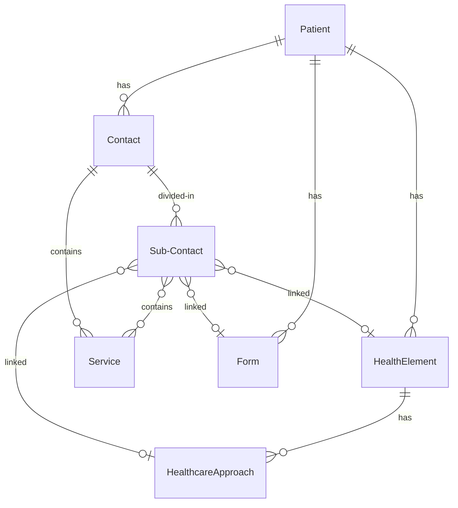

#### Contact

Every time a patient consults a healthcare party or every time a healthcare party accesses a patient's medical file, the actions performed are recorded and collected inside a _contact_. The _contact_ is the entity that records the medical information about the _patient_ chronologically. A visit to the patient's house, a consultation at the practice, a phone call between the patient and the HCP or integrating lab reports into the medical file are examples of when a _contact_ can be recorded.

A contact can occur with or without direct interaction between the patient and the HCP. For example, when a healthcare party encodes data received from laboratory's test result, this is done in the absence of a patient.

A _contact_ groups together pieces of information collected during one single event, for one single patient and for one or more healthcare parties. Patient's complaints, the diagnosis of a new problem, a surgical procedure, etc. are collected inside a contact.&#x20;

The main sub-element of the contact is the _service_. Each atomic piece of information collected during a contact is a _service_ and is stored inside the _services_ list of a _contact_.&#x20;

#### Service

_Services_ include subjective information provided by the patient, such as complaints, reason for visit, feelings, etc. or objective information like bio-metric measures (blood pressure, temperature, heart beat, etc.), or physical exam description, diagnosis, prescription, integration of lab reports from another healthcare party, action plan, etc.&#x20;

Any action performed by the healthcare party which is relevant for the health element of a patient is considered a _service_.&#x20;

Because _contacts_ are purely chronological objects, they do not convey information about the organization of the medical file. They however, do include a data structure to link _services_ to existing structuring elements such as_ health elements_, _healthcare approaches_ and _forms_. This data structure is the _sub-contacts_ list.

**Sub-contact**

A sub-contact is an object embedded inside a contact that links one or several _services_ to one _health element_, _healthcare approach_ or _form_.

#### Health element

_Health element_ or _Healthcare element_ can be described as the reason for the patient to consult a healthcare party. The _health element _has a starting moment and optionally an ending moment. In the case of incurable chronic diseases, the ending time is usually the time of death of the patient. The _health element_ usually represents a healthcare problem (diabetes, kidney failure, hypertension, heart attack, etc.) but this is not always the case. Pregnancy, right alignment of the heart, etc. are examples of _health elements_ which do not pose a healthcare problem.

#### Healthcare approach

_The healthcare approach_ is part of a _health element_ and represents an action undertaken for the follow-up of a given _health element_ of a patient. A _healthcare approach_ groups together the services that are meant as solution for the given _health element_.

#### Form

A _form_ collects a series of _services_ in one single visual entity. It is used to organize  the information on screen. It is used to create input forms, dashboards, folders hierarchies or more generally any structure needed by a developer to sort or group the information for an user.

### Example use case

Let's look at the above mentioned elements explained with a fictional patient:


The patient observes a mild pain in the lower right side of the abdominal area on July 1. It is not consistent. On July 2, the pain becomes severe and is now covering the whole abdominal area. The pain is consistent and continuous through out the day. Towards the end of the day, the patient starts vomiting and the pain is unbearable.&#x20;

The patient loses sleep and on 3 July, early morning rushes to the hospital after having vomited multiple times and the pain now being unbearable. This is the n-th contact shown above. The patient complains to the doctor about the symptoms and after thorough examination, the doctor diagnoses him with appendicitis. The doctor recommends a surgical operation of appendectomy the next day. The doctor also prescribes antibiotic cefuroxime, intravenously, to reduce spread of infection in the abdomen.&#x20;


> **info:**
Several events take place before the patient makes the first consultation with the _healthcare party_, these events leading to the _contact_ (n). During the _contact_ (n), the physician's software creates a _contact_, the beginning moment of the contact is the moment of the consultation. It also creates a _health element_, appendicitis (beginning moment: July 1). Three _services_ are created during the course of the consultation: the complaint, the diagnosis and the prescription. These three _services_ are saved inside _contact_ (n) and they are connected by means of one _sub-contact_ with three links to the _health element_, appendicitis.


During the next _contact_ (n+1) on July 4, the surgical operation of appendectomy, is carried out. After 3 days in observation, the patient is released from the hospital with a prescription of antibiotics for next 6 days and recommends a recovery period of 4 weeks.&#x20;


> **info:**
&#x20;This _contact_ (n+1) is a simple one. It holds only one _service_ (appendectomy) connected to one _health element_ (appendicitis).


Sometime later, the patient is diagnosed with diabetes. The patient develops difficulties due to this. Few consultations were made with the doctors attempting to keep these conditions under control. One of the conditions the patient develops is necrosis in a toe. The doctor recommends amputation of the toe (figure 2). On March 7, the patient is asked to get admitted for the surgical procedures of toe amputation. After proper healing of the wound, on April 7, the patient begins sessions with a physiotherapist to help with walking again.&#x20;


> **info:**
Previous _contacts_ have already occurred diagnosing and recording diabetes and necrosis, prior to prescribing a follow-up plan of toe amputation (these are not shown in figure 2). The _contact_ (m) records a _service_ of toe amputation operation linked to multiple structuring element, here, the patient's existing _health element_, diabetes and the _healthcare approach_ of toe amputation. The _contact_ (m+1) for physiotherapy is only linked to the _healthcare approach_ of toe amputation. Note the _health element_ diabetes, continue to exist.


As a result of diabetic condition, the patient later on, has an episode of heart attack. The patient is prescribed lifestyle changes, medication, cardiac rehabilitation, etc. and asked to consult again in 2 weeks for the follow up of the heart attack episode (not shown in figure 2). During this consultation, various bio-metric measures like, blood sugar level, blood pressure, etc. was recorded. The change in weight was also recorded in order to measure how much life style changes were effective.&#x20;


> **info:**
_Contact_ (p) holds service linked to two _health elements_, one already existing and chronic and the other previously recorded. _Services_ provided are follow-up consultation, bio-metric measurements and weight measurement which are linked to either of the _health elements_ (diabetes, heart attack). Note here that weight tracking is a _service_ for both _health elements_. Here diabetes does not have an ending point and continues along the timeline.


## Root-level Entities

Root level entities are the one that can be manipulated using [basic operations](/how-to/basic-operations). Each
root-level entity has its own section in the SDK, that exposes the operations that can be applied to the entity.


**kotlin:**


```kotlin test-AAFM
private const val CARDINAL_URL = "https://api.icure.cloud"

print("Login: ")
val username = readln().trim()
print("Password: ")
val password = readln().trim()
val sdk = CardinalSdk.initialize(
	projectId = null,
	baseUrl = CARDINAL_URL,
	authenticationMethod = AuthenticationMethod.UsingCredentials(
		UsernamePassword(username, password)
	),
	baseStorage = FileStorageFacade("./scratch/storage")
)

// Accessing the section for the HealthElement entity to retrieve a single HealthElement by id
val healthElement = sdk.healthElement.getHealthElement(healthElementId)
```


**python:**


```python
CARDINAL_URL = "https://api.icure.cloud"

username = input("Username: ")
password = input("Password: ")
sdk = CardinalSdk(
	application_id=None,
	baseurl=CARDINAL_URL,
	authentication_method=UsernamePassword(username, password),
	storage_facade=FileSystemStorage("./scratch/storage")
)

# Accessing the section for the HealthElement entity to retrieve a single HealthElement by id
health_element = sdk.health_element.get_health_element_blocking(health_element_id)
```


**typescript:**


```typescript test-SIHI
const CARDINAL_URL = "https://api.icure.cloud"

const username = await readLn("Login: ")
const password = await readLn("Password: ")
const sdk = await CardinalSdk.initialize(
	undefined,
	CARDINAL_URL,
	new AuthenticationMethod.UsingCredentials.UsernamePassword(username, password),
	StorageFacade.usingFileSystem("./scratch/storage")
)

// Accessing the section for the HealthElement entity to retrieve a single HealthElement by id
const healthElement = await sdk.healthElement.getHealthElement(healthElementId)
```


### Base Entities

Base entities do not contain sensitive data and are therefore unencrypted. Any user with appropriate permissions can
create, search, and delete these entities. Since they are not encrypted, there are no encryption metadata fields to
manage, and sharing the entity's ID is sufficient for access.

- [**Code**](/explanations/data-model/code): Represents a concept from a medical codification system
(e.g., [SNOMED-CT](https://www.snomed.org/what-is-snomed-ct), [LOINC](https://loinc.org/)), or an internal codification.
Codes support versioning and multilingual content.
- [**Device**](/explanations/data-model/device): Represents a medical device (e.g., MRI machine, smartwatch,
any connected device that monitors a patient). When associated with a user, a device can log in and create, search, and
share data, similar to other data owners.
- [**HealthcareParty**](/explanations/data-model/healthcareparty): Represents any actor involved in patient care,
such as a doctor, nurse, receptionist, or medical institution. A HealthcareParty can be associated with a user to log
in and manage data.
- [**User**](/explanations/data-model/user): An entity that represents an actor able to log in to Cardinal. It can
be linked to a HealthcareParty, Patient, or Device entity.


> **info:**
A registered user can log in but will not be able to create, retrieve, search, or share encryptable entities unless they
are linked to a HealthcareParty, Patient, or Device. A user linked with one of these entities is called a **Data Owner**.


### Encrypted Entities

Encryptable entities contain sensitive data and are encrypted on the client side before being stored in the cloud.
Only Data Owners can create, share, retrieve, or delete these entities. Even if a non-Data Owner has permission to
access an entity (e.g., an admin), they will only have access to the unencrypted portion of the data.

- [**Contact**](/explanations/data-model/contact): a Contact is an encryptable entity that represents a situation that involves a patient where
medical data is created. Usually it involves a doctor (healthcare party), like in the case of a medical examination.
- [**Document**](/explanations/data-model/document): a Document is an encryptable entity that is used to store a medical document in any format.
It can contain textual document, images, and binary data, that are also encrypted before being stored on the cloud.
Document entities can store large quantities of data while keeping efficiency in searching the data.
- [**HealthElement**](/explanations/data-model/healthelement): Represents a medical condition, ranging from short-term
conditions (e.g., fever) to chronic ones (e.g., allergies).
- [**Message**](/explanations/data-model/message): Used for encrypted message exchanges between users. It supports
both text and file attachments, all of which are encrypted.
- [**Patient**](/explanations/data-model/patient): Represents a patient, the subject of treatment or medical data
collection. A Patient entity can be linked to a User to allow login.
- [**Topic**](/explanations/data-model/topic): Used with the Message entity to support encrypted conversations
between users.

## Nested Entities

Nested entities cannot exist independently and are part of another entity. If they are encryptable, a user who can
decrypt the parent entity can also decrypt its nested entities.

- [**CodeStub**](/explanations/data-model/codestub): a CodeStub is a non-encryptable entity that represent a
reference to a [Code](/explanations/data-model/code). It can be nested in many different entities, most commonly
in the `tag` and `code` filter, and it is used to link a Code to it without having to include the whole Code.
- [**Content**](/explanations/data-model/content): a Content is an encryptable entity that is nested into a
[Service](/explanations/data-model/service) and contains the value of the medical data. It supports scalar numeric
values, multidimensional arrays, binary data and references to big files stored in [Document](/explanations/data-model/document)s.
- [**Identifier**](/explanations/data-model/identfier): an Identifier is a non-encryptable entity that can be used
to connect resources with external contents, as per the [FHIR specification](https://build.fhir.org/datatypes.html#Identifier).
- [**Service**](/explanations/data-model/service): a Service is an encryptable entity nested inside a [Contact](/explanations/data-model/contact)
and represent an instance of medical data collected in it. Multiple Services can be associated to the same contact if
multiple measurements are taken in the same session.
- [**SubContact**](/explanations/data-model/subcontact): a SubContact is an encryptable entity that is embedded into
a Contact and can provide additional medical context to it and to the Service it contains.


## Shared Fields

The following fields are common across most entities.

### Id

A unique identifier for an entity. It is recommended to use a [UUID v4](https://en.wikipedia.org/wiki/Universally_unique_identifier#Version_4_(random))
to avoid conflicts. The exception is the [Code](/explanations/data-model/code) entity, where the ID format
is `type|code|version`.

### Rev

An internal fields that represents the version of the entity, in the format `{number}-{hash}`. This field is managed
internally by Cardinal and is not present on nested entities.

When you create an entity, its rev will start from 1, and it will increase with each operation that modifies or deletes it.
To modify an entity, you will always have to start from the latest revision of the entity otherwise an exception will be
thrown. All the methods that allow you to retrieve entities by id or using [other search criteria](/how-to/querying-data)
will return the latest revision of each entity.

### Tag and Code

`tag` and `code` are collections of [CodeStub](/explanations/data-model/codestub) (i.e. a reference to a [Code](/explanations/data-model/code))
that can be used to add to an entity some context that can be used after to [query the data](/how-to/querying-data).

The difference between `tag` and `code` is purely conceptual: `tag` is strictly for non-sensitive context while the
CodeStubs in `code` may contain sensitive data. For example, a CodeStub for the region a patient lives in would go in
`tag`, while a CodeStub on a Contact for the department of the hospital where an examination was performed would go in
`code`.


> **caution:**
By default, both `tag` and `code` are unencrypted to allow you to be used in searching. However, if you feel that the
CodeStub in `code` may leak sensitive data, you should configure them to be encrypted in the [encryption manifest](/how-to/initialize-the-sdk/configure-what-to-encrypt).

Note that if you do so, the CodeStubs in codes will not available anymore for querying.


### Internal Metadata Fields

All the non-nested encryptable entities contain several field dedicated to handling encryption: (`secretForeignKeys`,
`cryptedForeignKeys`, `delegations`, `encryptionKeys`, `encryptedSelf`, `securityMetadata`). These fields are managed
internally and must not be modified manually. Any attempt of modifying those fields in an entity will be refused by the
backend.

### Created
Where present, the `created` field contains the timestamp of creation of the entity. It is automatically filled by the
backend when the entity is created.

### Modified
The `modified` field contains the timestamp of the last modification of the entity. Differently from the `created` field,
it is not handled automatically by the backend.

### Author
Where present, the `author` field contains the id of the User that created the entity. It is automatically filled by the
backend when the user is created.

### Responsible
Where present, the `responsible` field contains the id of the Data Owner (HealthcareParty, Patient, or Device) that
created the entity. The backend will automatically fill this field when the entity is created. However, a Data Owner
can opt out [when creating the sdk](/how-to/initialize-the-sdk/#optional-parameters) to avoid creating an
unencrypted connection with the Contact. This may be the case for Patient users or when HealthcareParty users are
defined as pseudo-anonymised data owners.

### Deletion Date
Where present, the `deletionDate` field contains the timestamp of soft-deletion of an entity. For more information
about deleting entities, check the [related how to](/how-to/basic-operations#delete).

### Identifiers
A collection of [Identifier](/explanations/data-model/identfier) that can be used to connect an entity with external
resources as per the [FHIR specification](https://build.fhir.org/datatypes.html#Identifier).

## Internal Unstructured Data Types

The information in some field are not represented through their own data type, but as primitive type with some rules
for formatting. An example of this is the `dateOfBirth` field in the Patient entity: it is a date, precise to the day,
stored as a number in the `YYYYMMDD` format.

Below, you will find a list of all such types.

### FuzzyDate
A date, precise to the day, stored as a number in the `YYYYMMDD` format. If either the month or day information is
unknown or unavailable, `00` should be used instead.


> **note:**
This format will be replaced by a data type in the near future.


### FuzzyDateTime
A timestamp, precise to the second, stored as a number in the `YYYYMMDDhhmmss` format. If any part of the date, except
for the year is unknown `00` can be used instead. Therefore:
- `20240101230000` encodes `2024/01/01` at 23 hours, but minutes and seconds are unknown
- `20240101235960` encodes `2024/01/02` at `00:00:00`


> **note:**
This format will be replaced by a data type in the near future.

---

<!-- Source: sdk/explanations/data-model/patient.mdx -->

# Patient

A Patient is an encryptable, root-level entities that represents a patient, the subject of treatment or medical data
collection.

Any Patient associated to a [User](/explanations/data-model/user) is able to log in, initialize their own
encryption keys and manage encryptable data as a Data Owner user. For more details about users and data owner users,
check [this explanation](/explanations/end-to-end-encryption/data-owners-and-access-control).

## Fields Encrypted by Default
By default, the following fields of this entity will be encrypted:
- The deprecated field `note`.
- The `markdown` field in all the `notes`.

You can customize the encrypted fields as [explained in this how to](/how-to/initialize-the-sdk/configure-what-to-encrypt).

## Properties

Below you will find an explanation of the most commonly used properties in the entity that are not among the
[shared fields](/explanations/data-model/#shared-fields). For a full list, check the reference documentation (:construction:).

### active
A boolean field that indicates whether the patient is active.

### addresses
A list of addresses for this Patient.

### administrativeNote
Any additional remark about the patient for administrative and organizational purposes. It should not contain any
confidential or sensitive information.

### alias
A non-official name (nickname) used to refer to the Patient.

### birthSex
The birth sex of the Patient.

### civility
The civility of the Patient (e.g. Mr., Ms., Pr., Dr., etc.).

### companyName
The name of the company the Patient is part of.

### deceased
A boolean field that indicates whether the patient is deceased.

### dateOfBirth
The date of birth of the Patient as a [FuzzyDate](/explanations/data-model/#fuzzydate).

### dateOfDeath
The date of death of the Patient as a [FuzzyDate](/explanations/data-model/#fuzzydate).

### deactivationDate
If the `active` field is false, this should contain the date of the deactivation of the patient.
It is encoded as a [FuzzyDate](/explanations/data-model/#fuzzydate).

### deactivationReason
If the `active` field is false, this should contain the reason of deactivation of the patient.

### education
The level of education of the Patient as a free text (e.g. college degree, undergraduate, PhD).

### ethnicity
The ethnicity of the Patient.

### financialInstitutionInformation
A collection of object that contains the bank information (IBAN, BIC, bank) of this Patient.

### firstName
The first name of the Patient.

### gender
The gender of the Patient.

### languages
A collection of the [ISO codes](https://www.loc.gov/standards/iso639-2/ISO-639-2_8859-1.txt) of the languages spoken by
this Patient.

### lastName
The official surname of the Patient. The surname contained in this field is the one that should be used for all the
administrative purposes.

### maidenName
If the Patient is married and acquired their spouse name, this field should contain the last name of the Patient
before marriage.

### names
This collection should contain all the names for a Patient. It is a good practice to sort them by preference of use,
with the official name being the first entry.

### nationality
The nationality of the Patient.

### notes
Confidential annotations related to the Patient.


> **note:**
By default, only the `markdown` field of each note will be encrypted.


### partnerships
A collection of objects that contains the relationships and contact people for this Patient.

### patientHealthCareParties
A collection of objects that represent a relation in time between this Patient and a HealthcareParty (e.g. to indicate
that a doctor was the referring doctor for that patient).

### personalStatus
Represents the Patient current social or relationship status (e.g. married, single, in a relationship, etc.).

### picture
An image associated to the Patient as array of bytes.


> **caution:**
This field is meant to contain only a short byte array (a few kilobytes). Using it to store bigger data may result in
a loss of performance while querying your database.


### placeOfBirth
The place of birth of the patient as a free text.

### placeOfDeath
The place of death of the patient as a free text.

### profession
The current profession of the Patient as a free text.

### race
The race of the patient.

### ssin
The Social Security Number of the HealthcareParty.

### spouseName
If the Patient is married, the last name of their spouse.

---

<!-- Source: sdk/explanations/data-model/contact.mdx -->

# Contact

The Contact is an encryptable root-level entity that records the medical information about the patient. A visit to the patient's house, a
consultation at the practice, a phone call between the patient and the healthcare party or integrating lab reports into
the medical file are examples of when a contact can be recorded.

A Contact can occur with or without direct interaction between the patient and the healthcare party. For example, when a
healthcare party encodes data received from laboratory's test result, this is done in the absence of a patient.

A Contact groups together pieces of information collected during one single event, for one single patient and for one or
more healthcare parties. Patient's complaints, the diagnosis of a new problem, a surgical procedure, etc. are collected
inside a Contact.

## Modifying a Closed Contact
Each Contact has an `openingDate` and `closingDate` that represent the moments when the moment of creation of medical
data starts and ends.

Once a contact is closed (i.e. its `closingDate` is not null), it is a good practice not to modify it anymore. Instead,
a new Contact should be created.

## Fields Encrypted by Default
By default, the following fields of this entity will be encrypted:
- `descr`
- The `markdown` field in all the `notes`.
- The Services in `service`, according to their [encryption configuration](/how-to/initialize-the-sdk/configure-what-to-encrypt#contact-service-and-service-content-encryption).

You can customize the encrypted fields as [explained in this how to](/how-to/initialize-the-sdk/configure-what-to-encrypt).

## Properties

Below you will find an explanation of the most commonly used properties in the entity that are not among the
[shared fields](/explanations/data-model/#shared-fields). For a full list, check the reference documentation (:construction:).

### closingDate
The `closingDate` represent the moment when the Contact ended.
It is encoded as a [FuzzyDateTime](/explanations/data-model/#fuzzydatetime).

### descr
A human-readable description for the Contact.

### encounterLocation
An address to record where the Contact took place.

### encounterType
A [CodeStub](/explanations/data-model/codestub) to give a context to the type of Contact using a standard terminology.

### groupId
The medical information contained into a single "logical" Contact can be separated into multiple Contact entities that
share the same `groupId`. This use case is explained in more details in [this how to](/how-to/contact-group-id).

### notes
A list of textual remarks related to this Contact.

### openingDate
The `openingDate` represent the starting moment of the event of the Contact.
It is encoded as a [FuzzyDateTime](/explanations/data-model/#fuzzydatetime).

### participants
The ids of all the other Data Owners that participated in this encounter, associated to their role in the encounter.


> **caution:**
This field is not encrypted by default, so be sure of not including any Patient id in this field as it will break the
anonymization between Contact and Patient.


### services
A collection of [Service](/explanations/data-model/service)s that contain the value of the examinations performed
during the encounter.

### subContacts
A collection of [SubContact](/explanations/data-model/subcontact) to link to the containing Contact additional
medical context, like [HealthElement](/explanations/data-model/healthelement)s or therapeutic plans.

---

<!-- Source: sdk/explanations/data-model/service.mdx -->

# Service

A Service is an encryptable nested entity that represents all the medical data produced during a [Contact](/explanations/data-model/contact), and is therefore
nested into that entity. It can represent subjective information provided by the patient, such as complaints, reason for 
visits, feelings, etc. or objective information like biometric measures (blood pressure, temperature, heart beat, etc.), 
or physical exam description, diagnosis, prescription, integration of lab reports from another healthcare party, action plan, etc.

Any action performed by the HealthcareParty which is relevant for the healthcare element of a patient is considered a 
Service.

The services can be linked to healthcare elements or other structuring elements of the medical record.

## Fields Encrypted by Default
The Service is the only embedded entity that has its own encrypted manifest. By default, the following fields of this 
entity will be encrypted:

- The `markdown` field in all the `notes`.

You can customize the encrypted fields as [explained in this how to](/how-to/initialize-the-sdk/configure-what-to-encrypt).

## Properties

Below you will find an explanation of the most commonly used properties in the entity that are not among the
[shared fields](/explanations/data-model/#shared-fields). For a full list, check the reference documentation (:construction:).

### closingDate
The `closingDate` represent the moment when the service ended.
It is encoded as a [FuzzyDateTime](/explanations/data-model/#fuzzydatetime).

### contactId
The id of the Contact where this Service is nested. This property will be automatically filled by the backend when the
Service is created.

The use case for this property is to provide a link to the parent Contact in all the cases where the Service is retrieved
on its own, by using a filter or a specialized get method.

### content
Stores the data of the Service as a [Content](/explanations/data-model/content). Each content is associated to an
[ISO language code](https://en.wikipedia.org/wiki/List_of_ISO_639_language_codes), to provide localized information if
needed.

### index
A numerical index that is used to sort the Services in the parent entity.

### label
An unambiguous description of the information contained in the Service. Can be expressed in natural language or using
a code from a codification system.

### notes
A list of textual remarks related to this Service.

### openingDate
The `openingDate` represent the starting moment of the Service.
It is encoded as a [FuzzyDateTime](/explanations/data-model/#fuzzydatetime).

### subContactIds
The ids of all the [SubContact](/explanations/data-model/subcontact)s that are used to link the Service with other
entities, such as health elements or healthcare approaches.

### valueDate
If the Service was opened and closed on the same date, this field can be used instead of `openingDate` and `closingDate`.
It is encoded as a [FuzzyDateTime](/explanations/data-model/#fuzzydatetime).

---

<!-- Source: sdk/explanations/data-model/content.mdx -->

# Content

A Content is an encryptable nested entity that contains the value of the medical data to store in the cloud. It is nested
inside [Service](/explanations/data-model/service), and it will always be encrypted before being saved in the cloud.

## Properties

Below you will find an explanation of the most commonly used properties in the entity that are not among the
[shared fields](/explanations/data-model/#shared-fields). For a full list, check the reference documentation (:construction:).

### binaryValue
Raw bytes to store in the Content.
- In Kotlin, it is a `ByteArray`.
- In Python, it is a `bytearray`.
- In Typescript, it is a `Int8Array`.


> **caution:**
This field is meant to contain only a short byte content (up to few kilobytes). Storing large amount of data in this field
can affect the performance of retrieving your data.

Also, it is not possible to store any entity with a total size > 16Mb.

If you want to store large files / big binary content, you can store it in a [Document](/explanations/data-model/document)
and put the document id in the [documentId](/explanations/data-model/content#documentid) field of the Content.

More information about how to store large files are available in [this how to](/how-to/store-unstructured-data).


### booleanValue
A boolean value to store in the Content.

### compoundValue
This field is used to store any complex structure that does not fit in any other field as a collection of nested
[Service](/explanations/data-model/service)s.

### documentId
The id of a [Document](/explanations/data-model/document) entity. This can be used to store large files as medical
content without having to include the file directly in the entity.

### fuzzyDateValue
A date to store in the Content as a [FuzzyDateTime](/explanations/data-model/#fuzzydatetime).

### instantValue
A timestamp to store in the Content.
 - In Kotlin, it is an `Instant` from [kotlinx-datetime](https://github.com/Kotlin/kotlinx-datetime).
 - In Python, it is the timestamp as `int`.
 - In Typescript, it is the timestamp as `number`.

### measureValue
The result of a measurement to store in the Content. Differently from `numberValue`, that only stores the value, in
this field is also possible to store additional information about the measure, like the unit and the reference range.

### medicationValue
The details of a prescribed or suggested medication to store in the Content.

### numberValue
A raw numeric value to store in the Content.
 - In Kotlin, it is a `Double`.
 - In Python, it is a `float`.
 - In Typescript, it is a `number`.

### stringValue
Textual value to store in the Content.

### timeSeries
A Content can store also time series / signal-like data, like the result of an [electrocardiography](https://en.wikipedia.org/wiki/Electrocardiography).
This field can store any 1-dimensional and 2-dimensional signals, along with aggregated measures.

---

<!-- Source: sdk/explanations/data-model/subcontact.mdx -->

# SubContact

A SubContact is an encryptable nested entity that is used to link [Contact](/explanations/data-model/contact)s and
[Service](/explanations/data-model/service)s to other structuring element that can provide an additional medical
context, such as [HealthElement](/explanations/data-model/healthelement), healthcare approach (PlanOfAction), or
medical forms.

SubContacts are nested in the Contact entity, in the `subContacts` field.

## Properties

Below you will find an explanation of the most commonly used properties in the entity that are not among the
[shared fields](/explanations/data-model/#shared-fields). For a full list, check the reference documentation (:construction:).

### descr
A free text description of the SubContact.

### formId
If a medical form (of an external system) was used to acquire the information contained in the Services, this field
contains the identifier of that form.

### healthElementId
The id of an [HealthElement](/explanations/data-model/healthelement) that was opened in the contact, referenced by
the contact or closed by the contact.

### planOfActionId
The id of the healthcare approach (PlanOfAction) suggested for the associated Services.

### services
A collection of Services that need to be connected to the other medical structuring elements (form, health element, healthcare 
approach) referenced by this SubContact.

---

<!-- Source: sdk/explanations/data-model/healthelement.mdx -->

# HealthElement

A HealthElement is an encryptable, root-level entity that represents a medical event persistent in time. For example,
it may represent an illness that lasts for a couple of days (e.g. a flu), a more prolonged state (e.g. pregnancy), or
a permanent ailment (e.g. allergy).

## Fields Encrypted by Default
By default, the following fields of this entity will be encrypted:
- `descr`
- `note`
- The `markdown` field in all the `notes`.

You can customize the encrypted fields as [explained in this how to](/how-to/initialize-the-sdk/configure-what-to-encrypt).

## Properties

Below you will find an explanation of the most commonly used properties in the entity that are not among the
[shared fields](/explanations/data-model/#shared-fields). For a full list, check the reference documentation (:construction:).

### careTeam
A collection of object that contain information about all the healthcare actor related to the condition of this 
HealthcareElement.

### closingDate
The `closingDate` represent the moment when the HealthElement ended.
It is encoded as a [FuzzyDateTime](/explanations/data-model/#fuzzydatetime).

### descr
A human-readable description for the HealthElement.

### episodes
A collection of objects that contain information about all the moments when the condition described by the HealthElement
happened.

### idOpeningContact
The id of the [Contact](/explanations/data-model/contact) that represents the encounter where this HealthElement
was created.

### idClosingContact
The id of the [Contact](/explanations/data-model/contact) that represents the encounter where this HealthElement
is closed.

### idService
The id of a [Service](/explanations/data-model/service) if this HealthElement was created within a specific Service
in a contact.

### note
A textual note to include in the HealthElement.

### notes
Additional textual notes to include in the HealthElement.

### openingDate
The `openingDate` represent the starting moment of the event of the HealthElement.
It is encoded as a [FuzzyDateTime](/explanations/data-model/#fuzzydatetime).

### plansOfAction
A collection of objects that contain information about all the healthcare approaches related to this HealthElement.

### valueDate
If the HealthElement was opened and closed on the same date, this field can be used instead of `openingDate` and `closingDate`.
It is encoded as a [FuzzyDateTime](/explanations/data-model/#fuzzydatetime).

---

<!-- Source: sdk/explanations/data-model/document.mdx -->

# Document

A Document is an encryptable root-level entity that represents any kind of medical document, from reports to medical imaging
results. 

Differently from the other entities, the Document is designed to manage big files, that are stored as attachments of this
entity. Each Document can have a **main attachment** and multiple **secondary attachments**, that are fully encrypted
before being sent on the cloud. You can read more about store big files in Cardinal [here](/how-to/store-unstructured-data).

## Fields Encrypted by Default
In this entity, no field is encrypted by default. You can customize the encrypted fields as [explained in this how to](/how-to/initialize-the-sdk/configure-what-to-encrypt).

## Properties

Below you will find an explanation of the most commonly used properties in the entity that are not among the
[shared fields](/explanations/data-model/#shared-fields). For a full list, check the reference documentation (:construction:).

### attachmentId
The id of the main attachment of this document. This is an internal field managed by the Cardinal SDK that is part of 
the mechanism to store big files. Do not modify this field directly. For more information about attachments and how to 
store big files in Cardinal, check this [how to](/how-to/store-unstructured-data).

### decryptedAttachment
This is an internal field managed by the Cardinal SDK. Do not modify it manually

### deletedAttachments
A summary of all the attachments of this document that were deleted.

### encryptedAttachment
This is an internal field managed by the Cardinal SDK. Do not modify it manually

### mainUti
The [UTI](https://developer.apple.com/library/archive/documentation/FileManagement/Conceptual/understanding_utis/understand_utis_conc/understand_utis_conc.html#//apple_ref/doc/uid/TP40001319-CH202-CHDHIJDE)
of the main attachment of the Document.

### name
The name of the Document as free text.

### objectStoreReference
This is an internal field managed by the Cardinal SDK that is part of the mechanism to store big files. Do not modify
this field directly. For more information about attachments and how to store big files in Cardinal, check this
[how to](/how-to/store-unstructured-data).

### openingContactId
The id of the [Contact](/explanations/data-model/contact) that represent the encounter where this document was 
created.

### otherUtis
Any other [UTI](https://developer.apple.com/library/archive/documentation/FileManagement/Conceptual/understanding_utis/understand_utis_conc/understand_utis_conc.html#//apple_ref/doc/uid/TP40001319-CH202-CHDHIJDE)
that can be associated to the main attachment of this Document.

### secondaryAttachments
This data structure associates the id of any secondary attachment of the Document with the metadata needed to store it.
This is a field managed internally by the Cardinal SDK and you should not modify it manually. For more information 
about storing and retrieving secondary attachments, check this [how to](/how-to/store-unstructured-data).

### size
The size of the Document, in bytes.

### version
The version of the Document.

---

<!-- Source: sdk/explanations/data-model/message.mdx -->

# Message

A Message is an encryptable, root-level entity that can be use to implement an encrypted messaging systems between users
and, in combinations with [Topic](/explanations/data-model/topic), chat-like features.

## Fields Encrypted by Default
By default, the following fields of this entity will be encrypted:
- `subject`

You can customize the encrypted fields as [explained in this how to](/how-to/initialize-the-sdk/configure-what-to-encrypt).

## Properties

Below you will find an explanation of the most commonly used properties in the entity that are not among the
[shared fields](/explanations/data-model/#shared-fields). For a full list, check the reference documentation (:construction:).

### fromAddress
Any identifier that can be used to uniquely retrieve the User that sent the message. It can be the user id, the email,
the login or any other property that fits your domain of application. 


> **note:**
If you choose a property that is not the user id, the email or the login, it will be your responsibility to ensure its 
uniqueness.


### parentId
The id of a parent Message. This feature can be used to implement a "reply" functions. In this case, the `parentId` of a
Message will be the id of the Message the user is replying to.

### received
The timestamp of when the Message was received.

### readStatus
A data structure that associates the user id of each recipient to the information about when the message was read by them.

### sent
The timestamp of when the Message was sent.

### subject
A short text containing the subject of the message.

### toAddresses
A collection of identifiers that can be used to uniquely retrieve the Users that are the recipients of the message. 
It can be the user id, the email, the login or any other property that fits your domain of application.


> **note:**
If you choose a property that is not the user id, the email or the login, it will be your responsibility to ensure its
uniqueness.


### transportGuid
The id of the [Topic](/explanations/data-model/topic) that contains the Message.

---

<!-- Source: sdk/explanations/data-model/topic.mdx -->

# Topic

A Topic is an encryptable, root-level entity that can be used in combination with the [Message](/explanations/data-model/message) 
entity to implement chat-like messaging systems.

## Fields Encrypted by Default
By default, the following fields of this entity will be encrypted:
- `description`
- `linkedServices`
- `linkedHealthElements`

You can customize the encrypted fields as [explained in this how to](/how-to/initialize-the-sdk/configure-what-to-encrypt).

## Link to Messages
A Topic does not contain any reference to the messages that are part of it. This link is contained in the messages 
themselves, as the `transportGuid` field should be set to the id of the Topic.

Note that the Cardinal backend does not enforce this behaviour.

## Properties

Below you will find an explanation of the most commonly used properties in the entity that are not among the
[shared fields](/explanations/data-model/#shared-fields). For a full list, check the reference documentation (:construction:).

### activeParticipants
A data structure that associates the Users that are actively participating in this topic. Each user is associated to the
role that they have in the topic (participant, administrator, or owner).

### description
A free-text description for the topic.

### linkedHealthElements
A collection containing the ids of the [HealthElement](/explanations/data-model/healthelement)s that are a subject
of this topic.

### linkedServices
A collection containing the ids of the [Service](/explanations/data-model/service)s that are a subject
of this topic.

---

<!-- Source: sdk/explanations/data-model/healthcareparty.mdx -->

# HealthcareParty

A HealthcareParty is a non-encrypted, root-level entity that represents any actor involved in the care of the patient.
The most common examples of this are doctors, nurses, hospitals, or any organizations that has to manage patient's data.

Any HealthcareParty associated to a [User](/explanations/data-model/user) is able to log in, initialize their own
encryption keys and manage encryptable data as a Data Owner user. For more details about users and data owner users,
check [this explanation](/explanations/end-to-end-encryption/data-owners-and-access-control).

## Properties

Below you will find an explanation of the most commonly used properties in the entity that are not among the
[shared fields](/explanations/data-model/#shared-fields). For a full list, check the reference documentation (:construction:).

### addresses
A list of addresses for this HealthcareParty.

### civility
The civility of the HealthcareParty (e.g. Mr., Ms., Pr., Dr., etc.), if the entity represents a physical person.

### companyName
The name of the company this HealthcareParty is a member of.

### financialInstitutionInformation
A collection of object that contains the bank information (IBAN, BIC, bank) of this HealthcareParty.

### firstName
The first name of the HealthcareParty, if the entity represents a physical person.

### gender
The gender of the HealthcarePArty, if the entity represents a physical person.

### languages
A collection of the [ISO codes](https://www.loc.gov/standards/iso639-2/ISO-639-2_8859-1.txt) of the languages spoken by
this HealthcareParty.

### lastName
The official surname of the HealthcareParty, if the entity represents a physical person. The surname contained in this
field is the one that should be used for all the administrative purposes.

### name
The full name of the HealthcareParty, in the case it represents an organization (e.g. a hospital, a company). In the case
of a physical person, use `firstName`, `lastName`, and `names`.

### names
In the case this HealthcareParty represents a physical person, this collection should contain all the names for them.
It is a good practice to sort them by preference of use, with the official name being the first entry.

### notes
A free text field to store additional unstructured text information in the entity.

### picture
An image associated to the HealthcareParty as array of bytes.


> **caution:**
This field is meant to contain only a short byte array (a few kilobytes). Using it to store bigger data may result in
a loss of performance while querying your database.


### speciality
The medical specialty for this HealthcareParty.

### specialityCodes
A collection of [CodeStub](/explanations/data-model/codestub)s to store the medical specialties of this
HealthcareParty using a codification system.

### ssin
The Social Security Number of the HealthcareParty.

### parentId
The id of the HealthcareParty that is a logical parent for the current HealthcareParty. For example, in the case of a
doctor, the parent could be the HealthcareParty of the hospital. This is relevant when using the `useHierarchicalDataOwners`
options in the [SDK configuration](/how-to/initialize-the-sdk/#cryptography-configurations).

---

<!-- Source: sdk/explanations/data-model/device.mdx -->

# Device

A Device is a non-encryptable root-level entity that represents any medical device.

Any Device associated to a [User](/explanations/data-model/user) is able to log in, initialize their own
encryption keys and manage encryptable data as a Data Owner user. For more details about users and data owner users,
check [this explanation](/explanations/end-to-end-encryption/data-owners-and-access-control).

## Properties

Below you will find an explanation of the most commonly used properties in the entity that are not among the
[shared fields](/explanations/data-model/#shared-fields). For a full list, check the reference documentation (:construction:).

### brand
The brand of the Device as a free text.

### name
The name of the Device as a free text.

### model
The model of the Device as a free text.

### picture
An image associated to the device as array of bytes.


> **caution:**
This field is meant to contain only a short byte array (a few kilobytes). Using it to store bigger data may result in
a loss of performance while querying your database.


### serialNumber
The serial number of the Device.

### type
The type of the Device as a free text.

---

<!-- Source: sdk/explanations/data-model/user.mdx -->

# User

A User is a non-encryptable, root-level entity that represents an actor that can log in to the system and perform actions
according to their permissions.

Only a user that is a data owner (i.e. is associated to a HealthcareParty, Patient, or Device) and has initialized their
own encryption keys can perform operations on the encryptable fields of encryptable entities. A user that is an admin or
that has the correct permission can access encryptable entities, but they will only be able to read and write the
non-encryptable fields.

For more information, check the explanation on [data owners and access control](/explanations/end-to-end-encryption/data-owners-and-access-control).

## Login Credentials
In order to login, a user must provide valid credentials (namely, a login and a password) to the Cardinal SDK.
Any of these field of the User entity is valid as login:
- `id`
- `login`
- `email`
- `mobilePhone`

As for the password, it is possible both to set a password (in the `passwordHash` field) or to use a [temporary token](/how-to/remember-me).

## Roles
The roles assigned to a User are stored in a nested object inside the `systemMetadata` property. It has 3 properties:

- `isAdmin` is a boolean field that is `true` if the user is an admin.
- `roles` is a set of the names of all the roles assigned to the user.
- `inheritsRoles` is a boolean field that is `true` if the user has no role set and so inherits the roles from the group
configuration.

Any update to this property will be prohibited by the backend. To learn how to update the roles on a user, check this [how to](/how-to/define-user-roles).

## Data Owner Users
A User is a **Data Owner** User if exactly one of the following is true:

- They have the id of a valid [HealthcareParty](/explanations/data-model/healthcareparty) in the `healthcarePartyId` field.
- They have the id of a valid [Patient](/explanations/data-model/patient) in the `patientId` field.
- They have the id of a valid [Device](/explanations/data-model/device) in the `deviceId` field.


> **caution:**
A User can be associate either to a HealthcareParty, or to a Patient, or to a Device, and it cannot be associated to
more than one of those entities.


When a Data Owner logs in, the SDK loads their available encryption keys or creates new one if no key is available.
Then, the user will be able to create, modify and search encrypted data. You can read more about data owner users [here](/explanations/end-to-end-encryption/data-owners-and-access-control)

## Properties

Below you will find an explanation of the most commonly used properties in the entity that are not among the
[shared fields](/explanations/data-model/#shared-fields). For a full list, check the reference documentation (:construction:).

### authenticationTokens
Contains all the active authentication tokens for the user, where the hash of the token is replaced by the character
`*`.

This field is useful to check how many tokens are currently active and their duration, and it can be used to remove an
active token, by deleting it from the map.

While it is possible to manually creating a token by adding it to this map, it is preferable to use the `getToken` method
of the SDK. More information about application tokens can be found in [this how to](/how-to/remember-me).

### deviceId
The id of the [Device](/explanations/data-model/device) associated to this User. If this field is not null,
then the `healthcarePartyId` and `patientId` fields should be null.


> **info:**
A User where this field is not null is a **Data Owner** User.


### email
The email of the User. It can be used as username to log in.

### groupId
The id of the group where this user belongs.

### healthcarePartyId
The id of the [HealthcareParty](/explanations/data-model/healthcareparty) associated to this User. If this field
is not null, then the `patientId` and `deviceId` fields should be null.


> **info:**
A User where this field is not null is a **Data Owner** User.


### login
A username for the User. This field can be used in the log in phase.

### mobilePhone
The mobilePhone of the User. It can be used as username to log in.

### name
A free-text field that contains the name of the User.

### passwordHash
If the current User has a password, this field will contain the character `*`, otherwise it will be null.
This field can be used to create or update the password for the User. When the user is created or updated, if this field
contains a clear-text password, the backend will store it hashed and salted.


> **note:**
If a User logged in with a long token (i.e. an authentication token with a duration > 5 minutes), they will not be able
to create or update their own password or the password of any other user, even if they have the permission to do so.


### patientId
The id of the [Patient](/explanations/data-model/patient) associated to this User. If this field is not null,
then the `healthcarePartyId` and `deviceId` fields should be null.


> **info:**
A User where this field is not null is a **Data Owner** User.


### systemMetadata
This field contains internal information about the User. It has 3 properties:

- `isAdmin` is a boolean field that is `true` if the user is an admin.
- `roles` is a set of the ids of all the roles assigned to the user.
- `inheritsRoles` is a boolean field that is `true` if the user has no role set and so inherits the roles from the group
  configuration.

Any update to this property will be prohibited by the backend. To learn how to update the roles on a user, check this [how to](/how-to/define-user-roles).

### status
The status of the User. The values can be `Active`, `Disabled`, or `Registering`. Note that if a User has a `Disabled`
status, it will not be able to log in.

---

<!-- Source: sdk/explanations/data-model/code.mdx -->

# Code

A Code is a non-encryptable root-level entity that represents a concept from a medical codification system (e.g., 
[SNOMED-CT](https://www.snomed.org/what-is-snomed-ct), [LOINC](https://loinc.org/)), or an internal codification. Codes 
support versioning and multilingual content. 

## Properties

Below you will find an explanation of the most commonly used properties in the entity that are not among the 
[shared fields](/explanations/data-model/#shared-fields). For a full list, check the reference documentation (:construction:).

### id
Uniquely identifies the Code. Differently from all the other entities, where the id should be a
[UUID v4](https://en.wikipedia.org/wiki/Universally_unique_identifier#Version_4_(random)), the id of the Code should be
`type|code|version`, where `type`, `code`, and `version` are the values of the homonymous properties.

### type 
The type of the Code is the classification system where the code come from (e.g. `SNOMED-CT`, `LOINC`). All the codes 
from the same source should have the same type. 

For internal codes, you can choose any value you prefer.

### code
A value that uniquely identifies the code inside the system. For example, the illness "Besnier's prurigo" is uniquely
defined by the code `200773006` in SNOMED and by the code `L20.0` in ICD-10.

### version
The version of the code, useful if you want to update a Code in your system (e.g. because an update in label or meaning)
while also keeping the outdated version.

As for the format, you can use either [semantic versioning](https://semver.org/) or any version format that can be 
ordered lexicographically (e.g. the date of the publishing of the version in `YYYYMMDD` format).

### label 
Associates an [ISO language code](https://en.wikipedia.org/wiki/List_of_ISO_639_language_codes) and a human-readable 
description of the code in that language. The label and the search terms will be taken into account when searching
codes by label.

### region
A collection of regions where the code is applicable. It may be the [ISO code of the country](https://en.wikipedia.org/wiki/List_of_ISO_3166_country_codes)
or any code that can define a region in a country.

### searchTerms
Associates an [ISO language code](https://en.wikipedia.org/wiki/List_of_ISO_639_language_codes) with a collection of
words in that language that are related to the code. The label and the search terms will be taken into account when searching
codes by label.

---

<!-- Source: sdk/explanations/data-model/codestub.mdx -->

# CodeStub

A CodeStub is a non-encryptable nested entity that represent a reference to a [Code](/explanations/data-model/code). 
It can be nested in many different entities, most commonly in the `tag` and `code` filter, and it is used to link a Code 
to it without having to include the whole Code.

The `id`, `type`, `code`, and `version` fields of a CodeStub must match the ones of the Code it references.

---

<!-- Source: sdk/explanations/data-model/identfier.mdx -->

# Identifier

An Identifier is a non-encryptable nested entity that is used in the `identifiers` field of other entities to 
uniquely identify them and link them to external resources, as specified in the [FHIR documentation](https://build.fhir.org/datatypes.html#Identifier).


> **note:**
The Cardinal backend does not enforce the uniqueness of a defined Identifier for any type of entity.


Identifier's `system` and `value` can be used to [search data using filters](/how-to/querying-data).

## Properties

Below you will find an explanation of the most commonly used properties in the entity that are not among the
[shared fields](/explanations/data-model/#shared-fields). For a full list, check the reference documentation (:construction:).

### assigner
If this Identifier was issued by an external organization, this field should contain the name of that organization.

### system
The namespace of this identifier. According to the FHIR specification, if the system value is a URL, then it must be
possible to resolve it.

### type
A [CodeStub](/explanations/data-model/codestub) that defines the type of this identifier with respect to a
codification system.

### value
The value of the identifier. It must be unique within the namespace defined in the `system`.

---

<!-- Source: sdk/explanations/data-model/agenda.mdx -->

# Agenda

The Agenda is a non-encryptable root-level entity that represents an agenda for a user.

## Properties

Below you will find an explanation of the most commonly used properties in the entity that are not among the
[shared fields](/explanations/data-model/#shared-fields). For a full list, check the reference documentation (:construction:).

### closingDate
The `closingDate` represent the moment when the Agenda ended.
It is encoded as a [FuzzyDateTime](/explanations/data-model/#fuzzydatetime).

### name
A human-readable description for the Agenda.

### userId
An optional link to a user that encodes the fact that the Agenda is related to a specific user.

### rights
A collection of Rights that define the rights of the user on the Agenda.

A Right is a nested entity that contains the following properties:

- `userId`: the id of the user that has the right.
- `read`: if the user can read the agenda content
- `write`: if the user can write in the agenda
- `administration`: if the user can administer the agenda

---

<!-- Source: sdk/explanations/data-model/calendaritem.mdx -->

# Calendar item

The CalendarItem is an encryptable root-level entity that records the an appointment for a the patient.

## Fields Encrypted by Default

By default, the following fields of this entity will be encrypted:
- `details`
- `title`
- `patientId`
- `phoneNumber`
- `address`
- `addressText`
- `meetingTags[].*`
- `flowItem`

You can customize the encrypted fields as [explained in this how to](/how-to/initialize-the-sdk/configure-what-to-encrypt).

## Properties

Below you will find an explanation of the most commonly used properties in the entity that are not among the
[shared fields](/explanations/data-model/#shared-fields). For a full list, check the reference documentation (:construction:).

### title

A human-readable description for the purpose of the appointment.

### details

A human-readable description for the appointment with all the details that could be of interest for the practitioner.

### homeVisit

A boolean that indicates if the appointment is a home visit.

### phoneNumber

The phone number of the patient.

### addressText

A human-readable description of the address where the appointment will take place.

### startTime

A [FuzzyDateTime](/explanations/data-model/#fuzzydatetime) that represents the moment when the appointment starts.

### endTime

A [FuzzyDateTime](/explanations/data-model/#fuzzydatetime) that represents the moment when the appointment ends.

### allDay

A boolean that indicates if the appointment is an all day event.

### duration

The duration of the appointment.

### agendaId

The id of the Agenda where the appointment is scheduled.

### hcpId

The id of the healthcare party that will take care of the patient during the appointment.

---

<!-- Source: sdk/explanations/data-model/timetable.mdx -->

# Timetable

The timetable is an encryptable root-level entity that describes a schedule window for taking appointments.

## Fields Encrypted by Default

By default, no field of this entity will be encrypted.

You can customize the encrypted fields as [explained in this how to](/how-to/initialize-the-sdk/configure-what-to-encrypt).

## Properties

### name

A human-readable description for the timetable.

### agendaId

The id of the Agenda to which the timetable relates.

### startTime

The time of the first possible appointment for this timetable. This is a long formatted as YYYYMMDDHHmmss.

### endTime

The time of the last possible appointment for this timetable. This is a long formatted as YYYYMMDDHHmmss.

### items

A collection of TimetableItems that represent the available schedules for appointments in this timetable.

A TimetableItem is a nested entity that contains the following properties:

- `rrule`: A RRule as described in https://datatracker.ietf.org/doc/html/rfc5545 that represents the recurrence rule for this schedule.
- `notBeforeInMinutes`: The minimum time in minutes before the appointment that the patient can book it.
- `notAfterInMinutes`: The maximum time in minutes before the appointment that the patient can book it.
- `zoneId`: The id of the time zone where the schedule is defined.
- `hours`: A collection of TimeTableHour that represents the available hours ranges for the appointment.

A TimeTableHour is a nested entity that contains the following properties:

- `startHour`: The start time of the available hours range. This is a long formatted as HHmmss.
- `endHour`: The end time of the available hours range. This is a long formatted as HHmmss.

---


================================================================================
# PART 6: END-TO-END ENCRYPTION
================================================================================

<!-- Source: sdk/explanations/end-to-end-encryption/index.mdx -->

# End-to-End Encryption

End-to-end (E2E) encryption is a security model that ensures data is encrypted on the sender's device and only decrypted on the recipient's device.
This approach provides robust protection for data in transit and at rest. Here's how E2E encryption protects data inside Cardinal:

## 1. Data Confidentiality

- **Encryption**: Data is encrypted using strong cryptographic algorithms (e.g., AES) before it leaves the sender's device. Only the intended recipient, who possesses the decryption key, can read the data.
- **Key Management**: In E2E encryption, keys are managed securely. Private keys are never shared or transmitted, ensuring that only the key holders can access the encrypted data.

## 2. Protection Against Interception

- **Secure Transmission**: Even if data is intercepted during transmission, it remains encrypted and unreadable to anyone without the decryption key. This protects against man-in-the-middle attacks and eavesdropping.

## 3. Compliance and Privacy

- **Regulatory Compliance**: E2E encryption helps organizations comply with data protection regulations (e.g., GDPR, HIPAA) by ensuring that sensitive data is protected both in transit and at rest.
- **User Privacy**: By keeping data encrypted until it reaches the recipient, E2E encryption enhances user privacy, as even the service providers cannot access the plaintext data.

## 4. Reduced Attack Surface

- **Minimized Exposure**: Since data is only decrypted on the recipient's device, the attack surface is significantly reduced. Attackers would need to compromise the recipient's device or obtain the decryption key to access the data.

## Application in the Healthcare Framework

In the context of the healthcare data-sharing framework you described, E2E encryption ensures that:

- **Patient Data**: Sensitive medical information is encrypted and can only be accessed by authorized healthcare providers or patients, protecting patient privacy.
- **Access Control**: The use of access control secrets and secure delegations ensures that only authorized users can access specific data, even within the same system.

Overall, E2E encryption is a critical component in protecting sensitive data from unauthorized access and ensuring the confidentiality and integrity of communications.

# Why End-to-End encryption could not be enough for a Zero-Trust Architecture and what can you do about it

Cardinal uses end-to-end encryption to protect data at rest. Keys integrity is ensured by considering that the Cardinal databases that hold the keys are not compromised.

However, if the database is compromised and this breach is not detected in time, a series of attacks become possible.

In this scenario, there is no guarantee that the public keys stored in the iCure database are authentic, i.e. created by the data owner they are associated to.

This is because the database admins or a malicious attacker may have added his own public keys to the data owner's public keys.
Sharing any kind of data using unverified public keys could potentially cause a data leak: this is why when creating new exchange keys or when creating recovery data only verified keys will be considered. For decrypting existing data instead unverified keys will be used without issues.

Cardinal proposes a series of hooks that can be used to perform out of the library verification of public keys and identities.

Details can be found in the [Key Verification](/explanations/end-to-end-encryption/key-verification) page.

<!-- How to go completely zero-trust with separate PGP keys server -->

---

<!-- Source: sdk/explanations/end-to-end-encryption/data-owners-and-access-control.mdx -->

# Data owners and access control

🚧 This page is under construction 🚧

[//]: # (- Explain difference between user vs data owner)

[//]: # (- Explain RBAC vs EBAC in iCure, and how it applies to entities)

---

<!-- Source: sdk/explanations/end-to-end-encryption/encrypted-links.mdx -->

# Pseudo-anonymisation of medical data

:construction: This page is under construction :construction:

## General concept

Some types of encryptable entities are linked with other encryptable entities.

For example, each `Contact` is always linked to a `Patient`.

In most applications, you will need to "navigate" these links.

This is the case, for example, if you want to find all contacts assigned to a certain patient, or find the patient that
a certain contact refers to.

Cardinal allows you to represent these links in a secure way, so that unauthorized users cannot infer relationships between entities based on the encrypted data alone.
This allows you to pseudo-anonymize the data and be able to access it only if you own the secret key used to encrypt the relationship.

The encrypted link works by using secret ids. For each entity that can be on the one side of a one-to-many relationship we have a secret id, which is stored encrypted in the entity itself. This secret id will be added to the many linked entities, allowing for any user with access to the secret id of the one entity to search for the linked entities.


> **note:**
It is possible for a single entity to have multiple secret ids, which is useful in cases where you want to better separate the health data of patients that needs to be accessible to different groups of data owners. This however is a more advanced topic and won't be covered in this page.


## Data Structures used for encrypted links

### SecurityMetadata

- **Purpose**: `SecurityMetadata` is used to store encrypted metadata for entities, including encryption keys and secret IDs that facilitate secure linking between entities. It consists of a series of secure delegations.

- **Role in Encrypted Links**: The secure delegations hold two key components for encrypted links:
    - **Secret IDs**: Each entity that can be on the "one" side of a one-to-many relationship has a secret ID. This ID is stored in an encrypted form within [SecureDelegation] of the entity itself (formerly `delegations`).
    - **Owning Entity Ids**: Encrypted id of the entity which owns the entity holding this [SecureDelegation] (formerly `cryptedForeignKey`),
   * such as the id of the patient for a contact or healthcare element.

### ExchangeData

- **Purpose**: `ExchangeData` facilitates the secure sharing of data between a delegator and a delegate by providing the necessary encryption keys and ensuring data integrity.

- **Role in Encrypted Links**:
    - **Exchange Keys**: These AES keys are used to encrypt the secret IDs and other metadata stored in `SecurityMetadata`. The exchange keys are themselves encrypted with the public keys of both the delegator and delegate, ensuring that only these parties can decrypt and use them.
    - **Access Control Secret**: This secret is used to generate access control keys, which are part of the secure delegations in `SecurityMetadata`. It ensures that only authorized users can access the encrypted links.
    - **Signatures**: `ExchangeData` includes signatures to verify the authenticity and integrity of the exchange keys and access control secrets, preventing tampering.

### Implementation Process

1. **Creation of Encrypted Links**:
- When an entity (e.g., `Patient`) is created, a secret ID is generated and encrypted using an exchange key from `ExchangeData`.
- This secret ID is stored in the entity's `SecurityMetadata`.

2. **Linking Entities**:
- When a related entity (e.g., `Contact`) is created:
    - the public ID of the owning entity is encrypted and included in the related entity's metadata inside the `owningEntityIds`.
    - the secret ID of the owning entity is stored **in clear** in the related entity's metadata inside the `secretIds`.

3. **Accessing Linked Entities**:
- Authorized users can decrypt the secret ID of the owning entity (e.g., `Patient`) using the appropriate exchange key from `ExchangeData`.
- They can then use this secret ID to search for and access all the related entities (e.g., `Contacts`) that contain the same secret ID in their metadata.

4. **Security and Privacy**:
- The use of encrypted secret IDs and exchange keys ensures that only authorized users can navigate the links between entities.
- This mechanism supports pseudo-anonymization by preventing unauthorized users from inferring relationships between entities based on the encrypted metadata alone.

This approach ensures that the links between entities are secure and that sensitive data remains protected, even when navigating complex relationships in the data model.

## Preventing Inference of Relationships

Even if the explicit relationships between entities are encrypted, it is still possible for an attacker to infer relationships based on the structure of the data.

For example, if a piece of medical data is shared explicitly with a certain patient, the attacker could infer that the patient is the owner of the data. Cardinal introduces the concept of secure delegations to prevent this kind of inference.
The details of secure delegations are explained in the [Secure Delegation](/explanations/end-to-end-encryption/secure-delegations) page.

Another way to infer the relationships is to use information explicitly included in the medical data that would divulge the owner of the data.
Cardinal encrypts by default any typed or scanned information that could be used to infer the owner of the data, such as names, addresses, or any other uncontrolled piece of information.

---

<!-- Source: sdk/explanations/end-to-end-encryption/secure-delegations.mdx -->

# Secure delegations

This chapter explains the concepts and algorithms used in the current implementation of the secure delegations.

## Objective

Like for the explicit version of the delegation system, the secure delegations system is designed to :

- Allow data owners to share an entity and entity-specific encrypted metadata with other data owners. The encrypted metadata includes the encryption key used to encrypt the entity's content, any secret ids for the entity if applicable, and any owning entity id.
- Allow the backend to understand if a user has the rights to access an entity (access control).

The main objective of the new secure delegations format is to allow the backend to perform his access control tasks without leaking sensitive information in cases where patients could have a delegation to their medical data. This means that the new secure delegations must also satisfy the following requirements:

- Secure delegations should allow the Cardinal backend to verify *during a request* by a pseudo-anonymised data owner (patient) if he has access to a certain entity or not.
- Outside of requests by the patient secure delegations should not allow anyone to infer if the pseudo-anonymised data owner (patient) has access to a certain entity or not, even if given access to the full database and all secrets of Cardinal.

## Anonymous and explicit data owners

The anonymity requirement in delegations which applies to patients could also be extended to other data owners, so from now on instead of referring specifically to patients we will refer to *pseudo-anonymised data owners*. This anonymity however comes at a price, for example in the current Cardinal SDK design:

- The decryption algorithm requires pseudo-anonymised data owners to cache all the exchange keys they know
- Searching for data which a pseudo-anonymised data owner can access requires to perform multiple queries to the database, one for each exchange key that the data owner can access

This means that in order to use Cardinal efficiently, a pseudo-anonymised data owner can share data only with a limited number of other data owners. For this reason in the usual Cardinal application there will be a mix of anonymous and *explicit* data owners. The id of explicit data owners will appear unencrypted in delegations, but they are not bound by this practical limit to the amount of data owners involved in data sharing with them.

The choice of which data owners are anonymous and which are explicit is left to the end-user, and therefore it is done on the sdk level. Generally we can expect all HCPs to use explicit delegations and all Patients to use anonymous delegations. Devices instead could be anonymous or explicit data owners depending on the application: some devices may be personal for a patient and should be anonymous, while hospital devices could be explicit. The choice may not even be tied only to the data owner type: the same application environment may actually use a mix of patient and hospital devices, so a device may be considered as an anonymous or explicit data owners depending on some property of the device itself.

## Exchange data

The Exchange data is the entity that holds the exchange keys between data owners.
It the `aesExchangeKeys` and `hcPartyKeys` used in previous versions of the SDK, in order to better support secure delegations and key verification. Similarly to this existing exchange metadata formats an instance of exchange data contains information used for the sharing of data from a delegator data owner to a delegate data owner, which could potentially be the same, including the *exchange key*, an aes key to use for the encryption of entity-specific exchange keys, secret ids and owning entity ids.

The exchange data, however, differs from the existing `aesExchangeKeys` in three main ways: it is identified by a unique id, it contains an additional encrypted value called *access control secret* (used in the creation of secure delegations as explained later), and it is signed by the delegator in order to confirm the authenticity.

In summary, an instance of exchange data:

- Has a unique id
- Is created by a delegator to share data with a delegate, and:
    - both the delegator and the delegate ids are explicitly indicated in the exchange data (in clear)
    - there may be multiple instances of exchange data for a specific delegator-delegate pair
- Contains an *exchange key* and an *access control secret* encrypted with the public key(s) of the delegator and public key(s) of the delegate.
- Is signed by the delegator to prove its authenticity. Any form of tampering which would allow an attacker to change ar add more exchange key and/or access control secrets to the exchange data invalidates the signature.

## Secure delegations format

Secure delegations are stored inside the `SecurityMetadata` object of encryptable entities. serve a similar purpose to the existing delegations, but they have some significant differences:

- It is admissible for a secure delegation to not specify the delegator and/or delegate data owner id: only ids of explicit data owners will appear in secure delegations.
- A single secure delegation may hold multiple values of encrypted metadata (encryption keys, secret ids and owning entity ids), including potentially multiple values of a specific metadata type (e.g. many secret ids). The only requirement is that all the values have been encrypted with the same exchange key.
- A secure delegation may not have any value for encrypted metadata. This could be used for example in cases where a data owner wants to share an entity with another data owner without allowing them to access any encrypted content of the entity.

Secure delegations also contain metadata which was not in the existing delegations. This includes:

- The permissions that a data owner with access to the secure delegation has on the entity holding the delegation. Currently this is either read-only or read-write, but in future it may be extended to also allow expressing fine-grained permissions.
- Metadata to support the decryption of the secure delegation content.
- Metadata to allow reconstructing the *delegation graph*, explained later

Each entity holds secure delegation keys in a map where each entry associates a *secure delegation key* to a single secure delegation. This secure delegation key is used to support access control for pseudo-anonymised data owners.

### Access Control with Secure Delegation Key

The access control in secure delegations was designed with the following requirements in mind:

- The delegate of a secure delegation needs to be able to prove to the backend that he has access to a delegation even if his id is not explicitly indicated in the delegation.

- No one should be able to prove to the backend that they have access to a secure delegation where they are neither delegator nor delegate, even if they are given the secure delegation key.

- The delegator needs to be able to create the secure delegation and its key without waiting for action by the delegate.

- This access control process should not allow the backend to infer exchange keys or entity-specific encrypted metadata.
- The secure delegation keys should not leak links between a patient and other entities.

The solution we implemented uses a two step process for the calculation of the secure delegation key.

1. Calculate an *access control key*. Only the delegator and delegate of a delegation will be able to perform this step.
2. Use the access control key to calculate the *secure delegation key*. Given the access control key anyone will be able to perform this step.

With this solution a pseudo-anonymised data owner can prove he has access to an entity by providing the access control key corresponding to a secure delegation in the entity. In cases where the data owner is not yet aware of which secure delegations are in the entity, for example because he is retrieving the entity for the first time, he can either pass all access control keys which could apply to the entity, or perform the retrievial in two steps: first request the security metadata, which can be safely given even to users without access to the entity content, then request the entity using the appropriate access control keys.


> **note:**
The two-step entity retrieval has not been implemented since normally anonymous users will not have many access control keys and we can fully cache them and pass them on each request. If in future we start having some exceptional cases when fully caching the access control keys of a pseudo-anonymised data owner is not feasible we will have to implement this solution as well.


#### Calculating the access control key

The access control key should be calculated using:

- The access control secret of the exchange data used for the creation of the secure delegation. This way only delegator and delegate will be able to generate the access control key for that secure delegation.
- The type of the entity that will hold the secure delegation. This way we can safely use the same exchange data to create secure delegations in patients and medical data without leaking the link between the patient and his medical data, since the access control key and therefore the secure delegation key will be different.

The exact function used to calculate the access control key does not need to be known by the Cardinal server in order for access control to work. Even simple concatenation would work.

#### Calculating the secure delegation key

Since providing the *access control key* is a sufficient condition for a user to prove they have access to a delegation (and therefore an entity) the operation to calculate the secure delegation key must be non-reversible. This could be done using a cryptographically secure hash function, and for this reason we sometime refer to the secure delegation key as *access control hash*.

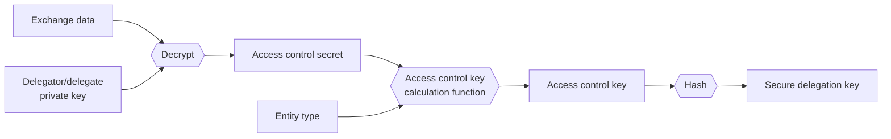

### Secure delegation decryption

The procedure to decrypt secure delegations changes depending on whether the data owner is a pseudo-anonymised data owner or an explicit data owner. The main reason behind this is that we assume that we will always be able to fully cache all exchange data for a pseudo-anonymised data owner, but we may not be able to do the same for an explicit data owner.

#### Decrypting secure delegation as a pseudo-anonymised data owner

Anonymous data owners can build a cache from secure delegation key to exchange key for all of their exchange data. When a pseudo-anonymised data owner needs to decrypt the metadata of an entity he will lookup in the cache for any matching secure delegation key and then use the retrieved exchange key to decrypt the corresponding secure delegation.

#### Decrypting secure delegation as an explicit data owner

For an explicit data owner it may be not feasible to check all his exchange data in order to decrypt a secure delegation, therefore he needs to know the id of the exchange data to use for decryption given the secure delegation and its key. In cases where the counterpart of the secure delegation is also an explicit data owner the exchange data id could be included in cleartext in the secure delegation. However, if the counterpart is a pseudo-anonymised data owner we can't put the exchange data id in cleartext, since the exchange data always indicates both the delegator and delegate id, even if they are anonymous: we need to encrypt the exchange data id using the public keys of the explicit data owner.

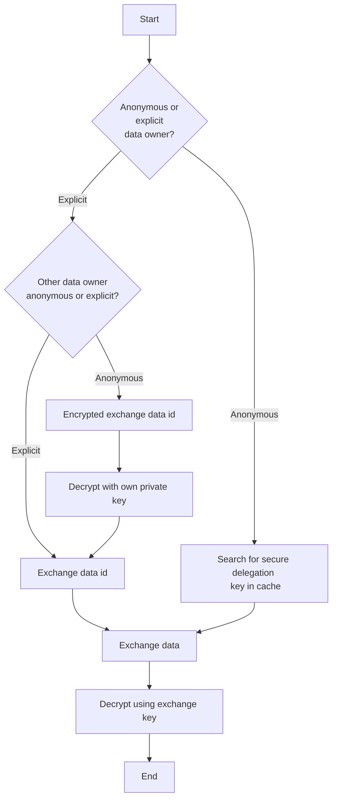


> **note:**
If needed we may also start encrypting the exchange data id used for a secure delegation also with the public keys of anonymous delegators, as long as we do not include the public key fingerprint.


## Strict access control: delegation graph

Access control with the legacy delegations is very limited: once a data owner gains access to an entity he is allowed to do anything with the entity, including revoking the delegation of the data owner which created the original entity. With the new secure delegations we introduce a new kind of strict access control to the delegations of an entity. The strict access control implements the following rules:

- When a data owner creates an entity he creates a root delegation for himself
- When a data owner creates a new delegation for an entity he creates it as a child to his delegation
- Children delegations can not have higher permissions than their parent delegations: if a data owner has read-only permissions on an entity he is not allowed to share the entity with read-write permissions.
- Data owners can only modify their delegations or descendants of their delegations
- A data owner can't increase the permissions on his delegation, but can freely modify the permissions in his descendants as long as the permissions of each delegation is lower or equal to the parent. In cases where a data owner has a delegation that is also a descendant to another of his delegations he may freely modify it (still respecting the child permission ≤ parent permissions relationship).


> **info:**
Since it is impossible to reconstruct an accurate delegation graph from the legacy delegations we consider them as having the same permissions as root delegations.


> **note:**
The current implementation does not yet support modification of secure delegation permissions.


### Examples of permissions change

#### Example 1

Given the following delegations graph, where `A` created the entity, shared it with `B` giving him read-only permissions and later `B` shared it with `C` giving read only permissions:

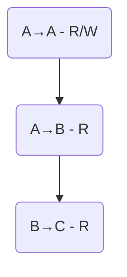

-  `A` can change the permissions of the delegation `A→B` to R/W
- `A` can change the permissions of both `A→B` and `B→C` to R/W
- `A` can NOT change the permissions of only `B→C` to R/W
- `B` can NOT change the permissions of `A→B ` to R/W

#### Example 2

Given the following delegation graph:

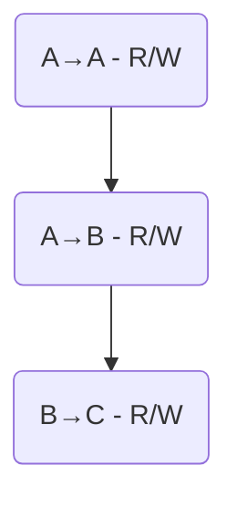

If `A` wants to change the permissions of `A→B` to read-only he also has to update the permissions of `B→C` to read only, otherwise the consistency of the graph is broken.

### Multiple parents for a delegation

There are some rare cases where a single delegation wuold need to have multiple parents. Let's consider the following where a patient (`P`) has access to an entity through 2 delegations (given from HCP `A` and from HCP `B`):

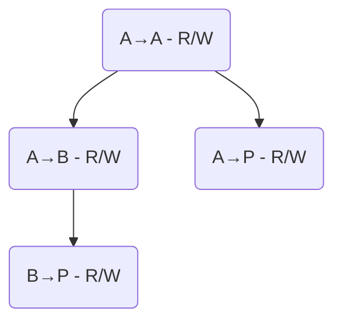

The delegations `A→P` and `B→P` may seem redundant, but actually `B` can't know that `A` has shared the entity with `P`, he can only know that `A` shared data with some pseudo-anonymised data owner, and vice-versa. In this case when `P` shares the entity with another data owner (for example `C`) the new delegation will have two parents.

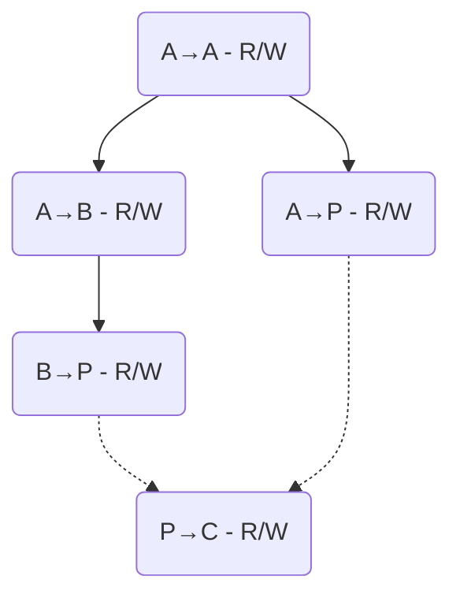

If a delegation has multiple parents the consistency rule is that the permission of the child delegation must be lower or equal to the permission of at least one parent delegation. This means that if `B` wants to revoke access to `P` by removing the delegation `B→P` or reduce his access to read-only, the delegation `P→C` will remain unchanged, since it still has a parent with R/W access.


> **info:**
This leaks information about `A→P` and `B→P`. Every observer will be able to learn that they refer to the same pseudo-anonymised data owner, and in the specific case of `A` and `B` they will learn that the other delegation refers to `P`. This however does not give any significant information to an attacker: in most cases it is reasonable to assume that anonymous delegations in an entity refer to the patient connected to that data.


#### Example

Consider the previous delegation graph as the starting situation. If  `B` wants to change the permissions of `B→P` to read only we obtain the following graph.

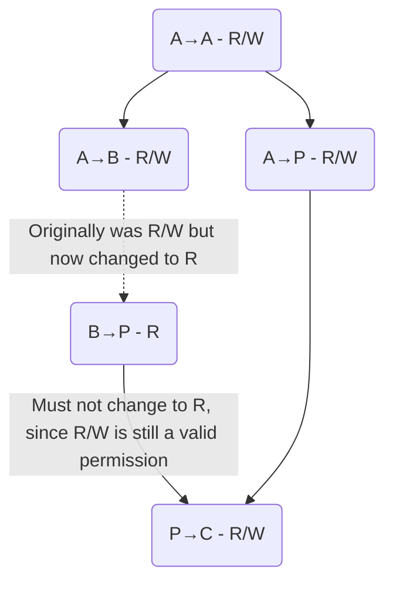

and if later also `A` wants to change the permissions of `A→P` to read-only:
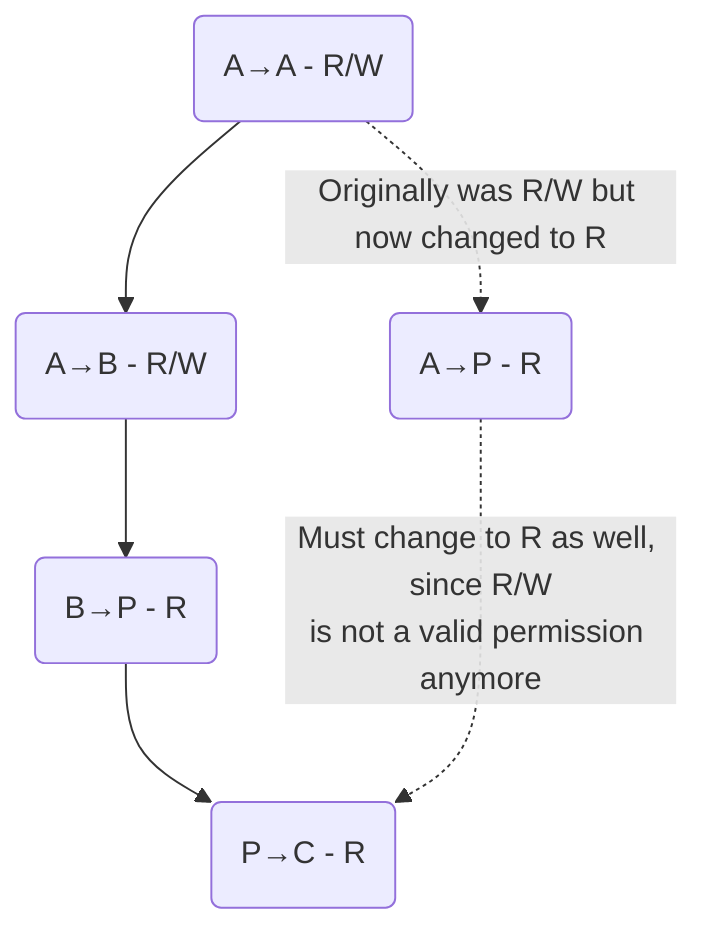

### Delegation graph with data owner hierarchys

Data owners are allowed to create delegations even for entities where they do not have an explicit delegations to themselves if there is at least a delegation to one of their parents. This is not problematic, but may contribute to the creation of delegation graphs with at first glance seem to not make sense. Consider for example a situation with two HCPs `A` and `B`, childrens of `G`, and the following delegation graph of an entity created by `A`:
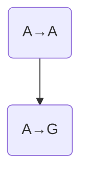
If now `B` wants to share the entity with a third data owner, for example the patient `P` we obtain the following graph:
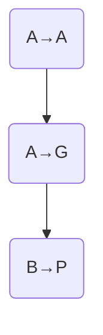

### Entity merging on request by data owners

There are some situations where data owners need to merge two different entities into a single one. This can happen for example if a certain person exists twice in the database as a patient: in this case an hcp will merge the two patients into one. Merging of the entity content is left to the application, but the merging of the metadata needs to be handled by Cardinal.

When merging two entities we need to merge the secure delegations from the different entitites which have the same keys. The merging of the encrypted secure delegation content is trivial, it is simply a set union, and for the merging of the access level we simply keep the highest. The merging of the parent delegations, however, is a bit more complicated, because we need to make sure that the delegation graph remains consistent. The rules for merging are:

- If both secure delegations to merge have one or more parent delegation each then the merged delegation will have both parents.

- If one of the secure delegations is a root delegation (has no parent) it will be a root delegation also in the merged entity, even if it was not a root delegation in the 'merged into' entity (loses the parent). Without this rule we could incur into a situation where a data owner could gain increased permissions on an entity after he merges another entity into it, for example consider the following two delegation graphs:
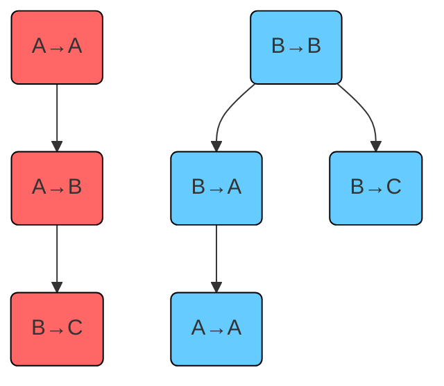
If we were to merge the right entity into the left entity by also making a union of the parents then `B` would gain rights over the delegation `A→A` even though he doesn't have them in the original entity. The delegation graph resulting from the merge should be:
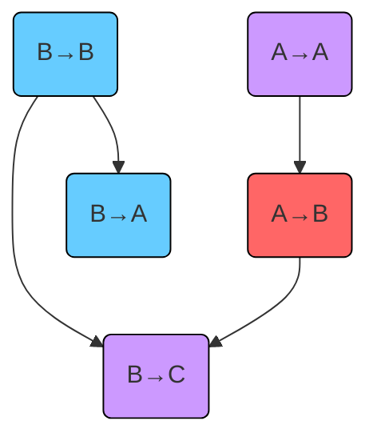

## Searching data

When searching for data (list or filter methods) explicit and pseudo-anonymised data owners use different strategies:

- An explicit data searches for entities having at least a delegation where he is the delegate.
- An aonymous data owner searches for entities having at least a secure delegation key that he can access.

We will call the data owner id or secure delegation key used in data search a *search key*. An explicit data owner uses only one search key, but a pseudo-anonymised data owner may use many more, equal to the amount of exchange data he has. This is especially problematic if a user wants to retrieve ordered data, since in our current implementation of Cardinal data will always be ordered firstly by search key and only secondly by the requested ordering value.

### Views by search key

For each secure delegation in an entity the views as search key both the **id of the delegate** of the secure delegation, if explicit, and the **key of the secure delegation** if there is at least a pseudo-anonymised data owner involved in the delegation. Some important things to note are that these views:

- do NOT emit explicit delegates: this is equivalent to the behaviour of the existing "by hc party" views
- do NOT emit the secure delegation key when both delegator and delegate are explicit, since it will not be used
- emit the secure delegation key even if the delegate is explicit.

This means that views do not emit the explicit delegator of a secure delegation, but emit both the explicit delegate and secure delegation key needed by the delegator in secure delegations from an anonymous delegator to an explicit delegate. This may look like an inconsistency but it is actually needed in some cases to guarantee that anonymous delegators can properly search for their data.

Consider a scenario with a patient `P`, HCP `A` and an entity with the following delegations:

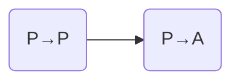

Normally `P` would be able to find this entity using the search key `secDelKey(P→P)`. Now consider the case where `P` loses he key pair and has to create a new one. He can regain access to the entity by asking for access back to the exchange data with `A`, but he will never be able to regain access to his exchange data `P→P`: this means he won't be able to search for data using `secDelKey(P→P)`, and he will instead be able to find this entity only by searching for `secDelKey(P→A)`. This means if we do not emit the secure delegation key for anonymous&rarr;explicit delegations we may prevent pseudo-anonymised data owners from accessing part of their data.

---

<!-- Source: sdk/explanations/end-to-end-encryption/crypto-strategies.mdx -->

# Crypto Strategies

:construction: This page is under construction :construction:

Cardinal uses end-to-end encryption to ensure that the data created by your application is accessible only to the intended
recipients.
Even if a malicious actor gets access to Cardinal's databases all the data they retrieve will have very little value, since
they will not be able to decrypt unless they also gain access to the private keys of your users.

The Cardinal SDK handles automatically encryption of your data for the most part, however, there are some aspects of
encryption that can be handled optimally only with input from your application.
This is where the Crypto Strategies come into play: by providing your own implementation of the `CryptoStrategies`
interface you can customise the behaviour of Cardinal to improve the security and accessibility of your data.

By creating your own implementation of the crypto strategies you will be able to:
- configure which user types will be kept anonymous in sharing metadata (anonymous data sharing)
- implement your own key recovery and verification mechanisms (key recovery and verification)
- reduce the trust you put on the Cardinal server when recovering the key pairs of other users for data encryption (server trust)
- configure the key pair generation strategy (key pair generation)

<!--
## Anonymous data sharing

When a user shares an entity with another user the Cardinal SDK will create some "sharing metadata" which is essential for:
- decryption of the entity on the client side.
- access control on the server side.

In Cardinal we call this kind of metadata a delegation and each delegation is from a *delegator* (the user sharing the
data) to a *delegate* (the user gaining access to the data through the delegation).
Both delegator and delegate are data owners in your application (e.g. patients or `healthcare parties`), and either of them can be
*explicit* or *anonymous*. You can configure which data owners will be anonymous or explicit by implementing the
`dataOwnerRequiresAnonymousDelegation` method in the `CryptoStrategies`.


> **info:**
If you are using the "Simple" crypto strategies implementation, by default only patients will be *anonymous* data
owners, while `healthcare parties` and devices  will be *explicit* data owners.


The most visible difference between explicit and pseudo-anonymised data owners is that explicit data owners have their id stored
in clear in the sharing metadata, while the id of pseudo-anonymised data owner does not appear in clear in any metadata.


> **info:**
Additionally, the *explicit* or *anonymous* nature of a data owner will change the default values of the `author` and
`responsible` fields of the entities created by the data owner.

When a data owner creates an entity the Cardinal SDK will automatically fill the values for author and responsible. For
explicit data owners these will be the user and data owner id of the creator, respectively, while for anonymous data
owners these will be `*`.


### Why is it necessary?

In Cardinal the link between medical data and the patient it refers to is encrypted.
However, if you treat patients as explicit data owners, you risk leaking this link: this is because in most applications
it is safe to assume that if a piece of data is shared with a patient then the data refers to that patient (or at the
very least to a close relative).
Therefore, having delegation with the patient id in clear in an entity is equivalent to having a cleartext `refersTo`
link in the medical data.


But why do we need to hide the link between medical data and patients, if the medical data itself is encrypted?

The reason is that actually you can't encrypt all data in Cardinal: while most details of medical data are encrypted, your
application may need to use tags or codes to organise data. If you want to search for data having some specific tag/code,
then these values need to be readable by the Cardinal server, and therefore they must be unencrypted.


Therefore, depending on the kind of tags/codes you use in your application, having a clear link between medical data and
patient could be detrimental to the privacy of your users.


For example, suppose you are developing a medical device that reads various vital sign of your users, analyzes them and
then determines the chances of the user suffering a certain health issue in the future. In this case the vitals reading
will be encrypted, but maybe you want to be able to easily find the users with high risk, so you add a code with the
risk class to the entity.


For example, suppose you are developing an EHR application, and you want to be able to group the observations/condition
by the kind of disease that was identified. For this purpose you add SNOMED CT codes such as blood disease (414022008)
or hearth disease (56265001) to the entities' codes. In this case the details of the observations/conditions will be
encrypted, but the SNOMED CT codes will be stored in clear.

The unencrypted tags in the data samples observations/conditions give
away some limited, but still sensitive information about the patient, and therefore you should be careful to not leak
the link between the patient and the data.


> **note:**
This does not mean that if you don't use pseudo-anonymised data owners then anyone will be able to infer some information about
your users from the tags and the sharing metadata, since the Cardinal server will still enforce access control.


In conclusion the pseudo-anonymised data owners serve two main purposes:
- Provide an extra layer of protection in case of unauthorized access to the database.
- Allow you to safely share medical data with the patients and with other data owners that should not be allowed to
identify the patients that the data refers to (e.g. for the purpose of clinical research).

[//]: # (TODO: we need to allow in the simplified SDKs to share only entity without link)

### Why not always use pseudo-anonymised data owners? - The cost of anonymity

Anonymous data sharing is great for the privacy of your users, but it comes at a cost, especially when it comes to
access control.

Access control for *explicit* data owners is straightforward: is there a delegation for you? If yes, then you have
access, otherwise you don't.

For *anonymous* data owners, the access control is more complex, since in order to protect the data owners'
privacy the Cardinal server can't know or decrypt in any way the ids of *anonymous* data owners with access to the entity.
The solution we use in Cardinal consists in using a special password in the delegation that only the delegator or
delegate of the delegation know. We call this password an *access control key* (AC key).


> **info:**
The AC keys are 16 bytes long, and are derived from a secret randomly generated by the Cardinal SDK and a constant that
depends on the type of entity they are used in.

Since these keys are not related to the encryption keys used to encrypt the data, they can be safely shared with the
Cardinal server.


The issue with this approach is that since each AC key can only be known by a specific delegator and delegate pair, we
have a key for each possible pair (although only pairs were at least one of the two is a pseudo-anonymised data owner will
actually be used).

Additionally, a user can't know in advance which AC key he should use to retrieve (or search for) an entity, therefore
pseudo-anonymised data owners will have to send ALL their keys for each request that uses delegation-based access control. For
this purpose the SDK will keep a cache of all the AC keys of the user.


> **note:**
The cache of AC keys is created automatically on instantiation of the SDK, and is NOT updated automatically.

If another data owner shares data with the user for the first time the user will not be allowed to access the data until
this cache is refreshed through the `cryptoApi.forceReload` method.


The amount of AC keys that a pseudo-anonymised data owner will use is proportional to the number of data owners involved in a
sharing relationship with him (as delegator or as delegate, regardless of the explicit/anonymous nature of the other
data owner).
Additionally, this number is also proportional to the number of key pairs that the data owner has: if the data owner
loses key pairs and creates new one he will have to create new AC keys. As a security measure this is the case even if
the data owner has regained access to his old data through the give-access-back mechanism.

Although there is no theoretical limit to the number of AC keys that a user can have, there is a practical limit due to
the need for a cache of all AC keys on the client side and having to send all the keys on most requests.
For this reason patients are usually good candidate for pseudo-anonymised data owners, since they are usually going to share
data with at most ~10 other data owners and virtually never with more than 100.
On the contrary in some applications HCP users will have to share data with thousands or even tens of thousands of other
users (e.g. a general practitioner sharing prescriptions directly with the patient), and therefore they are not good
candidates for pseudo-anonymised data owners.


> **note:**
Since the amount of AC keys is also proportional to the number of key pairs of data owners, you should avoid creating
new key-pairs and instead try to recover the old ones whenever possible.

You can learn more about key recovery in the [key recovery and verification](#key-recovery-and-verification) section.


### Implementation recommendations

- Our recommendation is to have `healthcare parties` as explicit data owners and patients as pseudo-anonymised data owners. For
  medical devices it depends on your application: if a device is associated only a few patients (i.e. it is easy to draw
  a connection from a device to a patient) it should be anonymous; on the contrary, if the device can't be easily
  associated to patients it should be explicit.
- The implementation of the `dataOwnerRequiresAnonymousDelegation` method must be consistent across all instances of
  your application, otherwise data owners may not be able to access all their data. This must be the case also if you
  offer different types of applications for `healthcare parties and patients that use the same database.
- Changing the *explicit* or *anonymous* nature of data owners would require to change all the data of the affected data
  owners, and particularly in case of migration from *anonymous* to *explicit* data owners also access to the key-pairs
  of said data owners. This operation is not officially supported by the Cardinal SDK, therefore, you should carefully
  which data owners should be *anonymous* and which should be *explicit* before releasing your application.

[//]: # (TODO Link between anonymous patient and explicit hcp is not encrypted. Usually this is not a problem, but in case)
[//]: # (of a clinic with different types of specialists it could be. Solution: general "receptionist" creating the patient and)
[//]: # (sharing with the organisation. Do we need to add some more details about this?)

## Key Recovery and Verification

End-to-end encryption is great to protect the data of your users from unauthorised access, but it also means that if
your users lose their private keys they will lose access to their data as well!

The Cardinal SDK provides some data and key recovery mechanisms, but it would always be better if you also provide a
custom recovery method that fits your application.
For example, you could allow your users to save their private key in a file, encrypted by a custom password.

In order to use custom key recovery in your application you will have to implement the methods `notifyKeyPairGeneration`
and `recoverAndVerifyKeys` of the crypto strategies interface.
When the SDK determines that a new key pair should be generated it will call the `notifyKeyPairGeneration` method of
the crypto strategies, allowing you to prompt the user to save the key for future recovery.
When instead the SDK realises that a key pair for the logged data owner is not available on the device it will call the
`recoverAndVerifyKeys`, which allows you to prompt the user to load the key he saved in the past.

## Server trust

In order to allow your users to share the encrypted data with other users the Cardinal SDK needs to know the public keys of
the users.
The SDK will automatically retrieve the public keys of the users from the Cardinal server, but how can you be sure that the
public keys you are retrieving are the real public keys of the user?
If the Cardinal server got compromised the attacker could trick your users to share data with him instead of the intended
recipient.

You can be assured that we are doing our best to protect our servers, but if you want to be extra safe you can reduce
the trust you put in the Cardinal server by verifying the public keys of the users yourself, by implementing the
`verifyDelegatePublicKeys` of the crypto strategies interface.

When a user is about to share data with a new delegate user (*for the first time only*) the SDK will retrieve the public
key of the delegate user from the Cardinal server and call the `verifyDelegatePublicKeys` method of the crypto strategies.
You can then prompt the user to verify that the public key is correct using some external verification method and return
the result to the SDK.

Like for key recovery you can choose the verification method that best fits your application. For example, you could ask
the user to check the public key on the website of the doctor/clinic, or you could ask the user to scan a QR code
generated by the delegate user app.


> **note:**
Although not directly related to the crypto strategies, this concept of trust also applies to the give-access-back
mechanisms explained in the [how-to on a user losing his key](../how-to/how-to-authenticate-a-user/how-to-manage-lost-key#give-access-back-to-another-data-owner):
whenever you share data with a user you should verify that the user has actually made a request for access back, and that
the public key you received is really the new public key of the user.


### Verification of own recovered keys

As previously mentioned Cardinal has some built-in mechanisms to recover the keys of your users.
Similarly to public keys, however, if Cardinal gets compromised the attacker may trick your user into "recovering" a key
pair which is actually controlled by the attacker, resulting in the attacker having access to all data encrypted with
such pair.

To prevent this from happening the Cardinal SDK will only use keys recovered through Cardinal means for decryption of existing
data and NOT for the encryption of new data unless the user verifies the keys through the `recoverAndVerifyKeys` method
(custom key recovery and key verification are done by the same method).


> **note:**
This means that if a key pair is recovered through Cardinal means and the user does not verify it, then new AC keys
will be generated for the user, which as explained in the section on [anonymous data sharing](#anonymous-data-sharing)
is detrimental to the performances of the application for *anonymous* data owners.


Key verification is generally not as important as recovery, since it has no impact on the availability of data, however
it is much simpler to implement and use verification rather than recovery.
This is because verification only requires for the user to confirm that a certain public key belongs to a pair that he
has generated in the past.
Since the public key is not sensitive information it can be stored in clear or even printed, making it much easier for
the user to verify it.

Finally, key verification can also be applied to missing keys that are not recovered by Cardinal or by your custom recovery
method. Verifying a public key, even if the corresponding private key is missing, can help the Cardinal SDK to generate
recovery data that could potentially be used to recover other key pairs in the future.

## Simple crypto strategies

The Cardinal SDK provides a default implementation of the crypto strategies interface, the `SimpleCryptoStrategies`.

You can use the `SimpleCryptoStrategies` to kickstart the development of your application, but you should always replace
them with a real custom implementation before releasing your application.

The `SimpleCryptoStrategies` do not provide any key recovery mechanism by themselves and fully trust the Cardinal server
(no key verification is done). You can also pass in input some key pairs which you think may not be available on the
device, so they will be considered as recovered, but this is not necessary.
-->

---

<!-- Source: sdk/explanations/end-to-end-encryption/cryptography-details.mdx -->

# E2E Cryptography in Cardinal

:construction: This page is under construction :construction:

# Secure Data Sharing with Explicit or Anonymous Actors

## 1. Types of Actors

- **Delegator**: The data owner who creates the exchange data to share information with another actor.
- **Delegate**: The data owner who receives access to the shared data from the delegator.

## 2. Type of keys

### 1. Personal Encryption Keys (RSA)

- **Purpose**: These keys are unique to each user and are used to decrypt exchange keys.
- **Functionality**: A user's personal encryption key allows them to decrypt all exchange keys that involve them, facilitating secure communication and data sharing with other data owners.
- **Storage**: Personal encryption keys are stored securely in the user's device, ensuring that only the user can access them. The management of those keys is not handled by the SDK even though it provides utility methods to store them in the secure storage of the device on mobile platforms.

### 2. Exchange Keys (AES)

- **Purpose**: These keys are used for encrypting data exchanged between two data owners.
- **Functionality**: Exchange keys enable secure data sharing. They are encrypted using the personal encryption keys of the involved data owners, ensuring that only the intended recipients can decrypt and access the shared data.
- **Storage**: Exchange keys are stored in the `ExchangeData` structure, which includes the encrypted keys and signatures for verification.

### 3. Entity Encryption Keys (AES)

- **Purpose**: These keys are used to encrypt the data of specific entities (e.g., documents, records).
- **Functionality**: Entity encryption keys are decrypted using exchange keys. This allows users to access entities they have created or that have been shared with them, maintaining data confidentiality and integrity.
- **Storage**: Entity AES encryption keys are stored in the `SecureDelegation` of the `SecurityMetadata` of the entity, ensuring that only authorized users can decrypt and access the data.

### 4. Exchange Data Shared Signatures Keys (HMAC-SHA256)

- An HMAC-SHA256 key shared between the delegate and delegator, allowing to guarantee the authenticity of the Exchange Keys and Access Control Secrets.

## 3. Differences between explicit and anonymous sharing of data

### Explicit Sharing

- The delegator creates or reuses existing `ExchangeData` with the necessary keys and signatures.
- The `ExchangeData` includes explicit IDs for both the delegator and delegate.
- The `SecureDelegation` in the `SecurityMetadata` of the document includes explicit IDs for the delegator and delegate.
- The delegate can use the `ExchangeData` to decrypt and access the shared data.

### Anonymous Sharing

- The delegator creates or reuses existing `ExchangeData` exactly the same way as for explicit sharing
- The `SecureDelegation` in the `SecurityMetadata` does not include explicit IDs for the delegate and/or the delegator.
- The `accessControlSecret` is used to generate a `securityMetadataKey`, which is an SHA-256 hash of the access control key. This key is used for access control without revealing the identities of the actors.
- The delegate can access the data using the `securityMetadataKey` without knowing the explicit IDs of the delegator or other delegates.

Details of anonymous sharing are explained in the [Secure Delegation](/explanations/end-to-end-encryption/secure-delegations) page.

## 4. What is encrypted in Cardinal?

If we were to encrypt all the data in Cardinal, we would not be able to search for it. This is why we only encrypt the data that is sensitive.

We used pseudo-anonymisation to segregate medical data from personal data.

In order to avoid de-anonymisation, we also encrypt the data that could be used to link the medical data to a person. This includes all typed data, such as names, addresses, and phone numbers, scanned documents or typed notes.
Details of this process are explained in the [Pseudo-anonymisation of medical data](/explanations/end-to-end-encryption/encrypted-links) page.

Ultimately, it is the choice of the developer to decide what data should be encrypted and what should not. The SDK documentation provides a way to easily do that. Details can be found on the [ADVANCED: Configure what is encrypted](/how-to/initialize-the-sdk/configure-what-to-encrypt) page.

## 5. Data Sharing Workflow

1. **Create Exchange Data**: The delegator generates exchange keys and access control secrets to create `ExchangeData` for sharing data with another data owner.
2. **Create Entity Encryption Keys**: The delegator encrypts the entity encryption keys using the exchange keys, ensuring that only the delegate and himself can access the shared data.
3. **Encrypt the content of the entity**: all or selected portions of the entity are encrypted using the Entity Encryption Key


## 6. Data Access Workflow

1. **Decrypt Exchange Keys**: A user employs their personal encryption key to decrypt exchange keys, which are necessary for accessing shared data.
2. **Access Shared Data**: Using the decrypted exchange keys, the user can then decrypt the entity encryption keys, granting them access to the encrypted data of specific entities.
3. **Decrypt the content of the entity**: all or the encrypted portion of the entity is decrypted using the Entity Encryption Key


For an explicit sharing scenario, the user can easily identify the entities shared with them by the explicit IDs included in the `SecureDelegation`.

For an anonymous sharing scenario, the user can access the data using the `securityMetadataKey` generated from the access control secret, without knowing the explicit IDs of the delegator or delegate.


## 7. Key Verification

Key verification is essential to ensure the authenticity of public keys used for encryption and decryption. It helps prevent unauthorized access to shared data by verifying the integrity of the keys involved in the data sharing process.

Cardinal SDK provides mechanisms for verifying personal encryption keys, exchange keys, and other cryptographic keys to maintain data security and confidentiality even in the case where a database breach occurs and malicious actors attempt to insert fake keys.

For more details on key verification, refer to the [Key Verification](/explanations/end-to-end-encryption/key-verification) page.

---

<!-- Source: sdk/explanations/end-to-end-encryption/key-verification.mdx -->

# Keys verification

Key verification is a concept introduced to reduce the amount of trust that users have to put on the integrity of the Cardinal server in order to ensure confidentiality of the data. This concept is not directly related to secure delegations, but since it also improves security and it also has some requirements in the data structures used for encryption metadata we included the implementation of this feature as part of the encrypted delegations feature.

With key verification, we attempt to solve the issue where an attacker with access to the database of Cardinal could insert fake keys which could potentially trick an end-user into sharing data with the attacker. Key verification actually needs to be implemented on two levels to be effective: verification of data owners' keys and verification of exchange keys.

### Data owner keys verification

An attacker could insert his own public key in Cardinal's database, therefore data owners should only use public keys they can recognise when sharing data. Key verification is also important when recovering keys of the user through Cardinal's recovery methods, since an attacker could create a transfer keys which allows the user to "recover" a key pair known by the attacker using one of the real user keys: if the user would actually use the recovered key pair to encrypt data the attacker would also be able to decrypt it.

This problem is unsolvable on the sdk and/or server level alone, and it requires interaction with the application, which in turn will usually ask for some action by the human user.


> **note:**
Data owner keys verification applies to recovered key pairs of the data owner using the api and public keys of other data owners, but it does not apply to key pairs generated on the device: the Cardinal SDK assumes that if a key pair was generated and stored in the device it is authentic.


### Exchange keys verification

An attacker could create a fake exchange key and encrypt it only with authentic public keys to circumvent the data owner keys verification. This means we also need a way for the sdk to verify the authenticity of exchange keys before using them to share data between two data owners. In the current implementation we do this by using RSA signature.

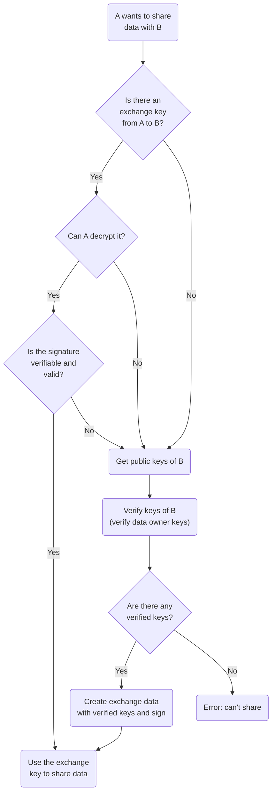

### Decryption-only keys

A data owner which lost access to his own key pairs and managed to recover partial access may not be able to verify recovered key pairs or exchange keys, even if they are authentic. In order to prevent loss of data in these cases we will still use recovered and unverified keys for decryption of existing data, but not for:

- Encrypting and signing new data, including medical data and key recovery data
- Sharing new or existing data
- Signature verification on existing data


> **warning:**
This means that an attacker could insert fake data in the database and make it seem legit by encrypting it with a fake encryption key. We currently do not have protection against this type of attack in case the attacker has already gained access to the database.


### Data owner keys verification methods

Data owner key verification methods are not part of the Cardinal SDK because by design they should be implemented by the application, but we can give some ideas and guidelines on how this kind of verification could be implemented. Some potential solutions would include:

- Human friendly representation of public keys, for example by hashing it and then representing the hash using:
- Randomart (the one generated by `ssh-keygen`)
- Emojis, like what telegram does for calls
- Words from a dictionary or name list
- [Robohashes](https://robohash.org) ([note that the license requires attribution](https://github.com/e1ven/Robohash#license))
- A combination of the previous solutions (e.g. robohash face with name and 'personality' emoji)
- Suggest users to save / print their own public keys when creating a new one, since they do not need to be kept secret, and if any key is recovered through Cardinal's recovery methods compare the public key with the saved public keys.
- Qr-code of public keys and scanning by the application
- Hard-coding of some special public keys in the application logic, automatically considering them verified. Note that this solution could make it harder to recover from a private key leak: if not implemented properly users not using the latest version of the application may still share data with the attacker.
- Using an external service for public key verification. This has the benefit to not require any additional action by the user but could be quite challenging. The service needs to be updated when a new public key is inserted legitimately in Cardinal. If an entity (person or device) has administrator access to both the application database in Cardinal and the key verification service we have a single point of failure like before, just in a different place...

---


================================================================================
# PART 7: FILTER REFERENCE
================================================================================

<!-- Source: sdk/explanations/everything-about-filters.mdx -->

# Everything about filters

This page is a comprehensive reference for all filter factories available in the Cardinal SDK. It covers the filter
type hierarchy, combinators, date format conventions, and every filter method for each entity type.

For a gentler introduction to querying, see [Querying data](/how-to/querying-data).

## Data owner variants

Most filter factories for EBAC (Entity Based Access Control) entities (Patient, Contact, Service, HealthElement, Document, etc.) come in three variants:

| Suffix                | When to use                                                                                         |
|-----------------------|-----------------------------------------------------------------------------------------------------|
| `ForSelf`             | Default choice. Uses the current logged-in data owner.                                              |
| `ForDataOwner`        | When querying as an admin or on behalf of another data owner. Requires the data owner's id.         |
| `ForDataOwnerInGroup` | Cross-group queries. Takes an `EntityReferenceInGroup` to target a data owner in a different group. |

For more details, see [Data owners and access control](/explanations/end-to-end-encryption/data-owners-and-access-control).

## Sorting
Some filters return `SortableFilterOptions` (or `BaseSortableFilterOptions`) that can be used to sort results by specific criteria. The sorting rules are documented in the tables below.

## Combining filters

Filter options can be combined using three operators:

### intersection (AND)

Returns entities that match **all** provided filters. Requires at least two filters.


**kotlin:**


```kotlin test-AAGB
// Function call
val filter = intersection(filterA, filterB, filterC)
// Infix shorthand
val filter2 = filterA and filterB and filterC
```


**typescript:**


```typescript no-test

const filter = intersection(filterA, filterB, filterC)
```


**python:**


```python no-test
from cardinal_sdk.filters import intersection

filter = intersection(filter_a, filter_b, filter_c)
```


### union (OR)

Returns entities that match **at least one** of the provided filters. Requires at least two filters.


**kotlin:**


```kotlin test-AAGC
val filter = union(filterA, filterB)
// Infix shorthand
val filter2 = filterA or filterB
```


**typescript:**


```typescript no-test

const filter = union(filterA, filterB)
```


**python:**


```python no-test
from cardinal_sdk.filters import union

filter = union(filter_a, filter_b)
```


### difference (set minus)

Returns entities that match the first filter (`of`) but **not** the second (`subtracting`).


**kotlin:**


```kotlin test-AAGD
val filter = difference(ofFilter, subtractingFilter)
```


**typescript:**


```typescript no-test

const filter = difference(ofFilter, subtractingFilter)
```


**python:**


```python no-test
from cardinal_sdk.filters import difference

filter = difference(of_filter, subtracting_filter)
```


### Performance considerations

- **intersection** can sometimes be misleading in terms of performance. If the first filter is very broad and the second filter is very selective, the backend may still need to execute the first filter and possibly collect a huge number of entity ids, before being able to apply the second filter.
However, in some cases, the backend could optimized by the backend if the first filter is highly selective (i.e. it narrows down to a small set of entities). In that case, the backend could apply the second filter only to that small set, improving performance. This optimisation is not yet available in the Cardinl backend (but  we are working on it). It is something to keep in mind when using `intersection` with very broad filters.

- **difference** can also be costly if the `subtracting` filter is very broad. Even if the final number of entities returned by the difference is small, the backend may still need to execute the `subtracting` filter and collect a large number of entity ids to determine which ones to exclude.

### Sortability rules

| Combinator     | Sortable?                     | Rule                               |
|----------------|-------------------------------|------------------------------------|
| `intersection` | If first argument is sortable | Sorts by first argument's criteria |
| `union`        | Never                         | —                                  |
| `difference`   | If `of` is sortable           | Sorts by `of`'s criteria           |


> **TIP: Kotlin infix syntax**

In Kotlin, `and` is shorthand for `intersection` and `or` for `union`. You can also use the minus `-` sign for difference. You can chain them:
```kotlin test-AAGE
val filter = (filterA and filterB) or (filterC and (filterD - filterE))
val sameFilter = union(intersection(filterA, filterB), intersection(filterC, difference(filterD, filterE)))
```


## Date format conventions

Different entity properties use different date formats:

| Format              | Description              | Used by                                                                                                                                  |
|---------------------|--------------------------|------------------------------------------------------------------------------------------------------------------------------------------|
| `YYYYMMDD`          | 8-digit integer date     | `Patient.dateOfBirth`                                                                                                                    |
| `YYYYMMDDHHmmSS`    | 14-digit fuzzy date      | `Contact.openingDate`, `Service.valueDate`, `Service.openingDate`, `HealthElement.openingDate`, `Form.created`, `CalendarItem.startTime` |
| Unix timestamp (ms) | Milliseconds since epoch | `Document.created`, `Message.sentDate`                                                                                                   |

For example, `20250315` means March 15, 2025. The fuzzy date `20250315143000` means March 15, 2025 at 14:30:00.

## Code and tag filtering patterns

Many entities have **codes** (clinical coding: ICD-10, SNOMED, LOINC, etc.) and **tags** (categorical labels).

### Type-only vs type+code

When you provide only a `codeType`/`tagType` and omit the code value, the filter matches all entities with **any** code
of that type. When you also provide a `codeCode`/`tagCode`, the filter narrows to that specific code.

### Code+date compound filters

For Contacts and Services, the code/tag filters support an optional date range. However, **you must provide the code
value to use a date range** — type-only filtering with a date range is not supported and will throw an error.

### byServiceTag / byServiceCode on ContactFilters

`ContactFilters` has special `byServiceTag` and `byServiceCode` methods that match contacts based on codes or tags
present on their **services** rather than on the contact itself. These are useful when you want to find contacts that
contain services with specific clinical codes.

## Patient-linked entity filters

### byPatients vs byPatientsSecretIds

Most EBAC entity filters provide two patterns for filtering by linked patients:

- **`byPatients`** — accepts `Patient` objects. The SDK automatically extracts secret ids. Cannot be used with
`CardinalBaseApis`. This is the convenient option for most use cases.
- **`byPatientsSecretIds` / `byPatientSecretIds`** — accepts raw secret id strings. Use this when you already have the
secret ids or need to work with `CardinalBaseApis`.

### Date-range variants

Many patient-linked filters also accept `from`/`to` date bounds and a `descending` flag for sorting:

| Entity         | Method                  | Date property                                 |
|----------------|-------------------------|-----------------------------------------------|
| Contact        | `byPatientsOpeningDate` | `Contact.openingDate`                         |
| Service        | `byPatientsDate`        | `Service.valueDate` (fallback: `openingDate`) |
| HealthElement  | `byPatientsOpeningDate` | `HealthElement.openingDate`                   |
| Document       | `byPatientsCreated`     | `Document.created`                            |
| Message        | `byPatientsSentDate`    | `Message.sentDate`                            |
| CalendarItem   | `byPatientsStartTime`   | `CalendarItem.startTime`                      |
| Form           | `byPatientsOpeningDate` | `Form.created`                                |
| Classification | `byPatientsCreated`     | `Classification.created`                      |
| AccessLog      | `byPatientsDate`        | `AccessLog.date`                              |

---

## Entity filter reference

The tables below list the **ForSelf** variant of each method. For most methods, equivalent `ForDataOwner` and
`ForDataOwnerInGroup` variants exist (prepend the data owner id or `EntityReferenceInGroup` as first argument).
Methods with no data-owner scoping are marked with **—** in the Scoping column.

### PatientFilters

| Method                                  | Key parameters                               | Return type             | Sortable? | Sort order                         |
|-----------------------------------------|----------------------------------------------|-------------------------|-----------|------------------------------------|
| `allPatientsForSelf`                    | —                                            | `FilterOptions`         | No        | —                                  |
| `byIds`                                 | `ids`                                        | `SortableFilterOptions` | Yes       | Input order                        |
| `byIdentifiersForSelf`                  | `identifiers`                                | `SortableFilterOptions` | Yes       | Input order                        |
| `bySsinsForSelf`                        | `ssins`                                      | `SortableFilterOptions` | Yes       | Input order                        |
| `byDateOfBirthBetweenForSelf`           | `fromDate`, `toDate`                         | `SortableFilterOptions` | Yes       | Date of birth                      |
| `byNameForSelf`                         | `searchString`                               | `FilterOptions`         | No        | —                                  |
| `byGenderEducationProfessionForSelf`    | `gender`, `education?`, `profession?`        | `SortableFilterOptions` | Yes       | Education, profession              |
| `byActiveForSelf`                       | `active`                                     | `FilterOptions`         | No        | —                                  |
| `byTelecomForSelf`                      | `searchString`                               | `SortableFilterOptions` | Yes       | Telecom number                     |
| `byAddressPostalCodeHouseNumberForSelf` | `searchString`, `postalCode`, `houseNumber?` | `SortableFilterOptions` | Yes       | Address, postal code, house number |
| `byAddressForSelf`                      | `searchString`                               | `SortableFilterOptions` | Yes       | Address                            |
| `byTagForSelf`                          | `tagType`, `tagCode?`                        | `FilterOptions`         | No        | —                                  |


> **note:**
`byIds` has no data-owner scoping — it returns a `SortableFilterOptions` (not Base) and works the same for all users.
The `ForDataOwner` variants for the other methods also exist (e.g. `byFuzzyNameForDataOwner` accepts a `dataOwnerId` + `searchString`).


### ContactFilters

| Method                                 | Key parameters                                                                    | Return type                 | Sortable? | Sort order          |
|----------------------------------------|-----------------------------------------------------------------------------------|-----------------------------|-----------|---------------------|
| `allContactsForSelf`                   | —                                                                                 | `FilterOptions`             | No        | —                   |
| `byFormIdsForSelf`                     | `formIds`                                                                         | `FilterOptions`             | No        | —                   |
| `byPatientsOpeningDateForSelf`         | `patients`, `from?`, `to?`, `descending?`                                         | `SortableFilterOptions`     | Yes       | `openingDate`       |
| `byPatientSecretIdsOpeningDateForSelf` | `secretIds`, `from?`, `to?`, `descending?`                                        | `SortableFilterOptions`     | Yes       | `openingDate`       |
| `byIdentifiersForSelf`                 | `identifiers`                                                                     | `SortableFilterOptions`     | Yes       | Input order         |
| `byCodeAndOpeningDateForSelf`          | `codeType`, `codeCode?`, `startOfContactOpeningDate?`, `endOfContactOpeningDate?` | `SortableFilterOptions`     | Yes       | Code, `openingDate` |
| `byTagAndOpeningDateForSelf`           | `tagType`, `tagCode?`, `startOfContactOpeningDate?`, `endOfContactOpeningDate?`   | `SortableFilterOptions`     | Yes       | Tag, `openingDate`  |
| `byOpeningDateForSelf`                 | `startDate?`, `endDate?`, `descending?`                                           | `SortableFilterOptions`     | Yes       | `openingDate`       |
| `byServiceTagForSelf`                  | `tagType`, `tagCode?`                                                             | `FilterOptions`             | No        | —                   |
| `byServiceCodeForSelf`                 | `codeType`, `codeCode?`                                                           | `FilterOptions`             | No        | —                   |
| `byPatientsForSelf`                    | `patients`                                                                        | `SortableFilterOptions`     | Yes       | Input order         |
| `byPatientsSecretIdsForSelf`           | `secretIds`                                                                       | `SortableFilterOptions`     | Yes       | Input order         |
| `byServiceIds`                         | `serviceIds`                                                                      | `BaseSortableFilterOptions` | Yes       | Input order         |

### ServiceFilters

| Method                                   | Key parameters                                                                | Return type                 | Sortable? | Sort order        |
|------------------------------------------|-------------------------------------------------------------------------------|-----------------------------|-----------|-------------------|
| `allServicesForSelf`                     | —                                                                             | `FilterOptions`             | No        | —                 |
| `byIdentifiersForSelf`                   | `identifiers`                                                                 | `SortableFilterOptions`     | Yes       | Input order       |
| `byCodeAndValueDateForSelf`              | `codeType`, `codeCode?`, `startOfServiceValueDate?`, `endOfServiceValueDate?` | `SortableFilterOptions`     | Yes       | Code, `valueDate` |
| `byTagAndValueDateForSelf`               | `tagType`, `tagCode?`, `startOfServiceValueDate?`, `endOfServiceValueDate?`   | `SortableFilterOptions`     | Yes       | Tag, `valueDate`  |
| `byPatientsForSelf`                      | `patients`                                                                    | `SortableFilterOptions`     | Yes       | Input order       |
| `byPatientsSecretIdsForSelf`             | `secretIds`                                                                   | `SortableFilterOptions`     | Yes       | Input order       |
| `byHealthElementIdFromSubContactForSelf` | `healthElementIds`                                                            | `SortableFilterOptions`     | Yes       | Input order       |
| `byPatientsDateForSelf`                  | `patients`, `from?`, `to?`, `descending?`                                     | `SortableFilterOptions`     | Yes       | `valueDate`       |
| `byPatientSecretIdsDateForSelf`          | `secretIds`, `from?`, `to?`, `descending?`                                    | `SortableFilterOptions`     | Yes       | `valueDate`       |
| `byIds`                                  | `ids`                                                                         | `BaseSortableFilterOptions` | Yes       | Input order       |
| `byAssociationId`                        | `associationId`                                                               | `BaseFilterOptions`         | No        | —                 |
| `byQualifiedLink`                        | `linkValues`, `linkQualification?`                                            | `BaseFilterOptions`         | No        | —                 |

### HealthElementFilters

| Method                                 | Key parameters                             | Return type                 | Sortable? | Sort order    |
|----------------------------------------|--------------------------------------------|-----------------------------|-----------|---------------|
| `allHealthElementsForSelf`             | —                                          | `FilterOptions`             | No        | —             |
| `byIdentifiersForSelf`                 | `identifiers`                              | `SortableFilterOptions`     | Yes       | Input order   |
| `byCodeForSelf`                        | `codeType`, `codeCode?`                    | `SortableFilterOptions`     | Yes       | Code          |
| `byTagForSelf`                         | `tagType`, `tagCode?`                      | `SortableFilterOptions`     | Yes       | Tag           |
| `byPatientsForSelf`                    | `patients`                                 | `SortableFilterOptions`     | Yes       | Input order   |
| `byPatientsSecretIdsForSelf`           | `secretIds`                                | `SortableFilterOptions`     | Yes       | Input order   |
| `byIds`                                | `ids`                                      | `BaseSortableFilterOptions` | Yes       | Input order   |
| `byPatientsOpeningDateForSelf`         | `patients`, `from?`, `to?`, `descending?`  | `SortableFilterOptions`     | Yes       | `openingDate` |
| `byPatientSecretIdsOpeningDateForSelf` | `secretIds`, `from?`, `to?`, `descending?` | `SortableFilterOptions`     | Yes       | `openingDate` |

### DocumentFilters

| Method                                  | Key parameters                             | Return type             | Sortable? | Sort order |
|-----------------------------------------|--------------------------------------------|-------------------------|-----------|------------|
| `byPatientsCreatedForSelf`              | `patients`, `from?`, `to?`, `descending?`  | `SortableFilterOptions` | Yes       | `created`  |
| `byMessagesCreatedForSelf`              | `messages`, `from?`, `to?`, `descending?`  | `SortableFilterOptions` | Yes       | `created`  |
| `byOwningEntitySecretIdsCreatedForSelf` | `secretIds`, `from?`, `to?`, `descending?` | `SortableFilterOptions` | Yes       | `created`  |
| `byPatientsAndTypeForSelf`              | `documentType`, `patients`                 | `FilterOptions`         | No        | —          |
| `byMessagesAndTypeForSelf`              | `documentType`, `messages`                 | `FilterOptions`         | No        | —          |
| `byOwningEntitySecretIdsAndTypeForSelf` | `documentType`, `secretIds`                | `FilterOptions`         | No        | —          |
| `byCodeForSelf`                         | `codeType`, `codeCode?`                    | `SortableFilterOptions` | Yes       | Code       |
| `byTagForSelf`                          | `tagType`, `tagCode?`                      | `SortableFilterOptions` | Yes       | Tag        |

### HealthcarePartyFilters

Healthcare party filters are not data-owner scoped — they all return `Base*` types.

| Method                 | Key parameters                | Return type                 | Sortable? | Sort order      |
|------------------------|-------------------------------|-----------------------------|-----------|-----------------|
| `all`                  | —                             | `BaseFilterOptions`         | No        | —               |
| `byIdentifiers`        | `identifiers`                 | `BaseFilterOptions`         | No        | —               |
| `byCode`               | `codeType`, `codeCode?`       | `BaseSortableFilterOptions` | Yes       | Code            |
| `byTag`                | `tagType`, `tagCode?`         | `BaseSortableFilterOptions` | Yes       | Tag             |
| `byIds`                | `ids`                         | `SortableFilterOptions`     | Yes       | Input order     |
| `byName`               | `searchString`, `descending?` | `BaseSortableFilterOptions` | Yes       | Name/speciality |
| `byNationalIdentifier` | `searchString`, `descending?` | `BaseSortableFilterOptions` | Yes       | SSIN            |
| `byParentId`           | `parentId`                    | `BaseFilterOptions`         | No        | —               |

### Other entity filters

#### UserFilters

| Method                | Key parameters      | Return type                 | Sortable? |
|-----------------------|---------------------|-----------------------------|-----------|
| `all`                 | —                   | `BaseFilterOptions`         | No        |
| `byIds`               | `ids`               | `BaseSortableFilterOptions` | Yes       |
| `byPatientId`         | `patientId`         | `BaseFilterOptions`         | No        |
| `byHealthcarePartyId` | `healthcarePartyId` | `BaseFilterOptions`         | No        |
| `byNameEmailOrPhone`  | `searchString`      | `BaseFilterOptions`         | No        |

#### CodeFilters

| Method                              | Key parameters                                      | Return type                 | Sortable? |
|-------------------------------------|-----------------------------------------------------|-----------------------------|-----------|
| `all`                               | —                                                   | `BaseFilterOptions`         | No        |
| `byIds`                             | `ids`                                               | `BaseSortableFilterOptions` | Yes       |
| `byQualifiedLink`                   | `linkType`, `linkedId?`                             | `BaseFilterOptions`         | No        |
| `byRegionTypeCodeVersion`           | `region`, `type?`, `code?`, `version?`              | `BaseFilterOptions`         | No        |
| `byLanguageTypeLabelRegion`         | `language`, `type`, `label?`, `region?`             | `BaseFilterOptions`         | No        |
| `byLanguageTypesLabelRegionVersion` | `language`, `types`, `label`, `region?`, `version?` | `BaseFilterOptions`         | No        |

#### MessageFilters

| Method                              | Key parameters                                   | Return type             | Sortable? |
|-------------------------------------|--------------------------------------------------|-------------------------|-----------|
| `allMessagesForSelf`                | —                                                | `FilterOptions`         | No        |
| `byTransportGuidForSelf`            | `transportGuid`                                  | `SortableFilterOptions` | Yes       |
| `fromAddressForSelf`                | `address`                                        | `FilterOptions`         | No        |
| `toAddressForSelf`                  | `address`                                        | `FilterOptions`         | No        |
| `byPatientsSentDateForSelf`         | `patients`, `from?`, `to?`, `descending?`        | `SortableFilterOptions` | Yes       |
| `byPatientSecretIdsSentDateForSelf` | `secretIds`, `from?`, `to?`, `descending?`       | `SortableFilterOptions` | Yes       |
| `byTransportGuidSentDateForSelf`    | `transportGuid`, `from`, `to`, `descending?`     | `SortableFilterOptions` | Yes       |
| `latestByTransportGuidForSelf`      | `transportGuid`                                  | `FilterOptions`         | No        |
| `lifecycleBetweenForSelf`           | `startTimestamp?`, `endTimestamp?`, `descending` | `FilterOptions`         | No        |
| `byCodeForSelf`                     | `codeType`, `codeCode?`                          | `SortableFilterOptions` | Yes       |
| `byTagForSelf`                      | `tagType`, `tagCode?`                            | `SortableFilterOptions` | Yes       |
| `byInvoiceIds`                      | `invoiceIds`                                     | `BaseFilterOptions`     | No        |
| `byParentIds`                       | `parentIds`                                      | `BaseFilterOptions`     | No        |

#### CalendarItemFilters

| Method                               | Key parameters                                   | Return type                 | Sortable? |
|--------------------------------------|--------------------------------------------------|-----------------------------|-----------|
| `byPatientsStartTimeForSelf`         | `patients`, `from?`, `to?`, `descending?`        | `SortableFilterOptions`     | Yes       |
| `byPatientSecretIdsStartTimeForSelf` | `secretIds`, `from?`, `to?`, `descending?`       | `SortableFilterOptions`     | Yes       |
| `byPeriodAndAgenda`                  | `agendaId`, `from`, `to`, `descending?`          | `BaseSortableFilterOptions` | Yes       |
| `byPeriodForSelf`                    | `from`, `to`                                     | `FilterOptions`             | No        |
| `byRecurrenceId`                     | `recurrenceId`                                   | `FilterOptions`             | No        |
| `lifecycleBetweenForSelf`            | `startTimestamp?`, `endTimestamp?`, `descending` | `FilterOptions`             | No        |

#### GroupFilters

| Method         | Key parameters                 | Return type                 | Sortable? |
|----------------|--------------------------------|-----------------------------|-----------|
| `all`          | —                              | `BaseFilterOptions`         | No        |
| `bySuperGroup` | `superGroupId`                 | `BaseFilterOptions`         | No        |
| `withContent`  | `superGroupId`, `searchString` | `BaseSortableFilterOptions` | Yes       |

#### FormFilters

| Method                                 | Key parameters                             | Return type                 | Sortable? |
|----------------------------------------|--------------------------------------------|-----------------------------|-----------|
| `byParentIdForSelf`                    | `parentId`                                 | `FilterOptions`             | No        |
| `byPatientsOpeningDateForSelf`         | `patients`, `from?`, `to?`, `descending?`  | `SortableFilterOptions`     | Yes       |
| `byPatientSecretIdsOpeningDateForSelf` | `secretIds`, `from?`, `to?`, `descending?` | `SortableFilterOptions`     | Yes       |
| `byUniqueId`                           | `uniqueId`, `descending?`                  | `BaseSortableFilterOptions` | Yes       |

#### AccessLogFilters

| Method                          | Key parameters                                  | Return type                 | Sortable? |
|---------------------------------|-------------------------------------------------|-----------------------------|-----------|
| `byPatientsDateForSelf`         | `patients`, `from?`, `to?`, `descending?`       | `SortableFilterOptions`     | Yes       |
| `byPatientSecretIdsDateForSelf` | `secretIds`, `from?`, `to?`, `descending?`      | `SortableFilterOptions`     | Yes       |
| `byDate`                        | `from?`, `to?`, `descending?`                   | `BaseSortableFilterOptions` | Yes       |
| `byUserTypeDate`                | `userId`, `accessType?`, `from?`, `descending?` | `BaseSortableFilterOptions` | Yes       |

#### DeviceFilters

| Method          | Key parameters  | Return type                 | Sortable? |
|-----------------|-----------------|-----------------------------|-----------|
| `all`           | —               | `BaseFilterOptions`         | No        |
| `byResponsible` | `responsibleId` | `BaseFilterOptions`         | No        |
| `byIds`         | `ids`           | `BaseSortableFilterOptions` | Yes       |

#### AgendaFilters

| Method                 | Key parameters                | Return type         | Sortable? |
|------------------------|-------------------------------|---------------------|-----------|
| `all`                  | —                             | `BaseFilterOptions` | No        |
| `byUser`               | `userId`                      | `BaseFilterOptions` | No        |
| `readableByUser`       | `userId`                      | `BaseFilterOptions` | No        |
| `readableByUserRights` | `userId`                      | `BaseFilterOptions` | No        |
| `byStringProperty`     | `propertyId`, `propertyValue` | `BaseFilterOptions` | No        |
| `byBooleanProperty`    | `propertyId`, `propertyValue` | `BaseFilterOptions` | No        |
| `byLongProperty`       | `propertyId`, `propertyValue` | `BaseFilterOptions` | No        |
| `byDoubleProperty`     | `propertyId`, `propertyValue` | `BaseFilterOptions` | No        |
| `withProperty`         | `propertyId`                  | `BaseFilterOptions` | No        |

#### TopicFilters

| Method             | Key parameters  | Return type     | Sortable? |
|--------------------|-----------------|-----------------|-----------|
| `allTopicsForSelf` | —               | `FilterOptions` | No        |
| `byParticipant`    | `participantId` | `FilterOptions` | No        |

---

## Complex filter examples

### 1. Diabetic patient screening cohort

Find active female patients over 50 with an ICD-10 E11 (type 2 diabetes) diagnosis. This requires a cross-entity
query: first find patients matching demographic criteria, then check their health elements for the diagnosis code.


**kotlin:**


```kotlin test-AAGF
import com.icure.cardinal.sdk.CardinalSdk
import com.icure.cardinal.sdk.filters.HealthElementFilters
import com.icure.cardinal.sdk.filters.PatientFilters
import com.icure.cardinal.sdk.filters.intersection
import com.icure.cardinal.sdk.model.DecryptedPatient
import com.icure.cardinal.sdk.model.embed.Gender

suspend fun findDiabeticScreeningCohort(sdk: CardinalSdk): List<DecryptedPatient> {
	// Step 1: Find active females born before 1976 (over ~50)
	val patientFilter = intersection(
		PatientFilters.byGenderEducationProfessionForSelf(Gender.Female),
		PatientFilters.byDateOfBirthBetweenForSelf(
			fromDate = 19000101,
			toDate = 19760101
		),
		PatientFilters.byActiveForSelf(true)
	)
	val candidates = sdk.patient.getPatients(
		sdk.patient.matchPatientsBy(patientFilter)
	)

	// Step 2: For each candidate, check for ICD-10 E11 health elements
	val diabetesFilter = intersection(
		HealthElementFilters.byPatientsForSelf(candidates),
		HealthElementFilters.byCodeForSelf("ICD-10", codeCode = "E11")
	)
	val diabeticPatientIds = mutableSetOf<String>()
	val heIterator = sdk.healthElement.filterHealthElementsBy(diabetesFilter)
	while (heIterator.hasNext()) {
		heIterator.next(100).forEach { he ->
			he.id.let { diabeticPatientIds.add(it) }
		}
	}

	return candidates.filter { it.id in diabeticPatientIds }
}
```


**typescript:**


```typescript no-test
import {
	CardinalSdk,
	DecryptedPatient,
	Gender,
	HealthElementFilters,
	intersection,
	PatientFilters,
} from "@icure/cardinal-sdk"

async function findDiabeticScreeningCohort(sdk: CardinalSdk): Promise<Array<DecryptedPatient>> {
	// Step 1: Find active females born before 1976 (over ~50)
	const patientFilter = intersection(
		PatientFilters.byGenderEducationProfessionForSelf(Gender.Female),
		PatientFilters.byDateOfBirthBetweenForSelf(19000101, 19760101),
		PatientFilters.byActiveForSelf(true)
	)
	const candidates = await sdk.patient.getPatients(
		await sdk.patient.matchPatientsBy(patientFilter)
	)

	// Step 2: For each candidate, check for ICD-10 E11 health elements
	const diabetesFilter = intersection(
		HealthElementFilters.byPatientsForSelf(candidates),
		HealthElementFilters.byCodeForSelf("ICD-10", { codeCode: "E11" })
	)
	const diabeticPatientIds = new Set<string>()
	const heIterator = await sdk.healthElement.filterHealthElementsBy(diabetesFilter)
	while (await heIterator.hasNext()) {
		const batch = await heIterator.next(100)
		batch.forEach(he => diabeticPatientIds.add(he.id))
	}

	return candidates.filter(p => diabeticPatientIds.has(p.id))
}
```


**python:**


```python no-test
from cardinal_sdk import CardinalSdk
from cardinal_sdk.model import DecryptedPatient, Gender
from cardinal_sdk.filters import PatientFilters, HealthElementFilters, intersection
from typing import List

def find_diabetic_screening_cohort(sdk: CardinalSdk) -> List[DecryptedPatient]:
    # Step 1: Find active females born before 1976 (over ~50)
    patient_filter = intersection(
        PatientFilters.by_gender_education_profession_for_self(Gender.Female),
        PatientFilters.by_date_of_birth_between_for_self(19000101, 19760101),
        PatientFilters.by_active_for_self(True)
    )
    candidates = sdk.patient.get_patients_blocking(
        sdk.patient.match_patients_by_blocking(patient_filter)
    )

    # Step 2: For each candidate, check for ICD-10 E11 health elements
    diabetes_filter = intersection(
        HealthElementFilters.by_patients_for_self(candidates),
        HealthElementFilters.by_code_for_self("ICD-10", code_code="E11")
    )
    diabetic_patient_ids = set()
    he_iterator = sdk.health_element.filter_health_elements_by_blocking(diabetes_filter)
    while he_iterator.has_next_blocking():
        for he in he_iterator.next_blocking(100):
            diabetic_patient_ids.add(he.id)

    return [p for p in candidates if p.id in diabetic_patient_ids]
```


### 2. Post-operative follow-up contacts

Find all contacts for a patient in the past 30 days, excluding contacts tagged as "administrative".


**kotlin:**


```kotlin test-AAGG
import com.icure.cardinal.sdk.CardinalSdk
import com.icure.cardinal.sdk.filters.ContactFilters
import com.icure.cardinal.sdk.filters.difference
import com.icure.cardinal.sdk.model.DecryptedContact
import com.icure.cardinal.sdk.model.Patient
import com.icure.cardinal.sdk.utils.pagination.PaginatedListIterator

suspend fun getPostOpFollowUpContacts(
	sdk: CardinalSdk,
	patient: Patient,
	thirtyDaysAgoFuzzy: Long
): PaginatedListIterator<DecryptedContact> {
	val filter = difference(
		of = ContactFilters.byPatientsOpeningDateForSelf(
			listOf(patient),
			from = thirtyDaysAgoFuzzy
		),
		subtracting = ContactFilters.byTagAndOpeningDateForSelf(
			"CD-LIFECYCLE",
			tagCode = "administrative"
		)
	)
	return sdk.contact.filterContactsBySorted(filter)
}
```


**typescript:**


```typescript no-test
import {
	CardinalSdk,
	ContactFilters,
	DecryptedContact,
	difference,
	PaginatedListIterator,
	Patient,
} from "@icure/cardinal-sdk"

function getPostOpFollowUpContacts(
	sdk: CardinalSdk,
	patient: Patient,
	thirtyDaysAgoFuzzy: number
): Promise<PaginatedListIterator<DecryptedContact>> {
	const filter = difference(
		ContactFilters.byPatientsOpeningDateForSelf(
			[patient],
			{ from: thirtyDaysAgoFuzzy }
		),
		ContactFilters.byTagAndOpeningDateForSelf(
			"CD-LIFECYCLE",
			{ tagCode: "administrative" }
		)
	)
	return sdk.contact.filterContactsBySorted(filter)
}
```


**python:**


```python no-test
from cardinal_sdk import CardinalSdk
from cardinal_sdk.model import Patient, DecryptedContact
from cardinal_sdk.filters import ContactFilters, difference
from cardinal_sdk.pagination.PaginatedListIterator import PaginatedListIterator

def get_post_op_follow_up_contacts(
    sdk: CardinalSdk,
    patient: Patient,
    thirty_days_ago_fuzzy: int
) -> PaginatedListIterator[DecryptedContact]:
    filter = difference(
        ContactFilters.by_patients_opening_date_for_self(
            [patient],
            _from=thirty_days_ago_fuzzy
        ),
        ContactFilters.by_tag_and_opening_date_for_self(
            "CD-LIFECYCLE",
            tag_code="administrative"
        )
    )
    return sdk.contact.filter_contacts_by_sorted_blocking(filter)
```


### 3. Lab results over a date range

Retrieve all LOINC-coded blood glucose (code 2345-7) services for a patient in the last year, sorted by value date
(most recent first).


**kotlin:**


```kotlin test-AAGH
import com.icure.cardinal.sdk.CardinalSdk
import com.icure.cardinal.sdk.filters.ServiceFilters
import com.icure.cardinal.sdk.filters.intersection
import com.icure.cardinal.sdk.model.Patient
import com.icure.cardinal.sdk.model.embed.DecryptedService
import com.icure.cardinal.sdk.utils.pagination.PaginatedListIterator

suspend fun getBloodGlucoseResults(
	sdk: CardinalSdk,
	patient: Patient,
	oneYearAgoFuzzy: Long
): PaginatedListIterator<DecryptedService> {
	val filter = intersection(
		ServiceFilters.byPatientsDateForSelf(
			listOf(patient),
			from = oneYearAgoFuzzy,
			descending = true
		),
		ServiceFilters.byCodeAndValueDateForSelf(
			"LOINC",
			codeCode = "2345-7"
		)
	)
	return sdk.contact.filterServicesBySorted(filter)
}
```


**typescript:**


```typescript no-test
import {
	CardinalSdk,
	DecryptedService,
	intersection,
	PaginatedListIterator,
	Patient,
	ServiceFilters,
} from "@icure/cardinal-sdk"

function getBloodGlucoseResults(
	sdk: CardinalSdk,
	patient: Patient,
	oneYearAgoFuzzy: number
): Promise<PaginatedListIterator<DecryptedService>> {
	const filter = intersection(
		ServiceFilters.byPatientsDateForSelf(
			[patient],
			{ from: oneYearAgoFuzzy, descending: true }
		),
		ServiceFilters.byCodeAndValueDateForSelf(
			"LOINC",
			{ codeCode: "2345-7" }
		)
	)
	return sdk.contact.filterServicesBySorted(filter)
}
```


**python:**


```python no-test
from cardinal_sdk import CardinalSdk
from cardinal_sdk.model import Patient, DecryptedService
from cardinal_sdk.filters import ServiceFilters, intersection
from cardinal_sdk.pagination.PaginatedListIterator import PaginatedListIterator

def get_blood_glucose_results(
    sdk: CardinalSdk,
    patient: Patient,
    one_year_ago_fuzzy: int
) -> PaginatedListIterator[DecryptedService]:
    filter = intersection(
        ServiceFilters.by_patients_date_for_self(
            [patient],
            _from=one_year_ago_fuzzy,
            descending=True
        ),
        ServiceFilters.by_code_and_value_date_for_self(
            "LOINC",
            code_code="2345-7"
        )
    )
    return sdk.contact.filter_services_by_sorted_blocking(filter)
```


### 4. Finding cardiologists excluding an organization

Find all healthcare parties with the SNOMED code for cardiologist (394579002), but exclude those belonging to a
specific parent organization.


**kotlin:**


```kotlin test-AAGI
import com.icure.cardinal.sdk.CardinalSdk
import com.icure.cardinal.sdk.filters.HealthcarePartyFilters
import com.icure.cardinal.sdk.filters.difference
import com.icure.cardinal.sdk.model.HealthcareParty
import com.icure.cardinal.sdk.utils.pagination.PaginatedListIterator

suspend fun findCardiologistsExcludingOrg(
	sdk: CardinalSdk,
	excludedOrgId: String
): PaginatedListIterator<HealthcareParty> {
	val filter = difference(
		of = HealthcarePartyFilters.byCode("SNOMED", codeCode = "394579002"),
		subtracting = HealthcarePartyFilters.byParentId(excludedOrgId)
	)
	return sdk.healthcareParty.filterHealthPartiesBySorted(filter)
}
```


**typescript:**


```typescript no-test
import {
	CardinalSdk,
	difference,
	HealthcareParty,
	HealthcarePartyFilters,
	PaginatedListIterator,
} from "@icure/cardinal-sdk"

function findCardiologistsExcludingOrg(
	sdk: CardinalSdk,
	excludedOrgId: string
): Promise<PaginatedListIterator<HealthcareParty>> {
	const filter = difference(
		HealthcarePartyFilters.byCode("SNOMED", { codeCode: "394579002" }),
		HealthcarePartyFilters.byParentId(excludedOrgId)
	)
	return sdk.healthcareParty.filterHealthPartiesBySorted(filter)
}
```


**python:**


```python no-test
from cardinal_sdk import CardinalSdk
from cardinal_sdk.model import HealthcareParty
from cardinal_sdk.filters import HealthcarePartyFilters, difference
from cardinal_sdk.pagination.PaginatedListIterator import PaginatedListIterator

def find_cardiologists_excluding_org(
    sdk: CardinalSdk,
    excluded_org_id: str
) -> PaginatedListIterator[HealthcareParty]:
    filter = difference(
        HealthcarePartyFilters.by_code("SNOMED", code_code="394579002"),
        HealthcarePartyFilters.by_parent_id(excluded_org_id)
    )
    return sdk.healthcare_party.filter_health_parties_by_sorted_blocking(filter)
```


### 5. Medications for elderly hypertensive patients

A multi-step cross-entity query: find elderly patients (over 65) with an ICD-10 I10 (essential hypertension) diagnosis,
then retrieve their medication services (tagged with ATC code system).


**kotlin:**


```kotlin test-AAGJ
import com.icure.cardinal.sdk.CardinalSdk
import com.icure.cardinal.sdk.filters.HealthElementFilters
import com.icure.cardinal.sdk.filters.PatientFilters
import com.icure.cardinal.sdk.filters.ServiceFilters
import com.icure.cardinal.sdk.filters.intersection
import com.icure.cardinal.sdk.model.embed.DecryptedService
import com.icure.cardinal.sdk.utils.pagination.PaginatedListIterator

suspend fun getMedicationsForElderlyHypertensives(
	sdk: CardinalSdk
): PaginatedListIterator<DecryptedService> {
	// Step 1: Find patients over 65
	val elderlyPatients = sdk.patient.getPatients(
		sdk.patient.matchPatientsBy(
			PatientFilters.byDateOfBirthBetweenForSelf(
				fromDate = 19000101,
				toDate = 19610101
			)
		)
	)

	// Step 2: Among those, find patients with I10 hypertension
	val hypertensionFilter = intersection(
		HealthElementFilters.byPatientsForSelf(elderlyPatients),
		HealthElementFilters.byCodeForSelf("ICD-10", codeCode = "I10")
	)
	val hypertensivePatientIds = mutableSetOf<String>()
	val heIterator = sdk.healthElement.filterHealthElementsBy(hypertensionFilter)
	while (heIterator.hasNext()) {
		heIterator.next(100).mapNotNullTo(hypertensivePatientIds) { it.id }
	}
	val hypertensivePatients = elderlyPatients.filter { it.id in hypertensivePatientIds }

	// Step 3: Get medication services for those patients
	val medicationFilter = intersection(
		ServiceFilters.byPatientsForSelf(hypertensivePatients),
		ServiceFilters.byTagAndValueDateForSelf("CD-ITEM", tagCode = "medication")
	)
	return sdk.contact.filterServicesBy(medicationFilter)
}
```


**typescript:**


```typescript no-test
import {
	CardinalSdk,
	DecryptedService,
	HealthElementFilters,
	intersection,
	PaginatedListIterator,
	PatientFilters,
	ServiceFilters,
} from "@icure/cardinal-sdk"

async function getMedicationsForElderlyHypertensives(
	sdk: CardinalSdk
): Promise<PaginatedListIterator<DecryptedService>> {
	// Step 1: Find patients over 65
	const elderlyPatients = await sdk.patient.getPatients(
		await sdk.patient.matchPatientsBy(
			PatientFilters.byDateOfBirthBetweenForSelf(19000101, 19610101)
		)
	)

	// Step 2: Among those, find patients with I10 hypertension
	const hypertensionFilter = intersection(
		HealthElementFilters.byPatientsForSelf(elderlyPatients),
		HealthElementFilters.byCodeForSelf("ICD-10", { codeCode: "I10" })
	)
	const hypertensivePatientIds = new Set<string>()
	const heIterator = await sdk.healthElement.filterHealthElementsBy(hypertensionFilter)
	while (await heIterator.hasNext()) {
		const batch = await heIterator.next(100)
		batch.forEach(he => hypertensivePatientIds.add(he.id))
	}
	const hypertensivePatients = elderlyPatients.filter(
		p => hypertensivePatientIds.has(p.id)
	)

	// Step 3: Get medication services for those patients
	const medicationFilter = intersection(
		ServiceFilters.byPatientsForSelf(hypertensivePatients),
		ServiceFilters.byTagAndValueDateForSelf("CD-ITEM", { tagCode: "medication" })
	)
	return sdk.contact.filterServicesBy(medicationFilter)
}
```


**python:**


```python no-test
from cardinal_sdk import CardinalSdk
from cardinal_sdk.model import DecryptedService
from cardinal_sdk.filters import (
    PatientFilters,
    HealthElementFilters,
    ServiceFilters,
    intersection,
)
from cardinal_sdk.pagination.PaginatedListIterator import PaginatedListIterator

def get_medications_for_elderly_hypertensives(
    sdk: CardinalSdk,
) -> PaginatedListIterator[DecryptedService]:
    # Step 1: Find patients over 65
    elderly_patients = sdk.patient.get_patients_blocking(
        sdk.patient.match_patients_by_blocking(
            PatientFilters.by_date_of_birth_between_for_self(19000101, 19610101)
        )
    )

    # Step 2: Among those, find patients with I10 hypertension
    hypertension_filter = intersection(
        HealthElementFilters.by_patients_for_self(elderly_patients),
        HealthElementFilters.by_code_for_self("ICD-10", code_code="I10")
    )
    hypertensive_patient_ids = set()
    he_iterator = sdk.health_element.filter_health_elements_by_blocking(
        hypertension_filter
    )
    while he_iterator.has_next_blocking():
        for he in he_iterator.next_blocking(100):
            hypertensive_patient_ids.add(he.id)
    hypertensive_patients = [
        p for p in elderly_patients if p.id in hypertensive_patient_ids
    ]

    # Step 3: Get medication services for those patients
    medication_filter = intersection(
        ServiceFilters.by_patients_for_self(hypertensive_patients),
        ServiceFilters.by_tag_and_value_date_for_self("CD-ITEM", tag_code="medication")
    )
    return sdk.contact.filter_services_by_blocking(medication_filter)
```

---


================================================================================
# PART 8: TROUBLESHOOTING
================================================================================

<!-- Source: sdk/troubleshooting/encryption.mdx -->

# Encryption Troubleshooting

### I cannot load my parent’s keys

If you are trying to load your parent’s keys and you get an error, it is likely that you haven't set the parentId in the healthcare party linked to your user.
Another common mistake is to forget to set the useHierarchicalDataOwners flag to true in the SDK options.

Because re-sharing all the information of a medical institution can be tedious, Cardinal allows you to automatically share information with a hierarchy of healthcare parties.
For example, if a doctor belongs to a hospital, you can set the hospital as the parent of the doctor.

When the doctor logs in, they will automatically get access to all the information shared with them and with the hospital.

### Could not decrypt any encryption key for ...

This error means that the you have the permissions to access an entity but you do not have any valid private key to decrypt the entity.

This can happen for several reasons:

* The data owner of the entity did not share the entity with you.
* You haven't load the key of the healthcare party with whom the entity was shared.
* You have load the key of the healthcare party with whom the entity was shared, but you have not set the key as verified.

---

