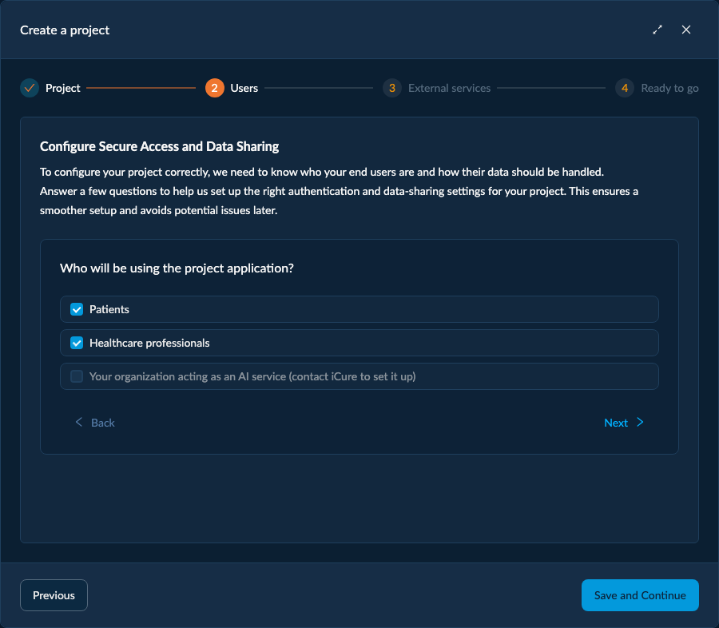
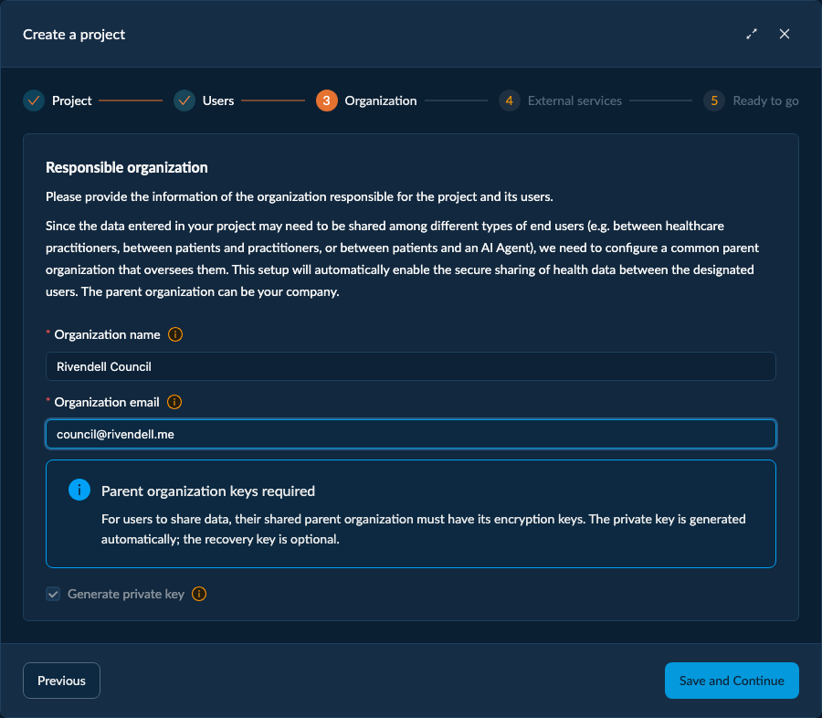
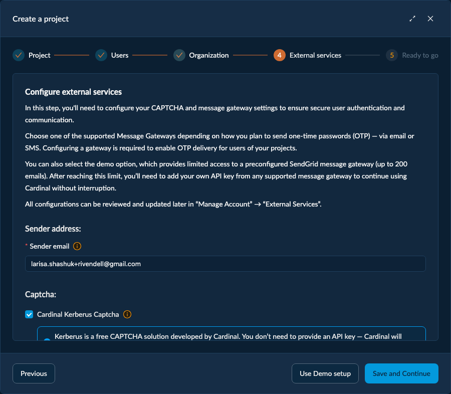
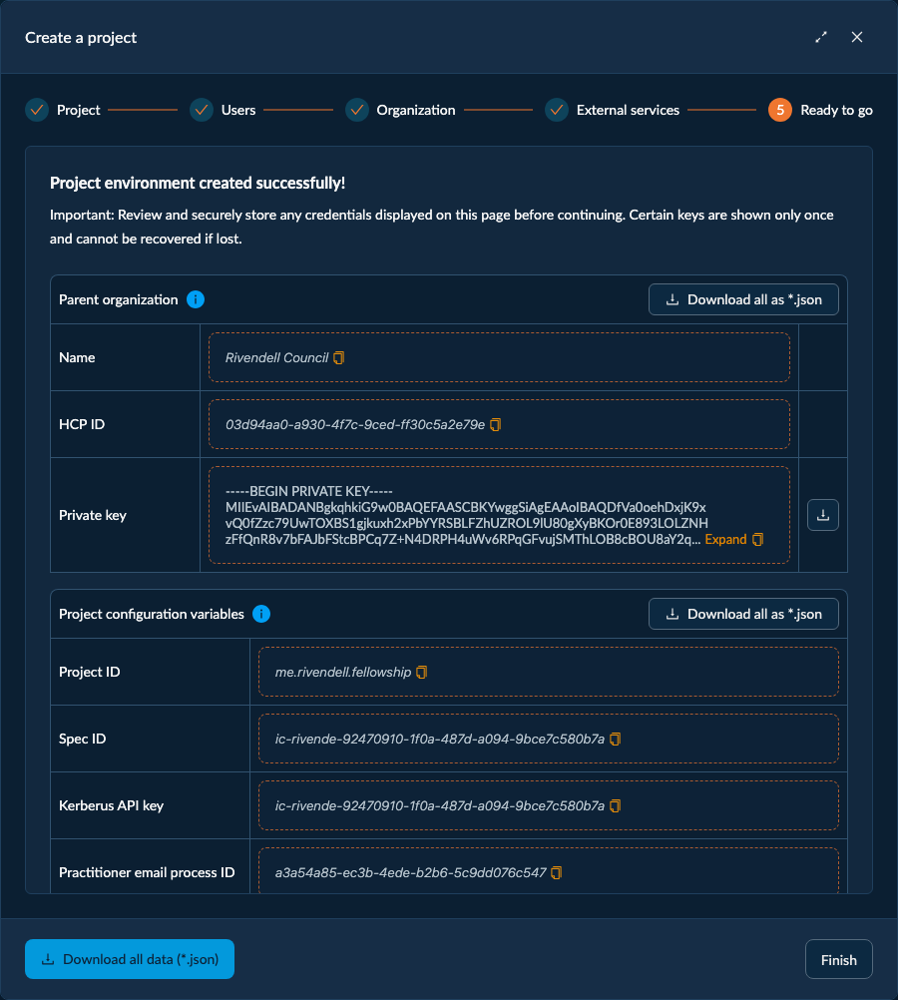

# Create Your First Project

Inside your Environment you can spin up a project in two ways:

- **Onboarding** *(recommended for your first time)* — a short guided flow that walks you through every
  decision and provisions a complete, ready-to-use setup: the project and its database, a questionnaire
  that tailors everything to your use case, an optional [parent organization](/cockpit/organization), your [external services](/cockpit/external-services-overview), and
  the [authentication processes](/cockpit/authentication-processes) your end users will log in with. It ends by handing you the configuration
  values your application needs.
- **Create a Project** — the same wizard without the welcome guidance, handy once you know your way around
  and just want to add another project to your Environment.

Both start from the dashboard: a brand-new Environment offers **Start onboarding** and **Create project**;
later, the **Create Project** button is always available.

:::info
Nothing is created until the final step. As you move through the flow Cockpit just collects your
choices — you can go back and change anything; the project, database, organization, services, and
authentication processes are all provisioned together when you finish.
:::

## The onboarding, step by step

### 1. Welcome

A short introduction. Click **Create Solution** (start onboarding) to begin.

### 2. Project

Name your project, give it a **Project ID**, and pick a **cluster**.

- The **Project ID** uses reverse-domain notation (e.g. `com.mycompany.myproject`). It keeps projects
  isolated: when a user can reach several databases, only those matching the Project ID are visible to
  your application.
- The **cluster** is the region where your data is hosted; choose the one closest to your users.

*Creates:* a new **[Project](/cockpit/project)** (a fresh iCure environment/group) and its first **database**. In Cockpit a
database is called a **[Tenant](/cockpit/tenant)**. A project starts with a single database — that is, **one tenant** — so by
default a project is **single-tenant**. You can switch it to **[multi-tenant](/cockpit/multitenancy)** later from its
**[Project Configuration](/cockpit/project-overview-and-configuration)** (the deployment-model setting), which lets the project hold several tenants.

### 3. Users (questionnaire)

A few questions describe who uses your application and how their data is shared. Your answers configure
the rest of the setup automatically:

- **Who will use the application?** — Patients, Healthcare professionals, and/or an AI service.
- **How are healthcare professionals organized?** — separate practices/clinics (**multi-tenant**) or one
  shared organization (**single-tenant**).
- **Can professionals see each other's data?** and **can all professionals access all patient records?** —
  these set the data-sharing rules.

*Impacts:* the **data-sharing** model, whether an **Organization** is created (next step), and **which
authentication processes** are generated for you. (The project is created single-tenant; switching it to
multi-tenant is done later from **Project Configuration**, not here.)

### 4. Organization *(only when needed)*

When your answers imply users share data, the flow asks you to create a **parent [Organization](/cockpit/organization)** — the
party that holds the **encryption key** used to share data between users.

- Its **private key is generated automatically** and can't be turned off — the organization needs it to
  encrypt and share data.
- A **recovery key is optional** (off by default). Enable it so you can restore access to the
  organization's data if its private key is ever lost. Like other keys, it's shown only once. See
  [Recovery & Private Keys](/cockpit/recovery-and-private-keys).

*Creates:* the parent **[Organization](/cockpit/organization)** (an HCP) with its private key — plus a recovery key if you enabled it.

:::info
This step is skipped when the questionnaire doesn't require a shared parent (e.g. a single isolated
organization with no cross-user sharing).
:::

### 5. External Services

Configure the gateways your project uses to reach your users, or click **Use Demo setup** to get started
quickly. **Demo setup is limited**: it includes **200 free emails** that we provide so you can test how
the product works — for real traffic, configure your own gateways.

- **[Email](/cockpit/external-services-email)** — SendGrid, SMTP, or Outlook.
- **[SMS](/cockpit/external-services-sms)** — Twilio, OVH, Ringring, or Swisscom.
- **[Captcha](/cockpit/external-services-captcha)** — reCAPTCHA, Friendly Captcha, or **[Kerberus](https://github.com/icure/kerberus)**.
  Kerberus is Cardinal's own proof-of-concept captcha — **free of charge**, so feel free to use it.

*Impacts:* these power the **[authentication processes](/cockpit/authentication-processes)** — they're how the one-time login codes are
actually sent to your end users.

### 6. Ready to go

This is the payoff step: Cockpit confirms your project was created and hands you everything you need to
connect your application. Take a moment here — some of it you can't get back later.

**Configuration values.** The identifiers the Cardinal SDK needs, each with a copy button:

- **Project [Application ID](/how-to/initialize-the-sdk/#application-id)** — your project's identifier (the reverse-domain ID you chose).
- **External Services Spec ID** — references the email/SMS/captcha configuration you set up.
- **Captcha site key(s)** — for reCAPTCHA / Friendly Captcha / Kerberus, depending on what you enabled.
- **Authentication process IDs** — one per channel and user type (e.g. patient vs practitioner, email vs
  SMS). Your application uses these so its end users can register and log in.

**Parent Organization** *(if you created one).* Its **name** and **ID**, plus the **private key** and —
only if you enabled it — the **recovery key**. These two are **downloadable** and shown **only once**:
save them now. If you lose the private key and have no recovery key, the organization's encrypted data
**cannot be recovered**.

**Download all as \*.json.** Exports the whole summary (all the values above, including the org keys) in
a single file — the easiest way to hand everything to your app or store it safely.

**Jump-start your app.** The step also links to ready-made **boilerplate apps** (React, React Native,
Node.js, Python) and **template apps** (Petra patient app, PetraCare EHR) you can clone to get going fast.

When you're done, click **Finish** to close the flow and land on your new project. Next, plug these values
into your application — see *Initialize the Cardinal SDK*.

## Where to go next

- **[Initialize the Cardinal SDK](/cockpit/initialize-the-cardinal-sdk)** — use the "Ready to go" values in your application.
- **[Managing Users](/cockpit/managing-users)** — add your first end users (HCPs, patients, devices).
- **[Project Overview & Configuration](/cockpit/project-overview-and-configuration)** — where your project's settings, IDs, and processes live afterwards.
- **[External Services](/cockpit/external-services-overview)** — set up your own email, SMS, and captcha gateways.
- **[Multitenancy](/cockpit/multitenancy)** — when and how to split a project into isolated tenants.

> **Cardinal SDK reference:** **[Initialize the SDK](/how-to/initialize-the-sdk/)** — connect your app once the project exists.
