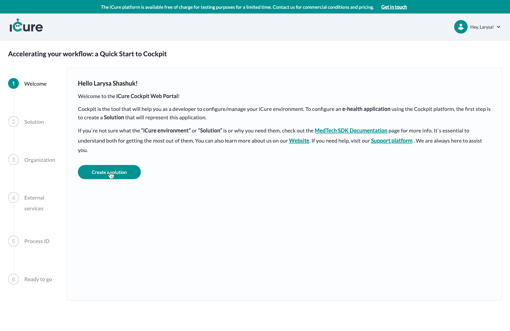
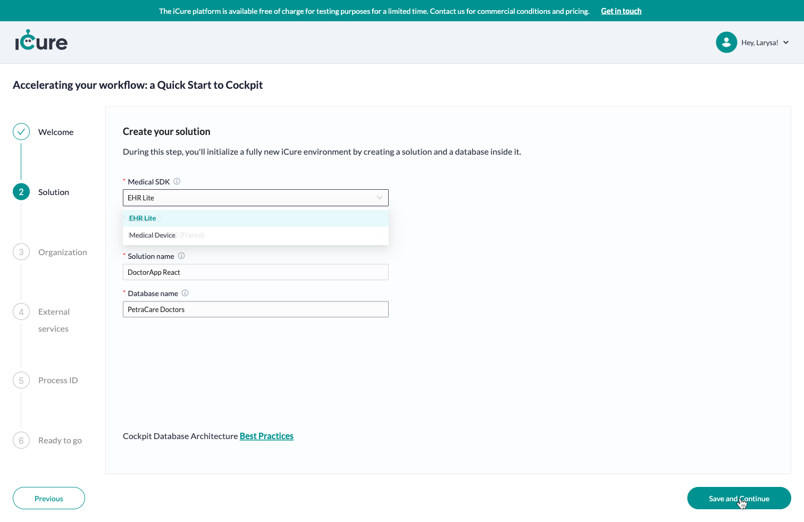
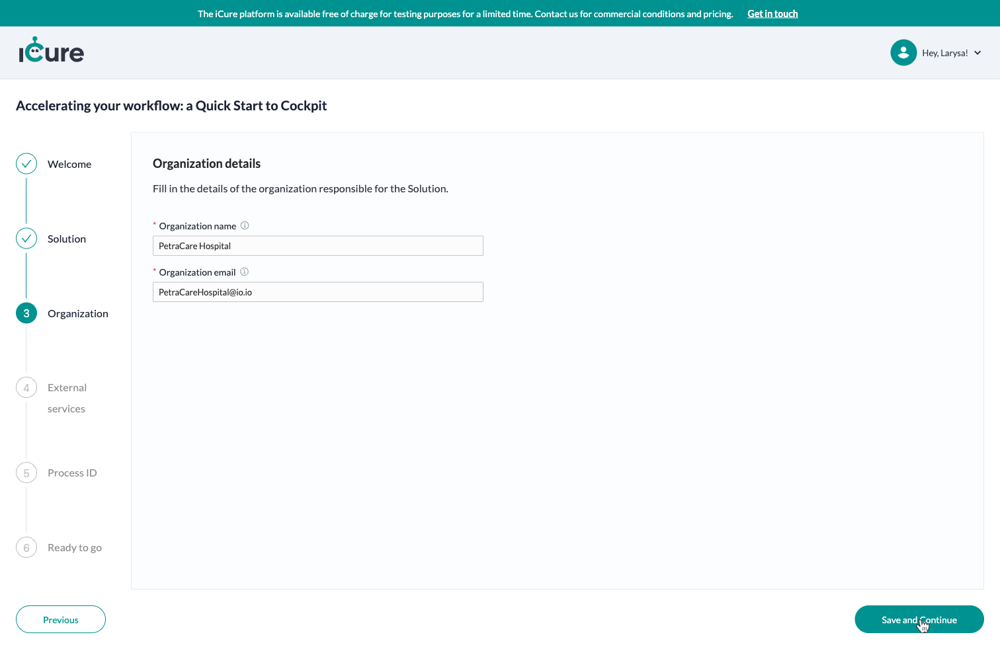
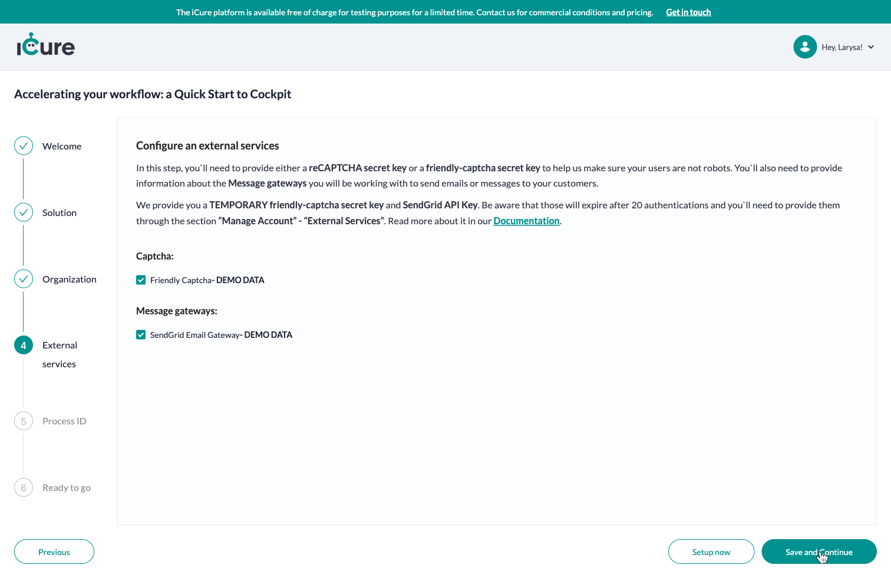
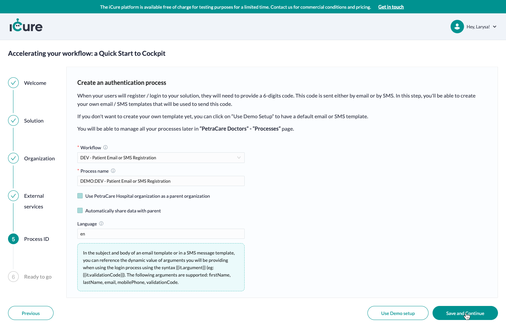
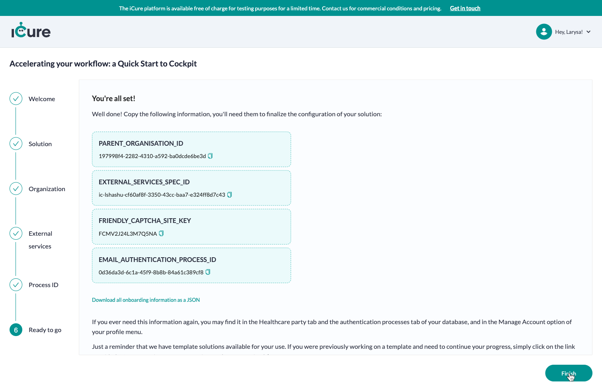

# Onboarding
Welcome to iCure! We're excited to have you on board. This documentation will guide you through the onboarding process to set up your solution seamlessly. Follow these six steps to get started.

## Step 1: Welcome
Click on the "Create Solution" button to initiate the onboarding process. This button will kickstart the configuration journey for your iCure solution.

## Step 2: Solution
Action: Choose SDK and Provide Solution Details
Choose SDK: Select the SDK that best fits your needs from the available options.
Provide Solution Details: Enter a unique name for your solution. Specify a name for the child database associated with your solution.
This step will initialize a fully new iCure environment by creating a solution and a database inside it.

## Step 3: Organization
Create an organization that will be responsible for managing the selected solution. This organizational structure will help streamline the administration and collaboration within iCure.

## Step 4: External Services
Action: Configure External Services
reCAPTCHA / Friendly-Captcha: Provide either your reCAPTCHA secret key or Friendly-Captcha secret key to ensure secure interactions.
Message Gateways:Enter information about the message gateways you will be using to send emails or messages to your customers.
Demo Setup (Optional):If you prefer a quick start, use the Demo Setup option to configure default settings.

## Step 5: Authentication Process
Action: Set Up Authentication Process
When users register/login, they need a 6-digit code sent via email or SMS.
Create Email/SMS Templates:Design custom templates for the authentication code. If you're not ready to create your own, use the "Use Demo Setup" option for default templates.

## Step 6: Configuration completed
In this step, you will find crucial information needed to finalize the configuration of your iCure solution. Review the details provided to ensure a smooth and accurate setup.

Congratulations! You've completed the onboarding process for your iCure solution. If you encounter any issues or have questions, feel free to refer to our comprehensive documentation or reach out to our support team for assistance.
