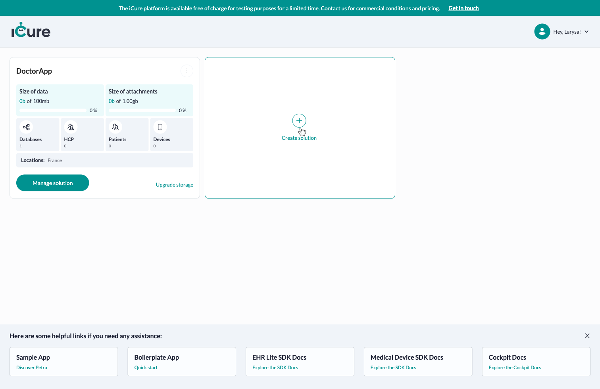
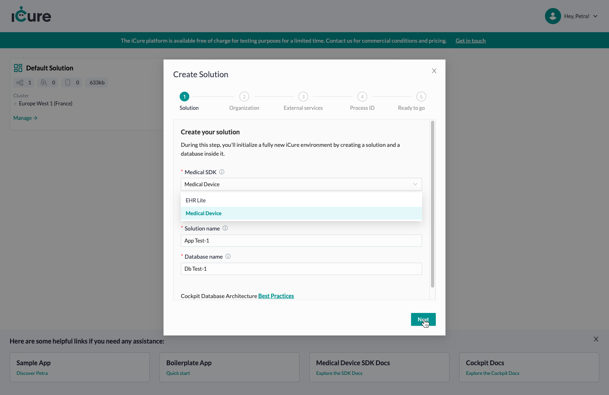
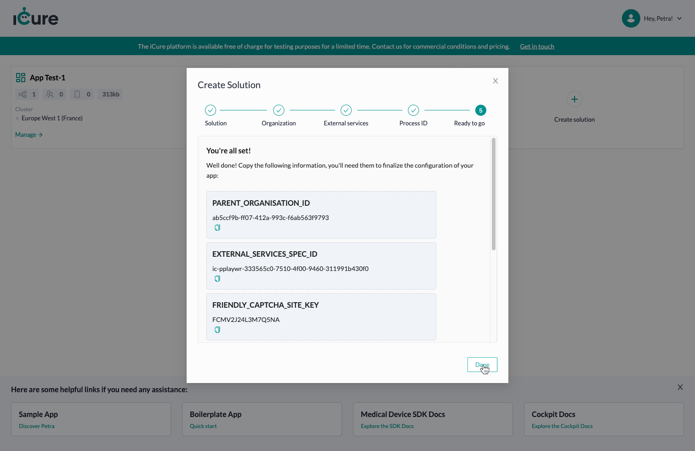
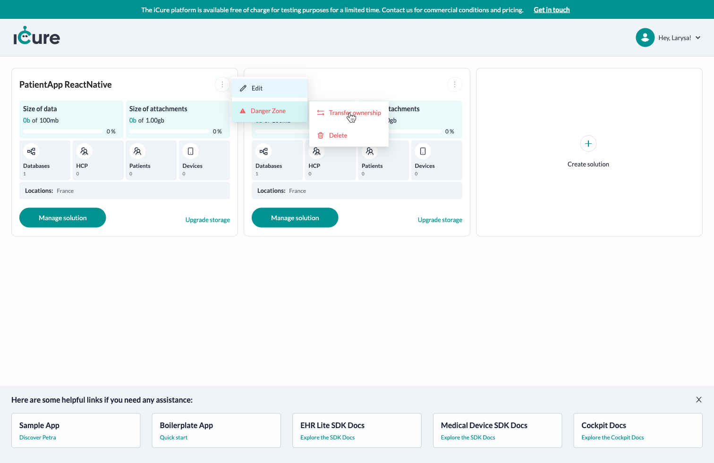
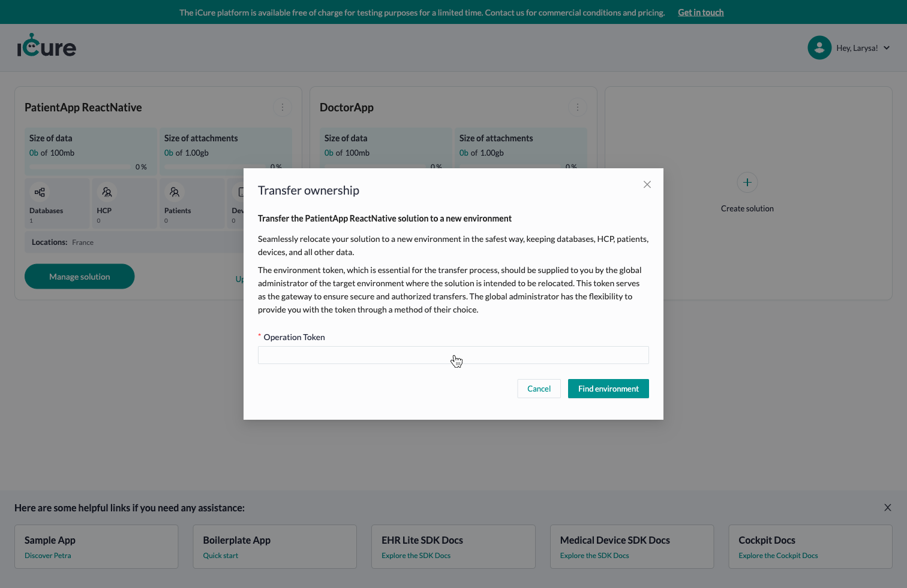
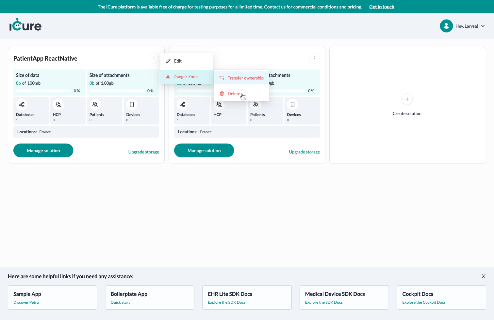

# Handling your solutions
In iCure, a **Solution** represents a **medical system, software or platform** in which users' medical data are potentially managed through multiple IT stakeholders.

For example, let's take Petra Corp, developing solutions to help patients follow their menstruation cycle and share medical information linked to it with their gynecologist. 

Petra Corp proposes to their patients the React Native App **Petra**, which allows them to encode their menstruation cycle data. 
The enterprise also has a second product called **Petra Doc**, allowing the gynecologists to follow the data their patients shared with them, and potentially make a diagnosis. 

Petra Corp invoices the gynecologists and the **Petra users** who are using their solution using a monthly subscription. 

Here is an example of Solutions Petra Corp could want to create: 

| Solutions created on Cockpit | Valid | Remarks                                                                                                                                                                                                                                       |
|-------------------------|------|-----------------------------------------------------------------------------------------------------------------------------------------------------------------------------------------------------------------------------------------------|
| Petra, Petra Doc        |  ❌  | This scheme is inefficient, as patient data will have to be duplicated between Petra and Petra Doc. Moreover, as iCure allows you to share or not data with other actors, it will be easy in one Solution to define who can access which data |
| Petra, Petra Invoicing | ✅   | This scheme seems efficient, as Petra Corp doesn't need medical data to create its invoices. Therefore, medical data can be isolated in one Solution, and invoicing information in another                                                    | 
| Petra, Petra Invoicing, Hospital ABC | ✅ | In case a hospital would like to work with Petra Corp and have a dedicated environment for their patients, Petra Corp could create a dedicated Solution for Hospital ABC                                                                      |

Of course, there are a lot more possible scenarios depending on the business needs of your solution. The most important to remember is that the choice is yours in the organisation of your environment, thanks to the Solutions. 

:::info
Be aware that users of one solution will never be able to see the data of another solution, __except__ if this user specifically authenticates with the other solution as well. 
:::

## Create a solution

From the Cockpit [dashboard screen](https://cockpit.icure.dev/dashboard), click on the **Create solution** card.

You'll see a 5 steps process to complete, in order to create your solution. 

The 5 steps are self-explanatory and well documented. Go through each of them and provide the needed information.

At the end of the process, you will receive a series of information :
- the **EXTERNAL_SERVICES_SPEC_ID**, identifying your Solution in our Authentication component;
- the **EMAIL_AUTHENTICATION_PROCESS_ID**, identifying the email template to send to your users during their registration or login;
- the **PARENT_ORGANISATION_ID**, identifying your organization as the responsible of the created users.
- the **FRIENDLY_CAPTCHA_SITE_KEY**, if you chose to use the Friendly-Captcha temporarily provided by iCure.

Information that you will need when you'll want to start the development of your app. 

Once your solution is created, click on **Done**. 

## Edit a solution

To edit an existing solution, click on the **overflow menu**, on the top-right of your 
solution card. Click afterwards on the **Edit** button.

For now, you may only edit the name of your solution.

Fill in the new solution name and click on the **Save** button.

## Transfer ownership of a solution

iCure offers you the flexibility to transfer ownership of your solution to another environment seamlessly. This feature enables you to relocate your solution to a new environment while ensuring the safety of all your critical data, including databases, Health Care Providers (HCP), patient information, devices, and more.

The environment token, which is essential for the transfer process, should be supplied to you by the global administrator of the target environment where the solution is intended to be relocated. This token serves as the gateway to ensure secure and authorized transfers. The global administrator has the flexibility to provide you with the token through a method of their choice.

## Delete a solution

To delete a solution, click on the **overflow menu**, on the top-right of your
solution card. Click afterwards on **Danger Zone** > **Delete**.

A modal appear.

To definitely delete the solution, write back its name into the dedicated input and click on **Delete** button.

:::warning

Once you delete a solution, there is no going back: You won't be able to access the data contained in all databases of this solution anymore.
Be aware that all children databases of this solution will also be affected by this operation. 

:::
