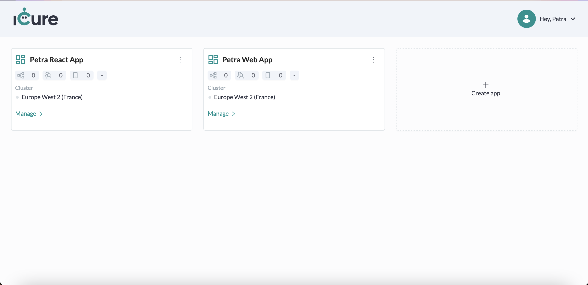
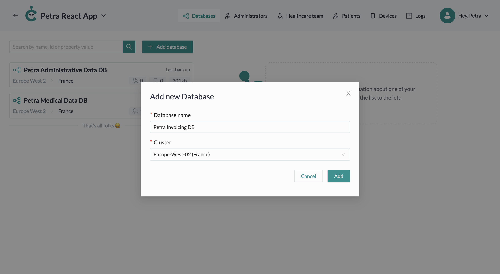
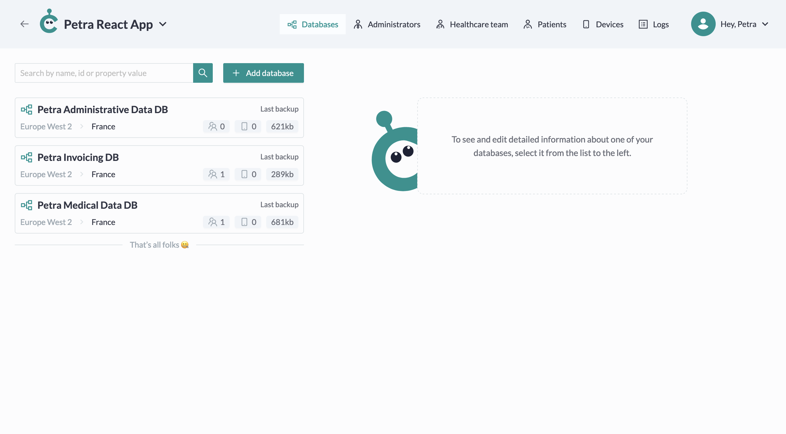

# Handling databases

## Go to a solution's databases

Each solution has a list of databases. 
From the Cockpit [dashboard screen](https://cockpit.icure.dev/dashboard), click on the **Manage** button of the solution of your choice. For example, let's click on the **Manage** button of our __Petra React app__. 

You will then see all existing databases linked to this solution: 

## Create a database

To create a new database, click on **Add database** button at the top of the Solution Details screen.

Write the name of your database, choose the cluster that should host it and click on the **Add** button.

Your new database now appears in your list: 

## Edit a database name

To edit the name of your database, click on the **pencil icon**, next to the database name.
A modal will appear.

Fill in the new database name and click on the **Save** button.

## Manage database information

To see the detailed information of your database, click on its corresponding card in the list.

You may first see the general information about the database: 
- The clusters on which it is saved
- When the last backup has been done
- The number of children databases it contains
- The number of users it contains
- The number of medical devices it contains
- The size of the database

:::info

Database administrators are able to create children databases for the parent database you gave them access.  

:::

You may afterwards see the following sections: 
- The custom properties
- The administrators (Global, solution, database ones)
- The danger zone

### Custom properties
**Custom properties** are properties you want to store absolutely in your database. It may be interesting if you 
need to share this information with the users of this specific database for example. 

Let's see how to manage them. 

#### Add a custom property

To add a new custom property, click on the **Add custom property** button.

You will now have to provide: 
- An **identifier**, which will be the unique name identifying your property
- A **value**, hold by this property
- A **type field**, corresponding to the type of the value

Once you filled all these fields, click on the **Add** button.

#### Edit a custom property

To edit a custom property, click on the **pencil icon** next to the property you want to change.

Once you updated property fields, click on the **Save** button.

#### Delete a custom property

To delete a custom property, click on the **pencil icon** next to the property you want to delete.

If you are absolutely sure you want to delete this custom property, click the **Delete** button.

### Global administrators
Global administrators are the ones who are able to manage your whole Cardinal account environment, including solutions, 
databases, ...

For now, it is not possible to add new global administrators. It will only be the primary user who created your
Cardinal environment. 

### Solution administrators
Solution administrators are able to manage a particular solution. Meaning they will be able to:
- Add a new database to the solution
- Add new users in the solution
- Check logs of the solution

To do all those actions, the solution administrator will therefore be able to use the Cockpit Web Portal. 

You can add a new Solution administrator through the tab **Administrators** at the top of the screen.

### Database administrators
Database administrators will be able to query a database with admin rights. 
Their purpose is not to manage the solutions, databases, ... anymore but to create them in order to administrate your 
database data. 

Typically, if you would like to enable user registration, create new patients / doctors, ... you will need a 
database administrator. 

:::info

The database administrator may log into the Cockpit Web Portal, but he won't be able to do any other action than 
managing is account and check the monitoring. 

:::

#### Add a database Administrator

To add a new database administrator, click on the **Add an administrator** button.
A modal will appear.

Fill in the form inputs and click on the **Add** button.

You can also send an invitation to the newly created administrator by clicking on the **Invite** button. 
The invitation will be sent to the email provided in the form earlier.

<!-- This functionality currently doesn't work on Cockpit -->

<!--  #### Edit database Administrator

Click on the card of the administrator you want to edit.

Make changes and click on the **Save** button.

 -->

### Danger Zone

In this zone, you will find all functionalities considered as dangerous: 
- The updating of your database indexes
- The Deletion of your database

#### Update indexes
During the lifetime of your database, we will continue improving the Cardinal solution by introducing new functionalities. 
These will sometimes require new database design documents, new database views, that won't be automatically added to 
your database. 

Indeed, adding a new design document, a new database view may require some indexation of your database and make it 
therefore unavailable for a few minutes during this process. As we can't know what would be your best time spot to not 
block your users, we prefer to let you schedule the **Update Indexes** operation yourself through this action. 

:::info

Keep an eye on the SDKs changelogs to know when a new version requires an **Update indexes operation**.

:::

To start the indexation of your database, just click on the **Update indexes** button. 

#### Delete a database

To delete your database, click on the **Delete** button. A modal will appear.

To definitely delete the database, write back its name into the dedicated input and click on **Delete** button.

:::warning

Once you delete a database, there is no going back: You won't be able to access the data contained in this database anymore.

:::
