# Handling HCP
HCPs (Healthcare Professionals or Organizations) can be managed within any database. Here are the actions you can perform with HCPs:

## Creating an HCP
#### To create a new HCP, follow these steps:
- Navigate to a solution.
- Choose the relevant database.
- Go to the "HCP" tab.

  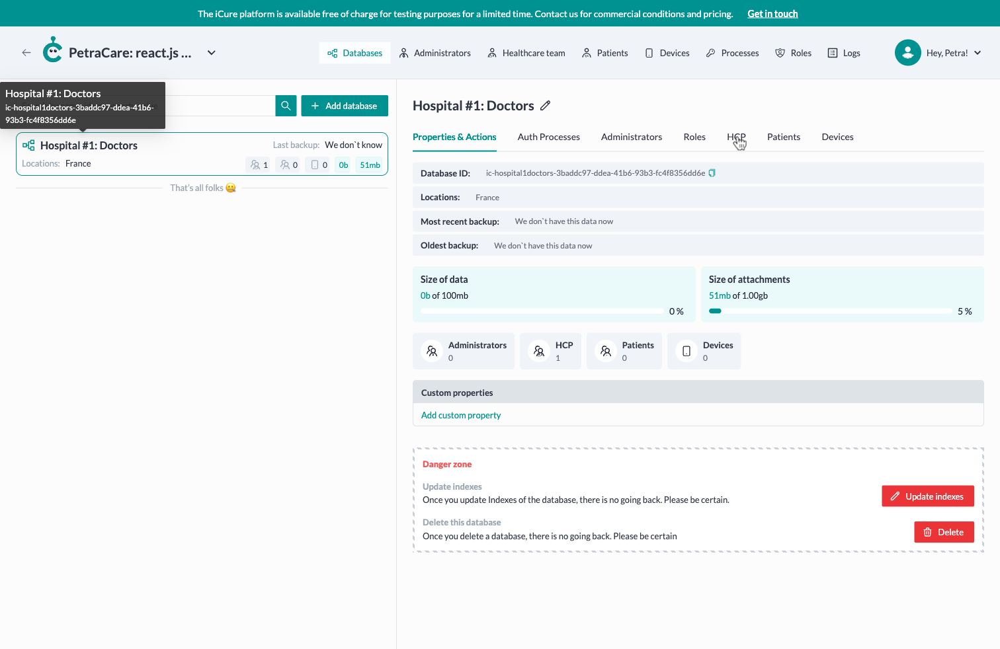

- Click the "Add User" button.

  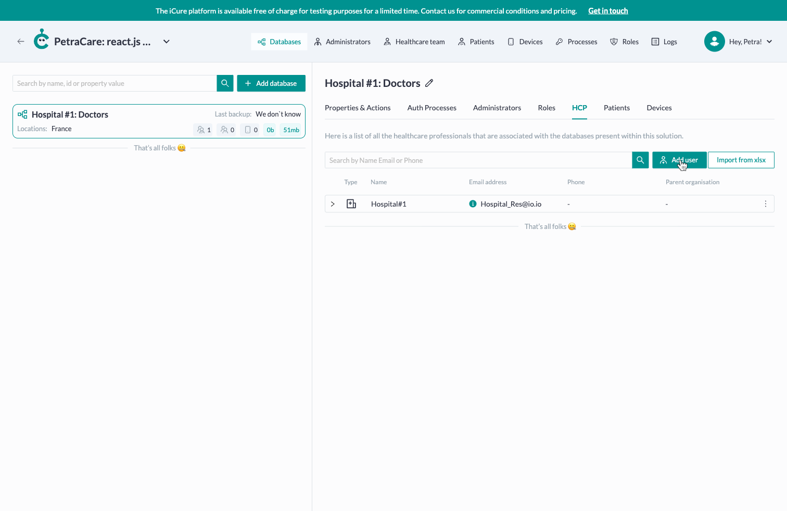

- Select the type of HCP you wish to create (Healthcare Professional or Organization).

  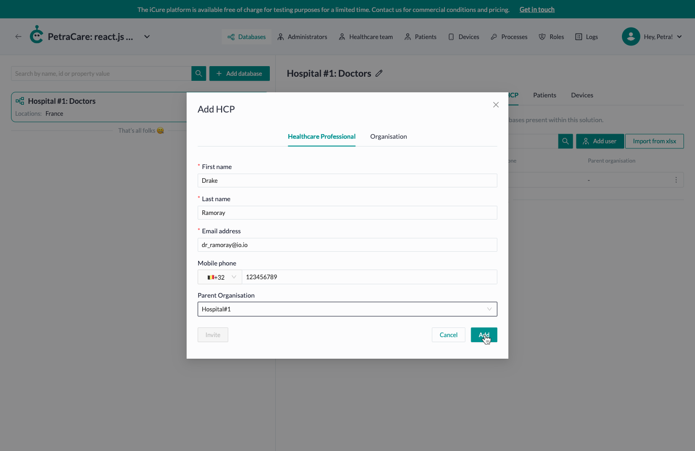

- Fill out the form and save.
- Optionally, send an invitation to the newly created HCP's email.

## Editing an HCP
#### To edit an existing HCP:
- Click the overflow menu button (three dots) next to the HCP.
- Select the "Edit" option.

  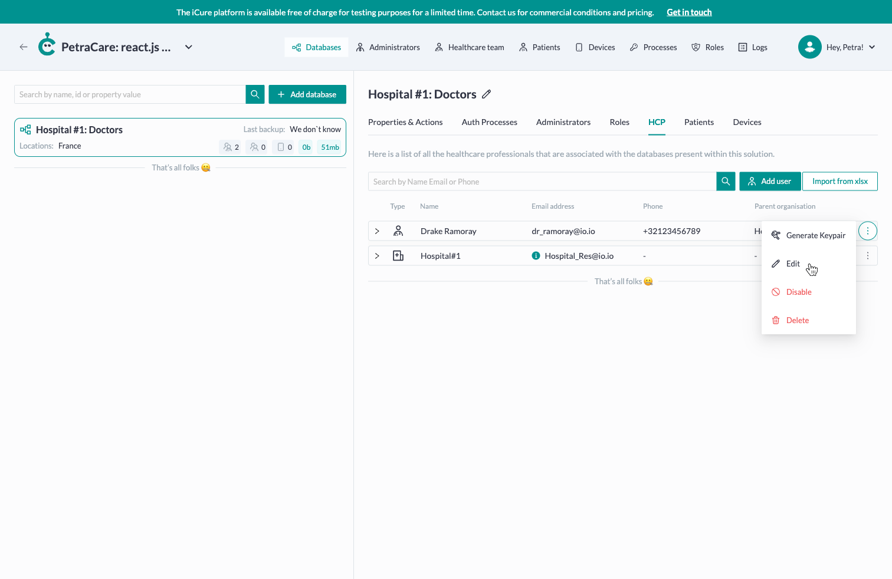

- Make your changes and save.

  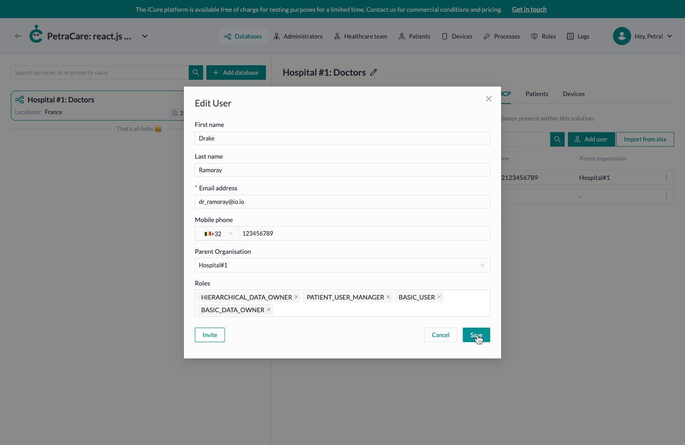

## Deleting an HCP
#### To delete an HCP:
- Click the overflow menu button (three dots) next to the HCP.
- Select the "Delete" option.

  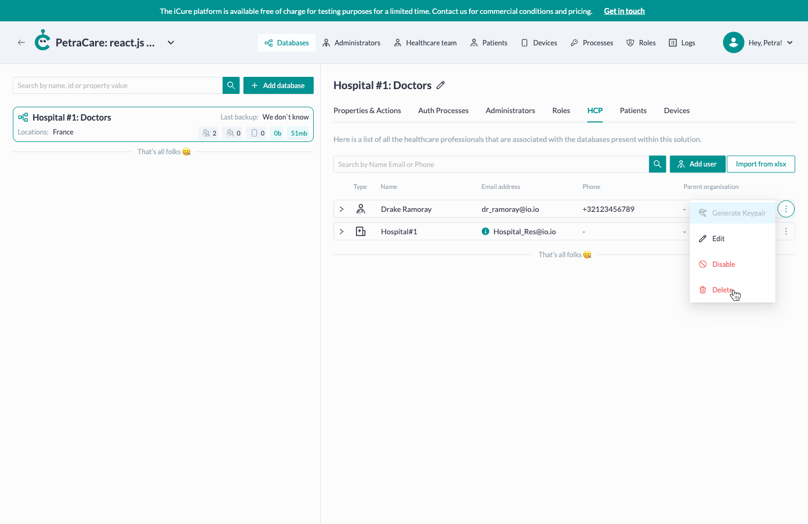

:::warning
Deletion is permanent and cannot be undone.
:::

## Copying HCP ID
#### To copy an HCP ID:
- Expand the row of the HCP.
- Copy the HCP ID or Organization ID (for organizations).

  

:::info
The HCP ID or Organization ID corresponds to the **PARENT_ORGANISATION_ID** used as an environment variable for configuring your mobile or web application.
:::

## Generating an Authentication Token
#### To generate an authentication token for an HCP:
- Expand the row of the HCP.
- Click the "+" button in the "Active Authentication Tokens" cell.

  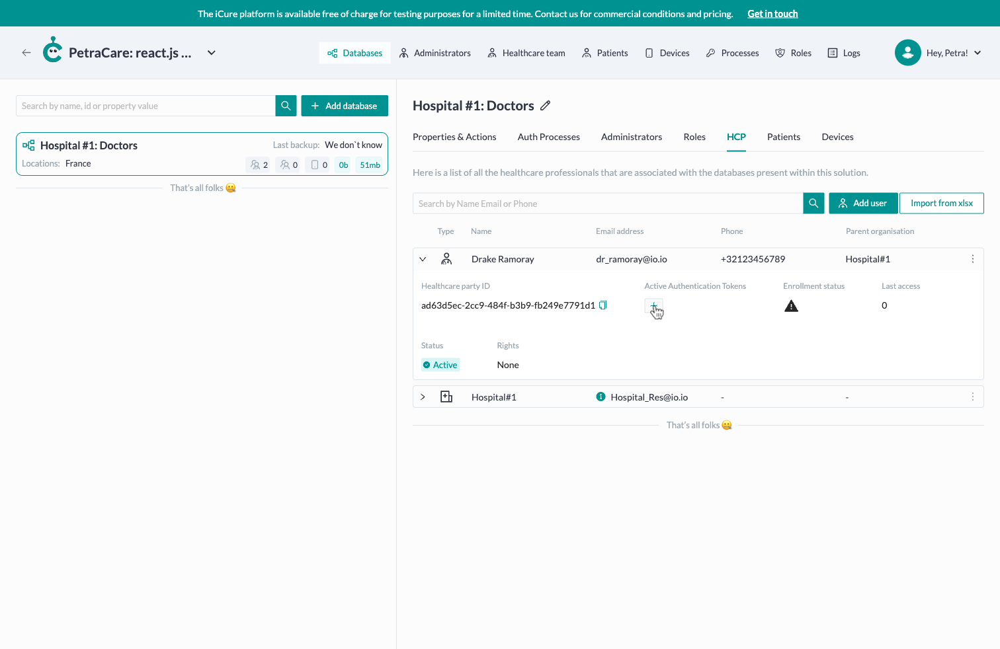

- Enter a unique name and select the expiration date and time.

  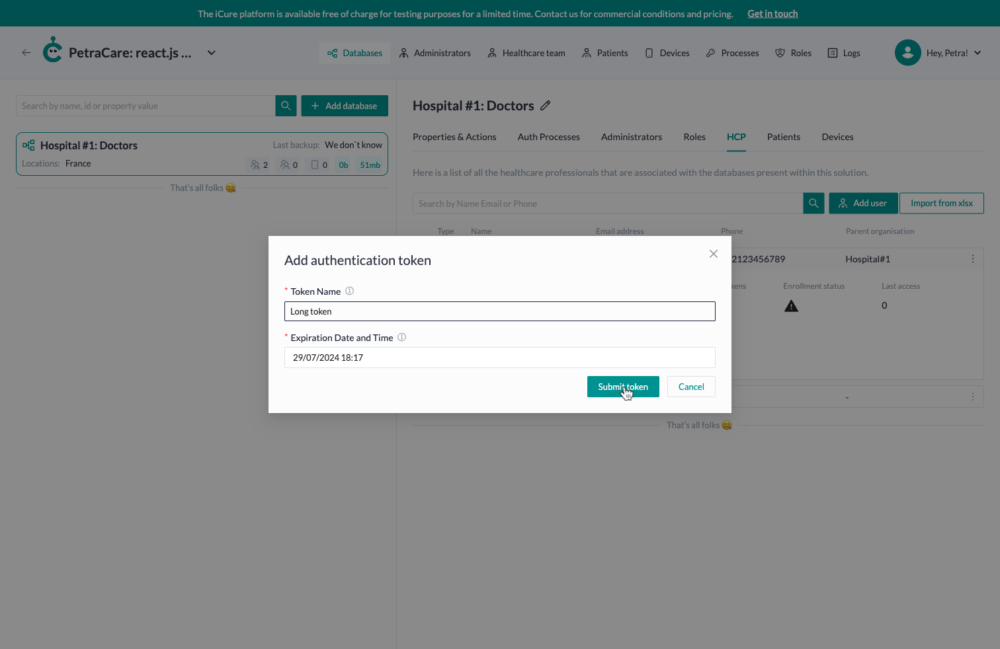

- Copy the token and save it in a secure place, as it will not be retrievable later.

  

- You can delete the token if it is no longer needed.

  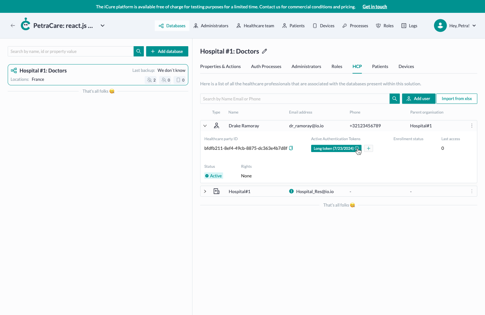

## Generating a Cryptographic Keypair
#### Follow these steps to generate and save a cryptographic keypair:

- **Locate the Relevant HCP**
  - Open the application and navigate to the list of HCPs.
  - Find the HCP for which you need to generate a keypair.

- **Access the Overflow Menu**
  - Click on the three-dot icon (overflow menu) next to the selected HCP.
  - In the dropdown menu, select the "Generate Keypair" option.

  

- **Generate the Keypair**
  - Follow the prompt and instructions that appear to complete the keypair generation process.

  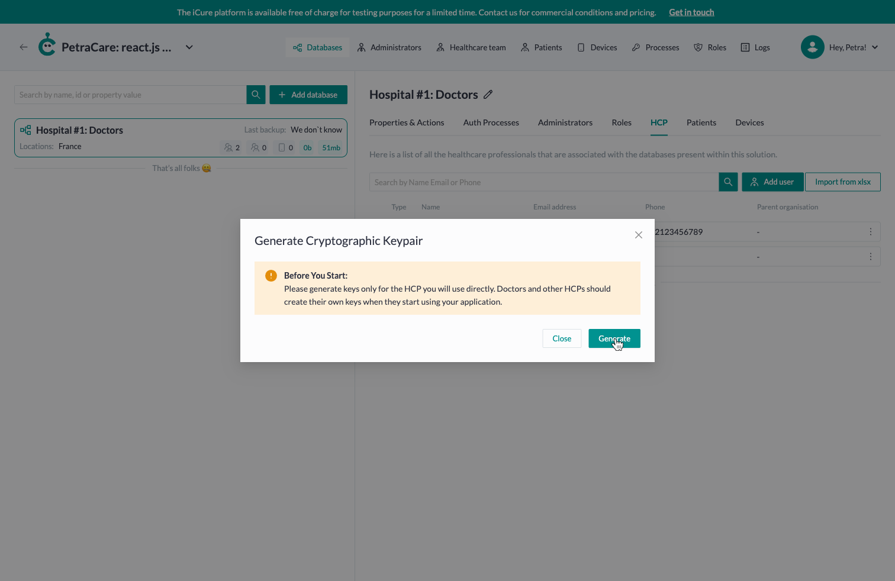

- **Save the Keys**
  - Once the keypair is generated, you will receive both a private and a public key.
  - **Important:** Save the private key securely. Do not share it with anyone.
  - Save the public key where it is easily accessible for future use.

  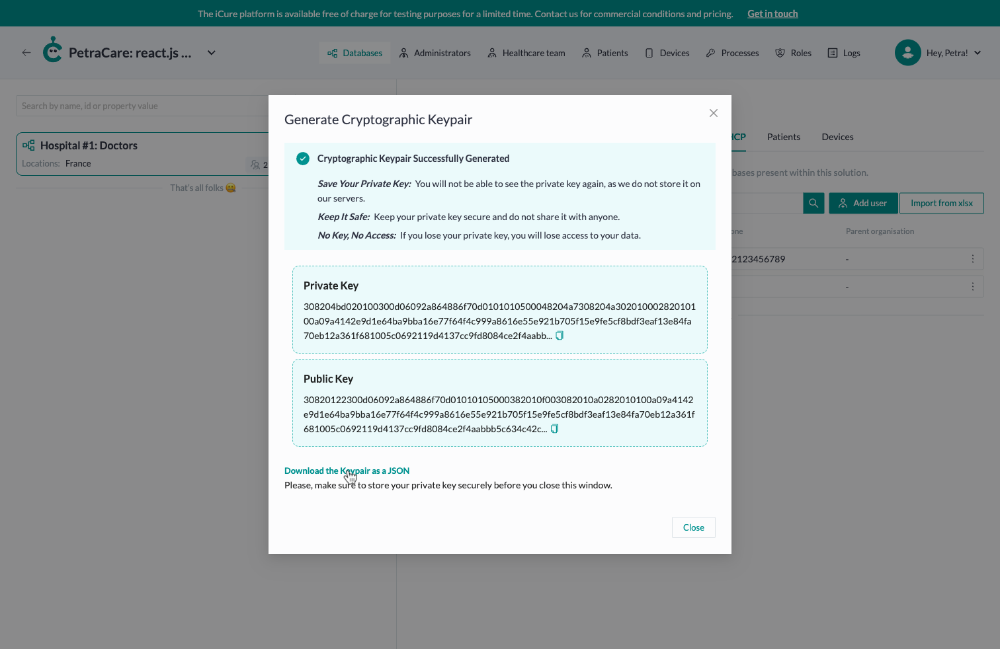

:::info
**Generate Keys Only for Direct Use:** Please generate keys only for the HCP you will use directly. Doctors and other HCPs should create their own keys when they start using your application.
:::
:::warning
**Private Key Security:** You will not be able to see the private key again, as we do not store it on our servers. If you lose your private key, you will lose access to your data.
:::

## Importing HCPs from .xlsx
To upload a batch of Healthcare Parties, ensure your table contains the following columns: First Name, Last Name, Email Address, Country Code, Mobile Phone, Parent Organization ID.
:::info
To retrieve the **Parent Organization ID**, navigate to the HCP tab of the particular database, locate and expand the row that corresponds to the desired organization, and copy the Organization ID field.
:::

#### To import HCPs:
- Click the "Import from .xlsx" button.

  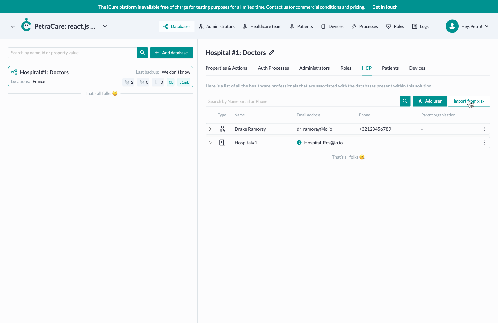

- Upload a file that matches one of the allowed formats: .xlsx, .xls, .xml, .csv, .txt, .ods.

  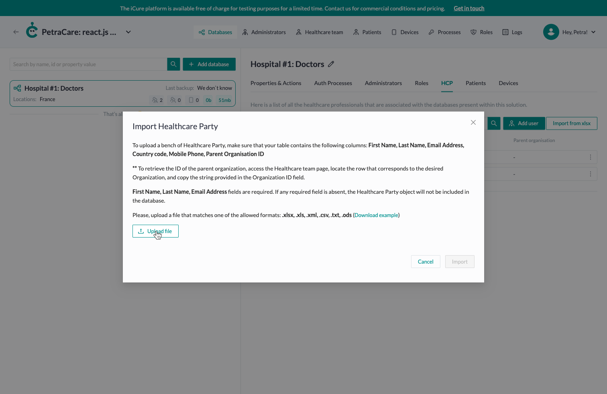

- If there are any rejected HCPs, check the reason and fix the problem.
- Click the "Import" button.

:::info
**First Name**, **Last Name**, and **Email Address** fields are required. If any of these required fields are missing, the Healthcare Party will be rejected.
:::
