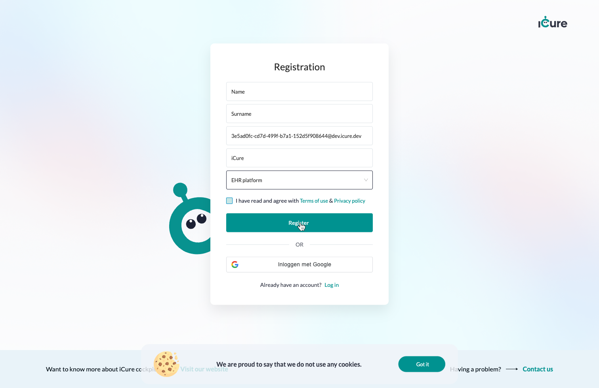
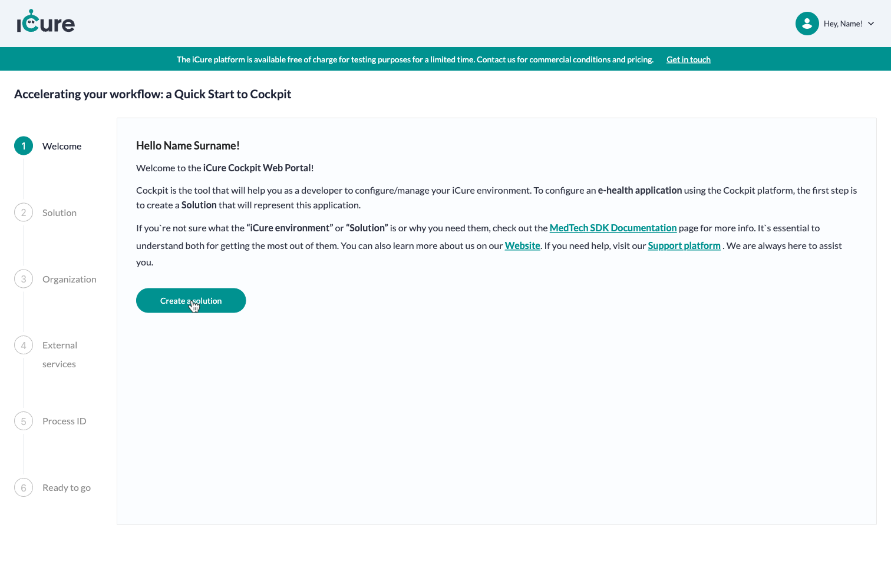

# Registering to the Cockpit

First, open the Cockpit [Home screen](https://cockpit.icure.cloud) in your browser. You'll see a 
registration form :

Fill all its required fields and click on the **Register** button.
A few seconds later, you will receive an invitation to the email address you provided in the form :

Click on the **Verify** button to accept the invitation and create your account.

You may now start configuring your own iCure solution : 

