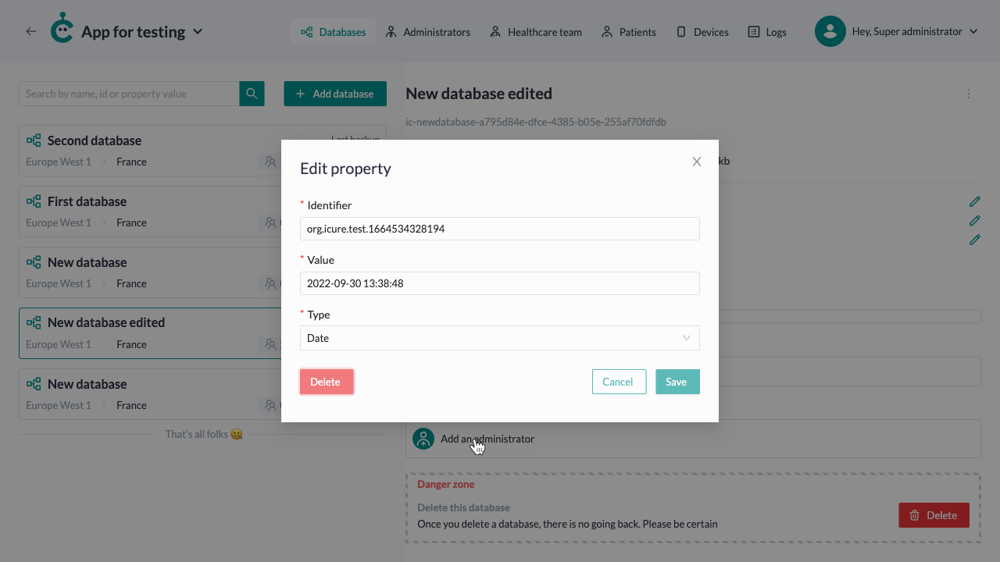

# How to interact with a database

## View the list of databases

Each of the apps has a list of databases. Click on the 'Manage' button on the particular app card to see them.
From the [dashboard](https://cockpit.icure.cloud/dashboard) of the cockpit, chose some app and click on the 'Manage' button. You will be able to see list of existing databases inside this app.

## Create a databases

To create new database click on 'Add database' button.

Fill in the database name and chose the cluster from the dropwown and click on the "Add" button.

## Manage database

To see the database detailed information click on it.

### Custom property

#### Add custom property

At some point you may want to add custom property to the database.
Click on the 'Add custom property' button.

Fill in the identifier, value and type fild and click on the 'Add' button.

#### Edit custom property

Click on the pencil icon next to the property you want to change.

Fill the changes and click on the 'Save' button.

#### Delete custom property

Click on the pencil icon next to the property you want to change.

If you are absolutely sure that you want to delete this custom property, click the "Delete" button.

### Database Administrator

#### Add database Administrator

Here you can see who has access to this database. Also you can add database Administrator.

Fill in the form inputs and click on the 'Add' button.

Also you can send the invitation to the provided email, by clicking on the 'Invite' button.

<!-- This fuctional currently doesn't works on the site -->

<!--  #### Edit database Administrator

Click on the card of the administrator you want to edit.

Make changes and click on the 'Save' button.

 -->

### Edit a database

Chose the 'Edit' option from the overflow menu of the databse you want to edit.

Fill in the new app name and click on the "Save" button.

### Delete a database

Inside the Danger zone click on the "Delete" button.

Once you delete a database, there is no going back. Please be certain.
To confirm database deliting, copy its name and paste in the input. Then click on 'Delete' button.

