# How to interact with a database

## View the list of databases

Each app has a list of databases. 
From the Cockpit [dashboard screen](https://cockpit.icure.cloud/dashboard), click on the 'Manage' button of the app 
of your choice. You will then see all existing databases linked to this app.

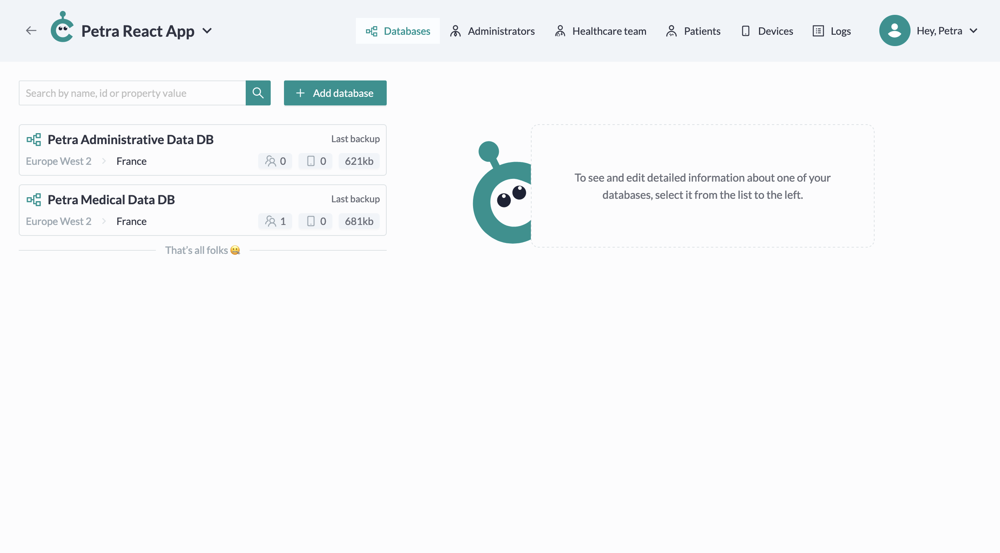

## Create a database

To create a new database, click on 'Add database' button on the App Details screen.

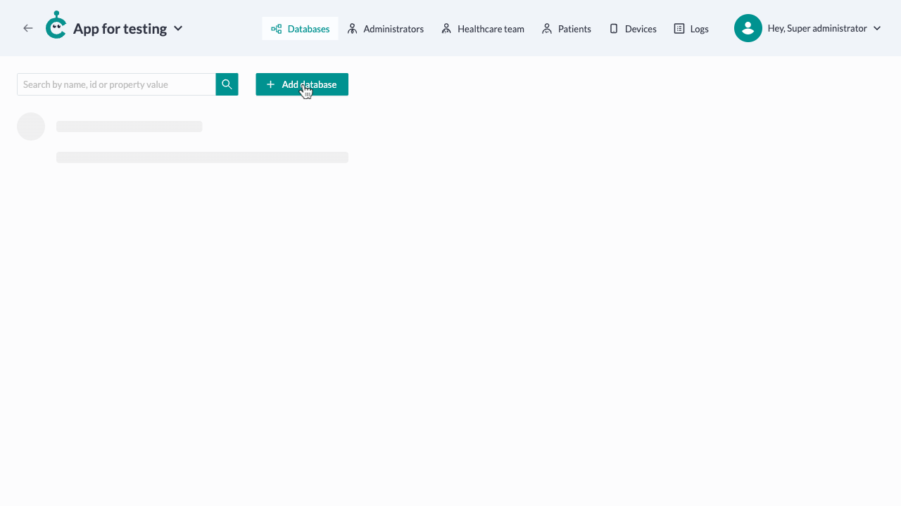

Write the name of your database, choose the cluster hosting it and click on the 'Add' button.

## Manage database

To see the detailed information of your database, click on its card.

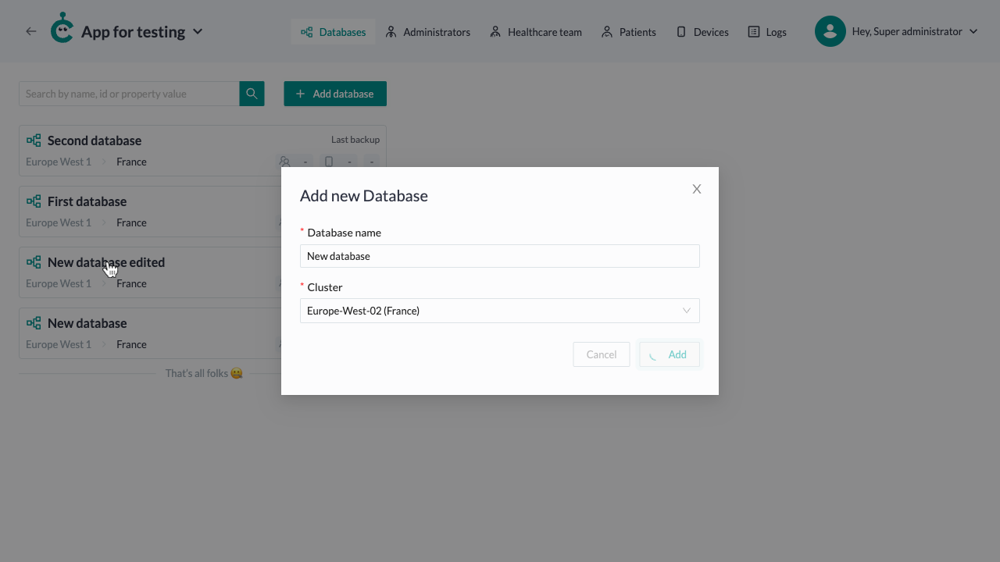

### Custom property

#### Add custom property

At some point, you may want to add custom properties to your database.
For this, click on the 'Add custom property' button.

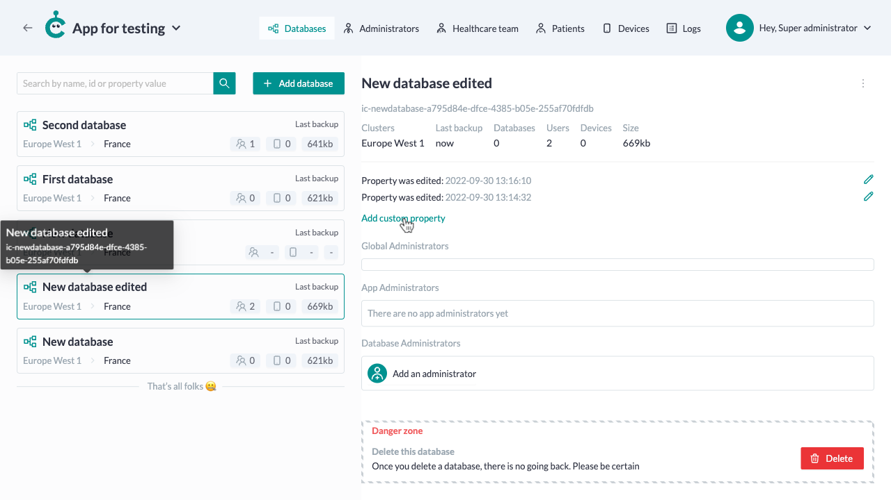

Fill your property identifier, its value and its type field and click on the 'Add' button.

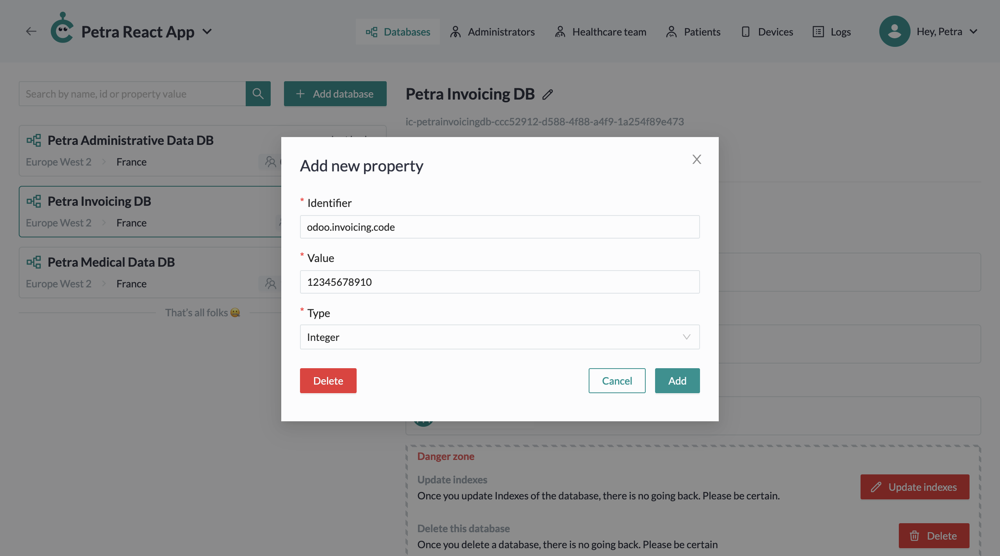

#### Edit a custom property

Click on the pencil icon next to the property you want to change.

Fill the changes and click on the 'Save' button.

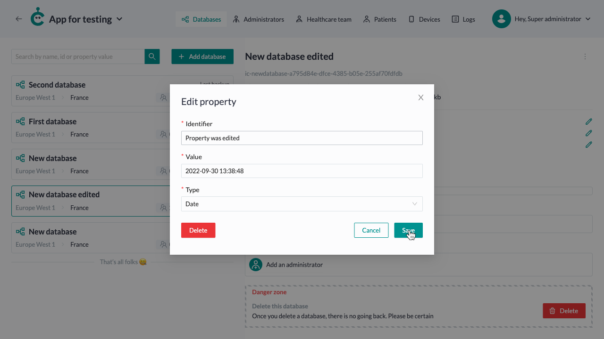

#### Delete a custom property

Click on the pencil icon next to the property you want to change.

If you are absolutely sure you want to delete this custom property, click the 'Delete' button.

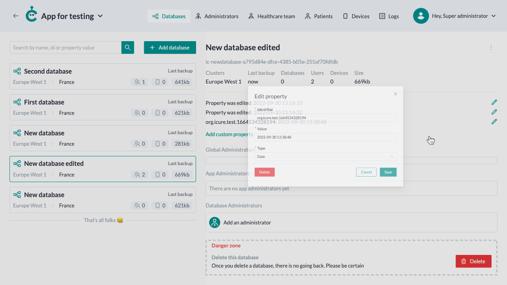

### Database Administrator

#### Add a database Administrator

In the Database details, you are able to see: 
- who can access it
- who are its administrators

You can also add a new administrator by clicking on the 'Add an administrator' button.
A modal will appear.

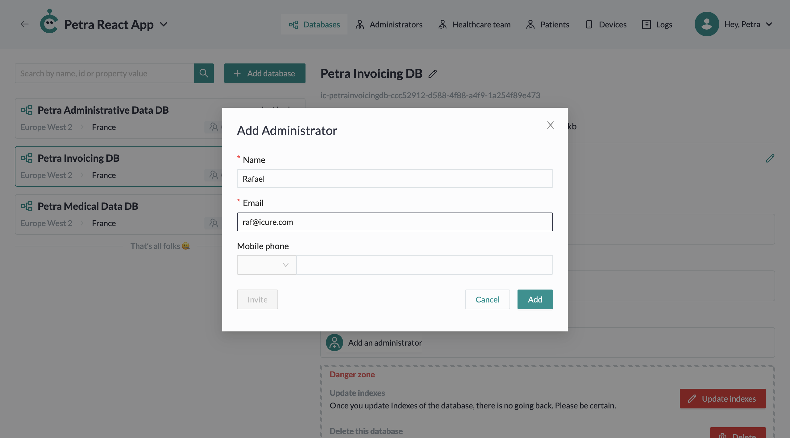

Fill in the form inputs and click on the 'Add' button.

Also, you can send an invitation to the administrator by clicking on the 'Invite' button. The invitation will be sent to the 
email provided in the form earlier.

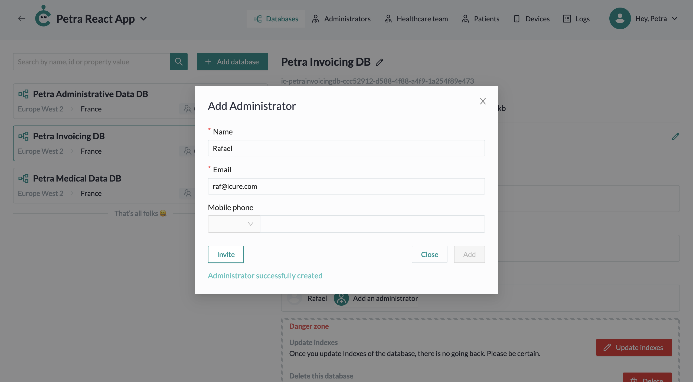

<!-- This fuctional currently doesn't works on the site -->

<!--  #### Edit database Administrator

Click on the card of the administrator you want to edit.

Make changes and click on the 'Save' button.

 -->

### Edit a database
Editing the database only permits you to update its name. To do so, choose the 'Edit' option from the overflow menu 
of the database you want to edit.

Fill in the new database name and click on the 'Save' button.

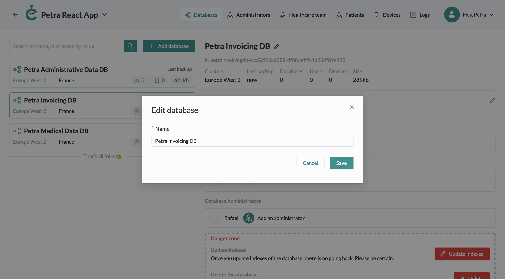

### Delete a database

Deleting a database is a dangerous functionality. 
Therefore, you will find it in the Danger Zone.
Once you delete a database, there is no going back. Once you're sure, click on the 'Delete' button.

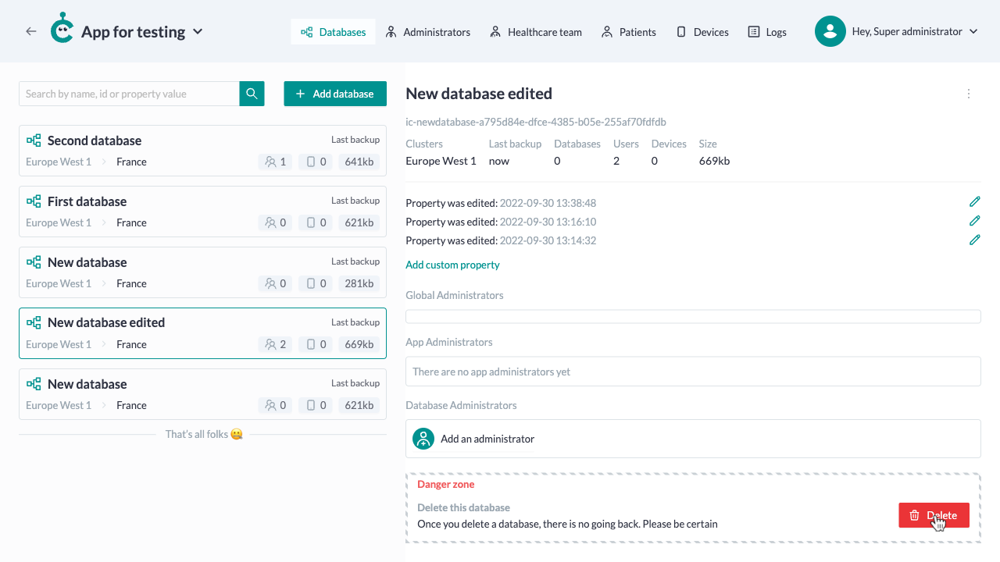

To confirm database deletion, write back its name into the dedicated field. Then click on 'Delete' button.

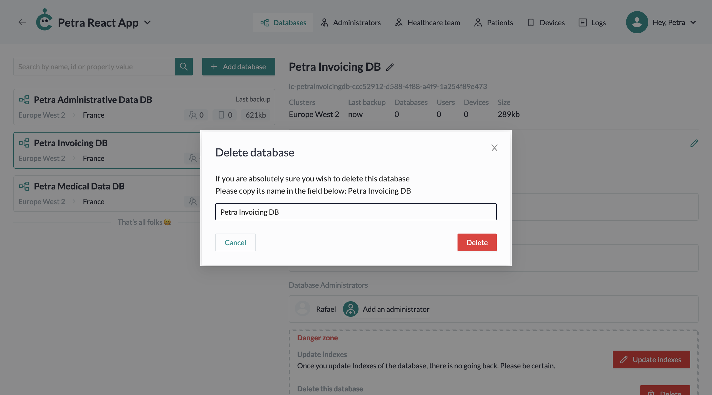
