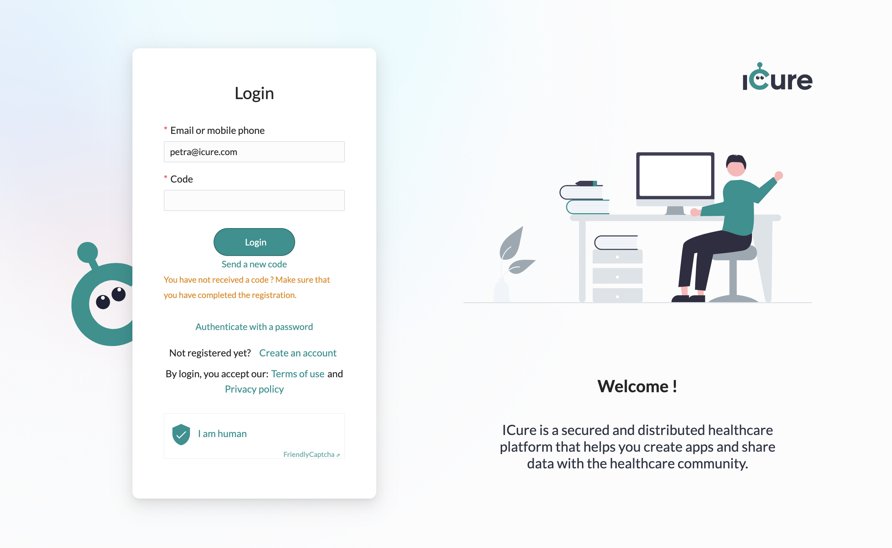

# How to login to the cockpit

## Login with username and password

From the [login page](https://cockpit.icure.cloud/login) of the cockpit, choose the option authenticate with password.

Fill in your username and password and click on the "Login" button.

## Login with generated code

From the [login page](https://cockpit.icure.cloud/login) of the cockpit, fill in your username and click on the "Ask a code" button.

Generated code is sent to your email address. Fill in your code and click on the "Login" button.

<!-- uncomment it when login with code will work again -->
<!--  -->
