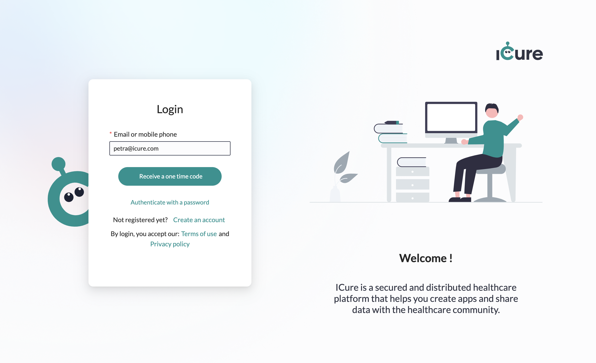

# Login to the Cockpit

## Login using an OTP
From the Cockpit [login screen](https://cockpit.icure.cloud/login), fill in your username and click on the 
**Receive a one time code** button.

You should now have received an OTP to the email address you linked to your account. 
Provide this OTP to the dedicated **Code** input and click on the **Login** button.

:::tip

If you didn't receive any code, try to send it again by clicking on **Send a new code** option. 
If you still don't receive it, make sure you created an account previously.

:::

## Login with username and password
If you don't want to login using a generated OTP, you may still choose to login using a username / password. 

From the Cockpit [login screen](https://cockpit.icure.cloud/login), click on the option **Authenticate with a password**.

Fill in your username, your password and click on the **Login** button.

:::info

You can define a password for your account through the [Manage your account screen](how-to-manage-your-account.md) 

:::