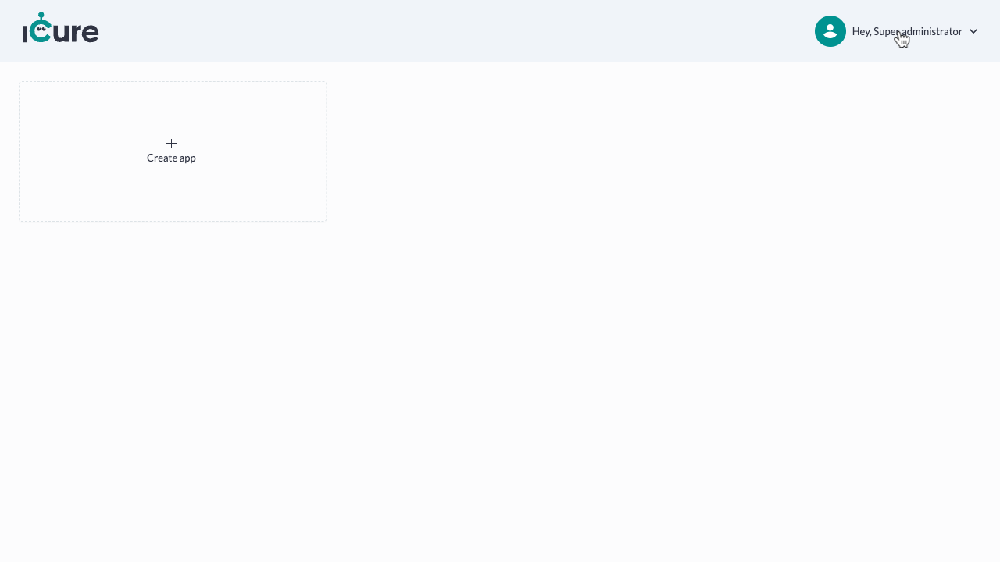
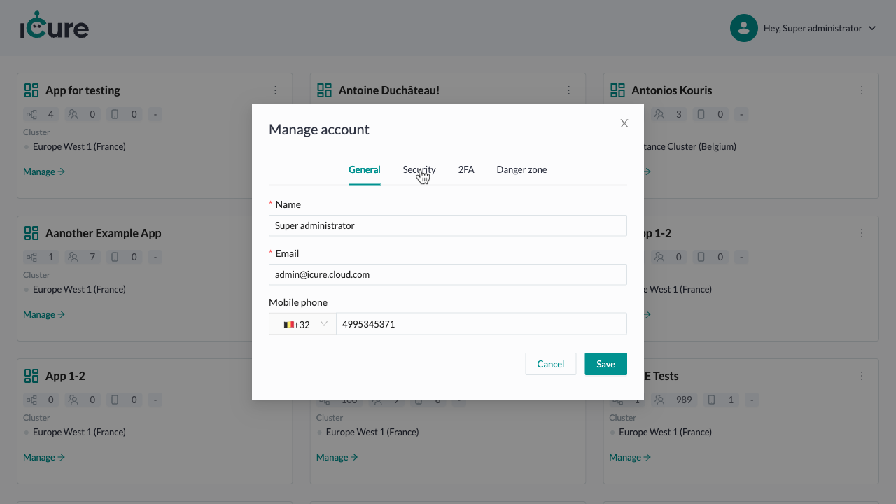
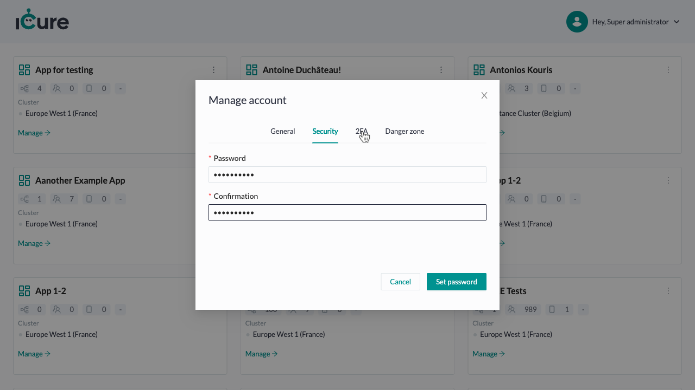
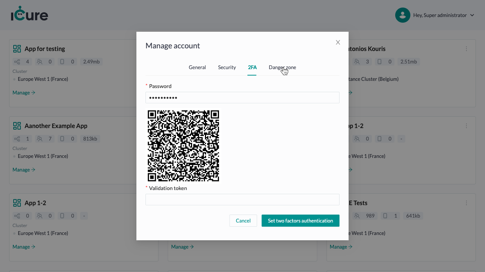

# How to manage an account

## Open the 'Manage account' menu

From the [dashboard](https://cockpit.icure.cloud/dashboard) click on the 'Hey, Super administrator'.

From the opened dropdown choose the 'Manage account' option.

## General

The 'General' tab is opened. Here you can edit your contact information. Fill in changes and click on the "Save" button.

## Security

Click on the 'Security' to switch the Tab.

Fill in the password and confirmation and click on the 'Set password' button.

## 2FA

Click on the '2FA' to switch the Tab.

Fill in the fields and click on the 'Set two factors authentication' button.

## Danger zone

Click on the 'Danger zone' to switch the Tab.

Once you delete an account, there is no going back. Please be certain.
If you absolutly sure you wish to delete the account, click on the 'Delete' button.

To confirm account deliting, copy its name and paste in the input. Then click on 'Delete' button.

