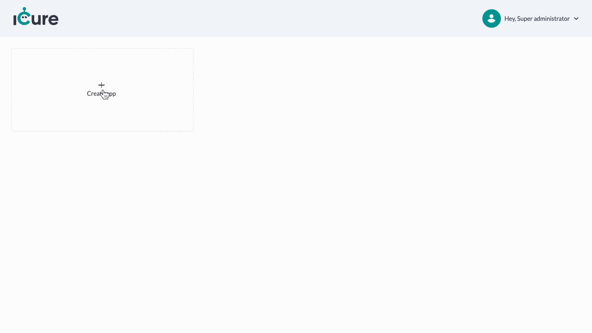
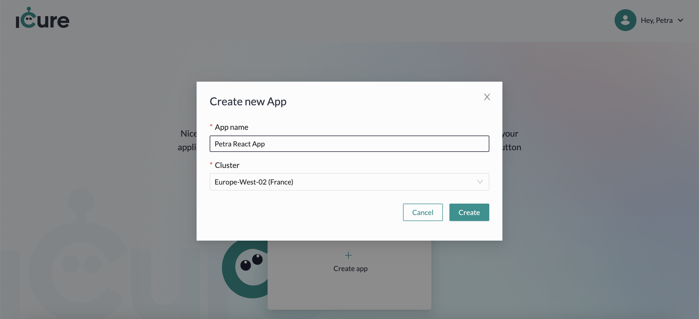
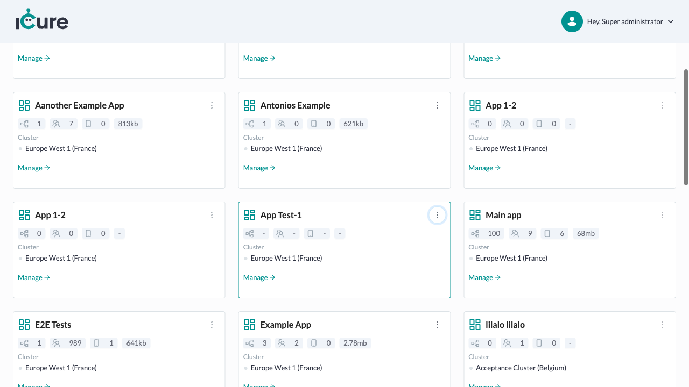
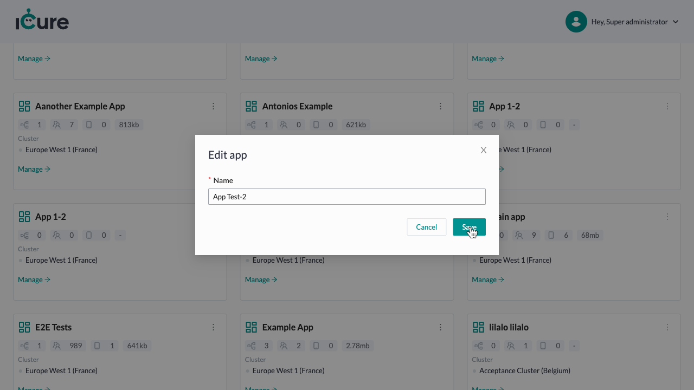
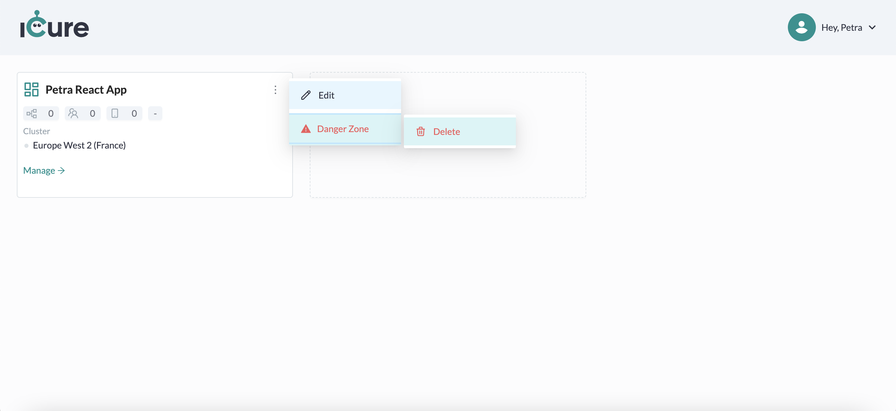
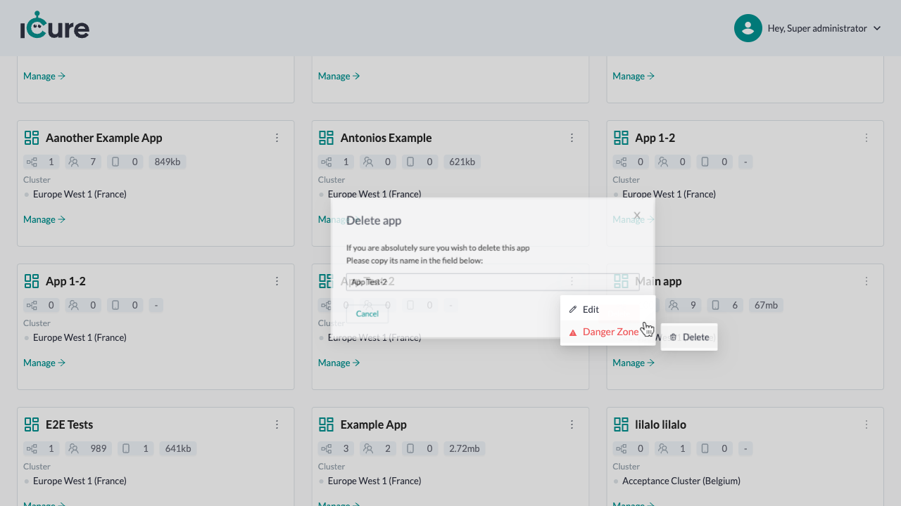

# Handling your apps
In iCure, you have the possibility to organise your databases according to the specifications of your own products. 
For example, you may want to have two completely separate environments for two products you are developing.
Another need could be the one of having a dedicated to the medical data of your users and one
dedicated to the invoicing, which should never need the medical data of your patients. 

The choice is yours in the organisation of your environment. 

:::info

Be aware that users of one app will never be able to see the data of another app, __except__ if you added this user 
specifically into your other apps as well. 
:::

## Create an app

From the Cockpit [dashboard screen](https://cockpit.icure.cloud/dashboard), click on the **Create app** card.

Fill in the app name and chose the cluster which should host the data of your app. 
Then, click on the **Create** button.

## Edit an app

To edit an existing app, click on the **overflow menu**, on the top-right of your 
app card. Click afterwards on the **Edit** button.

For now, you may only edit the name of your app.

Fill in the new app name and click on the **Save** button.

## Delete an app

To delete an app, click on the **overflow menu**, on the top-right of your
app card. Click afterwards on **Danger Zone** > **Delete**.

A modal appear.

To definitely delete the app, write back its name into the dedicated input and click on **Delete** button.

:::warning

Once you delete an app, there is no going back: You won't be able to access the data contained in all databases of this app anymore.
Be aware that all children databases of this app will also be affected by this operation. 

:::
