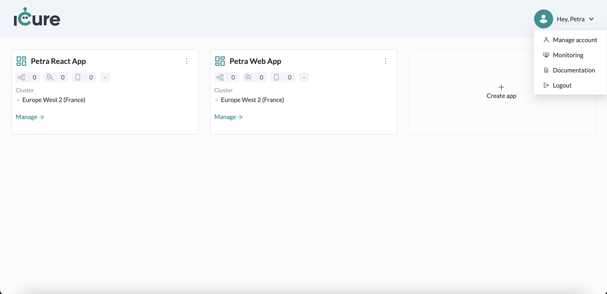
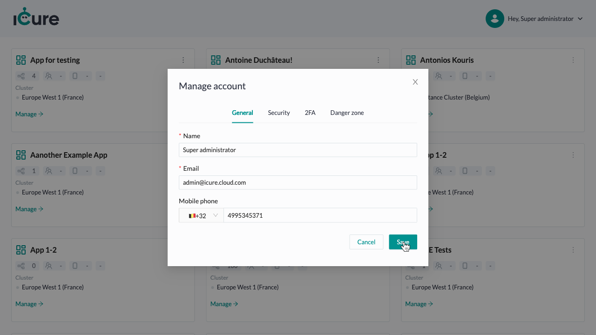
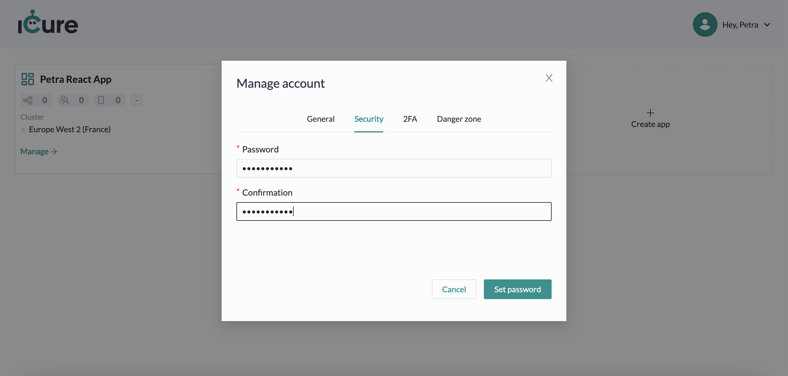
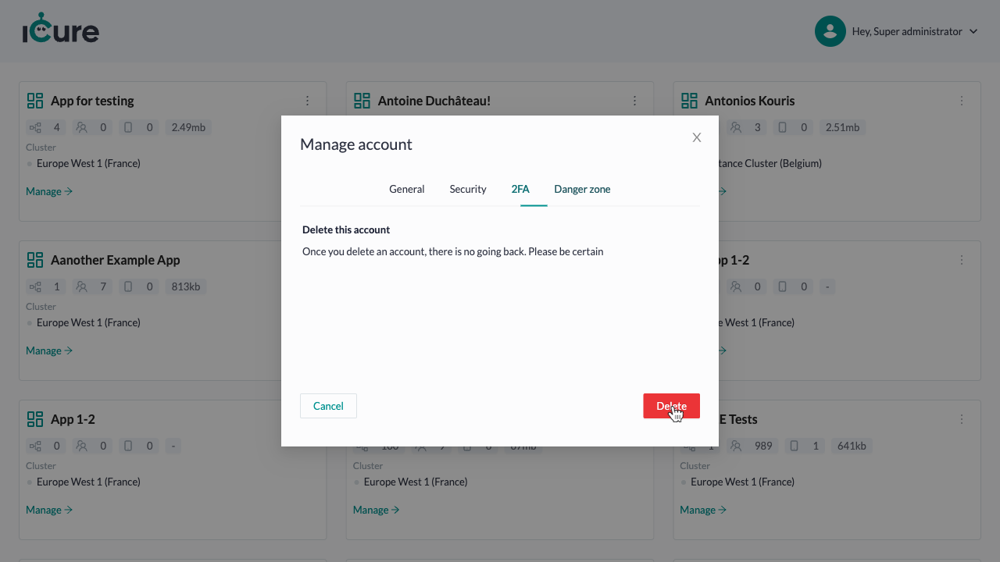
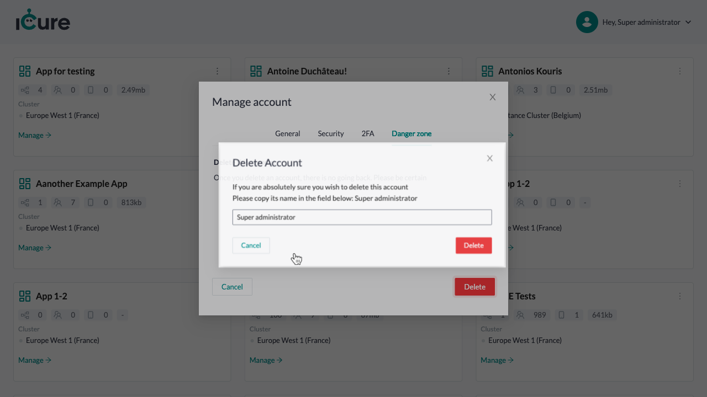

# Managing your account

You can access the details of your account from anywhere in Cockpit. For this, just click on the button on the top right of your screen, mentioning **Hey, <your_user_name> !**.

In the dropdown will appear a few entries. Click on the button **Manage account** to see the details of your account 
and edit them.

The **manage account option** has multiple tabs. We'll now check together what you can find / do in each of them. 

## General

By default, you will see the **General** tab when clicking on __Manage your account__. 

In this tab, you can find and edit your contact information.

To edit your contact information, fill in changes and click on the **Save** button.

## External Services

In the **External Services** tab, you can choose the provider you want to use as a service and provide its needed information. 

The external services to configure are: 
- A Captcha solution, to ensure your users are not bots;
- Message gateways, to send emails and/or SMS to your users; 

To edit an external service information, fill in changes and click on the **Save** button. 

:::caution
Make sure the information you provide are valid, otherwise your users won't be able to login and/or register. 
:::

## Password

In the **Password** tab, you have the possibility to add a password (or update it) to login on Cockpit without generating an OTP
(See [How-to: Login to Cockpit](how-to-login.md)).

To add/update your account password, fill the password and confirmation fields with the same value and click on the 
**Set password** button.

:::info

Your password must contain at least 10 characters. 

:::

## 2FA

In the **2FA** tab, you can activate the Two factors authentication functionality, to increase the security 
of your account authentication.

For this, provide a validation token of your choice (this is optional) and click on the 
**Set two factors authentication** button. 

## Danger zone

In the **Danger zone** tab, you will find all the functionalities related to your account considered as dangerous.

For now, the only functionality presented in this screen is the deletion of your account.

To delete your account, click on the **Delete** button. You will afterwards see the following pop-up:

To confirm the deletion of your account, copy the name showed in the modal in the dedicated input and click on the **Delete** button.

:::warning

Once you delete your account, there is no going back. Be sure it is what you want before deleting it.

:::