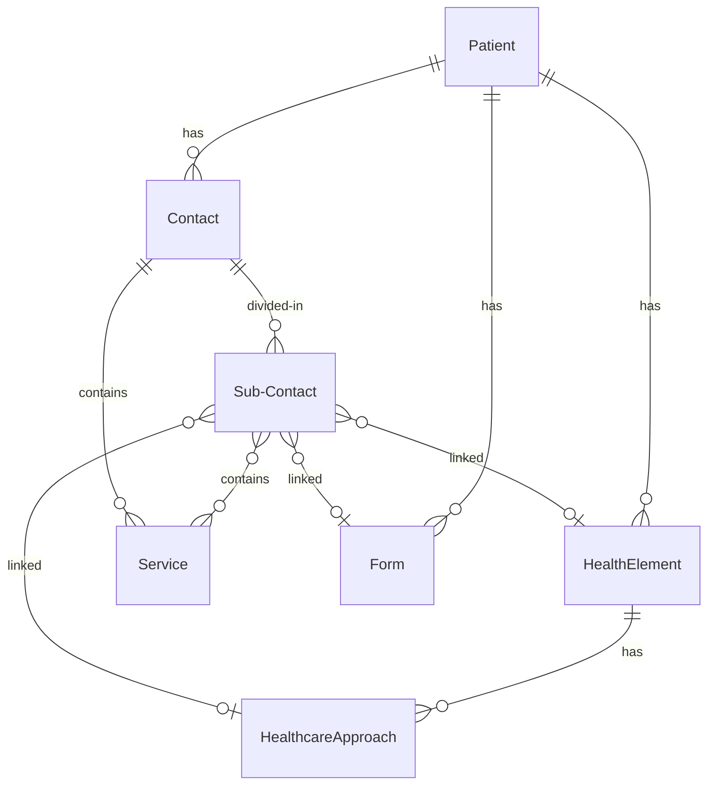

import {LanguageTabs} from "@site/src/components/LanguageTabs";
import TabItem from "@theme/TabItem";

# The Cardinal data model

## Overview

The Cardinal Data Model is designed to support a variety of use cases within the digital health space. It is a fixed
data model, meaning that users cannot define custom models. This decision enhances both the speed and robustness of
interoperability and encryption.

In this section, we outline the most commonly used entities, their use cases, and properties. For a full list of
entities, refer to the reference documentation (:construction:).

## General Concepts

Designing a data model is always the result of a trade off. The Cardinal data model has been designed with several technical goals in mind&#x20;:

* Ensuring the data model is extensible
* Guaranteed efficiency in resolving conflicts in the data-store
* Allowing selective encryption of the medical data

The Cardinal data model is split into two categories of entities&#x20;:

* Data Owners: They provide, create, access and modify the medical data. They are either Healthcare parties (HCPs), Devices, or Patients.
* Medical data: The medical information that has been collected in iCure. This data is organized as a journal inside entities called contacts. Extra entities are used to structure the medical information.

### Data Owners

A data owner is a _healthcare party_, _device_ or _patient_. When a data owner has been given access to the EHR, a _user_ entity is created to store Authentication/Authorization data. A data owner without an associated _user_ has no access to iCure, whereas, an data owner that has been connected to a _user_ is able to read, add or modify data in the limits of the access rights that have been assigned to it.&#x20;

#### Healthcare party

A healthcare party is someone who is recognized to provide care or services for a patient. A healthcare party is either an individual healthcare professional (a doctor, a nurse, a physiotherapist, etc.) or an organization (a clinic, a hospital, a government authority, etc.). A healthcare party includes anyone who is a stakeholder for the patient health and can access and manage the patient's file.

#### Device

A device is a medical device that can be connected to the Cardinal platform. A device can be a connected medical device (e.g. a blood pressure monitor, a smartwatch, etc.) or a software application that can interact with the iCure platform. A device has its own credentials and encryption keys and can be used to store medical data and insure the traceability of the data.

#### Patient

The patient is the recipient of care. Nearly all medical information inside Cardinal is linked directly or indirectly to a patient. The _patient_ entity is usually created during the first contact of a patient with a healthcare party. The administrative information of the patient can be partially or totally encrypted before being saved inside the _patient_ entity.

### Medical data

In the following section, the chronological entities and different structural elements of a patient's file is described in detail.



#### Contact

Every time a patient consults a healthcare party or every time a healthcare party accesses a patient's medical file, the actions performed are recorded and collected inside a _contact_. The _contact_ is the entity that records the medical information about the _patient_ chronologically. A visit to the patient's house, a consultation at the practice, a phone call between the patient and the HCP or integrating lab reports into the medical file are examples of when a _contact_ can be recorded.

A contact can occur with or without direct interaction between the patient and the HCP. For example, when a healthcare party encodes data received from laboratory's test result, this is done in the absence of a patient.

A _contact_ groups together pieces of information collected during one single event, for one single patient and for one or more healthcare parties. Patient's complaints, the diagnosis of a new problem, a surgical procedure, etc. are collected inside a contact.&#x20;

The main sub-element of the contact is the _service_. Each atomic piece of information collected during a contact is a _service_ and is stored inside the _services_ list of a _contact_.&#x20;

#### Service

_Services_ include subjective information provided by the patient, such as complaints, reason for visit, feelings, etc. or objective information like bio-metric measures (blood pressure, temperature, heart beat, etc.), or physical exam description, diagnosis, prescription, integration of lab reports from another healthcare party, action plan, etc.&#x20;

Any action performed by the healthcare party which is relevant for the health element of a patient is considered a _service_.&#x20;

Because _contacts_ are purely chronological objects, they do not convey information about the organization of the medical file. They however, do include a data structure to link _services_ to existing structuring elements such as_ health elements_, _healthcare approaches_ and _forms_. This data structure is the _sub-contacts_ list.

**Sub-contact**

A sub-contact is an object embedded inside a contact that links one or several _services_ to one _health element_, _healthcare approach_ or _form_.

#### Health element

_Health element_ or _Healthcare element_ can be described as the reason for the patient to consult a healthcare party. The _health element _has a starting moment and optionally an ending moment. In the case of incurable chronic diseases, the ending time is usually the time of death of the patient. The _health element_ usually represents a healthcare problem (diabetes, kidney failure, hypertension, heart attack, etc.) but this is not always the case. Pregnancy, right alignment of the heart, etc. are examples of _health elements_ which do not pose a healthcare problem.

#### Healthcare approach

_The healthcare approach_ is part of a _health element_ and represents an action undertaken for the follow-up of a given _health element_ of a patient. A _healthcare approach_ groups together the services that are meant as solution for the given _health element_.

#### Form

A _form_ collects a series of _services_ in one single visual entity. It is used to organize  the information on screen. It is used to create input forms, dashboards, folders hierarchies or more generally any structure needed by a developer to sort or group the information for an user.

### Example use case

Let's look at the above mentioned elements explained with a fictional patient:


The patient observes a mild pain in the lower right side of the abdominal area on July 1. It is not consistent. On July 2, the pain becomes severe and is now covering the whole abdominal area. The pain is consistent and continuous through out the day. Towards the end of the day, the patient starts vomiting and the pain is unbearable.&#x20;

The patient loses sleep and on 3 July, early morning rushes to the hospital after having vomited multiple times and the pain now being unbearable. This is the n-th contact shown above. The patient complains to the doctor about the symptoms and after thorough examination, the doctor diagnoses him with appendicitis. The doctor recommends a surgical operation of appendectomy the next day. The doctor also prescribes antibiotic cefuroxime, intravenously, to reduce spread of infection in the abdomen.&#x20;

:::info
Several events take place before the patient makes the first consultation with the _healthcare party_, these events leading to the _contact_ (n). During the _contact_ (n), the physician's software creates a _contact_, the beginning moment of the contact is the moment of the consultation. It also creates a _health element_, appendicitis (beginning moment: July 1). Three _services_ are created during the course of the consultation: the complaint, the diagnosis and the prescription. These three _services_ are saved inside _contact_ (n) and they are connected by means of one _sub-contact_ with three links to the _health element_, appendicitis.
:::

During the next _contact_ (n+1) on July 4, the surgical operation of appendectomy, is carried out. After 3 days in observation, the patient is released from the hospital with a prescription of antibiotics for next 6 days and recommends a recovery period of 4 weeks.&#x20;

:::info
&#x20;This _contact_ (n+1) is a simple one. It holds only one _service_ (appendectomy) connected to one _health element_ (appendicitis).
:::


Sometime later, the patient is diagnosed with diabetes. The patient develops difficulties due to this. Few consultations were made with the doctors attempting to keep these conditions under control. One of the conditions the patient develops is necrosis in a toe. The doctor recommends amputation of the toe (figure 2). On March 7, the patient is asked to get admitted for the surgical procedures of toe amputation. After proper healing of the wound, on April 7, the patient begins sessions with a physiotherapist to help with walking again.&#x20;

:::info
Previous _contacts_ have already occurred diagnosing and recording diabetes and necrosis, prior to prescribing a follow-up plan of toe amputation (these are not shown in figure 2). The _contact_ (m) records a _service_ of toe amputation operation linked to multiple structuring element, here, the patient's existing _health element_, diabetes and the _healthcare approach_ of toe amputation. The _contact_ (m+1) for physiotherapy is only linked to the _healthcare approach_ of toe amputation. Note the _health element_ diabetes, continue to exist.
:::

As a result of diabetic condition, the patient later on, has an episode of heart attack. The patient is prescribed lifestyle changes, medication, cardiac rehabilitation, etc. and asked to consult again in 2 weeks for the follow up of the heart attack episode (not shown in figure 2). During this consultation, various bio-metric measures like, blood sugar level, blood pressure, etc. was recorded. The change in weight was also recorded in order to measure how much life style changes were effective.&#x20;

:::info
_Contact_ (p) holds service linked to two _health elements_, one already existing and chronic and the other previously recorded. _Services_ provided are follow-up consultation, bio-metric measurements and weight measurement which are linked to either of the _health elements_ (diabetes, heart attack). Note here that weight tracking is a _service_ for both _health elements_. Here diabetes does not have an ending point and continues along the timeline.
:::

## Root-level Entities

Root level entities are the one that can be manipulated using [basic operations](/how-to/basic-operations). Each
root-level entity has its own section in the SDK, that exposes the operations that can be applied to the entity.

<LanguageTabs>
<TabItem value="kotlin">

```kotlin
private const val CARDINAL_URL = "https://api.icure.cloud"

print("Login: ")
val username = readln().trim()
print("Password: ")
val password = readln().trim()
val sdk = CardinalSdk.initialize(
	applicationId = null,
	baseUrl = CARDINAL_URL,
	authenticationMethod = AuthenticationMethod.UsingCredentials(
		UsernamePassword(username, password)
	),
	baseStorage = FileStorageFacade("./scratch/storage")
)

// Accessing the section for the HealthElement entity to retrieve a single HealthElement by id
val healthElement = sdk.healthElement.getHealthElement(healthElementId)
```
</TabItem>
<TabItem value="python">

```python
CARDINAL_URL = "https://api.icure.cloud"

username = input("Username: ")
password = input("Password: ")
sdk = CardinalSdk(
	application_id=None,
	baseurl=CARDINAL_URL,
	authentication_method=UsernamePassword(username, password),
	storage_facade=FileSystemStorage("./scratch/storage")
)

# Accessing the section for the HealthElement entity to retrieve a single HealthElement by id
health_element = sdk.health_element.get_health_element_blocking(health_element_id)
```
</TabItem>
<TabItem value="typescript">

```typescript
const CARDINAL_URL = "https://api.icure.cloud"

const username = await readLn("Login: ")
const password = await readLn("Password: ")
const sdk = CardinalSdk.initialize(
	undefined,
	CARDINAL_URL,
	new AuthenticationMethod.UsingCredentials.UsernamePassword(username, password),
	StorageFacade.usingFileSystem("./scratch/storage")
)

// Accessing the section for the HealthElement entity to retrieve a single HealthElement by id
const healthElement = await sdk.healthElement.getHealthElement(healthElementId)
```
</TabItem>
</LanguageTabs>

### Base Entities

Base entities do not contain sensitive data and are therefore unencrypted. Any user with appropriate permissions can
create, search, and delete these entities. Since they are not encrypted, there are no encryption metadata fields to
manage, and sharing the entity's ID is sufficient for access.

- [**Code**](/explanations/data-model/code): Represents a concept from a medical codification system
(e.g., [SNOMED-CT](https://www.snomed.org/what-is-snomed-ct), [LOINC](https://loinc.org/)), or an internal codification.
Codes support versioning and multilingual content.
- [**Device**](/explanations/data-model/device): Represents a medical device (e.g., MRI machine, smartwatch,
any connected device that monitors a patient). When associated with a user, a device can log in and create, search, and
share data, similar to other data owners.
- [**HealthcareParty**](/explanations/data-model/healthcareparty): Represents any actor involved in patient care,
such as a doctor, nurse, receptionist, or medical institution. A HealthcareParty can be associated with a user to log
in and manage data.
- [**User**](/explanations/data-model/user): An entity that represents an actor able to log in to Cardinal. It can
be linked to a HealthcareParty, Patient, or Device entity.

:::info
A registered user can log in but will not be able to create, retrieve, search, or share encryptable entities unless they
are linked to a HealthcareParty, Patient, or Device. A user linked with one of these entities is called a **Data Owner**.
:::

### Encrypted Entities

Encryptable entities contain sensitive data and are encrypted on the client side before being stored in the cloud.
Only Data Owners can create, share, retrieve, or delete these entities. Even if a non-Data Owner has permission to
access an entity (e.g., an admin), they will only have access to the unencrypted portion of the data.

- [**Contact**](/explanations/data-model/contact): a Contact is an encryptable entity that represents a situation that involves a patient where
medical data is created. Usually it involves a doctor (healthcare party), like in the case of a medical examination.
- [**Document**](/explanations/data-model/document): a Document is an encryptable entity that is used to store a medical document in any format.
It can contain textual document, images, and binary data, that are also encrypted before being stored on the cloud.
Document entities can store large quantities of data while keeping efficiency in searching the data.
- [**HealthElement**](/explanations/data-model/healthelement): Represents a medical condition, ranging from short-term
conditions (e.g., fever) to chronic ones (e.g., allergies).
- [**Message**](/explanations/data-model/message): Used for encrypted message exchanges between users. It supports
both text and file attachments, all of which are encrypted.
- [**Patient**](/explanations/data-model/patient): Represents a patient, the subject of treatment or medical data
collection. A Patient entity can be linked to a User to allow login.
- [**Topic**](/explanations/data-model/topic): Used with the Message entity to support encrypted conversations
between users.

## Nested Entities

Nested entities cannot exist independently and are part of another entity. If they are encryptable, a user who can
decrypt the parent entity can also decrypt its nested entities.

- [**CodeStub**](/explanations/data-model/codestub): a CodeStub is a non-encryptable entity that represent a
reference to a [Code](/explanations/data-model/code). It can be nested in many different entities, most commonly
in the `tag` and `code` filter, and it is used to link a Code to it without having to include the whole Code.
- [**Content**](/explanations/data-model/content): a Content is an encryptable entity that is nested into a
[Service](/explanations/data-model/service) and contains the value of the medical data. It supports scalar numeric
values, multidimensional arrays, binary data and references to big files stored in [Document](/explanations/data-model/document)s.
- [**Identifier**](/explanations/data-model/identfier): an Identifier is a non-encryptable entity that can be used
to connect resources with external contents, as per the [FHIR specification](https://build.fhir.org/datatypes.html#Identifier).
- [**Service**](/explanations/data-model/service): a Service is an encryptable entity nested inside a [Contact](/explanations/data-model/contact)
and represent an instance of medical data collected in it. Multiple Services can be associated to the same contact if
multiple measurements are taken in the same session.
- [**SubContact**](/explanations/data-model/subcontact): a SubContact is an encryptable entity that is embedded into
a Contact and can provide additional medical context to it and to the Service it contains.


## Shared Fields

The following fields are common across most entities.

### Id

A unique identifier for an entity. It is recommended to use a [UUID v4](https://en.wikipedia.org/wiki/Universally_unique_identifier#Version_4_(random))
to avoid conflicts. The exception is the [Code](/explanations/data-model/code) entity, where the ID format
is `type|code|version`.

### Rev

An internal fields that represents the version of the entity, in the format `<number>-<hash>`. This field is managed
internally by Cardinal and is not present on nested entities.

When you create an entity, its rev will start from 1, and it will increase with each operation that modifies or deletes it.
To modify an entity, you will always have to start from the latest revision of the entity otherwise an exception will be
thrown. All the methods that allow you to retrieve entities by id or using [other search criteria](/how-to/querying-data)
will return the latest revision of each entity.

### Tag and Code

`tag` and `code` are collections of [CodeStub](/explanations/data-model/codestub) (i.e. a reference to a [Code](/explanations/data-model/code))
that can be used to add to an entity some context that can be used after to [query the data](/how-to/querying-data).

The difference between `tag` and `code` is purely conceptual: `tag` is strictly for non-sensitive context while the
CodeStubs in `code` may contain sensitive data. For example, a CodeStub for the region a patient lives in would go in
`tag`, while a CodeStub on a Contact for the department of the hospital where an examination was performed would go in
`code`.

:::caution

By default, both `tag` and `code` are unencrypted to allow you to be used in searching. However, if you feel that the
CodeStub in `code` may leak sensitive data, you should configure them to be encrypted in the [encryption manifest](/how-to/initialize-the-sdk/configure-what-to-encrypt).

Note that if you do so, the CodeStubs in codes will not available anymore for querying.

:::

### Internal Metadata Fields

All the non-nested encryptable entities contain several field dedicated to handling encryption: (`secretForeignKeys`,
`cryptedForeignKeys`, `delegations`, `encryptionKeys`, `encryptedSelf`, `securityMetadata`). These fields are managed
internally and must not be modified manually. Any attempt of modifying those fields in an entity will be refused by the
backend.

### Created
Where present, the `created` field contains the timestamp of creation of the entity. It is automatically filled by the
backend when the entity is created.

### Modified
The `modified` field contains the timestamp of the last modification of the entity. Differently from the `created` field,
it is not handled automatically by the backend.

### Author
Where present, the `author` field contains the id of the User that created the entity. It is automatically filled by the
backend when the user is created.

### Responsible
Where present, the `responsible` field contains the id of the Data Owner (HealthcareParty, Patient, or Device) that
created the entity. The backend will automatically fill this field when the entity is created. However, a Data Owner
can opt out [when creating the sdk](/how-to/initialize-the-sdk/#optional-parameters) to avoid creating an
unencrypted connection with the Contact. This may be the case for Patient users or when HealthcareParty users are
defined as pseudo-anonymised data owners.

### Deletion Date
Where present, the `deletionDate` field contains the timestamp of soft-deletion of an entity. For more information
about deleting entities, check the [related how to](/how-to/basic-operations#delete).

### Identifiers
A collection of [Identifier](/explanations/data-model/identfier) that can be used to connect an entity with external
resources as per the [FHIR specification](https://build.fhir.org/datatypes.html#Identifier).

## Internal Unstructured Data Types

The information in some field are not represented through their own data type, but as primitive type with some rules
for formatting. An example of this is the `dateOfBirth` field in the Patient entity: it is a date, precise to the day,
stored as a number in the `YYYYMMDD` format.

Below, you will find a list of all such types.

### FuzzyDate
A date, precise to the day, stored as a number in the `YYYYMMDD` format. If either the month or day information is
unknown or unavailable, `00` should be used instead.

:::note
This format will be replaced by a data type in the near future.
:::

### FuzzyDateTime
A timestamp, precise to the second, stored as a number in the `YYYYMMDDhhmmss` format. If any part of the date, except
for the year is unknown `00` can be used instead. Therefore:
- `20240101230000` encodes `2024/01/01` at 23 hours, but minutes and seconds are unknown
- `20240101235960` encodes `2024/01/02` at `00:00:00`

:::note
This format will be replaced by a data type in the near future.
:::

