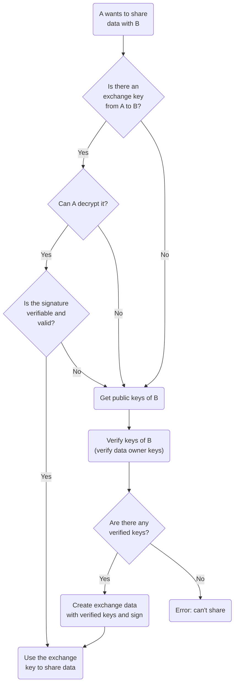

# Keys verification

Key verification is a concept introduced to reduce the amount of trust that users have to put on the integrity of the Cardinal server in order to ensure confidentiality of the data. This concept is not directly related to secure delegations, but since it also improves security and it also has some requirements in the data structures used for encryption metadata we included the implementation of this feature as part of the encrypted delegations feature.

With key verification, we attempt to solve the issue where an attacker with access to the database of Cardinal could insert fake keys which could potentially trick an end-user into sharing data with the attacker. Key verification actually needs to be implemented on two levels to be effective: verification of data owners' keys and verification of exchange keys.

### Data owner keys verification

An attacker could insert his own public key in Cardinal's database, therefore data owners should only use public keys they can recognise when sharing data. Key verification is also important when recovering keys of the user through Cardinal's recovery methods, since an attacker could create a transfer keys which allows the user to "recover" a key pair known by the attacker using one of the real user keys: if the user would actually use the recovered key pair to encrypt data the attacker would also be able to decrypt it.

This problem is unsolvable on the sdk and/or server level alone, and it requires interaction with the application, which in turn will usually ask for some action by the human user.

:::note

Data owner keys verification applies to recovered key pairs of the data owner using the api and public keys of other data owners, but it does not apply to key pairs generated on the device: the Cardinal SDK assumes that if a key pair was generated and stored in the device it is authentic.

:::

### Exchange keys verification

An attacker could create a fake exchange key and encrypt it only with authentic public keys to circumvent the data owner keys verification. This means we also need a way for the sdk to verify the authenticity of exchange keys before using them to share data between two data owners. In the current implementation we do this by using RSA signature.

### Decryption-only keys

A data owner which lost access to his own key pairs and managed to recover partial access may not be able to verify recovered key pairs or exchange keys, even if they are authentic. In order to prevent loss of data in these cases we will still use recovered and unverified keys for decryption of existing data, but not for:

- Encrypting and signing new data, including medical data and key recovery data
- Sharing new or existing data
- Signature verification on existing data

:::warning

This means that an attacker could insert fake data in the database and make it seem legit by encrypting it with a fake encryption key. We currently do not have protection against this type of attack in case the attacker has already gained access to the database.

:::

### Data owner keys verification methods

Data owner key verification methods are not part of the Cardinal SDK because by design they should be implemented by the application, but we can give some ideas and guidelines on how this kind of verification could be implemented. Some potential solutions would include:

- Human friendly representation of public keys, for example by hashing it and then representing the hash using:
- Randomart (the one generated by `ssh-keygen`)
- Emojis, like what telegram does for calls
- Words from a dictionary or name list
- [Robohashes](https://robohash.org) ([note that the license requires attribution](https://github.com/e1ven/Robohash#license))
- A combination of the previous solutions (e.g. robohash face with name and 'personality' emoji)
- Suggest users to save / print their own public keys when creating a new one, since they do not need to be kept secret, and if any key is recovered through Cardinal's recovery methods compare the public key with the saved public keys.
- Qr-code of public keys and scanning by the application
- Hard-coding of some special public keys in the application logic, automatically considering them verified. Note that this solution could make it harder to recover from a private key leak: if not implemented properly users not using the latest version of the application may still share data with the attacker.
- Using an external service for public key verification. This has the benefit to not require any additional action by the user but could be quite challenging. The service needs to be updated when a new public key is inserted legitimately in Cardinal. If an entity (person or device) has administrator access to both the application database in Cardinal and the key verification service we have a single point of failure like before, just in a different place...
