# Secure delegations

This chapter explains the concepts and algorithms used in the current implementation of the secure delegations.

## Objective

Like for the explicit version of the delegation system, the secure delegations system is designed to :

- Allow data owners to share an entity and entity-specific encrypted metadata with other data owners. The encrypted metadata includes the encryption key used to encrypt the entity's content, any secret ids for the entity if applicable, and any owning entity id.
- Allow the backend to understand if a user has the rights to access an entity (access control).

The main objective of the new secure delegations format is to allow the backend to perform his access control tasks without leaking sensitive information in cases where patients could have a delegation to their medical data. This means that the new secure delegations must also satisfy the following requirements:

- Secure delegations should allow the Cardinal backend to verify *during a request* by a pseudo-anonymised data owner (patient) if he has access to a certain entity or not.
- Outside of requests by the patient secure delegations should not allow anyone to infer if the pseudo-anonymised data owner (patient) has access to a certain entity or not, even if given access to the full database and all secrets of Cardinal.

## Anonymous and explicit data owners

The anonymity requirement in delegations which applies to patients could also be extended to other data owners, so from now on instead of referring specifically to patients we will refer to *pseudo-anonymised data owners*. This anonymity however comes at a price, for example in the current Cardinal SDK design:

- The decryption algorithm requires pseudo-anonymised data owners to cache all the exchange keys they know
- Searching for data which a pseudo-anonymised data owner can access requires to perform multiple queries to the database, one for each exchange key that the data owner can access

This means that in order to use Cardinal efficiently, a pseudo-anonymised data owner can share data only with a limited number of other data owners. For this reason in the usual Cardinal application there will be a mix of anonymous and *explicit* data owners. The id of explicit data owners will appear unencrypted in delegations, but they are not bound by this practical limit to the amount of data owners involved in data sharing with them.

The choice of which data owners are anonymous and which are explicit is left to the end-user, and therefore it is done on the sdk level. Generally we can expect all HCPs to use explicit delegations and all Patients to use anonymous delegations. Devices instead could be anonymous or explicit data owners depending on the application: some devices may be personal for a patient and should be anonymous, while hospital devices could be explicit. The choice may not even be tied only to the data owner type: the same application environment may actually use a mix of patient and hospital devices, so a device may be considered as an anonymous or explicit data owners depending on some property of the device itself.

## Exchange data

The Exchange data is the entity that holds the exchange keys between data owners.
It the `aesExchangeKeys` and `hcPartyKeys` used in previous versions of the SDK, in order to better support secure delegations and key verification. Similarly to this existing exchange metadata formats an instance of exchange data contains information used for the sharing of data from a delegator data owner to a delegate data owner, which could potentially be the same, including the *exchange key*, an aes key to use for the encryption of entity-specific exchange keys, secret ids and owning entity ids.

The exchange data, however, differs from the existing `aesExchangeKeys` in three main ways: it is identified by a unique id, it contains an additional encrypted value called *access control secret* (used in the creation of secure delegations as explained later), and it is signed by the delegator in order to confirm the authenticity.

In summary, an instance of exchange data:

- Has a unique id
- Is created by a delegator to share data with a delegate, and:
    - both the delegator and the delegate ids are explicitly indicated in the exchange data (in clear)
    - there may be multiple instances of exchange data for a specific delegator-delegate pair
- Contains an *exchange key* and an *access control secret* encrypted with the public key(s) of the delegator and public key(s) of the delegate.
- Is signed by the delegator to prove its authenticity. Any form of tampering which would allow an attacker to change ar add more exchange key and/or access control secrets to the exchange data invalidates the signature.

## Secure delegations format

Secure delegations are stored inside the `SecurityMetadata` object of encryptable entities. serve a similar purpose to the existing delegations, but they have some significant differences:

- It is admissible for a secure delegation to not specify the delegator and/or delegate data owner id: only ids of explicit data owners will appear in secure delegations.
- A single secure delegation may hold multiple values of encrypted metadata (encryption keys, secret ids and owning entity ids), including potentially multiple values of a specific metadata type (e.g. many secret ids). The only requirement is that all the values have been encrypted with the same exchange key.
- A secure delegation may not have any value for encrypted metadata. This could be used for example in cases where a data owner wants to share an entity with another data owner without allowing them to access any encrypted content of the entity.

Secure delegations also contain metadata which was not in the existing delegations. This includes:

- The permissions that a data owner with access to the secure delegation has on the entity holding the delegation. Currently this is either read-only or read-write, but in future it may be extended to also allow expressing fine-grained permissions.
- Metadata to support the decryption of the secure delegation content.
- Metadata to allow reconstructing the *delegation graph*, explained later

Each entity holds secure delegation keys in a map where each entry associates a *secure delegation key* to a single secure delegation. This secure delegation key is used to support access control for pseudo-anonymised data owners.

### Access Control with Secure Delegation Key

The access control in secure delegations was designed with the following requirements in mind:

- The delegate of a secure delegation needs to be able to prove to the backend that he has access to a delegation even if his id is not explicitly indicated in the delegation.

- No one should be able to prove to the backend that they have access to a secure delegation where they are neither delegator nor delegate, even if they are given the secure delegation key.

- The delegator needs to be able to create the secure delegation and its key without waiting for action by the delegate.

- This access control process should not allow the backend to infer exchange keys or entity-specific encrypted metadata.
- The secure delegation keys should not leak links between a patient and other entities.

The solution we implemented uses a two step process for the calculation of the secure delegation key.

1. Calculate an *access control key*. Only the delegator and delegate of a delegation will be able to perform this step.
2. Use the access control key to calculate the *secure delegation key*. Given the access control key anyone will be able to perform this step.

With this solution a pseudo-anonymised data owner can prove he has access to an entity by providing the access control key corresponding to a secure delegation in the entity. In cases where the data owner is not yet aware of which secure delegations are in the entity, for example because he is retrieving the entity for the first time, he can either pass all access control keys which could apply to the entity, or perform the retrievial in two steps: first request the security metadata, which can be safely given even to users without access to the entity content, then request the entity using the appropriate access control keys.

:::note

The two-step entity retrieval has not been implemented since normally anonymous users will not have many access control keys and we can fully cache them and pass them on each request. If in future we start having some exceptional cases when fully caching the access control keys of a pseudo-anonymised data owner is not feasible we will have to implement this solution as well.

:::

#### Calculating the access control key

The access control key should be calculated using:

- The access control secret of the exchange data used for the creation of the secure delegation. This way only delegator and delegate will be able to generate the access control key for that secure delegation.
- The type of the entity that will hold the secure delegation. This way we can safely use the same exchange data to create secure delegations in patients and medical data without leaking the link between the patient and his medical data, since the access control key and therefore the secure delegation key will be different.

The exact function used to calculate the access control key does not need to be known by the Cardinal server in order for access control to work. Even simple concatenation would work.

#### Calculating the secure delegation key

Since providing the *access control key* is a sufficient condition for a user to prove they have access to a delegation (and therefore an entity) the operation to calculate the secure delegation key must be non-reversible. This could be done using a cryptographically secure hash function, and for this reason we sometime refer to the secure delegation key as *access control hash*.

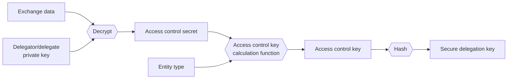

### Secure delegation decryption

The procedure to decrypt secure delegations changes depending on whether the data owner is a pseudo-anonymised data owner or an explicit data owner. The main reason behind this is that we assume that we will always be able to fully cache all exchange data for a pseudo-anonymised data owner, but we may not be able to do the same for an explicit data owner.

#### Decrypting secure delegation as a pseudo-anonymised data owner

Anonymous data owners can build a cache from secure delegation key to exchange key for all of their exchange data. When a pseudo-anonymised data owner needs to decrypt the metadata of an entity he will lookup in the cache for any matching secure delegation key and then use the retrieved exchange key to decrypt the corresponding secure delegation.

#### Decrypting secure delegation as an explicit data owner

For an explicit data owner it may be not feasible to check all his exchange data in order to decrypt a secure delegation, therefore he needs to know the id of the exchange data to use for decryption given the secure delegation and its key. In cases where the counterpart of the secure delegation is also an explicit data owner the exchange data id could be included in cleartext in the secure delegation. However, if the counterpart is a pseudo-anonymised data owner we can't put the exchange data id in cleartext, since the exchange data always indicates both the delegator and delegate id, even if they are anonymous: we need to encrypt the exchange data id using the public keys of the explicit data owner.

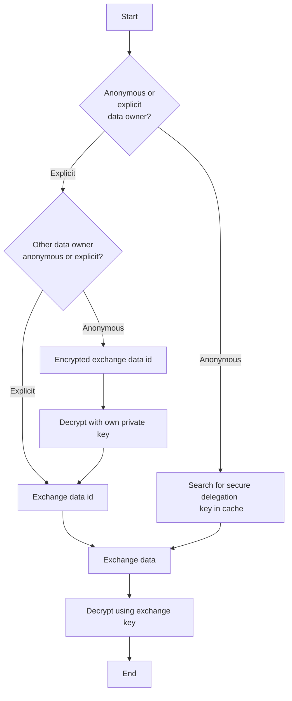

:::note

If needed we may also start encrypting the exchange data id used for a secure delegation also with the public keys of anonymous delegators, as long as we do not include the public key fingerprint.

:::

## Strict access control: delegation graph

Access control with the legacy delegations is very limited: once a data owner gains access to an entity he is allowed to do anything with the entity, including revoking the delegation of the data owner which created the original entity. With the new secure delegations we introduce a new kind of strict access control to the delegations of an entity. The strict access control implements the following rules:

- When a data owner creates an entity he creates a root delegation for himself
- When a data owner creates a new delegation for an entity he creates it as a child to his delegation
- Children delegations can not have higher permissions than their parent delegations: if a data owner has read-only permissions on an entity he is not allowed to share the entity with read-write permissions.
- Data owners can only modify their delegations or descendants of their delegations
- A data owner can't increase the permissions on his delegation, but can freely modify the permissions in his descendants as long as the permissions of each delegation is lower or equal to the parent. In cases where a data owner has a delegation that is also a descendant to another of his delegations he may freely modify it (still respecting the child permission <= parent permissions relationship).

:::info

Since it is impossible to reconstruct an accurate delegation graph from the legacy delegations we consider them as having the same permissions as root delegations.

:::

:::note

The current implementation does not yet support modification of secure delegation permissions.

:::

### Examples of permissions change

#### Example 1

Given the following delegations graph, where `A` created the entity, shared it with `B` giving him read-only permissions and later `B` shared it with `C` giving read only permissions:

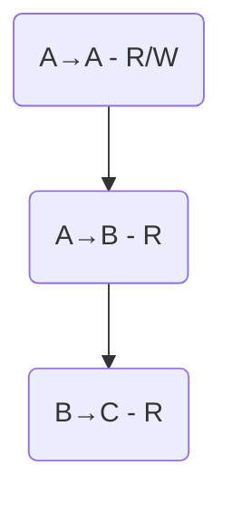

-  `A` can change the permissions of the delegation `A→B` to R/W
- `A` can change the permissions of both `A→B` and `B→C` to R/W
- `A` can NOT change the permissions of only `B→C` to R/W
- `B` can NOT change the permissions of `A→B ` to R/W

#### Example 2

Given the following delegation graph:

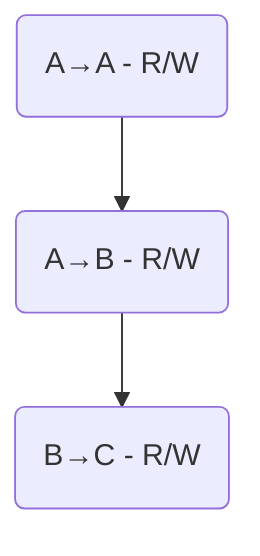

If `A` wants to change the permissions of `A→B` to read-only he also has to update the permissions of `B→C` to read only, otherwise the consistency of the graph is broken.

### Multiple parents for a delegation

There are some rare cases where a single delegation wuold need to have multiple parents. Let's consider the following where a patient (`P`) has access to an entity through 2 delegations (given from HCP `A` and from HCP `B`):

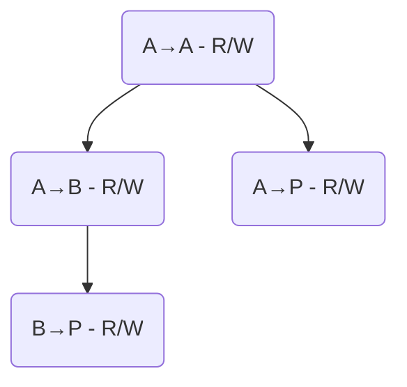

The delegations `A→P` and `B→P` may seem redundant, but actually `B` can't know that `A` has shared the entity with `P`, he can only know that `A` shared data with some pseudo-anonymised data owner, and vice-versa. In this case when `P` shares the entity with another data owner (for example `C`) the new delegation will have two parents.

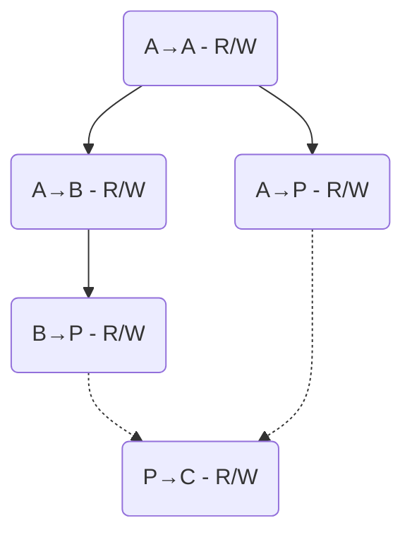

If a delegation has multiple parents the consistency rule is that the permission of the child delegation must be lower or equal to the permission of at least one parent delegation. This means that if `B` wants to revoke access to `P` by removing the delegation `B→P` or reduce his access to read-only, the delegation `P→C` will remain unchanged, since it still has a parent with R/W access.

:::info

This leaks information about `A→P` and `B→P`. Every observer will be able to learn that they refer to the same pseudo-anonymised data owner, and in the specific case of `A` and `B` they will learn that the other delegation refers to `P`. This however does not give any significant information to an attacker: in most cases it is reasonable to assume that anonymous delegations in an entity refer to the patient connected to that data.

:::

#### Example

Consider the previous delegation graph as the starting situation. If  `B` wants to change the permissions of `B→P` to read only we obtain the following graph.

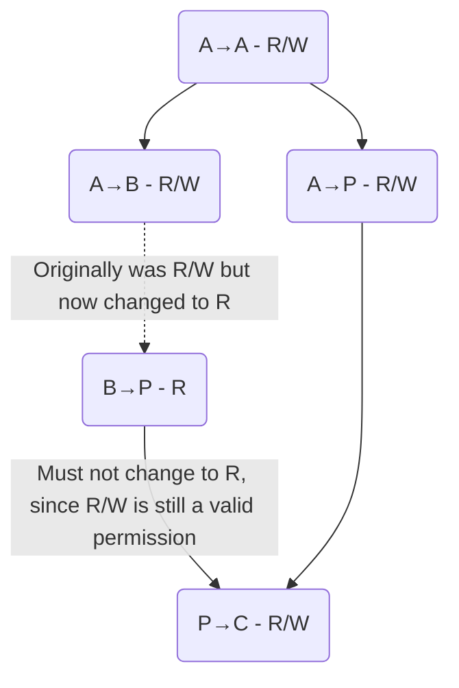

and if later also `A` wants to change the permissions of `A→P` to read-only:
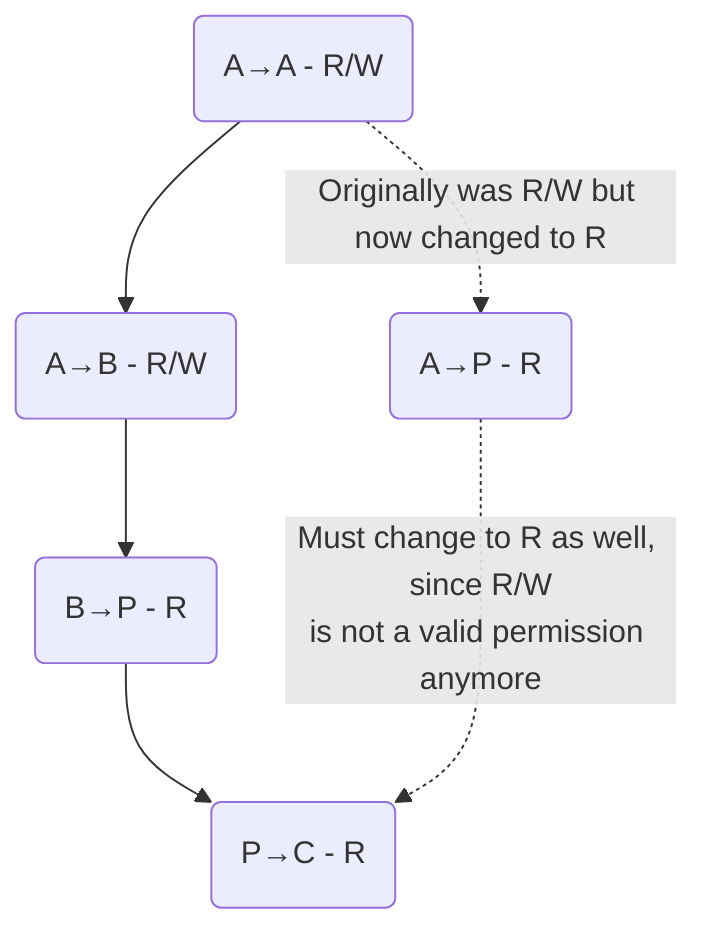

### Delegation graph with data owner hierarchys

Data owners are allowed to create delegations even for entities where they do not have an explicit delegations to themselves if there is at least a delegation to one of their parents. This is not problematic, but may contribute to the creation of delegation graphs with at first glance seem to not make sense. Consider for example a situation with two HCPs `A` and `B`, childrens of `G`, and the following delegation graph of an entity created by `A`:
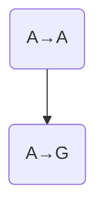
If now `B` wants to share the entity with a third data owner, for example the patient `P` we obtain the following graph:
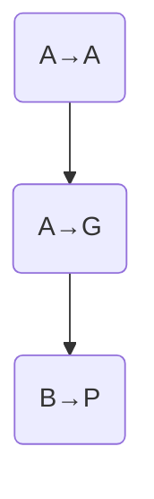

### Entity merging on request by data owners

There are some situations where data owners need to merge two different entities into a single one. This can happen for example if a certain person exists twice in the database as a patient: in this case an hcp will merge the two patients into one. Merging of the entity content is left to the application, but the merging of the metadata needs to be handled by Cardinal.

When merging two entities we need to merge the secure delegations from the different entitites which have the same keys. The merging of the encrypted secure delegation content is trivial, it is simply a set union, and for the merging of the access level we simply keep the highest. The merging of the parent delegations, however, is a bit more complicated, because we need to make sure that the delegation graph remains consistent. The rules for merging are:

- If both secure delegations to merge have one or more parent delegation each then the merged delegation will have both parents.

- If one of the secure delegations is a root delegation (has no parent) it will be a root delegation also in the merged entity, even if it was not a root delegation in the 'merged into' entity (loses the parent). Without this rule we could incur into a situation where a data owner could gain increased permissions on an entity after he merges another entity into it, for example consider the following two delegation graphs:
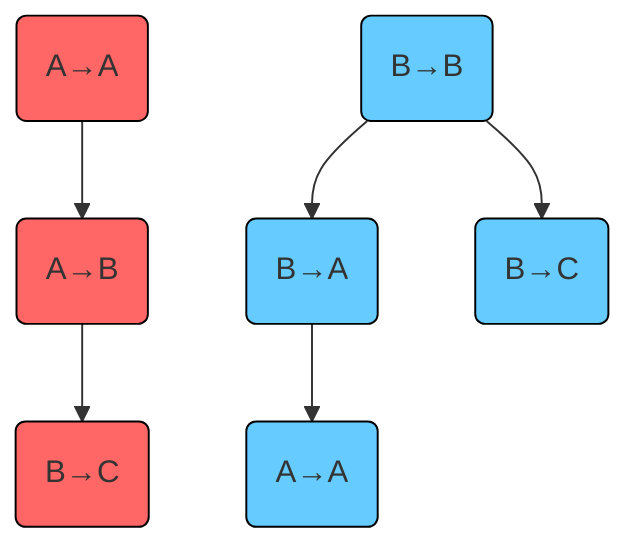
If we were to merge the right entity into the left entity by also making a union of the parents then `B` would gain rights over the delegation `A→A` even though he doesn't have them in the original entity. The delegation graph resulting from the merge should be:
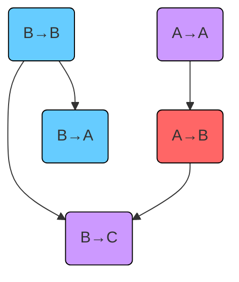

## Searching data

When searching for data (list or filter methods) explicit and pseudo-anonymised data owners use different strategies:

- An explicit data searches for entities having at least a delegation where he is the delegate.
- An aonymous data owner searches for entities having at least a secure delegation key that he can access.

We will call the data owner id or secure delegation key used in data search a *search key*. An explicit data owner uses only one search key, but a pseudo-anonymised data owner may use many more, equal to the amount of exchange data he has. This is especially problematic if a user wants to retrieve ordered data, since in our current implementation of Cardinal data will always be ordered firstly by search key and only secondly by the requested ordering value.

### Views by search key

For each secure delegation in an entity the views as search key both the **id of the delegate** of the secure delegation, if explicit, and the **key of the secure delegation** if there is at least a pseudo-anonymised data owner involved in the delegation. Some important things to note are that these views:

- do NOT emit explicit delegates: this is equivalent to the behaviour of the existing "by hc party" views
- do NOT emit the secure delegation key when both delegator and delegate are explicit, since it will not be used
- emit the secure delegation key even if the delegate is explicit.

This means that views do not emit the explicit delegator of a secure delegation, but emit both the explicit delegate and secure delegation key needed by the delegator in secure delegations from an anonymous delegator to an explicit delegate. This may look like an inconsistency but it is actually needed in some cases to guarantee that anonymous delegators can properly search for their data.

Consider a scenario with a patient `P`, HCP `A` and an entity with the following delegations:

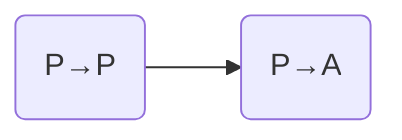

Normally `P` would be able to find this entity using the search key `secDelKey(P→P)`. Now consider the case where `P` loses he key pair and has to create a new one. He can regain access to the entity by asking for access back to the exchange data with `A`, but he will never be able to regain access to his exchange data `P→P`: this means he won't be able to search for data using `secDelKey(P→P)`, and he will instead be able to find this entity only by searching for `secDelKey(P→A)`. This means if we do not emit the secure delegation key for anonymous&rarr;explicit delegations we may prevent pseudo-anonymised data owners from accessing part of their data.
