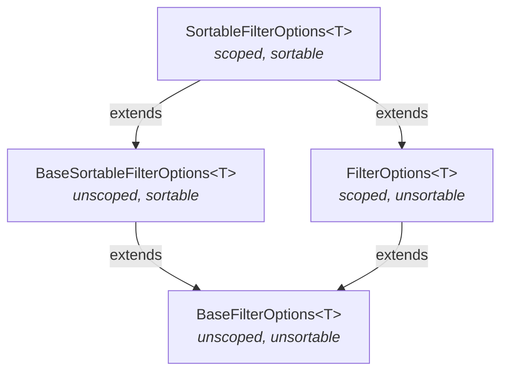

import TabItem from "@theme/TabItem";
import {LanguageTabs} from "@site/src/components/LanguageTabs";

# Everything about filters

This page is a comprehensive reference for all filter factories available in the Cardinal SDK. It covers the filter
type hierarchy, combinators, date format conventions, and every filter method for each entity type.

For a gentler introduction to querying, see [Querying data](/how-to/querying-data).

## Filter type hierarchy

The SDK provides four filter option types arranged by two axes: **scoped vs unscoped** and **sortable vs unsortable**.



| Type                           | Scoped? | Sortable? | Typical factory suffix                              |
|--------------------------------|---------|-----------|-----------------------------------------------------|
| `BaseFilterOptions<T>`         | No      | No        | `ForDataOwner`, `ForDataOwnerInGroup`, or no suffix |
| `BaseSortableFilterOptions<T>` | No      | Yes       | `ForDataOwner`, `ForDataOwnerInGroup`, or no suffix |
| `FilterOptions<T>`             | Yes     | No        | `ForSelf`                                           |
| `SortableFilterOptions<T>`     | Yes     | Yes       | `ForSelf`                                           |

**Scoped** filter options (`FilterOptions`, `SortableFilterOptions`) are bound to the current SDK user's session. They
are produced by `ForSelf` factory methods. **Unscoped** options (`Base*`) require an explicit data owner id and can be
used by administrators or across groups.

You can always pass a more-specific type where a less-specific type is expected (e.g. a `SortableFilterOptions` wherever
a `BaseFilterOptions` is expected).

## Data owner variants

Most filter factories for EBAC entities (Patient, Contact, Service, HealthElement, Document, etc.) come in three variants:

| Suffix                | When to use                                                                                         |
|-----------------------|-----------------------------------------------------------------------------------------------------|
| `ForSelf`             | Default choice. Uses the current logged-in data owner.                                              |
| `ForDataOwner`        | When querying as an admin or on behalf of another data owner. Requires the data owner's id.         |
| `ForDataOwnerInGroup` | Cross-group queries. Takes an `EntityReferenceInGroup` to target a data owner in a different group. |

For more details, see [Data owners and access control](/explanations/end-to-end-encryption/data-owners-and-access-control).

## Combining filters

Filter options can be combined using three operators:

### intersection (AND)

Returns entities that match **all** provided filters. Requires at least two filters.

<LanguageTabs>

<TabItem value="kotlin">

```kotlin no-test
// Function call
val filter = intersection(filterA, filterB, filterC)
// Infix shorthand
val filter = filterA and filterB and filterC
```

</TabItem>

<TabItem value="typescript">

```typescript no-test
import {intersection} from "@icure/cardinal-sdk"

const filter = intersection(filterA, filterB, filterC)
```

</TabItem>

<TabItem value="python">

```python no-test
from cardinal_sdk.filters import intersection

filter = intersection(filter_a, filter_b, filter_c)
```

</TabItem>

</LanguageTabs>

### union (OR)

Returns entities that match **at least one** of the provided filters. Requires at least two filters.

<LanguageTabs>

<TabItem value="kotlin">

```kotlin no-test
val filter = union(filterA, filterB)
// Infix shorthand
val filter = filterA or filterB
```

</TabItem>

<TabItem value="typescript">

```typescript no-test
import {union} from "@icure/cardinal-sdk"

const filter = union(filterA, filterB)
```

</TabItem>

<TabItem value="python">

```python no-test
from cardinal_sdk.filters import union

filter = union(filter_a, filter_b)
```

</TabItem>

</LanguageTabs>

### difference (set minus)

Returns entities that match the first filter (`of`) but **not** the second (`subtracting`).

<LanguageTabs>

<TabItem value="kotlin">

```kotlin no-test
val filter = difference(ofFilter, subtractingFilter)
```

</TabItem>

<TabItem value="typescript">

```typescript no-test
import {difference} from "@icure/cardinal-sdk"

const filter = difference(ofFilter, subtractingFilter)
```

</TabItem>

<TabItem value="python">

```python no-test
from cardinal_sdk.filters import difference

filter = difference(of_filter, subtracting_filter)
```

</TabItem>

</LanguageTabs>

### Sortability rules

| Combinator     | Sortable?                     | Rule                               |
|----------------|-------------------------------|------------------------------------|
| `intersection` | If first argument is sortable | Sorts by first argument's criteria |
| `union`        | Never                         | —                                  |
| `difference`   | If `of` is sortable           | Sorts by `of`'s criteria           |

:::tip Kotlin infix syntax

In Kotlin, `and` is shorthand for `intersection` and `or` for `union`. You can chain them:
```kotlin no-test
val filter = (filterA and filterB) or (filterC and filterD)
```

:::

## Date format conventions

Different entity properties use different date formats:

| Format              | Description              | Used by                                                                                                                                  |
|---------------------|--------------------------|------------------------------------------------------------------------------------------------------------------------------------------|
| `YYYYMMDD`          | 8-digit integer date     | `Patient.dateOfBirth`                                                                                                                    |
| `YYYYMMDDHHmmSS`    | 14-digit fuzzy date      | `Contact.openingDate`, `Service.valueDate`, `Service.openingDate`, `HealthElement.openingDate`, `Form.created`, `CalendarItem.startTime` |
| Unix timestamp (ms) | Milliseconds since epoch | `Document.created`, `Message.sentDate`                                                                                                   |

For example, `20250315` means March 15, 2025. The fuzzy date `20250315143000` means March 15, 2025 at 14:30:00.

## Code and tag filtering patterns

Many entities have **codes** (clinical coding: ICD-10, SNOMED, LOINC, etc.) and **tags** (categorical labels).

### Type-only vs type+code

When you provide only a `codeType`/`tagType` and omit the code value, the filter matches all entities with **any** code
of that type. When you also provide a `codeCode`/`tagCode`, the filter narrows to that specific code.

### Code+date compound filters

For Contacts and Services, the code/tag filters support an optional date range. However, **you must provide the code
value to use a date range** — type-only filtering with a date range is not supported and will throw an error.

### byServiceTag / byServiceCode on ContactFilters

`ContactFilters` has special `byServiceTag` and `byServiceCode` methods that match contacts based on codes or tags
present on their **services** rather than on the contact itself. These are useful when you want to find contacts that
contain services with specific clinical codes.

## Patient-linked entity filters

### byPatients vs byPatientsSecretIds

Most EBAC entity filters provide two patterns for filtering by linked patients:

- **`byPatients`** — accepts `Patient` objects. The SDK automatically extracts secret ids. Cannot be used with
`CardinalBaseApis`. This is the convenient option for most use cases.
- **`byPatientsSecretIds` / `byPatientSecretIds`** — accepts raw secret id strings. Use this when you already have the
secret ids or need to work with `CardinalBaseApis`.

### Date-range variants

Many patient-linked filters also accept `from`/`to` date bounds and a `descending` flag for sorting:

| Entity         | Method                  | Date property                                 |
|----------------|-------------------------|-----------------------------------------------|
| Contact        | `byPatientsOpeningDate` | `Contact.openingDate`                         |
| Service        | `byPatientsDate`        | `Service.valueDate` (fallback: `openingDate`) |
| HealthElement  | `byPatientsOpeningDate` | `HealthElement.openingDate`                   |
| Document       | `byPatientsCreated`     | `Document.created`                            |
| Message        | `byPatientsSentDate`    | `Message.sentDate`                            |
| CalendarItem   | `byPatientsStartTime`   | `CalendarItem.startTime`                      |
| Form           | `byPatientsOpeningDate` | `Form.created`                                |
| Classification | `byPatientsCreated`     | `Classification.created`                      |
| AccessLog      | `byPatientsDate`        | `AccessLog.date`                              |

---

## Entity filter reference

The tables below list the **ForSelf** variant of each method. For most methods, equivalent `ForDataOwner` and
`ForDataOwnerInGroup` variants exist (prepend the data owner id or `EntityReferenceInGroup` as first argument).
Methods with no data-owner scoping are marked with **—** in the Scoping column.

### PatientFilters

| Method                                  | Key parameters                               | Return type             | Sortable? | Sort order                         |
|-----------------------------------------|----------------------------------------------|-------------------------|-----------|------------------------------------|
| `allPatientsForSelf`                    | —                                            | `FilterOptions`         | No        | —                                  |
| `byIds`                                 | `ids`                                        | `SortableFilterOptions` | Yes       | Input order                        |
| `byIdentifiersForSelf`                  | `identifiers`                                | `SortableFilterOptions` | Yes       | Input order                        |
| `bySsinsForSelf`                        | `ssins`                                      | `SortableFilterOptions` | Yes       | Input order                        |
| `byDateOfBirthBetweenForSelf`           | `fromDate`, `toDate`                         | `SortableFilterOptions` | Yes       | Date of birth                      |
| `byNameForSelf`                         | `searchString`                               | `FilterOptions`         | No        | —                                  |
| `byGenderEducationProfessionForSelf`    | `gender`, `education?`, `profession?`        | `SortableFilterOptions` | Yes       | Education, profession              |
| `byActiveForSelf`                       | `active`                                     | `FilterOptions`         | No        | —                                  |
| `byTelecomForSelf`                      | `searchString`                               | `SortableFilterOptions` | Yes       | Telecom number                     |
| `byAddressPostalCodeHouseNumberForSelf` | `searchString`, `postalCode`, `houseNumber?` | `SortableFilterOptions` | Yes       | Address, postal code, house number |
| `byAddressForSelf`                      | `searchString`                               | `SortableFilterOptions` | Yes       | Address                            |
| `byTagForSelf`                          | `tagType`, `tagCode?`                        | `FilterOptions`         | No        | —                                  |

:::note
`byIds` has no data-owner scoping — it returns a `SortableFilterOptions` (not Base) and works the same for all users.
The `ForDataOwner` variants for the other methods also exist (e.g. `byFuzzyNameForDataOwner` accepts a `dataOwnerId` + `searchString`).
:::

### ContactFilters

| Method                                 | Key parameters                                                                    | Return type                 | Sortable? | Sort order          |
|----------------------------------------|-----------------------------------------------------------------------------------|-----------------------------|-----------|---------------------|
| `allContactsForSelf`                   | —                                                                                 | `FilterOptions`             | No        | —                   |
| `byFormIdsForSelf`                     | `formIds`                                                                         | `FilterOptions`             | No        | —                   |
| `byPatientsOpeningDateForSelf`         | `patients`, `from?`, `to?`, `descending?`                                         | `SortableFilterOptions`     | Yes       | `openingDate`       |
| `byPatientSecretIdsOpeningDateForSelf` | `secretIds`, `from?`, `to?`, `descending?`                                        | `SortableFilterOptions`     | Yes       | `openingDate`       |
| `byIdentifiersForSelf`                 | `identifiers`                                                                     | `SortableFilterOptions`     | Yes       | Input order         |
| `byCodeAndOpeningDateForSelf`          | `codeType`, `codeCode?`, `startOfContactOpeningDate?`, `endOfContactOpeningDate?` | `SortableFilterOptions`     | Yes       | Code, `openingDate` |
| `byTagAndOpeningDateForSelf`           | `tagType`, `tagCode?`, `startOfContactOpeningDate?`, `endOfContactOpeningDate?`   | `SortableFilterOptions`     | Yes       | Tag, `openingDate`  |
| `byOpeningDateForSelf`                 | `startDate?`, `endDate?`, `descending?`                                           | `SortableFilterOptions`     | Yes       | `openingDate`       |
| `byServiceTagForSelf`                  | `tagType`, `tagCode?`                                                             | `FilterOptions`             | No        | —                   |
| `byServiceCodeForSelf`                 | `codeType`, `codeCode?`                                                           | `FilterOptions`             | No        | —                   |
| `byPatientsForSelf`                    | `patients`                                                                        | `SortableFilterOptions`     | Yes       | Input order         |
| `byPatientsSecretIdsForSelf`           | `secretIds`                                                                       | `SortableFilterOptions`     | Yes       | Input order         |
| `byServiceIds`                         | `serviceIds`                                                                      | `BaseSortableFilterOptions` | Yes       | Input order         |

### ServiceFilters

| Method                                   | Key parameters                                                                | Return type                 | Sortable? | Sort order        |
|------------------------------------------|-------------------------------------------------------------------------------|-----------------------------|-----------|-------------------|
| `allServicesForSelf`                     | —                                                                             | `FilterOptions`             | No        | —                 |
| `byIdentifiersForSelf`                   | `identifiers`                                                                 | `SortableFilterOptions`     | Yes       | Input order       |
| `byCodeAndValueDateForSelf`              | `codeType`, `codeCode?`, `startOfServiceValueDate?`, `endOfServiceValueDate?` | `SortableFilterOptions`     | Yes       | Code, `valueDate` |
| `byTagAndValueDateForSelf`               | `tagType`, `tagCode?`, `startOfServiceValueDate?`, `endOfServiceValueDate?`   | `SortableFilterOptions`     | Yes       | Tag, `valueDate`  |
| `byPatientsForSelf`                      | `patients`                                                                    | `SortableFilterOptions`     | Yes       | Input order       |
| `byPatientsSecretIdsForSelf`             | `secretIds`                                                                   | `SortableFilterOptions`     | Yes       | Input order       |
| `byHealthElementIdFromSubContactForSelf` | `healthElementIds`                                                            | `SortableFilterOptions`     | Yes       | Input order       |
| `byPatientsDateForSelf`                  | `patients`, `from?`, `to?`, `descending?`                                     | `SortableFilterOptions`     | Yes       | `valueDate`       |
| `byPatientSecretIdsDateForSelf`          | `secretIds`, `from?`, `to?`, `descending?`                                    | `SortableFilterOptions`     | Yes       | `valueDate`       |
| `byIds`                                  | `ids`                                                                         | `BaseSortableFilterOptions` | Yes       | Input order       |
| `byAssociationId`                        | `associationId`                                                               | `BaseFilterOptions`         | No        | —                 |
| `byQualifiedLink`                        | `linkValues`, `linkQualification?`                                            | `BaseFilterOptions`         | No        | —                 |

### HealthElementFilters

| Method                                 | Key parameters                             | Return type                 | Sortable? | Sort order    |
|----------------------------------------|--------------------------------------------|-----------------------------|-----------|---------------|
| `allHealthElementsForSelf`             | —                                          | `FilterOptions`             | No        | —             |
| `byIdentifiersForSelf`                 | `identifiers`                              | `SortableFilterOptions`     | Yes       | Input order   |
| `byCodeForSelf`                        | `codeType`, `codeCode?`                    | `SortableFilterOptions`     | Yes       | Code          |
| `byTagForSelf`                         | `tagType`, `tagCode?`                      | `SortableFilterOptions`     | Yes       | Tag           |
| `byPatientsForSelf`                    | `patients`                                 | `SortableFilterOptions`     | Yes       | Input order   |
| `byPatientsSecretIdsForSelf`           | `secretIds`                                | `SortableFilterOptions`     | Yes       | Input order   |
| `byIds`                                | `ids`                                      | `BaseSortableFilterOptions` | Yes       | Input order   |
| `byPatientsOpeningDateForSelf`         | `patients`, `from?`, `to?`, `descending?`  | `SortableFilterOptions`     | Yes       | `openingDate` |
| `byPatientSecretIdsOpeningDateForSelf` | `secretIds`, `from?`, `to?`, `descending?` | `SortableFilterOptions`     | Yes       | `openingDate` |

### DocumentFilters

| Method                                  | Key parameters                             | Return type             | Sortable? | Sort order |
|-----------------------------------------|--------------------------------------------|-------------------------|-----------|------------|
| `byPatientsCreatedForSelf`              | `patients`, `from?`, `to?`, `descending?`  | `SortableFilterOptions` | Yes       | `created`  |
| `byMessagesCreatedForSelf`              | `messages`, `from?`, `to?`, `descending?`  | `SortableFilterOptions` | Yes       | `created`  |
| `byOwningEntitySecretIdsCreatedForSelf` | `secretIds`, `from?`, `to?`, `descending?` | `SortableFilterOptions` | Yes       | `created`  |
| `byPatientsAndTypeForSelf`              | `documentType`, `patients`                 | `FilterOptions`         | No        | —          |
| `byMessagesAndTypeForSelf`              | `documentType`, `messages`                 | `FilterOptions`         | No        | —          |
| `byOwningEntitySecretIdsAndTypeForSelf` | `documentType`, `secretIds`                | `FilterOptions`         | No        | —          |
| `byCodeForSelf`                         | `codeType`, `codeCode?`                    | `SortableFilterOptions` | Yes       | Code       |
| `byTagForSelf`                          | `tagType`, `tagCode?`                      | `SortableFilterOptions` | Yes       | Tag        |

### HealthcarePartyFilters

Healthcare party filters are not data-owner scoped — they all return `Base*` types.

| Method                 | Key parameters                | Return type                 | Sortable? | Sort order      |
|------------------------|-------------------------------|-----------------------------|-----------|-----------------|
| `all`                  | —                             | `BaseFilterOptions`         | No        | —               |
| `byIdentifiers`        | `identifiers`                 | `BaseFilterOptions`         | No        | —               |
| `byCode`               | `codeType`, `codeCode?`       | `BaseSortableFilterOptions` | Yes       | Code            |
| `byTag`                | `tagType`, `tagCode?`         | `BaseSortableFilterOptions` | Yes       | Tag             |
| `byIds`                | `ids`                         | `SortableFilterOptions`     | Yes       | Input order     |
| `byName`               | `searchString`, `descending?` | `BaseSortableFilterOptions` | Yes       | Name/speciality |
| `byNationalIdentifier` | `searchString`, `descending?` | `BaseSortableFilterOptions` | Yes       | SSIN            |
| `byParentId`           | `parentId`                    | `BaseFilterOptions`         | No        | —               |

### Other entity filters

#### UserFilters

| Method                | Key parameters      | Return type                 | Sortable? |
|-----------------------|---------------------|-----------------------------|-----------|
| `all`                 | —                   | `BaseFilterOptions`         | No        |
| `byIds`               | `ids`               | `BaseSortableFilterOptions` | Yes       |
| `byPatientId`         | `patientId`         | `BaseFilterOptions`         | No        |
| `byHealthcarePartyId` | `healthcarePartyId` | `BaseFilterOptions`         | No        |
| `byNameEmailOrPhone`  | `searchString`      | `BaseFilterOptions`         | No        |

#### CodeFilters

| Method                              | Key parameters                                      | Return type                 | Sortable? |
|-------------------------------------|-----------------------------------------------------|-----------------------------|-----------|
| `all`                               | —                                                   | `BaseFilterOptions`         | No        |
| `byIds`                             | `ids`                                               | `BaseSortableFilterOptions` | Yes       |
| `byQualifiedLink`                   | `linkType`, `linkedId?`                             | `BaseFilterOptions`         | No        |
| `byRegionTypeCodeVersion`           | `region`, `type?`, `code?`, `version?`              | `BaseFilterOptions`         | No        |
| `byLanguageTypeLabelRegion`         | `language`, `type`, `label?`, `region?`             | `BaseFilterOptions`         | No        |
| `byLanguageTypesLabelRegionVersion` | `language`, `types`, `label`, `region?`, `version?` | `BaseFilterOptions`         | No        |

#### MessageFilters

| Method                              | Key parameters                                   | Return type             | Sortable? |
|-------------------------------------|--------------------------------------------------|-------------------------|-----------|
| `allMessagesForSelf`                | —                                                | `FilterOptions`         | No        |
| `byTransportGuidForSelf`            | `transportGuid`                                  | `SortableFilterOptions` | Yes       |
| `fromAddressForSelf`                | `address`                                        | `FilterOptions`         | No        |
| `toAddressForSelf`                  | `address`                                        | `FilterOptions`         | No        |
| `byPatientsSentDateForSelf`         | `patients`, `from?`, `to?`, `descending?`        | `SortableFilterOptions` | Yes       |
| `byPatientSecretIdsSentDateForSelf` | `secretIds`, `from?`, `to?`, `descending?`       | `SortableFilterOptions` | Yes       |
| `byTransportGuidSentDateForSelf`    | `transportGuid`, `from`, `to`, `descending?`     | `SortableFilterOptions` | Yes       |
| `latestByTransportGuidForSelf`      | `transportGuid`                                  | `FilterOptions`         | No        |
| `lifecycleBetweenForSelf`           | `startTimestamp?`, `endTimestamp?`, `descending` | `FilterOptions`         | No        |
| `byCodeForSelf`                     | `codeType`, `codeCode?`                          | `SortableFilterOptions` | Yes       |
| `byTagForSelf`                      | `tagType`, `tagCode?`                            | `SortableFilterOptions` | Yes       |
| `byInvoiceIds`                      | `invoiceIds`                                     | `BaseFilterOptions`     | No        |
| `byParentIds`                       | `parentIds`                                      | `BaseFilterOptions`     | No        |

#### CalendarItemFilters

| Method                               | Key parameters                                   | Return type                 | Sortable? |
|--------------------------------------|--------------------------------------------------|-----------------------------|-----------|
| `byPatientsStartTimeForSelf`         | `patients`, `from?`, `to?`, `descending?`        | `SortableFilterOptions`     | Yes       |
| `byPatientSecretIdsStartTimeForSelf` | `secretIds`, `from?`, `to?`, `descending?`       | `SortableFilterOptions`     | Yes       |
| `byPeriodAndAgenda`                  | `agendaId`, `from`, `to`, `descending?`          | `BaseSortableFilterOptions` | Yes       |
| `byPeriodForSelf`                    | `from`, `to`                                     | `FilterOptions`             | No        |
| `byRecurrenceId`                     | `recurrenceId`                                   | `FilterOptions`             | No        |
| `lifecycleBetweenForSelf`            | `startTimestamp?`, `endTimestamp?`, `descending` | `FilterOptions`             | No        |

#### GroupFilters

| Method         | Key parameters                 | Return type                 | Sortable? |
|----------------|--------------------------------|-----------------------------|-----------|
| `all`          | —                              | `BaseFilterOptions`         | No        |
| `bySuperGroup` | `superGroupId`                 | `BaseFilterOptions`         | No        |
| `withContent`  | `superGroupId`, `searchString` | `BaseSortableFilterOptions` | Yes       |

#### FormFilters

| Method                                 | Key parameters                             | Return type                 | Sortable? |
|----------------------------------------|--------------------------------------------|-----------------------------|-----------|
| `byParentIdForSelf`                    | `parentId`                                 | `FilterOptions`             | No        |
| `byPatientsOpeningDateForSelf`         | `patients`, `from?`, `to?`, `descending?`  | `SortableFilterOptions`     | Yes       |
| `byPatientSecretIdsOpeningDateForSelf` | `secretIds`, `from?`, `to?`, `descending?` | `SortableFilterOptions`     | Yes       |
| `byUniqueId`                           | `uniqueId`, `descending?`                  | `BaseSortableFilterOptions` | Yes       |

#### AccessLogFilters

| Method                          | Key parameters                                  | Return type                 | Sortable? |
|---------------------------------|-------------------------------------------------|-----------------------------|-----------|
| `byPatientsDateForSelf`         | `patients`, `from?`, `to?`, `descending?`       | `SortableFilterOptions`     | Yes       |
| `byPatientSecretIdsDateForSelf` | `secretIds`, `from?`, `to?`, `descending?`      | `SortableFilterOptions`     | Yes       |
| `byDate`                        | `from?`, `to?`, `descending?`                   | `BaseSortableFilterOptions` | Yes       |
| `byUserTypeDate`                | `userId`, `accessType?`, `from?`, `descending?` | `BaseSortableFilterOptions` | Yes       |

#### DeviceFilters

| Method          | Key parameters  | Return type                 | Sortable? |
|-----------------|-----------------|-----------------------------|-----------|
| `all`           | —               | `BaseFilterOptions`         | No        |
| `byResponsible` | `responsibleId` | `BaseFilterOptions`         | No        |
| `byIds`         | `ids`           | `BaseSortableFilterOptions` | Yes       |

#### AgendaFilters

| Method                 | Key parameters                | Return type         | Sortable? |
|------------------------|-------------------------------|---------------------|-----------|
| `all`                  | —                             | `BaseFilterOptions` | No        |
| `byUser`               | `userId`                      | `BaseFilterOptions` | No        |
| `readableByUser`       | `userId`                      | `BaseFilterOptions` | No        |
| `readableByUserRights` | `userId`                      | `BaseFilterOptions` | No        |
| `byStringProperty`     | `propertyId`, `propertyValue` | `BaseFilterOptions` | No        |
| `byBooleanProperty`    | `propertyId`, `propertyValue` | `BaseFilterOptions` | No        |
| `byLongProperty`       | `propertyId`, `propertyValue` | `BaseFilterOptions` | No        |
| `byDoubleProperty`     | `propertyId`, `propertyValue` | `BaseFilterOptions` | No        |
| `withProperty`         | `propertyId`                  | `BaseFilterOptions` | No        |

#### TopicFilters

| Method             | Key parameters  | Return type     | Sortable? |
|--------------------|-----------------|-----------------|-----------|
| `allTopicsForSelf` | —               | `FilterOptions` | No        |
| `byParticipant`    | `participantId` | `FilterOptions` | No        |

---

## Complex filter examples

### 1. Diabetic patient screening cohort

Find active female patients over 50 with an ICD-10 E11 (type 2 diabetes) diagnosis. This requires a cross-entity
query: first find patients matching demographic criteria, then check their health elements for the diagnosis code.

<LanguageTabs>

<TabItem value="kotlin">

```kotlin no-test
import com.icure.cardinal.sdk.CardinalSdk
import com.icure.cardinal.sdk.filters.HealthElementFilters
import com.icure.cardinal.sdk.filters.PatientFilters
import com.icure.cardinal.sdk.filters.intersection
import com.icure.cardinal.sdk.model.DecryptedPatient
import com.icure.cardinal.sdk.model.embed.Gender

suspend fun findDiabeticScreeningCohort(sdk: CardinalSdk): List<DecryptedPatient> {
	// Step 1: Find active females born before 1976 (over ~50)
	val patientFilter = intersection(
		PatientFilters.byGenderEducationProfessionForSelf(Gender.Female),
		PatientFilters.byDateOfBirthBetweenForSelf(
			fromDate = 19000101,
			toDate = 19760101
		),
		PatientFilters.byActiveForSelf(true)
	)
	val candidates = sdk.patient.getPatients(
		sdk.patient.matchPatientsBy(patientFilter)
	)

	// Step 2: For each candidate, check for ICD-10 E11 health elements
	val diabetesFilter = intersection(
		HealthElementFilters.byPatientsForSelf(candidates),
		HealthElementFilters.byCodeForSelf("ICD-10", codeCode = "E11")
	)
	val diabeticPatientIds = mutableSetOf<String>()
	val heIterator = sdk.healthElement.filterHealthElementsBy(diabetesFilter)
	while (heIterator.hasNext()) {
		heIterator.next(100).forEach { he ->
			he.id.let { diabeticPatientIds.add(it) }
		}
	}

	return candidates.filter { it.id in diabeticPatientIds }
}
```

</TabItem>

<TabItem value="typescript">

```typescript no-test
import {
	CardinalSdk,
	DecryptedPatient,
	Gender,
	HealthElementFilters,
	intersection,
	PatientFilters,
} from "@icure/cardinal-sdk"

async function findDiabeticScreeningCohort(sdk: CardinalSdk): Promise<Array<DecryptedPatient>> {
	// Step 1: Find active females born before 1976 (over ~50)
	const patientFilter = intersection(
		PatientFilters.byGenderEducationProfessionForSelf(Gender.Female),
		PatientFilters.byDateOfBirthBetweenForSelf(19000101, 19760101),
		PatientFilters.byActiveForSelf(true)
	)
	const candidates = await sdk.patient.getPatients(
		await sdk.patient.matchPatientsBy(patientFilter)
	)

	// Step 2: For each candidate, check for ICD-10 E11 health elements
	const diabetesFilter = intersection(
		HealthElementFilters.byPatientsForSelf(candidates),
		HealthElementFilters.byCodeForSelf("ICD-10", { codeCode: "E11" })
	)
	const diabeticPatientIds = new Set<string>()
	const heIterator = await sdk.healthElement.filterHealthElementsBy(diabetesFilter)
	while (await heIterator.hasNext()) {
		const batch = await heIterator.next(100)
		batch.forEach(he => diabeticPatientIds.add(he.id))
	}

	return candidates.filter(p => diabeticPatientIds.has(p.id))
}
```

</TabItem>

<TabItem value="python">

```python no-test
from cardinal_sdk import CardinalSdk
from cardinal_sdk.model import DecryptedPatient, Gender
from cardinal_sdk.filters import PatientFilters, HealthElementFilters, intersection
from typing import List

def find_diabetic_screening_cohort(sdk: CardinalSdk) -> List[DecryptedPatient]:
    # Step 1: Find active females born before 1976 (over ~50)
    patient_filter = intersection(
        PatientFilters.by_gender_education_profession_for_self(Gender.Female),
        PatientFilters.by_date_of_birth_between_for_self(19000101, 19760101),
        PatientFilters.by_active_for_self(True)
    )
    candidates = sdk.patient.get_patients_blocking(
        sdk.patient.match_patients_by_blocking(patient_filter)
    )

    # Step 2: For each candidate, check for ICD-10 E11 health elements
    diabetes_filter = intersection(
        HealthElementFilters.by_patients_for_self(candidates),
        HealthElementFilters.by_code_for_self("ICD-10", code_code="E11")
    )
    diabetic_patient_ids = set()
    he_iterator = sdk.health_element.filter_health_elements_by_blocking(diabetes_filter)
    while he_iterator.has_next_blocking():
        for he in he_iterator.next_blocking(100):
            diabetic_patient_ids.add(he.id)

    return [p for p in candidates if p.id in diabetic_patient_ids]
```

</TabItem>

</LanguageTabs>

### 2. Post-operative follow-up contacts

Find all contacts for a patient in the past 30 days, excluding contacts tagged as "administrative".

<LanguageTabs>

<TabItem value="kotlin">

```kotlin no-test
import com.icure.cardinal.sdk.CardinalSdk
import com.icure.cardinal.sdk.filters.ContactFilters
import com.icure.cardinal.sdk.filters.difference
import com.icure.cardinal.sdk.model.DecryptedContact
import com.icure.cardinal.sdk.model.Patient
import com.icure.cardinal.sdk.utils.pagination.PaginatedListIterator

suspend fun getPostOpFollowUpContacts(
	sdk: CardinalSdk,
	patient: Patient,
	thirtyDaysAgoFuzzy: Long
): PaginatedListIterator<DecryptedContact> {
	val filter = difference(
		of = ContactFilters.byPatientsOpeningDateForSelf(
			listOf(patient),
			from = thirtyDaysAgoFuzzy
		),
		subtracting = ContactFilters.byTagAndOpeningDateForSelf(
			"CD-LIFECYCLE",
			tagCode = "administrative"
		)
	)
	return sdk.contact.filterContactsBySorted(filter)
}
```

</TabItem>

<TabItem value="typescript">

```typescript no-test
import {
	CardinalSdk,
	ContactFilters,
	DecryptedContact,
	difference,
	PaginatedListIterator,
	Patient,
} from "@icure/cardinal-sdk"

function getPostOpFollowUpContacts(
	sdk: CardinalSdk,
	patient: Patient,
	thirtyDaysAgoFuzzy: number
): Promise<PaginatedListIterator<DecryptedContact>> {
	const filter = difference(
		ContactFilters.byPatientsOpeningDateForSelf(
			[patient],
			{ from: thirtyDaysAgoFuzzy }
		),
		ContactFilters.byTagAndOpeningDateForSelf(
			"CD-LIFECYCLE",
			{ tagCode: "administrative" }
		)
	)
	return sdk.contact.filterContactsBySorted(filter)
}
```

</TabItem>

<TabItem value="python">

```python no-test
from cardinal_sdk import CardinalSdk
from cardinal_sdk.model import Patient, DecryptedContact
from cardinal_sdk.filters import ContactFilters, difference
from cardinal_sdk.pagination.PaginatedListIterator import PaginatedListIterator

def get_post_op_follow_up_contacts(
    sdk: CardinalSdk,
    patient: Patient,
    thirty_days_ago_fuzzy: int
) -> PaginatedListIterator[DecryptedContact]:
    filter = difference(
        ContactFilters.by_patients_opening_date_for_self(
            [patient],
            _from=thirty_days_ago_fuzzy
        ),
        ContactFilters.by_tag_and_opening_date_for_self(
            "CD-LIFECYCLE",
            tag_code="administrative"
        )
    )
    return sdk.contact.filter_contacts_by_sorted_blocking(filter)
```

</TabItem>

</LanguageTabs>

### 3. Lab results over a date range

Retrieve all LOINC-coded blood glucose (code 2345-7) services for a patient in the last year, sorted by value date
(most recent first).

<LanguageTabs>

<TabItem value="kotlin">

```kotlin no-test
import com.icure.cardinal.sdk.CardinalSdk
import com.icure.cardinal.sdk.filters.ServiceFilters
import com.icure.cardinal.sdk.filters.intersection
import com.icure.cardinal.sdk.model.Patient
import com.icure.cardinal.sdk.model.embed.DecryptedService
import com.icure.cardinal.sdk.utils.pagination.PaginatedListIterator

suspend fun getBloodGlucoseResults(
	sdk: CardinalSdk,
	patient: Patient,
	oneYearAgoFuzzy: Long
): PaginatedListIterator<DecryptedService> {
	val filter = intersection(
		ServiceFilters.byPatientsDateForSelf(
			listOf(patient),
			from = oneYearAgoFuzzy,
			descending = true
		),
		ServiceFilters.byCodeAndValueDateForSelf(
			"LOINC",
			codeCode = "2345-7"
		)
	)
	return sdk.contact.filterServicesBySorted(filter)
}
```

</TabItem>

<TabItem value="typescript">

```typescript no-test
import {
	CardinalSdk,
	DecryptedService,
	intersection,
	PaginatedListIterator,
	Patient,
	ServiceFilters,
} from "@icure/cardinal-sdk"

function getBloodGlucoseResults(
	sdk: CardinalSdk,
	patient: Patient,
	oneYearAgoFuzzy: number
): Promise<PaginatedListIterator<DecryptedService>> {
	const filter = intersection(
		ServiceFilters.byPatientsDateForSelf(
			[patient],
			{ from: oneYearAgoFuzzy, descending: true }
		),
		ServiceFilters.byCodeAndValueDateForSelf(
			"LOINC",
			{ codeCode: "2345-7" }
		)
	)
	return sdk.contact.filterServicesBySorted(filter)
}
```

</TabItem>

<TabItem value="python">

```python no-test
from cardinal_sdk import CardinalSdk
from cardinal_sdk.model import Patient, DecryptedService
from cardinal_sdk.filters import ServiceFilters, intersection
from cardinal_sdk.pagination.PaginatedListIterator import PaginatedListIterator

def get_blood_glucose_results(
    sdk: CardinalSdk,
    patient: Patient,
    one_year_ago_fuzzy: int
) -> PaginatedListIterator[DecryptedService]:
    filter = intersection(
        ServiceFilters.by_patients_date_for_self(
            [patient],
            _from=one_year_ago_fuzzy,
            descending=True
        ),
        ServiceFilters.by_code_and_value_date_for_self(
            "LOINC",
            code_code="2345-7"
        )
    )
    return sdk.contact.filter_services_by_sorted_blocking(filter)
```

</TabItem>

</LanguageTabs>

### 4. Finding cardiologists excluding an organization

Find all healthcare parties with the SNOMED code for cardiologist (394579002), but exclude those belonging to a
specific parent organization.

<LanguageTabs>

<TabItem value="kotlin">

```kotlin no-test
import com.icure.cardinal.sdk.CardinalSdk
import com.icure.cardinal.sdk.filters.HealthcarePartyFilters
import com.icure.cardinal.sdk.filters.difference
import com.icure.cardinal.sdk.model.HealthcareParty
import com.icure.cardinal.sdk.utils.pagination.PaginatedListIterator

suspend fun findCardiologistsExcludingOrg(
	sdk: CardinalSdk,
	excludedOrgId: String
): PaginatedListIterator<HealthcareParty> {
	val filter = difference(
		of = HealthcarePartyFilters.byCode("SNOMED", codeCode = "394579002"),
		subtracting = HealthcarePartyFilters.byParentId(excludedOrgId)
	)
	return sdk.healthcareParty.filterHealthPartiesBySorted(filter)
}
```

</TabItem>

<TabItem value="typescript">

```typescript no-test
import {
	CardinalSdk,
	difference,
	HealthcareParty,
	HealthcarePartyFilters,
	PaginatedListIterator,
} from "@icure/cardinal-sdk"

function findCardiologistsExcludingOrg(
	sdk: CardinalSdk,
	excludedOrgId: string
): Promise<PaginatedListIterator<HealthcareParty>> {
	const filter = difference(
		HealthcarePartyFilters.byCode("SNOMED", { codeCode: "394579002" }),
		HealthcarePartyFilters.byParentId(excludedOrgId)
	)
	return sdk.healthcareParty.filterHealthPartiesBySorted(filter)
}
```

</TabItem>

<TabItem value="python">

```python no-test
from cardinal_sdk import CardinalSdk
from cardinal_sdk.model import HealthcareParty
from cardinal_sdk.filters import HealthcarePartyFilters, difference
from cardinal_sdk.pagination.PaginatedListIterator import PaginatedListIterator

def find_cardiologists_excluding_org(
    sdk: CardinalSdk,
    excluded_org_id: str
) -> PaginatedListIterator[HealthcareParty]:
    filter = difference(
        HealthcarePartyFilters.by_code("SNOMED", code_code="394579002"),
        HealthcarePartyFilters.by_parent_id(excluded_org_id)
    )
    return sdk.healthcare_party.filter_health_parties_by_sorted_blocking(filter)
```

</TabItem>

</LanguageTabs>

### 5. Medications for elderly hypertensive patients

A multi-step cross-entity query: find elderly patients (over 65) with an ICD-10 I10 (essential hypertension) diagnosis,
then retrieve their medication services (tagged with ATC code system).

<LanguageTabs>

<TabItem value="kotlin">

```kotlin no-test
import com.icure.cardinal.sdk.CardinalSdk
import com.icure.cardinal.sdk.filters.HealthElementFilters
import com.icure.cardinal.sdk.filters.PatientFilters
import com.icure.cardinal.sdk.filters.ServiceFilters
import com.icure.cardinal.sdk.filters.intersection
import com.icure.cardinal.sdk.model.embed.DecryptedService
import com.icure.cardinal.sdk.utils.pagination.PaginatedListIterator

suspend fun getMedicationsForElderlyHypertensives(
	sdk: CardinalSdk
): PaginatedListIterator<DecryptedService> {
	// Step 1: Find patients over 65
	val elderlyPatients = sdk.patient.getPatients(
		sdk.patient.matchPatientsBy(
			PatientFilters.byDateOfBirthBetweenForSelf(
				fromDate = 19000101,
				toDate = 19610101
			)
		)
	)

	// Step 2: Among those, find patients with I10 hypertension
	val hypertensionFilter = intersection(
		HealthElementFilters.byPatientsForSelf(elderlyPatients),
		HealthElementFilters.byCodeForSelf("ICD-10", codeCode = "I10")
	)
	val hypertensivePatientIds = mutableSetOf<String>()
	val heIterator = sdk.healthElement.filterHealthElementsBy(hypertensionFilter)
	while (heIterator.hasNext()) {
		heIterator.next(100).mapNotNullTo(hypertensivePatientIds) { it.id }
	}
	val hypertensivePatients = elderlyPatients.filter { it.id in hypertensivePatientIds }

	// Step 3: Get medication services for those patients
	val medicationFilter = intersection(
		ServiceFilters.byPatientsForSelf(hypertensivePatients),
		ServiceFilters.byTagAndValueDateForSelf("CD-ITEM", tagCode = "medication")
	)
	return sdk.contact.filterServicesBy(medicationFilter)
}
```

</TabItem>

<TabItem value="typescript">

```typescript no-test
import {
	CardinalSdk,
	DecryptedService,
	HealthElementFilters,
	intersection,
	PaginatedListIterator,
	PatientFilters,
	ServiceFilters,
} from "@icure/cardinal-sdk"

async function getMedicationsForElderlyHypertensives(
	sdk: CardinalSdk
): Promise<PaginatedListIterator<DecryptedService>> {
	// Step 1: Find patients over 65
	const elderlyPatients = await sdk.patient.getPatients(
		await sdk.patient.matchPatientsBy(
			PatientFilters.byDateOfBirthBetweenForSelf(19000101, 19610101)
		)
	)

	// Step 2: Among those, find patients with I10 hypertension
	const hypertensionFilter = intersection(
		HealthElementFilters.byPatientsForSelf(elderlyPatients),
		HealthElementFilters.byCodeForSelf("ICD-10", { codeCode: "I10" })
	)
	const hypertensivePatientIds = new Set<string>()
	const heIterator = await sdk.healthElement.filterHealthElementsBy(hypertensionFilter)
	while (await heIterator.hasNext()) {
		const batch = await heIterator.next(100)
		batch.forEach(he => hypertensivePatientIds.add(he.id))
	}
	const hypertensivePatients = elderlyPatients.filter(
		p => hypertensivePatientIds.has(p.id)
	)

	// Step 3: Get medication services for those patients
	const medicationFilter = intersection(
		ServiceFilters.byPatientsForSelf(hypertensivePatients),
		ServiceFilters.byTagAndValueDateForSelf("CD-ITEM", { tagCode: "medication" })
	)
	return sdk.contact.filterServicesBy(medicationFilter)
}
```

</TabItem>

<TabItem value="python">

```python no-test
from cardinal_sdk import CardinalSdk
from cardinal_sdk.model import DecryptedService
from cardinal_sdk.filters import (
    PatientFilters,
    HealthElementFilters,
    ServiceFilters,
    intersection,
)
from cardinal_sdk.pagination.PaginatedListIterator import PaginatedListIterator

def get_medications_for_elderly_hypertensives(
    sdk: CardinalSdk,
) -> PaginatedListIterator[DecryptedService]:
    # Step 1: Find patients over 65
    elderly_patients = sdk.patient.get_patients_blocking(
        sdk.patient.match_patients_by_blocking(
            PatientFilters.by_date_of_birth_between_for_self(19000101, 19610101)
        )
    )

    # Step 2: Among those, find patients with I10 hypertension
    hypertension_filter = intersection(
        HealthElementFilters.by_patients_for_self(elderly_patients),
        HealthElementFilters.by_code_for_self("ICD-10", code_code="I10")
    )
    hypertensive_patient_ids = set()
    he_iterator = sdk.health_element.filter_health_elements_by_blocking(
        hypertension_filter
    )
    while he_iterator.has_next_blocking():
        for he in he_iterator.next_blocking(100):
            hypertensive_patient_ids.add(he.id)
    hypertensive_patients = [
        p for p in elderly_patients if p.id in hypertensive_patient_ids
    ]

    # Step 3: Get medication services for those patients
    medication_filter = intersection(
        ServiceFilters.by_patients_for_self(hypertensive_patients),
        ServiceFilters.by_tag_and_value_date_for_self("CD-ITEM", tag_code="medication")
    )
    return sdk.contact.filter_services_by_blocking(medication_filter)
```

</TabItem>

</LanguageTabs>
