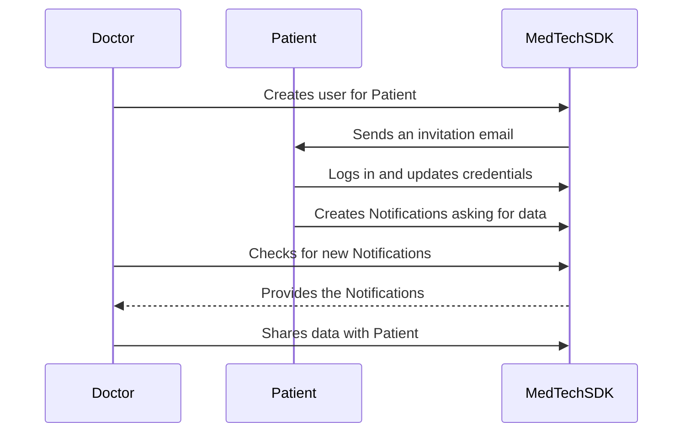

# How to Create a User for an Existing Patient

## Use Case Description
There may be some cases where a Doctor (Healthcare Professional) wants to invite one of his patients to the platform. 
If the Patient already exists in the platform, the MedTech SDK provides a method to automatically invite the User, 
link it to the existing Patient and then ask all the Healthcare Professionals that manage their data to share those with 
them.  
The following diagrams summarizes the operations performed by the different actors.  

## Use Case Implementation

:::note

For this example, we assume that your database contains at least one Healthcare Professional, one Patient and one Data 
Sample associated to them.

:::

### The Doctor Invites the Patient