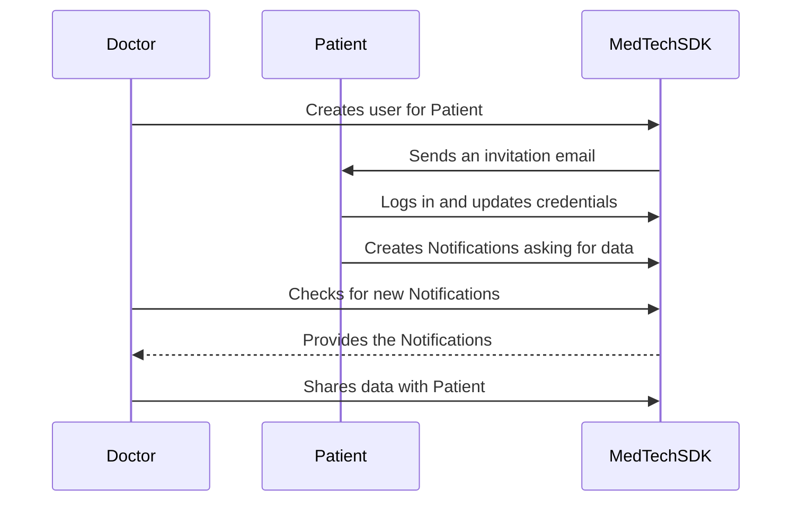

# Inviting an existing patient to become a user

## Use Case Description
There may be some cases where a Doctor (Healthcare Professional) wants to invite one of his patients to the platform. 
If the Patient already exists in the platform, the MedTech SDK provides a method to automatically invite the User, 
link it to the existing Patient and then ask all the Healthcare Professionals that manage their data to share those with 
them.  
The following diagrams summarizes the operations performed by the different actors.  



## Use Case Implementation

:::note

For this example, we assume that your database contains at least one Healthcare Professional, one Patient and one Data 
Sample associated to them.

:::

### The Doctor Invites the Patient

The first step in inviting a User is to create an instance of a class that implements either the 
[`EmailMessageFactory`](../references/interfaces/EmailMessageFactory) or the 
[`SMSMessageFactory`](../references/interfaces/SMSMessageFactory), depending on if you want to invite User by Email or 
SMS.  
Two examples are the [`ICureRegistrationEmail`](../references/classes/ICureRegistrationEmail) and 
[`ICureRegistrationSMS`](../references/classes/ICureRegistrationSMS) classes.

<!-- file://code-samples/how-to/create-user-for-patient/index.mts snippet:instantiate a message factory-->
```typescript
const messageFactory = new ICureRegistrationEmail(
  hcp,
  'URL_WHERE_TO_LOGIN',
  'SOLUTION_NAME',
  patient,
)
```

Then, it is possible to invite the User using the newly created factory object and the existing Patient.

<!-- file://code-samples/how-to/create-user-for-patient/index.mts snippet:doctor invites user-->
```typescript
await api.userApi.createAndInviteUser(patient, messageFactory, 3600)
```

### The User Logs in and Asks for Access

After that, the User will receive an email or a SMS message that contains their login and a short-lived authentication 
token that they can use to log in.

<!-- file://code-samples/how-to/create-user-for-patient/index.mts snippet:user logs in-->
```typescript
const anonymousMedTechApi = await new AnonymousMedTechApiBuilder()
  .withICureBaseUrl(host)
  .withMsgGwUrl(msgGtwUrl)
  .withMsgGwSpecId(specId)
  .withCrypto(webcrypto as any)
  .withAuthProcessByEmailId(authProcessId)
  .withAuthProcessBySmsId(authProcessId)
  .build()

const { publicKey, privateKey } = await anonymousMedTechApi.cryptoApi.RSA.generateKeyPair()
const publicKeyHex = ua2hex(await anonymousMedTechApi.cryptoApi.RSA.exportKey(publicKey, 'spki'))
const privateKeyHex = ua2hex(await anonymousMedTechApi.cryptoApi.RSA.exportKey(privateKey, 'pkcs8'))

await anonymousMedTechApi.authenticationApi.authenticateAndAskAccessToItsExistingData(
  patientUsername,
  patientToken,
  async () => ({ privateKey: privateKeyHex, publicKey: publicKeyHex }),
)
```

The `authenticateAndAskAccessToItsExistingData` method will set up the User private and public key, it will create a 
long-lived authentication token, and will send a Notification to all the Healthcare Professionals that have a delegation 
for the Patient to ask access to their data.

:::tip

Until the doctor gives the patient access to his own data, the patient won't be able to access any encrypted medical or administrative information. However the patient will still be able to access unencrypted administrative information in his own `Patient` entity using some special methods described [here](./how-to-manage-patients#how-to-get-and-modify-your-information-as-a-patient).

:::

### The Doctor Receives the Notification and Gives Back Access

Once the Notification is sent, on the Doctor side you can use the MedTech SDK to filter his Notifications and get the one related to 
the new User.

<!-- file://code-samples/how-to/create-user-for-patient/index.mts snippet:doctor gets pending notifications-->
```typescript
const newNotifications = await api.notificationApi.getPendingNotificationsAfter()
const patientNotification = newNotifications.filter(
  (notification) =>
    notification.type === NotificationTypeEnum.NEW_USER_OWN_DATA_ACCESS &&
    notification.responsible === patient.id,
)[0]
```

Then, you can change the status of the Notification to signal that the operation is being taken care of.

<!-- file://code-samples/how-to/create-user-for-patient/index.mts snippet:notification set ongoing-->
```typescript
const ongoingStatusUpdate = await api.notificationApi.updateNotificationStatus(
  patientNotification,
  'ongoing',
)
```

To allow the new User to access all their own data, you can use the `giveAccessToAllDataOf` method.

<!-- file://code-samples/how-to/create-user-for-patient/index.mts snippet:data sharing-->
```typescript
const sharedData = await api.patientApi.giveAccessToAllDataOf(patient.id)
```

If the method runs successfully, it will return a report of all the shared objects:
<details>
    <summary>Output</summary>

```json
{
 "patient": "YOUR_PATIENT_OBJECT",
 "statuses": {
  "dataSamples": { "success": true, "error": null, "modified": 1 },
  "healthcareElements": { "success": true, "error": null, "modified": 0 },
  "patient": { "success": true, "error": null, "modified": 0 }
 }
}
```

</details>

Finally, you can update the Notification status again to signal that the operation was completed successfully. 
Updating the status of the Notification is important, as otherwise you will risk of getting old Notifications when filtering
 for the new pending ones.

<!-- file://code-samples/how-to/create-user-for-patient/index.mts snippet:completed status-->
```typescript
const completedStatusUpdate = await api.notificationApi.updateNotificationStatus(
  ongoingStatusUpdate,
  'completed',
)
```
