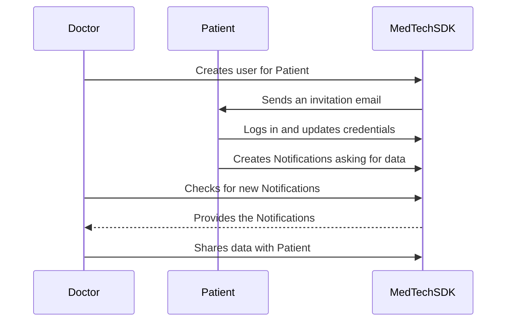

# Inviting an existing patient to become a user

## Use Case Description
There may be some cases where a Healthcare Professional wants to invite one of his patients to the platform. 
If the Patient already exists in the platform, the MedTech SDK provides a method to automatically invite the User, 
link it to the existing Patient and then ask all the Healthcare Professionals that manage their data to share those with 
them.  
The following diagrams summarizes the operations performed by the different actors.  



## Use Case Implementation

:::note

For this example, we assume that your database contains at least one Healthcare Professional, one Patient and one Data 
Sample associated to them.

:::

### The Doctor Invites the Patient

The first step in inviting a User is to create an instance of a class that implements either the 
[`EmailMessageFactory`](../references/interfaces/EmailMessageFactory) or the 
[`SMSMessageFactory`](../references/interfaces/SMSMessageFactory), depending on if you want to invite User by Email or 
SMS.  
Two examples are the [`ICureRegistrationEmail`](../references/classes/ICureRegistrationEmail) and 
[`ICureRegistrationSMS`](../references/classes/ICureRegistrationSMS) classes.

<!-- file://code-samples/how-to/create-user-for-patient/index.mts snippet:instantiate a message factory-->
```typescript
const messageFactory = new ICureRegistrationEmail(
  hcp,
  'URL_WHERE_TO_LOGIN',
  'SOLUTION_NAME',
  patient,
)
```

Then, it is possible to invite the User using the newly created factory object and the existing Patient.

<!-- file://code-samples/how-to/create-user-for-patient/index.mts snippet:doctor invites user-->
```typescript
await apiAsDoctor.userApi.createAndInviteUser(patient, messageFactory, 3600)
```

### The User Logs in and Asks for Access

After that, the User will receive an email or a SMS message that contains their login and a short-lived authentication 
token that they can use to log in.

<!-- file://code-samples/how-to/create-user-for-patient/index.mts snippet:user logs in-->
```typescript
const anonymousMedTechApi = await new AnonymousMedTechApiBuilder()
  .withICureBaseUrl(host)
  .withMsgGwUrl(msgGtwUrl)
  .withMsgGwSpecId(specId)
  .withCrypto(webcrypto as any)
  .withAuthProcessByEmailId(authProcessId)
  .withAuthProcessBySmsId(authProcessId)
  .withCryptoStrategies(new SimpleMedTechCryptoStrategies([]))
  .build()

const authenticationResult =
  await anonymousMedTechApi.authenticationApi.authenticateAndAskAccessToItsExistingData(
    patientUsername,
    patientToken,
  )
const apiAsPatient = authenticationResult.medTechApi
```

The `authenticateAndAskAccessToItsExistingData` method will set up the User private and public key, it will create a 
long-lived authentication token, and will send a Notification to all the Healthcare Professionals that have a delegation 
for the Patient to ask access to their data.

### The Patient has Limited Permissions Until he is Given Access to Existing Data

The patient can now start using iCure, but there are still some limitations to what he can do until the doctor gives him access to the existing data.

The patient can't:

- access any existing {{ services }} and health elements
- access encrypted data in his `Patient` entity

but the patient can:

- create new {{ services }} and health elements
- share newly created medical data with his doctor
- access and modify non-encrypted data in his `Patient` entity

Initially, the patient won't be able to decrypt his own `Patient` entity, and for this reason the method 
`PatientApi.getPatient` will fail. Instead, the patient needs to use the method `PatientApi.getPatientAndTryDecrypt` 
which returns a `PotentiallyEncryptedPatient` which is an interface implemented by both `Patient` and 
`EncryptedPatient`. This method will try to decrypt the retrieved `Patient`, and if not successful instead of failing 
the method will just return the patient without decrypting it as an `EncryptedPatient`.

<!-- file://code-samples/how-to/create-user-for-patient/index.mts snippet:get patient details-->
```typescript
const patientUser = await apiAsPatient.userApi.getLoggedUser()
// apiAsPatient.patientApi.getPatient would fail
const patientDetails = await apiAsPatient.patientApi.getPatientAndTryDecrypt(patientUser.patientId!)
```
<!-- output://code-samples/how-to/create-user-for-patient/patientDetails.txt -->
<details>
<summary>patientDetails</summary>

```json
{
  "id": "bc10ddf4-abf7-4b6c-b4d5-ba93cab9d0d1",
  "languages": [],
  "active": true,
  "parameters": {},
  "rev": "4-207a4bbb91b34b6ee99bdfe12a479e55",
  "created": 1688378948614,
  "modified": 1688378948614,
  "author": "6a541dfb-40d9-41f5-ba76-e3a5e277813f",
  "responsible": "e2b6e873-035b-4964-885b-5a90e99c43b4",
  "firstName": "Marc",
  "lastName": "Specter",
  "identifiers": [],
  "labels": {},
  "codes": {},
  "names": [
    {
      "firstNames": [
        "Marc"
      ],
      "prefix": [],
      "suffix": [],
      "lastName": "Specter",
      "text": "Specter Marc",
      "use": "official"
    }
  ],
  "addresses": [
    {
      "description": "London",
      "addressType": "home",
      "telecoms": [
        {
          "telecomNumber": "bdc0ec22@icure.com",
          "telecomType": "email"
        }
      ]
    }
  ],
  "gender": "unknown",
  "birthSex": "unknown",
  "mergedIds": {},
  "deactivationReason": "none",
  "personalStatus": "unknown",
  "partnerships": [],
  "patientHealthCareParties": [],
  "patientProfessions": [],
  "properties": {},
  "systemMetaData": {
    "publicKey": "30820122300d06092a864886f70d01010105000382010f003082010a0282010100cae9c0cc9d6ec2be225e60f0c8099570ce005562732a969698ab8c99af6978b2811cfa32c9ec9ded93b9318d50dbe57652598acff84c141644838742c3f46c094be733fbd09e0a72195657e79162c6c925c6c668fb4c77c1c091f20eda607285f300eedfcb87f0e40c362342a0363573583acbc56995ca989e9806b830ea64a2300c38c23b53a8d764d8886229034880867901d9d5c27c8d5b2f2d28c43a95c6991f44f969b49460ae5f678c368594f68451f5b21780d64a3bfb5edef9bdde6acb70ec8fa03732390185bb5adc45014842064083baf15a30cea1aa18880b11f288f4a4244d94250becd8be9ee04ed6f98d5c061d890c3b3b2af6d0e7f1b8bd550203010001",
    "aesExchangeKeys": {
      "30820122300d06092a864886f70d01010105000382010f003082010a0282010100cae9c0cc9d6ec2be225e60f0c8099570ce005562732a969698ab8c99af6978b2811cfa32c9ec9ded93b9318d50dbe57652598acff84c141644838742c3f46c094be733fbd09e0a72195657e79162c6c925c6c668fb4c77c1c091f20eda607285f300eedfcb87f0e40c362342a0363573583acbc56995ca989e9806b830ea64a2300c38c23b53a8d764d8886229034880867901d9d5c27c8d5b2f2d28c43a95c6991f44f969b49460ae5f678c368594f68451f5b21780d64a3bfb5edef9bdde6acb70ec8fa03732390185bb5adc45014842064083baf15a30cea1aa18880b11f288f4a4244d94250becd8be9ee04ed6f98d5c061d890c3b3b2af6d0e7f1b8bd550203010001": {
        "bc10ddf4-abf7-4b6c-b4d5-ba93cab9d0d1": {
          "0c3b3b2af6d0e7f1b8bd550203010001": "5d0e77b708f8c6e9c2a9bd1ce5adc23c56f297914b3bf846353c35c6c795c7b5c0449f260e8af78c5e26c2cffccfe3991a931be6cbb6dbdafe2b78222bdb17845366dcde9efdb71d86649c1e15626b9e9d9cbd1a3f8f1989d70be06e5bbafcaa6f97f78adf2b6cefa42e0a93c1724b6a5287d5844e1f15d1b893d7bae05cf64d29eaa40680e6621809fd4abfc3ac2e99c992ccb006610c5977d9672865d9455b6538d45465d751fa8c69ad33b3d67d1a2282c122abacdb3b8eb0c27c2dfb88ca055cdb4ed8da5887ca4fbe37054909967f338671892340a14f7d738bb444a0fc957eda1960232322a122bd906819ac0e8aa9c83accd2c8c855edcfee82aaf191"
        },
        "e2b6e873-035b-4964-885b-5a90e99c43b4": {
          "65e6c4c5d30f92a53358df0203010001": "91081a93878426952c8cb25cd85d40f5dc14c7e28d6d66c1d7033ba1cf7cdd9cd17b165d509699cf43c120b4f260a4d1b6eafcdb78d8ae29fb4abaad90d0ab92bfc2baa57c93aed0e24942fc4bba65dbc87d5432d079cb820933897c536c6c4543b4e68f13a5b0884c3f23005bf4f4d2bddb920547808f769dcd051a270289556c4632c46678d895250e905d17a6fb30012d562708ffa2d7aebdf24c2a9e479fd77f166266c6d1aa2fb55b94e3754c1ade8d3d495fccdc728d5825ac4f0216290c9b6d791c6b853853227d12f5b27a7976c02b0802e541bc5b005b48af492b89a2e3638f6eb51359c6f0479762efc15067ff1b1fd88016b83bf246ccb9b63639",
          "ee2117486dc3c26f087e2f0203010001": "10209af08f7adfc74c4eb52786b6a1db4810f131d970fa078e2504de7c8432933730311d571eb911129556d308a176f93cec36d8a819cee3439bca4fd37410f1432dfea848028e096b4c502cbf3d58b1c741334d47225bc1c76d1e2432c455f3010ecab8b3a2d92d5fb72075e823393c14be23bd271ea91ffaa600252342f005ef104f39e62190e7996dfb61b02394f52f69dbb64f78ec154a1146d159270bb1a9d94e5f3fc7ab865411b4e59cec22d86383dc613e9bf3845309b61bb9ef314c5ce644949b817fb00dec104fcdd31ab5c56c2ba2d898ea7221b9512a397456e47be52bc89d9d5e5999729c1d0eb22b1c6c6b951c201f1feb01d1295904ed2577",
          "e46c7f9ffe0a5ea5e3b55d0203010001": "58082404a749e580a8ad0dd9c70d913ce5b2876a47fa9b626fa89716fa05f663e268f5a8d5d332f8e359a3768eca046c22c6782e029f5127d2a11ff76c4c8444ae1556c06b7073d4bba87103c1f61c5d5c6fb646464b6c453ad70585a9376a9d8ab8a46b33fc88722357e04d8ca9d8eb19fc71f6f9b020e306eeb7dda06b266e2c8ec2e3b7630bf885775ebf9596d9d13d3ab9e0f909f8edcb3a3c10d8153fd9432bf7894ad7f264c18079b6fc07692fdceb8a96134871825865ebcf5faed5f7c5d6bf073dd90e95f6633f1ebae2e2253b6d5e31efde19a69c9ad19272fd74230cf9cd558cc516d6f965a3eca3d4deadd8a78b79f577094536c95186ce453abf",
          "a5973299736101071d08ef0203010001": "0ae8ebd67ed3dce718dd0683a9d3d9a525c5736c70a7f4a66d6b3ac19127f839ff92408899ecd47b53d3ce1ec773845ce55766c9602fde0002bed818fcc8b54be0953c22ed9eb1dc3f6019ed92c92156ae77b4b9aaca4dabacfa498f26889bb7fcf0f1362d91d8d99132fd835f2032029827fb910a903280d08b4b30d4895db595fc5394e80c86ab9b22017cc9403496a4660abf9f4ab6b5d9447eab074285635c924a4034957e56a5d722d4cc1be619443a51f2f4035cefbcabe5ef14106d904beabd176e35cc83c043405bdf6020094cc1747e2bead655c550ae03f8bb03e4caf14e7cfb80a00856ee7398f35e703d670629f59abed5ee5a6f8f5e49743143",
          "3b8a861d773716ef8fc5690203010001": "170e6d3e65ff5174e577635c9cf16bed5cc8383d03ef25e66ff796a70d1e79f3efb67adff85948d0be9fd21ffe8f24d4851b8f541495ccdfbb06017085387c30f97b6fefa450308067aa1155bea6222316f9fbf1254363abb9263179daa90162b5a905c686233c33af6e73f4d04e08bb9133fd29f586513f18c6107ce2291b95a7065cbe1e19fcd3f664faab3294db0fd5d2142b7f440d3ab6ff596260201eb153a356376891d8fd8c8c57029be4b56f44561eef224c47ee84e6f2b5d741171ce835e34e185ffc6f067da49399b37c6093a1e76e40db7becc9aee18e95efed32f4a7a9e35215ebbcf1a515a48cc0c03ec1e8cff554e570c26a9d6888620c4195",
          "131756252f302a6284cc1d0203010001": "808f06bca2e072b83e715dcfb64c63756126d25aeb210a5f6a3b26ed503228dd95e5d1a9e4c1b9d204e644b93d69aaea19d388337d188bfd38925ac66f97f1312c59c716ab9993fc5e24e41df675350a4d9473ea5c7d8dd4f9a27ad47ed370eae8b22c8b0eff0dd67b2bbc15c979072ca039ad78f9a5ea3adca6fd14d719446318cd4de7c30ee8f5b2e6ab9e25bac060f5f65ae999f0fbe022dcd2569604fb6a24474e8bf59c86289e393c8bc19a53060dc62fa2e1029f767b0b09d710311253496fce6d7542e32dd8e8dcab21f28ba8d083654efb3216de450d63cc1a4db5339e7792498f7e3635afd7d37f068be3ba7d45672bc604abd26c8bc9220e511fe3",
          "1f05d478113889fb9d63870203010001": "206ed4e39f62799b9f55fa4601385fdd2572a00dfa13a73d0df1408e4da473c2f2b4b220fb22aebb6ede32aaceca544d79305db77deac1136310c774292db3489cbac4c3c2bae23e62fe7bf71ed1477977c24b594a16a55c49e2b110065970e7869176f4ebf7c851c45e6d5b30046a9415cbde10f0e506ea1c4be6adc77495e69c4c1e12517a7101b4642d4b52b779de9625dbc24dad173af416cb5a807108bafd8a5645fbeb1912c145c3a49b507aeb5c2e161552852780a32d0feecddc2e0cee7177a3a5e6666a3f84005fa4d9584e23ae646055beff22e7f33047d76213432b73d080f7d5107de92b869b4ca97d8a5125a1211223e226713a98c051f123b6",
          "72e3f755367001fa1eed010203010001": "38d50fb24fa107985208cb99dc3c9d508d567bad14ecab66c23d06753d005ec2ae3f7c4fe62530d3b516d125b6ad62d06e5af1f2e4d83799e238d5c761721434a03ae4534d5c4740132b46ac20d80532a71fc75fda38a5591afc2d3278f815ab145ebb0f0c8cad14bca4e8c9449bf01c4213619b5026d3d3cf3d164a09a74c811da079d658e5dfd702f27ebff55532fa6b057aaa699a59a435e71428b37d8722f791b43fbb0d7f9ed7863c12707179ec15411538c1c4511009baad58009a2e1a1272091a44d41baf89d7a44ade50691aa31a356853453ba11e381c99b0a51dfe2fa567f1aa05d4d52e0f4d5dfd77b2cfbbca6321de4a8338f8e095d273c9badd",
          "4ab7d47fadcff2d1845f710203010001": "1c59c757f68f09c39fcf188891b44d12d1d1e2d5d7c9a7fff37c699494b923033d38f53ba6877b34c96c712535bfd6d0d0f6524b5fd6c1c7602e14635efee2bbf90418c2efe71f89b65de125f74063793151275101d18cf24774189f2ed51505df6c45d185e80ea0861993608e4cf2506bc0516bcb9f0cce52803a5a31e7e6986eb92418a8cfe1f38f8dfc6f3fe00781a99b8fb9b553b1b5340521fcce2a706b448e446e735aac00131dc4b94836ab05c8bfdff4f4b7359c257b43a0991b9aa593f65309b30de7f964bc30f97c3bb194405516917236d37ba58620a858e4675153aebc8e77cec18920a017f4d86f2e6bc767b807ab5e5ff676ec7e84ee02b622",
          "6d061df03e810f6bc434550203010001": "8ebc42b0e9f03ed12af8a87dda53d6ba71554c4a217d34e34a7993e50345fa9bb53adbd3d2e4826f8f31b79d2e6b4570d86fb16f53577a116071cbc893ea498ed2afd14c06bb12f99723396f2afb7024fd2798b06971fba2f609eaef2b14317db309228eb11807108cd255880831155970bb064b4113db19ce476234eb55f5689def9f1e82f46b48b7ec06fd5d5bf9387dd7b78151d1607191a9aa6f0ffd0be5fe85454f927697432ba5cd67eeddd97d07fc3e14a2533c2fbe9b5d93dfe33846c39db398b7933025ad80e636f29f38b9663235197e94b715f67dcbf36f88114733b8aaafa062a00044f6f78472a5e07056e769d52e282062caba9ed01b354be0",
          "468e96007c131acb0ce5110203010001": "8c562cd00cab5d623e8a8986e990abc4ec50b640d796f1f376d5874e898f33178e1b0caf1ab1d195d077c40806bae13adb690a57b445a4ae14f95f5784b4a49f445f58e4218a70329f2d5e3c5d68c69c1858015f1d87904a1b5460138b19bc5a28b5af9d2aa23786aef4fc71f7e9f743a216a0c763fb787c1a608c413d782251e9e5c3b223effc00df4aed4cdb562cd257158fe28521aec6a19701408364305c835e0925d7668e4ffc8dd8062b1a1b0ff615b626cba30644ad0fe932a975c0a9158165342418ee16f5dd9ea7ece10fe15e05e444294bc723acbaeb1953e2a18dd353474a7cbb3657c2a45a2cfe896d2f5e6bc5cf4ca5865694438eac80759fd9",
          "1b28c1318327fbef4b84b30203010001": "0e7c0afe4bac7b8827aae899ca6c86820f2cd23b2f04f2bd2a89c1db1b52fd6a7d99edf33b3ef59f710276fd8666431746fcfb9c8a5c4715404ed5fb7594e408711befda1c4ff3876d20310e7f106cef4d2e5b16fc3906330d3b55ae7f1ff4f6d65cc9f5fe2538670db61809786b8290331ec5e1eb144ef286b0455ed1c8613bf48b44104fdd3c431753ff2c5d765f2aa922e69867d21f77dcd26770064a637b8c64687ffec79220fc10b26ade4e53b11d14420593e6666c91f5e0f959069a06af211c789f25e424dfd6b35788aaa7e6a66eecaa41506b2688a497cd5e4d5b2b5bcd7d29320614735d5f8b4ea8126d53b322f4401b341b936bbfdb88cfe6bc6d",
          "5c4106377469b808f61ef50203010001": "0820491431d0c15ed49ab6efd8ded8173f4f73e56ba66f4456eb1b808503711c90c057d8637a5e5cc08c003ccc46b028c73070339fda3336f0d7d09dc47bd1cf1c43c20541399165c68605ddf782b193f9d56e33f46ad8019456267dc089177563bbc70599acb51c3cbc58582c7502fa6241fc86eed619a1172c27189746d3d562f8b4b4ad30c7c9ebcccb4c661f8b2e89deba30814fb005412adc20d9a30fb923e364be5a2fc1821cd33e39a22750bfc68a4b2bb4d6db074da48deb4acbcf36be68cbd45fdef0777edd437847a54a2b1a74f0b27dc987ee20164e075805eb561f01b0478104da8cb650d17482693655e414bf7bac1ed47040aca3011858394e",
          "85072723e830c83845274f0203010001": "58de098b78fe92b257912450a225cfd93a9c2c1f5031bf63969775a74990405e5d8a3da7e0f48c4070a2eb5ca9ef49d2e57c9176dcf142c5aa24e302a4158deaa35366445ca988d5fe272d0921496d4ae5b9c35a526cac404c98654340931e3172bc132a56a48d5e5b29348d422eb96e4a1f6cefd87be34bc56cd96292d6255052718ca4fa6adf19859bb440f1028c24e3543c760c039ef0e0a69f64b8601420668547ebf5031c90a63f070545db625c50eff46e034ecc617a88d14cd5034b951d63232b56223df9a02b0d2724ea4c8547f1b67a50b1342e4c522c9bf19273455d126c0f30ba7c8993b354fd5cc0c683a4ca1a384ea0fd66c0363ae5886b9b3b",
          "0c8708d4eb793ba7325ee70203010001": "99b01d9d2f7aae514430593dfde3f799588a899faebb157608906be37da3eb0820f34bfb31ed7eac7ace63f5773c423031ac5180c9ebd3589adbd4fbf376c1076b415c2bc745acc270bffbc363c4cfc346bfc7ad31d224ea4e762cc3a34b0d21cafc0126938dddb04eda6738f92aa4409b72b1b8bce71989879483f8aca0a3ed43d5c15527039317216783304a17b68632fd985439d565fc80fc37c5bdcd91de8fb1d85fd5ee4d95c1e4171fd57638cc9dc1e5257205d4f2edf286b2d6d9313789bdf0d924ff2358bda2b03b23da1b10ea5fe1f06f62ece98ec857be36670695aaa70f29c64dbb549e17e00f0bf1a86db869766d215c9c7923b017665b6cb3a7",
          "2207a5c2c95203690fb2cd0203010001": "458b80dabdece818b6019686a77bdfc6f32ee2e7c025d2a5f91cbadc3d599c7141139bd365a32952a3742a080166dbfe7d329ba6d828b7c0eab02bda9ed6fe2206fa0c35bda616f18a95162487b66c11c37cae4bc6f0f33c95505cc1fe1d54c7426d31afde424c1b023318e0be0dc0883e0d624857a1a43b951f9c1636fb18252fe21bab424bafaf58ba51cfd1f9708e4384572a4d3fc25d7234b87e3c9761189545604324b60577815e1cfb9970af7611b79884033b03d7294c796c2ae956d1a5d1467169b244c98dd3533a173f6f14bb5825d0adbb3e5d36c72a4816897168fe143eb0c9d5bdbcc5e005a99f4c095d743f59da8e3bb68e094311c76e4871bb",
          "0c3b3b2af6d0e7f1b8bd550203010001": "4c388e03abac6edfb7978f398f096185cb35f1943552de0d0e56898cb41f56832c60700425e7b38af4b1551429c14dab40bfa2bf0981de21581d03f69159c1514fc9a5e826ce523d72f53823be31df4e39709b6ac1c379a69b17bc189038cb78ee4c6c19ecaaa6378082a8f6a9487a0c6dff9d3da8c04283fe75d2256dcd5e1b1edc5a069f789de67bba5869fcdf6d1b034adc7f62df5d083baf6fe6e9a75e1fdd07b69fc3d545c17cc794e8a386128ac3211962a10e3260beb143d297e6ceba9ba8798a5dbd9960996ba4f45af5169cc69afff2d9cf1b192ce53ee92c367ff2d948c42be336e242647a94b50bca72d54e09337f0669565bd0d1508f8e5a8dff"
        }
      }
    },
    "hcPartyKeys": {},
    "privateKeyShamirPartitions": {},
    "transferKeys": {},
    "encryptedSelf": "05xqanDHdKfRK3hFLTv4Y5UisXfznAtbbttDcvdwRP0=",
    "secretForeignKeys": [],
    "cryptedForeignKeys": {},
    "delegations": {
      "e2b6e873-035b-4964-885b-5a90e99c43b4": {},
      "bc10ddf4-abf7-4b6c-b4d5-ba93cab9d0d1": {}
    },
    "encryptionKeys": {
      "e2b6e873-035b-4964-885b-5a90e99c43b4": {}
    },
    "publicKeysForOaepWithSha256": {}
  }
}
```
</details>

It is also possible to for the patient to modify his non-encrypted data using the 
`PatientApi.modifyPotentiallyEncryptedPatient` method. Note however that any attempt to change data which should be 
encrypted according to the api configuration will cause a runtime error.

<!-- file://code-samples/how-to/create-user-for-patient/index.mts snippet:modify patient details-->
```typescript
patientDetails.companyName = 'iCure'
// patientDetails.note = 'This would make modify fail'
const modifiedPatientDetails = await apiAsPatient.patientApi.modifyPotentiallyEncryptedPatient(
  patientDetails,
)
```
<!-- output://code-samples/how-to/create-user-for-patient/modifiedPatientDetails.txt -->
<details>
<summary>modifiedPatientDetails</summary>

```json
{
  "id": "bc10ddf4-abf7-4b6c-b4d5-ba93cab9d0d1",
  "languages": [],
  "active": true,
  "parameters": {},
  "rev": "5-bdb0ca9ec1daf79c0fe6b5c0846ef10f",
  "created": 1688378948614,
  "modified": 1688378948614,
  "author": "6a541dfb-40d9-41f5-ba76-e3a5e277813f",
  "responsible": "e2b6e873-035b-4964-885b-5a90e99c43b4",
  "firstName": "Marc",
  "lastName": "Specter",
  "companyName": "iCure",
  "identifiers": [],
  "labels": {},
  "codes": {},
  "names": [
    {
      "firstNames": [
        "Marc"
      ],
      "prefix": [],
      "suffix": [],
      "lastName": "Specter",
      "text": "Specter Marc",
      "use": "official"
    }
  ],
  "addresses": [
    {
      "description": "London",
      "addressType": "home",
      "telecoms": [
        {
          "telecomNumber": "bdc0ec22@icure.com",
          "telecomType": "email"
        }
      ]
    }
  ],
  "gender": "unknown",
  "birthSex": "unknown",
  "mergedIds": {},
  "deactivationReason": "none",
  "personalStatus": "unknown",
  "partnerships": [],
  "patientHealthCareParties": [],
  "patientProfessions": [],
  "properties": {},
  "systemMetaData": {
    "publicKey": "30820122300d06092a864886f70d01010105000382010f003082010a0282010100cae9c0cc9d6ec2be225e60f0c8099570ce005562732a969698ab8c99af6978b2811cfa32c9ec9ded93b9318d50dbe57652598acff84c141644838742c3f46c094be733fbd09e0a72195657e79162c6c925c6c668fb4c77c1c091f20eda607285f300eedfcb87f0e40c362342a0363573583acbc56995ca989e9806b830ea64a2300c38c23b53a8d764d8886229034880867901d9d5c27c8d5b2f2d28c43a95c6991f44f969b49460ae5f678c368594f68451f5b21780d64a3bfb5edef9bdde6acb70ec8fa03732390185bb5adc45014842064083baf15a30cea1aa18880b11f288f4a4244d94250becd8be9ee04ed6f98d5c061d890c3b3b2af6d0e7f1b8bd550203010001",
    "aesExchangeKeys": {
      "30820122300d06092a864886f70d01010105000382010f003082010a0282010100cae9c0cc9d6ec2be225e60f0c8099570ce005562732a969698ab8c99af6978b2811cfa32c9ec9ded93b9318d50dbe57652598acff84c141644838742c3f46c094be733fbd09e0a72195657e79162c6c925c6c668fb4c77c1c091f20eda607285f300eedfcb87f0e40c362342a0363573583acbc56995ca989e9806b830ea64a2300c38c23b53a8d764d8886229034880867901d9d5c27c8d5b2f2d28c43a95c6991f44f969b49460ae5f678c368594f68451f5b21780d64a3bfb5edef9bdde6acb70ec8fa03732390185bb5adc45014842064083baf15a30cea1aa18880b11f288f4a4244d94250becd8be9ee04ed6f98d5c061d890c3b3b2af6d0e7f1b8bd550203010001": {
        "bc10ddf4-abf7-4b6c-b4d5-ba93cab9d0d1": {
          "0c3b3b2af6d0e7f1b8bd550203010001": "5d0e77b708f8c6e9c2a9bd1ce5adc23c56f297914b3bf846353c35c6c795c7b5c0449f260e8af78c5e26c2cffccfe3991a931be6cbb6dbdafe2b78222bdb17845366dcde9efdb71d86649c1e15626b9e9d9cbd1a3f8f1989d70be06e5bbafcaa6f97f78adf2b6cefa42e0a93c1724b6a5287d5844e1f15d1b893d7bae05cf64d29eaa40680e6621809fd4abfc3ac2e99c992ccb006610c5977d9672865d9455b6538d45465d751fa8c69ad33b3d67d1a2282c122abacdb3b8eb0c27c2dfb88ca055cdb4ed8da5887ca4fbe37054909967f338671892340a14f7d738bb444a0fc957eda1960232322a122bd906819ac0e8aa9c83accd2c8c855edcfee82aaf191"
        },
        "e2b6e873-035b-4964-885b-5a90e99c43b4": {
          "65e6c4c5d30f92a53358df0203010001": "91081a93878426952c8cb25cd85d40f5dc14c7e28d6d66c1d7033ba1cf7cdd9cd17b165d509699cf43c120b4f260a4d1b6eafcdb78d8ae29fb4abaad90d0ab92bfc2baa57c93aed0e24942fc4bba65dbc87d5432d079cb820933897c536c6c4543b4e68f13a5b0884c3f23005bf4f4d2bddb920547808f769dcd051a270289556c4632c46678d895250e905d17a6fb30012d562708ffa2d7aebdf24c2a9e479fd77f166266c6d1aa2fb55b94e3754c1ade8d3d495fccdc728d5825ac4f0216290c9b6d791c6b853853227d12f5b27a7976c02b0802e541bc5b005b48af492b89a2e3638f6eb51359c6f0479762efc15067ff1b1fd88016b83bf246ccb9b63639",
          "ee2117486dc3c26f087e2f0203010001": "10209af08f7adfc74c4eb52786b6a1db4810f131d970fa078e2504de7c8432933730311d571eb911129556d308a176f93cec36d8a819cee3439bca4fd37410f1432dfea848028e096b4c502cbf3d58b1c741334d47225bc1c76d1e2432c455f3010ecab8b3a2d92d5fb72075e823393c14be23bd271ea91ffaa600252342f005ef104f39e62190e7996dfb61b02394f52f69dbb64f78ec154a1146d159270bb1a9d94e5f3fc7ab865411b4e59cec22d86383dc613e9bf3845309b61bb9ef314c5ce644949b817fb00dec104fcdd31ab5c56c2ba2d898ea7221b9512a397456e47be52bc89d9d5e5999729c1d0eb22b1c6c6b951c201f1feb01d1295904ed2577",
          "e46c7f9ffe0a5ea5e3b55d0203010001": "58082404a749e580a8ad0dd9c70d913ce5b2876a47fa9b626fa89716fa05f663e268f5a8d5d332f8e359a3768eca046c22c6782e029f5127d2a11ff76c4c8444ae1556c06b7073d4bba87103c1f61c5d5c6fb646464b6c453ad70585a9376a9d8ab8a46b33fc88722357e04d8ca9d8eb19fc71f6f9b020e306eeb7dda06b266e2c8ec2e3b7630bf885775ebf9596d9d13d3ab9e0f909f8edcb3a3c10d8153fd9432bf7894ad7f264c18079b6fc07692fdceb8a96134871825865ebcf5faed5f7c5d6bf073dd90e95f6633f1ebae2e2253b6d5e31efde19a69c9ad19272fd74230cf9cd558cc516d6f965a3eca3d4deadd8a78b79f577094536c95186ce453abf",
          "a5973299736101071d08ef0203010001": "0ae8ebd67ed3dce718dd0683a9d3d9a525c5736c70a7f4a66d6b3ac19127f839ff92408899ecd47b53d3ce1ec773845ce55766c9602fde0002bed818fcc8b54be0953c22ed9eb1dc3f6019ed92c92156ae77b4b9aaca4dabacfa498f26889bb7fcf0f1362d91d8d99132fd835f2032029827fb910a903280d08b4b30d4895db595fc5394e80c86ab9b22017cc9403496a4660abf9f4ab6b5d9447eab074285635c924a4034957e56a5d722d4cc1be619443a51f2f4035cefbcabe5ef14106d904beabd176e35cc83c043405bdf6020094cc1747e2bead655c550ae03f8bb03e4caf14e7cfb80a00856ee7398f35e703d670629f59abed5ee5a6f8f5e49743143",
          "3b8a861d773716ef8fc5690203010001": "170e6d3e65ff5174e577635c9cf16bed5cc8383d03ef25e66ff796a70d1e79f3efb67adff85948d0be9fd21ffe8f24d4851b8f541495ccdfbb06017085387c30f97b6fefa450308067aa1155bea6222316f9fbf1254363abb9263179daa90162b5a905c686233c33af6e73f4d04e08bb9133fd29f586513f18c6107ce2291b95a7065cbe1e19fcd3f664faab3294db0fd5d2142b7f440d3ab6ff596260201eb153a356376891d8fd8c8c57029be4b56f44561eef224c47ee84e6f2b5d741171ce835e34e185ffc6f067da49399b37c6093a1e76e40db7becc9aee18e95efed32f4a7a9e35215ebbcf1a515a48cc0c03ec1e8cff554e570c26a9d6888620c4195",
          "131756252f302a6284cc1d0203010001": "808f06bca2e072b83e715dcfb64c63756126d25aeb210a5f6a3b26ed503228dd95e5d1a9e4c1b9d204e644b93d69aaea19d388337d188bfd38925ac66f97f1312c59c716ab9993fc5e24e41df675350a4d9473ea5c7d8dd4f9a27ad47ed370eae8b22c8b0eff0dd67b2bbc15c979072ca039ad78f9a5ea3adca6fd14d719446318cd4de7c30ee8f5b2e6ab9e25bac060f5f65ae999f0fbe022dcd2569604fb6a24474e8bf59c86289e393c8bc19a53060dc62fa2e1029f767b0b09d710311253496fce6d7542e32dd8e8dcab21f28ba8d083654efb3216de450d63cc1a4db5339e7792498f7e3635afd7d37f068be3ba7d45672bc604abd26c8bc9220e511fe3",
          "1f05d478113889fb9d63870203010001": "206ed4e39f62799b9f55fa4601385fdd2572a00dfa13a73d0df1408e4da473c2f2b4b220fb22aebb6ede32aaceca544d79305db77deac1136310c774292db3489cbac4c3c2bae23e62fe7bf71ed1477977c24b594a16a55c49e2b110065970e7869176f4ebf7c851c45e6d5b30046a9415cbde10f0e506ea1c4be6adc77495e69c4c1e12517a7101b4642d4b52b779de9625dbc24dad173af416cb5a807108bafd8a5645fbeb1912c145c3a49b507aeb5c2e161552852780a32d0feecddc2e0cee7177a3a5e6666a3f84005fa4d9584e23ae646055beff22e7f33047d76213432b73d080f7d5107de92b869b4ca97d8a5125a1211223e226713a98c051f123b6",
          "72e3f755367001fa1eed010203010001": "38d50fb24fa107985208cb99dc3c9d508d567bad14ecab66c23d06753d005ec2ae3f7c4fe62530d3b516d125b6ad62d06e5af1f2e4d83799e238d5c761721434a03ae4534d5c4740132b46ac20d80532a71fc75fda38a5591afc2d3278f815ab145ebb0f0c8cad14bca4e8c9449bf01c4213619b5026d3d3cf3d164a09a74c811da079d658e5dfd702f27ebff55532fa6b057aaa699a59a435e71428b37d8722f791b43fbb0d7f9ed7863c12707179ec15411538c1c4511009baad58009a2e1a1272091a44d41baf89d7a44ade50691aa31a356853453ba11e381c99b0a51dfe2fa567f1aa05d4d52e0f4d5dfd77b2cfbbca6321de4a8338f8e095d273c9badd",
          "4ab7d47fadcff2d1845f710203010001": "1c59c757f68f09c39fcf188891b44d12d1d1e2d5d7c9a7fff37c699494b923033d38f53ba6877b34c96c712535bfd6d0d0f6524b5fd6c1c7602e14635efee2bbf90418c2efe71f89b65de125f74063793151275101d18cf24774189f2ed51505df6c45d185e80ea0861993608e4cf2506bc0516bcb9f0cce52803a5a31e7e6986eb92418a8cfe1f38f8dfc6f3fe00781a99b8fb9b553b1b5340521fcce2a706b448e446e735aac00131dc4b94836ab05c8bfdff4f4b7359c257b43a0991b9aa593f65309b30de7f964bc30f97c3bb194405516917236d37ba58620a858e4675153aebc8e77cec18920a017f4d86f2e6bc767b807ab5e5ff676ec7e84ee02b622",
          "6d061df03e810f6bc434550203010001": "8ebc42b0e9f03ed12af8a87dda53d6ba71554c4a217d34e34a7993e50345fa9bb53adbd3d2e4826f8f31b79d2e6b4570d86fb16f53577a116071cbc893ea498ed2afd14c06bb12f99723396f2afb7024fd2798b06971fba2f609eaef2b14317db309228eb11807108cd255880831155970bb064b4113db19ce476234eb55f5689def9f1e82f46b48b7ec06fd5d5bf9387dd7b78151d1607191a9aa6f0ffd0be5fe85454f927697432ba5cd67eeddd97d07fc3e14a2533c2fbe9b5d93dfe33846c39db398b7933025ad80e636f29f38b9663235197e94b715f67dcbf36f88114733b8aaafa062a00044f6f78472a5e07056e769d52e282062caba9ed01b354be0",
          "468e96007c131acb0ce5110203010001": "8c562cd00cab5d623e8a8986e990abc4ec50b640d796f1f376d5874e898f33178e1b0caf1ab1d195d077c40806bae13adb690a57b445a4ae14f95f5784b4a49f445f58e4218a70329f2d5e3c5d68c69c1858015f1d87904a1b5460138b19bc5a28b5af9d2aa23786aef4fc71f7e9f743a216a0c763fb787c1a608c413d782251e9e5c3b223effc00df4aed4cdb562cd257158fe28521aec6a19701408364305c835e0925d7668e4ffc8dd8062b1a1b0ff615b626cba30644ad0fe932a975c0a9158165342418ee16f5dd9ea7ece10fe15e05e444294bc723acbaeb1953e2a18dd353474a7cbb3657c2a45a2cfe896d2f5e6bc5cf4ca5865694438eac80759fd9",
          "1b28c1318327fbef4b84b30203010001": "0e7c0afe4bac7b8827aae899ca6c86820f2cd23b2f04f2bd2a89c1db1b52fd6a7d99edf33b3ef59f710276fd8666431746fcfb9c8a5c4715404ed5fb7594e408711befda1c4ff3876d20310e7f106cef4d2e5b16fc3906330d3b55ae7f1ff4f6d65cc9f5fe2538670db61809786b8290331ec5e1eb144ef286b0455ed1c8613bf48b44104fdd3c431753ff2c5d765f2aa922e69867d21f77dcd26770064a637b8c64687ffec79220fc10b26ade4e53b11d14420593e6666c91f5e0f959069a06af211c789f25e424dfd6b35788aaa7e6a66eecaa41506b2688a497cd5e4d5b2b5bcd7d29320614735d5f8b4ea8126d53b322f4401b341b936bbfdb88cfe6bc6d",
          "5c4106377469b808f61ef50203010001": "0820491431d0c15ed49ab6efd8ded8173f4f73e56ba66f4456eb1b808503711c90c057d8637a5e5cc08c003ccc46b028c73070339fda3336f0d7d09dc47bd1cf1c43c20541399165c68605ddf782b193f9d56e33f46ad8019456267dc089177563bbc70599acb51c3cbc58582c7502fa6241fc86eed619a1172c27189746d3d562f8b4b4ad30c7c9ebcccb4c661f8b2e89deba30814fb005412adc20d9a30fb923e364be5a2fc1821cd33e39a22750bfc68a4b2bb4d6db074da48deb4acbcf36be68cbd45fdef0777edd437847a54a2b1a74f0b27dc987ee20164e075805eb561f01b0478104da8cb650d17482693655e414bf7bac1ed47040aca3011858394e",
          "85072723e830c83845274f0203010001": "58de098b78fe92b257912450a225cfd93a9c2c1f5031bf63969775a74990405e5d8a3da7e0f48c4070a2eb5ca9ef49d2e57c9176dcf142c5aa24e302a4158deaa35366445ca988d5fe272d0921496d4ae5b9c35a526cac404c98654340931e3172bc132a56a48d5e5b29348d422eb96e4a1f6cefd87be34bc56cd96292d6255052718ca4fa6adf19859bb440f1028c24e3543c760c039ef0e0a69f64b8601420668547ebf5031c90a63f070545db625c50eff46e034ecc617a88d14cd5034b951d63232b56223df9a02b0d2724ea4c8547f1b67a50b1342e4c522c9bf19273455d126c0f30ba7c8993b354fd5cc0c683a4ca1a384ea0fd66c0363ae5886b9b3b",
          "0c8708d4eb793ba7325ee70203010001": "99b01d9d2f7aae514430593dfde3f799588a899faebb157608906be37da3eb0820f34bfb31ed7eac7ace63f5773c423031ac5180c9ebd3589adbd4fbf376c1076b415c2bc745acc270bffbc363c4cfc346bfc7ad31d224ea4e762cc3a34b0d21cafc0126938dddb04eda6738f92aa4409b72b1b8bce71989879483f8aca0a3ed43d5c15527039317216783304a17b68632fd985439d565fc80fc37c5bdcd91de8fb1d85fd5ee4d95c1e4171fd57638cc9dc1e5257205d4f2edf286b2d6d9313789bdf0d924ff2358bda2b03b23da1b10ea5fe1f06f62ece98ec857be36670695aaa70f29c64dbb549e17e00f0bf1a86db869766d215c9c7923b017665b6cb3a7",
          "2207a5c2c95203690fb2cd0203010001": "458b80dabdece818b6019686a77bdfc6f32ee2e7c025d2a5f91cbadc3d599c7141139bd365a32952a3742a080166dbfe7d329ba6d828b7c0eab02bda9ed6fe2206fa0c35bda616f18a95162487b66c11c37cae4bc6f0f33c95505cc1fe1d54c7426d31afde424c1b023318e0be0dc0883e0d624857a1a43b951f9c1636fb18252fe21bab424bafaf58ba51cfd1f9708e4384572a4d3fc25d7234b87e3c9761189545604324b60577815e1cfb9970af7611b79884033b03d7294c796c2ae956d1a5d1467169b244c98dd3533a173f6f14bb5825d0adbb3e5d36c72a4816897168fe143eb0c9d5bdbcc5e005a99f4c095d743f59da8e3bb68e094311c76e4871bb",
          "0c3b3b2af6d0e7f1b8bd550203010001": "4c388e03abac6edfb7978f398f096185cb35f1943552de0d0e56898cb41f56832c60700425e7b38af4b1551429c14dab40bfa2bf0981de21581d03f69159c1514fc9a5e826ce523d72f53823be31df4e39709b6ac1c379a69b17bc189038cb78ee4c6c19ecaaa6378082a8f6a9487a0c6dff9d3da8c04283fe75d2256dcd5e1b1edc5a069f789de67bba5869fcdf6d1b034adc7f62df5d083baf6fe6e9a75e1fdd07b69fc3d545c17cc794e8a386128ac3211962a10e3260beb143d297e6ceba9ba8798a5dbd9960996ba4f45af5169cc69afff2d9cf1b192ce53ee92c367ff2d948c42be336e242647a94b50bca72d54e09337f0669565bd0d1508f8e5a8dff"
        }
      }
    },
    "hcPartyKeys": {},
    "privateKeyShamirPartitions": {},
    "transferKeys": {},
    "encryptedSelf": "05xqanDHdKfRK3hFLTv4Y5UisXfznAtbbttDcvdwRP0=",
    "secretForeignKeys": [],
    "cryptedForeignKeys": {},
    "delegations": {
      "e2b6e873-035b-4964-885b-5a90e99c43b4": {},
      "bc10ddf4-abf7-4b6c-b4d5-ba93cab9d0d1": {}
    },
    "encryptionKeys": {
      "e2b6e873-035b-4964-885b-5a90e99c43b4": {}
    },
    "publicKeysForOaepWithSha256": {}
  }
}
```
</details>

The patient can also create and share {{ service }} and health elements as normal:

<!-- file://code-samples/how-to/create-user-for-patient/index.mts snippet:create {{ healthcareElement }}-->
```typescript
const newHealthcareElement =
  await apiAsPatient.healthcareElementApi.createOrModifyHealthcareElement(
    new HealthcareElement({
      description: "I don't feel so well",
      codes: new Set([
        new CodingReference({
          id: 'SNOMEDCT|617|20020131',
          type: 'SNOMEDCT',
          code: '617',
          version: '20020131',
        }),
      ]),
      openingDate: new Date('2019-10-12').getTime(),
    }),
    modifiedPatientDetails.id,
  )
const sharedHealthcareElement = await apiAsPatient.healthcareElementApi.giveAccessTo(
  newHealthcareElement,
  hcp.id,
)
// The doctor can now access the {{ healthcareElement }}
apiAsDoctor.cryptoApi.emptyHcpCache(hcp.id)
console.log(await apiAsDoctor.healthcareElementApi.getHealthcareElement(newHealthcareElement.id!)) // HealthcareElement...
```
<!-- output://code-samples/how-to/create-user-for-patient/newHealthcareElement.txt -->
<details>
<summary>newHealthcareElement</summary>

```json
{
  "id": "50f8d5bb-603f-4233-b340-24b011ca2505",
  "rev": "1-77ca943347ad1a5f5a340a190460a3f8",
  "created": 1688378954403,
  "modified": 1688378954403,
  "author": "6b389167-7b13-401e-ae92-1661674f8413",
  "responsible": "bc10ddf4-abf7-4b6c-b4d5-ba93cab9d0d1",
  "healthcareElementId": "50f8d5bb-603f-4233-b340-24b011ca2505",
  "valueDate": 20230703120914,
  "openingDate": 1570838400000,
  "description": "I don't feel so well",
  "identifiers": [],
  "codes": {},
  "labels": {},
  "systemMetaData": {
    "secretForeignKeys": [
      "73f0d6aa-dea5-4777-8257-cb9a2f5e6246"
    ],
    "cryptedForeignKeys": {
      "bc10ddf4-abf7-4b6c-b4d5-ba93cab9d0d1": {}
    },
    "delegations": {
      "bc10ddf4-abf7-4b6c-b4d5-ba93cab9d0d1": {}
    },
    "encryptionKeys": {
      "bc10ddf4-abf7-4b6c-b4d5-ba93cab9d0d1": {}
    },
    "encryptedSelf": "s/YRMegRi3w7au1gRv570OjjHKecqNHzWz6WSOCcXV2t9kyK0EC7AaQCOrGIUnfGcNgQT60SWHe+LYstUY7thA=="
  }
}
```
</details>

<!-- output://code-samples/how-to/create-user-for-patient/sharedHealthcareElement.txt -->
<details>
<summary>sharedHealthcareElement</summary>

```json
{
  "id": "50f8d5bb-603f-4233-b340-24b011ca2505",
  "rev": "2-1b2637a683809467ae72179b9c8f9bf6",
  "created": 1688378954403,
  "modified": 1688378954403,
  "author": "6b389167-7b13-401e-ae92-1661674f8413",
  "responsible": "bc10ddf4-abf7-4b6c-b4d5-ba93cab9d0d1",
  "healthcareElementId": "50f8d5bb-603f-4233-b340-24b011ca2505",
  "valueDate": 20230703120914,
  "openingDate": 1570838400000,
  "description": "I don't feel so well",
  "identifiers": [],
  "codes": {},
  "labels": {},
  "systemMetaData": {
    "secretForeignKeys": [
      "73f0d6aa-dea5-4777-8257-cb9a2f5e6246"
    ],
    "cryptedForeignKeys": {
      "bc10ddf4-abf7-4b6c-b4d5-ba93cab9d0d1": {},
      "e2b6e873-035b-4964-885b-5a90e99c43b4": {}
    },
    "delegations": {
      "bc10ddf4-abf7-4b6c-b4d5-ba93cab9d0d1": {},
      "e2b6e873-035b-4964-885b-5a90e99c43b4": {}
    },
    "encryptionKeys": {
      "bc10ddf4-abf7-4b6c-b4d5-ba93cab9d0d1": {},
      "e2b6e873-035b-4964-885b-5a90e99c43b4": {}
    },
    "encryptedSelf": "oBPZ8HKhhbSHnRpcmr9VewhZosb1/thbyFJKyUgVBXT3kaLpE4v0JHPddjgwmrI5IH7pL4Yqltuab/FN1M2O1g=="
  }
}
```
</details>

However, if you only share the medical data the doctor will not be able to find when using filters: this is because the
new data is created using a new secret foreign key that only the patient knows. In order to allow the doctor to find 
this new medical data you will have to share the secret foreign key using the 
`PatientApi.giveAccessToPotentiallyEncrypted` method.

<!-- file://code-samples/how-to/create-user-for-patient/index.mts snippet:share {{ healthcareElement }} sfk-->
```typescript
const filterForHcpWithoutAccessByPatient = await new HealthcareElementFilter(apiAsDoctor)
  .forDataOwner(hcp.id)
  .forPatients([await apiAsDoctor.patientApi.getPatient(patient.id)])
  .build()
const notFoundHEs = await apiAsDoctor.healthcareElementApi.filterHealthcareElement(
  filterForHcpWithoutAccessByPatient,
)
console.log(notFoundHEs.rows.find((x) => x.id == newHealthcareElement.id)) // undefined
// The patient shares his secret foreign key with the doctor
await apiAsPatient.patientApi.giveAccessToPotentiallyEncrypted(modifiedPatientDetails, hcp.id)
// The doctor can now also find the {{ healthcareElement }}
const filterForHcpWithAccessByPatient = await new HealthcareElementFilter(apiAsDoctor)
  .forDataOwner(hcp.id)
  .forPatients([await apiAsDoctor.patientApi.getPatient(patient.id)])
  .build()
const foundHEs = await apiAsDoctor.healthcareElementApi.filterHealthcareElement(
  filterForHcpWithAccessByPatient,
)
console.log(foundHEs.rows.find((x) => x.id == newHealthcareElement.id)) // HealthcareElement...
```
<!-- output://code-samples/how-to/create-user-for-patient/notFoundHEs.txt -->
<details>
<summary>notFoundHEs</summary>

```json
{
  "pageSize": 1000,
  "totalSize": 0,
  "rows": [],
  "nextKeyPair": {}
}
```
</details>

<!-- output://code-samples/how-to/create-user-for-patient/foundHEs.txt -->
<details>
<summary>foundHEs</summary>

```json
{
  "pageSize": 1000,
  "totalSize": 1,
  "rows": [
    {
      "id": "50f8d5bb-603f-4233-b340-24b011ca2505",
      "rev": "2-1b2637a683809467ae72179b9c8f9bf6",
      "created": 1688378954403,
      "modified": 1688378954403,
      "author": "6b389167-7b13-401e-ae92-1661674f8413",
      "responsible": "bc10ddf4-abf7-4b6c-b4d5-ba93cab9d0d1",
      "healthcareElementId": "50f8d5bb-603f-4233-b340-24b011ca2505",
      "valueDate": 20230703120914,
      "openingDate": 1570838400000,
      "description": "I don't feel so well",
      "identifiers": [],
      "codes": {},
      "labels": {},
      "systemMetaData": {
        "secretForeignKeys": [
          "73f0d6aa-dea5-4777-8257-cb9a2f5e6246"
        ],
        "cryptedForeignKeys": {
          "bc10ddf4-abf7-4b6c-b4d5-ba93cab9d0d1": {},
          "e2b6e873-035b-4964-885b-5a90e99c43b4": {}
        },
        "delegations": {
          "bc10ddf4-abf7-4b6c-b4d5-ba93cab9d0d1": {},
          "e2b6e873-035b-4964-885b-5a90e99c43b4": {}
        },
        "encryptionKeys": {
          "bc10ddf4-abf7-4b6c-b4d5-ba93cab9d0d1": {},
          "e2b6e873-035b-4964-885b-5a90e99c43b4": {}
        },
        "encryptedSelf": "oBPZ8HKhhbSHnRpcmr9VewhZosb1/thbyFJKyUgVBXT3kaLpE4v0JHPddjgwmrI5IH7pL4Yqltuab/FN1M2O1g=="
      }
    }
  ],
  "nextKeyPair": {}
}
```
</details>

:::note

The patient needs to share his new secret foreign key with the delegate (using 
`PatientApi.giveAccessToPotentiallyEncrypted`) only once, and after the delegate will be able to find all new medical 
data created by the patient as long as the medical data itself has been shared with him.

Multiple calls to `PatientApi.giveAccessToPotentiallyEncrypted` from the same data owner with the same patient and
delegate will have no effect.

:::

### The Doctor Receives the Notification and Gives Access

Once the Notification is sent, on the Doctor side you can use the MedTech SDK to filter his Notifications and get the one related to 
the new User.

<!-- file://code-samples/how-to/create-user-for-patient/index.mts snippet:doctor gets pending notifications-->
```typescript
const newNotifications = await apiAsDoctor.notificationApi.getPendingNotificationsAfter()
const patientNotification = newNotifications.filter(
  (notification) =>
    notification.type === NotificationTypeEnum.NEW_USER_OWN_DATA_ACCESS &&
    notification.responsible === patient.id,
)[0]
```
<!-- output://code-samples/how-to/create-user-for-patient/newNotifications.txt -->
<details>
<summary>newNotifications</summary>

```text
[
  {
    "id": "078acede-9f2c-43cf-ae74-46f0371dcaee",
    "rev": "1-88e1206c157aa67e23515d71d782d24b",
    "created": 1688378954333,
    "modified": 1688378954333,
    "author": "6b389167-7b13-401e-ae92-1661674f8413",
    "responsible": "bc10ddf4-abf7-4b6c-b4d5-ba93cab9d0d1",
    "status": "pending",
    "identifiers": [],
    "properties": [],
    "type": "NEW_USER_OWN_DATA_ACCESS",
    "systemMetaData": {
      "secretForeignKeys": [],
      "cryptedForeignKeys": {},
      "delegations": {
        "bc10ddf4-abf7-4b6c-b4d5-ba93cab9d0d1": {},
        "e2b6e873-035b-4964-885b-5a90e99c43b4": {}
      },
      "encryptionKeys": {
        "bc10ddf4-abf7-4b6c-b4d5-ba93cab9d0d1": {},
        "e2b6e873-035b-4964-885b-5a90e99c43b4": {}
      },
      "encryptedSelf": "QtlwiycpctwHSZ7+UIx9UuqfHEOOPn9KvdfhURVi97M="
    }
  },
  {
    "id": "4097fe1b-a107-4e33-8ee0-c081882e6d55",
    "rev": "1-763707bd55b3df9e8c52167b998b7020",
    "created": 1688378871207,
    "modified": 1688378871207,
    "author": "929be43e-2450-4bb1-8296-2bfa8c41185a",
    "responsible": "8ca6fc0a-58c0-4ea7-a1f3-7d01155c5c84",
    "status": "pending",
    "identifiers": [],
    "properties": [],
    "type": "OTHER",
    "systemMetaData": {
      "secretForeignKeys": [],
      "cryptedForeignKeys": {},
      "delegations": {
        "8ca6fc0a-58c0-4ea7-a1f3-7d01155c5c84": {},
        "e2b6e873-035b-4964-885b-5a90e99c43b4": {}
      },
      "encryptionKeys": {
        "8ca6fc0a-58c0-4ea7-a1f3-7d01155c5c84": {},
        "e2b6e873-035b-4964-885b-5a90e99c43b4": {}
      },
      "encryptedSelf": "NYt6sIKqsOTOH6+Qi+NSHt04AJ7n1Y+G56Z7buIrbEQ="
    }
  },
  {
    "id": "7c71fd79-3cd9-4106-86e6-80162cc83558",
    "rev": "1-4c557c471e7cf7b1f793aa984634298e",
    "created": 1688378871180,
    "modified": 1688378871180,
    "author": "929be43e-2450-4bb1-8296-2bfa8c41185a",
    "responsible": "8ca6fc0a-58c0-4ea7-a1f3-7d01155c5c84",
    "status": "pending",
    "identifiers": [],
    "properties": [],
    "type": "KEY_PAIR_UPDATE",
    "systemMetaData": {
      "secretForeignKeys": [],
      "cryptedForeignKeys": {},
      "delegations": {
        "8ca6fc0a-58c0-4ea7-a1f3-7d01155c5c84": {},
        "e2b6e873-035b-4964-885b-5a90e99c43b4": {}
      },
      "encryptionKeys": {
        "8ca6fc0a-58c0-4ea7-a1f3-7d01155c5c84": {},
        "e2b6e873-035b-4964-885b-5a90e99c43b4": {}
      },
      "encryptedSelf": "SMV0ONmC2e971je6L8EDXn86ZLtudlxhNpII5o+EiCs="
    }
  },
  {
    "id": "154a3648-c049-449a-90e9-773a9a22ccf4",
    "rev": "1-0f1a6d8d63870a07399c68837ea0d6ec",
    "created": 1688378866189,
    "modified": 1688378866189,
    "author": "8c99de92-3708-4b83-be06-dc4fa9d0e7d7",
    "responsible": "1308c4e4-ded7-4231-942b-f4b2809ab75f",
    "status": "pending",
    "identifiers": [],
    "properties": [
      {
        "id": "dataOwnerConcernedId",
        "type": {
          "type": "STRING"
        },
        "typedValue": {
          "stringValue": "1308c4e4-ded7-4231-942b-f4b2809ab75f",
          "type": "STRING"
        }
      },
      {
        "id": "dataOwnerConcernedPubKey",
        "type": {
          "type": "STRING"
        },
        "typedValue": {
          "stringValue": "30820122300d06092a864886f70d01010105000382010f003082010a0282010100b38d9e01c78515a1213a97218bddec6c9c62897de2a95c5f0ef85360c06757b20e876aeae64fe3ca490767e00798804586aa463077b4ff9e1ac03cb15a3aea185394f9dff2869b5527a52ed602b47ee774ab2a4f5e8b6f8173104c87c58e1d2cf8245dcc8e72ec525b21992851a0b0203dc138db4f230d70f37f51c81968882f657b3b8c1cb4bb74d5bb7b89ee7bd63116f0ed7faafbe9ae0814486ec5565bbac2968f06e4dcbe1c2f9ccce71763fc74ea72c88804fdfbdc361c526735937f18321ac94eaeeb0b813bf7d15edcf83034acf970634cc4bc1c9a1d2f7e9f3cd275e48a2199a6631feac42b47ef3e84796e5da6fd2fbb221dfb86d5d789f74975930203010001",
          "type": "STRING"
        }
      }
    ],
    "type": "KEY_PAIR_UPDATE",
    "systemMetaData": {
      "secretForeignKeys": [],
      "cryptedForeignKeys": {},
      "delegations": {
        "1308c4e4-ded7-4231-942b-f4b2809ab75f": {},
        "e2b6e873-035b-4964-885b-5a90e99c43b4": {}
      },
      "encryptionKeys": {
        "1308c4e4-ded7-4231-942b-f4b2809ab75f": {},
        "e2b6e873-035b-4964-885b-5a90e99c43b4": {}
      },
      "encryptedSelf": "QAH3EQb114VtkHYzmnDrOflfVSVqPyF3vJBOnvobv+ULz0WWJVyPQ6SJBQBx1VdQ9H041eJgomJ1QVBIS7SNraTZYkdmuLUnsd73XpESL9OAA2SRp9pXvFBJbSZIM8fcc9bMo+8HDUp7hbYGbFYf17zc18kcCtZaYs3OKSHgeK/aAZ3BENL3rZbByANuRPk+fLnVwR27ZraD3JIpTmxxYNjvD/FZBWl0NeyIFuHXUYFijq9onhFYKnw9+Er6HqbRAYAMeesB1zehgm8W2Nmgbe9McPoVin1aZV4kRReDBxA0UBrXNRUCEPIAj1o5DTimLj2CuSw7Al5VmHdZcmafOEpVHiaU1djwmTv6zi1hOkR9kqhJRNT/Ft36pvCfqIPCzU+b2pi1Vfhg73ly9Fg+pcOxbwn6Fxt0JtdFOqJAwt9MnOQKmt/r2EneZ3D5O+UrNalH7A6UDxuns2BovPIoqmmk4MLzARQYaMmnoWeK/hXjQ+GpIbRXMEmSN05gJ5BNMrd0gfZItGFUHhW2qQmhENgimEgB6NkEf/Mqbjq+ktAjwRJwpxXkfsUhuvDz60QPcQOgOQbf3HgPyjVuYl2Cs8MuL9gYSxsDtAsSl11QAnVqEv2l8HhgJ+HDEzk21SuXdzUycyOT97AGdencmoc6055IOiCKbxcBAnpxqnoJFxREfiFvs9sPPiXWTXBAe9Z9MnlLdWh7gR23+/+HFyDbB7003EqyDRcTl+DxvPGaVzux9b4O2q+pJH8djofVLfKfgrWk21Q8rRJrz/4146exAu7rigHjUK+JncklCGfX+qGkZVPcP/dJInevgrbovLaAmsLuShQcjlhWiWy+PH5mo/uK60qwJLMoZuC1CgEwMDQSXCkUOGyxbQhlbJ1psQ7TEr66lO0WPRMgD5WwEpdX9uw0fq5xf1WDz6QBqHUz4wPF0FKJ4wzkVrt8PHuDq7Ryn/jr5SR7U9vHtuDH0haHikc3z1uiEWP1PS+hQvIvfOcMJqdDuhgDXvDLAvk2+IzvQwbDF+TPBsBIypsi3LCU91Oqm/9Fq/xD/zR5lzJkuzWJJH7mEUmFi1JzvoVd4zUTkLNB8vPQSTXOGQ0J+RBcuj0EsZfa7UE9nqMl/V6/kFjx8VEu0KhgA/WvaW3ucvX7Tche8+ZJOq0pr6w/OjE/ZQ=="
    }
  },
  {
    "id": "6a1db724-ee04-4b0a-80be-741517e04d81",
    "rev": "1-a200a2e7a11477eb80ee69cb9b491fa9",
    "created": 1688378864314,
    "modified": 1688378864314,
    "author": "6a541dfb-40d9-41f5-ba76-e3a5e277813f",
    "responsible": "e2b6e873-035b-4964-885b-5a90e99c43b4",
    "status": "pending",
    "identifiers": [],
    "properties": [],
    "type": "KEY_PAIR_UPDATE",
    "systemMetaData": {
      "secretForeignKeys": [],
      "cryptedForeignKeys": {},
      "delegations": {
        "e2b6e873-035b-4964-885b-5a90e99c43b4": {},
        "18ec80bd-079c-4888-807a-a7014f150c60": {}
      },
      "encryptionKeys": {
        "e2b6e873-035b-4964-885b-5a90e99c43b4": {},
        "18ec80bd-079c-4888-807a-a7014f150c60": {}
      },
      "encryptedSelf": "7fmppg88oj1UPMj1rvc4Rcn0YG2FVB72QziqyapeI00XV9r0fmT9equAjLcoEWLCXq99UUJ3J2Nps82MTNjFYTZkBxKYxD1K5rPmHUC5oTel/wWPMJ1Pk+bgYWdUbtGCu8rwLPObJD8yxvLY7O2H3t5vb4scId2xEnycOa6et8Ueaw2tzO0dBwoRzN0dVDYLx2WUb427TgBT+ra56RSi5CDKCM0A3ejN1YYK2QMD/9a0nKkkWxg2eIaUmSB7qarev1PwPmzz1rske2/pXegMVddccw86F6VkUpZ8T5z16ifyAKlQ5xq/eICaPIw3TsD8DMss/daNUwFVAU6KqLdnglZ+w6nj8S4IAOt3SEm5A/t8NI7ER90RvxaeR4W9R+/1gPTjltPKZabgYOx1iis4/hzen1iTRGyNtxBu650ON5d+sIlgjMrLB5aEnbIgTsfXd1OGFPFqaJRDvkk/sqyZmsqLD8e9vIDbhlEG/9SvVIJVEQAHBpmVNvmQl+IYqhd2dqBoLYahA5qUGvL1i5IRXHPfjZ9mGU915yMFS+wk2yMdwAsjV2wSlof1ThV5lLOb2qtvYHAowNNsd774hOA6TN6AnzQDLsLEzBDmr13+blbQMtAd0SMOFswyHHRZwoq8tjfA14RGLCtwuKedmQoLJgxr9hUL4dG1FXC7uJm542/IKKPUyuVasCHNpQGt89aDLkupocMn/EEua5mjkvNOnBzgMe4mCbXgyYmK9FedwTxsmI+qaIk6npTzYIAIGyIIBXknZ2/5AuGvmBaq+WMDOAeP9JOOqW6MZtwBaKrXJhBdpCc64lvDXJPJD+E0kP1fu9603q57pj9ijBN9Ez4SYLx9HboLBrkJACIRdoNtCuTfpQ8GkfI8/kMtaaQb4FE6W/lh9lSY4OQ7/01hY+jyWRiHAVPJeXUHD/p3v9MTlL8Xqq4S0bsEFiKxhZHmpu9v23HgiVXHQUnovE3GTASZKLIDqXipoWN0vqaz+TBRYEXUkj00ZorHkYnGUcBosqoXGPGPSef8dY4sKPgfeE0FbXBobR15zhRnP5nTHaCcP/a6Tib80miehzGOlkdAxXuwTpmEbXtAs3KtBR9AkArlHgV/hCAKWQl64GsFtHXoWKKKq5TddR12IE3FS5H8UyFM3YcZHVNoGEwuYxMc7SVqqQ=="
    }
  },
  {
    "id": "20ae7a81-6053-4a1e-b1ac-e72abad8c1ae",
    "rev": "1-1d340f285f1a4a7d1ff45d87729e21fa",
    "created": 1688378864226,
    "modified": 1688378864226,
    "author": "6a541dfb-40d9-41f5-ba76-e3a5e277813f",
    "responsible": "e2b6e873-035b-4964-885b-5a90e99c43b4",
    "status": "pending",
    "identifiers": [],
    "properties": [],
    "type": "KEY_PAIR_UPDATE",
    "systemMetaData": {
      "secretForeignKeys": [],
      "cryptedForeignKeys": {},
      "delegations": {
        "e2b6e873-035b-4964-885b-5a90e99c43b4": {},
        "64738f29-9344-4a05-bbd6-29d897977748": {}
      },
      "encryptionKeys": {
        "e2b6e873-035b-4964-885b-5a90e99c43b4": {},
        "64738f29-9344-4a05-bbd6-29d897977748": {}
      },
      "encryptedSelf": "ftHO6LRGrOGZIu3GCxcS0EVzTJYdrXSjkWMceMne817rVDeCGRY4D7V8KxG3m3GVX0VYGOkP8V/vGNHr3Kqyc71qAqmCXhxNz79s19+qnz8gK4VujgkitUqqgsCk7ZXSUozNiSaxNTF+8jQZnKfQWVitgCqDnDclgnvbf4FLSfLh7AZvDCP00OQUo4Lt9/b5U4pqBMFJ6p7VnHS6y5CpU9ltOz2aIFhuq0Wr+OHlw2wJqwDNmpVONGVIFbITdunyvw9HnITWI78X4Db2PP+RVqUthUZyu5AHyo79u3raDWD3HuQt+0/byW+1aZX6z6EoUgrId+IGpHP4ZgENuSBkvuR8crmu7NVYgkMBz8FcO4+Yp+omwS4aSqvg7+Tb7THd19sIKWxcWn/5g8fKSwJng9o6YKTx8cwSuu8xu/o5Vg/IZMZjPFZ5OKCFNtMY3Ct3LC3aOYZUo78KqKz9uJHKax2+IlTtP/PiG08n6LbaZ3BRa6vRP0BezUD00QBXzE1bBs8QFi9KqNNOrkQYoWtw94YW3TUaY78oNQh2c7O0FvFwf1EB3ofX+wUVCvGfKrR58StPe7eHc1Uxi8Eq/iefCa4gV5B3eF8XzMBYp4Nu5a4S2pTjG7Yo/4OtoVO4d1rQmEMSqg9PpEnHXi0HtB3RVxmc4kGSQduahLb5NmA/N6vFSHPMNbt5w6ZjHbyY5WE8fhFYcQhDNTcsKIbwltqzLkyhbz3R5lZ90JU3yYfm7qCm1jBEb0Q73DSbMryfD2HEw47yTQpNtGIWsRRdy2yA6jTNFTnniK196zgdmv7vYQLgccc5bwATLkIAYvvY+vRRnPLMbgyuXMrQiYfmF5fDBdfpOLw6/pa1P6sQXcXFaoaO22iAObMwnNlDXEM9lK0EGPKeUfPRf5WmxpWwRsThgX2RoRp6FV78pMmx/0zkrPx7J4FX+07UQwj9USXNj+kGqyef50oQKnFvDWfUYbI7oPDMI86u5a+/ZOU6Ezu9Y2LH3YESTGlDeepKw14R+f36HdTGYHNR/hSA09qWq0cqGkSzuxMO/rJ8zt21+5CSalBSAyx931zYgN6JzWgFF/D96HPmJvw+lU8YF06wYQ3ws2lYG87Pp/8bHqsdDFNmBsOleL1oQSTmo0M7+Al/lsx5rH43wZ1nEG2lWeK6P7wR+w=="
    }
  },
  {
    "id": "45234f98-0b68-46df-855b-41d5ec4f57d8",
    "rev": "1-408f561a7c74d00c66c3def9c496da89",
    "created": 1688378864136,
    "modified": 1688378864136,
    "author": "6a541dfb-40d9-41f5-ba76-e3a5e277813f",
    "responsible": "e2b6e873-035b-4964-885b-5a90e99c43b4",
    "status": "pending",
    "identifiers": [],
    "properties": [],
    "type": "KEY_PAIR_UPDATE",
    "systemMetaData": {
      "secretForeignKeys": [],
      "cryptedForeignKeys": {},
      "delegations": {
        "e2b6e873-035b-4964-885b-5a90e99c43b4": {},
        "b69cd784-cafe-4631-bbcd-5d8a357d7f47": {}
      },
      "encryptionKeys": {
        "e2b6e873-035b-4964-885b-5a90e99c43b4": {},
        "b69cd784-cafe-4631-bbcd-5d8a357d7f47": {}
      },
      "encryptedSelf": "0TDA1J0pY6lZUGIdc+L84EWBwEguI1XwrUQoGVzmvYCgdo3wdT+7/q0CkIqLE0GHKQUKSYR2kwPSEBw4xHfx5tRUGYsKuTQ6dMeFSnu5XTdYjJexnr1SE2TB0HEbY3xg9q4SVWPUsfJE08BsQAVrx93lV1Fk1PM3umfQ5tLzJFN/CoR253BEaGwTGXoX4S0nKIRSmbtDDYpwPkNi3lMVFWjuyh7NrG+w3WLcSgMzJV40vwhsCCgzbX5ebAfF12V3LISoo1B1oIyXYXtnpEUQ0XgRCPgLD+IcSzOesNfUxgRy5Q7TqNmD7jUqTIo0Msu+f6up5fUfnc0M4MWEm5Ave0J9X6EQmHdODmVhsBE6jcU+fxWKFniqsBGTpuigCCI0og83bUtXj/qNgNQC+cRhV3LwN0Pprc7JgwpN0X2fviGkuSgTuZzWj0w88Q33l6ciBRQ3YY8/tuSmKe2m+tKzV4D8SoAPu/jgnQ05MLLoQ833uf//QCOsoTpIUt6vZNuolCXU+NC+CuxddaprbArWsLndVbDl88mtsxwLtdFgguBztr7GTlzPTcCGu8qro/FNMyQtuvMf/gRy/HxBNxQQvrMIdnd1tKa/PaJmwPfGtselvZ/vIu6iur84yUZubx8jC2110N1anT80Krhs6Qz0ZbGfbcnWS/UZS9GVCNAKeoao6p+4p5z/ZyeVq2hKFlmoM21sPx+fxyPuhBlO4jS8cRZ2D6omidLxNbueXj9In/hxB34xsI9+cPoJ2s9yt6fUwLyf5KHDKwsgCoCvZUa60D+QJQp+SKGuUKLxJA00iYjWpIrlnCTlbqhWWTjcj+GNv4Tr+CoruArP/8SYVJlT6+5yKKTe2gxp/Bj6FN8bbCRDRwpKLNSxhFIRyzjRNz5h1L2ZVdeXzqHpTdtXoMZpKizsQyNcqb43UwIefRamUflg0wLEaoK3KYng2CKtskz5t7aJ4V2Wh2Jfh8O9LrCgZdh9Jp6s+T43y/9+qgBtcmpXKIqKu90+WfiI+9CSTKND9/ohqIF5rOhPH4QAnNHKiUCi2wuWfiYJTSVNWA3UEt2PxPqPswQ3G1sxBZC+EqDQJwV61wZprU2iZHLbRgE0lIAQLTNCi1GHDlR34cvbQI/H5xwIZS6YIMbioHm+FoVNzBM95QUDE1VfZZVHZU+1IQ=="
    }
  },
  {
    "id": "94afdf1a-661f-4b48-bf12-d79c04d724b8",
    "rev": "1-729fb6b72504a34390e0fbfea4e0f81e",
    "created": 1688378864048,
    "modified": 1688378864048,
    "author": "6a541dfb-40d9-41f5-ba76-e3a5e277813f",
    "responsible": "e2b6e873-035b-4964-885b-5a90e99c43b4",
    "status": "pending",
    "identifiers": [],
    "properties": [],
    "type": "KEY_PAIR_UPDATE",
    "systemMetaData": {
      "secretForeignKeys": [],
      "cryptedForeignKeys": {},
      "delegations": {
        "e2b6e873-035b-4964-885b-5a90e99c43b4": {},
        "c3a36b79-4332-4881-b5a1-615de69fce49": {}
      },
      "encryptionKeys": {
        "e2b6e873-035b-4964-885b-5a90e99c43b4": {},
        "c3a36b79-4332-4881-b5a1-615de69fce49": {}
      },
      "encryptedSelf": "hgUmfbg5aYaQniCBe6rVWz94YzGewz5brEiX2EtxVE/lGONbSgGz1jp9lux8mHPIg25vzoYmnCJLDkQCZqgfICkHBsTa3DgBVf92kDuf9A3ZgoxmrP5q0mneYMWNK3v9tEbyxpJcfEswsP21BX78ry8cR1hAMUEg8BwByesyKkJQREPG2rOBWD2kcQmSYKrO92htNrvgx6dGm6mWRKJGbUd+8+tQBgRUxOmdKtdNmlyybmq3NkuVzIyuqdU79eZDCBoPkfuENuqMsed133UvLVTNXCvCI27Xya4QIYeOrJREjbvAGvdBe3TB6C1PfhoOO7dfNgSVjyizcaLBooiskaChNfo2pO6IvXqx/ZdaDlKY0QaKSx6nqa6iie2NKuTD2G+MUtYuEWlKRoLYe1jk6dA1V2f9RwsnnPKmX+ihGK8PIGKDK/C2TsoXPs/5YG3Ygw6f7DDJ36f6ZxhQfHBHaEXFJY5lYJEOe7tAHc2R1WBgSgeAy8ZPhjlGA9B9l8/BfXUDipldO58i86vu1bZFu/0dO1L8nUkgR8dsXHsJmD6VCE82sjpbdBRvfmHLReE3R/M0GmmdS3Tw6fdR1RL3Brj0jg4uNwOu8jLVFIUBAku7QLZBV9irVSVR54d333LTzRzVyogF4dFOec7nslNGZ/4QxSvzyAdJAlIDCpcEeq3EdwVl3lJzhFB4YvrRGXQyQ3yxtNskv4kqeJGbdn0mt0d+KR0E3cXqF1okZMM1xxDiKRWrdG2xTq6xvXvub///XxvRQch1MG8ouYtc5JNl6gUT7NZr0UhqnpmDUjiHkqdbdL/fR9UtP8CeTglIXr7GRPjvFS927WCwFI+AMVubR7WOmyAUSvFrQwrm70WWPhMLkpVLKj4swpYez7EmAV2kxu/6hK3FPtZyHZPMVUmOHv3iRXO2ZB0sX2rkmajIRQ98HIZcSDz8DX1iKtb6j65wZDjAtUrRjfNxnlh62vVy3n5eQn1HlDGr2mw6rFRwqnW+Swa0V+6/AZgDtm2xQZ54s0s2k39C3yo7Eu5uqoFHUfk/WkNZD6Ed88c1jYfxNvoZ5OrBaBsyXp58ve6wL38fnIu71lvkMYf+0OES9IHziDsNqrQ9wao8z8K0iPV5IiCm8iT99P1ybATgblkhrudxCzwZWpugFqiSTkACZ1B1hg=="
    }
  },
  {
    "id": "e9e89984-9017-4392-bca5-a6891356994f",
    "rev": "1-e3477bb0f2db9d90908089cea9dce261",
    "created": 1688378863961,
    "modified": 1688378863961,
    "author": "6a541dfb-40d9-41f5-ba76-e3a5e277813f",
    "responsible": "e2b6e873-035b-4964-885b-5a90e99c43b4",
    "status": "pending",
    "identifiers": [],
    "properties": [],
    "type": "KEY_PAIR_UPDATE",
    "systemMetaData": {
      "secretForeignKeys": [],
      "cryptedForeignKeys": {},
      "delegations": {
        "e2b6e873-035b-4964-885b-5a90e99c43b4": {},
        "80078469-1e1a-4c93-8690-dba0876b6ae9": {}
      },
      "encryptionKeys": {
        "e2b6e873-035b-4964-885b-5a90e99c43b4": {},
        "80078469-1e1a-4c93-8690-dba0876b6ae9": {}
      },
      "encryptedSelf": "V/j9gOQX/mefDP346s0BxAOK7swD69rxn9rDujWlPAKkAZkMCZTLzeut0dwF0VViaaL1NAIXHoCCZN/7FvlBXodYt6v+OjnLwo1YGCyP7UIBvSEcZh0t6IsM1zjJzxkS2Yqkrvyq5dH5Ywy6MrZFuh0bdZ85+JxjWF9mvbixJN4vJIUujTq3Xu4diSpFaVIAao0GZTZTaVY4X17ogtOwZFiUlZvESjQHJdGSA8ud4LrVYQdDqQjq1W6gLg1LbGmDlf66QAXcLY45yQG1UIXnzdCCfEuQ60JyXL35ifi730xAZ9VaJ1rsEuwosCReQE+C4VMCKHGEkoqBv2x/dsYScj3v+eN33Vwcq+ME0WRU8Kk5rLrFBuSTlh4rQeWhkR3j66ujZ1ddoOCH2QO7EPT9TFdFwL9807nHlYRawSdVycutkELry94lunxmgH8hTuNGj2w49+eTtiCiRwpRNMkZhQWxO1Hm4wOWPZ6qr5MetNy4Y1J8HUAjYdXD5sPlm2AKtM3vkq6kisUl2wT/46MkPIpzBdr7CJXb6s1jZO18VAY79kJibrW96VPajBIedOTkqu3IXNwfJ5nEkVMDO8rI02EALc/jBBtI67i61F5qujrIjMBKv3s0TFQISEue8nwye7O4eqsbFAIwEzuWJfcjaMK+WaVcY4xox/+/X3DOc3pz84MCAd/NijKcQUcI7Xb3Gq/Metp2+AIn8vd7uefYPHmTaNdypWiw4AJbTRBB3jVQEERKm63Rfx+pX4vVmX/VKRiGdqpu3xOHCX/mgPEWDcBsv1zLF+NZmXJA5ME3hHTrj3lGjAEGMlB6l5Kt5jcZOw3EYVBvyXX5yry6Kid3euUJGd3fxt6OsmMt0BP/qcQMZSKBDZkZlU3XY9d3O/EGE6VgkO/C3Uve5CFSrI4jwr9cbmwSYaNshmkWtp4dtS45WFNttCF/C+etp94r3ZPsGzNMqH9bCrG4U3KINee5kxi5sh1c1Saed2+564/E5y6e+03jY7fEVBWARVcZBWZNEx6Z3TVB+1oHog1tSjKk6J6KLLXvVv8768KkZYaZbCldgmsK0uR4S3WPPsEmmrHRP08pGk4cdfEVVebNNqbFg1UQgvgwvIBTM7fjz/BDK0/IOQfAtxP3v6NChbOGNQQFHVaot1ImpPK7MO7Kz2Tovw=="
    }
  },
  {
    "id": "1fa7819c-0b96-4abe-bf82-cda6239a7b65",
    "rev": "1-a93155ee3f6a21de4dd41693d9f25f36",
    "created": 1688378863875,
    "modified": 1688378863875,
    "author": "6a541dfb-40d9-41f5-ba76-e3a5e277813f",
    "responsible": "e2b6e873-035b-4964-885b-5a90e99c43b4",
    "status": "pending",
    "identifiers": [],
    "properties": [],
    "type": "KEY_PAIR_UPDATE",
    "systemMetaData": {
      "secretForeignKeys": [],
      "cryptedForeignKeys": {},
      "delegations": {
        "e2b6e873-035b-4964-885b-5a90e99c43b4": {},
        "c53dbdcc-4394-4179-8c68-15d3a45a1bff": {}
      },
      "encryptionKeys": {
        "e2b6e873-035b-4964-885b-5a90e99c43b4": {},
        "c53dbdcc-4394-4179-8c68-15d3a45a1bff": {}
      },
      "encryptedSelf": "glyiqoo/QzyD7GMC8rv0mtVh2+RTfk6ReM+yDV12NNorg2N9sSDP+OfUIU26poSdd3EVYXbzugm14qc0th4ifoCc0EIExIL/PLtO0Ac6jBFWCQWJTBIoN4jfwM4JjPVTMJF1q6b7ufXD6fUeKu1eg2+f7fuu7dxMjvYVFbhLd56x6XNtrE6RTZLgqEknLLfteAjBvq3O90sM2Kn5iBbXhIb3b8NmunfOTC+qs1w11nRTmyam8kWG+V4UGTIXgK7g1gEyvomEPbU7Qq2QHCdLhNN9prcgQulcsSkiu/Cs6rMfn21M5SiTBo43/eotkpYd+ts/BgwUY5EP9l+uRlbcty/PRZmXVLKDVdYZsFOoX7zG3FPIdgcwAyyhyKO/ZTRkWW7AYq/CkccvEltta/rx70KSXjhujKfOaZqkhnnMQELBsB9mbGD/YoeualZrQFVaJqyid9eH8hhu1DpFoJ1MzV60LMuolCk0kRg6l/U+88c2NiCscP4IZsjBsbuCWYrxl2BeaLl1jB5/1ao3H8FxBu4RLQMCs3Lu2L1WQ8bui20XK2BC5AZPtpdeqT/6jh2n992x1EH6qotoprEHc4eB3ZR36NMNi2skAZV0fmjSERtj5C/xadamaIqlNlqFO+xXYl0oPeTHcigYAWIDJ+GHdjD6m4QEZGV/qAJDYAMb0qmdDJKxQ9/1KkkB61295aXB7DmOji5chK3imJQ7A5GJbZUhbrFdoFaETmmQJTOhjvayk1hgr91yVOb2vwF8Dp62sByNnaHOf3ZKvwTWldeNQ6cDiahPTGT3ooeTBP3Kw4XOe14ZycQJ+2LJjeMTKv5ns/I0/xzLIvSnUc53Oty/bJe/nT1gvURG84M//miJL0W+tu22F6qL58s1emPh1eE7Iw/Z+k6OQ6L3OSxgwO0PXe4y68d0MMNJGKPBZWoqpTPfm+Ntre62EOBbwY2Q0NBaiovjlY+usnUgYqKT7HuGa8N43gs0eWi5wj12eJezfC2Kgat7ATNwdkITgZanMIKISI4h+awju0WI3Ly5F0W2wnc40hHPtV/RvM9iGmCE6zzlWmxJmIyWZXLWENwowlDE1Av9haUXUUuT6TjtFFimYLP+ur75biWUAgi56disqmrrYuN6PeA92gFgZQv7MZpLjslJvXmWZjmhdvbnj+kNSA=="
    }
  },
  {
    "id": "58010044-4cf8-4387-a7d9-6095f7389eb5",
    "rev": "1-57b6bc3320f299c877c372a1030d189f",
    "created": 1688378863785,
    "modified": 1688378863785,
    "author": "6a541dfb-40d9-41f5-ba76-e3a5e277813f",
    "responsible": "e2b6e873-035b-4964-885b-5a90e99c43b4",
    "status": "pending",
    "identifiers": [],
    "properties": [],
    "type": "KEY_PAIR_UPDATE",
    "systemMetaData": {
      "secretForeignKeys": [],
      "cryptedForeignKeys": {},
      "delegations": {
        "e2b6e873-035b-4964-885b-5a90e99c43b4": {},
        "cfae4c06-25cc-4bb9-9e16-27b11a60246a": {}
      },
      "encryptionKeys": {
        "e2b6e873-035b-4964-885b-5a90e99c43b4": {},
        "cfae4c06-25cc-4bb9-9e16-27b11a60246a": {}
      },
      "encryptedSelf": "uiGJkVZi/+OGLCyAiz5z9D2NYH7k7Be2CuH7aZMnH6rsxSNrhfyn6twfUzVewHemDCHg1FOIkzHZQTh6bajqfzfWpmfcGub7lB8uxz0diMXvjQxwk//T363tzIky5WslkH1C7tCoZz4pEaVckn1rYXND94S3GWET82eRg/3xQVvm3ETp5HbvnDh6QQHFkhwqE1ZHUSPtqwaro5iRFXFyjsO3WTjN5EBwdfm8rvV8Dumr4J/yHy2YfhLVDFxIXFv9/ycDVh9MnYYmSWy0oVL+XB2iYGyd+U5zCYbFe1HYXEEsCqUxpDmenRI6Eqrf7j8edC1YqhgQlvfaUQZW32s+hYPmNAu503Jyrk4Gv46j7qfwXwbDqokhUqZBTtkxw+vWN1YE6kqIgftOyDdaYVy4aWUvtg5DGMXP9C+3Ur3IbVVwFLf9Ti8/YbQEj4Ydim3+lonhSvdFguDaPRIvIBOS/XqOBuBJvK6vYZa0EjKpOeI8LhYLHJv50QRQB4n2DwQaaCsAg4X27TWjjKG0Imj2kUwTlYIPxzxkNMPI25am6fzX6tSqnJ4/HwsFuulKFQBhcxucmnlQJira6GbKM2HzR0dWuMKi3D2ucwwKYziFA5+a5p3NXqkU0K1ccSRDKWK2++SXSQnMBrqhCeAHYi2ui9NLtv3JvFhOdKabIoNjOgI71WX9opjfzU9NxWpI9EVp3YhkxSPBuwfVZ0Ny1PxM0YbH/nspp7q9hJ1A7iGndfO9ykigH7ebdXDlgpbq7q80V5zx0IkymjEuOVBuVlD0jd5J/VL/ugdSP5JKg7zm+6tljnVqQn/lJLVLgQRaxE/XMz4tkfP9oJ3BddY/xQTsLUo0V/ZnUznZ4EsTY5ocpWkfajocs6RdsCYxU8zPo60V90F3X37eMFDWBWhcbh+Lgb9UXnUq3P8mmwlaRfq/BL/18vCqyU5z1W7ywd6dWOEEmxl593d7r0FXty5XMDnOkbg1GWcjeM/DJvadxLosOpW12S/pGwyL+MJS9yEHShZnN/BC2Ez2yCDW9WSJ3jP9QmaWLgzl+HNCRRXpdk7bzR8VFliPhigZBGGS9q65WwAWwPmmpE15H0BN7D5XmvSR7M/AzSAJ1m5H1zExiA9/2ApRh1KrZXISIm/FHc0pRjq9A5s7s39PF219zOo8YcsZbA=="
    }
  },
  {
    "id": "c7a82369-4a74-4321-bfbd-d4ab66523591",
    "rev": "1-99ddf9df99c7d157ecca7b4f57629528",
    "created": 1688378863693,
    "modified": 1688378863693,
    "author": "6a541dfb-40d9-41f5-ba76-e3a5e277813f",
    "responsible": "e2b6e873-035b-4964-885b-5a90e99c43b4",
    "status": "pending",
    "identifiers": [],
    "properties": [],
    "type": "KEY_PAIR_UPDATE",
    "systemMetaData": {
      "secretForeignKeys": [],
      "cryptedForeignKeys": {},
      "delegations": {
        "e2b6e873-035b-4964-885b-5a90e99c43b4": {},
        "07ab3ea0-ce01-4800-81ef-efae440357fb": {}
      },
      "encryptionKeys": {
        "e2b6e873-035b-4964-885b-5a90e99c43b4": {},
        "07ab3ea0-ce01-4800-81ef-efae440357fb": {}
      },
      "encryptedSelf": "qQisltYua/kj6H+zDIAzm0ZEjL/0qfOb1Q0DK7Pd46JGxv1zJ43mPyMMLf2/bZhTEuUy/F6WwTesy8nAb9xW3kS4MaG42WjDRHRsgsjdULzb9byGXNP8OckwWGbqeDJprWjvTwL/qLVjcxwZTcfoh1PHCy0M+NwvWY1mgFLzRjf9KVgiIm5/BYl7a6UAzFPBM60wezHOY6mKhTr4x82w6y3Zjwv7M6Hu3s1j8OxAMYwDQZWw2WJqTfj4E/QdppkxvFFXILe/Y7e9ZOCWZuU9RK2R+mzUU2Vn7CujM73tv0gFeyxwhj1CmWis/TQdkBV82oGszsrvjKp3ixr6znn3HwnIJSZRtdSH+S9W8oAnvq9NLJ5D4W55A9yifIJ7Mhjfxo4RdPB62Sy7ooutH4yyYbq18BBVUY5wilHHR2MMKlKoBodI4vCN0KExTPieJ9Bsd2XiZjhfAjj9uhN+AnYjR8mCpGvTpVzBA9i3Zy3oLh0DuGS3CeVdOVzQ2+FkqlbuBoEaQQjCDZYnl4KV3YebKmZYiLJ09nXDU9d5v6RvamfrqLWNm2dxvAdXGyrD9aUhogxXQVJgaTJINZxiv8cMoUMieEBNrO+AdXsbCy4s1BYYyxhcFMST9Gtd8g8bmRy65DxzizqC8IoCJjsYFwvCnCjOJ+3rkP/8BmXoHTFNBzLlSHiCGRlzcIxyG9AB7p4Uc5bWBRSIvtYM/S61Fh/8fJd2inueEgC49iS6gdT/F6qAtPA/do3XtwzVV0eaXbMzY/YxF3M+4+A0pP/JgEPKkmlQ21NAgHkjMPSjSzbvXv8atp6jabhXKdKNToDO9VnMXatbwubocjWWB1NiP//l009PksqSzk4QZCwo1eKQgkLR/TTnkPcrMu6ROoaMwQKKeMeo3Io2FoHpoCqrftCfDJ5pLqSqmNzVQgVgzCHAAFQN9S9JZsv0386COqTkvOEGmlzvYUcA0Ikwqf0PzMUHrIrNSA6mLiBbGSoHL/s6UrUZzzFMpNp3mjCGGOBTeLydEt5zrBNK1K9HMQ9ryrnq+JNzMuAMsCF5P9fd9BbaAIbK7EMcPEcbmZ3eIT2wzRmsv0j+eeqPWRPt9Ufn/r0P+l4WR2IfE1WkzvsupAdDEh2pauokX7N1ybUeAa7C20wEFX7GjhPkUA4sE1+tmbueew=="
    }
  },
  {
    "id": "bbb3557e-e581-4904-a324-40ea9619bdd0",
    "rev": "1-f8b1ab17959bb5b3fb9c953fedcb9609",
    "created": 1688378863599,
    "modified": 1688378863599,
    "author": "6a541dfb-40d9-41f5-ba76-e3a5e277813f",
    "responsible": "e2b6e873-035b-4964-885b-5a90e99c43b4",
    "status": "pending",
    "identifiers": [],
    "properties": [],
    "type": "KEY_PAIR_UPDATE",
    "systemMetaData": {
      "secretForeignKeys": [],
      "cryptedForeignKeys": {},
      "delegations": {
        "e2b6e873-035b-4964-885b-5a90e99c43b4": {},
        "fc6fb8bc-6497-4723-b1c4-cfba4ab80bd4": {}
      },
      "encryptionKeys": {
        "e2b6e873-035b-4964-885b-5a90e99c43b4": {},
        "fc6fb8bc-6497-4723-b1c4-cfba4ab80bd4": {}
      },
      "encryptedSelf": "ZWTFJIRvZ+T5IGgKPXuCm+jx7w9Peaw6inHr41/PJpdG7djQn+X6/74tu2jEkWO7OUGJ5m08DEhOHWm0Mi4GoAGbMMaZhzsfs8ATZpNcCWfPXgplEdEW6h5RNSWi1c0S/xAELyNpIpS+K5DZ/MzdWvPsUNPywjPPDRIv4Nur33zT2EOkB8CpHh07MXb1C+OX0xHOtPWq/AC6frEoGlWT/06gNuohFynKBxKRfp80WTFTQduRVQGDczz5NrvsXLaGPv3iuJFFmIioTnh4t1iTFSLgHXAGlt+XiM8hx2/Lpj66f1Hvp0FEV3yKdtMS17Sk2O174K7EYv37Jci6vwP+Q1gdHBJUo3qtOjcFqs8gmSrcqys98qrfIzpnP07Q1y7kprz9NGWbvXDUKSc+i7KfZ1kxhGKLWyoyU2ZTO0glHk+chvN0+3fwdbFQ0SLQaU1NPf+f4zVvFTehmYPPvHOeEuO60J3VnXLT99ToYcbbIR+swkw1+0RbRcKizVHtU/6QJGzhTb3Ac5hXD6CNHTPoHvywROJ7AE6miS2KUDoQv2iCh64TQBMsmoylUiWXdoAEpC/9vbHWMT8RMv7s+3JCXTHvb8eon9dyVR7AFaLINQcjACrGb9Z3IRHbk5ejNPfdmqwEI8SyDy51qWNRcYRl6G14LbZCdnTQuoiXVJA+1HaZHsLa6Ur84Ask0KeP6u4oBP0/evPAgCONTgo14xELvEsUcUwuSgiXZrBhHnWqewhEcx6QeEkbuIHC4w29SU68tnOR0Z6O4f7nVotP5bMU1scUU+k1twTTxPwlokZ7qOvjWoW5CXGZ7+3R+3LI0NjONAOAOhxbvZXFewAwHjpdqissL2hTq2iZDcyM5M8+/5Fd7uJHJrhgfS2lSIDluq39uxm2Xf6uLcyE2II0z+gSTpvZsuCWM8K+MLCA5mePOszEQ/8puiOAlgCDHCBZixsQ6LHXKgtK9vkLGD2KIOwBuBcDgDA1V3xAQ9D/ZF/suIja/CBTn4ywkOVahsWQ0knr2w892FNLddXF162/ahfcQGx3+TxOxQ3Oxne94LJCibWuFNZ/EugsddwtmEFhE4v1ZHZSA6U+TZZXoLeHsFrxHTcUfunOltw3uOH5SYGK8u8J7UWvSLx8JnvIQ3mNZ7Kv++8U5xgqWQ4FXVkrWicgmA=="
    }
  },
  {
    "id": "6bc3aecc-d8e6-463e-b56d-a5f73182ed5d",
    "rev": "1-447500afa82bf70c6e30f559194a7ccb",
    "created": 1688378863508,
    "modified": 1688378863508,
    "author": "6a541dfb-40d9-41f5-ba76-e3a5e277813f",
    "responsible": "e2b6e873-035b-4964-885b-5a90e99c43b4",
    "status": "pending",
    "identifiers": [],
    "properties": [],
    "type": "KEY_PAIR_UPDATE",
    "systemMetaData": {
      "secretForeignKeys": [],
      "cryptedForeignKeys": {},
      "delegations": {
        "e2b6e873-035b-4964-885b-5a90e99c43b4": {},
        "05098221-8e46-4a79-aa29-2a877f981de0": {}
      },
      "encryptionKeys": {
        "e2b6e873-035b-4964-885b-5a90e99c43b4": {},
        "05098221-8e46-4a79-aa29-2a877f981de0": {}
      },
      "encryptedSelf": "Nz3Ja13AVASdS+X6KfM8BVzAzytQCHQqNllYT/+D9yI70xg3HPq1lHDL4E1xFtNzzw94U2VB386lKRkDSM5RN7eWSPKM52oqgIWgIlyg/dUnF0qyItS5u/P3oXc49zS6bRTUKu+YETumUD4C/wziBixdrUy7qvItcOrbB/7EWbPn7LwTY9s0n4lTrtdZEonPKltOlx/xXAfbgzu7wgJ9uTnRHB8BuNfxxztMSZwKeJmijC1Ojawx7epPqsXPRYd7K683kdpmEXRcaRfMHDcQ9NpWyfcu2RK9GGZ2h9NZ/pQpH26BlF3lr69qM8+uDi5oBavF11i8T8jBaV/AX6joX4YTlzR1HrP39PYccBOmw9nZUHKr5QbQQdUXLzAZtuSMARf2h7ui/pyUfWBq1f2nS3oc/20lV5KVH0Mx4q/JCM4KBbMgm391Ru2pym/130MtYSujjKRac6HE9rmsAJAcH5BUkYITsGP/CZYmM4h94iJBMUBeIzVK+CGrxinP9Bjx7dXV6a7jpp/RARR3WCCDXKOtqzcVXy6klipCQzpx9Ois1xRi/pHC8gcO2PokmDwiMGqERaOqbSsgh7VdkysacWhMGR3wc/qN2ZJcQr++THQdTk0vsqmphdKLmWiTaQqkKS30CHcIReGm/C5m04q0PjaQqtBPdZ5ceC0eFL2Gvb82VVhlXDM+C82gdjolT7UO84WiLeFyW5MrmkBq1D/JE57dTVAtEcIrpauuTYc3nREQcB8Ux98uqJPoJbE/104JnVYsOhbPlVIdkPD4msfETYAxcBmMhHREmxLtmeEPTUDQ3qSKuR2YUK89OSxxw2c6wKUyJtO2wRUAl8SYSEdryaKF+KIgJpmRBhLoYkTlt90Cdyr7amVMZB8aqws8qNH7/4E+6uo4+oZedRECCIOxNHAafwVF1Tfq28FkHKpG92VBGKHYCnp4AYOsRzH1/rtEu6CR+zI/FX5Cta+Eg7C8l8KzJW4edRGKtQgmEXSfDqP+3rTz8852eLsnSGi4PDScXwI1+sVfrzmnNI6UbzvnN6B1hojUm2GaULyFnFF6J+P6LZpM4vqTVx10yjFSjFkWEwQp5OAhsI9/osZEy8P49dGhJAuwbnwKAMJmIGC10vwMTyMOhUGCIZaTDewYcdtsI/BoIDMFplyHNAKfZv5ORg=="
    }
  },
  {
    "id": "39ac1fe5-fd9d-48c1-9f26-b92e80c7fbb3",
    "rev": "1-9134568b5c666ef712d97fc9ed2197b5",
    "created": 1688378863410,
    "modified": 1688378863410,
    "author": "6a541dfb-40d9-41f5-ba76-e3a5e277813f",
    "responsible": "e2b6e873-035b-4964-885b-5a90e99c43b4",
    "status": "pending",
    "identifiers": [],
    "properties": [],
    "type": "KEY_PAIR_UPDATE",
    "systemMetaData": {
      "secretForeignKeys": [],
      "cryptedForeignKeys": {},
      "delegations": {
        "e2b6e873-035b-4964-885b-5a90e99c43b4": {},
        "bba6a6db-ea35-4784-93e6-98bc50a980a6": {}
      },
      "encryptionKeys": {
        "e2b6e873-035b-4964-885b-5a90e99c43b4": {},
        "bba6a6db-ea35-4784-93e6-98bc50a980a6": {}
      },
      "encryptedSelf": "KP4hyVs1dUbp2+gB+VuYSLaI/D8tCZLqwUQ2a8IdxoFastdnYn3THs3ryvekZlRmQu8E798oUeXga66xFMJnNXWxv/ixs6733ekqCxDUXfoKs0oayFrzYLlVqF2FiyzxaOOL9Q4qwti86q4MG7H6EsXPj+wI6YU5hq2400w/SbwKGOlDGUIf2k7dmostjoVV5vLyoZWFEVgXbSC+O1HzcbDeppj5/jggWzv3rr5G9AZXtQjuozW4MbzlG5RJNUbNLUEf6BNcSxWZCP9gmXdYvI8BVERgV95R5WAKTmA8iFYfdLX+eDLQV2winrmpi7qhsNg9xIPZLUE7y9ERq+IaQLN78nOrDUj+nQVO1ROCPQCn6VlqXsqwEW4ahjxJFaesy1SgfdUAgJJZ821nktqlLw0+TdtmiRZleLzW+2m+JvxLqAeODPK3Uka8yeoB5nuk0trhdT4arQm2esnaCriHgg2R9WTtteiDWiJyPowWYANfrYi31niTWQymW+K/KG2vImlibDPlnPQucZoZjq+FCEUueaCLBzQoCga8TflJwpSikuRwyegubHiBsRHZaqchq4cS7hlGM56aThSYyUCTddnh/J0JmBFn7FlxcmtjMdNDbwK0fGH35ToOHU8xGFsMLiUxWIzLQVUxUYaulHNhfGDPLx1Po8L6NMDL8XPfk+A32uvGNqN7hpGHBXqkUZKYwdhv9Hw4wI3sp5yoWRt0i9jyvEYSRpLWcQpNLhdt+g6tmYfh8Z/sBQyzW18EQkSFIOj1rVgUVkgnl/JVMUEbLWAbfzB2osgPw9RfQCMP1j/JU9p+Fjw+W38Km15yljE3REkVYeul2aLkm1JKwHvHFzsGjuLUpID9ye/nQvQjwaj1StLsQPA6G0BoBcp5Nu2s29JcE/HYK7/Vj0Ps1NlHn5PCobChNNuwuI2koGaaDzqzvXfiZdYUpy21E5QhppkHgsGZvSpzKTbZY7hZbNUgZp+iA+lAgAStUVOmesapmmY3RdkgJGnaucpqcyJ98GzkUXCEx9IcGnsbEBh+UEf38lOUj9xdmnPmokFgPEPVOvm37uOqpNWYVHx1SCxTD60PhiPYcfEGu5e1r3gsY9NcQ5yEYR5c4PdkkGPfaXHwSlXfO9CtPs1+7Yo7y/Fgm7mQsPpH74yek2dbkdevcEpuCA=="
    }
  },
  {
    "id": "42805be4-1fe4-4699-ba34-5fffdb27587e",
    "rev": "1-a67fc0577cd58e725a353db040234b73",
    "created": 1688378863302,
    "modified": 1688378863302,
    "author": "6a541dfb-40d9-41f5-ba76-e3a5e277813f",
    "responsible": "e2b6e873-035b-4964-885b-5a90e99c43b4",
    "status": "pending",
    "identifiers": [],
    "properties": [],
    "type": "KEY_PAIR_UPDATE",
    "systemMetaData": {
      "secretForeignKeys": [],
      "cryptedForeignKeys": {},
      "delegations": {
        "e2b6e873-035b-4964-885b-5a90e99c43b4": {},
        "f221497f-5e8a-4d4c-bf2e-8441784aa8d6": {}
      },
      "encryptionKeys": {
        "e2b6e873-035b-4964-885b-5a90e99c43b4": {},
        "f221497f-5e8a-4d4c-bf2e-8441784aa8d6": {}
      },
      "encryptedSelf": "zAQGa6k+xBe4W3pqqlnWmuXQguxLgltF1lx+Z1hO/GUcfA5ygOS9KAycgoldcj2WWVC11+lcKI+RVEOkkqz4hl0G+lo6rnSqlYoMSFoQkQp9Ri5a/6sdmhDQJrPV914IKgGgKYktz7cQGS2+DcPhwDZ1QRI/9KYP665uc3UHxmKJroOLXvBtPzi2FTLkGy8duSKe/mFXBDtfuX9PBXK4zkt8CPQx7bRzIs3gskl+zCPSN2taCeXFlnWkgnox+H4Rm4/kaWAA3m2qrOaFxsBTaAgzfm/mLqxHHRkAQJJe1ib7AizhPHzMcESf/yXqw87OGCUOONSZntZKaTXZHCQEAVf/VjPYiO34TWF93PboGmH4YlV0E3jSp/WiJg6VgFkErp48bz1v7E5MCtxcwylkTFOgkAp2FSTbmIAswBqnTB46UHkbG/g4EBxlONvdAGmgrkM4PUDZso7c0gAKSDRZkh6xHyK+iR+7teJTLwel/ILqZIALfnZZbW/lZJxtWiQXbvDG7W83UKd6LrTfMlSIkNI+Zo+omP+ri0lBClaj7q3BZLOV9qi8lOll/WzhRngCN/XPmwf5Dj76G07PS0NiFm2BGPGSncTYhMyMeMiaSX6J/EwDtnRgZ9JwqxvNRfIJQHqWTofINvECCuoUTlJqp5loh+Ibf7NB2zt8tAPSFe2MpFWhB643Ao1KOxMU23WbpKgMNsQ3ZslQQR9yLXaPdBucYT4T6VYWyg4mY8kKqdIwothQo972PM3+cWLVYvDxHW3DfclpvyE+hdUjC8WEWl0VkTSgY7zNRz2aJ+FcqYGJZVML8CIZnKzcaNub0t7yDDD9aZ8SjmGgRCaB8+pJ4dD50j4CfGSdVsUKnHpyOeoR5jgZe/uJmeEwKJaEdhaHTTsWu0Q+wCt95bBVyzevkwq25lBWEePFhZVCxr4Ydwwv+J+vpND+Ac19EpmMw+X/YCuaqa4NTlTu7Xi+na6vmNZTMbaEtPZvaJ7ntJWAmcfk4NAhGw/+7hzn8pDTPHbrQSorlEmvwYWhFEabB5pynPX/hAco/1wpxyS5H5zjbi+PzDpq/RUbryNzASxSM31BlAFmVkceENtiOmpPf/+dYh3javlRZp56y8Ljr3GXha807BOQfk8K4vjLY/B09kmsJqZKKKizjd3u+v97nT7mCg=="
    }
  },
  {
    "id": "17217867-d9ba-428f-a811-fb8dae79f78f",
    "rev": "1-456686872ebfcf2c99db417dbd3a9bd0",
    "created": 1688378863213,
    "modified": 1688378863213,
    "author": "6a541dfb-40d9-41f5-ba76-e3a5e277813f",
    "responsible": "e2b6e873-035b-4964-885b-5a90e99c43b4",
    "status": "pending",
    "identifiers": [],
    "properties": [],
    "type": "KEY_PAIR_UPDATE",
    "systemMetaData": {
      "secretForeignKeys": [],
      "cryptedForeignKeys": {},
      "delegations": {
        "e2b6e873-035b-4964-885b-5a90e99c43b4": {},
        "850d78be-757a-4753-b93e-6464c72376e4": {}
      },
      "encryptionKeys": {
        "e2b6e873-035b-4964-885b-5a90e99c43b4": {},
        "850d78be-757a-4753-b93e-6464c72376e4": {}
      },
      "encryptedSelf": "m93W4NacufIKFdFxpEA/8sxgcw/bjTuUX7SD2yKk4Ze+IAaNEeEcYYADYTuFGmJIUO6CxeUQjat5IdEfW2zAz8LQYQo6SFjOdoM7Tn+J96f3kXdkR9Rpo++Tle2/OUCyKAMjbQpofXwki3nYiewiRFu3uQQlj4hRAjjr/4SBppmTalZlbVu/n+O/NOVze1pFsAJadywsnU3WywFCZbEVAjjDM+7sVnb42kNN/YrvSfpQW1cS7mpC5QNlVoZMWGoH8LureHmf8h+0Ua7lzi3G5YlYS41YWeCNlaWUWsB46l+FiSnnq+0onjVmHOWZKb740cgDdKI3shL9ZzvQs4sdGvSrvTxfQVBDY2qqSAE6opHp7gUUoXcv05tShEVO2pV99UxP3PH6AAXqhXMg3IkuPO3xLDPZ5b1irEJQtZX8rEEyRk9S7D3QYU3n8iPfV4qTYjNpvghwU/M3YcN0JbJ0UPFCDcxH/H4tYinl5YzjTtP31SLniPbr10rGYhtAkNg2RfiZQALuiQQSr2YnveR0eQ8L4w92N98yAjMaNwTGzibon7KwkbqCRSLj4e5kr52Oxp2sGNUJI/I096DO5AwE2iqkvTnX4RxetniC67X/o+ONVoaeLsHERy0KA8cmLQ8SEfbH3P7fmIEia9RC8/rpQtc2YAZYIvWbGGN9IU8dn8MxAyVSGAJ2TFn0b3e6X8TQCvg0HVf+IFY9EGSnNWa3jGvRAaWTf1IHPo4qElgMlZcC++o4TyUuHaTcZ4bU8y2kYxZ+exOWhIWuQCDBHdzcD14up3NDVqBai0W1JD15K7TSqZmKDT+XZPnxjjP6ihtPkP/xw2jjcvSnE59IkNQR9y1yGo79N3IBST9IYbBDoAKQneWahHY0aLHZ9cWeEW7EEYvlX3eMj+/FFnNdw5mzpEzUt6lQBoPhwu4CNUkmUQn5cM4mViGpJrvJ+jMke/CpxJ4KsMUFpltD5HiTMkxWAVXhZFf+/X68YuH8wju/W19OQKPUlvUf+lZgikBatDnhxWWjpnbuH+8cqry/L0qkU3YaeC8rFHuviV5KHkcd30A0sVbHa7UsAgEHu2qAiWb5rXqrtjqqIwxdsxoXu2A0wtyp1QrANT3hADaneZI1T3AvJoy4k+zkhMzFctovCgHdaNbHmaIC9JgR/ORVunKQ3Q=="
    }
  },
  {
    "id": "4a08666d-015a-4ba0-9134-28cbc47360c8",
    "rev": "1-7a3467c43809d36b86dc865472ef3cb7",
    "created": 1688378863099,
    "modified": 1688378863099,
    "author": "6a541dfb-40d9-41f5-ba76-e3a5e277813f",
    "responsible": "e2b6e873-035b-4964-885b-5a90e99c43b4",
    "status": "pending",
    "identifiers": [],
    "properties": [],
    "type": "KEY_PAIR_UPDATE",
    "systemMetaData": {
      "secretForeignKeys": [],
      "cryptedForeignKeys": {},
      "delegations": {
        "e2b6e873-035b-4964-885b-5a90e99c43b4": {},
        "0a769c19-adb0-4908-9d71-5ef116f60e30": {}
      },
      "encryptionKeys": {
        "e2b6e873-035b-4964-885b-5a90e99c43b4": {},
        "0a769c19-adb0-4908-9d71-5ef116f60e30": {}
      },
      "encryptedSelf": "b6pI2xWqnRiqnWHp6IndmTTe7eUtsdUJbI7CMKfXXeJ1l3d06BzPvvV3Y4e7dDHUv0ty55C/mQYC4oL49i/z1X3XZvXkacy6nf3pHBeoZ5m7nhb6+PLeD9s7yj7ipd6+r0FxmtTszfReQeyvHQA1lh4a8vvxYRl3iPxn7QSrzFiNaJ3iHti72RDlekV/9GSnXklqf7FRZ9ZInohiEDZvqa8KBbWgSKNvEBAVeFlLoWeLbIruf5bgE7FxfD8HZl8Rzo3861ldS6LazODrxctLs3SN2atBKnyIMlwnn1/dgk5FHxEg12cCHxicrGb/5xSdImmgOOQcGIdqAHJMhGN2lrowTXAfBufvf7kdOa4f5kUsjQMDEvckXVceK9aJHxIbi2A0EoQWhaCcy0MylYqyMWWigKTifINYbhqeKyVTjwraIbkOJ7RLI+kqUMMeHAIiLUHXC1H9FzxuarS1gz6mpUjihSG2e4wOG1ef4xv+7lY4uV5eRktFjJy23ASeI6g7sYBrWICCoIB5YaKEALUDzeqzVdFXIpvhifINhxmntU39g36H6H2bXHB0FbcSklTejPs6xNAPfo79XNsjXu/GorSZG7sCC60mFXFx/Oivu+Ao58DqISe4bJTp6FwClRG2O4zNYkWLwEtNcUA8DaKy5ubqcUbA9whEV94bvL5jP0YH/zWgw7kYaGxeB0J1x7wMLCdq8RbxE4WaALkR+zS6FBRB/6Zx84OjUEj8olSYbz00+1QWDEuKtuvCD9X/vWf6/tpL6IShOlZ8akI7sSDF/4F1t8s9nRBs5u7xRjx3sMyDDg1DZ2w07xwd09rsOkbNpaEmKrcyRcIq5a2bpzWAODooFtRzhKr7745my9xBIiwQLaZRK95FNVWxnbo3aT4HGF0BRWjvnM0nFDKPiT4Ea9W8KTtjR1kSVzNoQL9+zgqpGTQG/TWBalan/xWtLCoRdhAO3fQmx+i59JDtt+Z0bsPlHSyqVnH8J2Rx37ZmmxS96DkZQZYvUdNtIbcAO0dS44Emw4m00sLKfTtdQVdbTxjBtOAojA99opnPtoca0lLFRoSYxQHU4wXvZl9dh5MGQsbhg84IBg9hla+Y5KaQlWhLXOXhx10bH33oi2fL03uLAVZI6J5GfgEEOvoWflAbZBSbORp1BzVuiGSb2aQu8Q=="
    }
  },
  {
    "id": "3796628c-a302-4e42-af5d-619a4769337a",
    "rev": "1-eb641d7c97359fca12dbccfd05d86527",
    "created": 1688375623944,
    "modified": 1688375623944,
    "author": "14e2a82b-f7a9-44d9-b135-fdf7575f884f",
    "responsible": "1457ac8d-fb1f-4645-aaad-98f093a6c341",
    "status": "pending",
    "identifiers": [],
    "properties": [],
    "type": "OTHER",
    "systemMetaData": {
      "secretForeignKeys": [],
      "cryptedForeignKeys": {},
      "delegations": {
        "1457ac8d-fb1f-4645-aaad-98f093a6c341": {},
        "e2b6e873-035b-4964-885b-5a90e99c43b4": {}
      },
      "encryptionKeys": {
        "1457ac8d-fb1f-4645-aaad-98f093a6c341": {},
        "e2b6e873-035b-4964-885b-5a90e99c43b4": {}
      },
      "encryptedSelf": "fu1O5aJ+mrVmx5+5S344YKkwSYrT/lIeEvH2ltFgbQk="
    }
  },
  {
    "id": "deefed55-6fd4-47a5-a0d4-d3c7286179b7",
    "rev": "1-40123a2be0f81872abd19162a3ac8c31",
    "created": 1688375623916,
    "modified": 1688375623916,
    "author": "14e2a82b-f7a9-44d9-b135-fdf7575f884f",
    "responsible": "1457ac8d-fb1f-4645-aaad-98f093a6c341",
    "status": "pending",
    "identifiers": [],
    "properties": [],
    "type": "KEY_PAIR_UPDATE",
    "systemMetaData": {
      "secretForeignKeys": [],
      "cryptedForeignKeys": {},
      "delegations": {
        "1457ac8d-fb1f-4645-aaad-98f093a6c341": {},
        "e2b6e873-035b-4964-885b-5a90e99c43b4": {}
      },
      "encryptionKeys": {
        "1457ac8d-fb1f-4645-aaad-98f093a6c341": {},
        "e2b6e873-035b-4964-885b-5a90e99c43b4": {}
      },
      "encryptedSelf": "A3GF26A+qOqk/4NENuGoYsuqQq7um6OnXwiLKcf+x3w="
    }
  },
  {
    "id": "bffa2e46-9224-4564-a630-8ff24ff38b45",
    "rev": "1-e473380542e284d82065146fade5432a",
    "created": 1688375603146,
    "modified": 1688375603146,
    "author": "c2625efc-8141-4839-b324-42e91e8da2c0",
    "responsible": "fa3c69fe-b87d-457f-8423-f673288d9336",
    "status": "pending",
    "identifiers": [],
    "properties": [
      {
        "id": "dataOwnerConcernedId",
        "type": {
          "type": "STRING"
        },
        "typedValue": {
          "stringValue": "fa3c69fe-b87d-457f-8423-f673288d9336",
          "type": "STRING"
        }
      },
      {
        "id": "dataOwnerConcernedPubKey",
        "type": {
          "type": "STRING"
        },
        "typedValue": {
          "stringValue": "30820122300d06092a864886f70d01010105000382010f003082010a028201010098d95fb9f61dc9598ef3614919d004ede8dab5e548ce100d3e923b2c3b05cc3baa103e8868d8e01283d6fdd842f86045b3bc69480fd2ca013a9a200b84409cbed2eba18f0779b7d47b3c431f8666bed3987020be4745be013464ee78c389e67e243c02b590c199ae9e8e417ef899a374a60d67130f009ee0924d3163f72fd152fc3e0dceb3d31a1896140f610ac66d18223637b1dd81d57903b0ab61babda6df83c53cb801939cfe57dee1b5646f6770313de7f820a833fd2a46c2b4dcd74d132801d32eee770733d3e2c706e9e6813fd2daafba11be7485e1f3076b0cb0ed62e8c5481734e094dc6b82b893408a26226470e08199597ed87b022ba2ad1632d50203010001",
          "type": "STRING"
        }
      }
    ],
    "type": "KEY_PAIR_UPDATE",
    "systemMetaData": {
      "secretForeignKeys": [],
      "cryptedForeignKeys": {},
      "delegations": {
        "fa3c69fe-b87d-457f-8423-f673288d9336": {},
        "e2b6e873-035b-4964-885b-5a90e99c43b4": {}
      },
      "encryptionKeys": {
        "fa3c69fe-b87d-457f-8423-f673288d9336": {},
        "e2b6e873-035b-4964-885b-5a90e99c43b4": {}
      },
      "encryptedSelf": "Lg8FcFIFmRf47hK3Ur7mf24Vfb5n5cNA2b2mAc/ZbiQr65y+8ncGdtKbKVc/5Rp7X8KC7OsKW8q49k0/431ppiRd8f6CD/RB8qekDXtU77OGBM+lEjaJEei7Pz8DRk9I2IvnzJ7rF+j0+pcT6gAI7doDFoLVOxF1v+g03xCXuWVKJj7zYcVhHeeUORXg9Ofg1W8ULEQpNKvh5fy2u3GGa8cF95ISWUcoyM3yi9dpNC5MRE1/L71VUotfAiZeO0kz1YwpskIUKNXsVqXugKvUTZ/UwAy83ZbPx9LT9aWgUNh2UD9oFQAS3c7ebpa4M5seKCsjAKBLU8xK4N0YwF5QFCy7ZDWBFkGTtjARbEjqi9PBS6NuygTaKjXikLlnJ18T0LuFXzKslpQaPXkJ9FM33XDVzeO0vzh24fVYxqgSg5OaucvZLGabjq7Qc9S7qscMcbXLiHveTzQWviRO/EnLqPVr0CXtO9uVJ4b2Qnv9DFMFtGOyZliwlrg/fp4elrvL9lS9oijYoxACSjm9AtWhtiPRHEsBpqDiMZfmnIF+V/QDO9omwlu68ewC+879yBwEwiTk0smfiyQeUgOW1oNrfuWeAflhe+03pYyQ4OSf5sl0aXCQS3HLRa1tV5D38JMlgqe7RjnGaruhtSSMNsd1oXQVv/59Kjr5o3WFHOdhe8boqDZvYVlwJJ7OjkwGSJ0L2YHulPdDwJNzh1AQVK8G0wc4S7byYnBS68Ls/217y1Wq3ZvoVJEyW+bCq5+aFCUMQcVCMYH7h6+SayUN9gsY5mS7GbobQueUrd9H3KGiRb5MLWhiM3t9KYpr1qPxzDujLPjye/UBapu7tXyD0athhGHz36/xRofD5MaGcY/f6T/w468MQUKH1AncLcuaWPpLo1Ua2T4hL6GyHSH9ML/Ft/u2jWmAUXG9P/RODAD8LKUL2OzlWbkvD5JtljOu40oM8hBD4y9aVZo4w7kqsYRPDygWvY1s6c92QVldBnATzFbUfIAOwTF15jG+k8D7EO7Glgxc+gsCTHm2bE5YDToTyQP7olxsuBBWLStLEcKv/yXJPOYRJTEQqfKvClkTlGDixxtGg1Jp751Mb8DYHQnvQagEzMLk4AoTyOAAXYB3+nOBRAk7ZTz76vOVRt8wsYxhIePs/0Jy2mmXs5QQA39bbA=="
    }
  },
  {
    "id": "37ca63a5-ffc7-4191-8a23-e7aa20b99e24",
    "rev": "1-229ca8ec95fd5280fe6ea9325c1a4f59",
    "created": 1688375601457,
    "modified": 1688375601457,
    "author": "6a541dfb-40d9-41f5-ba76-e3a5e277813f",
    "responsible": "e2b6e873-035b-4964-885b-5a90e99c43b4",
    "status": "pending",
    "identifiers": [],
    "properties": [],
    "type": "KEY_PAIR_UPDATE",
    "systemMetaData": {
      "secretForeignKeys": [],
      "cryptedForeignKeys": {},
      "delegations": {
        "e2b6e873-035b-4964-885b-5a90e99c43b4": {},
        "64738f29-9344-4a05-bbd6-29d897977748": {}
      },
      "encryptionKeys": {
        "e2b6e873-035b-4964-885b-5a90e99c43b4": {},
        "64738f29-9344-4a05-bbd6-29d897977748": {}
      },
      "encryptedSelf": "0cNiqQdFYifihqX/DsztAtxP6C9r4mUzRpGljW6IzoyE/6KOW7TJST1M12KythFJIKTlY5ek9JXKl4cQeWDw2xgUz4GQ5rFi9EGmc9QAWyzUBWBCHlIKI89zsZfuxBK4CZ/yLu29DoKz3LhXeJc53CxM9ON+6LbOxsOr+ZdntCIyk6VmMSLyq5lBKdcmZIW943dM7FocI2VE/4N0aNAE77FiPzA+Wnx/irf5AY040qHezPYyOrckuzYcrCPzpWyK20Q1Uk54JQUvGxmMyrel8PRazsINrRE6RxW/LjMFJzmWzrjk4S+SQBVZNE2TbY6vUQCav0SCVNIZBpSHuJkorSQpUyxzeoKTvmcL+0CI1iJ2hdbbMdylMOKkSbgld3y6DM4GemgMPQKesCSdeaT0nFs68U1yydvayCiOM9rsx1PumVlXqmBpcob5c+HzHFOK7X0NiC64sfjHae3+3bqtSZn7uWBXeQPVBc6q80m0vgz505+Lley6RHvbPHTIX44tQWfI3y3Jete+03VCqHMugpezetC6CqIxwU1OseuJ2AtTVU4mVjB5QZPdrG+KTILXrfAFnFR0ZQ3cNSof6b61QMISGlM3iKBSfehXO2dcuBMLM0bPSNrsiIpuqugQwvhM+oPxdiBUl9cqCmVnWK+z2qokXQUTuuM1Ctd/+qoixxO3Ga99jBZbp4/eXJIa3vVtohMV36h2uuN9BlVf/JCVehgf1o/7YhZnChXgLGxuJN0dbNlEgGusOWoqsz+M6fvSSA94/i3GjX6YXK1Ko2GiZvQpk/XSi2LmIOszMWleyKvzdHvnCsOKaOoYoWRUfY7SvCJPDA2YEzuIZkx2rIXsCrTMfMn5EqZP7qi2pflVUsiF1umC7t3BOaUsr7STVWWZnclicNYOH0fR/jCE5LO9NaqlmxHdyL6P2CAPJqD4yvmh+ezYDJ9199HBEmxf+RDWSQ4GzkJ6OoIaz6/pigHrv4KPZK/IJycNhPb6inPaBRDmFxpEyU4fO2vRE/40txv+EffDtUHM92lpWCHMPeb9zyLHnWlFi7NGV1mJKhdlqFwFXrLdtscXbXKbPpmG8tWm2Wgfy1rwnSNBSZfv2wnk3c6fAictvKLBXZACrqeO3a951z0MhQLmguPBJF2946dg8D1nWxZcD6qvXA+nygHn3w=="
    }
  },
  {
    "id": "62fea0fa-081f-492a-bb55-c51e8a86767c",
    "rev": "1-262844385c25265a4142789c0ee3294a",
    "created": 1688375601382,
    "modified": 1688375601382,
    "author": "6a541dfb-40d9-41f5-ba76-e3a5e277813f",
    "responsible": "e2b6e873-035b-4964-885b-5a90e99c43b4",
    "status": "pending",
    "identifiers": [],
    "properties": [],
    "type": "KEY_PAIR_UPDATE",
    "systemMetaData": {
      "secretForeignKeys": [],
      "cryptedForeignKeys": {},
      "delegations": {
        "e2b6e873-035b-4964-885b-5a90e99c43b4": {},
        "b69cd784-cafe-4631-bbcd-5d8a357d7f47": {}
      },
      "encryptionKeys": {
        "e2b6e873-035b-4964-885b-5a90e99c43b4": {},
        "b69cd784-cafe-4631-bbcd-5d8a357d7f47": {}
      },
      "encryptedSelf": "TttTALw6Gvi0jrpRuciK87FXAwC52HCcLO8zYrDq6RWGfEfeKBPoh7bqKdV5zPFsDiT0uW7CnbmGxaiuJZ5zf1qFRP7M7HOKFPQlCBxX1efH5swl1ymDAwV/zxvYRunSrHRyTFng/PWr/mruUUN6EGDQvwuuO3yfh0rNOTmeaAW6N3N0cTiynoUbRTZmIyqvv6z78Q5pzvXkC9Tsa5rPYzdI/b8YVety/7O5axnY8c1jTj2vWAxv+yn70DVl5zUSKobwMsztBb2Xhbo4V7yyI1qr7tPImV9xUh8hTP01hw9IaJQPYEJADqC1GHdjwivX3U9jzPR8VJyy4ebY+jvv0iGDYJarbgnSE3kU647CblpJmQbsOr3M6jA8IRLEYHQIiX8EaTyX9SEIutdmcW0ZEnFOy8/EUMlNDcPGDgiWcPqyFbVZx5Mv0lr0O5AqnrWUeNJHtX3mKwVSyEZCiYIGKeoOubco0d1UzeefmoCp1Lg023Ie9+Tg78xOw4byC0jQqbG8kSMqgnRewrzDWvOBGhRg8BUxho8yzeBMlv0wxEljWB8QFOdUaA4xkSBQ7GcgUiEbjuKs86iJGHZilaU8xYQ7xnO2R2RyIltD6tg+GNdT4LGJIzzDAH6QS97tjx4IebppLnnq/hs4ByB4N4RsUafwEuliWYX0VcOP3SXHxQpMigW7bb486vCFkA4CSaqk/DvD9zoXrW/fFVuYvX75B3rPy8khgsS2hbXTkIv3GDWnJHYrdLxi94P+suYn4B36hMLShkZBXRKOqlQDtYJY0ahAJ4AGaCG71fnsqLkpZqrTYkiArulTUvrm3QpogjDwG0pPB2JbcdvKdXGyoS18azW+LvyexGOHHgfD0fEu6gJXCtUMjMpCtTb62FykH8uSg76Kp/kb0NYvUVlUnPqdfOi0ZSqBMoWfPzkmeYn8nIcZWSAhro80fLufVoG8XVYXGXnuMOXL+r4fMGTM8Gacursx5vA84Xg/qrYdA53CAgu17UrFqEaWfWzvryYxbJrIbcXUMHfdc6/aziPGk2QwTPGLN5pU3hHS+4O2xK66WS0b+KANbpaEujXJR0zF3TY6eBMZWEjNVmvdJk8fqFg5mhlJ4CEToZcsuDUweapB6RMNGL3AULVOXYZyDokcxytmWlFbV8enY6dO98iRiC+hkg=="
    }
  },
  {
    "id": "6049f6d1-a4bb-41ee-baa0-a3db87c26bcf",
    "rev": "1-d14712e0f2261f4ff4f3bc7cfd6054e5",
    "created": 1688375601303,
    "modified": 1688375601303,
    "author": "6a541dfb-40d9-41f5-ba76-e3a5e277813f",
    "responsible": "e2b6e873-035b-4964-885b-5a90e99c43b4",
    "status": "pending",
    "identifiers": [],
    "properties": [],
    "type": "KEY_PAIR_UPDATE",
    "systemMetaData": {
      "secretForeignKeys": [],
      "cryptedForeignKeys": {},
      "delegations": {
        "e2b6e873-035b-4964-885b-5a90e99c43b4": {},
        "c3a36b79-4332-4881-b5a1-615de69fce49": {}
      },
      "encryptionKeys": {
        "e2b6e873-035b-4964-885b-5a90e99c43b4": {},
        "c3a36b79-4332-4881-b5a1-615de69fce49": {}
      },
      "encryptedSelf": "NR6V17IrsTy7pFX0eCT00MC7ujzzOzPJuplai4bT/sUwV8nPPYG//cPXoOf63UHDEZwS7/HU/+6KUJbs4pg0gwS/Hd2nmFiP18XeiCUFsHnt456Zm791CowjS+JMo697EYgrLp5r3YqcSC31rYYFjHg/GAE+u8fCTVFyUg2CVlbqHWaqEwTYS7R2A4cMuDchD6dPJRjZHa4AvKQ6j9b5t3iJsa9lNwIZXmgOf43QKHpjVp4FjSV1pQpc1pUJrwtToHBSZLdXsLrNFu9AAd6zPrFT1pN5DqcO4x4mqt8u3bRTiWwjustS8ZhiQ6+scpIGy6VKmcnI6UhTP3DYfsOmxgzam+4prrEGCy8shtqqpzEi68K+NB/TVdi4eJszuoUVBP6pj4rdrY+88Cj2KsYcEXTxJbixMtb4NVo3zsCgNAMh0K8nzZ3ah/ZrfTsGZAOWo2NhNr2jffYbqydDUYgS+tC32dwhi4QXVvIINFS2DbH01lbnkj+scIs5yY6aIfp0g9C2XiC/HDATjnZUwiN6Dk8eBXMV+WAtmIKImdmJtroG8fWTKkcW8TLMcEL+b0LdgbOKA4/i87eHkBVScW9Sci3eaSWNdd2/JcXHu6s8cOa3mAnRmzRmqVlBTytAQ/KDvsUg2ct9XOx7uC/bKoYhR9z2C6f6n02RYQG9nr5SOd+sn2jV44eumkJpaXQgiNmu2JvjXyMMvkckKlH9inXrTJ0+a21OoHLkOPT++XBwzAoZJE+37PL5SR+8hMaWwV5muLMnZ3QyVEgfQ4tVPaFVXCNc464hXLGJISlO1U5MDx5LmHv8Ij85XM/EutoOSfebfWHoHlngmw0Utyj6ZNIs4LUUsw+t019TGJ1blCoB/8dgYqGYoxdGUFMbYTb1oETZ1QzRtWlUasriw3CEbqv/R4BPQpX+DpLcwP+7b2NZv0YuiqUvES/PzdMBmrPUWKHTG9SDx7bkO/SyUrvjRRU6vA5euJIzNZ+p98v88y6MsE7Y8VFdx1P3EIgl50YqOvGtr99PcQH2dJiXXgj3AbKe+lOQrOWmlmob1FCzyUKm30IlMZlXRBAiuCbL+WBxM/6giNGOPKghb9hiksXZ59OYyVcowwcx86BuRuf0DMt7GGF0Me2GPdsnVBks3d9LYGL/7pCARN+jsEDA2FXE4029oA=="
    }
  },
  {
    "id": "24b43d02-90c7-4109-95bf-9564c53446ff",
    "rev": "1-ea5cd59de79b6db3cde0cc856c401828",
    "created": 1688375601222,
    "modified": 1688375601222,
    "author": "6a541dfb-40d9-41f5-ba76-e3a5e277813f",
    "responsible": "e2b6e873-035b-4964-885b-5a90e99c43b4",
    "status": "pending",
    "identifiers": [],
    "properties": [],
    "type": "KEY_PAIR_UPDATE",
    "systemMetaData": {
      "secretForeignKeys": [],
      "cryptedForeignKeys": {},
      "delegations": {
        "e2b6e873-035b-4964-885b-5a90e99c43b4": {},
        "80078469-1e1a-4c93-8690-dba0876b6ae9": {}
      },
      "encryptionKeys": {
        "e2b6e873-035b-4964-885b-5a90e99c43b4": {},
        "80078469-1e1a-4c93-8690-dba0876b6ae9": {}
      },
      "encryptedSelf": "ddrIW2WIehZliOD0BCHZj5g2Di5CNOGIGvNVDu7jMtwEMerxISa6z1n9KNNOi9jDBnRrxbVK5vHLHe8q9gi8L8klcvAkJn7AWl0uGLM6fDdZixadh+pJvlgri5gDbOrmMYOoaxPf+lLeyIpEJrSrcTAT2QWbidIbg+KTTGMJrRBf2FRuh4V1K7v52+yGpBZKQi/QgnMjArENhC9S8pcjStN0GY9kmsya2HKk5lwNy4viTYTo25jfghV0txksNLoranNfZie0R9rwRdHSW98yJnBqzyk7vuaxmDDX2xQaz0dtt8k8osFHwcJUjzNYvgiecC/rwCwmDh9D1McC/K39IPbcRNX3IsG5H2tMNK9pLBRw3A8fIxAyeL7e9XgF4LroN2RM+23kkZSrHBwQlTuopRKDv+EQioRRU8bvHSpl0IXL85bO5jGbNScVF07leYnbAz4DgdQaPNCmc6GVkzOq/B23Zf9RWYQQOE+YDSP7vQhc0vOZVm3VFGBXMVBTR/IZOA4sKQKfjhQrDMDnzIKxQRhr35vNIFlMUNug6FMLy8kC2LteGYN3nlEUDljsNWBRGBOn0nDpyA+5UrSiPvKySRnOGeOVMumoOKg+7NB492yoln1UqastZAKWjdoBPUvrjlAnK9HmfljzglUd3Yc0JFi3I06eiNvD02g0Azwc/v8x3f6a6xCcydBU3fuzl4L7srFw6zmi2ZLW6opKTU3ewNhrABMS35qO/kqSGnhOG8JZY5PsSJqBL6YhSkiy6hCnG6slq3GBmIFu0mzFqRABlAmp6YFAv7kuxirJjjglpMRnx9sYLDy4vU+q20rBD7dwSTH2fdsyMCKK1bCGVG//S6Gk5b4NB0+x7KTiw/owE8XMWubZ0eax9Wi9hOMXToBUH2bjoDPzUiuLVOSC+JY+izf3DvfkqGJNjKxFLT8ZBfLWpIW8HtcpRa9XXf6Hi+VYdsVOQHL+h7SygfNpvNYA+L5+65DDIjQVW2DZH6TWrehhy633yMMbqe1tNlpdLJMK5YWrNfJKoLkpjHfD67pgLmD7r0vkxNI79bKMgkBko/K3bfy1YD1zFK7wqrl6C5mWXc7YF6U9iCfIWGrQwCa+IjKiX3o4Zg+cDNzIs7vy59dmWRB4NdQ1ab5nK7+UEkxrcBIWYqw+XVX9cTBRbmsXjA=="
    }
  },
  {
    "id": "42ce0b35-2bcf-4468-8b73-81fe891c1cc9",
    "rev": "1-06ba77bf730a89353dd2cda58211a8e6",
    "created": 1688375601136,
    "modified": 1688375601136,
    "author": "6a541dfb-40d9-41f5-ba76-e3a5e277813f",
    "responsible": "e2b6e873-035b-4964-885b-5a90e99c43b4",
    "status": "pending",
    "identifiers": [],
    "properties": [],
    "type": "KEY_PAIR_UPDATE",
    "systemMetaData": {
      "secretForeignKeys": [],
      "cryptedForeignKeys": {},
      "delegations": {
        "e2b6e873-035b-4964-885b-5a90e99c43b4": {},
        "c53dbdcc-4394-4179-8c68-15d3a45a1bff": {}
      },
      "encryptionKeys": {
        "e2b6e873-035b-4964-885b-5a90e99c43b4": {},
        "c53dbdcc-4394-4179-8c68-15d3a45a1bff": {}
      },
      "encryptedSelf": "y/Qqs2hqy4mZzVkHvSA8sI6zquCn42k9phISWpjbmqcLFii5U+8nB27BpUohUPQMWZtKDawd4w75vld3Ow1EXCOSIMPbQe4Zd6cyhAa1F+4bNUyO223KjjNuQzI6U4yNGBZEu868oxGKYcBwN91PB6dLj4vsJ3QxiOCcMSHGkUs6yI6nEL5fD8DzuACcyl248PAOTh13TxrIf/VoEtBshc2H1YsepUYV5zV/DyubFEWTTooCzaK+jDm/AxcXSTK9L9nGcAhmcX9qxRUGVdCSZNfx0CbIcJkCv+/LtGiH3QQucNeyTY2vmj+wYE0JWOUxvdyFDln0EHj0n3rv5g5kJ11Gwql6TDOFz+ph2zYMl783j+eS3Ti9tfjTmYs8qGsw+xyASoDzBAlcO4do7nt1KWsXYnU/+Uzbk0isyOWXoLJ6/6YPn3apK0EDb7grhfpfwjjwkusHkZmEsbydqV3Yszrw83Ve544AyJWtFkIYvgIyLgx1g77Ir+8xn+Y0hZnnlL1X24gij2JDskc5IBN1oPYzpgdtDJ0ms3p4JfM7NVgl3/haZBPPg+d+QlYcFcU38w+JtiBRhXSnmpVttm6VrQZmSNb8x9c3a4YhvxJ4ItU4jVVzu6Twf8BEs/C/rkhwb2pgijJBLVB4Jzkvrg9mzdD+7Jy3RMb52g9A8H60WWqfxRTm1Cll1YRLDp37VmH4rO6RZtINha4TjMUF5hpvd5QzSU/RFRTeLuMS1D932nTsvIzlFWKImWb5CVbVLmrNxCmH2yIxxmWxVktEhxu/ZuVxyNpi65LqBQpZMHi1EcckwwZdtUMFmN1Gik/tUBOUX3O4XhLsue7TE2gAGz3gmwYV2nebLwrs8Y6+RLsWdfhZFeuv68F+GVN9Hnq8xRLOEMxG+bNe3AwwdpveNAwbnmcFb0sNuA3uH4+C4iQ4TRSuijbkjpolyBOsNmbb+5bXsQfOOyOmB4rySQwBzKoIyAsmLFVHXc4Mx0nH9mFjg1bJZas2b3MqBd8MbGXQuPhWwpUj7KX3oWP1dzbwbarbEbo4mIHtySTqEquseBObiRxNPELmtLk8x43U4lCRYPas36Kv1k0KETARqxbX29QRGb4/PodQK9F9idkAW8ms9ORMLyN5T5HNAaKGo8W50xmsGtBslSF5QQveQ+I2q+3v9w=="
    }
  },
  {
    "id": "f6059ce4-1e2a-4068-b3e9-0a9dce93d9b4",
    "rev": "1-cf9e9c9ee5834299872a457b5583ca22",
    "created": 1688375601061,
    "modified": 1688375601061,
    "author": "6a541dfb-40d9-41f5-ba76-e3a5e277813f",
    "responsible": "e2b6e873-035b-4964-885b-5a90e99c43b4",
    "status": "pending",
    "identifiers": [],
    "properties": [],
    "type": "KEY_PAIR_UPDATE",
    "systemMetaData": {
      "secretForeignKeys": [],
      "cryptedForeignKeys": {},
      "delegations": {
        "e2b6e873-035b-4964-885b-5a90e99c43b4": {},
        "cfae4c06-25cc-4bb9-9e16-27b11a60246a": {}
      },
      "encryptionKeys": {
        "e2b6e873-035b-4964-885b-5a90e99c43b4": {},
        "cfae4c06-25cc-4bb9-9e16-27b11a60246a": {}
      },
      "encryptedSelf": "apwKrIJBbJBEzXP4ooDV1YL1jwvYiAg/6iQdW5UmtyN7qN49j6yI+sVglrgXLnDCl9rRW101VHfr0q3fbHYiQ6FklmCkYnG6d98hGBtzwYFbWtCJoxvl7fHDMixq8O1Ok7Q2qXypY8pY6euwMM7/561bsMP3eJFznGhywy8VuRpX3+CJSywRzpK8nUD4nFHoV+1uQiEs7fVdodK60vReOWBiQcNwTmIm6/dVZQVwryD1D4zwQkQ2UtXxQhhSHwwKLjhMle89mjSe+F5Z1haBuCFNFiNpzjAINSaEYkyKOT6xhMgW/HRk9EK4fCEd2NMeEp+cdo+1QYEumD8IEUWxJTEuT9xBNP0t5Yag5zIAtg7Bavsz6m6IIiS5RQ3GPaec64z8T+p3kPn1Ulx4U7vIPgJEAevnx7B1wMTwN7uhV2KjUDLQfSfxxAlWxbpNNfJjJVKKYbtsxhnf6mFJgz8R3ZpFxINTXLbUqsLTDTWPR3VoM/ZEEjV9OcV+jjhr9T8Mase3TnYnQVkiqOtcaZAfnBOeJljJyS+IhnvQ0uvmadaHGvZqy2PrGPM501+m48Jtpp1xgWWMqT+FkOMzYvp9WyCEmm08pxEWAW9SMCECJNULdQQVapiPlnTm6sE1lkq4b1qHMYmLY1kEuevrdT5qn5s3rdUWdC+jYjY/CE6e7BbcRlvp8JNyeH2nlHpiwNzccJBlqV/PaJudFvTClLRwhvAf7QZsHPhJnGrIAFpk0OgQPYcVxLlqJEi4IMstw42yc34JmW6MQQyupeEMia296ktIcTHdqhGgE4Un2iwF8VZf0HmZj4N1GkwCSbkHIpWXQnASbvMWOWJYffbpVA3uwWh+SNtmW6FUJeBZfvgNH203xI/2h8AKR6rIaBPR7P8jLg/jJ/HhtWNFlErG5qsz5WFvpUm20Hf+MR+nwsPKf3TW1Q9F6WBNJUAXA6aFkFPTyI5YfJuBM4t+8NbD8gTbrt0sAXf2ImkuJoo1M1AGQ0cB+agzMBBO4DiUTgEyGZ/Yto14yOC6i/buGdU0FVIxUzuU0sNZDY/QMEX4q/JHx3d/agoaHtBQ4GEbIDfPocVJbfB06bN/kibxHwfXm9Y1/c81HiF6gf77ZTjgln6MuIMpCqdP+Cfxdv7jUkkoQM4bTMuNXxEjht3vvZGqaLkTsQ=="
    }
  },
  {
    "id": "c56cbd88-af7e-4bb4-87c3-1c7a3efa5c89",
    "rev": "1-853904f0b719fa04fa9ec7f0d11b9600",
    "created": 1688375600981,
    "modified": 1688375600981,
    "author": "6a541dfb-40d9-41f5-ba76-e3a5e277813f",
    "responsible": "e2b6e873-035b-4964-885b-5a90e99c43b4",
    "status": "pending",
    "identifiers": [],
    "properties": [],
    "type": "KEY_PAIR_UPDATE",
    "systemMetaData": {
      "secretForeignKeys": [],
      "cryptedForeignKeys": {},
      "delegations": {
        "e2b6e873-035b-4964-885b-5a90e99c43b4": {},
        "07ab3ea0-ce01-4800-81ef-efae440357fb": {}
      },
      "encryptionKeys": {
        "e2b6e873-035b-4964-885b-5a90e99c43b4": {},
        "07ab3ea0-ce01-4800-81ef-efae440357fb": {}
      },
      "encryptedSelf": "hWwDv/H3/mdXyYh3YEY2X7kjw8XtHZR3p+Mu3nBb+BBEjxCVff4nkIe9L7w5QUFtH+KGfemDy1SCYP/G+B37YdeOy5cZEPCO+PwKZQOu91Ceh0+2R4RrqyIImDeHWmbDHkCOQoEePoDmqygvXQpMsAVHcWAZLRHC1oHeb9jV78ORHIY0YpucqthJ2aX0bGK/6LH7qDMynriqNrm0Db9gWJn/8bsSueJg9ni98dRiFw7EbhoNQjH+nwxDJUpam1iuqdLItBzXFGL2u83+HKTjnXvNc5uswARtvxgsC12cain+/FUz6We+Ti1hGtJKJKFF5YCZKIXA+NfzULIMvGBLVyFxk1QwIy29K58SwTs58lcZ9xG/jQcpCedsRuBnyqq4xdZ10Yjip7tddgjo7IAsmnZZ3gcF67sw6sUIXVaA0j9oqyTxngXuY4FmPQG48kTLeaxhmkYlOMLoec908SH5ZqjtaLjkHefr65mPgft+Pz8ELcZFBMBe7ctVmxRBLxpPasw81baMgWneeyERvdG4DeB8fxGmDPdsYVgIAqxerO/rVeT4DpGhh1as+AqVxCVcV5XuvtmBjglwx3fT56Pa8yQB4gsU9LtgvVkINYBLqc6ig5QUo0g2ijR3BRsVv23PKm3jSfDi8SSDNDDD95Qg2kECg4Ib6L9Z3UcgEjNynT11zzhkV8tc3wFd7tLwg8aYpNid9+mZ8WOUTjGnhaNyNDVKahmjmGsDNu2iIaJizi87RnnXTrIqVaGdlaFOtPKIQP9kd7Po+aT0R+tBXVsfZXrQL4fWaltyCEX7PCr0S2i+QJkmvTUctVDoCtOZe2NKIdpZOwahWMtiWAN46moHlngrXaGGPwwQeME4aFqrVX+cnFfXfRkNlmCf+7VEqaGzKcBSmSt5WsliWkSSZ83m+rZn5nkFrKsygTZ4XEbNI19calbBYwzx8APTaHm4DRf+rriggOoPTiwH0w76ivVKaWAvZ3Q5wNc3dMFCk7vmbNj3RP4YADx3/+0EVS+3c8l+jWN9O7YPJtiI0NdnhnfBnLVIGZXDxRiW5LR0oDSsOssAglzsHxaKU4bEOqgpjLGccS9/AThU6OU20uBON0tLF0rMiM3DJ8ZE3kRBgnlC4HAOCGK19HfYxmxbnz2qNdRDPx9g5IEHORCymnKLC4HnEQ=="
    }
  },
  {
    "id": "8db88cfa-1649-4ced-b6f2-5a02d1343cd6",
    "rev": "1-fb664d60c8784b2602473dbf3e6d2814",
    "created": 1688375600906,
    "modified": 1688375600906,
    "author": "6a541dfb-40d9-41f5-ba76-e3a5e277813f",
    "responsible": "e2b6e873-035b-4964-885b-5a90e99c43b4",
    "status": "pending",
    "identifiers": [],
    "properties": [],
    "type": "KEY_PAIR_UPDATE",
    "systemMetaData": {
      "secretForeignKeys": [],
      "cryptedForeignKeys": {},
      "delegations": {
        "e2b6e873-035b-4964-885b-5a90e99c43b4": {},
        "fc6fb8bc-6497-4723-b1c4-cfba4ab80bd4": {}
      },
      "encryptionKeys": {
        "e2b6e873-035b-4964-885b-5a90e99c43b4": {},
        "fc6fb8bc-6497-4723-b1c4-cfba4ab80bd4": {}
      },
      "encryptedSelf": "MEs+4Llk3YCo8STz+1JmUDWvgCwQ7rdA1EcMF5vJRJpVNLMicA+UFgBZHP0MvsaM3uRJ2Ud7AsafDuiyYC+s+Ej2/N4b1tvIwmdCwGJU2wnhHY9+seU9RwUdth/3yRMmOGP0N80Xs2c+TthAGvy0NWFjL7YTlKGYiuWQeCOL499WIxgOid8ZShbs3TiA38AMYSvGUOypc6DtVex3jBZjmlqNZGf0qyk8EJ65o3FsnmBHL09nedvuh/uX0W0lmtJf5cCdP0tnA9EMsAmNRwwlF3Augee8SNygkSXZPDqXjrducLThCtiDZVdJ2GYffsxyYkzuyuP7BO3Lf8oEazxJfcab4pfFkEq94Fp7mRD1TEUSjSNxLfhNbJsngI70pARWuaxtE2oaCuxXp4VBOog/fBG9S2TkDIhALlWRE/hzu/YGDa3AfByyDcs3xr22OxpkVWHljthVADB523fJf+Y0GV3O7Y8iQAHnyvVyP03cSVQPRbP1WEDflm3yDDyBHS1WBR+ALmhZ4JWEkgMkGSoUjuWExt78/qiNXecRDxM6zLFpV+M7xyoNeVVOTPPg7VPhNX4KROGLeEgEyeGQBiaQ7JlCpqkhTrByQuTAT4cQTNGCc7FmrFCxFK+MeHTACCStlwXTFJk+zSXHLTCZeiByhb1yBEMp4gGy4nW9R0s388Us/w16qLXYNfGXKcMUVDoCRMQ5ncTLXSAbgnffPz33sSv0ozRz9Y9TYh42D97R2W0NMPr8Vgh5aKn0gDiYfPXGWKWB8fB0ebB/GnRJpuZ4X9PeEESrDJ/QOpe5M7oW067Mh/gRx6wdA56cMwfZb7ZmfAHngHxPNF12U6UPlDthZ/3QPKxr4q6F/h+TmtpJGnJ0B4D306RcNNfpspC0LF754ehWic40lLA9o1LtT7jAC28pJwagzj5fkMw50WBcckguC2Dwyt2ynLr1q94ER4fhiuu/ABLfvgtykQJRyXkHnqJzDFdSn/lZfU3Xrp+NJs9gEe6PDe3z+cbpSIim3mQmG5YAMK7WN1qsisIKYbVhmsJdxf4T/bpd4PTS9P2VgVF5iA/ob9nM8GUEELOk3osIzT51eVf34IWzE/zBa0G/G3S/g+ajtjgCc4JiBKVssc65CALzuLaPgJQavh2qQZfKeoXv1GCJrtCMuOtfKRHc9w=="
    }
  },
  {
    "id": "d0de54b8-8ae3-4b99-951f-4251fa615778",
    "rev": "1-5364625b9b8a1e6fab8b6d9c05f49d11",
    "created": 1688375600824,
    "modified": 1688375600824,
    "author": "6a541dfb-40d9-41f5-ba76-e3a5e277813f",
    "responsible": "e2b6e873-035b-4964-885b-5a90e99c43b4",
    "status": "pending",
    "identifiers": [],
    "properties": [],
    "type": "KEY_PAIR_UPDATE",
    "systemMetaData": {
      "secretForeignKeys": [],
      "cryptedForeignKeys": {},
      "delegations": {
        "e2b6e873-035b-4964-885b-5a90e99c43b4": {},
        "05098221-8e46-4a79-aa29-2a877f981de0": {}
      },
      "encryptionKeys": {
        "e2b6e873-035b-4964-885b-5a90e99c43b4": {},
        "05098221-8e46-4a79-aa29-2a877f981de0": {}
      },
      "encryptedSelf": "TOPtvbwWdO+XEGQjUAvUxCVEsgn/BVh4J5/fX721NqZ8jVPKOHuJDHFbG6V4sm80XkBGBHRz+wn+s/G9Qjlj5P14jbqrmDr66PAQc9zW7AemJqKfK2qy0UJ9kt8MZ2Vzqq2QwZCcT6wPT0XhlTy/bbUO+s2o1i8RY8wCDdACiyCIalg14nU5Mi/f51yn9pkdJRHUcITD5wlS7WF9SMgPPDZktdF5eymwpQJ838y7H79OQwtXMU+lCDEW2xdE3j8Nkaj59Ew5v1sj+hopgt9k0SBLH+d2XK5hcxIuq0UmEawH0WXEIM2udNtSt7dUphCDEUB+NH922fjKZsu7GYMgtlljz9a3Fncl6mED0wPiFvcf+6z7NcT0KHeBn26gqPANMknj+iHknoR2x5PANmi9TeihkdsVSDeUiM1nLg1zseiL5Mofz8dg7Fgal2VNgsdvBjQZqDnIN22O8qBpnIA2KWTqHLniaL/4EFyekomtv7gAVa2lhCS6/8VTZJ6elIBN9+0yjhLdNXpYrpCz1WIAl9BmCjr9fG57Ue3zZu+SKowYdC7rBiKf3LtYZ91uVqlCHszI4/yp3USHP5qm1HhdSLGbnkOJRp3rKtnKIBSpD+QORE6H4LyUYgAalflSGb11iwreZ9K8Di1by4lKrDtNbyukdRNM0DRtkQzu3Vujdbmzr5rvBWG/xXsNOlaaRfiaZHhkNtmVGQclmPQ8XpWWg0zHikT6nBH20mAbxIhb7eKoyMleu0842zDtM8aujGRLt9wVNO2JH/rMzCYfTGwdd4YNa6bXXJRSe9LT05InRh/ppBOS26zgnLlUbumrA1mehk8W306agM7xsNbhb8cJh+KcVlubaLyDMSFk4L8YcEpP1gFeBdg/IafhB5y35+UQnTCtQbG/DMDRK+YZ192P/nTyN6hMGv6LCigJFP4G0jqCYppuQhazO3phrhdkGmVz3nRYdcDO4nQT5i34c8z8jeA2IDu5wwotfBnnERUEp2GkjqeQWen7J2Gg2bTEnR4eFKS9tl1xQ0+jlrUb4JQlTiTAPdgFRcSlDZQntOTFLGk+oIYDIL0QGQXiAPKm9KUdgYxJA6tvUlLlSg/J6wirIhfnOUZ8zJIuTg+CssHUWWtJbPj7QpkJHQNDu4NNjL+z1RxBm03NB7Flbpqj0AUA/Q=="
    }
  },
  {
    "id": "b107e781-82c5-47c8-86cd-3ef6fdf0b2eb",
    "rev": "1-54b997be0fd2f9352925351b5fa32c63",
    "created": 1688375600745,
    "modified": 1688375600745,
    "author": "6a541dfb-40d9-41f5-ba76-e3a5e277813f",
    "responsible": "e2b6e873-035b-4964-885b-5a90e99c43b4",
    "status": "pending",
    "identifiers": [],
    "properties": [],
    "type": "KEY_PAIR_UPDATE",
    "systemMetaData": {
      "secretForeignKeys": [],
      "cryptedForeignKeys": {},
      "delegations": {
        "e2b6e873-035b-4964-885b-5a90e99c43b4": {},
        "bba6a6db-ea35-4784-93e6-98bc50a980a6": {}
      },
      "encryptionKeys": {
        "e2b6e873-035b-4964-885b-5a90e99c43b4": {},
        "bba6a6db-ea35-4784-93e6-98bc50a980a6": {}
      },
      "encryptedSelf": "gFTr3hnU5+QX1q8/HQgoy/Eo6MLQkX6H4W3OuOFXOXJn9IHs4ImuTneAIZwDBZ/S9NO1p8LjcdmyMGDcoD0mFXT6qz/y3WnyGmegABbQEt3Lk9cXDBt2wkrdyeVdENYI+MN710OZSryI4kzoM1gXFePSUX7Q9ZOsLasmu5XpHr/fB7yIltrr0Lzk9RC/68sKb+dYXbNsTI28Iwp9vj6NS99SovtEiTjTblxF4gGvfnhH1QocSaBn95nqN8PrAhy8IIIjdgvn4PfHnEmgQgz1ZN8Q9s9aeEq/yX2fR7DChrlAMRTyE8eKx5p3d+w/E6FVsHd5jpJgyQHW/LdOAqMjCpZM7+0HTys2CWOlZWIsTh1NHPEP1zSBpTZEWTLjA2OpJYuuGrp75fb9L+qSwC5J2DwVQbvwG/8i5gSW+Sfhv6RsN1IEynav8VqZKBRFtUp9iB27mdQO9tYywaO52I1WEOnol4J9G6nN4MYTEhjqRlalT29wOewylZQDxLfZw+pWuMOKJ7q8TEVOVopEHrJWYgw/n5BVWebP9UtjcQ3Qcx1tg9UKWmL7wr+pKMvO1fLdM/9We23WFneCWPt65efDaFgEKVf+OME2lAfTp2mFQ8aoTNlqCfLslQuU7kssPWzG4BKcDzfCCbpFISGQqVkeByAeMXbFomNwU1u0wHxc8vIeatFKPRfmHKdjX22QeoVZyoetKqTgKQrgjUwlDxOyuOSYQkAjqcg+Ua176asyswxWmIvO4bq8/4LY3gUGYy99hAzBTXi9RIunKFMWcJtAB1rgYW31wrBBiWdfddMhfnW4qZzt7d8ifR+is63Q5v2cQEPL6BkTFHnCePNN9Ckoy0zb4BMFcizJBYoQ/ysIHs8Z6Rk92/BJiX8CzxRRxP8+ofFDrBZfoqIz/aICYjyrcaxlVxNfiHc83G2K9Xi9ngTiGZMDDwcYQdo5sCrNg8JU3203ledmkKf860VlXHa+XgElhbcD2M/eE/ZRjFONKiLoMl/PGU5j7M5XUWDbeN9Fa6JHFvD+ysREHL8joPObeHFZIi/+Qf5IRt6IZFaluW2jv8VCt41NJq0dayRYNIZQnUt0iG+lptsJgUpK+xAG77IfRtuyGI3W+obRiame7VUBFi/nmkUaEji5vETAy/r4wH3zvv21/2FpqOMwjHIOFA=="
    }
  },
  {
    "id": "12b2cdc3-e7f7-4896-b9ec-e0b25ef9794e",
    "rev": "1-1a3cd6d28a427dbadb9bb22caaa40d9f",
    "created": 1688375600664,
    "modified": 1688375600664,
    "author": "6a541dfb-40d9-41f5-ba76-e3a5e277813f",
    "responsible": "e2b6e873-035b-4964-885b-5a90e99c43b4",
    "status": "pending",
    "identifiers": [],
    "properties": [],
    "type": "KEY_PAIR_UPDATE",
    "systemMetaData": {
      "secretForeignKeys": [],
      "cryptedForeignKeys": {},
      "delegations": {
        "e2b6e873-035b-4964-885b-5a90e99c43b4": {},
        "f221497f-5e8a-4d4c-bf2e-8441784aa8d6": {}
      },
      "encryptionKeys": {
        "e2b6e873-035b-4964-885b-5a90e99c43b4": {},
        "f221497f-5e8a-4d4c-bf2e-8441784aa8d6": {}
      },
      "encryptedSelf": "a2yRrjIBvzhPx3Cscxv9spUXLOyBbRBet+rTWdFdln3b3ma3HliUSgkgSdE5eUq6oxZnnUxsPwx+qsm47WDdvYPsAx/wxfu3L1GWqi7RP5ZOFS1yVlvlJrUWDIE2CsFJJGQQMW6YYTe65shN+ERYA4of+5TjVf5hWeXG/NpvhHEWtYszPrpXk6QBeywsx+lhghDtIokGzihY8Rs0E+C6EkqggAkNUNl8Vyjwk3A+gsXlKJVxnyOewEjkB9b01OMWH3WtLb1RDUNwDq9aT4QYdcxn7ylD+MkYSt6GO/7vTnSJM2c544gfpO13TZkq3hHTTxC8ai4iKnRE2Zr2g5NJwwLG3KoL8R3Yx80zmdz5u+CUwK+Oj/ih/SB92ESZhEsMEVybkW/qUDdb3FPe+vigFy44Y0/pY5nnXM7i1Grz259kFPqDfPgvDxaEdFqPeaeBlxk2ZgQJp0TLFqJ9v8nZIvgTPNxq0f+vIytU/+wfUH0u0KG3fKEiFA7ki/7Ms8XjIWBv1DBZaV1SYSJGzJTFI9s/IkKmOXWLb3EQ4zToVFe7IzWn+D9v/B6MptYYJPbOY7MSTLV9OiHP0/euyEoyYQP0cdnzQubxNBcxh6+sbGKMcBW+dF5QN1rK8g0q7mgkMw0DS6tSoLEwV+9VrEJNcKozE7ASxJztfjTSLbAPwyKQtA+Ai9Ew7+rcYYqhHCGXHxaYbjn4WN0/3fVcfZOUavZ9x703LStRMx8xsx0q1BtNJXcOxNC+xrYCOkcUxsANl1R2AwT8Fzl8u2fU8EAyBGGwF4IcqewRLAtFkqR6YMix5vJGONfYIXczPIFsctEAh1JOkt97DwTMaLNQVXNb/sIXJXTzQfDMmKV24YrMU8Qrk0UTu3xjcJW2so+MoP99N7eu2KrAm+b6wqD5CEKqBmAv8qSedm/pABecqKUbiwErmmoWcHIwF0DZrWPi2uuYmdDhembrRXcQuuPB8ujnYbGE9VXpx1m0S7Eicq2yOA3L6gDu5wRHxd7MYeUokQTFVJqQwrawzK+LV+hSgIL8k5yDwuHNWd30KCRYgphMS++nbdXRq1Z/Cw4XC0VHW+YTT4EAX4diOKjxqA4OOn8SP2pFwM2TTaNcPjZYN/9/EdVE/nDg2RqSUiQraueJEttVUIdZYelReBRquScCYE/n4g=="
    }
  },
  {
    "id": "810daf12-0ecb-4058-9148-41feb30d4cdc",
    "rev": "1-af64ad77c158f96fb4aefa893ee39a8f",
    "created": 1688375600588,
    "modified": 1688375600588,
    "author": "6a541dfb-40d9-41f5-ba76-e3a5e277813f",
    "responsible": "e2b6e873-035b-4964-885b-5a90e99c43b4",
    "status": "pending",
    "identifiers": [],
    "properties": [],
    "type": "KEY_PAIR_UPDATE",
    "systemMetaData": {
      "secretForeignKeys": [],
      "cryptedForeignKeys": {},
      "delegations": {
        "e2b6e873-035b-4964-885b-5a90e99c43b4": {},
        "850d78be-757a-4753-b93e-6464c72376e4": {}
      },
      "encryptionKeys": {
        "e2b6e873-035b-4964-885b-5a90e99c43b4": {},
        "850d78be-757a-4753-b93e-6464c72376e4": {}
      },
      "encryptedSelf": "CYtJ0pPRAyQS102sQxPAEI3hkFvI2vYxM5vnChwTVDPYIv1qLPsqGVBdDHWOrDQolAqef+jr0d9+dp/o2y1qk2b3YBZG7pNM3rVzP+St0HD4avQjujwLPGZsxrnSfPskJSq7zCuBH3t+xloi9nCMj/OMG+1EMBpUHMuMCCO1hMFDiPDrRVXE3K81p7sloMp6+/35/pVBhyThHrU2MvV4Z03YXQGUtd/SDZuy2llGv60RPL7ksZWvJ5Hn9zseSHnvxMnVVTXOlEvU5J9S6hCa99h+IddTRIJiBQvEG5WPf+msmkzbenCCfUSCu4uO6Py2oSCseGFhtEC2j7Kq0hatibiPNvUBxGSogLRGcjljKLf6TGGXUBgCobofllUt+pIzsQsiXS0bv96nRIGAJJrS4gapu5I8Ez0EpzCyTaXqnO+Arfl6Tt2F2O/vM/xuguZaFOXMMAlqap/4ogDa/K2XCWLxFuhdKfLGO8lmBYlny/hrN9ld//XbzWwQQFfXYqzBpq+keFAluxBI29LEwQEgBCuF17uGYqdTs/jsuWfef8oMfgYA1z72gKw1STVK8OIVa9qeoukXL+UxITr0YtH4rOkQFv60y2UZ9uBKU8on6PuTKPym7df8iAmPz7s8RYtWR5Ah1HttMzB5OIZZ4REqY3GnWVigNDSvPM3C+9gXWds5AnSxzNITaCylr3sO0xmH4NLmQCzHr+aNXvsz0F1Ww47FDTtfpoJMHKhzQsfju8o7g51aqPUK5To8VrvZ2lMJ6v4M/bZC/ug9dygGRV6sZJsfntF5TPl6lC/MJ0qe7j8bpbzWs4lmnqKRfrpFIMzTAbwJGGKHm7IlebRDZLLWtIJYv0RpSKAieGwPrfkRAePTiDdr3OyTa703JEiag7pejVV3tbjzVaiH0LWXDdIqM/kUCnop42cVzJi6xBDuJ1QHB4sKEOJYC0Cwp9WQDSuCy5GXvlEaLFunVIBMP6PyRENhybVp+TgxgGeU32wEy34CoX7msd/y2wIr2sjoH2oQuLSIh2y/e8+R03NdDZ1X6qC6F+F2n3SCRW1cNIO4vEIkv9GOZxJYWSX92v9LauNotxUWlfTZhGMjm+1ehPKtZKjcmn5qL0wp7G4/jAzCEf0ZCwa+qFlmmZ+MCnIudD5al5cy1T286gEdlqYV0fD0GA=="
    }
  },
  {
    "id": "77ea37c7-4c5b-4667-bfe2-ecdbf63d32bd",
    "rev": "1-6eb82e01022c9f3924ccdfb3924eee74",
    "created": 1688375600487,
    "modified": 1688375600487,
    "author": "6a541dfb-40d9-41f5-ba76-e3a5e277813f",
    "responsible": "e2b6e873-035b-4964-885b-5a90e99c43b4",
    "status": "pending",
    "identifiers": [],
    "properties": [],
    "type": "KEY_PAIR_UPDATE",
    "systemMetaData": {
      "secretForeignKeys": [],
      "cryptedForeignKeys": {},
      "delegations": {
        "e2b6e873-035b-4964-885b-5a90e99c43b4": {},
        "0a769c19-adb0-4908-9d71-5ef116f60e30": {}
      },
      "encryptionKeys": {
        "e2b6e873-035b-4964-885b-5a90e99c43b4": {},
        "0a769c19-adb0-4908-9d71-5ef116f60e30": {}
      },
      "encryptedSelf": "EltFWwnxlZwQYPqE/MuAB+CM+6Bl3KrN+415ISDXJDP5OFZ5VnAvtGmjye+8THAjCLfmfqH+6GkTyI1v+HepzIhMcAx2HaQ+aXvHOpVHi8QpEqxMwR0EzRZ21KspU+iwniqS3h4qnYj0fOEozXFe1cAgoT3JexaPYV/nh2pom4Uvlbks3Om2x0mi3pv9ymNnD6CdyILlN9QO0Ot6lHVCg92lm5mxsyjUHO9MGp52yKmKawEtWI34+8+5zeYQSqN4FXZRjWhgut9R+Zm1U5csY9irE+4gfwdIT4ls5u41HsHI44QEedMj6QKLZ4c+Fn8DJd52cZolBGutExaqWMhgME8gsce6l/wcTl7RhwBAwkFNH21PtMkt4UWthh/4OjHZ/DvE3yj1U0+thGUPwznUN3vob8zrZMNuuq4uGwCrGJN2lDFHlbvXxwxtcP1y5DqV7UrFHCpQR6JbiAWFn9Ouq7uSjwLZLMAtOO3cKGwQwsHKuv+pOl3xGu28aMC6JzR7WsCsCD5s6lPMxDImR85jOwrp5sbsUDddBUnZeqsnwZumTB9vtD5KYowUuARGX+ORM+RToyREd/zog9rjCWAam2UP554vn24I0pZO4o8sefIAzBh7qoVFjbQxdQ72if9dL7pZbi0+FDpBIeHeIhIvuRtl+WtuP2CxissLUwP9vZf2tSNy+pSWk8twxLjkTU+ENQZf5vYxN0AM7MV/XLZoaDF/Lte6ENnuCTW5+vtGPyp9Nuxf1G++dW0GH/DrsMMqXqfcmgbUIcnR7iAeI4H49dHgDIaFmMPtRupXR+gMX5JUhVGhjUhdPSycsSaQsVtqRkM2QxZnR8EmkV52KfOK4r2eutz+k3Pe8GiiTyUfVRdjeTLX5O7J9KDvuxsULw7Va5iBLKB/hs3aJdopMx+6jyKRJLG3Q4ufErdBoVh6An1sV6KdZG4Eh+X09pwMYwzygkFoay9rY8b1ZQPtOYPp49TqaWRUzuhm3KFIli/qij0SMEVoMPnmP+c4s+ujmbmRDO6IykTJ4+OrSmQxAz5eIJDVMBj9Xs6xABWc1KXBFGpXK3wIE1ChaAh92QQMZ9W4K4q2P+iA1dXsb88aPWKcS93vb5tWj4EBQqEN7f8K1bYTynMxbbpM2gR3LGjLe5lm6gmlYTtWlqFbrRNezRBfnw=="
    }
  },
  {
    "id": "1ac83f51-3a2a-45ff-bbc6-60c42f3b17cc",
    "rev": "1-6235260ba3ce3483b6c58345d6795581",
    "created": 1688375520876,
    "modified": 1688375520876,
    "author": "54dd4958-b313-4a2a-bcda-420cbf3a7b3d",
    "responsible": "e43e1e3f-cbdf-4dec-af94-766a7378c3a2",
    "status": "pending",
    "identifiers": [],
    "properties": [
      {
        "id": "dataOwnerConcernedId",
        "type": {
          "type": "STRING"
        },
        "typedValue": {
          "stringValue": "e43e1e3f-cbdf-4dec-af94-766a7378c3a2",
          "type": "STRING"
        }
      },
      {
        "id": "dataOwnerConcernedPubKey",
        "type": {
          "type": "STRING"
        },
        "typedValue": {
          "stringValue": "30820122300d06092a864886f70d01010105000382010f003082010a0282010100ec27e1ef3080332b2a2ba9f8be20493e43d5f368e04d1a7793294f13c73f8aef2e89bfa23feebf803742c80b39f957a388931eba1b16f6d7e95dd5b0421152f3e24a6b79ad648347af8f77d5c56f81ef3f22a23207b5400f47b251b09799bac578f1f633209395add0d506f9b83ee7b1e4f24813240a2df220fd13eb3a3dd1e00652090db5ccfd25c865cc64731ce2ad7f45236d73ba1fd7e88af7c9208c56a0f4c06ccebaec98b190148994824a2d4d56374894b998fbb490ff8a780840ff4079bf9f1f0c6f5f0752fd9cf9eea9595774f13217139a313e12fd0eb496d2d5db5deaf41e0731bfed9a040635fab27a7c85394f49b53559891f441ef84957e4ab0203010001",
          "type": "STRING"
        }
      }
    ],
    "type": "KEY_PAIR_UPDATE",
    "systemMetaData": {
      "secretForeignKeys": [],
      "cryptedForeignKeys": {},
      "delegations": {
        "e43e1e3f-cbdf-4dec-af94-766a7378c3a2": {},
        "e2b6e873-035b-4964-885b-5a90e99c43b4": {}
      },
      "encryptionKeys": {
        "e43e1e3f-cbdf-4dec-af94-766a7378c3a2": {},
        "e2b6e873-035b-4964-885b-5a90e99c43b4": {}
      },
      "encryptedSelf": "gQ/GE6RRHLHbcrprh7lRSjYOMYiC9PsEKSO7WgqUUylKKM1EpCBCb8Ak5feRskfKRJQ9TEHCvFeasIIQJl06403Jx7IOTlSOzSTimEK+pm2x8cNKF/SpTBoWCkyzIkEpwlKC4RnmiBFWUwyuiX3yBN07AUtATRPjVRqgIdbJo8pootJC+nek0dy5QewZDjACskSXES25x9+K4r11vzH8f9laM8E/X2fiUOGzeXGcLi0QlNsqGO49PTUIa/EM1KeeP08dXuwlUBUr/fx8pNgXRjYeiK3Wpci6fuih0e5QLr7SmCe12HY8rOJa9Wvc6bQpplOMtgWOs2UEFkp4xJIc1g9WrhuVlfnDfqkCzwjzFWkZfp12tNVZz5afAk8z5cXwnX6dZA2oaGhEsNsVoaKdz/C/xahJxbiHFyr7l42RwIUEIvmCxULdCPBjKzX8DKuG040BbiQt3B4BSItwshyGS/tEJtHWidZkP1meHPVpUpG3PCXt4MbC/l5z9DxFxw8blVoXtGiBgrKtY3YRp1mF7mRecJpTHxVe1aP6Z5/HCcqLVYTtAjqervWtXydyrP35v0dFCUE8sCP/DGF+cz2as+ck2klfYJppZO813d4HJ/N47ko0uhPkBbWhw6nyMPXCehFvxmCgfAHsx8kbrGyd/gJqXh1Dgt6a6yUTg27+4PcNOi1UvwiTq6lyS8fL5XB3w2ZMwq+13/iRg49fGMsP2tubZQpTJ9EaHp+p2Y5QrZcxnIDRpQUAHvAcrUENiMAdlTyZyDLiNYU7pbouGOca91FvXMVXfI9AqsbbDnJ19NBMk6jEUxHxz5U91v2mzq+ZllctCQgvx4gWM1p7LhxmfLa/+6/2GEbYs57sFXRscUU0sMW9p6pkczx1470k+8Wa29gRU2alZhVndH8BaKjebw3aCfv6isGAhfwzvKYPT6VS6PulrpgpM38uBNSKD5FexVkfv7wdlx5CgLKI73KksOHuWKdjcSxiDvb5dCE6jTXxwx04yzqRxq///9KT+kmNYo880ODGi7eSYNOsua9f8CdYEf7KIOrxOBFrYNnHEdWFU/GisHeKz4SSNyt9p1lqHC9Uulw/71fQG9l1pJAvtup2YiHNRbmeC9aqLH7xyVwBAek6taoyhTSfFQTu2sqACrUcQ0wE/+j0p/rYO04vmg=="
    }
  },
  {
    "id": "6fff4214-64e7-4f52-b4b5-dcf0590bf906",
    "rev": "1-d1e9ae083e757c4fc0b041c4c884eb52",
    "created": 1688375519160,
    "modified": 1688375519160,
    "author": "6a541dfb-40d9-41f5-ba76-e3a5e277813f",
    "responsible": "e2b6e873-035b-4964-885b-5a90e99c43b4",
    "status": "pending",
    "identifiers": [],
    "properties": [],
    "type": "KEY_PAIR_UPDATE",
    "systemMetaData": {
      "secretForeignKeys": [],
      "cryptedForeignKeys": {},
      "delegations": {
        "e2b6e873-035b-4964-885b-5a90e99c43b4": {},
        "b69cd784-cafe-4631-bbcd-5d8a357d7f47": {}
      },
      "encryptionKeys": {
        "e2b6e873-035b-4964-885b-5a90e99c43b4": {},
        "b69cd784-cafe-4631-bbcd-5d8a357d7f47": {}
      },
      "encryptedSelf": "fwF6O6MtMDnXrVJMQ1Ix6BVMThni/BjghhjBsNzhzijtpAxNdBVEo60xCmCcAMCxAXkFS9LtrXqUUzfnzmUzBfRgNXFGoIWgk4U4mO/2uXYCZyG2hwu5ilZPU+MMV5vmp1tZ5oHDFiaOkUwTZSWeE/MaFetdxq133ZGQS98n0ACvvTmS5K2yw6KlEa3u+uyygUR+eIxS/3In4X/KBKxCe6CKVYh+vP+qh19DQzjJjNtt+PCQfCNlkNj5SbhkS4sRfqizzI+XBUls6GvPwtHCnVzRWTCDMnkgN4CcoxkYFIgxUo+cObS7ilCv4O34FBuh9KbTRNW/zLTYXa0CPh3PIpPsZtZT1C36EerZmghz1FOwqAPYP4zGLCiAHlxMxV+urH82dkm3KJNOsd4M+4jRi/sQArL7NHzvyhoCY6NUVyV5/B+SILvScc82vX0QhzKAqvq5IJk6TMtcPfbOrGnmNcVi63B50xhazX2CMObQj1GADkYvCKb1jvatMFAK9K3pHEJVLxLRbwE0R2/3pGf9eC+F9ZwlMp0iOMShO1xYrB7qWvyo+9jhGD4wRd/aHrbCdZAwNWAXeKbqHvmMxpKdy9JDy/O6ECqn12TNzONVrcHIWotiDK0jmp87APz00oxkY+0BXMx+eUf82ABxw2ELz0V5nmTtMlFGbyBr4sNLm67q29X5VOAne+2v9uI84t4DyUTXUL+NsAoPw9jUheFSrFisfZy2u1kPb44D6+1oBRgnMcGjbaOTj5KMjr7wdi8IPQCW1sGavirjzGqbXr4lubm1mtGdtv8kaO7bQkTCwnDIC/21oadmJjNR4O3UpJ6mXmjbx9tjn014lm2Aco3d64H7VVGSWJAKrB9Ky0BjIHneGq7q5BlvBjUxnLsaJczmkLm+C5KSIG0O4GJgjYilLHYpBAmRAGzKN7GoM+k+Bk3VLLAPlod1Mv+QDQ95glnGApVBeUw4E4vARwLqFfrU0Qk/JGW96C69lK8MYq9QtVT2rxxFVxyQVEgbNuj0t0LdyZGdBR0eaSXQWn+xt50rMFuKQuAWYJlBJGuqrcrlAMZwe37d3hQDuMEv08mSb5QUcNlJAc/RKLZoi9dn3w/uPbQB7oxv/MI59+m4ha6QT3UUBub6Yun7hN3XJJGajsHFh+NK40gRUaq8Cutp4HNabg=="
    }
  },
  {
    "id": "9359e453-1b60-409f-ad87-34b35c4604bd",
    "rev": "1-dcce59f7bcce8b058aa2537e14e68948",
    "created": 1688375519084,
    "modified": 1688375519084,
    "author": "6a541dfb-40d9-41f5-ba76-e3a5e277813f",
    "responsible": "e2b6e873-035b-4964-885b-5a90e99c43b4",
    "status": "pending",
    "identifiers": [],
    "properties": [],
    "type": "KEY_PAIR_UPDATE",
    "systemMetaData": {
      "secretForeignKeys": [],
      "cryptedForeignKeys": {},
      "delegations": {
        "e2b6e873-035b-4964-885b-5a90e99c43b4": {},
        "c3a36b79-4332-4881-b5a1-615de69fce49": {}
      },
      "encryptionKeys": {
        "e2b6e873-035b-4964-885b-5a90e99c43b4": {},
        "c3a36b79-4332-4881-b5a1-615de69fce49": {}
      },
      "encryptedSelf": "MNjzPDeIs9VkxJADPHYh29tSQQ90FokeveT7Vc/PtRFejLSrhNJcuCFTbt77LU1rUOaQGP0I/N0MBhNM3skPN07J8K/iIQsotYQ9VRM/IFUsiQnssmic1ubTurmW34etQWJNk5uOzgd7M89NZoH2kJlYGSNVLl9mHr3mMCf3yFN18riUlIgkxhxwUYIT2iS0f2Z3XF4VPuekWuhEr7yDfROQ9HSjR6CvU/3Jjn2HF1E/HsigrnZgvdoqLYUJjeQzuAl/X/He3XQi50KZa3qH7y5npLW6glpUQy2VkdNOkFkBY7qNfPTD0/Y3SXUMig5InQJMVPY7MuLsGN1baj+yc33mKdZuFsgmwBI/3BOQIwfnWk1End5oYUhTGkpgvgvFoX+OGVC9PEj2LuS1au0CkAVIi+zravYnNgn5mZ/WaaN8914pcMV9A2lu98t3eF0MVpcTAFL0PFoZ000Dr8J6E4gduYYM8lQqoT1/ZUVhOfnxzzqendlQ5mHseTnyrFScTGzVesjIpiWyRKH0jQRJn3mI1QONxWA48bVuK4MEXtSYAP+bUb+jj6S9e1wolsO8Vs27pznuunSL5+IJ8+HUGqFf5xEYneC+jEiafn4P112G1VeI5ty3zTuWv59mS3lqHUoMvVEtYsF6TiBLqCrm/P8wlF8kClZ3aFFO7hwHE0NCJRALA7MNJb9ZaqnyBodbnXzgzmogwaI4SJW41o8UA8C8GKwHsCASS+JlV5XTYsi1mFrPP8yGO0MXSIcByVoYW4Tp+ncmcCJNSznk4u9heK8W6Hzvj9e9CeC+7+gYsyKmTEcN2OdUI7KukbuDhyVlYavq2fmYP0Ns6HtXFrtiFwmiPT15JqixeFrj8dQpoG0lKYFAO3ua9qoXVGdaoAWbRotIHkbLrhoyIFJhadrky+vYcGiqIauwJzRxBJZh2wItClPqKvNWXsprCVip7Vw0iZo+ji2MMzbFmgVHv+OfFhyed6DKnbSNgBkHtvXOJpAqn6dLqmsjixEzvtTmZs612R7/iQLFrdMfOEtNs7qkt55eDwsbKpnjoVQa9nVALNqhttkSBA7eDJFScuO3dB3hpBYEG0OYtcINeQ6niTeKZ/5TtzeEbtgUvA10mUfYi9PX05OamQWFPscjzP5rqoHNvtSN1rRkpbwnSvHWwqNp0A=="
    }
  },
  {
    "id": "8e9bf323-f2c4-41f6-b09f-e5aa2183fc54",
    "rev": "1-02c6bb58bc6ab200128d8c70ff835b95",
    "created": 1688375519008,
    "modified": 1688375519008,
    "author": "6a541dfb-40d9-41f5-ba76-e3a5e277813f",
    "responsible": "e2b6e873-035b-4964-885b-5a90e99c43b4",
    "status": "pending",
    "identifiers": [],
    "properties": [],
    "type": "KEY_PAIR_UPDATE",
    "systemMetaData": {
      "secretForeignKeys": [],
      "cryptedForeignKeys": {},
      "delegations": {
        "e2b6e873-035b-4964-885b-5a90e99c43b4": {},
        "80078469-1e1a-4c93-8690-dba0876b6ae9": {}
      },
      "encryptionKeys": {
        "e2b6e873-035b-4964-885b-5a90e99c43b4": {},
        "80078469-1e1a-4c93-8690-dba0876b6ae9": {}
      },
      "encryptedSelf": "LH/SY5qqc5zPBG2LzaRM86Zd3Dm6Sw3lJfrcQuVeF2ARQwnr2s7qp3Q6d1O01WWWxmRmMYTDkqu4/Lwl+rDRLvTzpcE3L0qsQQRzDXiCIPiLlKa2BY/+e5H8PcwUNTlouGqjzbOVkeuZha1dz1941vIsBKm1AA2G0m/FdE2dSpOMVvKeCxt7HOmsguOCsk5I10+OP3Nim9z6ruL6NFx3cHCcqX+dtAfJ3xCRylrgAeZYkhl/AGt/LBbKjGRmKg/9Pmnqux1IVVI074ipiM2yqJCL026NA9PCldvSjehAV4yW9AmssNOq4OCS+OfunqZFInr72q/ToSFfSxGby2QxO1sIuxp9B3bC4XCUXE+fUm45tc8oRe8Dt2Li39NErDIqcu15YcYRgPNYpirryH/TiIUFPwKWq4vsFETgb2o0hZysJ+Yz/QjhqT3ouZAMsfn6mPoUmXv9haeK3EdusQcxd+CBNo9JU5S6Lt3fZiSbnwnFU9hMxTuN8AD35w7Ak2lBOUZob3Rk00FZPfBTRGW9eef5JZZwucGs36s5111iYd2u+oQTKu81SldJekKoGuw6vdUxAA28csOODXQQtfgpFcWhqDjiJBzSbn6aOMPa93jPt60JVWEag7ziEbLH1f9iYFM9OzDgl3LyeAmMcfVB5i877LuDFZpNqLgC04+K4W+TA5NH7eNga9BJxP5heun2zb9fYEcbbzw6pEL6fmRGSAnduzFecNJGXxVs45bJhmNjMA/WJTgi4aEBlttH79fRbNcRsct1QRaYQs/bZ+7/AhcGL1i4wQj9GJI25ZhHfGSJUo0OA4mNgzBAak4MBlDIcULDfY4MEryS6PHR3BRc7JzvFS73Fl3yNRpR4gqjQWgPDaNBg0TwMPVbUJiha+syX/JWmjbyEdZtoM5sGUkgtO4ByoUbJXno7Iwt/Plv8RU/Y+kLCEH6cZrmtfH0c6Y1GmM1p5idNkWtY8xJbdgC1BFFaFrwbGDYFI18/N65ENQwUEjRqCDvjuI8eOr1hbCFwta2NJT3EIUT3HbwrFhTsZZFZd5khWYAcEH39KZUvLrKk8Fv8JkORW78Aoz6dB+ikWDVSi6dIMIcp2A913QNQ3tMMKR1c9SO3dvXduEMc3JcDP4bfxr61ehVX4RZl6G+q+VXcf1hvRSSNsC1lpIDrQ=="
    }
  },
  {
    "id": "a66d2606-4107-479a-97bd-874bf84f023f",
    "rev": "1-8670ab2f3b910202cd2d6926a8fda1d5",
    "created": 1688375518927,
    "modified": 1688375518927,
    "author": "6a541dfb-40d9-41f5-ba76-e3a5e277813f",
    "responsible": "e2b6e873-035b-4964-885b-5a90e99c43b4",
    "status": "pending",
    "identifiers": [],
    "properties": [],
    "type": "KEY_PAIR_UPDATE",
    "systemMetaData": {
      "secretForeignKeys": [],
      "cryptedForeignKeys": {},
      "delegations": {
        "e2b6e873-035b-4964-885b-5a90e99c43b4": {},
        "c53dbdcc-4394-4179-8c68-15d3a45a1bff": {}
      },
      "encryptionKeys": {
        "e2b6e873-035b-4964-885b-5a90e99c43b4": {},
        "c53dbdcc-4394-4179-8c68-15d3a45a1bff": {}
      },
      "encryptedSelf": "+sMscq4g3XxF2IOVTHe3m4QsYCU33LYaZUNlEOGSg6lV9NmAtolzW379crqM7nZU5jZIxKS0xPwXfoqn83y6oKRm6IizvdLBaIfgqlpd1gXDhmRfad1NhNHkVkwP+Xppc8UwygL8TEsDdqUgd6noaSSWsEGuIfrjD9sNsfJqr7B5TL+iXYfc4l1yM1kXIPh1NbORfK8+90wDMlppngly5FJ6UmkyJ7UeoCt2EnmPnZSNZpxhZAgrWGhDgD4miYtEKSE8fO0A63cnQxvu10xPVe1uPwFUI2rQsrPCAYdcaX5hqHGPMmS2r3WxFGOvy27OH5FP/z4IIy7g2YrUIO6000Jvuv6mSyTWMYrOrlZCqGyKvLBY3hiPaHnzMVwITfpy7SIerdWXnbJidLTlaraLoXvLXrvtIJnD+ycwUfbpeLDAO5ZvWtyb6j5doXHdDNFUECvcvNipUykKD4U3TeW22nKJQnnYYRgFpmO6bWMNi0s/M5aDUsOMMMpKGhT0khxCww86TKbX5xD2F5ylQ6JC487KxLUeM5zd0JM5dYVGaFxuWcBBb+y7zFvXgWixSGsFfclWVfGWpP/DDe9T9ysLlXfbzI75zJlznNiAJGse3tcDdI3tdB4D205Jl+df3B7K+D8IhOyUA0/aVeWSORZfDD3rVFlCrnK/UCSm1n4oiW4PpFzSP/htD/1TUvU4cj8usJQJjlFkrG5x2waszj3wB0lcUz1A7BOmf4Xnl/QDjx9geg4Hj224g+JpNmoIV05UpGSWU0OB5pWr/n0f4I15X3yC5a/y4iJ5Cqk8IxyCwI5nAMIhrME7sfCdl9U3v2uBhfOTPpJVgP7EgFTlBH83913gLkqNCKj4qarD4LBBqyMeccMmapNPxqO3cp9MM3dk0MsTnmkUSEIQsJtSGl/gk79qG/JV6yD33ufPXr9nT8CylhYvDPceZ/S5wG3VEljpoPUVsp4WBmd0IJ+dRj1ST8EbuAUgnSKn9yuvC0lheC+NJJS8WqhmepvUvF2mH6APXTS87NXyGOHIZ98zZzZHwSou4bOp2Vtxzvlnf5AfjZDBldOo6WJd3HMHtBfJ7fMVkTEVEhNjR1N4wy127CDV9J/Rd3sI3SstxUV7bsVJiSSluBxe2qnw1YC/Go0wg9Rv5c59IsWsIltqPWdFJrbdIg=="
    }
  },
  {
    "id": "69652890-7bfb-40f9-8936-e6600735afdb",
    "rev": "1-668db9c57689d050b7f12908df19c6a1",
    "created": 1688375518853,
    "modified": 1688375518853,
    "author": "6a541dfb-40d9-41f5-ba76-e3a5e277813f",
    "responsible": "e2b6e873-035b-4964-885b-5a90e99c43b4",
    "status": "pending",
    "identifiers": [],
    "properties": [],
    "type": "KEY_PAIR_UPDATE",
    "systemMetaData": {
      "secretForeignKeys": [],
      "cryptedForeignKeys": {},
      "delegations": {
        "e2b6e873-035b-4964-885b-5a90e99c43b4": {},
        "cfae4c06-25cc-4bb9-9e16-27b11a60246a": {}
      },
      "encryptionKeys": {
        "e2b6e873-035b-4964-885b-5a90e99c43b4": {},
        "cfae4c06-25cc-4bb9-9e16-27b11a60246a": {}
      },
      "encryptedSelf": "YwzvnIacwru9mD59iCZI9a3GPjbqOTmfGuInXnZjvPLb2RXHci9e3f4kFKt4Y8nt7JpTH+gxCpdSLzYwEUWg6+IWQAcj9EtAA9u80NTP0GMtHP51VKFmlrcHdSqcpXZroKm/YAKBJKOvS7SqTM3SljtNJt+CllBTwFoBVS+lGLayrvV14+8zbq9oCtdYTl1rhdnWx0fAauCAWuOfKukQR6KZngWjueUr5H0Ax0lYrmHy/nmb+nwlnNQKhv2CtzubAia1UekcJu1RFYvk3MS5AEgXNrAFZn30YBvjXp7iSYMsGQDrb/JFtM+z8P3yBSp21gXXql89sSgF6YWWtc0ykXjkbUU/9vCWgnHA9cdUnkNRm77GbFP+amLG+9trCd/j74Y6YhbrtVCArMcQdTDLqxG+t8ZHAjVip0SilqPI2DrtzBvHHMFbvENA+VovJxjTNz2+p2KkQ5gJirWkPmK+R7EvOkZ+zIVsb458ExmFVp1uDjPaVeRobonNQNdZdYEgvm2hBfplWhc8E3wWWM+U7U9xlPBc/wjDHIVBWxjTwE0iabyCoLhLm+QBAnRGvEH5Hjl9WrZLanXgOEXWCyBU8k0K1azu2F2HX494732pw9QRZdjBhcxjkHSMaAVWWS6DHAKUoG61kpXUFjpOzYmqIoxLND9SLSLYZ3CxCzP5Qc7sMF6R/9DS5z5S66yxTeFxwC3AzQ1t6g9g/KwJIYEu3VE13WmxAEXKL8E/Dvtldp2KiNeZVq0SD8Q4htS+bKsUtXXIywKgi/6tSsR/Sdc2hQMo81oBn5A0qJwcdTD34J049I/juk36/GIU0ooucRohiP0fQGezLOU54tL4CGTAm/IV69/Uny89rPKnVqRJFZ2RBDWVPdg1bAvZApywZWcrLYghD4JxpUnks07tUsDjSs1CYETx7UJOgu/VHeNtVV7oO7iv9ooW9K278GOkoECKzzQXbDfoAsqmmRohrfMcsUYhMBe/8mDfSzB66TX3CQZA2Gz6SlTQUXc5IItn5wQ6pBwifn5yzj/7llaYitpUHVdPNUKZ5B6R9CytUKqaG22q0BfwN+H4j6MNOdJMv1l++luSNrz1Us+p4X/tfjCGFAFAKI1M3WwvPBa1wY5clH2AMsXzI8grKuypFBq0lV0W7vDYp2evk4n2KWOm2NlG5Q=="
    }
  },
  {
    "id": "3879eb4f-d18a-4da0-84ed-e04ad5df27fb",
    "rev": "1-3da1459235e199f6725b8a25f7798947",
    "created": 1688375518782,
    "modified": 1688375518782,
    "author": "6a541dfb-40d9-41f5-ba76-e3a5e277813f",
    "responsible": "e2b6e873-035b-4964-885b-5a90e99c43b4",
    "status": "pending",
    "identifiers": [],
    "properties": [],
    "type": "KEY_PAIR_UPDATE",
    "systemMetaData": {
      "secretForeignKeys": [],
      "cryptedForeignKeys": {},
      "delegations": {
        "e2b6e873-035b-4964-885b-5a90e99c43b4": {},
        "07ab3ea0-ce01-4800-81ef-efae440357fb": {}
      },
      "encryptionKeys": {
        "e2b6e873-035b-4964-885b-5a90e99c43b4": {},
        "07ab3ea0-ce01-4800-81ef-efae440357fb": {}
      },
      "encryptedSelf": "szHB3g01fmFOudObmLOOB95figsdR6U2qlyKuyaBmeeF2iLfxuh1WqmRjJScZUKeb5z8WGlnIA6ugyeUMxMpD5Fe3xHDk3WuBc25PxNUH6dcrjbWdYv0tplcaYTRwnQgJthFvAHQXPEpdw/9ZPbJKnM30Cc1UgOmPPjro20N2aJyzMHUDpjmR/jOAiETYQqAUu9Yuylh1E23N+Ng2nLLO1RQnJlwMxEXpUZZOBK6f99LWsSZ+8JNORVMpuzkRbyQ4LqrtHbBSODYW9r6r3dshSomGyvbov5VSq+h7fzdgFkuFMKBUL1r7831NZoQEQxax65f8lxztA2Xb5bV5m7xEkn1dcg7eeA9Ma8n9FNV5VgTHeoWv+cpv6jeoL+ZCkkpYx+FQ5OcARqOLK3d1pycR+GT4QeyuDCwTN1YyTQ4v1Wd7mahQ0oRb4tvnETqqqQ2nlhgr9JdGkV8S4d2jrnKYnMKBSoZWMUOHpn8giaaj24GG28L0SFcFgM/eDiQI7verU0mfNJPiF9y3ABXGNj+sUh6rIwMe6nsnd+BA52J/zlbNLcnm1NMOGbGcRX87V/V6d0JiAr/3Kbw99y334+yFMwc1GLDAjit6HdKQr7mEUqIPzYSe/Pq0FmD0SMmpxeFqSycl2LMS+ROm+spgiAnxREI1297YWbojTIksKSwjsb4ybUT+k3FbxycmWWXlnqm7XB3+2Hyr9z5jbPKb6mJW88MqpMxCsSmmR9UsL9H6oCtkD5CLsZ1CIlsDktckj8fuXrIr7oCvSwc4hfY5IGfF3gRZtRu8lHTJ7kSQJj06HR6V0Bf/ew5XJsiLuasT8nKUBtAsd+hLiyNPe7FjUT51gvbvCZSL6KjaWPqHEd3S17+/LGfd3zHRgF96r/n0uju8fDV9I3ljxY8Qq5NJzE70YpW+RETilnw8JfsumX9WVzJSZaSGi9mMbVjt/RiGL7a0zsJzrTQW3ycqyv2RaOO/ypoZR2y29LEDqWCE9syN8aZq0wmQafY3dcbcN/m+sbZqh3A2ViSTpecN9F3cVmpbeZX6kbC+LuPaYrsnWmwxWJoCuukcDBbZu7WqfME4dEkjPPbo0TG00j/VNTTsYl+XgO2Ca3kCgwWKLimoUccWZH6rOUlGBDogT/2EEMNEG6I+MtR0Kch26qob/jUAic5FA=="
    }
  },
  {
    "id": "c63b5c53-50ba-4a4f-b909-e77b4f5c10d2",
    "rev": "1-37153d3fb060319f7b9fa440da1bad42",
    "created": 1688375518704,
    "modified": 1688375518704,
    "author": "6a541dfb-40d9-41f5-ba76-e3a5e277813f",
    "responsible": "e2b6e873-035b-4964-885b-5a90e99c43b4",
    "status": "pending",
    "identifiers": [],
    "properties": [],
    "type": "KEY_PAIR_UPDATE",
    "systemMetaData": {
      "secretForeignKeys": [],
      "cryptedForeignKeys": {},
      "delegations": {
        "e2b6e873-035b-4964-885b-5a90e99c43b4": {},
        "fc6fb8bc-6497-4723-b1c4-cfba4ab80bd4": {}
      },
      "encryptionKeys": {
        "e2b6e873-035b-4964-885b-5a90e99c43b4": {},
        "fc6fb8bc-6497-4723-b1c4-cfba4ab80bd4": {}
      },
      "encryptedSelf": "KY69iziqazGILKaumSabyUdWe4Pj11Mb8M6gvmhKuh84R6eEEaMjqJnusWlUGQSOuDqhAH5hMdMOnjkuXdYl9Bn8wHztYfuNw2A4LnorhZU1e7kKvg2tC2+4aO1Hl1nE3X7M85QP/RtQV9fUbcY0l48RbVB50aW05z4uOMe++OjfvKVkzcyXxw+tGX8Vv8N6E816tR+1iQPGuBdBcXqV1Cg3hH0gNRncYFL2wpEgBpjyPiL6UIIHLswOLwR3/5hWKHWyC95DFIE1mw41lmhl5wajjDRcwncxKnJGjZK0ELAwK3nCWh65Q8gTG3t1AtilJCBVrxo23GkIBW2oc99QAcX7BTmHTelQVhR2jvPigIVmV6aOEtiO4k+SHgPzWDqxjvl84pnrA+rsjv7TjO80wL/uIlIrpHT3fiyRmJGAS+Hprldf2NoLXzv2TxIsejKEQ+BPgcXd16Q9AHCSZjtZG9YwoeolpRMLlISMVDsQ/3INO5f9GydEPLmwXrTxOkh/pyHw849Q9WLwDS593e8GJlN/UkFLXPT3S4XNJjD5n8fc3y5r61WaKAamoH8NCYm4rxVhP1KEXZxS54OPLd6r5Lsw4os+Ml9jBuHX70CIb5aNoh5Q3fJSytqnbM/rpQC5AGjFHEZU0Kghqf3NLqc0l28kHc7f4cV7OyPZyTVQlhWzRBquG0RaTcDBhM0fLW01gUYOV2Gjf9UhwlbJm+U69tRLVVIjGV9LmV2MK+eqpVUtSlAUDE8FH72gU+pVx2AjM9VZQnkokL+23OB3pa9vKZQaBw3M1wzaoPPWQ1rlFPbM3eQszRiT08YkU3Cs2k6WCPN6jq2U3Lo2V3diai3CXyGtHpn0bWnYduzw0hHhgqcb2+33lJKH2gpxeJjyKv+FkLpp+D46yzKksNm05WPiyHK8J7CQQ5f4kmFb63KSiU7AIVRvomq1MXfSZsepUQS+XgZcPzqvhkXJR2GesNR8vNL+D//ndZd9ZxPpkm19TQus1KrJSGSrBm1iDDBjigJAspyq/KCAmINL87I7j+ARV7TubAP3lRpjgvHcqyhWjArOSwfu6dM4+0FNtf47qGel1qlZ2C82n84OBf7czLSvDV6pcoZQETs01hZyniLxs5U+wjLsXa63C2EBhVdX0tvmj4QsRt8sZ9ojLGCB8mjZHQ=="
    }
  },
  {
    "id": "7bd0ad91-7ebd-4f93-936e-e9544e061ed2",
    "rev": "1-1e34002f6e46fa551c767b6fbcb57be4",
    "created": 1688375518625,
    "modified": 1688375518625,
    "author": "6a541dfb-40d9-41f5-ba76-e3a5e277813f",
    "responsible": "e2b6e873-035b-4964-885b-5a90e99c43b4",
    "status": "pending",
    "identifiers": [],
    "properties": [],
    "type": "KEY_PAIR_UPDATE",
    "systemMetaData": {
      "secretForeignKeys": [],
      "cryptedForeignKeys": {},
      "delegations": {
        "e2b6e873-035b-4964-885b-5a90e99c43b4": {},
        "05098221-8e46-4a79-aa29-2a877f981de0": {}
      },
      "encryptionKeys": {
        "e2b6e873-035b-4964-885b-5a90e99c43b4": {},
        "05098221-8e46-4a79-aa29-2a877f981de0": {}
      },
      "encryptedSelf": "+wuRGOvhxwQCJhD23xM9QBrjQqBNus0lmNhPLDA94bxmDbN3lh/D35snG9zuOB99TzxnA2GGql1TJhvio1LmC1kb3aFdQ1boMmbncOnJ8NZ2azUru2564bwBhb8URiwwRAQwaaClRgmhvg7COqwXhj2T7pa5fBurZEwPG49MIhJSvPz/cA7dfzkIMCtuzLytTSdirP/egWOihoZ8EB1h9e8gam5GlAHhlDca6BXrGboh6CXWCVHH7Y7lu4j6bJIJtN5MQ/8rvikNKuLIW9ei0SqeHAXMiktUI28f5wL0uzJS+w+D8wfv35cS+ONr6x2Axy1BtQMlas4ICSJKqaa3eVkiaTXVGGn53mQ9g/BSGhLBoG4J+5RH/SZ/9XdXaPVV/ALpjsg5DfIvShPdUwX26ahazh6pv99SD4fJtBRN5nBDJuTA1hiG5FPFldL3jSgnXx4DmRFcOFlG2Qkm0hj1rdwd2W6HehHKmWtDPZmbuaRixLl+IL35OF7kipfo5Y3ib2JCN3sju8glCj8O+v6hilYlaz5TTA7KN7s7MBXGpGH2nsJQ1qKBdVNxD304Bic15wKRWJx/S4l9YvfGXNjn2QOINvbvOJ3YkdXN51X95SaWA8vK/f3Sts3HlacJF+S0LH2a71Xwj86WlQ8ZjC1I9zY6BjM9KaxIGm18Iqjoazw9bRbIf7C/wIhmC8R3afQViN6cMaG78twao54LN+STyqwouN6g18Lm7YvwIl0s+O4u21uFblQdrwvxasaFC9L4yBOokHqqq4WuI6RIS509H/KFkzzBEGXcdQ+zeqHjMASG5YAjKxPla6TB+rG9rgAgVJs1WsWpAr/wKn0TEB+JVKio96FFGEN38OeUM+6jHA9jp1tleabqGuABi2KE5IsWbYGPcaXiBWqJjGJmxeNIDboGWPBnM5kPL7tuVWOphgYGhsRoj9A+dxxXmuRKEHiV3VzKUGkyn17CaS6OdZxgySQ+2WndvNzTnDuHeDBvN4IA28KRY1xzfqSUBQInxCzzr30tF+2Do0zLABAr1Snp3ovue8dmp5cpQi5na58vvOB1zajGJM5hCHxGTyNzSlrdFzq8uGyWxjb4HvDa09w8p5CPlgo3IOJzIU17glVelDwTM3QL58lg1svKUuPF27HhbUrzgNCC82JsgzRbEV/HKQ=="
    }
  },
  {
    "id": "9e5d74cd-7696-4e6e-8740-6b8837992c3a",
    "rev": "1-e2ef865d947569b96cae1c44a2a98320",
    "created": 1688375518549,
    "modified": 1688375518549,
    "author": "6a541dfb-40d9-41f5-ba76-e3a5e277813f",
    "responsible": "e2b6e873-035b-4964-885b-5a90e99c43b4",
    "status": "pending",
    "identifiers": [],
    "properties": [],
    "type": "KEY_PAIR_UPDATE",
    "systemMetaData": {
      "secretForeignKeys": [],
      "cryptedForeignKeys": {},
      "delegations": {
        "e2b6e873-035b-4964-885b-5a90e99c43b4": {},
        "bba6a6db-ea35-4784-93e6-98bc50a980a6": {}
      },
      "encryptionKeys": {
        "e2b6e873-035b-4964-885b-5a90e99c43b4": {},
        "bba6a6db-ea35-4784-93e6-98bc50a980a6": {}
      },
      "encryptedSelf": "uWOsIcyVbVDcDF077jZnVhRuFRCVgkBxJFv+nDKxy1A38N9qDq85RDCADKQqKFSnC0s+XTf/KXYvPK1Ne+JV+dfeWfETS+EgFVXq/RBhJSqBnCAjgJT6pyHg4USY4qB5tB80npXS4iPOs8zAVTGj1gnsduT9hNdAumFjbAAWtTbFTc2xdJtwmMyLRCfTfgyWh4lWVF+fPEAdKiTrCJQ3TRm6IRdshEmemeRmLYtJZJRJjwi/hoEohr7E2hz2b2jVxfONJEousccLohILIxfocFHrDlyjepimyxg63EavO1kcXEWOVvNx7vG+jBnlxHO3xnjJmIor4t32VY2Uzq7EBOL9bAkTfUek5fix6bV38rUN3AhVrghrlRsYvwgctHuwVMJOVFaoH3Dp5J9OBOEA7VQ6rwqxukD4r2aDAp6aNcpRP8+TKvR2JMtsOsCUO53JgyHJH5sygVZX8Dqf53CPjRy8NPErw3Oq1kbZ2p7nPuUba4LbicKEMdhy96vhL3O0msRrEhUciTebQSmv91t1lO1Y0MU70CXo4HKb6LQg3Zmkfm8CUqhIF50aM5oLw0GcWE1HlxOuk3p/MuEpLooFK5i250YNaM3tngggtjMyJqf7BNUxWx3zrlArrdxHzsu7MNIUcS07Psqsvb1pcsr3IgdgX2Xhh9PSxVSYihwKpTC+jjLjPHS0Cm+0wOzOVF/yZirJOgwJxuVpDhmVldHmTt1BRyDne9+ZgFn+IR7bld5gwKFdN5S6wknGfnQ7JSB/mjA1+591sv7vgoaiXtJ+YM+Obgshg9nv93KBdNDzzFgwUnmJAyezz8L7+2Ut12pKWjz0f4y0/udb9VTaA/rho5zZv6eXh2QPm5DZIzXbd/Y+w+JB1s6i31MVDofLVUc3C9bXEkWOq0QfM1ymxjtrnhMRH6GH1lJBo7Bc7P6qwVh1HmWRjsm/GNiQ9xWkW5XD3OHtO/3nIisfTb9L0Q2VQsY44sOjgJPjiu7pWMlh0oF8QfDHNJw4an0rIfRj//pejEkGx4PHUBKcN+NG8o7xZaAZFvEKa6tIfiWabvrZXZAj3FFuK54gCTZ60/dYfD6cWgwfMaOzMExzpu9CKHDHLPQEC34MHEqnV1E86YYwsmarMMYTN3welnG5wN2RjCnvagJloH784Pk51DqYmyLy4g=="
    }
  },
  {
    "id": "ff44de18-5fd0-4f59-96cc-ea643fd8c53d",
    "rev": "1-44f1436fdfd0ebcf0db8c382ce1ced5e",
    "created": 1688375518470,
    "modified": 1688375518470,
    "author": "6a541dfb-40d9-41f5-ba76-e3a5e277813f",
    "responsible": "e2b6e873-035b-4964-885b-5a90e99c43b4",
    "status": "pending",
    "identifiers": [],
    "properties": [],
    "type": "KEY_PAIR_UPDATE",
    "systemMetaData": {
      "secretForeignKeys": [],
      "cryptedForeignKeys": {},
      "delegations": {
        "e2b6e873-035b-4964-885b-5a90e99c43b4": {},
        "f221497f-5e8a-4d4c-bf2e-8441784aa8d6": {}
      },
      "encryptionKeys": {
        "e2b6e873-035b-4964-885b-5a90e99c43b4": {},
        "f221497f-5e8a-4d4c-bf2e-8441784aa8d6": {}
      },
      "encryptedSelf": "FU+Lv/7l4OTszQqAD71Fj5tgwKyQndidZBFkMINatp0R6zBlIxfSRRfcs8oQPNpgBKWWsUbHzTl7LpGoBtxMxebAK4fAVp95d8mKxagNeT0YxZtJyPAEEXk4nmZ8LunP9QyC3xuWtQPs2/scc9aRCJ7NafTEj4ydUwZb5HM1R3Z/Z4MDN4bHf4XV7UGhVFOf2vHMgtpNBrK+6y96B8L8Woj0oThTWwpLoi/sEHWZTmnBPSdSQGywI4Ydne9xPilQfUcjNxLF4CtvRkqlsLJgF+FLaehzQFmFSx8tDr6kldUVObNHmZdilPbZGZvaKxa5LmszGxMKHQB5Y6+FNhm47VGdoOsRFgoanDq3hO9B6UgEVclZVdHuEuLSkn3tDQR9NOsiPWB/nWKhkA1YDcF6wKRvFgqT3ChpUnlrUM/KAtw7WUIL+B4/p+RlA/rl6gSKxLU1JlaFr7IjdqQ4VCDpMRUsU0NXSoNFgj+zAtguOUmfhnqbieAfu+qg0/sZqzM5/SMH0PB/UF9KBuVmZvq1MPo/qJJEnW6fNMK3vv16BCxemXq1yWg6LfUBc0861GQJ/omwnBYdQGBK+ietSMlMBjtjjMRlqUYvhlg7/arNamvYi/aA16TvqA99+0vDAKde8Y4n/DVOS0FBtiUU2M25svxOWOR2k3qvH81lh+qXAd6ql6GK12OGgaQyWFkwxk61jPf2Pp9ndJKbfnQUSakYWYyMm6l7QfNPFTEKJC+qV2+EXLVxZ5WHMd678DOrxNx24rV9Hb8dw0cgh/o1h6bjoK6wFbEgb9OCuws9dPr+R2/qWVoMCOCOxv2NEivvXDaboxe+hM+FiaTNkM25SBANEQMk3psM+X1yhzsWSZ767PFGmh9vI45T/UOLmRGfBlMPBHMZfDh/CybLbNTqWmYEizvSKOC2y8OQTGmKaxl2SvNKAvM2Zj+0jGYXSxllClhRkigkgEn+77RbZquV5S9ho3nQvnRgRL2PJNuv2K8dRxSpCwAHSf+AChOo4Juvj7DJEr4QiMSqdPD8zAWy1WQhgRTEKIJ0pde2CUgAqty4pW7H1ar2Ivob+JSRXhQ0tm+ZgzlbB/CipoXHxQvFq00UYB9vZdjji3iaJ4IQUKanVzRr74Is4eTttMVXUuSHrmxHKdKNkqgMC3QZNwst+mFODA=="
    }
  },
  {
    "id": "cab9a5be-bd47-4f9b-828a-6225134afdb2",
    "rev": "1-ac97e8adcfbfaecb7426701c1bf98d56",
    "created": 1688375518392,
    "modified": 1688375518392,
    "author": "6a541dfb-40d9-41f5-ba76-e3a5e277813f",
    "responsible": "e2b6e873-035b-4964-885b-5a90e99c43b4",
    "status": "pending",
    "identifiers": [],
    "properties": [],
    "type": "KEY_PAIR_UPDATE",
    "systemMetaData": {
      "secretForeignKeys": [],
      "cryptedForeignKeys": {},
      "delegations": {
        "e2b6e873-035b-4964-885b-5a90e99c43b4": {},
        "850d78be-757a-4753-b93e-6464c72376e4": {}
      },
      "encryptionKeys": {
        "e2b6e873-035b-4964-885b-5a90e99c43b4": {},
        "850d78be-757a-4753-b93e-6464c72376e4": {}
      },
      "encryptedSelf": "tr+Y2IhpA/USlwN9mg6qLHGtixG89i6JAJVVPkwNgVSz2zFb2+Dzy8YcBbNYYshCcp1fuF2vn4Yf0rvnEL2x2IjUP0Go/ceKb4rsNqb6U26FARKWw9I8mkI8aj6a1AuOWtLeqXE4Qf+P5Uo9nllypiwCMvzyHuhro6wCPX568q+N+VFO/9kD2dmzznta7THdSMwOxSN/AfucoA2+WnRxO5d5vqnXhp357U4J9Ww/8ZndwOiw7Vq8yLk2qq6sE/elTOVEDvrhx1EvNCCYBS5ZiChrMpDkIcGZ3XGoPexU7waMlTELBlcnmwjMnGJ25sAn7iYtHS7/+S9AMVcsDJVY5MOHs4zSpnVd7xDA+hI/kzA8hqHWfRaxmZdkiYhSKt+XH6QUSBGJIDQT4Xytmpo6k9bjleBrNyjY4knpE6mFakBzHs9mGt+Pv/T1tpjQDu5Bdba3dUznk+g/mEQCpRKngRMfwtOZlSnLcKXICPi9C5H5PH3RRTJeCxHHMxIHPNCJRuDKD5BOfS5oVpe7tvfESDXUv5USlRy2dewB3+U2VYN2a9shHXZw6nbDg2R9a2JA/C6P7iG0/qy+YuBGcsmipGTg4x6E43A/qXC2awd2ncJX/7NeaMowUDNQ/V+9kvZOiR97plNhe9jLNGQyxRi/2VH7hpzWElocpcwb+s0RGZz3DGGBev+yo/lciWo4pdsfmHJgwenhGt8zCTYywXbrWUvMoJ3fslrE9imFgT97L9d3goWpgoBWwgJi0jMJfiP4x09N19wy2r+gZAzImqeYbiaDcOJS2Ir144MFTefZ29p3hTC268b++VBYzur56WvIYHlgfSaj6dwfqDn7I2tSHJ0oiV/OH7KxtC7GOfe3jEp9oUz9lIwYtycSLjFeZBA7EhWAkm2zVNrnA16O3fhF7+oUCldFlDj6SPSCFq80h6OyPUFOlFXMDNR04fsuB0fVvhlA99tPdeZONtijXb7dwABcuMA7aO5fuW4q4LkpMYmMWBwMNFnJzKFQjg65TYoqV0+7wK+XJMldJvzqMVgJ4VzwHU4pjCQoZkIfD5LFECaYxCLC3ppLXBf9G7JD/Hp3AB6aEeU5aoxddUt2s4a+RG6BUgAgGnxBPSYjXK2/Pr7/5pbIO53CaQUooj7rOYAdBzvKw1jQckkbm0iYGszV6g=="
    }
  },
  {
    "id": "bd86e0de-0c67-44ce-867f-6b479cca241b",
    "rev": "1-1ff3277dd63425f2244aca6d6b6aebbb",
    "created": 1688375518296,
    "modified": 1688375518296,
    "author": "6a541dfb-40d9-41f5-ba76-e3a5e277813f",
    "responsible": "e2b6e873-035b-4964-885b-5a90e99c43b4",
    "status": "pending",
    "identifiers": [],
    "properties": [],
    "type": "KEY_PAIR_UPDATE",
    "systemMetaData": {
      "secretForeignKeys": [],
      "cryptedForeignKeys": {},
      "delegations": {
        "e2b6e873-035b-4964-885b-5a90e99c43b4": {},
        "0a769c19-adb0-4908-9d71-5ef116f60e30": {}
      },
      "encryptionKeys": {
        "e2b6e873-035b-4964-885b-5a90e99c43b4": {},
        "0a769c19-adb0-4908-9d71-5ef116f60e30": {}
      },
      "encryptedSelf": "kju603wfRs7suNFWXlcoWI+Q6H/+9F9Odl0t6qkRIrfVZfmmOpiLWVPRbrfZXpuQRxdriqs0IrvR5u1hFPYIdse2Oh7Q9mGy/18CLkoam+dgz3Jc4wlLAhez0QGFj1BqrU1pxoHRQtlwkkZ6NVqM+jFBLCau4CKHfyITyc587O1Rpo7W0qic1Q8GDB3l8LhQhRqcJGQdgYa6czBT2Nv4D9M1p98UPjwwru4PeEjBpcAzEmt3WZ++7PkaZ8va07Df6fE0GCuX6pVny9dqHRKUQUCY/addMihMTKsvHU0pnWd4rU1UsyuBtdnRzRWi+HWFJtSGQwTiexk0wXb49iOJPqvjF1SSBg94j4elmVXW0amtaNRU35wSqTlFyhpLovXFyURpxWdc+Mcsr4lxmTq+cE5eeEngDjLAr/mb+PKYTnl3CWNKPQhBPfB4UpkSNxc3b3ZTIyK5tO7sTdkhjrPwQ8We0JyBX6362JtNZcoYaDU9VHfiZFpbPlpDx+kPDy2zvUN8R7BPZe89FlzvnGX07julto1HMQmPQkDkKqt2mSejLfrFQnlDlKSktOyq6YJULVq8ZN6uMLmrb3sdtuJX+3Uc2eS24dk27wAxhriccnjbSMWaVHHmvs/pMqKsDfBAeq8InFLnGFWh3rC4jD8MhFzH9ZeviRYpy2IM/qS/y0wER7ysqMD1WdutUEbXztA4Rw2O69bKqRhRr3wMg5E9GRhrBLC7C7I4m0j1JaClo0dfcxMDpB04vtkh7i89MF1zqZTpW974xg8b4ox5rMl3J5qrXIGZwbNCCERJ4BROmPOXb+9HxT3EEp+64mxVdkh0HYm1TY/aCBcR1mRnU6KDD8h7lXQgVXU+HplkZ5UR3EPV0zg3lvScXPysDILi59OLnrQDuNjYG38drub2WHcC3g1mUIXd/URNo0RxcJeKOOhrjEErQLeeJiRcOQKauUWnNWwksGBuNzrmwytu+XSsUOdLeymHr+UDvbXQZRdrx2JISQ8VcAUcQzpY+pBCb/S5VLdUl2XskPHB5LKmrdd4VvMma4nHsvjQukGKQRmf0afdtiR0lHDhuNlzWhmriYgavSopCFmXHa8sjQcNFSCp8zno/R2YTf8XtoBdxXMuNEM6K4QZ9d/cRmsFoSfue2EDchFfDB+t2pA6Ubw/I3Rs6w=="
    }
  },
  {
    "id": "550d11d4-ccbb-41c6-b801-503f1a028d61",
    "rev": "1-ee8d928a58c791cbd8bcbb32d0e91454",
    "created": 1688375421481,
    "modified": 1688375421481,
    "author": "b3805dc5-84c9-4eb9-94ce-b4f92edd7c44",
    "responsible": "dbd7f2a9-0e52-4064-998c-79a2050495e3",
    "status": "pending",
    "identifiers": [],
    "properties": [],
    "type": "OTHER",
    "systemMetaData": {
      "secretForeignKeys": [],
      "cryptedForeignKeys": {},
      "delegations": {
        "dbd7f2a9-0e52-4064-998c-79a2050495e3": {},
        "e2b6e873-035b-4964-885b-5a90e99c43b4": {}
      },
      "encryptionKeys": {
        "dbd7f2a9-0e52-4064-998c-79a2050495e3": {},
        "e2b6e873-035b-4964-885b-5a90e99c43b4": {}
      },
      "encryptedSelf": "4/aFezCRV0QunsBdw3pPGL/PVSAaAvHqp+knr4UPN0E="
    }
  },
  {
    "id": "f3a7decf-07a5-4763-88af-168310b0c01e",
    "rev": "1-77c3a2160acee486381df6844bc9f556",
    "created": 1688375421454,
    "modified": 1688375421454,
    "author": "b3805dc5-84c9-4eb9-94ce-b4f92edd7c44",
    "responsible": "dbd7f2a9-0e52-4064-998c-79a2050495e3",
    "status": "pending",
    "identifiers": [],
    "properties": [],
    "type": "KEY_PAIR_UPDATE",
    "systemMetaData": {
      "secretForeignKeys": [],
      "cryptedForeignKeys": {},
      "delegations": {
        "dbd7f2a9-0e52-4064-998c-79a2050495e3": {},
        "e2b6e873-035b-4964-885b-5a90e99c43b4": {}
      },
      "encryptionKeys": {
        "dbd7f2a9-0e52-4064-998c-79a2050495e3": {},
        "e2b6e873-035b-4964-885b-5a90e99c43b4": {}
      },
      "encryptedSelf": "BP4Vfmb79BtIG2YJjK1OqZ3rlc7FgjDfxOwOKjCCzhI="
    }
  },
  {
    "id": "048ef7ec-4a06-4cdc-8f97-572d8c32f6ac",
    "rev": "1-aa1e6bc36ec4ca6047283c87501694c3",
    "created": 1688375403932,
    "modified": 1688375403932,
    "author": "dd31d425-3e84-454d-8733-e7a2924dda57",
    "responsible": "180a80d2-af04-42bc-b6aa-900e0c7726ab",
    "status": "pending",
    "identifiers": [],
    "properties": [
      {
        "id": "dataOwnerConcernedId",
        "type": {
          "type": "STRING"
        },
        "typedValue": {
          "stringValue": "180a80d2-af04-42bc-b6aa-900e0c7726ab",
          "type": "STRING"
        }
      },
      {
        "id": "dataOwnerConcernedPubKey",
        "type": {
          "type": "STRING"
        },
        "typedValue": {
          "stringValue": "30820122300d06092a864886f70d01010105000382010f003082010a0282010100c529d8a133cfe6ed6e566d1051e4a55179acfdb545bc041a3542f549fb88014ccfbb1d79be0e47fdd3ad337bc00150cb39d9d08c2ba4ef1533604808897dbbd068f0e320f41015636e8e6bd1aab058641334316f1a1f8cc51e795df0b3fdf01278e84d7ad07ea7ecb5aacd9318301da848c2a02c51688bb8a622a099007686b0811f13bdf032905da8fee9233f55ffc1873cc78874b0b9bbf08e2efd1f7b377df3934c9cf9af3dbf1e14efb747ce177292b3c2fd1ba03dc9892ea506f0f7c93dcea362107786b63ef4898cfa6e22e745db164280254884827e5d15588a1c50dcca3334bd8a5f920f8728377dbfa452bf6d80f6c1555254a756bf0dcee5ee42f90203010001",
          "type": "STRING"
        }
      }
    ],
    "type": "KEY_PAIR_UPDATE",
    "systemMetaData": {
      "secretForeignKeys": [],
      "cryptedForeignKeys": {},
      "delegations": {
        "180a80d2-af04-42bc-b6aa-900e0c7726ab": {},
        "e2b6e873-035b-4964-885b-5a90e99c43b4": {}
      },
      "encryptionKeys": {
        "180a80d2-af04-42bc-b6aa-900e0c7726ab": {},
        "e2b6e873-035b-4964-885b-5a90e99c43b4": {}
      },
      "encryptedSelf": "kbDcL4XR86/m6ZCI6ynHm6bNY4CHpaRH5P/rz8/NYwZfYaVJgOYXII2QhPyeItXgoeKu9SkTFNGF22FTulnaNgCavnfB7t84rHlVJhdC45dk/3S5UPHqPukSo26aWV8X3msT+DrQCI4R1JunObGn1DM7BaIRnZkCYvop8a5u0Ih9ZEzOZmZP2GtHtGqDnN2NDTmNzGVWo+XfZEhi4EWkjifmSw9zx2s28rCk3KcZVWlAlUdUNGsUtmT6C+xNRRmehmtbmK26+ergfUw0tc1DPVx1fFooDe8+VBywL/KmrOdEJSmlRgX7aK0/m+XZsP36bIeAcbnJW4WOEzO2CVWecRtli5syHQgmj0A+oDNdfOREsHMMPVxdqBy7bAEygbNYVuOltEaDt2/BAEbUl18YbEQoT2ZL5KvCg/4ehl3GwH6A/J6Y4d2mvpJpi/AtIHoFTJuBOsrdewWUjaNvq5q8dvMbwypXx+pPDzo6NiAM+92MbsGvRYhWOrxfmgUzxnMGQM7/m43rvZIoyWPKkz0BiBUbCvg18+IPSOM1BtxsZnQlE2QWSnztXeUc6eapfKr+XqBjejC2Q9qEtNy6g4t6ipUQmvg9XzKG+NJprzrLBA3op1LWMJExGdhshqFLUREpn0rzIJHShxOkBZTSqOZQtWoPPWHlSTAHSN8gZW7cvp3vQ+gSsborMnWo3UWJEW2T/ckgWWs6EqFx2WKCD1M51RvlhVr2g7hr0mdK5BBhU2H+8M2xUj0gFauX4iNyRLu39yqHlSUeKWn9qp1i6QEzid/7S8xV0cCfSJtNz+UOfyUbxoi3NhgDCahbD0t7+hSIfqtmrnA+p1gl2Ns3csZEYhGAUNBVXicHdmnkAyrJAFsMApyxdgx24h9NQXKVsD5Ba/3I1RwPVcK+L6VI0BZzj4qaqQxV4sZH3Wc3DAscSZmZ9YtFAhvzKwLOJ1EeGvTiSKfRZmFG+ZvB7hoQDqftk9Nmc6BQBg4MbtWSpr/bI92GA6zwcwDGE8y25KJ4Q/QIrxeJnu7ryiSs1ObGKrv/o8NyqQFsgPV9gMqgnVIRv/Ozy881AQqNsYyyZJ+/8SCei1Le9IiCmcDao0Fp9kHyXgz49tVxZYooRnzWVqNgIJgPfs/eq//nqtBZk+OQ75/nBA6t7FK5X8ev2bblLGpmwA=="
    }
  },
  {
    "id": "62fbc1ed-c285-40d6-8161-543fc7de1a01",
    "rev": "1-b9515558aff079b2dbbd83606cb15ab3",
    "created": 1688375402246,
    "modified": 1688375402246,
    "author": "6a541dfb-40d9-41f5-ba76-e3a5e277813f",
    "responsible": "e2b6e873-035b-4964-885b-5a90e99c43b4",
    "status": "pending",
    "identifiers": [],
    "properties": [],
    "type": "KEY_PAIR_UPDATE",
    "systemMetaData": {
      "secretForeignKeys": [],
      "cryptedForeignKeys": {},
      "delegations": {
        "e2b6e873-035b-4964-885b-5a90e99c43b4": {},
        "c3a36b79-4332-4881-b5a1-615de69fce49": {}
      },
      "encryptionKeys": {
        "e2b6e873-035b-4964-885b-5a90e99c43b4": {},
        "c3a36b79-4332-4881-b5a1-615de69fce49": {}
      },
      "encryptedSelf": "0XxvGCIMGqjkKIo+WEXzLY1fPXHROOdgiwTKX8D/6YZsnPhUXkDurJLC+E2P2FjdansKUh/je88kSTTKlgQ99oBAlAbkKunRYw91x4D7Vm6Rp4idd5/F8vFVAd7ai3WN/h0fzxyCaFjZZm3D6jMtvOYhxZhcU66Fu8wdWUH5oj+GQ6wDzzdqvuCZaSAp0pzVgzxuejBni8VEknfdJtHMbVQilxx1NtqnGXanOrLsf6YvV2volRr5bqA09K5jGHIH7aNRlCjq4GXnouBrCb7kdDvVJTWTkponAJmNTfuWnncX2Uq7xkd0+9/Pn8qPP6/EbCfTCtXRNZW6vZ+Yerc7w22TT03pEZZo5XSQtR1hU6rCNxwxBCi/+3eMWMAFm+qanqr90udfGNnKZFHoqPmBr8vAPWGHZssIrw4f+aTKCGDNq8H96V+YPNjGn3fKsrYmTJ4ktlBiAE9YqJCjS6OyESAJ4kG2cO9WKryXx9u5kkjF+s3osb+l+IOZeJBIpNTzxVDWgAQr/qWE+bsvDwlaix14bhVtanBqwr/ODzgvQgExplE5xAWdjK42zGl/hnecjHZeupkvR3pnMi8Nd//3ZgGRm0qZQbOE6um/+0zHOy+CI/Tnd9AWULkcQEZJi6ow2rXxSn9mv0sptQUyhOSovNbtzk+gnVPTHQ5Vs0NLcrTNM+px/2aRB836L2w+ic9G59QxC98hyNJgM0vl7DPc2YTudZEnE5E7Aci97UlqhBfVDSZm5piaFYMnoBhU8U38Tda/xLndWN4R2JJNWKMM8NUo3fcDusBFlisPghNPuL9v/JGe3y0r8CJxDNy6ViLQxNFRePCP0kLYopenKnohGqSKI2MNQWGztJQ8Kje14mEaYiuwsYyMtWvdbizeGDhP3QL3rj7XRh3BB8FCISBicz7JDBD7Op6Po5m2Bcvoj8AMZxH9kvncuHK9xDzO42F7YQZbk6CnlbYt6iODiwVnx9POy2uhoeQOhEBx9IyfpN1QJGBNkfJKeFBS/dB20QihCoYJ8JyLvqFSVj55TWgdHF5KdG8OrQMessffZlPzb+MSGE4rVCpMbkYUiksipGb98mq7JQ75C0FfOitjv62HqSGWYgwPbeD87Fir1tfUc2ojPz1aa6PaWg4ilgJBcLJzWL42dRIxWn+XtYcrYEUAhw=="
    }
  },
  {
    "id": "a8ae7285-6dd6-48fd-9d69-f4adc6496785",
    "rev": "1-0c44a0d62d15d80f7169a4976b19ee7f",
    "created": 1688375402175,
    "modified": 1688375402175,
    "author": "6a541dfb-40d9-41f5-ba76-e3a5e277813f",
    "responsible": "e2b6e873-035b-4964-885b-5a90e99c43b4",
    "status": "pending",
    "identifiers": [],
    "properties": [],
    "type": "KEY_PAIR_UPDATE",
    "systemMetaData": {
      "secretForeignKeys": [],
      "cryptedForeignKeys": {},
      "delegations": {
        "e2b6e873-035b-4964-885b-5a90e99c43b4": {},
        "80078469-1e1a-4c93-8690-dba0876b6ae9": {}
      },
      "encryptionKeys": {
        "e2b6e873-035b-4964-885b-5a90e99c43b4": {},
        "80078469-1e1a-4c93-8690-dba0876b6ae9": {}
      },
      "encryptedSelf": "ejpD3SesWzqn67Rghg7nCB0AuswUdxrnOAren0f+5k+jyjKzPrtyDxtCfKNDaSFOMDM+wINMgRU8VCKedGFh6ViEv621RWd3ahqeFdBnvZ1gAg3IrHZ2ikr6JmQq4gg+89wi3R/6ypnRzkNAgu9q/ZNhThXE09UvgsAgaG0CsmoSchJF9m2RXtGQDxTuX/wZrCh92+5kZg38APmfPsN0KH4FXm1K7vBz0KfQyZtsgRhvTPKLmAm6N7S/Cx14LDApt/bnRuinuQLjOgq9hylyPxRnJ230gTT6PuvrcfB4d64VlL9dbkCH929MEVw+vcDD7r5l6BK+yGHHuRzGU0mbgFBT1xof1AYjuE1y+DC1x34CfBQsvdLytdGXrFlL3T95JPq6ZJjqFxE3XHIAgl3SMfIiy0WyLOzBk/s8DYEalCmSdWMfVCa5TBA1mXqQ00E8+G/rEvPZq8H0sc5Hetsy5ydGVIbtxpAv06nsS+daN+f7hcZx2Nul9QxkLvWfhTZZpTj0EXi4wUci9MIJ0mW+U+wdKeyfiFV9MSQ+aHpdRHmNuknogtlYsGJ3e4B14MIYzjN828oZkuOb7sKejKaTwfAS3snSjrupFBZR+kzkVeIw/7FoH40nweYSjgZZvEAhQUtE4TUEuRBtl8tQPiew40e5RC9Uh1/hEekGyrIhPCyQ9jJVBeNl4NKzINmwCo1T9+s6kM6I/5UGqZFWiB+SlyJlz3l++LObloupnM9eDkW7X/jpM/pRJXjhgsKmuTmNJQnxcnYRWQWmIMl0R9e2S778AQNS3pqQ/A8YftVRKVSMb7QouxhPZcNJEJxSiLnhmzng/r7DyDEPkUJFjQAegLtunvZJ2GY/bi25VDyAo/VDR1bmRHp3jpt+Nap1taVX5+Z7hMlmQTOBsjMKpGj0T5noQ3i0GF1aQnJ0/xqVEvVLoxcIEStwKSMHuaqhoPh5aVGn86Qd6AEhJZK4s0eC5VfHd3hu7vxgCPKfLOIE6OI8pSaDHbaHf5z3rE4wxJ7xslVo4XZf4k/7ECPuwt5bXi9f9/YjiAUaTF5FBCQ2S8CqCd0ww5JIVLROq4n3VmRna2Gz65tMtxfU3kpwAkDzWl6SrRzoFNKh+/ggRLVvDje586Ok8H4NPh/id9QHAVZ0bNepE6s1M2o+pq7Eku3srg=="
    }
  },
  {
    "id": "de26ff22-2ce4-40da-a9f7-0f0d0b1db7ee",
    "rev": "1-18d919eb1477a2ef981682ee2aded835",
    "created": 1688375402098,
    "modified": 1688375402098,
    "author": "6a541dfb-40d9-41f5-ba76-e3a5e277813f",
    "responsible": "e2b6e873-035b-4964-885b-5a90e99c43b4",
    "status": "pending",
    "identifiers": [],
    "properties": [],
    "type": "KEY_PAIR_UPDATE",
    "systemMetaData": {
      "secretForeignKeys": [],
      "cryptedForeignKeys": {},
      "delegations": {
        "e2b6e873-035b-4964-885b-5a90e99c43b4": {},
        "c53dbdcc-4394-4179-8c68-15d3a45a1bff": {}
      },
      "encryptionKeys": {
        "e2b6e873-035b-4964-885b-5a90e99c43b4": {},
        "c53dbdcc-4394-4179-8c68-15d3a45a1bff": {}
      },
      "encryptedSelf": "jCnVmWH0f/LEaZlSMWScpQmIbsyW2unvKwktzjFB7CRrROQocfWSs0HrQJ+fjO+eDIlERidfO5fUJKQC4Tk9MmlrJ2BX3lnZGR4CM9CT+yXT7Uhg7u3dhVzojIbluS1FsCvp5+bnjQr4SAziVRiL3PpK2On/wg4XGI2Pe0qRPKt6o0rMSntHfzzMImpvODegIxjbOc0xSa9+s/nQQY7D2e/FMIptO7t8z/WrKclds2Dj22jIt5mzBN/j75RuE1n9tNG42U5oSKiuY1k7y4JQiwimS/8rlId0r9UtgtLfk9NfNC60Eyd52tNnM+hcHF4yID0ohUw/K+JpmBCzdJSZK91jI6UbzqzanvJAr18oHFSfKBXgNklTc/5Mmgpa24L3uy7LOLgywnsMpcUCyCUkZVYLlkU0GiqZir0UabqpIyBcI53FPKuYXHH472fh4Rr2lHotRBPkTG578qSr4+nGUVCBhgtaEUXwAY99GcPWMF1N+9s2ByM8T72cnQCvyT7cQGdD3Gr8Abbf2vzLbwA2T5+AasweEzOeOAc+zkvT+QZTttDES/NoL4XmxAacyXh7UOz5J58FsrwJqsz/mqGrz62oCBVMyxkXspERiKaEGXH7vZ24j9H4kDio1omo8xsPwTKCQb3qXCBYk1aK3ZS+QmLP8koBOO/Rb9G17/E6fOxqb4pn7zLNs5GmRWMwbIMJrVK3soWu3NO23JuhEho8J5d2BclHWNOtUH9rEZJ8ZLcuufpfYh9aiNYGF4zD/emi9vU37mKM+Ar6r4neHBI1L9Tj5X3n25rPbRqen4ba1avbp6jzv11arcEHOmUkLMAzvwfCWhDuCEjTFxf9EnZxh1Kgqkz7Z7vq8mBf+LQs2Psos2XNlar1QEBbOXvSz17yLHZQCLftyF2QkFVMQvWQNvrFMbY84kksUOojBQ6ev/dKFivGzpBJrSq1mJ+ekJtX34GFW/YpOqYxBQ6gmOiT/O3+PIQ8mQ2fWBNjGGoxY/yswhThiA3ovJ4ozo9LS5gUC1hQ96P/aRdc2fQyV+TqXqgtMbpIFpKZj3bDUkaR2Cw0n9Lv/3R9uaXXmIdiKbNB3hdtJ1QnZSyofQA7QGbTEZ4pgceTRj+IRiDNFuyfmcICtuX4iAc8VP3d6xXS/kR7P0EkzKWb1f9JEI/IUTe98g=="
    }
  },
  {
    "id": "c6b570a2-dbc3-4794-9991-368762337122",
    "rev": "1-55dca82069d8531b96e4ee69052d8336",
    "created": 1688375402031,
    "modified": 1688375402031,
    "author": "6a541dfb-40d9-41f5-ba76-e3a5e277813f",
    "responsible": "e2b6e873-035b-4964-885b-5a90e99c43b4",
    "status": "pending",
    "identifiers": [],
    "properties": [],
    "type": "KEY_PAIR_UPDATE",
    "systemMetaData": {
      "secretForeignKeys": [],
      "cryptedForeignKeys": {},
      "delegations": {
        "e2b6e873-035b-4964-885b-5a90e99c43b4": {},
        "cfae4c06-25cc-4bb9-9e16-27b11a60246a": {}
      },
      "encryptionKeys": {
        "e2b6e873-035b-4964-885b-5a90e99c43b4": {},
        "cfae4c06-25cc-4bb9-9e16-27b11a60246a": {}
      },
      "encryptedSelf": "+smN+BKs+52vl7nX26J7SLyyDOFYSsIeILwzmIqf3hV4EwE86MQN5lmC8YlvugBQ2JRpFyHmJI/aEuOKc75SmauUnDCEVTGZh9CYZxqffXfNbb9lT3jkJnV/Aqa/bTHyLWYGloPDTbdRntISNTsiZ76xS59FKD9kI0HMxAfx+k6QpvDEn3rYN/qfEh6Dl1WjNGbncKSFQ4ffilHIN800sae2GEVxLJ2Ogs8ciaCJMqxL7IePhBMVhfRuEoUVpX3lmV946xQMY4xdo0jTlzDLiHyRtsfd2JUQhWhSRxz4vREy3kXLxzPxC+OecGu0vc1sWXdlTrFCUFVIkSyhgQjL09LiuKGSMSelUuOIRe7ekpUrSuHwjOdylLYJgPNzpW6C/sj97vgV6sJ2YlqAeCRww4uCv+BMNyZLoenFzSC7+2G4zoeLnYfqdHF3rsYKOE9fBZbwlkvrVdFiIFZiVqpi3cei5QXhbiHvspl/2SpzSLYDFi2ktKHudvmgjDtdLGG59lQzRggg76jX06/o2pFmZk89HXsO0BS71qVtZqO13ErG9NeQ1RRS0jySJgfk0BL2zkcmpnAsAD1K21qYbz3NNSLRh5Cc/GICkITntFAjqNYaMQpKSpwSnOG5MoboXEK/UEQuMm3ZW7+A4yJnjzNy+JCryRNlSIkpoQ8N3R2sGKGA0A+8OSit8LD9o3Nry4C9gt9xXI81SB6/ovGm8FOixU7Esr7QZDTnptbPsuQ50EbQDKoC9jEr5+Clya0zFvJP1Vi48xdsD3XCp9dvLut2z3kqrrSXEPMgr+AuRW+k3JDLOZ8XPuIl3YjxBDTOr4nRPQMmMGS1PLVupTQc6Ote2XHu3KrijhGRuieB/gRyjSd/QB07+kNut8g8WrIoV4cotO90dG8yzhNDMIPPx3tB8n1zq6G5XPy0MQ2vPh1w/hd8dr8MAfDnuXYBfi4TmV6hfZv42s8ZVVW/W4AIgI6nt0osAtuZBtN2BUqlcBUGDtSEPqRWyyOLOBpKMKb6qFcd9ZRbc8SZoZ2pOWx5YARVVc1UlEWoe6LL60XBCVB9IMyHcQ7ivxTKSdsp/s9QEZoIMpEXn9BVaaSeBVFpTXhcD8qY57PWV+RQQqUS5ikgqdcxOtzJEvf+EfN/N2mTO71egl5ksCZvizvxFsZc579efw=="
    }
  },
  {
    "id": "8a741042-0286-48e4-b4f0-384cbb0c180c",
    "rev": "1-86c3f031d6c54bc5a699e1b7e5fdd4f6",
    "created": 1688375401966,
    "modified": 1688375401966,
    "author": "6a541dfb-40d9-41f5-ba76-e3a5e277813f",
    "responsible": "e2b6e873-035b-4964-885b-5a90e99c43b4",
    "status": "pending",
    "identifiers": [],
    "properties": [],
    "type": "KEY_PAIR_UPDATE",
    "systemMetaData": {
      "secretForeignKeys": [],
      "cryptedForeignKeys": {},
      "delegations": {
        "e2b6e873-035b-4964-885b-5a90e99c43b4": {},
        "07ab3ea0-ce01-4800-81ef-efae440357fb": {}
      },
      "encryptionKeys": {
        "e2b6e873-035b-4964-885b-5a90e99c43b4": {},
        "07ab3ea0-ce01-4800-81ef-efae440357fb": {}
      },
      "encryptedSelf": "wfAaFOmH6SBZ4R2xZV4AsrWxcJfDVKKtsoJYtql90K5nWQ7S/OfifTmFZ3+SzOzI58FGO0FPc52h+BQe0oKCUz8lVtPBHK3J66BlEhRNFfqsL9kb2nROBVGV6qqkshLA4r2zYt2nstaJVlkDGF2cLSjpltyn+mOaZGExkVSVisetuvgZoEw6bXuwFTrb3tSYY60/6hharSDx3brun6Pryz+YuPU8Ssyx6WqehkWv7Jj2vDWjHoHft+x8ho7/vem61sHwtSaXt+eVI+M/OOrPHSsaiEg42oji6WDy214p+xBmvNekMWSliCNtkJE5Ps0cZite24ZojEjBqUUKvujgQglOa0m/Vn+cBeoPxbUair7JgMN5u4K0BRtmEVVmcOfMrIGmGz/hM4VnH0TMSRYta7wX8IaiTaVWoNk/xtjSQMM2CkswbFmZOzvg4nXNfb8vblST31tzDjPpIjLFp448B/Dhh9KBXmeP8i2Ke0HHP29BOl7T0dwyO4enV4GZ5vgjPPzF37KbXOwjemcQ+CpYr+YmuJflqW9/La/x32/5LdDSoifhA3xOYUBSwANSS12a6s576eRaVU8cPShozLpxkGhCxecvaO+al3I6jLtfo9WNFcxb+7IwcsXbAleCJbFNSAVjffK1bg0U8eXQ9KR71LPFiu1Jc+A+LZygZqsFnr5Glw2cy/lMnBteaGiJNQZ7kQg95ukHdCfs/pW0mxAnfIRG5MxG1A8ujMfxnD+Rtvu8HzkqHKEac8TS5lZKaPsjrPEK8BkLod7WcyCyoCiufk62yL0M6opX4I6tvzj5Ew+pq3ItU+/RGKWH+zl7xZGeUnxxdWWz7H9btQIuhiEHKagihZyrEDXwT8R1Rqq9585o4SFVS8hW+Oi7rRlxcSK+47g+asei7kJP+5SaW0NAreyMyGcJQWh14tCB8HzDlpyB0HLcv8HpUNDfz0g0o/fYR7FwEE5HaTTF0/YIFpVYTpPZ1WNdYXWyY+cA1vn1SDDfVNn1zq80k7dikAC9NXX+YCeahu1XIwDFhlBAIWcJITPgTvbDWcqY6aMo1ApnTuGT88MsRUPe2tILKNsAkzGlla/28uhtYCx7W7ImQ+LT/HzQ2qwNfr31Zk9371iSkOrv4xIAAV7lwqGXl3OaZzwGEY6n4QKXTYDr6NzQX3cGqw=="
    }
  },
  {
    "id": "d0664f76-37c8-4a23-a724-6fb5d73f9580",
    "rev": "1-1c22f12b086ef96c51bc166239fc9e24",
    "created": 1688375401901,
    "modified": 1688375401901,
    "author": "6a541dfb-40d9-41f5-ba76-e3a5e277813f",
    "responsible": "e2b6e873-035b-4964-885b-5a90e99c43b4",
    "status": "pending",
    "identifiers": [],
    "properties": [],
    "type": "KEY_PAIR_UPDATE",
    "systemMetaData": {
      "secretForeignKeys": [],
      "cryptedForeignKeys": {},
      "delegations": {
        "e2b6e873-035b-4964-885b-5a90e99c43b4": {},
        "fc6fb8bc-6497-4723-b1c4-cfba4ab80bd4": {}
      },
      "encryptionKeys": {
        "e2b6e873-035b-4964-885b-5a90e99c43b4": {},
        "fc6fb8bc-6497-4723-b1c4-cfba4ab80bd4": {}
      },
      "encryptedSelf": "iKM3PlmJYrbT2jtSfuaYar91Ipd9AZorbSFHpUVYhkho45Admh+e+NfDetD2LHihvg0rIY8f/5ogjNhA+rTSR+q1hOE65/raJl4sPc/fOmYTGtplKVW5MkIqY/x3OVCKZ27w6JsVph1PETNOTRqOaBhXANA3GYwNavQqasbyXCjXh7GPeQZkKQdYcr0NH5do0INUU71gNKaBSIanlQ2BUecYuOIZu3DVdBGrrjET/XakAZSXCSjiE3lMAdQ6IIP/YPfKG/gwJoFkl/9r9xc3pOm2QWWCCvYolVUQWESNzKZ5fsliJovtJtk1wLuVox7DKE2IOJQvPY1Aw2i2Ghev2JTiq0KH6KwpFUw0mgcsWSxRTA7P2d0OusZPmnnALIuUmBqOiYmVwPgxED08QPsz1TbLSFMpXee3tn71d2v6gWBunS3usbJ+PqlSD8GoAXX3pFefQuC2Rv0CrEv93QvDJ/jWxPILBKaSUEyd0ssPTy+glOXaFiBtK/6bl3xrmYePSFir34kpEDn+ZG0wXGEV2lb5y0+wJKREXYvx/jkp6C+VGpK/XTn0WrA9VWmnmryeCU9B5JROojDf3lJySDGuSxR67PcijCNvKgJ+I54qcwIPCGyPlxVI3b1t0iE2z3QzVk6LfAqLayfjQM7lLd5JRUphHZ5J+iz5Wu7hnPeOYTSiu+0U4ckjlSNT4qjFJQVDiyTSEf3EOL8IdlgiInUpf4akQ21f/BM4+AEmMvCUXqHy92jN8R9WFPVHYhM7EcDzHpzcZqiz2yRQ3SQNekYGUxbBL2RXwueLb0ieq1vLrkXqTubwwJ2r65+WGhv0rtMKlwDZajBdHYbmlO+74HKloZTKMRjkAxoILieOg8GwGLO9DadBWRYmmHvq70LVsTHMm3CC1W5TmtpnNT6qoWlqwpwmGXt7P2UfnHrNlnFvTumv+ZdhcT8Fwy+KkzWPh4U8X1qK28krhG6NimnV8plonOMbOaqj+rfZ32hQre7cBcnJ5epYYfK8fPkL0XLteRXeAuLcXVhSA+GfWJL6dmHt6f+seE43FYTUjzouaiuUpGJCHtGdeWf3lI6/xWmaZpbJQdZBa4B1cKUjqbWpvATHhrDNmTIexI3uiJlBoylGXV1cMQM4kTFYvrXpsqcISKee4IaDVxtVlKoPIrpawIrIAw=="
    }
  },
  {
    "id": "e79bd951-8b69-4dc7-88ea-7664afd756fc",
    "rev": "1-bad06b00586666aec287009f4279d4f7",
    "created": 1688375401828,
    "modified": 1688375401828,
    "author": "6a541dfb-40d9-41f5-ba76-e3a5e277813f",
    "responsible": "e2b6e873-035b-4964-885b-5a90e99c43b4",
    "status": "pending",
    "identifiers": [],
    "properties": [],
    "type": "KEY_PAIR_UPDATE",
    "systemMetaData": {
      "secretForeignKeys": [],
      "cryptedForeignKeys": {},
      "delegations": {
        "e2b6e873-035b-4964-885b-5a90e99c43b4": {},
        "05098221-8e46-4a79-aa29-2a877f981de0": {}
      },
      "encryptionKeys": {
        "e2b6e873-035b-4964-885b-5a90e99c43b4": {},
        "05098221-8e46-4a79-aa29-2a877f981de0": {}
      },
      "encryptedSelf": "3PDrRIBE2vJSGWzW32S8fGh/owVDCJ6AMXukosdFLmNVBXW7H3HNWxt3fDt237Fy0yP888/db1gymN29WVW0anmdHbrSgJX3pdRag05nX3RFn1upLVC1aExvD+PtKghSklt9gzr3AuR/cfGr0d5FqJBaA3ZpsyNW7RST/mexvrFtmxL1klayodw59fdapeDpbv5Pl8MjCV+yPszZnW5kBsmvGDeLrds1XleVKjCGnwiZTTimyuYlJdP4DrjtfIILaA8ekP84jkt6fxSlluzG8oCkpaEBMmAhAfN13olYP7db48uP74STaCjEgQPbSkezP653uFebTSr289KXla6aIFfCdEwnhsS+LQzVn7mZxcQwU8bUylhUHS4+EtFSU3yGT5RFL9Xo6XpKx5ZTEnK9qp8fGak75bvRPe6XhpQkEAmnjWvaHAFgYjj/mDp5aKU0u/oLFu6whgBm2uyqfZqtdInlN6mQhLmyzxvsmFqOUtF7ETdSreLB4cxV4mwYAcUavnjGjSI5hagpmoR8dLjNWTWzO9zU4auLc2ktKRb5ZQ1TUPbtfet3exY+sPACwIi52dyJfxBV9fFRm3WjWPYFRiEyr+Cb7Htp6Orrv0ImZ8mTs78a8JgfCZihVAd8YjxCfm2UnnRk4jA+gqseVyHyrrqVFntsIHZvKtSvXImUVtNcGRkZoMCK4URJluekO8IA9DuynfleJVhAfGFG5a+uABzldJdGl/tsYJJpoMfXS1hVVwT8cgmEPCW7v+MfTcw0vPzG1Mt/+4peVi+uzsg6plhMC2dydLdg29JcY007p934lokSk2nq+XLxHBmmPnCrjvZDurDblK+UvzAqbMRFpyWW9bO/k9tf+aW0RJq1vL8POEOlYxkeaARjj92w5QkxXvs0yH9GuSBovUTsNXSDF5vx++y0C0mtx7IOd7DTuKpyffsX+oPEEGJ/iNUCupHxQk1g7ykyZsih4XKOokBNFBEeH8Kg+exESi5dRUj8WUKRop4EU8wDAGgricWA7W0ka67YUZMgBoWavV/efgktpYSRye8R9HvQ4J5Att51PM2wbB146j1bX7vc+RlVQfcpP+bmikmJBR28eodVwGumESd3J9jzd4QZ3gq24q8JtCVt9WdEuJXjGzIeNXpuSoBYb0fkvEc/wiqoRLDSBdUJbQ=="
    }
  },
  {
    "id": "5eff9eee-bd37-4383-b0ee-d3f748d23eed",
    "rev": "1-2abe27e12324724e417e80c421aff354",
    "created": 1688375401758,
    "modified": 1688375401758,
    "author": "6a541dfb-40d9-41f5-ba76-e3a5e277813f",
    "responsible": "e2b6e873-035b-4964-885b-5a90e99c43b4",
    "status": "pending",
    "identifiers": [],
    "properties": [],
    "type": "KEY_PAIR_UPDATE",
    "systemMetaData": {
      "secretForeignKeys": [],
      "cryptedForeignKeys": {},
      "delegations": {
        "e2b6e873-035b-4964-885b-5a90e99c43b4": {},
        "bba6a6db-ea35-4784-93e6-98bc50a980a6": {}
      },
      "encryptionKeys": {
        "e2b6e873-035b-4964-885b-5a90e99c43b4": {},
        "bba6a6db-ea35-4784-93e6-98bc50a980a6": {}
      },
      "encryptedSelf": "CQF+5vuVdW1e/40h26M0cxPKjDDLOySeigE/joFfc5clNJm8ZPBKIjJ4YcXxslGw7DEht23vQyqFTAHmh34Bfb5xzOm4xjPZi/5EIlV+327HPy1bDGiuVdJu9k3RtZJ46nTNmPTCB+RIs8cJgjF7OfOUlqNUyuKzYlofsURWPBCCIaQ1Wy3vov3tgf7SR1hMk0LSuMA3UVPrL7j25r5kU8MRMyEPEtT5GuxILAYG0qh+op0QfygofAi3oD+TyVFVm2KY4O7QOCXwib4+fgwQLsBTh3jM2GZivpzBeXV37KYGymo89oOP0FSmpJnER/+45oDNr361cIfW7zpH3xFbBHfxmzCwYoEhV03h0D5Gy1kxsYJbJbqKKuZdPnGlMGcURbDZed457oCh2ssV3ES9Zp0KyAJFKh5nBvVpBLnVGZFzPWEbbQlWrH/zj5vXQDRFyi/tiYDWIOpfG4vdIDZ48JblJJdeBOsZavyWr8Uy+WgdnET3jvrPY/V6zcNKwm4uoLIDvtbkk2WXeSEM3KWiEgtRFnl2XZo+RTXty8N2OneGbneXuy0Cm6okSg6PSQM6zzboTUMpyuB8hRnxR/LSkIyo2fjURNaVlFatGN5pU8ShygzaQM2nzun5bucVH/aoGJbtRH+f43//TJDYHP43uWbEkcMNJVGB0JLOIq1Hmn5FQl54v9Hy69MOOkzcDGff7OZW+QEEv4f6crLqtjkN3pWld20tc3nO2i7TRLfC9vVZjx+ofH5voozRoowAL8ikZgTIv60qN03+PYvDDc/Y5F4QEokqLlfCyxnvP4N616r4ZZ4Pc/qkkRdQMJoiluYQDiKPtyAUH7lGnfTUjqtcmc38BPFlkWHN4NvenHTP03gufDBak0lYf1ii/duNUzIDAcTpjwjtq2/RkhAxY2omiNUJVezwNZ0mQH7v9MMXn0pfScniLz96DOuG4d5k5PZHazhRCHF3E9Kt8PS4amyP73CxjA/xZqb4Va6Gri4Zk1gzloLkV7S+J2qsI1cI8ye4p0TEY2kmsqFJDzRKcEgZ6zy1hXXqxygtN+1qmJECV7Nx6jdZQVlqis7uHYdwGSoJ6yAoumWXgrgIiyuVmsP3cKSHB5Yvqgl0qNnGi+BjN7rvaUKuWn9HZVpL43u26coG77Tq0T52XjBc8twmXKYD6A=="
    }
  },
  {
    "id": "e0adae38-9c72-42a6-959e-248dc5d601a8",
    "rev": "1-c9060d80d9f96a2df6e23511261cf0ee",
    "created": 1688375401684,
    "modified": 1688375401684,
    "author": "6a541dfb-40d9-41f5-ba76-e3a5e277813f",
    "responsible": "e2b6e873-035b-4964-885b-5a90e99c43b4",
    "status": "pending",
    "identifiers": [],
    "properties": [],
    "type": "KEY_PAIR_UPDATE",
    "systemMetaData": {
      "secretForeignKeys": [],
      "cryptedForeignKeys": {},
      "delegations": {
        "e2b6e873-035b-4964-885b-5a90e99c43b4": {},
        "f221497f-5e8a-4d4c-bf2e-8441784aa8d6": {}
      },
      "encryptionKeys": {
        "e2b6e873-035b-4964-885b-5a90e99c43b4": {},
        "f221497f-5e8a-4d4c-bf2e-8441784aa8d6": {}
      },
      "encryptedSelf": "UXKYCbVW90lCuPdI0i8hay7VcdML27THhQri8cEHCK6uqJWyv/Oaj43Xw0QRoXktt03KGWVmxKZnGRL+i2dPvAA0ZMgFidgEo8ax6iSDdrxUEveTgaX2NyxjU/+vEoEfjCpLol/j/EHMh7PjczfrosWOY16Xe7QKXWMms4FBc3p7i+UeKpm3SvubD9p1FPvV3/FbcKXvmHvX5vDpmt5MIsptjPTDj7LZtNHloBMXuW3jQ0tyW9j7GJMZvgDpQnmFwV+zJzhfh9Bl0qCl3h+CJLY+8HJFw+NpM7kkvhOSH2ckJF9qH2bGusE7S+v+zNv+rhIXaklXVkilzttBm/AaonHk8zjUfqDLrqCykvczl2iC9F+fmAcISOLbX/L5yxbsP4GAg+ifmCL/od6TLqKptlE+WyPRtzcNYP7QJ8Rcvt40c3s74aq7xI67RrFwDSB0Gtm20Y1Krkb4vPuGvfuQ+0avwUcoz7wyfbh4PnH1ZRsg8LLLilVMszVVLgR0b6yxnToDEt5bICG1tLRJ7YlqKUIdTNGCR+gpnSAN8JhmPZIFhgAG80pSMC/8afMMFkL1A6ozC9CDhC5ZzMkY6+ketatrc+TwqQ7i7ELS1ruGOzUNmZayzfK2z9lDSlLQtgmmYvgLM63Y2CdadTAhJLHIT6BReCRfbIZQqpJHbvO7yQRKvl+1s1ddBjiUAw+U8ALUBOpS6BtkRxqvV6hyZYhrGCN/CuxHmWFr5D31NZdMoBFIHEchgTKW2FP+jb95cQZNIgodO5wnAzXfEwqsnNO8DLooB2xaPl+xXAhnPcrv/xwI3GHfzwsNr29hNbKbmigNOxauBjr+3GeHew13bCi7iO2KUOvZ9euKyvQ9QQpL6ztczqc0VQvpcWNgPNabh4un/MNblzpkx7th5AzKqfbKEfukwjFa0IfuWRpdbtngnHCMCaSBTdfE1fL53tQ5eznDfXCYqJ6T2FDaamYF1YM2TqY5jZyQhCmBkmmIt7aqXvR/fwYPP89m0mgerHjKPkM2a53/9WwqB0QGRfnGMrtBeffgU3psDffh8QHgTZDLPJWea137g4u1y99ECaiXT+9eqI8IouW4bmbXUBsOu/ce+dFbvIctsHjC4rhQLA0twwnktggBNENYl32E2Car3InmH+cYRObZirQKl7nqcknEPg=="
    }
  },
  {
    "id": "7b6fcdea-a0ed-47c4-aa9c-8fa1226923fa",
    "rev": "1-e5018ba7f51a0f17d3f63ba6699f998d",
    "created": 1688375401608,
    "modified": 1688375401608,
    "author": "6a541dfb-40d9-41f5-ba76-e3a5e277813f",
    "responsible": "e2b6e873-035b-4964-885b-5a90e99c43b4",
    "status": "pending",
    "identifiers": [],
    "properties": [],
    "type": "KEY_PAIR_UPDATE",
    "systemMetaData": {
      "secretForeignKeys": [],
      "cryptedForeignKeys": {},
      "delegations": {
        "e2b6e873-035b-4964-885b-5a90e99c43b4": {},
        "850d78be-757a-4753-b93e-6464c72376e4": {}
      },
      "encryptionKeys": {
        "e2b6e873-035b-4964-885b-5a90e99c43b4": {},
        "850d78be-757a-4753-b93e-6464c72376e4": {}
      },
      "encryptedSelf": "DrxQcWGp08ma7rFlf47epMSNCpgCOtaPc7W84ZHA3rtmOuFeQw8ZCZxLmrh3c8oBOLPqheJdQbQJBLb+qDLlCmug3tzDL1DeNBsl/u5qplQOGIZrlB5YQxA1c8xc4fHXd+Hnj+IKv+wUWplfRySDyfZzTb+Qnajkk2s5Jp7T3GABHCzOsMVZNq2URoVyOyyd1kPFM0HrS4OxROrgzTfu061xxhamjDIfgsMgKM3gebA5Mp5pxLYs/qzQoIElS+thFezdk8QDBYoUNNfvNAzh75qkqCVDmaBNgy+oUjGGnisGS0kxIM5IBn7H1dwxof3mgP7pPiRDrnAVM+iGyRdI0wkkJD/p2ac4X8vavSY/bxSYEYq7dbJNRbD4nB4b7EATj6st/epVLSAjrK8U/9gOmVy42xH4Yy3lDFTguYwfMaAJbBf39wUklakTWWT+jfL2R3SU4a4UDIGehz7qimfvmeBlaeHbKBhjpGn0IOBYq00uDm7IIBql+cnQd4L7EPn37AfaIke6V06qVJ2aa0e4DjxGpSUcX9qEXbJDjoMCaJJiYi0/V7SJK2q+2FKhJV9lkm+0SDlig1XBvlx1RAZIbVDLiSvmdFs+iUdiAi5vLbhwh6fN47+OCzoMidL8ZJraXipyaru51aJUkP1zeKAI7INZlmSmrAN+h1+g7IDV4MV4vtPSBFIpTNyDNSnfCPqwDU7MBjap94cJgqCg8KQL2GesZRIhYH4dtEtmJ4NTZxIiWSE2s/fnSKaN25d57TsP9Z8QVkf0cqCjbOn0kaz5ticLeMd91ICpk7WoNi9keJDzztw4c7YGLq+NqXvIKZzMJbygChVvkNvWdMwl8S3Pcuv+OZ1r/IZZn3D+AY2yfFufaI3SVEsSWknn8IqPb7x2ds0Sa/Yl9i5S7escLz/S8fsAAIzS2QeJ5AJHcMLUFokYaXrwVoKDae4ccQasiGwYhBTvkeAAa1j39Y8S9PrMaWk+c5w74JtMgfqM1wGOtgBMpZlmlz1FdzIkygtNOKlrC63+O4yLqIRIy813uUkCfl0Ijj0n1Ur2bXPMj2bKQ+zKieIs0BlrqlUdOnpCCSTCdJNYsJU7Orqq9m38P80KVuWzd9fV+0SqaaR7m4I4sIaulrdKtnQPx5kTrLmPtY9YpzT3L/1ofbk/3c/96yjgGQ=="
    }
  },
  {
    "id": "dd0804ed-2ef2-4ac0-bf02-afa7ea866706",
    "rev": "1-3c2b488db4a09f2ddb0cb0d035688a60",
    "created": 1688375401519,
    "modified": 1688375401519,
    "author": "6a541dfb-40d9-41f5-ba76-e3a5e277813f",
    "responsible": "e2b6e873-035b-4964-885b-5a90e99c43b4",
    "status": "pending",
    "identifiers": [],
    "properties": [],
    "type": "KEY_PAIR_UPDATE",
    "systemMetaData": {
      "secretForeignKeys": [],
      "cryptedForeignKeys": {},
      "delegations": {
        "e2b6e873-035b-4964-885b-5a90e99c43b4": {},
        "0a769c19-adb0-4908-9d71-5ef116f60e30": {}
      },
      "encryptionKeys": {
        "e2b6e873-035b-4964-885b-5a90e99c43b4": {},
        "0a769c19-adb0-4908-9d71-5ef116f60e30": {}
      },
      "encryptedSelf": "GFigEeErNexcanD2YAjEmTtDyoakX8iMJOOLicatyRadD3aUqFk/t9ie0vS9xKTlDtAelMIY/nmqx4wJQQXxzAaT9i7KU04vSCkm1sah+yxxcYakiL44B1jLJlULKeTIsQ/59wG/4wC3NC6+wt2FVOo2PWlFHk4vdrRCUqiSII3RV4Zeh8c72AoJLMG0h34PkVkiYrjGWsUFnu9nWP+c0pk5wOOiX8IBBxBQ95xpr+IZB4zv4GbX2G3J8cIWAjTaVwVCe+PLqLbVEsXml17q0aPYgY2P1T6m5yD48KHnWYz0q4eroGMKi/P54LcmeNfbw6wJra0CJOLcwAbu12XOafkD12vv9KdA63M4V8gkrySP8IMdWgCm/4S3AqGeQqNVptp0ee75JusCrLwFo7NsL7KGiMd3O0PTz+H9wCunr0Wjp5sBPrp3HicU0L06Oh5YQYuqUYOYqj6JfHjel5RbGnWLhv0c/2SSgxWTxSqJRZpjyJrjZ7Xl2A6tiODCP+TVL7WDxOeBHcRYkc0o/YiYm8nMgdt/o4mxFhaXjFvviS5zAuLo+mN2ZGXfO4kHdrtPQ6EMdOP73vf121GSvB0zwOe22mQLk4RApXHS4ZiooFfPApr1QwZqT1CRh47E/RkuBXed9FtyAO9jTavDjzRcb0Q1bWuF0eAUgWkukQvzlt95vYlvES7zaDbKM290RPO2uESU90ztmKr8G7OL9D60jGZXj6aMl6V/XACSebHe2qgivzwDZIlVFOr4MBuVBGD04yHUyyp0910iIIAnl7Ufmp/4vZJsYqIyzzzJnB4vMRMJ42AZTB/6LV6i4XbGlzSv6V5HQx+b9FZzAgJ8PnzRxk9y8H/8bTnEK2ICLGZlf41227G+SC6aML2GbsBDn1hIThmbbsJfC2sLeml5dMbjpKV8zPnJAIIuWXyavquHWP6NE0RW2TRhmTtk6lfgomowOlS7hlRd030qSfOE4KeUm4tqTvS2VlNW3oFG0FshERi18XGYESKSSkDEvwJ6dFSEJadiiHzLRUmxgSs5JemQkej80WFWN1o/P2admqOnsxPV4czoaTwvDCTYyAIxRgbSePX9MYEDgSBsTOjxHguOzUJNsqUoDPu8Ty9kuNW4YeNRi30ACtrcgeK2y17EEXDG6Vu3gGJcn/nuOLnpovL9yA=="
    }
  },
  {
    "id": "79fa9f87-2de5-4245-87fa-130dffbb05c6",
    "rev": "1-4f18b5f94f57c8269d3ca56fc082de80",
    "created": 1688375156816,
    "modified": 1688375156815,
    "author": "70c449e6-7973-4eb4-9272-8501091dfe6d",
    "responsible": "434991fb-b67a-421c-aab3-6ca8621bcfe7",
    "status": "pending",
    "identifiers": [],
    "properties": [],
    "type": "OTHER",
    "systemMetaData": {
      "secretForeignKeys": [],
      "cryptedForeignKeys": {},
      "delegations": {
        "434991fb-b67a-421c-aab3-6ca8621bcfe7": {},
        "e2b6e873-035b-4964-885b-5a90e99c43b4": {}
      },
      "encryptionKeys": {
        "434991fb-b67a-421c-aab3-6ca8621bcfe7": {},
        "e2b6e873-035b-4964-885b-5a90e99c43b4": {}
      },
      "encryptedSelf": "iAkHL4ZXwrA7DGEbWv6PVAwqt8w1hGmETYXkg3IjU40="
    }
  },
  {
    "id": "37d5ec69-d036-4fd0-bf93-a4a5cb13c43c",
    "rev": "1-bd21bd05a5e339c033be47ce2878dc0d",
    "created": 1688375156793,
    "modified": 1688375156793,
    "author": "70c449e6-7973-4eb4-9272-8501091dfe6d",
    "responsible": "434991fb-b67a-421c-aab3-6ca8621bcfe7",
    "status": "pending",
    "identifiers": [],
    "properties": [],
    "type": "KEY_PAIR_UPDATE",
    "systemMetaData": {
      "secretForeignKeys": [],
      "cryptedForeignKeys": {},
      "delegations": {
        "434991fb-b67a-421c-aab3-6ca8621bcfe7": {},
        "e2b6e873-035b-4964-885b-5a90e99c43b4": {}
      },
      "encryptionKeys": {
        "434991fb-b67a-421c-aab3-6ca8621bcfe7": {},
        "e2b6e873-035b-4964-885b-5a90e99c43b4": {}
      },
      "encryptedSelf": "MHsyyIpVTk3t6wmjyhwrMs3wNcUiCcjf76U5DgcqKhg="
    }
  },
  {
    "id": "6e81ed2a-35d5-4bab-85c0-c2b7ed45a39e",
    "rev": "1-fbf3c98c482f182605e4e5b01e6513e1",
    "created": 1688375136382,
    "modified": 1688375136382,
    "author": "4e06b535-eb38-43c6-9360-724409c29d7b",
    "responsible": "b9da1c15-ea02-448e-929a-b312d0a13b59",
    "status": "pending",
    "identifiers": [],
    "properties": [
      {
        "id": "dataOwnerConcernedId",
        "type": {
          "type": "STRING"
        },
        "typedValue": {
          "stringValue": "b9da1c15-ea02-448e-929a-b312d0a13b59",
          "type": "STRING"
        }
      },
      {
        "id": "dataOwnerConcernedPubKey",
        "type": {
          "type": "STRING"
        },
        "typedValue": {
          "stringValue": "30820122300d06092a864886f70d01010105000382010f003082010a0282010100d077c5ef0ad87cd6f6bab1cd6cb9c409dc72288060e5e71d82b9132738e51993dad4ebd945fec56a104d5ffec371a3793c8f6bda4aa5ec3bf18afa5927bae6584b0c881085abce4536468228026faa38832daae18d61c00d6167f409a178c3ee7fb247ea0f9018f3fc8b48d1ba9d964231b77eaae88ac03bbbac8e4cf023c493286a92c74d6a0338844c1b42b6e22a22714e3f82188478edbf5d789c7dfab9a897fb094d9b390cdc726b8e89438a6a75385fe38a7a2ff8886c20eb8d7c92dac5f57f34ca945d815a335708da5a00e8339c7394d92a9ee620bb3389ad3ff8b54cc817985e44dcdaeda87957cbec38fc5c0a73289b99da3d4e977ad7c661c818c70203010001",
          "type": "STRING"
        }
      }
    ],
    "type": "KEY_PAIR_UPDATE",
    "systemMetaData": {
      "secretForeignKeys": [],
      "cryptedForeignKeys": {},
      "delegations": {
        "b9da1c15-ea02-448e-929a-b312d0a13b59": {},
        "e2b6e873-035b-4964-885b-5a90e99c43b4": {}
      },
      "encryptionKeys": {
        "b9da1c15-ea02-448e-929a-b312d0a13b59": {},
        "e2b6e873-035b-4964-885b-5a90e99c43b4": {}
      },
      "encryptedSelf": "YS2EpUJGbxH1Q9fLSY7/ag9Aqt8VApAIlh61x5Kn9hu/8JNk1CXYLSVhQtaSy4fHBo/e8KpeTSm/PEbnVJViUEdNyIy1okEfTOdeRBBB9/zImrmxpyP0N9y48gUwVV+CN1dqlTF728ZFbNeYLPnq93nhFoEfL9jcNUhuaFVouWRonE3tGcYoHwbH6/0F0roQ+RipP2k1EDjBd3+hYRlTfbuhngLwi8/YbtqfA3B0lpTbpqIuXvIr7NQyFQ+dvD1C2nn5k0Y79AAxDiBCUTBCjYbVkkcW+a/D9jx/2nMR7iRffPZNXhYT+DWdAUCmwtHW4da9tf0iVJyGPj6f5bJdthzoQuHgQbC/BnxgegtC6mRFoGJnP/fTR5Y37LLBThSRQCb5JmMo2d2FLx7wCMRLn15jUYNaiRYqjPnFZaslXiPrerji81t9THSzsODTxokOQtS3CmegAnp9j4VxQUzhtYey8/CDJHmypMmKweCiO+E31y/w8vZKb6fkvtKU7csw6TZ62Cm1I3Ph3YRNlkAyAvvnWLYxm4BqnJCUarCKXAo/I2tlQe/mPrNdjfECOahIoL7+5n2kSSM0iZaePKu5mPbnss1LLfHynt95Zfw/+Kcb+3MItY5ppOvHZBZoUP4gWK0qVaC+s+5rBuml7qFhjqHwfy/oluc9vrs0cfyHCbN0djbIbh90zGLHVUm8ZwVX3sQN5a9q9YU2a2aN+ysNXpkqYYYhuoOynEP7uQ0Sbe5ijQ/iQ7RPBH5KO4hNKjp5LuUL4+OgoGSH0kDeqqAqX7hucIwkXqAUJ2REY8XjwD1nj3zDLqd0X8TYjxTGDLa7CioUqugPl/hIWy7sHVfcOgiMfEcgenFlFKcI04cbxTBqIEbB3Z0e/h+YuSzs9EPQybkuSWS5FdI3t7uMHAHUMnj5Cr0Oz2Qcb7aQQOl6crHBldjLzet6Flljje/jduH3Epw6j/SoTN+J7bskYuw5Y1wnuRw7rRosEBiEcRblMQl7a0MQOJjS++jOTNpoD7A2qxqt9d/SyCdwQK3ihbHqG6BLcOVGS65KfDpEcbXc3ANrSbHSSAykfImg+xtsErL8DVfl//nshr5XVlU5d9qHdDoqrrWE5jSB/UqUNxsPJrWfm179TritYxOl0YiJ8ERQPkaPAlP6LWalnzVR8853Mw=="
    }
  },
  {
    "id": "c129abf7-e2c4-4c32-a98d-bf90a3b2390b",
    "rev": "1-a16d1c2d6773aee2ae7cde1425566835",
    "created": 1688375134700,
    "modified": 1688375134700,
    "author": "6a541dfb-40d9-41f5-ba76-e3a5e277813f",
    "responsible": "e2b6e873-035b-4964-885b-5a90e99c43b4",
    "status": "pending",
    "identifiers": [],
    "properties": [],
    "type": "KEY_PAIR_UPDATE",
    "systemMetaData": {
      "secretForeignKeys": [],
      "cryptedForeignKeys": {},
      "delegations": {
        "e2b6e873-035b-4964-885b-5a90e99c43b4": {},
        "c53dbdcc-4394-4179-8c68-15d3a45a1bff": {}
      },
      "encryptionKeys": {
        "e2b6e873-035b-4964-885b-5a90e99c43b4": {},
        "c53dbdcc-4394-4179-8c68-15d3a45a1bff": {}
      },
      "encryptedSelf": "/tZcIje6IB0gZ2ptNT0d/cpwLj14kulgyKKa821ACzlw+2Cf5rVdtI3c2joZk8vvs6beR+RGyhHKkSuOZmOR6sJ9BnOWBVgGw9qEzLhn/+ptkuV2Zz8hE1KlIZZr+JVblqyiBdSqTBLL9aymIqUWNMjeCAU/Yr0ziWQSJQfjmaQrxqPcvAAEnwvSyYdg65jOi7A7m4oWJ9mS4y7/HgRFlmqFPKfTgM2Tx0Pdxmv5pxxgigzQA3i5Tq8SfMgL4qhtHRvTbFJte9ji8jMefNX4fN7pRhZEpuphwEwNHsNnZxrhqZz8OJP5AoJ53J1Jip23/PytWs8FqP4N5V4DnGIYKwYYMvfkKPU/nmETDTXpUmcqLh+JBUeA8D+JCXNj9yEYHhvETc2nsMii26gU6SS1ngvCgUtr2ITk4i0vLyrqHlKRAYalmFiCpjcJMmJhcIjWoI7redGAyFwc5PCXzTL5AP43FdlGe0v6Faq7bRW9PG6M9KVYhl6ZS84DrBEBi8jrX0FFy/XKKGbQZCyyu5taWQMHymmY6+VwUHfxu9lYnB4tV0FJMGopQNRxtI7r/WnvImDF9SOulcY+7+/34B5ibhA+gD1nwV26EFsHLtoOqbL3YGb6wGvolP0NL08tIyRjmW2HWQ33Wzy3YDyF/PWHPVeO4HJTp80OCRBxQcLu//SMQnW9AQUbbUwM80bXJQnaIVCllb08VDztmiqePtgziKZinH1LWym7AebIRclac0QUP1TsoAQpTK2rhZobrxzbQ/5cet8Iw7cMESR1f9YWg/J5OOKZII4Nxx8drKCXRB5Jvo1w4uI+mPIaF7mUFTgIPcR/NWzK+lyjqs5NFTY83GusZgY+2ugSJZbzJe7ykw//hSmK6/bn9NnNn1WfguoFdbUCeCiAHbDkYgdQhnJCE0mnxVM+Qk3UBEdSu/XShsbsUmUVqwGzCN6w3qzzuU4w04s1QnD91iOz6EFRRGNm+z3418AOcLcdcnlGhZNi5UzyX3eNOl/Z+jX4fgSVMjABfSkTs6U2cK3Zh3AA0GPajKLRofqPfaHAOdv5rESxAvhO1BPhmD6pzhZEc1jZ7MDEog5DdIaJ4ujaTCwmkV2zHhKHxW25YRYl4gw7ieWX2SCB+yN1mpvHUH/xXV9pACDKXk0PG0nzAqypx4x115hoaw=="
    }
  },
  {
    "id": "c3b714a4-1294-47e6-8a7a-bd487e9702ee",
    "rev": "1-8ef27318f75b195ccde5373d01ced6ee",
    "created": 1688375134630,
    "modified": 1688375134630,
    "author": "6a541dfb-40d9-41f5-ba76-e3a5e277813f",
    "responsible": "e2b6e873-035b-4964-885b-5a90e99c43b4",
    "status": "pending",
    "identifiers": [],
    "properties": [],
    "type": "KEY_PAIR_UPDATE",
    "systemMetaData": {
      "secretForeignKeys": [],
      "cryptedForeignKeys": {},
      "delegations": {
        "e2b6e873-035b-4964-885b-5a90e99c43b4": {},
        "cfae4c06-25cc-4bb9-9e16-27b11a60246a": {}
      },
      "encryptionKeys": {
        "e2b6e873-035b-4964-885b-5a90e99c43b4": {},
        "cfae4c06-25cc-4bb9-9e16-27b11a60246a": {}
      },
      "encryptedSelf": "GyAy9y093hQBI7CpUgib591IYOYFYrZ69sTzooLv1itcPP2NZq6qjd9n7tHdbKC1hmxL6ZKdcJ49lCOca8h296O++m8q8CP49t1j9NT95c3A8tKV0qwqbt2xxEHt7SeltRu/JsTEGdPWBGQXbSWgQn/X1WzuuFxo5oG3kxQFBXOyEFHGhMDd4ES1KjULQP5+z/+ml5AYR5IArXAdgy3vObb50KIeXWOhHcX/ozXyUCxpcfmXi8AIqyG5HUqTt+RFj3utZqy2ZuUIaWOPOdAkR3m+VNTB3a6ztd3MtwIFzJ39nZluPhTQiTj/5zyAdJAtJzIgP+Wi+R3z0LDecH6khQcA4Wt+3FyzFXy7CI5xngNWDkZpInVc3zDXjZlKfyaykGvwZGISbD7WpGt9D5RNyaG7LvouKnkzmODxdzTAAJMypspBgMGSOw8V3l+RiK2zjBi0l6cIM5qRlRl8rogSf72mXE0RjN2PpG7vFZsZskZDQGazdOf8STAQiryMDBe9wCSq9AXsz56Y2KpYpN/Lmj4D0Mu2PY7LrIq2NS/W5sCpVJ72LbhzwEDX///CceAbCfLIRZm63mk2XmARYWbFl4wbw/KKhPufxIJZsQ421vG8bd9Iof+C73NyO0fDnnFK++ziQ4EAZNxL8lnMmWT0IP0QLXFJiGhFX+Y3yCPuKyGY+yJU/Xmz1LobvLSWjMCiCB2Box2uIjT0M31YZwghHnNvPOa/1HJEcbqSrZ2F6FTBFxDr/3P+3gvlPtVN8n0HVlGUrGmwAvvwSf0aulBjVkYZ2yS5SK+5U3u19ZROtK+/KS9B6MuUH0paIgaja7h31TbcZQnRnsZuM0DVx8ucgqo14M4WSBI7llywDk0/ti8iaRhemJeBRHZLtsEmgG3YLqrd7rMm7OyOAEdUlY87mXpgaYorN4dH8liuxUgJOhGyR141WSyK0Q2wLTc6t16R6uZA7DZihNLQek+E9uITpJqoX/BXVRTO20qTjJYSO8KFocXHdVQOUGl6gGYeujpByPtlYAQWKktXzGN8XOAozN5hRRmjjrkTRHjs2gc6/QCkmAJ540hPYyurMqkw5CAyMCxK6UiyzKn27Ir+KOafTD9T+FWLyK7bhmswd7Q78ntJJ4frGxQ50eEdZ15iD50IDKDvKiL4u34eYtOnM3mQ5g=="
    }
  },
  {
    "id": "2cd628ac-e2ea-40c0-bfdb-01746b12f9e6",
    "rev": "1-e3b486e193701894a6dc2d0ddf6597a4",
    "created": 1688375134566,
    "modified": 1688375134566,
    "author": "6a541dfb-40d9-41f5-ba76-e3a5e277813f",
    "responsible": "e2b6e873-035b-4964-885b-5a90e99c43b4",
    "status": "pending",
    "identifiers": [],
    "properties": [],
    "type": "KEY_PAIR_UPDATE",
    "systemMetaData": {
      "secretForeignKeys": [],
      "cryptedForeignKeys": {},
      "delegations": {
        "e2b6e873-035b-4964-885b-5a90e99c43b4": {},
        "07ab3ea0-ce01-4800-81ef-efae440357fb": {}
      },
      "encryptionKeys": {
        "e2b6e873-035b-4964-885b-5a90e99c43b4": {},
        "07ab3ea0-ce01-4800-81ef-efae440357fb": {}
      },
      "encryptedSelf": "7afsPlKi2rPdqb67gtT7rXz9j8gHaO53CujB08NbmevZSdKa5UvaBeUovfiaUcLJNYLCptxq1IT5p/zXRB10lGbxGG+p5kBr90Hvkg20Ix81kVHRasOsEnGO1cGxiFAghAtkIesSQVTIjcIzrn97SBhe7/A6Fd3uwpuydnlFfzX1W0k88CPSSe0J9A3uHpnCTK16rLlq2GSbOmM0OtTcxIJFNO2pEhYOeP3CKBr7McsDM919PryY91cfQc9EzWD8AmDZECuhGXZotjNMD5R8udG/VhSDeETuK+QJ+/XGkkVDbJycm3jS8HgBKZRyKLRySaLJrqdSf3RlB0g1P/TJVH+/huf/wjrKxYszdGTzfL8j3up7JoIgZN2sc9jHOFxH73JGmtTGt5dazfUt9v7S1eLozCDwF11oehA2MIbNlMRxHraMUPJ3WMUk3lP5PWKBdiHAQkzhriZvKLbjsIE44Z0z3u/0UFDC1nqB0h86UyTpcgSmzGv+phAWf/980EDBbncbaZR6uNeqx+DWW9TprE4ZqCdk4CHawdsccz12wJGFmaVdARm1eddGFpqT4zciKIk03Px4OJoMK1zx0WHBBLwHFhzitYS4PWFXDR5Kr9IdcJ6JAixxdT8zwTzbcWkDdO7xvDfB1T2pkJT1VTbNDG27B84Kkn9sNZ8gNqn8VOayuoDfgv7SLjGYxvX146odH5xWUdt9FUzLOOtBuMd12toyIq2MptkBBxRJQKzDleZbqKi+7oGaUJt/mUHMa25oi+WmtGUnGH8y/1uNIW2vF57Zhwa3SjksrP+FfKP76JsEs+4UysoHocKrLPiJwe8h+xeJrZ1YMzPPUZsn2Q+hUbRjR4Jz8PUl1xwSt1IrNtUWw6QYzDJe8D9MxMWXs0Djvf3l+NGdQMoiXcivZAF66rxoN2aC1Dq02dG0BTrPrS0j6Ld5F7G6ZLe3MDxr9O+z8m0PNhGS0nOaqHLxI06yrXyl90tclJodCDmVWNgxUnYoZjGr/iW9Vysg36W85YQOW4/fBegeq8e/STsrYqWvTn3srR8Hm6lB4q5dF+NZgY8GJU6iqFD+mxRBRuJldG1NOM1ct0+HpuBPZ25puoVSPMs7yf090+/tZas2PqCsu5vDtsaG2RoV+HLLokY2ugvYmH3cODMtb38MRF1iQx25qw=="
    }
  },
  {
    "id": "8789fc09-452f-4b26-a756-65f5e3b23f6f",
    "rev": "1-8f92b0a73232dec989eef246a1678977",
    "created": 1688375134501,
    "modified": 1688375134501,
    "author": "6a541dfb-40d9-41f5-ba76-e3a5e277813f",
    "responsible": "e2b6e873-035b-4964-885b-5a90e99c43b4",
    "status": "pending",
    "identifiers": [],
    "properties": [],
    "type": "KEY_PAIR_UPDATE",
    "systemMetaData": {
      "secretForeignKeys": [],
      "cryptedForeignKeys": {},
      "delegations": {
        "e2b6e873-035b-4964-885b-5a90e99c43b4": {},
        "fc6fb8bc-6497-4723-b1c4-cfba4ab80bd4": {}
      },
      "encryptionKeys": {
        "e2b6e873-035b-4964-885b-5a90e99c43b4": {},
        "fc6fb8bc-6497-4723-b1c4-cfba4ab80bd4": {}
      },
      "encryptedSelf": "FdzHZPBURwKB+apTRdjCu18yCVd05/8nkoJJa4CHyyJgkoCknhrhODwxCA6yPAOPO3m2k3OI3+Dhndv9HGEY0cSHvtv0JC5YCZ6CbqqqGzKh40T7iOtqRqDP/zStsNO/NMdvI0jf7iV4RiLqF7lH1ZA5fHnUjYbuNGjajkTxApp/nK0LaMXZ4jbXNUe+l3wR3ZcF/drrwG13h4pyKt8lfvzbXx828rj3H5vS9CXfuuRjAcchbzpN8guTafsMJY5AMoYgaj8B2cs+cLMrWgUMX0aI44vJmT457LRaDefLKD1bjxEOo03Bp6KnceLtx5+880eGxBAfpVH0TJkjPkT/75BvfUUPDjGcBVItHbN0M888FgKJKwdiY4qlr+DFOu13Wilzh610JEM1TVp6azK8JA/SDZMifczVInW/02tCpT0da3pHHo11dGrrSXqW9dhrxHpbWKqc6ZlZ6TcyXx5XLHjT7Mv8AbX4XLO3FTrEorVjQP1gueIGVOpiNRWYcWq7SXdZMXycA0Fwls7BfyfVV/YQr01puHI7K9ZpT7vKQ9PJdJeBDfR4HlvdDaX7nkmfKhXVhsaGF99vUQykNvZKRRp1ZgjT/IteRW0rHWeb9KsT/UfcPkaHKSCn146r9ufIFCUCCX3aA01vNuF7fz+Ge+ktrqBQMLOGJGGuFo+jE+in5iyZ+0Q7yIKFr489ojRG16cSv+lkDPNJBJ/5W8Hrsi99iCt6Wg1mwoZiU/t78dqUsmFdIZ/gNtp8FMIud8Iu70ZJa4gOaOT8Sij71VnPb1wfrE1Z0IIalvEk+z0sq8xcM2fonj7t8Crq5zsZZJ50EUvf51zsBlD93G/IAfyNU5CCEPntgE/BM1ZHfmkcd9LVBqAqyTHg+Z2D51XTUtdFetcwQ2FXQlSmXnWxDF1ylLh6pRJf6Ff4pfWmcAmvU9bS3W2jgAiA54DMrta9ONyzyNFkyyzGInWOzKurrdmVsvCvotRnczgH0viZdq0ZKHOIYT6xgLmlBnMNRIPkS3IKrzRGYoINvgcny4IbOMyfmOUq777EqIELmXRDwERw2YA0Ueezw8KcyjSjUlb+0qV0nS+MxAjHmGnPx8+RPuu1hCw/jy0Jg7wk89+aZYC1kL1wK6QXeFHYurehk8CtmuWYX2A38aivs5fwZVheJl+2QQ=="
    }
  },
  {
    "id": "3a565836-3c8b-4d76-bab1-079cbb907c70",
    "rev": "1-2cfc9ae3596cb41d64304232e1a291cf",
    "created": 1688375134435,
    "modified": 1688375134435,
    "author": "6a541dfb-40d9-41f5-ba76-e3a5e277813f",
    "responsible": "e2b6e873-035b-4964-885b-5a90e99c43b4",
    "status": "pending",
    "identifiers": [],
    "properties": [],
    "type": "KEY_PAIR_UPDATE",
    "systemMetaData": {
      "secretForeignKeys": [],
      "cryptedForeignKeys": {},
      "delegations": {
        "e2b6e873-035b-4964-885b-5a90e99c43b4": {},
        "05098221-8e46-4a79-aa29-2a877f981de0": {}
      },
      "encryptionKeys": {
        "e2b6e873-035b-4964-885b-5a90e99c43b4": {},
        "05098221-8e46-4a79-aa29-2a877f981de0": {}
      },
      "encryptedSelf": "rcQbs0OJNHvIRgR7TZbEy2jMnwL6w4dkfJPtLagL3LXLdOsFdV59QqnuFzV7vFQSkWt9fV2WKKc863J/5JiMiV6XyRVLDLRrcNkaDCYrwQtBnBAfmfe0KdwLVuIMeTFhakkXSTiyhE5WtodZf0/xMqDVRzMOFQGZAZ1W5SVxQshPlC7YaPcuro+oazXkA8QoPXfNeJs1Mkd0lvuoIIVP+hAwf5CIr2PTiB1FIlQW9WXdEnS0v+gZhr4JIbpb+Atp2IdL8XNL5CT67n3WZICsuHr/gQkjjrIQo8shr2tGYWGScUQXuqrHhbCss5iZdkzOebCJkPhzhVm+TEqy1yYd+j9GR9QlQUYS9UKDfiOk65JwZYXHmbnsdnesnEkNtSvYSD5eQchRoRilqI0t3d6tstY+aiO1ERb8QgH7+bE8EQ8my5egOEBKI5krTbdH5FNJIeOzaFSy3IIbCUehyhtqQyWJ04Hk49TsMydwgex29ka2fnN/b3WB+HfRCAPN0IlTddEA7coleFGpZtkZS0JaY47TgguGaBJ/5tnflHjeegAj1vkOW6toflohd3NqEnaVXFbziq1nWp9NJsN7NdeLmpnbu6hgkr1rjGuiZjF5xGRmMBOIAAJbNI5ESA8Rx28vftXv+K1QERTlbj4tg7cXNRjbz0xmQIulMEWlFPQomDU8JWBLANhGtJtPPcKE0Mpd6ef4vrRpAeQ3vbpsjP2znllz3DJ+pQCkJ+OZXuy61MVGEXSz6TR4cX+hhNKYBgb+giVjkeT9q1WkNkPpMt4BUofAv6TuOBM37JbSOL7D6SXSMmr2yNOySfpmZHvDg8mxT4CAG2NMtXq7gc7q7vxaUvnfnPa6ZSL6mBauTXQZrUXgQud/Q4LDrqUGL3uMnGQlQUfps13RZ9lWHsI8j5g4XPCwU8c6UnqPYEiSQm+oIUWzfaeUJA5UUfEoajMXw3diQ3DeXge2JU7BAvdak3VdL6tU6lx50XyhXG9ZUKqjUIFTU+Y8Rnk/gse+wiH8Kyo3AqePXATSezilL9dEAgc9DpHDeze1rhT0GqHOzYzucRnwLrZgR5AOEZnrAtFtBw96SSHyeI1U2W/Vj/+x2Ne4JoMbSGVqcoWlv2T0Mvx/gflw8p1e0qjcGIxuleSerQiH3ZTWYQABfq36gzDUODjRTg=="
    }
  },
  {
    "id": "603d5ccf-1dea-4b3d-bbb3-a1a3b0fafdea",
    "rev": "1-86feb402e060eb2e42995f7c61fabbaf",
    "created": 1688375134366,
    "modified": 1688375134366,
    "author": "6a541dfb-40d9-41f5-ba76-e3a5e277813f",
    "responsible": "e2b6e873-035b-4964-885b-5a90e99c43b4",
    "status": "pending",
    "identifiers": [],
    "properties": [],
    "type": "KEY_PAIR_UPDATE",
    "systemMetaData": {
      "secretForeignKeys": [],
      "cryptedForeignKeys": {},
      "delegations": {
        "e2b6e873-035b-4964-885b-5a90e99c43b4": {},
        "bba6a6db-ea35-4784-93e6-98bc50a980a6": {}
      },
      "encryptionKeys": {
        "e2b6e873-035b-4964-885b-5a90e99c43b4": {},
        "bba6a6db-ea35-4784-93e6-98bc50a980a6": {}
      },
      "encryptedSelf": "DfbP9cHXVWEvpmoWpscihHQg7oXqV1bc+U1gkBNBNVd7dreLuFYpS8eILfxX4BnjgVco5dWcY8wR2V3Vg/HXuZLtv52EkHPxS68wAmHl7RWz5VqwHHd8hd3DCJUErsplZz//S7u8rdm54wb6xLLulpBKWH+9eb2ovuaKhotwnlOyq+3ZvdBTnljxhtv6acYo7WxYXWntAdNLticRLy6WBHoAlO2Mufps36p+q3l7qpsiD5s50hN34QELcGpa6EQZcBdG575jluuYbux7K1Y+ptr3sg+Q2nfaOp6XdgW5267BhRqg2KD/ikSKUiFc8ELvJDb4otz0PH/H+R7NmdCpaI6KebUdpwaGfb8oH/rY/kXpnxL2LstMd7VUGa+BztYD19hiOX+hkmUqCGnE6WwWAjQuDMlN3K6KypsGJk34ntkOgzqfsK04F4c/rqRuLtvnvm5FUVC+ByqPYpKbYDp1vvraYamPD08CVTyZ7O+A/32UEzZR9H6nAkoWQrh3FMDLlofy0lVQalAHlqSqedcO8E3iYZ0G/RuREKpZfzgUxpRAEn2qTnhjvv0iO0XlHSLrTabbNSBCd0d3tm9c5vHI+OSUo1/soZuB2hhdpytQoE18A9fuTVZuo35+hgJx/aAk7Mx4WdSJ7ZhBenOGWE2T4zhOW3Ml0g42jrc8AgDD5U4zIdB2c/yMMfkQDYJXgKC6//3cI3gQf0kesA3ZWkgvjSLUBsMuoxwQQDC8TO4S/Ily/df/ywPG8rL3rclZebyhMObf6P+2tmC+2bZNHwV4KYZV+ARW8H8jK6mPY7OsCRHK1jY+HecWzyNo+T9vX52TiDBKSyZY/hynoyaV+Vz5CrxR0I/FzPSGzyrQ/Ioj6QjxSgNJArHaIVqzuUfPWENJzMwhyHeXJFlakVuQm4So+tfneiPT2Sq9JfRxynbSg1tgqiXEeJKsRU9KXav9yAhAV+sp5BeHw1FhlFJ7NsKgsxNTVxnRI+sxWoB6dDG36pRWqOqxfpF6IQ5tDed64HQpCW9xOTY0IOUaSMq6toeAHwfHgIxiPr7BJ3KF4RRn7V5lyWfJsgnXSm7TRm9Kb7RTNTSJjTSI/wlFDdTf383t1ZAyS8Gr2yxtuyD7a2TaahOoUgIpG5MV0DAJy5hPfoK/X2lBY3qWt0OaeyXJICtCjw=="
    }
  },
  {
    "id": "d6de45f9-796c-4f67-90b9-463014c33244",
    "rev": "1-2fc0c5a424b5609b398877c5453a797b",
    "created": 1688375134300,
    "modified": 1688375134300,
    "author": "6a541dfb-40d9-41f5-ba76-e3a5e277813f",
    "responsible": "e2b6e873-035b-4964-885b-5a90e99c43b4",
    "status": "pending",
    "identifiers": [],
    "properties": [],
    "type": "KEY_PAIR_UPDATE",
    "systemMetaData": {
      "secretForeignKeys": [],
      "cryptedForeignKeys": {},
      "delegations": {
        "e2b6e873-035b-4964-885b-5a90e99c43b4": {},
        "f221497f-5e8a-4d4c-bf2e-8441784aa8d6": {}
      },
      "encryptionKeys": {
        "e2b6e873-035b-4964-885b-5a90e99c43b4": {},
        "f221497f-5e8a-4d4c-bf2e-8441784aa8d6": {}
      },
      "encryptedSelf": "7u7BWckSuSx7a0daIyqPdXIwkz/wnrhHY//+vKcC3q9BEP3R1VZ5qobVTWR7y46fee8WNfrrjNFUFiEcEiP9+rWTbs++iqsMhg0P3s1I83d5rh2AHEpeI/k7aEWbwS76YvwgecCTg3hfmclL+sMgZDHeute8afEw6YRe+4cVc3KriQAhm7L7GFkI3oz+AA0bH6ic2DoMN5zVxHEdhoQ0SPKer1MWhgml3WciUXbIc5cH+wTkjvc6f9qYSMmgWsuwwM6Gf8zM3b3hAKWXh9hJBkEgrjZllCMGdOqPRkSIXQjbyRd37YIexLnIzjiBwZ/QViODtxDUMFc4Bd1kag6RdVdBzd4f32Ij36No8Cv/1AvfT2tv4fiZZpLCJ8BY1OVp6QLdNAt3GTbpotkkZC8tKY0wpV6R2dX3r0pRHPvbFVH305y7eh29Eu0usMyU98LKOmIvtmS0ScFaVhRIwYydDVwMPEjdnhWb6cDZYzgiP4pcFmUo4GuXYhLjDrU33EZrOrkw27HgbbqZthZrbdekJW/m53CQ3VYEYvC2vwX7SqRYtqshfgCPogjpX7yp4niTES9sAYSThsrPM2g8k7vKAXpYzaZKBLZBOfuQjxe9/EtCDyUsb8O6YkcjN3TNdK5/bK/qPjDzg+aAN+SI7iSJnkzYbfNPTtEHP88GZy9xZligPhOfcHznS4sx7vmEAqE7jy/2H+L6k/sG5wLv5x8DMdJhgpVwBYj20VQFmLnZ9TuvKbkqcrbxfhxKOOgbiN/w4raYjeXG67+if14O9D+lNmSOhxDFOeNZyErSduM8YlkBpzAv5EIyMIIemmnZoYSpKYfeGBewimyKgG7FFT67nzfy9PgFRx8IUAUSz6o73EV+P42y/ppJBDHpz4RK5VH2oRS6/m1EvOuURDedmaEcMLe7h0pWzinS/tiJjvOHtVMXa+f4LbCSsACz44xVO6+W4yS6ndpT/DEP74SJ5PKUX2y/1X4wSIhI2soNhfVTa86oGzwZc38A7wXWl/wyCeJUHIJb21BDlL1DV643/J5Tl0B/KMg/xB3I98YpjYm7Kx93n/l/ZxhwFjJKLc88cH1N+MKqoOXjPlvnSYcNtXSlztAmFh1IJO4mCiVCf6uNdK9IOtUo0VTKTYMA/riHw6Thmq6a9Bz+CkLslxWq9+EFzw=="
    }
  },
  {
    "id": "253c51f7-a280-4083-9227-8c2bebd319da",
    "rev": "1-5897bc4e66872e2df092d9bd1f18b9ab",
    "created": 1688375134219,
    "modified": 1688375134219,
    "author": "6a541dfb-40d9-41f5-ba76-e3a5e277813f",
    "responsible": "e2b6e873-035b-4964-885b-5a90e99c43b4",
    "status": "pending",
    "identifiers": [],
    "properties": [],
    "type": "KEY_PAIR_UPDATE",
    "systemMetaData": {
      "secretForeignKeys": [],
      "cryptedForeignKeys": {},
      "delegations": {
        "e2b6e873-035b-4964-885b-5a90e99c43b4": {},
        "850d78be-757a-4753-b93e-6464c72376e4": {}
      },
      "encryptionKeys": {
        "e2b6e873-035b-4964-885b-5a90e99c43b4": {},
        "850d78be-757a-4753-b93e-6464c72376e4": {}
      },
      "encryptedSelf": "sjvV0yY5vJtpUJM+uB0hEsiVAO6r8eReStvNFtJPpCObo2EjYGhzTo2MC6cd95SqJ/wGC9ddHMkzJm8LJMcKIBZOvrK2MKqKLYsiTUP7A0HC2nXLxbcFl7nybCZdz4broYy+WhDxWpmPuUIGifVVCrDN2ml8eNgBTuT7vVqha8EoqXXpMsFtyNUFpa1RYHxwq1w52vz7cIPgmic7VDwWyQYKna6E7M8V4RSVhGYGXMKRBE8RpZk/wTVmOGmWqdGY3DdVJQ0zWcFGVmOINIC4arnjTt//8C/wuv5JItuWnSt/DaDJqXX8bie88xx3pYpuwfXpwZUG8djBrgdLBsy/Fa+zsslEI4cGGA0fx63S+CJ/nzxy3i86XqGavwNlAtmKtScR+9Jr/VcLLzcw1ywiSpDCZ4l+fDd3et9PV7/urfwHly+V4eXtIppSg5vrR6KtTbPAjEGdMce1184JOwkBC5w1Id4k9aETSnS5+jBgpAsIUaQ+CIsM0Pq9p+0Ob2gEgssM5EAVA0DjG+t/hfb7VJiEFUhHHWaAi7qKy4Lbo5VdZZctbhheYTlcWkNw0qd1NarZBx3hPviMlXZdTyPHJZQj8lwZvJCVCxA17ULrJloJDX4xX7pKn3pLsptZVW0FeqikVfD0WE9d4AgDEYg1b8TR5J9JtGhezSo3RGjYZgCuRCj4+4FGMccp4akRfAuJNafbMWkaDe+9d6AlDMNwldFHs8BKj8UIosgslBE6RnvpVcGDVGSrm+vzP/DpG/uI9YpuLRu6xwo8kUT+Gy1Uq2mYNw4muTUzmnJXhhU9yBfRnE7tJTFRQ/Me6dKGGxfxhFg1gtU5sT9EzV7KXgBCSlXxxTN+zkG8a3Ztwp/eWTsjIm8GEmIMcQ04nbPVU6C06crJ/ON0VAfnX0klXKawOjSDMwQIF0TW8S1Off63EYh03AVUgTWxjRgjfkNBXtJutParOInLqf9sjN+fcVpndcfT5dqKpFZIqqoM5YT6k7BdN2XMzg81S9Xdk4xmXSdRo3uLtoCbICJR3I/prZgZthGXOj8bf4L3ZrdJkYYQK2tce9+RPlD7OoVjbIF1WBB9mqh0/11bjQGz5AbgHVLX424ARKu9nO8iuscSzTWIPrZ10chctsFsQ/AAf0g5nkVWgp/ScYldJFhEqnrcz35VXQ=="
    }
  },
  {
    "id": "bf9cc3a1-06ef-4127-a1f5-2c6272cec9df",
    "rev": "1-fd50fb374bc73f607b24c49b6f9fbe3f",
    "created": 1688375134126,
    "modified": 1688375134126,
    "author": "6a541dfb-40d9-41f5-ba76-e3a5e277813f",
    "responsible": "e2b6e873-035b-4964-885b-5a90e99c43b4",
    "status": "pending",
    "identifiers": [],
    "properties": [],
    "type": "KEY_PAIR_UPDATE",
    "systemMetaData": {
      "secretForeignKeys": [],
      "cryptedForeignKeys": {},
      "delegations": {
        "e2b6e873-035b-4964-885b-5a90e99c43b4": {},
        "0a769c19-adb0-4908-9d71-5ef116f60e30": {}
      },
      "encryptionKeys": {
        "e2b6e873-035b-4964-885b-5a90e99c43b4": {},
        "0a769c19-adb0-4908-9d71-5ef116f60e30": {}
      },
      "encryptedSelf": "g8iFroPJI626oUyEfQWDVQHicw/G/VrRgYYbcaxVhn+7GK1uDAf1S5wrZtziweK/qw/1OMZVfPX0taOOJt0FTM0Wiq6AuP6qqXQvCGuu2+K/Vd1IyNxqSIz0YdOoktL1SWCLWQKbXZZvGR3QcbyaAuo1R1kg5pHX8fa3JgaAYvbwVxM6Q2C1atlmKu//cytR++w7zNSh2ZmRz1UMB42n6K0ZLQno+2wy4v2/9TDV56xSzSDKBDfpv0/Mk7gphpsBfH8MNccisNzhJESRs6Jm1zL4KuvkhPAC+xP/Da/sFPNrBgM/D4DtMg/uxn3MT4qwGBSD56G+0jyLvS+ITYqPP6o9s3szSIC7vTASuKdqC68PXd86JVWLFXaRddKAHemUCfYuF4SQcgU7RuSgPK2zl6UH/bcuT5mUAplg3TYVRJKrl/2+F+EjQYBC8Lh5EZy/ae3qqu9r9AVS4A7l+V5UReJ2YUHrM5sJQsAKEVYP9pYvjHTusbhz6neqLh+UgnsIqCcn2GNuVWmM2saPB8mAM4n1lbqLOs1w7GlsWWhzcSazMcUyG4Rk1lxfYexsV31WtbbUgjqlPlzCVpslVzy1nQ3+sbRXdrM+8jCaAA/gkG44G+V0LEW7HuikZx5GoJJk6fYnCtUW7LBmYmvcuQfSDJKwGwlUQzc5KZ76AJb1UhDuIIXSjx2Gef4iMm1vitKNHAEg//jNh1dFEy3gWjtKq5sw7AgDLh/5VmQ3RxM6vimAgZ3eTbNnwJAhT+MXodlrV9aKKAWcLcbHyVLAmZnZG1k7Hv3BJs/awVljrRciG4UI/6OQsXQsO6CF1d5DosGG6kZnIpm4x+UIv6vE8pBJqkqDE32suVZ7vXHzAyHS+TE5EVNOyEtgmivA+uyO+mHN3a0rAqgukQmEPFsOwMo2ODk/MqDA/RM7ATFz+EAFuFijbZKjtZSRiaoN9WWMTA6lGTlymc1pyrEGi2//B8dKmS5PK9jyDHaY8nuawdo45ZvoRDAgjKf1xDqssTV0wkEzUC6iSF/AhF2B8zDmH0NS2YP8uxvZMz0Ggsk4ZnzpsY3NiNDCqSP6IDr/YXSSnRn6c3aZJuj1LuXRmiKc5uWqva802YDG8QKpJNbncWF6zVpPvanamjEicU/1XxjB7zNMbNBBV4vRmYnVB5QLWMIpiA=="
    }
  },
  {
    "id": "25b98909-a3a7-4ac2-ac27-fa53632e3693",
    "rev": "1-f3fac6c0c6baf0ab10c6b3ef6f2d0601",
    "created": 1688375102986,
    "modified": 1688375102986,
    "author": "1cfdd896-0fb0-4557-ade0-418e313387fb",
    "responsible": "cfd6251e-77e7-44b7-a6bd-7d472111caee",
    "status": "pending",
    "identifiers": [],
    "properties": [],
    "type": "OTHER",
    "systemMetaData": {
      "secretForeignKeys": [],
      "cryptedForeignKeys": {},
      "delegations": {
        "cfd6251e-77e7-44b7-a6bd-7d472111caee": {},
        "e2b6e873-035b-4964-885b-5a90e99c43b4": {}
      },
      "encryptionKeys": {
        "cfd6251e-77e7-44b7-a6bd-7d472111caee": {},
        "e2b6e873-035b-4964-885b-5a90e99c43b4": {}
      },
      "encryptedSelf": "1V5fGauaxw/6l4/N9yUUA2e3prCEk8AY9n3bMq8cbyM="
    }
  },
  {
    "id": "03e32627-2fd8-4403-835e-67f209b7c557",
    "rev": "1-089cd03cbfe56ee402390f62630a4867",
    "created": 1688375102962,
    "modified": 1688375102962,
    "author": "1cfdd896-0fb0-4557-ade0-418e313387fb",
    "responsible": "cfd6251e-77e7-44b7-a6bd-7d472111caee",
    "status": "pending",
    "identifiers": [],
    "properties": [],
    "type": "KEY_PAIR_UPDATE",
    "systemMetaData": {
      "secretForeignKeys": [],
      "cryptedForeignKeys": {},
      "delegations": {
        "cfd6251e-77e7-44b7-a6bd-7d472111caee": {},
        "e2b6e873-035b-4964-885b-5a90e99c43b4": {}
      },
      "encryptionKeys": {
        "cfd6251e-77e7-44b7-a6bd-7d472111caee": {},
        "e2b6e873-035b-4964-885b-5a90e99c43b4": {}
      },
      "encryptedSelf": "EwdXAGeadVomTTYZO4sBxbYAJ61Quplf3ZUEl94TUQ8="
    }
  },
  {
    "id": "c580576b-af06-4c1f-a6b2-f76b2fc5e686",
    "rev": "1-49af35add76524fced0a28135993e859",
    "created": 1688375083749,
    "modified": 1688375083749,
    "author": "00f1bd7c-2bad-48af-856d-915c391fa295",
    "responsible": "e51f4493-6781-4f15-9bb8-797a0a70d3a9",
    "status": "pending",
    "identifiers": [],
    "properties": [
      {
        "id": "dataOwnerConcernedId",
        "type": {
          "type": "STRING"
        },
        "typedValue": {
          "stringValue": "e51f4493-6781-4f15-9bb8-797a0a70d3a9",
          "type": "STRING"
        }
      },
      {
        "id": "dataOwnerConcernedPubKey",
        "type": {
          "type": "STRING"
        },
        "typedValue": {
          "stringValue": "30820122300d06092a864886f70d01010105000382010f003082010a0282010100aa35e90e9411678ae6d84b25ce85f8b25a1e8cdae58d690966e07b3f7eec941627099a0c4c1fe18a1f15f691cebd8ef52d87ae56f86fe6dd932e2b205de5265232585bc6d51967cf7c9a8363cbd8668ca120dc5d6110df407a7f15e42103caed5367de0fb10dc642daae765bcc1d92b0d0d969959bbe2b3e448aaded98c6e09572b884ac7ddb5d225ec23575b282135e1234b41e147842dcb97aa085c8d5954161b3ca8dac443b03dcf8b83b473ff5b4889e192975d46bbaa45327965e3977f9e36734b531db7bd5e38eaa4d60431f353a8543770093d97b905b0a14fd94a0fe550c2b9bf764afde5501e3cda455cc32ad9c4fe6237cd662cc1ca5e102fd0ff10203010001",
          "type": "STRING"
        }
      }
    ],
    "type": "KEY_PAIR_UPDATE",
    "systemMetaData": {
      "secretForeignKeys": [],
      "cryptedForeignKeys": {},
      "delegations": {
        "e51f4493-6781-4f15-9bb8-797a0a70d3a9": {},
        "e2b6e873-035b-4964-885b-5a90e99c43b4": {}
      },
      "encryptionKeys": {
        "e51f4493-6781-4f15-9bb8-797a0a70d3a9": {},
        "e2b6e873-035b-4964-885b-5a90e99c43b4": {}
      },
      "encryptedSelf": "W/3jpr1jwvxdB1aLRdialGKI5vbnsCtTNFLpQj17D4900pptWw0RtiNtDKhExd/aZcsMH3c4bcz3qvP7jxvD1st18+LYbok/sbg5vitxtnVVqtTQZkbt6rNPfEPQLQ4yGahnfyzCLD7piIm8RRc6wxVdfuo8jbyoiyLFqwIkrWaSHau0Y8I7GLumpNClrF1LCG7UXsOlbXBnWv5a4Yf1f5PRWpuuDmHWpIvCml0SDjAtneBJMfcKxriR3TeX++VvZEI7dlTO5Jct+rINpZZp2vm3PtnQRckMDk28+N3LwQFGevaG06qBviLtYXGtQbobtJf/yMCla6iKu5dlJ9xlhhbS21LgFlTEp3tLZwH18dgHXY4sAFH/cuOr761APf6eaz3TrpH4qVdn7Ip1vUtGpQrKJChv2OUlHgTSpV5s7CYUxZsENcRhzIwK8jaNZ9M9eQhkDajIN5E9PAPPhJFrdQgi8FGkl9qOImHDvG7zIRR+h8XlbNpZwQ0qzm0sEZVPZs5mmV9Z1E5natLvXkm2/sqJE98NerdpUggx5mok1j3Iy/My7vD5N50v99JA5lMJAOgvo9OkRryIXrmcVuMGYERfsNtJ78thn8OGQ5/tQjb8Vu3ChJM+2RWVYS/5OeeSAehjOdOTIDbpuUhj1JyRUKiru0693T1olgXEK94j83YjTU/F6RA9SwEBF/FVTzucAvyYlOFCTKynmBw+KbLk+EP9E6tJKFGqhxzE9Y4stQU1UB4qYPhJrsFvTDcHfhkkCvTiyiE3JR5AHxDBdad3GK7HQniVgeV2niKhAEU3IUDUR6cRQT2vx46z3qdS2rvtg/u5p2pgvbS6mXkZ1R9KkN6P8YyN4xGO9JY27MWfWAdu8GdkkBmBKhk6skVwlNEjShDlEatezhLKsOLhCN/FjovXOqaKyDN/bs/KGM/7u1Vyw2YXpd3n3iUU0Z7Q0d6oqIYOHB78cNXV5bOODiSrm6pPVs1y0sUxEUUJZMhduezh7XxGJ/X9FW2gvvMIrVATDS4h1/Ig8udO2gRBQZfBbkZd9QngyGCtefAWhiJmCLxw/YEdMjV8gbDkotIw6Lc3w2B2e88vqcutsVWmao1olD2BrCpACJNZYN0M5p/JmDE/vbpCry6wSjsWuAzq2Ei6wfKsJMJjxcJc6+4DQjKNHw=="
    }
  },
  {
    "id": "86fd4c0b-b6b7-40b7-991e-bde996cefcc5",
    "rev": "1-a1e4534f20bd357dd2e97f809c6b0b46",
    "created": 1688375081596,
    "modified": 1688375081596,
    "author": "6a541dfb-40d9-41f5-ba76-e3a5e277813f",
    "responsible": "e2b6e873-035b-4964-885b-5a90e99c43b4",
    "status": "pending",
    "identifiers": [],
    "properties": [],
    "type": "KEY_PAIR_UPDATE",
    "systemMetaData": {
      "secretForeignKeys": [],
      "cryptedForeignKeys": {},
      "delegations": {
        "e2b6e873-035b-4964-885b-5a90e99c43b4": {},
        "cfae4c06-25cc-4bb9-9e16-27b11a60246a": {}
      },
      "encryptionKeys": {
        "e2b6e873-035b-4964-885b-5a90e99c43b4": {},
        "cfae4c06-25cc-4bb9-9e16-27b11a60246a": {}
      },
      "encryptedSelf": "J93+MfG1yxGxQGSCzDdUCb0xxP9z9cqGOStQgBZZqAbEOwVWfmNMYhrkrgI2fyfMOk4+X+KoI+A7V0K33yDzm9Tw3xnTzhJ83vwqj4lM9OiPKJEZ6O9OkqATmt4OOINp19Qzckd9NTHJu3+ZVPlgzOgH5JgQgAWexOZjXFBy+7LMqo2J+JQvsZ1LTzpzv3JSXzYgxC3x0ITppB7ST9TAi7rzwBV+l3MvbET08/o6E9xUSLBaBJOXs4plXTNMS0iSkELn1hrerRz/OCM3Scp6B0SCmCuBLYMVFn1Btngr/OoawjvwtzVd+MXwzuCK77XKO29kPEx7ucuo63j+8SRdjfB7nXFvPCHHMVzLPHfhuG+EhQMkBpYNTqxg32sbQOlNOpKHDw0nioQKiefiLH/8sqdimCYyzsGHMI3aNKxW9BO6WJ5ezByy4wMvJvQ6Pm3dgKGNUmTFXU9QiLuwqvjuVgNhOo4Nvu4YKd7WwBFCqShi/Sc92WHYJ7xPhyrxaH6D7RcY0CnqZzBvyYNf20rGu1ey6NpEjSG8t2E96ofgULN+6pae5rxhlYddbWlc49cPA1J12t9BWM3oKg8t/xKAjyFqShEyX73edKNcMD/miwrmOP93+Bt5cgRbwXsVSpt/71h67Xf6lj3Ah2Mj45afyjbwzVzZU7TMg8HDK6XL2WhR5r/BkdeiRVs7FDFO1lx0PhgBuUd2kjQ0PlINq7L9pTtZmUAyD+uOLsOrOqHCFxZnnrNwNn1u5MxV5x7+IY63dpiBrNtJwuMhWxUI/KVGX0aYTfujx3gL98PerEBwLznykGcWvlRGqCt37ukqfpoYnh8e8o/oZAi7Ec9WT86cl34JuQlTUqnr4VZyGoe2hqtSbIoMJS8aUkQSSZF6pfAdZV4jNDr9j0p1THrAhu60p2HcwlbLYoLEEYtwWDxdmtOPxzHF0a+ebcETvvdJpQMStls2GAoRHd902qIYpLw0dO8EEaAPjqwp5uSaWtwrQWw7Oopq9N4avzeYna6c+0wKdfTFh+R1srLiyXjui3Mn5ryvjRZnkiE+uYGxhXCj8jW5ad232M5dICEYsr35jTGC8BHgPCCtGytvZ+ulrjWT/MrKSzLDZJsIVEUVgZ9hJ6jfISSp4DQAFwdLjOlagLfIF9OmtkwBkmV8Jo3Nw/DYpQ=="
    }
  },
  {
    "id": "cfd03627-50b3-4184-b979-756f245766c5",
    "rev": "1-33979cc8388d96965ca90cfcda706b28",
    "created": 1688375081531,
    "modified": 1688375081531,
    "author": "6a541dfb-40d9-41f5-ba76-e3a5e277813f",
    "responsible": "e2b6e873-035b-4964-885b-5a90e99c43b4",
    "status": "pending",
    "identifiers": [],
    "properties": [],
    "type": "KEY_PAIR_UPDATE",
    "systemMetaData": {
      "secretForeignKeys": [],
      "cryptedForeignKeys": {},
      "delegations": {
        "e2b6e873-035b-4964-885b-5a90e99c43b4": {},
        "07ab3ea0-ce01-4800-81ef-efae440357fb": {}
      },
      "encryptionKeys": {
        "e2b6e873-035b-4964-885b-5a90e99c43b4": {},
        "07ab3ea0-ce01-4800-81ef-efae440357fb": {}
      },
      "encryptedSelf": "7f8Op3UbFw5b1kaASVp7NjevcwEVOMsY/fXG6OaFK9pp5QUSuE8KfUwltatX+aX4hQMuMMM8wr3mj9VfuIEWoMAkfMm0ewcs4zGfNGoK1gAeyINOKXWmJ7snRasijNA/wXduUUbZsKJ8vVUNfVlaT5pPJW0eRkhMzUhiw2Th0tO4dUi16LyWF+wwjwslmeb80dZHbMjMVTZVaN+fp4+UXSXB/k9sQGKl/R2t3XmsMli1zlp3JvF4DGEABy+gb4lG2iS+13nhzpudlIwb/frffgloyLV9nWGGDxn4U5OxDbv3LcB1G8lCtVQZZ21z2e6EwJI2tvdtgGImA+n0LXEgLlqp7/pWMAQgr9en9e7If2lzM2h20R4gNAxCLPmj3RYPE6EJxzYbJh6+bsIM/pVf5TA8BjE49SbiW0Adj0sU8j1/AabnI6r+MiQdtjRWBha0M/P1pvrGSM2IhngbL2GG7v9Q1C0QjYkUCciTdqLRAls8SqRTUTl47fvX2ttCm+zaZwcoHxaDxqirLsMKfCxZJSPCCGkde8rA+3NmZq2WJoMJzInBvSuXb31gdoCHcAbWfYQoAi4c1dUOgDi94Wj7uD+/ZJFeRllZTTZpxfc51b0xhEZakajJISUDCMZdgzXNya+zhNSeGeq2Z5I+dc8MHkAGEtYrSzCnwLOaoz9b3s8yZAzhe6f3EV73mtjjSkVXrZqJgdSOGeQY4SIfgAgHymk+vMevK5L15CfkDj+yyhKd10BuxzaoG4TjAjKtHPdT9e8rVbqXYgzwNi/zOIlAqOn0NhZNpqyBY99DY8mKiG+Fg1CS3Q59lR/GjCeULWT0viYrjUD9I3AqLc+WwG2G6NVU13bfdNBXNc5bOz4ihhsXrzUPFh1mM1/OEOfJl2GoXN14t34mP7LmM7YK9iAxrPT9TMtUTBzuitXc9bVBDkIl0w8WFwtFVSAmu8W9jjGpTZ4aPyFZPApZocrCw79T1TfIebegWiBOrwiozNF1tdP4U1V/71nxCXELpYeNQxMFhR91g6Oh09DbLX1Rk3T3Cyt15ESJrTBZ5iG/pcVAaZHl1aK3tb5bhI/rYyoi+6WDRbV8FN44GWg5ttSgj17d2OY6B1TfzpPTnruMCU0Djoy2SKTBuu98/H3ebVfsUye8Yxxwj4ZXQzE/s2QWbF5Uqw=="
    }
  },
  {
    "id": "683b51e7-e01c-4dbb-8282-139e43466070",
    "rev": "1-a01127a13dc835e85e57b9a3ab04a72d",
    "created": 1688375081466,
    "modified": 1688375081466,
    "author": "6a541dfb-40d9-41f5-ba76-e3a5e277813f",
    "responsible": "e2b6e873-035b-4964-885b-5a90e99c43b4",
    "status": "pending",
    "identifiers": [],
    "properties": [],
    "type": "KEY_PAIR_UPDATE",
    "systemMetaData": {
      "secretForeignKeys": [],
      "cryptedForeignKeys": {},
      "delegations": {
        "e2b6e873-035b-4964-885b-5a90e99c43b4": {},
        "fc6fb8bc-6497-4723-b1c4-cfba4ab80bd4": {}
      },
      "encryptionKeys": {
        "e2b6e873-035b-4964-885b-5a90e99c43b4": {},
        "fc6fb8bc-6497-4723-b1c4-cfba4ab80bd4": {}
      },
      "encryptedSelf": "VNkfqjBiFrCQreQLB+eYxDG8GN5+y/tr8vniBtBhY5mQmnvChdX+EBtnp0Dn/KslrmXjOXA7WpHogOv42AHBkvDv6BOBDcNV7KrGvuy6zkw+0SHFxFuZwF/l7+Vnl9WZP+lT+Dqr9F36727qhGFmPUQumEI8As9xyjGxwMMrSwZgKbUrq//wPA6h6c0hR0IykoXAFNnVIRffT4OkshBlIM/tk4JWxIoLOikwzEF+EnsehK6tf8Vm3T8tVdnVymsKKCBXKMr3bZ2YLXdmzbpvREAfAYqLh/YWzFJWdNDQ+82P6lyUU623t5vo50nVWJCNaM6YsGwzWCcRM+1gE6F8nxbMGaW02XBat78CesrP6nqCRDyDe853nzl2TdnoLVafkcFj0Io75FEBtkDgp8f1e4sszkqrpA2rhJgZAWc5C/tQHT+z2XC8dKkWhgEWXynMibRoL2NJ2sj2eJNO62JVPBZbTKXitvSpdTeqr2JUtiUW8zq4Te9hgynb8R+LYxzegDLYbs2SyWn0HxwUvy9Ng1oiILNC7gvE6Z2rPKI69caJkzAFmqNlFMFMytvNb+4xneVMEpTc/qx5kdhLX+ze6uzmBd5a3MqcUvtjwsIEiw4F32sMk0ie0Uq1myXKSDSmz1+5dXWRGnX6sYoV8F4KSKTNJWy6yoLPQTMVjvs1iqdeEHEPuKZcKVo8cGR1qPHhrhoJP1RyiFdW/ETlM2Tw4bWF2hL9o1fkUWR5+h4+9V86zUXQXmaj0dZuQE1SADGJWwbDIuVI6ySOgQhDO2NZbjv9QFPrYUOBTyt2JDY3mu6GwniB40ECTeR+Sgf5De+KkNTNeju9TyZ1VOmToDKXx8erksqS2eIYi04GXZMCntsd2l9sL+VU+gIcrNmcDlVzqYbDt+fqqAfpNZWfTNI0uauljnTayMdFjM5i9Lj9kH2Jq8nlan0VEbSGovy/H7o6UZUyFNPX8EANdvL095a5+GRSsouJ9aVbSYlgqM8ODhVHpEbCcjujijd3J9GrAumiik6Ed/drYbspsVNINKSksFmxJbNPcgnMtGgBjjkF0foCOMrNA/t9TMIPIPS8OgMSfhAKZWNpziEyDU1whpBeQJs7D6GtR4G8iCQNplIz/oealYNzmZcwwya9y6CSoAYYjK0oLTXh7Kv/oSuXACXhfw=="
    }
  },
  {
    "id": "e2266065-1c78-4422-9db2-387b3408ba69",
    "rev": "1-3eee973396ec3530689d0820a9a0e840",
    "created": 1688375081405,
    "modified": 1688375081405,
    "author": "6a541dfb-40d9-41f5-ba76-e3a5e277813f",
    "responsible": "e2b6e873-035b-4964-885b-5a90e99c43b4",
    "status": "pending",
    "identifiers": [],
    "properties": [],
    "type": "KEY_PAIR_UPDATE",
    "systemMetaData": {
      "secretForeignKeys": [],
      "cryptedForeignKeys": {},
      "delegations": {
        "e2b6e873-035b-4964-885b-5a90e99c43b4": {},
        "05098221-8e46-4a79-aa29-2a877f981de0": {}
      },
      "encryptionKeys": {
        "e2b6e873-035b-4964-885b-5a90e99c43b4": {},
        "05098221-8e46-4a79-aa29-2a877f981de0": {}
      },
      "encryptedSelf": "4picyf6t4mP2t14NZ+f4OvdVpRJlW1+yfFk45ebmmZ5MCrq8mqOl1TmaW585RwIDE5E9n2IN1V5HEegNmRZeo+0Y5wI9u7MDBgVDJvzAz1UKr5UuHSHeFmMyQKC0DuapUddBkDlJpry3H4a1SCrvrSTcdHcfuURyJ8SAHHwSBGoKDspG70C5tyGwQl/aCaGrcSpMBhI6hDRAqJP9zRSRBUfCaxCEeQD+JGf65M6iTUfuQCoOTE6xLvWxkYcJWda95aQ+hAgoKe/2LIKR6U/OHpJ4TQxriehXonAQ7AzonOyN66E9ij5ogK76dbRhPoHU0prO4CbnkMpBFfP8QVNVELjzumvr9CF1TwxdPCRJ671gZvPYu6xMaVINqSf7EAZnbqF6R3u4l63z6pWGcYdLvA0+S8qY9jsqFYhbj52879RwlYvVHsx5njPG64JfFVlpR9eI/whrUJlfGZOfVyZ82psdX0coGpO2/jhGv/4jPkgYEpdtLsxsQwLm/SsSxHTcEUuJt/Hmp3FOERZ4otxwDgHxpo7uLJ/dSQDYDmMO/kJ2DBejEreIi38XvECgECdyZ2rC8PfVWafx7aHt/khSPX1JPF2quDSy8T7bgBmtRqYPtxYhZn6WYh2vTSG3Iot3bjTBCuG+38g7qAvEb1JRglYt2Fr0/JA+zpmiHws1C869UHUUZZtvaonb0f4tAsidjBjZ7z82CMSsmTpkYpkiU/GpRn+/IocfN6P1626L7arr6ge/vMTlvGTbuAx7od7mQ7zpwG/ak+2lBGVKDOlfy3Lm/dy+0E4WqCCR3wrnFo8xfSPSZov+krUq3SIenr0bzM3jQp+i2UrmPEMXch9OHzag+7Q7jEYtMH/emzEceHcyHvW7MK1YLER4cwKmnUEZIZ7M/XLJNUQftANdm50bMFHW+LbTCrqdPubbpO2hEImh8nu1zQoEVqZkA1Bl4jlh3qdPaEA320ZkDrRozu1ImL07Nj2ZHx2TYe0jovKIb+Nk8Llw5WMRCnyokD1EfaT1IhZbK4kso0xc0K4RODW1c7ZzyeTSivJVVP9IYwRN2qrT1Mif34RkVbQbRffK+FVhrlWrFm+TpMUHRoSsApi6otMIDZIgBRiZqhbnGY2IpstalNZMAQ/ei0uMsk+gDWFpngYy09YDtsKCtMxucdkltg=="
    }
  },
  {
    "id": "09839632-7cac-4355-948a-27eed1518325",
    "rev": "1-ab3be05d93e8d1904799f3f386c64204",
    "created": 1688375081345,
    "modified": 1688375081345,
    "author": "6a541dfb-40d9-41f5-ba76-e3a5e277813f",
    "responsible": "e2b6e873-035b-4964-885b-5a90e99c43b4",
    "status": "pending",
    "identifiers": [],
    "properties": [],
    "type": "KEY_PAIR_UPDATE",
    "systemMetaData": {
      "secretForeignKeys": [],
      "cryptedForeignKeys": {},
      "delegations": {
        "e2b6e873-035b-4964-885b-5a90e99c43b4": {},
        "bba6a6db-ea35-4784-93e6-98bc50a980a6": {}
      },
      "encryptionKeys": {
        "e2b6e873-035b-4964-885b-5a90e99c43b4": {},
        "bba6a6db-ea35-4784-93e6-98bc50a980a6": {}
      },
      "encryptedSelf": "vhl1m0jbZ/Vhgim8QvdhqQZGmHeylxP2a3T5vKijQw6h7IP1KwmNO+WmkrAVOMm/rKf9Y2GQK6/9Vijw/YLkYOdkMFp0D0CImW+dasNrHNpzk1k4sNdAWAh8G3zkWbGAyhE6RVG2KggQpplFxWFBPfQ4nxAhyWHho8E+/+3Fbt7Bqf47YlPBLe+HOWERQlmGYyaa+SZepnho4Oq+E+CSSKXF1/tgsrO7eT0nrJHk/H3pDOO9RwP+JZSuHez6ahmFJW3WdmQzh2ebk5lFQR2xIswJunxo3SOK2Y5aGk7CEH0uZLaL+DHEi2ioiNVkHn6J5PklSzYIhp315fYwLX41K2EBJq7HCKv2r2Km+KkfPjsmJNZQYLa2iIoRFBz+ElyKJd83hoPh2t8r1J0MntEftnkQloMFS5SfhyzP8xKnKMjittckd+t+zgIZRDqDwQnmYkf1p9MV00BuJ1KI+kFagPkrL/FbvHqwpGnOzW+LyMUf2SBFaHNaE9NQMvvbr90CgIc0EyYryl8ObZv2htvkfP3w9ldoS4tGPL/SDGHysdxaIzcL1lOgyz0GDIsK9C8FHiDmpSDLCkj/7ULRiYSmiN6JFlgwlvt53FAgMC8jv1o8u1BUD1u7r/ZFlnHSYJOdFPumcx5avpg5kgzLDbiCGs6P2LmIgE/KULtI91Cm8IBZKMhV8aoijxBnolYtXL3XrAXym2sJ7+lq2kxLqyo4r6JT5XNEBUo2gLPEoggp944r7m5Xc4nBDYhtjMFTDxMIw3WXaqNeDvpDsMEfPs6HM9aIgYdfXrS2NCAW+VNuQgTtlCLzJ8V+rgHpBPIxKYBW1ptyzGcMzWug531qBajUg8oIHgZxQkwv0tNmAsQAeVP6p23DsO7cNZksmfVmQ8HWLyEy/5wdTJ+Yf/xLRw1sQxgEefWTfGjLrI/SgF3R7WrBnyxFJ8KkOBLS83pm4xCjOt9wveQuM0fJtXeINyDswWBgfrE1GqQ85wIFlvnrKdpCg/emYiv+SHgtYwtfY/1xDPMKX3GgqZRAOhgGmj7nkTEtHcyWMsvDUWVV9T311/vA452Acz3Zauml1MG0UzM5MXMEdLuvf/wy3UIWLQiHVM+Co++thB3K7w0nah4Rc1M2HJN2TJBuiX+/xklboM6A8RDtRuKRxRrCpp7OyB34Rg=="
    }
  },
  {
    "id": "1d4fc1b4-269d-43a8-a1e0-ee518f9b5f83",
    "rev": "1-ab7ad2d1232ed4e86118cfd625fd6024",
    "created": 1688375081283,
    "modified": 1688375081283,
    "author": "6a541dfb-40d9-41f5-ba76-e3a5e277813f",
    "responsible": "e2b6e873-035b-4964-885b-5a90e99c43b4",
    "status": "pending",
    "identifiers": [],
    "properties": [],
    "type": "KEY_PAIR_UPDATE",
    "systemMetaData": {
      "secretForeignKeys": [],
      "cryptedForeignKeys": {},
      "delegations": {
        "e2b6e873-035b-4964-885b-5a90e99c43b4": {},
        "f221497f-5e8a-4d4c-bf2e-8441784aa8d6": {}
      },
      "encryptionKeys": {
        "e2b6e873-035b-4964-885b-5a90e99c43b4": {},
        "f221497f-5e8a-4d4c-bf2e-8441784aa8d6": {}
      },
      "encryptedSelf": "Ji3Uh+puaDfn/P6TGYObu4JxHwVL102GJ3/8KEUeavO4CLpH4MLvxrPr/ErSAmZhhmwVuSatqcF9wf+mLW+QRLsd1BUZMnVCcKyrsjPITWG/AYg9dsoWYtJGG3mrdqVgKUHRgtoCSMHZR/m74p+M7OPA5Mjfxg/lvqhY/kMZvgit72l4eR4tmk5/yOy1nryMzDv5zDDwL6hrCvENfdsZQztUUkcKmokj0/tCKgm1IVLzxA3Je9SAHvISEjr+w82nNxfy2dKUK4gMd8NgSDb5r0csuAenhMyQZTSI8FXX1U2Ge8bDumDXGrbNguBkeTPBSdAJtgPxHwrfnJBb+XFOr7MWnF7WB1HfN3NJJnECWnY7x+t48oWXpzvh/+sbVI8A+ZKflUq3mqnqlFOromi1BP3dDp1rIjcJrHnfXLXQ9lYRw2cJxJY6uKcfPSjrBQNu3vnSUWgMv4RcyZ3WpOPobKwayvrovlqu6IzjiDDHlS0fq/Kclj12eie3wGmp6zdoO5CU2NJZGlDjp4jiC6Xyc6lgjPUuwU/Rxccwx5LRSbvbqOocRC5GAYNU0rHp3/2ph/g1doHasV0MYs4PQ4Ujv+95ni7FiBSJz7KphB2v7n2UEgnxU6ESCW77xQvi3syUW5C0+W1nXRuIPVO2yzAThXyttG0iDkuH51PutQ4zGmbqEH9ClWOidAjolrJk80y+xPmPv/bxBJs70ToeHZN2aLMyrc2GJ4Nsa13o9GI/32Zx8A1t8V7hI+dDnTARfiP8JR41skUlgf5g47qu/KDytTTYbBIFmojOQcWY0vJQy4hMG4LSq97I8ZBf0GXJdBKlaOzA90mEt4lO6KktUtf+tOFukXddChnpaPzqhMpHvFIWy45d8KE2Efbep1YVKMScG129+4GJTsXqYQ6MfOUsxRsQ1xpS3tPInH/uOQQOdXoiAz7ugyE7+sryCshZGCwMbd6RCvJsCtz/lsepYOCV0gJQnorTDUveqfUY3X7XslKb4o66LfLr1OoEYY4Apghk/hhDuDOpes+g+nw4xkN09EKWUy6zN8YJtnFsj0RDvxYiKl+V/XKT0BclpLzCswgOPDv2SfTzyeKgHmvnaVFXX8xrvwj3PEINg2F/PiJ752DbCYXtKwiboWJBoCcxQ0ADuXYogxJaL1bhZBqmIRIb8w=="
    }
  },
  {
    "id": "0ae268b7-1b36-4bbc-8119-f3c79577cc13",
    "rev": "1-e2cc295f7907c211f871323993412560",
    "created": 1688375081225,
    "modified": 1688375081225,
    "author": "6a541dfb-40d9-41f5-ba76-e3a5e277813f",
    "responsible": "e2b6e873-035b-4964-885b-5a90e99c43b4",
    "status": "pending",
    "identifiers": [],
    "properties": [],
    "type": "KEY_PAIR_UPDATE",
    "systemMetaData": {
      "secretForeignKeys": [],
      "cryptedForeignKeys": {},
      "delegations": {
        "e2b6e873-035b-4964-885b-5a90e99c43b4": {},
        "850d78be-757a-4753-b93e-6464c72376e4": {}
      },
      "encryptionKeys": {
        "e2b6e873-035b-4964-885b-5a90e99c43b4": {},
        "850d78be-757a-4753-b93e-6464c72376e4": {}
      },
      "encryptedSelf": "Ho9se0xS15DYAsWmoqfYAIkOVs5Avl+thYtAe+u/dT3NXTqdk3ueCUzBw8Os9gQqj2iQ7kYKWzmUuOONvusJ/a1w4GGm+cVn9IZiKEeADWqnMr9khIkuniA9Hoh2+zXEZ3xdiIpeBlWb/lkKNQjxhgmH6ePCfZiWGsakBf+AuzXl51ejyvZZd7x3uF5coZ26/TjbUwAcd3rbyIqPgL3OckcBFlxnIoqlmga8WMSMhSsE9ztDiqxFlcbn9eHyo1laYbNmJxHoEjSJKUUU7nEM7WMhTGSsA39YrV5W+QeyhddyNcQ8/Y3G8XY+1BqHDITBS5jG671osyExp6qcUXlNWDJQn1DVV64ujYCayIdUP5PXPT+U6SXeIAGztq0XLe0HgVLcKJsWlTVMza6wL3gw/aQb1z/DUEdpCRKH3W7Ri7BkuyFoBQcdVcmk8aIdgfCwgNfGh+gY8VcJKT4VKdS9XlIVxrUJo6E7Ycp45sD57GSATFh4Qn6h+lYYYMjrJtkSGGBSdy5kZZShY3Rm90OZgdicYXBpzOZqmcowk3Lwzd1lv8jMwNskyxLApNK3ZKkJHtwEpwEiyHGI/ertZTssgKjy/eUt/IUis9a7xvFrYoTZf/QVkjYgMEmDlhszOBQyNundXuTDN3zt8IAFaFYUO/32hlsGhhWFCRIlcB12/FZHU/luyed5V7r0NVaHohs0DOUaFwqeCCBxFQ5W8RKnP1t514n+1/xddIIdJnUQxVrQYUz9wke9W75Us0K7dW667PC0YcqSy98Hj6i8Mh8osx39lCNqdK2c6XKC/AJL5Q76rbbwgF6ZnVMHWtqjt9RHTe0FIrHbXPpMSuwo9wReZZdpkrcmkb71ZoyoObtlVmfWBJLWGBiT29TVR1Oh5UOp3POfNjbxeepB1SJXJUvYRekagX+Et1M3WeiqtNXbNSqxrpCtIyTpslalDoimZtCX92hMMRJam7rOqQtZQ+4w/LN/C9xJocoI0ViR6A6YYKSmpky+PA/jCH841jPlQgwNCZv4spD6xG8/pHcKldsw1QRXdXaAeCpiRef7nUXnv+21wu7IduXCoQK5yu2qunRY3xRjq//B+IP9j1N1aa5TPvc3TcIPsDvDqOkHB+9TAiUe45owKy0UdpDXj0bYsAmN68gqgAFtM98G5/EAZZoSGA=="
    }
  },
  {
    "id": "e590b47b-d227-4569-9cdb-dd1e0557e6d8",
    "rev": "1-cf465a93510d5d499abe7f24ccab7235",
    "created": 1688375081146,
    "modified": 1688375081146,
    "author": "6a541dfb-40d9-41f5-ba76-e3a5e277813f",
    "responsible": "e2b6e873-035b-4964-885b-5a90e99c43b4",
    "status": "pending",
    "identifiers": [],
    "properties": [],
    "type": "KEY_PAIR_UPDATE",
    "systemMetaData": {
      "secretForeignKeys": [],
      "cryptedForeignKeys": {},
      "delegations": {
        "e2b6e873-035b-4964-885b-5a90e99c43b4": {},
        "0a769c19-adb0-4908-9d71-5ef116f60e30": {}
      },
      "encryptionKeys": {
        "e2b6e873-035b-4964-885b-5a90e99c43b4": {},
        "0a769c19-adb0-4908-9d71-5ef116f60e30": {}
      },
      "encryptedSelf": "xPgFumVuJ3jCwbvYDhHH9M61rSbIjlSoS5nQdkMzQuc+YVoc7QQ1iAAkZoU39j3nXAlOMLWmBJUJQ4ga26K2ux9r802xlvVa9kL3YHiqBE5GGTnOiCbODdwnmbicn8Q0GJ91sRUvmX4sqwg5jhz5iG68QPNHyIACmJxfW2LgML/TCzRBTsYWPUSMAZElNim4WTOYvz1VXVZqlDMthtFzydCaLnZCS47AyWwX1uqhgts9QaCTNxcrHgn6dguXJchTOiK7roRQoez6v0EbljGPnabXWbaQfbp9+OuyER/CFioup4OT/4gdBG7vTSEm2jfZt9wjlM2UzX8FW+Fx0CoZ4iyoxojJ8wXCEnZy4ZLRMVRUk3eN/XG6OpPNLcVPcG8ghbmLuObbqXnbn8RU4hQEGqLhKaxlwJabwJm/xGD5LsHvUoVyXtvsi76Sf5SRI7FnHC6E8lyZGtQTCtYKQJooJ+4KDtJSoJsJ0OXyZ4mjf2NO4r3KPy2w44UgWaBZEv456CyjsayNZV0u7Zp/TuHaVx80jUGN4FclgM9QZcyfnPFwuDtXVagd4TJQDAZM9xIlPJ/H0DY+bQyM9HLfv/GrIQR09NYRMrwbGISm5LHO4gLQJwf6N+iL14KIv5iRgkjCQZTzz4YEOf1tlHWL7u6FyC4O3N22CXA8RUKsvy0W63+/QbixIyiw7O1u/S+0Wo1uO54Zt+bD3ro45HTifUOwW7he8UZ1mcmjbC1Fdw2e2WNPTcBqlfBV6qOTAFX/XPC25tL/W+6TP0aOraxKQk1TdPsNGvUzhcE+ArbejapGTJUyfwemP13V5GHsTVp79EAus9PII4+is8n1y8b70GsSuBTWnyr0grsTyDtccA81ZgLM7MRQi6dB+6ZCKaHiP7h6PCRvc4CZK7xZyy0PICiolMynDpCxnd9Nig2v51SCeyOdmZvNY0OYPzlgPsICOiu2YVQpA/pmMZOi+kI64AUBv6/OEny9qyr02rmWpG+qiZCUzjvJdH46GxirIgMDTetj3bY3gKNhQAe/Jf0XjQjdQV6l9P9bqvLXJLcJ/PzjPA+dCCNrnJaMe2KH8V7A45CZRwbWYeOimqZLTvndeXHreDeR6MuvZ5xF5ohr90cndboylcvOfJ92nI10LGmFzk7GBExmiCYyVTUzGQgkG92P1g=="
    }
  },
  {
    "id": "a4a5aa74-914a-4a15-a9c0-d44412777086",
    "rev": "1-09b89a483edf7919f41901b537cec6ed",
    "created": 1688374769579,
    "modified": 1688374769579,
    "author": "629c64d5-0b14-49a6-81e1-701e19bf5bb7",
    "responsible": "c0fccbad-d623-43d9-803d-ecd4aae380e0",
    "status": "pending",
    "identifiers": [],
    "properties": [],
    "type": "OTHER",
    "systemMetaData": {
      "secretForeignKeys": [],
      "cryptedForeignKeys": {},
      "delegations": {
        "c0fccbad-d623-43d9-803d-ecd4aae380e0": {},
        "e2b6e873-035b-4964-885b-5a90e99c43b4": {}
      },
      "encryptionKeys": {
        "c0fccbad-d623-43d9-803d-ecd4aae380e0": {},
        "e2b6e873-035b-4964-885b-5a90e99c43b4": {}
      },
      "encryptedSelf": "O8zBgnxvqvb7yUTQF7YbbjwNkjyejeLZv4j+U1L5V74="
    }
  },
  {
    "id": "2f6ba88d-1974-45ac-92f2-26d3ccc31234",
    "rev": "1-329c02dbdd2f382cf0d8eeb529b4dbdb",
    "created": 1688374769555,
    "modified": 1688374769555,
    "author": "629c64d5-0b14-49a6-81e1-701e19bf5bb7",
    "responsible": "c0fccbad-d623-43d9-803d-ecd4aae380e0",
    "status": "pending",
    "identifiers": [],
    "properties": [],
    "type": "KEY_PAIR_UPDATE",
    "systemMetaData": {
      "secretForeignKeys": [],
      "cryptedForeignKeys": {},
      "delegations": {
        "c0fccbad-d623-43d9-803d-ecd4aae380e0": {},
        "e2b6e873-035b-4964-885b-5a90e99c43b4": {}
      },
      "encryptionKeys": {
        "c0fccbad-d623-43d9-803d-ecd4aae380e0": {},
        "e2b6e873-035b-4964-885b-5a90e99c43b4": {}
      },
      "encryptedSelf": "mZu6rGNBKV3ICsimTj29RQOsGsOQzGNdIUmjr1jmMT0="
    }
  },
  {
    "id": "629fe6eb-6427-4003-baff-5a87dc5d3293",
    "rev": "1-dd36f6ee6cd5eeba7c3fdc2331eea322",
    "created": 1688374752563,
    "modified": 1688374752563,
    "author": "8464d518-41f7-49e6-8f70-c2f81cdd5367",
    "responsible": "6d3437c2-1f6f-420c-9ced-c68ef8cf7c3f",
    "status": "pending",
    "identifiers": [],
    "properties": [
      {
        "id": "dataOwnerConcernedId",
        "type": {
          "type": "STRING"
        },
        "typedValue": {
          "stringValue": "6d3437c2-1f6f-420c-9ced-c68ef8cf7c3f",
          "type": "STRING"
        }
      },
      {
        "id": "dataOwnerConcernedPubKey",
        "type": {
          "type": "STRING"
        },
        "typedValue": {
          "stringValue": "30820122300d06092a864886f70d01010105000382010f003082010a0282010100d0d941e48e0e32492ad92e73e8a732ccc9b2eace69dd7b34b827d7c9c3eab5ee72d15edeaedace188a9738ff59eba43c3c25ed33c8c0cdbe0fff2dbaddf2c17f017e1a98bbeeb0ec602d45b1fe1616da2d753847b0f36dd7de20b61927d5093b28c1674e8030a26158e08fca54c724a368e6bd6893d891ded59762af213742f3e8ae945b95792495cccc26af7d3236443f0f967868d79bc9749eeacf842c988278b88ad9750432ed4fd1844c05840e6ea8a010f015c576d22ee672d967b877cb3f7316228dc335fda66d021ef8138c1422af2e6259c124b3582744345b57d3c218df5c5b0282813be31794132aa1bb0eec28958534e30326eba0d8f308f967930203010001",
          "type": "STRING"
        }
      }
    ],
    "type": "KEY_PAIR_UPDATE",
    "systemMetaData": {
      "secretForeignKeys": [],
      "cryptedForeignKeys": {},
      "delegations": {
        "6d3437c2-1f6f-420c-9ced-c68ef8cf7c3f": {},
        "e2b6e873-035b-4964-885b-5a90e99c43b4": {}
      },
      "encryptionKeys": {
        "6d3437c2-1f6f-420c-9ced-c68ef8cf7c3f": {},
        "e2b6e873-035b-4964-885b-5a90e99c43b4": {}
      },
      "encryptedSelf": "DIEBnoIXWRYRy0WPQRMwlD6L4iRspyaCPtGB7wmpnLSujgCWLGI3C5hWL0Ry0X7RHAJr6J1i6i62RgYFx9kiEJy2YbP8tmRNHoDpmLvP67nqbicmCx09rEYmyg1e+wJrMZPu+g7DYdXr6veUEZcIsfyRp6iK26TtCJ1Zv+5NPAAIOmxZELzhwgsYqTyYGO7pbazMg+jf4ELaJ4hY73N8J1rEKsy5Sz1rEINVGPAWM5GKiK+jGAeyDXv+f1ibTKfklv3AAR0pw0GjO/bU60HwiYX1kCLyqbvtRtPlLFj+hMAfpCBT1Dqc+WKu4rDm0baqRA4s+WDo5KTJ/+LumsA8uK8oUtlkZElFAFR/T+MJzz4o9OYqKGBdpP/rvWds+TRUBuiuWdyv6DDeD96IQ5ro1X5f2JmvUZInXXIcMmKd+lMMwX7YboxiH60+5Fu/FjTp6h3JS4r29B7b+xN3BV5QkKiicwP8ExaQF2HzHGOoGmq1vQ8bO/4lZXPUxkNUtIz3CL5oOid9VfShCtQG5pPKvUFr4oIDJH+v0qL42MNtaJRmpQz5VD7TTYYQJwU/021Bs1bYhrmlaH5j4lUKl+hjS8BzKkaq8q2UhTKRG0Ktwjmk3J4iFH8JwwriFqbJ7RaKw6InWpzqX1fJPFeCzVJ5AZzNC9dsq5Oqyt1gnNnE76+OLXr4nkwTvhx8uroNuS67iAhrILNKFV/BtWiAGu4Xm1Cgk7KegAMbgKu9l+syvHwta/MmpEPL+gv38Tmw4CqH4EZFuRlxWWsMELbJvPGKkJ4Dl3ACBt9Kvq62/Xo9ENspu0HeuRCB+Pc6mkI39FdHl07G5wSwVBzx9k8B3X7Rko+r03xo4aIcPf8snLr1Lw3NY6jRVMFQQg7TN70/c5t8a5+Kxxaj5mPs/ptP/7Fz1yQ2+j+Xbsyv80nlXQkaYE1tneut3z57PRxtbRuNK9adLlKGTKLqr73N9p392HuicWecTcCul6/8XUxHCIW0RbYzF+PfG90SJ0frIN3UUxmgQTpATYH+dXHqAqUMJy2i2a/CphFfxb9Q7Tz1BHF+flvgN171c/Ripr8Px5NsXfSXbN9l9RH4Xd8c26EmdUn/pmQ3q99rJ3JPWWckFtZLb54xdd9GZXI/E2ZubFT+mkF3q9HNjbffXBX/as4FXXu8+g=="
    }
  },
  {
    "id": "8717c887-0f4f-409d-aa64-e9d00c5f90b9",
    "rev": "1-e9d0a390d66db088d7890f65569746ae",
    "created": 1688374750825,
    "modified": 1688374750825,
    "author": "6a541dfb-40d9-41f5-ba76-e3a5e277813f",
    "responsible": "e2b6e873-035b-4964-885b-5a90e99c43b4",
    "status": "pending",
    "identifiers": [],
    "properties": [],
    "type": "KEY_PAIR_UPDATE",
    "systemMetaData": {
      "secretForeignKeys": [],
      "cryptedForeignKeys": {},
      "delegations": {
        "e2b6e873-035b-4964-885b-5a90e99c43b4": {},
        "cfae4c06-25cc-4bb9-9e16-27b11a60246a": {}
      },
      "encryptionKeys": {
        "e2b6e873-035b-4964-885b-5a90e99c43b4": {},
        "cfae4c06-25cc-4bb9-9e16-27b11a60246a": {}
      },
      "encryptedSelf": "5nWXevXegP8kXu6uRpQxSObZNvaOQ0T8bjfpH3l8stcTfXdKcse7Lux/JBzlslPvbQab+AlfmCuR5fuvS+1GhNftmQ94eMAZTpEnD9siKidX+Jg2erHTO/7IpbK/jaEG3RQOxaj2t29b/aUu6cl/rqdJ2CP5DT1XCjJzpUj5sHSnFkVWFmf+KVd5amr4JmTgY1S/OtKOL/4lrNOMl+LfenP/pBx4RavxrCKrCgtQWvrE1TCJqseZ2KrD2fTPVM5y9FO+7pKtomtatWyOIpz/JtZebvjnbSfVJSTySFo6mSFdtZSfsmnOr5eCro6S9KRTCmyPCgeZoMi8aFgsajGBCYXoumEYQT3T5VfvQFk1gN40a1X1dchWPz+PE4nCWe80V0ejBLmkXAKErC8WsZD1dp5jAnvZNuVyNOsLmmrbBHf8/V5dQ8p7Qioyv2yVd5Se2t28hb+YuUtkrTHPzHaJCkWg3lvUOwDO+izv1hC8C6qpGWCZVDBftkWkW6gilrL3NEgM2FMNeB4WjEZzldP1jHDvUWmaUlin40jzyMSkp1YSB+iPGbyHIHT+oyHavAdhce/kpg/R79U42kRrFVN0utEdQXW/bq1JOcuiTKhgDtwaRHIHGAFsGY2AaXghyFwltzaGGo/6dRtpq5sUXfjfsD4gjOv/nfOXY0NIXbSoa8JjtHj5Fo6nb4HUD+Y8IysvWAdyHDxuS9BnZp0S0dwfupOEBQ45LEF/YzdWJeKwgJ9KBaN8nS2C4wdpoZYIOykOvwBdPjn2J9U6QNO0yilwW/VUtUdZW5tsgJ2PRJiTlFXwsHcVSazfzFFf9cIjKIel7Jaw4fKXWkGxFai0f8eXO8jXhXHANsAi3ytDjWKdn3TkTGPwSy7oL1YTMDxm9tX12mdh0OjEk4F4USe5ijQoi4i17mPKcWWiTQ4s3vcjaA4+1ZC13umo3PaTXbmVI3wXQKmiv1dLODT02CV6llDNR+ksVnVp4W/sASUo21nU/LPVUuWscliALRsgQpAJbFPXqgQ7LiBZGPrj0vOvuSzCuKRrPGXdoMu2RBsCDXJtExj49dBOiepz5EFxWOZT2gYw0xjMJ15dewiMkcHhkCFhi30+cCJZl1x03+vnKTJAlucwvZjWzt1uL/hY3SaXnrjAizzIE9520ss4jgx81b2WuA=="
    }
  },
  {
    "id": "fdb1223c-96e1-40bf-bb20-6db73a7f76fe",
    "rev": "1-bfb40ea3fde880901869db9ee83ffc85",
    "created": 1688374750769,
    "modified": 1688374750769,
    "author": "6a541dfb-40d9-41f5-ba76-e3a5e277813f",
    "responsible": "e2b6e873-035b-4964-885b-5a90e99c43b4",
    "status": "pending",
    "identifiers": [],
    "properties": [],
    "type": "KEY_PAIR_UPDATE",
    "systemMetaData": {
      "secretForeignKeys": [],
      "cryptedForeignKeys": {},
      "delegations": {
        "e2b6e873-035b-4964-885b-5a90e99c43b4": {},
        "07ab3ea0-ce01-4800-81ef-efae440357fb": {}
      },
      "encryptionKeys": {
        "e2b6e873-035b-4964-885b-5a90e99c43b4": {},
        "07ab3ea0-ce01-4800-81ef-efae440357fb": {}
      },
      "encryptedSelf": "Jowx4XX0Jm6vjc+q45hAPvdGd3IY7srpozWYLxHxV+NnS7mqTZxVuWGBhvRwZsdWgzN9x5HHzlA5pWB6wU1EQvLodEaK68I9L5Y/p89q3kM3N1hBj5eqieRFKap4oB/Ftcq0fZi4KCYgnGZzLjZBmH1SnhHRtYRKaR2RKOa4aHjJJ5Nl7wdicY4HDU1p3WXfq+XEHoRJCH8UzM80inCqicW1FVXwW2ZzvZB6atoa0h2YnKS6IcJcFcvn25WuoQ+6eo2nJYWjw36TvG8Hs5E/lxqaLFTvI6YnUtFuUGCDznw6Qw/tJVtpAQsPvSZi8j8drVhKIZN9nWB7lFzbVuENehdud9IZD0rsH1w7O14FK3s2Wi7RxeliWOSdi0vw6LRqTJjSWLGSf0nhy03ljRVrFyc5jCFTh9G9AnUK4d4KCe8coHqMN7iDrteaejshswTyBmTplfwn274aXiBYhWaqpg0OTgc4EboqoD4zSQnfhnfrmmpFnOfuG0H21qfxiTd+gPCznAaU982ih3PVojGqRC0GpXeiq5W2Prs4J9XNqsLe3kV1yFHCQI2ZUgpHCdaS8aCJHtf+OIgIFlKED1YtLBsBOClaPudDebmBqTXzZAViBnnzYL8KMEHNgi7AzfXe8OL4tv2Zvu/FmwqiabttROVMjWnMTmwvID28T1lCvmrAp7kWSXCs5o9wf84aMBWvwZYbwesW93q1JcmbvSpsn84NAGeKPbKkoOQZ/3qPYVCcAW43q+WjM3G2Ddb4WjX5MDkgJmBsAdCTvmLxNdW6AmUQYoiD03iFYO8E/8M7oY2EWMxrrS9P2xK1zwYvNsQKJ6kAhOREDI54PchrehcuInWgXHwa+MbTon56H0bpez0To2OyczITB8MtnR4+AMcurjVBWxwLM7Tu9SjyeRCbSh3mxyGux58Fwo7dJPLf6Hh0ZY7jbgw3Qul+a9Luy1cyvHYVnDKVI1WDjeZ60vZuFAtHVzjpmG05MW3E5HLhpksY9DZnpnwSTJy2tVcqsUk0L0ZMuNzP+1EtKuvpRqrgPSxEOdeHLeN/bxcoSfuUeQndIww9Z/SMzYzzBq4aigb2jFwYQxGoV51DpwkOx1Qx8Z6D/0/xmb+lLONo15GNk8VQYZI5ynx3nBCNW2ihq1Zyrszy6/CAu1Y4RyWAtEzuNw=="
    }
  },
  {
    "id": "f884ed68-0bd4-4c61-b933-dcfbf795f9a7",
    "rev": "1-2f697e36f31d1d2883eadae00b032aa9",
    "created": 1688374750713,
    "modified": 1688374750713,
    "author": "6a541dfb-40d9-41f5-ba76-e3a5e277813f",
    "responsible": "e2b6e873-035b-4964-885b-5a90e99c43b4",
    "status": "pending",
    "identifiers": [],
    "properties": [],
    "type": "KEY_PAIR_UPDATE",
    "systemMetaData": {
      "secretForeignKeys": [],
      "cryptedForeignKeys": {},
      "delegations": {
        "e2b6e873-035b-4964-885b-5a90e99c43b4": {},
        "fc6fb8bc-6497-4723-b1c4-cfba4ab80bd4": {}
      },
      "encryptionKeys": {
        "e2b6e873-035b-4964-885b-5a90e99c43b4": {},
        "fc6fb8bc-6497-4723-b1c4-cfba4ab80bd4": {}
      },
      "encryptedSelf": "itIz90xUijsjQnLSRZRW+yK0t/NTM/pglLZwDYV7Dt281w2GBsvSZKa+NetgEImdaUsoBtH2C+LrqJwG9LgQCv9RDbUF1bLTtul9l/692Yj4jmp595t5vqT4d+dkizJdIsd1O6khmECB+xfveqRMjlblovH1mEaS4w28/5rGyRHXE6ATzewds0Ai99ql+NkGkL4sjpRzlOyIavha5L/NLvRmm/hfs1aW0wuxbsta+lHGn71nP3Hpo4Gr1VxjMXvFDeX4/VIyGkZczvaL/NMnbFje05qWSjPYPYe1okCM0AwZOaABZ/UyxAwCo+ea3CYjWAmtkGHHBzjLCtLTfu99r9XW6d70YGZieH87SuDrDcEtZi/6Etgs37CLSuc+CVPJeRYNp8mttRtSGOKPw9NravZT4AfQhb332LnuoZOh0Qu+ok38gVH5yjUTLY02uy3gajRJ9CfY8VAZJKFDf48nCdloYuowKoqjXivTs+/hRXV8TwN6wUf80u+LaqpJDDVl9aZmZKpKD4dRQSD1IcrwSlT0pLKcqRvFImHsyNZKB76F5IpjbDFPPmwPo8h45977DBK35YobQLWYoCVnSfkhjyDWt7VR/cIE/D5AyutcLU0saJw7cvXkqB0AJTrdFwFOclKa+cHBD7N/E5ReFJE/mzeOjMrU4jHX6/ylXKGQMdPm0wz6pBYb4qPYRcoYPceYUHytSaT06TMsmRq1xpK6YA7uBdSsD4wUne17V3pYs6xVtFEJGLalGlsuEWbEY7JyHsRYAc7//zhzV+2w9K6aGaPIoFJLL53AWRGYXuxWpU8AjW5R//jZFauMouk8Ipd8l+RyjU3IpG6hdwnBcEf0aNYTzxqkh6OsV8EBU355NhUQQ4YTMucrZ5fJwWU+Ub70w6pO+wjFk6eXrzN8MY047MPCi9NzaTB8gAZ9YYjyIjWtDLWUKErn69TJaleV23bzu78q8YJSR5ZGAQhmLEd7zJJg2KitJUmDRYeNGgAZWksx5sK4yDrwEeRJ6bh8PCP/EMxxJqmtcJb+Ibsx4Jb5SsGnytWaUuA+zPFobA8DjZmBuMETd3RtenjeSDtc/fqxBF8ThkpEtw91/Z+d+ajQsosyM/DlmkiAAak1Af0dcOcPQkSFUiEm4k2423PDHtZQFhnq115DEfE928TrNMNo1A=="
    }
  },
  {
    "id": "9e454944-9489-46f0-a626-02c055f702ff",
    "rev": "1-33d39d127d1b3ac13ec0a366ee453677",
    "created": 1688374750655,
    "modified": 1688374750655,
    "author": "6a541dfb-40d9-41f5-ba76-e3a5e277813f",
    "responsible": "e2b6e873-035b-4964-885b-5a90e99c43b4",
    "status": "pending",
    "identifiers": [],
    "properties": [],
    "type": "KEY_PAIR_UPDATE",
    "systemMetaData": {
      "secretForeignKeys": [],
      "cryptedForeignKeys": {},
      "delegations": {
        "e2b6e873-035b-4964-885b-5a90e99c43b4": {},
        "05098221-8e46-4a79-aa29-2a877f981de0": {}
      },
      "encryptionKeys": {
        "e2b6e873-035b-4964-885b-5a90e99c43b4": {},
        "05098221-8e46-4a79-aa29-2a877f981de0": {}
      },
      "encryptedSelf": "sz8YW5bdvPOoxREdf21YA9XBe4vXcXLKi5/pW0bN/ye0HUYfndn9v9Ny7xcOQoZxNgYhB0V+htXDzU3xHQZkRejwEyS881dplDzn0FmK5fLSyvzEaOXLFKnsZQcFIKIfB+iX+jYvU6JiFddBU/gPEASb5K3vv6Oen/5YMAP/yWxkWIf6fF6LHS+nbkDsX5d3FHU9SPduU+aB9/0PIFZtwVhTyyTpGTPTLOYJP6rbZOG0h7VSRmQVqADaiwjzQeEn6G0BwjV1wujsTWo2GjYlwqCUDXh9SInCZWFndOnU6YHhfXgoNNRNlokc6gZjEA2b2dLLnXFMhBnF9Q0JEpGKWp1CHcTg8DZu62Za7Ag8W0Wjx4ZC0HgLLQViTjCuuqJCWwMDRos/d1907X/3kTIad4cK5ytE8naGzODbXVDBWxEUcZgEL/DRueSVejOENFevp2bsyPVPFHZPJIZ5hALWe/JC3447DnBukH6lOU3kftRZQljr9YccDCSuujW4gtaxHqY6DS5ZAfasF5OmVXIA76BeuoTNWIeGVvdAwsyTnSeCKEkF5Kq0czd+T1Bue65fL+VwPNrMe5OEEe1Sq8kpauRnaMxC22NMX52cU+CStmCGqL/wSfwi6LpfOY5z6B5cVB9j8/HJRehjcHK8Lus1RGGrsvLJvVAaBuUrmLAwishF1acGolDQmgRmoMXVP/ZV5rLS8tO1wyRbE4Cyn1hzBYy9dC8rxtZb0o9QFEpfq4IzjhLq4E5n2Yt/bXsnzjQOE47XskySBxl56GM5n+0TULiXar2zKNzZd1PUTwT7u0XokcCveuhuOGVyNr5w3fTEt07fXwivNx6IL84wPVVHTwUO7qWI12bBajeKyYqLiS6eEgSR8zVWCawD0QCH+PpKjhJtbDrL9MEPVrVGkqKK0IZN4tDJnJStJ7TNnthTRCwjtq275PL8VkkEfxmJRPQNM1EsHe3vB+wLoi2S08LVUW9emjPUK7HdTIYKv+9mllsh3C+jtdAcaMyH8oeTG7rFv1oR3/OQcXKIMR3yojooYfClK9VR+l7ZSE+POfBQnT4qfFMAQ2rFrU1+EDKfESJv8+fzpzb3fKwIArz2TeI6BCFZPE6qIvLZQ9N+g6yeOkS5s+fH/h7r3J92OrITZba6bG6fjtiGwggALxyZxU+FFA=="
    }
  },
  {
    "id": "e2a57bbe-8a36-4963-aa4b-26857dbd4980",
    "rev": "1-4675a448fd2f96648b8dde9e0d44c42c",
    "created": 1688374750599,
    "modified": 1688374750599,
    "author": "6a541dfb-40d9-41f5-ba76-e3a5e277813f",
    "responsible": "e2b6e873-035b-4964-885b-5a90e99c43b4",
    "status": "pending",
    "identifiers": [],
    "properties": [],
    "type": "KEY_PAIR_UPDATE",
    "systemMetaData": {
      "secretForeignKeys": [],
      "cryptedForeignKeys": {},
      "delegations": {
        "e2b6e873-035b-4964-885b-5a90e99c43b4": {},
        "bba6a6db-ea35-4784-93e6-98bc50a980a6": {}
      },
      "encryptionKeys": {
        "e2b6e873-035b-4964-885b-5a90e99c43b4": {},
        "bba6a6db-ea35-4784-93e6-98bc50a980a6": {}
      },
      "encryptedSelf": "AfYElvnmshVPL4vMvuy7Kk0jflQbH+xz0sS9woGva2sswKmKNch+nmDT6OQkix0aBtIVMZqQev3EkXuUkejndmPXgjBIS1xCJMw67aei+xxk5fSAT6S7Itde29HvYry2ZT5l9+xvnQCGF1wJKA7wIAklTXYR7fq61gBYpnRLOio306U1svZSHvpbnjLlK61t04PCZUdCjG2HdPAnFbpUFwZBCgvYtO5DX8ZSTVJmpo4PUgRfymUXhN0ZwQdi5kWn2XvI/ADX72azC7NDvHF/Tn0VhmTCMeIwqtQS0+OwHwGkGlPAHLWicsy8Dk+XoP8hVcckMIBA7Ypj3kAPYwpULHBByXkr6Y/KJKX9BhwSC36eYDbGeJt/1NK3Am0mCV0TUeoT+tDu12o1FoIYBldiDFDuHIQSRj2mAGQwsmWWvki0hFp+GjctWFfhft5biMNnYlfOC/9Xj/rvlBHH9I+v1rP6JOPGiEXZREf8x9H4c0y2yZjDb+ApIxrCzUNIOyJhRMViVlKZPT1VkAkm0luj/cNBhdU5u9DNV5RyUoXWvX+/2SG07cHuq+UWybDvDvb48zh1xj3vtrTAdJeutXjhEEtsnEyCyCi+1LLClUMxg+YKHE8Hbgk98jT5HBVA2Q6ojSnDeUW0tk5Y/HBra2qDxkU+tRu00wAtZnlIRSFWS15AVvCFoONgyvtGjj/2ZC+AbGRO1PEVz0M60FISTeEFPe6IP79YvcGYO85AL9YLR2YDQs3WSYQivtnuVK/t1ZQxtyINCAY68CCn14TVQwNBgq6GycLCuVvspLrqIGCGUb797FFDYa2Gf5Npe8RyYTEne9XCNcayb8tmyIaHIMrVSWQdm85huhMdvuEtm4NjwLZNl0DVFjB++TzItRKqPgwhMX1/b0M56q/x92qKZgwWDyBRNIkIpez2M86NkeRnk+GXu98ZO709bAlSKMHEz9nFPbEoHcEw/NtKnmFTAVpw0XYYkrFO41gIPTlC5VUld9GnzmRzI2hJhPqqEipObQx4xJxi5gkMsjK4ZxV4XB5TaJC0ilHx7P2HPC5tB+x1q24BFz1d55xfpo5GHV173wwdSWMyTsP2YBULgLk+5KRcP6E+z73KBCs8u0xVDUSopykMf7V4y3A3adgmifehtV4CqvAGDHLaRrvf3lFLLm64FQ=="
    }
  },
  {
    "id": "9b978679-af36-4ea3-873f-dae50f4f0d2b",
    "rev": "1-f80e14e64c59f3483bd03561f452ad9a",
    "created": 1688374750545,
    "modified": 1688374750545,
    "author": "6a541dfb-40d9-41f5-ba76-e3a5e277813f",
    "responsible": "e2b6e873-035b-4964-885b-5a90e99c43b4",
    "status": "pending",
    "identifiers": [],
    "properties": [],
    "type": "KEY_PAIR_UPDATE",
    "systemMetaData": {
      "secretForeignKeys": [],
      "cryptedForeignKeys": {},
      "delegations": {
        "e2b6e873-035b-4964-885b-5a90e99c43b4": {},
        "f221497f-5e8a-4d4c-bf2e-8441784aa8d6": {}
      },
      "encryptionKeys": {
        "e2b6e873-035b-4964-885b-5a90e99c43b4": {},
        "f221497f-5e8a-4d4c-bf2e-8441784aa8d6": {}
      },
      "encryptedSelf": "Mxl3faxKInsDeCC239Zf78SVn5bUoZgpc632YomjmxrJTi1ipSUzOgB+PW7mtYG05YU1WR3sBqa2dqXbp/xqFSO4VzLpR++evayx90annAfUVG0l8WhDVHgUTPjnGnAvUfVfMbslk1hEzYb5Mhcyi6Rx5qqx/a8w1yiEUTf9vpaRcpUfUFAXuYOcxbrDLbRE0zeoQ8vG6KDAhxWG+6gDQ2BboCQTPLZAKLobMRJvVpXlFc2BSewKdIzDY2t9ZIn+oX0omOrp5LAsx0dXOUubQ8bWXfUAFl6ywV8QWHYcp2XkiVhdxBqRtlR+0OIact2eH0ZaXmVb0iwzrZr74wWTMRrype1/NDrUFFTwAgzOjKTaWFh85AJJIrMPsLCHSl50E1AhJnlbOOfELdbghAkISnT6s/oV1scTLgl2WFjg6HnHGwre/MoCOuLEK/WzrKSONo1CykMm7wydiHj/MIc5O4AbSElqZIglF85fKEub+IqPMAJW5sKA1kZ+c2h572OIGMxNtbFReNCtvNpjDSA4awsHnqyevWcVFYyJof3Ogleg2FYWl3ITWO2k27fMtuoUAj1C9P07z46rCGvQxhr2G9rYOFvmZ00ZNPRY1EHKUyxjZ1IQGTeP3Ktzx/KyjNhitiXVaB+Kw/rjJ4Xa7F9wmrlyxhD5hNiWYuPuEgb/++fmY86+wDHVN0f6KKTVhefQIkIXtq1G4ZutTnJ6QiLwmxZp0JTXKBN3i1O55dCXUVLaGengvjesa4C2U4SXBAXGYbckKhxo4bQCzxsycMKErNxZu76QYB2GuVaIZ1o9+vwTsvoh/a3F3qnQSior9c/jGvBcIHodC9n3LR3CbOVWveGbwQFhoNR3YjS6T4sXcWwfuCC8yf+0Fl/mAXi/YTbvgnJ0MxvGaChtLLzrQ0qEvP9r3Zj0ltE4Lw6oTBCdK2MmUyVqcfl8zK4Oe7UGjyYU6pg8iBVLolM7WqCAbW3j0q/6eLMF/VqSNEnqiJDrzVRlayriH1rtDrqoByaJvH4rh2KZGhhjJwvEnT8GslK/9J+epc9rTKbmZwM0y71fyKxOeGZmoqZbYfjJZrpvaUcR7SiMFZtjiHVdtWj6gkXay+auGfJnpyH0O229yA91IMQ2k5bpYxesCZzMOJ/g42swlqfj/g9yWQ9/y26lEO4rYQ=="
    }
  },
  {
    "id": "6b974280-1275-4045-b81d-5a2021e3b1dc",
    "rev": "1-54a6208b02d6e78a7214b691b7609b16",
    "created": 1688374750490,
    "modified": 1688374750490,
    "author": "6a541dfb-40d9-41f5-ba76-e3a5e277813f",
    "responsible": "e2b6e873-035b-4964-885b-5a90e99c43b4",
    "status": "pending",
    "identifiers": [],
    "properties": [],
    "type": "KEY_PAIR_UPDATE",
    "systemMetaData": {
      "secretForeignKeys": [],
      "cryptedForeignKeys": {},
      "delegations": {
        "e2b6e873-035b-4964-885b-5a90e99c43b4": {},
        "850d78be-757a-4753-b93e-6464c72376e4": {}
      },
      "encryptionKeys": {
        "e2b6e873-035b-4964-885b-5a90e99c43b4": {},
        "850d78be-757a-4753-b93e-6464c72376e4": {}
      },
      "encryptedSelf": "LP4TldUUQGm9x7J21dFvN4eFsDG/G42hBcMGWkc8B26sK/SkwX/2w8o6LNAdAORDsrBj4Nhy8rSLGUmleSj/RXyVELzTWG+OA4ChLM/BsKyw0GrEGSGPwd/b/h0fraOwyY9BBXt8r9rixJnNbejaKayaCCDE0WO4f4y6O6cTqVC/Uq+9XBbO5ZeHgl1ZF7WMAofE/Tv4exA60FLbiveJqeBrlaGQX+IZNcudI8Q67YAWL9u3ApGgB0o5PNYx9gzKisH+RgrKEHkoyDg1KSXgeGXOmtC5pmrACZUjweb39G9BI6XOTt4lHqmeFXutwKkUGKs2ea81Evr1uwli5MIaNApTWKOlm/YjTSk29lQ+cyC+cDmb1KBbH8KGKBtMLXqqxB9ch536InbuiqydGJmE3A/+MxpPzlSAEzPEogDv2GSSDCEsdY/hIgBC2HachD89gVLU+lu7XlyRK/gA90XcRg8R3hYvIEwzoXNRzYE0AtvMJA4pIPmLZ4H8EGYAX+n5r+CQ1qP9hf8hwITaqeTMVv8ieGpf/Oe8NnavJE+qpJdOjpOwanJFx4GZXPsXnoh19hLzlIuKL6+8RnA59q7EdV1flJMxee5MK9lwnDXXQh0zu3uIsA0hOtY22AV+Ewor4fvQL616BHDthbOFiJdEjnEkjMOwECLTZINAucxaD0iw3+vnylGEHLrpfGNBBQbSMSKY+wKH1VfanyOG+VqBOd45knGck3/rw5VC+fxKQVUqxdEZumpo6lnMYPOoB33wUiaxHf8Jmg3f66Ec7VgVncAmHLWMg/85ZOtnBpmYhkMTXXubf4S0tAtRpuzX38YQt3OsYsVJbjA0GdjbehJPsX1QfB8GLpNSc25PqODlpYvAV4Cb+So4yU8HRdNkuWDDyu3AhC+HnXbq75Whvgt2+7+5wEQ/fDnB3lg/BG1+SStorLiiDXxyHHZk1GEzKQjaEdL2RCOLcBjFPeh6X0n2ms4IuJLQjZ0xM93lRmSe8qZqT4ovTVEmJYGBxQSXbdWSdHRl4O5IPi86ZX2RP8h1Lsaxm57q9sXwvoOtv4WSuP8u9cMM+m/DcFngD6oKw+nYNwKmPJjdx84eI8n0VyH6fJYmbMQ4ol+CMo+a/A8h72C1oKWgnlDdezf6y+2WChzgmIod/VM8c5sQgA1tAghgmQ=="
    }
  },
  {
    "id": "e8086d92-7cfa-4a2b-90ef-5734cc9af3b5",
    "rev": "1-0f6249a6f826792c4c413e90d48cca72",
    "created": 1688374750413,
    "modified": 1688374750413,
    "author": "6a541dfb-40d9-41f5-ba76-e3a5e277813f",
    "responsible": "e2b6e873-035b-4964-885b-5a90e99c43b4",
    "status": "pending",
    "identifiers": [],
    "properties": [],
    "type": "KEY_PAIR_UPDATE",
    "systemMetaData": {
      "secretForeignKeys": [],
      "cryptedForeignKeys": {},
      "delegations": {
        "e2b6e873-035b-4964-885b-5a90e99c43b4": {},
        "0a769c19-adb0-4908-9d71-5ef116f60e30": {}
      },
      "encryptionKeys": {
        "e2b6e873-035b-4964-885b-5a90e99c43b4": {},
        "0a769c19-adb0-4908-9d71-5ef116f60e30": {}
      },
      "encryptedSelf": "rKnDLFEgFPnK66JqV2O2SPe0rw3aM7hntYdBB0TRbRNC68QoOhLhEukDIrrH6JH8ZoNxJGbL9wr+PM+0Vj/gpZI2wnvIKJcwq6tnxfKJV3vV8QSArxJRyJMy3UqIK5p/PqTk26+xgsxVRr2X7ABqFN9e1JPOyK0JerctuSn/XxYgZmfI9t72Wi0UI1Nc8Vv3y6P4AQKcRhhsQj3jXz5HkOg3DQqyFD5XZgaaH0SI488i0J3yzCvzyLM1/zCuN5UPoTdUJfrAVo7iXOV3ZdAoae/eF1qmuFwpc98+rA+a9I/a9FzUEnOj7eXFNuRB/zxAUFSDk/0+nNLmtR/+hxwD15w4mCVarAp4n04Yljgqy2MVQIDQRn+ng81P1GYSwad5csDwWWjICdZtjk8cG4ZlxDCCFa4KtY/AG7WdpZ/cNZ1tcZc/5Nghcg/M3gQortYcuhBZgH445ff30LfSqmYKzvG/A9G3kyI07bZ4Hs/XaZaDcg77RrNXyBNPMUtYvrfkIUNeFMUkfhe22MfpXexB3hASGlO5o8d6rgg2ulbApzJ/YIFwHpcsWwfpuzkuf3XDxuE5GlGKbXcjEbib8Gg6baCQ/0l3KRvnh7TuijgnacUsax1Y3Ctfc5T6t43zqQCMavE6jhCO88p4fuhNLDUzbLm+uBCEqRPWpJWVa+zgU3GBpBTihSyPVHsRbhc+WdEiIMltzp7FAsuzVc4GnDLNclHAJrxk4t/BgJGl2AwRMoJomSSOluJw5jSd7Dmn2Dvwv9cBEU+iBmab7JR5CYCz9cHXahUy2GSWYCLcpLze+CJqwXZq5yfC+O+8pQNj75BFaN5gNMBP/HXTC+46rUaR0SSM9SN/xajlaLQqJyF+kcqiqYpRuK9ax0489slaF0ivtYZ9AZJMvtqfTZrnxyy0sBPQ3MLE/nPkEBpeNFP4iNwG+7zJRhTvCYQC+zxSGJ3elKBWxWpBD0sz/1pBW4fKsjuYUec1leDqPUW0Mdv9nYzu/05DIlzhPuChWf+Wn8EX0ZSU6CWyCxUpQYjvotkxIVnlX2z7nlrIA1f2b7GLaXTR9/ZYlh4OdKQtul5ec/wR5DvGXENWiXSYxepAvH1YFEbVxygP1mOxz/qnqupM/+3xHTCUco1rY9r0YVq6TYVnONjrpQsPao3e0zMc1NIFmg=="
    }
  },
  {
    "id": "d6f6835c-093c-41e9-8530-c8438f491a13",
    "rev": "1-26bda5f4b6439613977b68b375301c10",
    "created": 1688374671675,
    "modified": 1688374671675,
    "author": "3c19f4a4-f360-4b6e-ba87-bad7a710d802",
    "responsible": "59e2c47a-c9bf-4994-87a5-8acc09ba272c",
    "status": "pending",
    "identifiers": [],
    "properties": [
      {
        "id": "dataOwnerConcernedId",
        "type": {
          "type": "STRING"
        },
        "typedValue": {
          "stringValue": "59e2c47a-c9bf-4994-87a5-8acc09ba272c",
          "type": "STRING"
        }
      },
      {
        "id": "dataOwnerConcernedPubKey",
        "type": {
          "type": "STRING"
        },
        "typedValue": {
          "stringValue": "30820122300d06092a864886f70d01010105000382010f003082010a0282010100f1d801e1f1137ea608bddfea66668afb3714a50e0102156c3015f68428fa712896e660c504339b5731a400ea503c91864e5cd6461a5fb08fb42e163f9e643a1734731b00e4d78dc6f1c0c5a8c24544959c2014ae91b086c63b5c7e7fbf2c45094f0639f0d2cf533f97a4a1521674ea179e255eecc72c4bbf09b0a180bd54bdb23674de1debf3be8f7305077c6e13d37ea6f6b7b16ebeff7d2f44e4b4b56436177a9c30ff6a839fb62bd3a38a090f586995c3abd1cbaee2d7f00071e9f18ad5c1a22436bff0f6f853d93c5133801967db9d560c404c6c299537cf81301121734c6e79d0c772c5bd6ee89a49371132439e49418773ba96c3e173115786cca975810203010001",
          "type": "STRING"
        }
      }
    ],
    "type": "KEY_PAIR_UPDATE",
    "systemMetaData": {
      "secretForeignKeys": [],
      "cryptedForeignKeys": {},
      "delegations": {
        "59e2c47a-c9bf-4994-87a5-8acc09ba272c": {},
        "e2b6e873-035b-4964-885b-5a90e99c43b4": {}
      },
      "encryptionKeys": {
        "59e2c47a-c9bf-4994-87a5-8acc09ba272c": {},
        "e2b6e873-035b-4964-885b-5a90e99c43b4": {}
      },
      "encryptedSelf": "iyGKMqLgi9ab63A/5Shqfy+xt+tkZeR5aQL17fLs8Nvy9DncA10oTILjCzJM7MFlobU7dsju+5VUdqcKNUuDBbqXmmy05UjCkl73l9LuQ8XWPDuR8SxEydAYKffbFTh+jbZCfwz9SlblcvxSTtdCak8MIliEhK7J1rSdN+8oQ5GZKvAWN8cqua0O/Ng741uZ9GYXDmCbRZY8XOkL9QFcLHzAeesVEQ8GfBsu7UcKjjokccvqLKcFn4iw/nmZf8pagHkuCUPMYvZxQlMJvBYqBvDpspOY7Gs8bTGykIyyzQnzH/nWf/UQx6BlMFZymk4GD8TnhsGMdN14hyw7X+wYOdxXnwB1wBVzQpZT2f87sfZjMGC8cvLeYwcTNP9STWMrNbHyvhKM4lDsRVuFexjdZsgtJdphJuDqPikEvihyc48icKv3y8surlUS9QfVZ37/BP9KJcrfshdRCP/vebdMkAQ+u91qX+scQOBz6e1ImT4hj9Us+/LVmv0E+UPZHkq1tSiQ9iOVMhso8fYyldORsQCcgmWX3a+gpCLfRzi5hWdqlZuG8TQeERqGuzwK6w/5qHtZZ1+Czbu8K4ZLSOHd0DXTXGfukgmKmmIneSroQaCNyDYNUTuEkLlfq/RhtBoT/iK5ZlM970JLjfFHqAFDlkgRvN1xpNgoh4fJBxmZ5UkOFtagUle+IjzhhYIGNnmN/jSYkC6SubphqrGFtSlcLBjKXZ9xmTxXwLBCx/vr/mWUJsr0W4Sp3dcThN0vBBEQ426sAL289zcNlOR9W+tcsY3T2ZVPle9iMba0QkjGQXg6w5nnZhEGa1deyuMDi7aJJYltjhRerfEV1a12lJyOSOmSF+Ovh3hhzYl72VR5+kn7168DLVrBxnSmfNKtsbbMy3x3cXkquE929KWsyQYbgv00VR+LniIXVyYNDW/YFD2UzL+t2TZu3CYc8iT8D/AYYL/eCvPYaDUPAdk89pjODo296L9hRv32b8N7U2/+zf0mI5xqZ59Oi8Vi9TxuVzp1IOAzf7mcRNjLWdzc8dGEDfNPoOwF6LHFzE1Y2BtBYkMOo/k8JntU6sjYo475cac+R0zS9aztY+gC6AifCSDjeOJpf9a3+NwFM+SMyxKaqyxFogkswJYrOVCiQOy4Y1bEoQvu+A9ef/NMVd8k1BWlMA=="
    }
  },
  {
    "id": "16590711-97ae-4c4a-ad8a-c0cad1441638",
    "rev": "1-fbeb45a0ce97be60dbf1a100e17a62f5",
    "created": 1688374669991,
    "modified": 1688374669991,
    "author": "6a541dfb-40d9-41f5-ba76-e3a5e277813f",
    "responsible": "e2b6e873-035b-4964-885b-5a90e99c43b4",
    "status": "pending",
    "identifiers": [],
    "properties": [],
    "type": "KEY_PAIR_UPDATE",
    "systemMetaData": {
      "secretForeignKeys": [],
      "cryptedForeignKeys": {},
      "delegations": {
        "e2b6e873-035b-4964-885b-5a90e99c43b4": {},
        "07ab3ea0-ce01-4800-81ef-efae440357fb": {}
      },
      "encryptionKeys": {
        "e2b6e873-035b-4964-885b-5a90e99c43b4": {},
        "07ab3ea0-ce01-4800-81ef-efae440357fb": {}
      },
      "encryptedSelf": "I+/+ImG6tRZupT+p3liZnK0T13mxr0KD6sBDOHtlhMgv36vzHF4n5+UNLk19SlXMymGdB2YoBuKQ+S/VLvs6hEdVD4XeJPPJdMwZfYih6VHhi+e3HR+a2+0IlDAvufPZKrDnfBzBIbfkjIymD1j7GxP0BOhRZ5sBgg5f19Xo1xVBBBDdzSDSKihY/XZUuHL5iZkrZIf99iwZ0JjaA8lstbjSJ/iikVOoa884gUKE0VMyFeMpPahUXB5ocQcFh15+HYT0efUDl30Mx+3BjG55kwrr07BvYCXsOKSU1cSPUKN8YlTBb0abrn+svNsqyiTjs7g78Ycz0mHIuKZJqsQ2OffDElsK6Pg2fBKHx/KnXjpxTAl9pgrcux1Ta9EzSZzX4LLCjTyGi5eY/9lC7o2bYWP+prHdznxTPCYEuxFmNzf9NAXxa2B/hpacloBAPsN4tFP38QCL3vZeqeavjyCNxhugPAuBxPGE2AgXHBehTA2LQQWCSs2AeR6m8J2hwkhVXAirNEv/jjImrUa5l7eV0zirMGzOR5UsfuZtj8NnXAAb7V/eQg/6wJqRZwIldyr63ANWdDPvstaMWF5bcJVAv9w/hQuM1j6+lH95ZUDSp7dCm4trJNRe801GyedWimQMcOtctc7iRDNSlhh/J7mxoCIhAFCPEQ3/4TvbKuRewC0uCJmUHLILRqZgrSdDK5k/mOtlFe4Y0AuY2Y9H3C/Hgu+dtiJqQVt5RjrkQC7+Sa5Ks38hrfpOZZhVCjbDWmM3a6L4RFGfGcGuRcdezTWmZRAwe8lhfFAbCBx7L0UbG4RxJ7O8qKaKVMwp7FLE9N6VWpx6B7EX19gXksPJwtKTq4F4On0HBQCGPoRrzc8REdSckNOUPlMFf2QGqo/EZ5p/A+E5hsvqvAyZJqr+j0itB0sM3aPRb7XuZIhS9x53Uqdzibkw0bsLpnP/8b8edo9/cjV52sO5fi54YEcphB1BniVwKC0uQ8q2U2m/exhtUs4DKe94B36YWCPlWCMasaUZubuFnMuvyo9xDSKyHY4cOmL8kU7uEpW9+Yk2qNRBCRp9ZY/dFVmd5MeLlUONrekorI3fRYOwxaj5DdJIy8OFAvDoy6nxMsG2MEGfCzOZpClD39QMlvLNq68sNc8WoV8PRb/BQ/gBufbrzeRaoUc3kw=="
    }
  },
  {
    "id": "00326714-c213-4973-b93b-00c22fdef7b0",
    "rev": "1-53605b4b85e88b2c3d4fc80e6b19e54d",
    "created": 1688374669928,
    "modified": 1688374669928,
    "author": "6a541dfb-40d9-41f5-ba76-e3a5e277813f",
    "responsible": "e2b6e873-035b-4964-885b-5a90e99c43b4",
    "status": "pending",
    "identifiers": [],
    "properties": [],
    "type": "KEY_PAIR_UPDATE",
    "systemMetaData": {
      "secretForeignKeys": [],
      "cryptedForeignKeys": {},
      "delegations": {
        "e2b6e873-035b-4964-885b-5a90e99c43b4": {},
        "fc6fb8bc-6497-4723-b1c4-cfba4ab80bd4": {}
      },
      "encryptionKeys": {
        "e2b6e873-035b-4964-885b-5a90e99c43b4": {},
        "fc6fb8bc-6497-4723-b1c4-cfba4ab80bd4": {}
      },
      "encryptedSelf": "a/Rk82BwN8cJ+uiO5G4LLCejlINNB2Vj/S6K79ze46ZWQmwLOJQ8ajcM1OrPN1Ha6mXW/uh3WfKnLGYBFuusBrnyvuKV8zc8ykeDmSoo5XsWdzvCtDd7ftlU4uE0y+rHw/MCp1TObsWB3KqEDJPAehuEwDPWVabtg6vmN0dxO+fOaBqFvrrEIEuZ0igLE/sENU8g+YXyPXM3YEylD1v25cdYdRUpPQgG7JZ4xzC9N4MKz319tHFh1Ug+cyKmaq+pgtjhllAMMj9mrUw8o5UMOuQgWmpgpaEDMwlnDgYKba1YLL3tmK3WhgKY1Hp1hA/TqbqJ5WXIhiYLleEi4YpCrUCpG61hUPhEzF046P/zv7uQ8CeIyrIFfkZlA2/yMZsHgYkAOyeK+pE+qxC/4OdpeAuxC39CvJm4LFsgcrVAAEjgFM0kPmjUsaKTyOFDyHi9RGeta1qBZ9r7jo68+pRPv7RRiOpmih76vShTmyShKstYEgWvEoPokzbGSNpij8vvskHNEiOHAx5NwPaboKvSjJ+AEUazgMuv6vjLoHmxj/U1DS2t3npkb+pN0XUNpsVhiXxaseo3Ds8gAACbyHAzbBYMiQwBppU3DBOgj8k+swoazAMPb/pWU4n2FRK+XZ5uEQHzOvHZHgpJKOl5e7TqbcqzswyJQBKYTECZWeyGJCrsizizePoKVqBosBMIORYegqq/r39Q3DV2yrRxtFSwEgkysjVXDy9JJ3/eWUnAXmTcw4hUID+WFECKMu00C1um/xzWZ+PnVa9R/HcKUfMo3vS6idX76M6nayy7uojyyZJM5dfx1eg9ptdEmIPmoIxoRRfcWhPG9szAODOJBUtxy00//VCo1u2142BQ5Kus+nwthb/1plbS6INbsZzcfjt1mOmpu9wizgYYt4om3L8iiv5PY7cKSai90F/VbmD5iNNL7KGyYAll4u3VPhNr74E1EFnCMjFZHVGqjh26jeI9eEU3N7g2du/t+rXO7AgEQz4VoGVnxVLGlzWiL4GwsmWpiNjm6cvhBw4ytcrNn4xLA/tCCnYkhocGyx4HsGM6G8rlVBF6lj+A9yjY9a0VPWJhb1S0zdg4dbO6XH9tSlVwjHuTY0ZDgITJ8y1U4v8626f6e/czGTeIVijj9NvwDaAsCmIR2nfjQ80Tc0l0qDfYYw=="
    }
  },
  {
    "id": "edf909a9-34d1-445c-93e2-1d6bdeec5e13",
    "rev": "1-039949c8e1b72e61f293e9c944d0d8c8",
    "created": 1688374669873,
    "modified": 1688374669873,
    "author": "6a541dfb-40d9-41f5-ba76-e3a5e277813f",
    "responsible": "e2b6e873-035b-4964-885b-5a90e99c43b4",
    "status": "pending",
    "identifiers": [],
    "properties": [],
    "type": "KEY_PAIR_UPDATE",
    "systemMetaData": {
      "secretForeignKeys": [],
      "cryptedForeignKeys": {},
      "delegations": {
        "e2b6e873-035b-4964-885b-5a90e99c43b4": {},
        "05098221-8e46-4a79-aa29-2a877f981de0": {}
      },
      "encryptionKeys": {
        "e2b6e873-035b-4964-885b-5a90e99c43b4": {},
        "05098221-8e46-4a79-aa29-2a877f981de0": {}
      },
      "encryptedSelf": "Xum+oBFNhLG9NRvSi+gtpeXgzorMqQTbv7zglRfDti4IB9ZkVSEOJyQRZy8y1bFyl20maP3PF19KsPW33+wCE45mBkkI9q6r/9AZR3k1SzhoKD8Dcf/ar934UK2F9S6/g993T1hNDIffJVX6E+0SU91tS/EKTmZ1e5CJNKC3yHtSM25A3xoLSyShrSy+v77A5zrh8nH64cWfVaVXMenjSMaTLYytmMXUBZ6ffx4rlilJpef2azOAz+BbbSipQggIEdpI8tBxqifSvMgFk8oSLuAOmKhvx89A51ZX9ruLirpHXP01o2ruNSpcEpxxKrJ1qoROyNxPWGla6HL82URTBsEEjyX986IA8PMDxUhQi3tkXd0HYtE3uPJp8ccLCbgjmbtdAp8qFUfLZtnlqFQSq8Y1zmnUrIZHHmEEsQaaMOfYw9k6I62EAcB9t8yxni092qUHbX5g+NWvpMQijUxuN7YCYKMfSDu/6GOT0g/GQTI8TZ8Dbv9NIii23J7hipl1Fd1EGkljRmkz0IIQZMc2ukAG+qIVU2bUj/CScyxnBnrrgY8dY8N01r57PcvCmJ8V9Z5ZAHU+KTPJE4BxDZyE2gE8bm/CspYqqn3DNkcNzJDlUPwEboBL8avEMk6GiLUXxCcI29sINztOt7pFxuK1VobEj9dLj1DU4AZChzqnnduyq00m2pzvbdFh7ng+zKXSmC+6dJMJ0GXh78C7cyH8Cgfken5HjO6p0kyjmBfANZCcP2PpUad4BJwyXY0RjmweRUe+9+IQRksbK6XENjCJlYwNvQg0DBdF3TJ0nb8KcNqEgUOcK4O5MW9D9oxGwfuV4IkA/F4/CYwZ5g9RJG8eLlInsPz6Igm5G1Ygz6DLo6ezxN2e31dNKaKXwURZBip7wi1oW3AkTo8yB1vxFfDW5qs3w6dBW0FXHhKDwHIc6LhzAbvLx32aZ+aAzgtZIyf7SkuGQ7ize3re/aOLHvCfj2aBSTdM1IJBRrSANDZFIzENosniA0zsWMKoQ05k2KiPno5/ql9Ra9CTr6Yilk4Ie00ptClwrWdIa/2+Y1eKyfpy7ZLvBit8njIqaPfX0pOxIbBffKI9AIUsc2OpsDzSX2VSRYWQkw/vnpVnDbNjDdvSpi3Tbj9U/Ihk+CvwN+KU75z3S5YXuPxGWQO0JAZTwQ=="
    }
  },
  {
    "id": "6dcffbc9-f6e2-4b26-aa29-f5197ebfccb1",
    "rev": "1-7e4669cead1404c4a2ed925b5726faf2",
    "created": 1688374669812,
    "modified": 1688374669812,
    "author": "6a541dfb-40d9-41f5-ba76-e3a5e277813f",
    "responsible": "e2b6e873-035b-4964-885b-5a90e99c43b4",
    "status": "pending",
    "identifiers": [],
    "properties": [],
    "type": "KEY_PAIR_UPDATE",
    "systemMetaData": {
      "secretForeignKeys": [],
      "cryptedForeignKeys": {},
      "delegations": {
        "e2b6e873-035b-4964-885b-5a90e99c43b4": {},
        "bba6a6db-ea35-4784-93e6-98bc50a980a6": {}
      },
      "encryptionKeys": {
        "e2b6e873-035b-4964-885b-5a90e99c43b4": {},
        "bba6a6db-ea35-4784-93e6-98bc50a980a6": {}
      },
      "encryptedSelf": "qy67gCJr/p/yf7Cpo1ZHbFfcNbq+YnbA7sU24D4DV+DlIEjDnEFNX4u49+x9ZNVn9F0IxkkWuJMxWs68+sWQWjYfsFlyHkJowLWfxquRyH1s7bFSwHjXYLt+N6bmaY79s4pYXaonrDkekLKL/stuspyHCugySXd6fU4GfNX/zmlSGUtZFInzyZVzhdHGQeWvmmmEWD2EIdqYdAv8jRI6V/Lpz4vl3+iXdIsR3L4LiwItwmiw+483ms93FwjCvyPXtfpnvDMwvYkCM2N05fLvdBcaVHqjE+oDHtP4uKllaBJ6ywMZCL7s0aOEwME/UhZ2p9Ixc6A57OqfPiB59Wln60UgUd3WnOI1jpsoGoUlmBmdwE5vMuiHXfrKoGWrFEbkOoWcpaZM4w6qK28FypIbnBQk01r6RTTBTpcMnZbslAy3kFiIPkHhn4WNvxBuEUC0PHXWGjRRjMDQbB8/FfmW297Sp+Wur9oHbWAtOjKvelBm0qDKUDXKqpN6U6KuikoR1NQ35SFvgByiWeFpVa5wpbJe3vFINwX1hxkcVm0kwLsVuSb93JZBlWobNmLpItnnxvB5FywMSPntWAAeZtJtMUyoMo3//KySby/OgX8kugAEtqxIvwniJETXjkf0GLw18E4zJ3EaqXW/g0RePIYdXG5ZLJfoLwrxLDkEwXdwPYYCOU51DKORfeNrnXZcG5BrTeDNg/IAI7hP1eKxndOljW8vz9jv8oh96TULsEeFluHZTeKun7Gpm0IA8Ng9R/zd/DolHqAaD4bB2hPm/+K3+oOw8S6ZCF5pZPlJIt+OWisvHD0JIVBOWLIAz0uzcuFe4F9605Mxs6pKHKsYf0MjszjgzKY01VQQHwf1K8m9J5ZEU2XBizKFKPpcX8Y9JEjxmfbfuQU+OtxyKb8XPBlPSQiaG277hNwRQIkikqo6RZYZzJ5NPpNzHIknLAbNpShGD6UJMTYHq2ItK8vcZSGWMEYFG+yN+ad5sLj7ECd9eC7XYxVI+deG4YNJ3npSbvtLF6vkR54PWHwC/MmYjpGk9hVGHlliPpE24ePrSnbwvj+VcLFHZDkzseWmnHoBZ8hTyyt7FIflwmnhZlOEW7OjKvvTtxydT401W0ZyLc/UGiyTUMj6XsyCVItbkxULPfO/6zDKikXsvaUXDacbOrT2+w=="
    }
  },
  {
    "id": "0d622858-4684-4e66-bb46-3fe248ea88f1",
    "rev": "1-ac0438c81719638c50ba6df8a4fca2a5",
    "created": 1688374669759,
    "modified": 1688374669759,
    "author": "6a541dfb-40d9-41f5-ba76-e3a5e277813f",
    "responsible": "e2b6e873-035b-4964-885b-5a90e99c43b4",
    "status": "pending",
    "identifiers": [],
    "properties": [],
    "type": "KEY_PAIR_UPDATE",
    "systemMetaData": {
      "secretForeignKeys": [],
      "cryptedForeignKeys": {},
      "delegations": {
        "e2b6e873-035b-4964-885b-5a90e99c43b4": {},
        "f221497f-5e8a-4d4c-bf2e-8441784aa8d6": {}
      },
      "encryptionKeys": {
        "e2b6e873-035b-4964-885b-5a90e99c43b4": {},
        "f221497f-5e8a-4d4c-bf2e-8441784aa8d6": {}
      },
      "encryptedSelf": "fLIK+nmi86knhBpxNRoS2ilJ3QF6cB9vMP6w7mxS5qft42RK/hTdvrssDz49OqVKgbDc6JulJOyTyo9oOWHQfPHoyRiYo0jXeRGN4L3iyfBYwyJftHT1/GTGcQAzXgn8ZRSXc2CI885em50cjhzfCmz/g26VzfLGn2VdnHfxK7t72Gm2GHR1WoDI0geg0F+eCE/PpNIsbS1g0TKyGKBuTL57q/1b1qS/GS7TVtl9HzMXsfs7XsTswUvREz4CpjDYcRCg4Gdygu/z+KMYjpkb9nKRF3hCrYbl2cb5R49SP3kxBjuUQTPHEv+Fb+9mxZIJY02IbBsGZCw2vM60q/ISdGWq9k4eFRnoPNg4/pxvwmeH5VpMCsqwi+Hfqfjhe7juJUMEfLARYbWhndtMmt2d6XOZ1tC5tNC7O76NLdyzSTU+R0Y93ZX8/mK7EE7/4u3ReLECz3vWPV7BZZfW7dBuP4ShYjGlWwfnzHqqIT3FLxnCsHJAEM1mfA+JMRpWrAZ1fxqWe7k/DUZlAGzttAJlw/rXvPHLXjudUTzJ23WUTLq1gnHnaOQbqXYc2ioG5NSsE6uepo6rE6DHRJk2AHGX2Rs4qdFotLraoK8mrwwP1SrvkltWEdrdEUAmwYsYUbMas/6QqYRLy80DvS2bDlqStMHBChlsegE4/C0qff6oZFsQZCBIeb5tIf0/xuuvPVHvaztvOB29wbjzRIl+BjL0A9PkBd0N0ZdRo/7A5ZlT0GiCRbqlulp9+oEHjbyTnMHKlZDjCFJqxjGdWhjMGEUP6HSWWQxiDqbuV+T8YiIXnVdeSQ+5dGotEubHkFpqgp5JYA+2insx9GwXh5gq09JojDK6UyoxOJAwWRp5pomkzfNXNETsrzEs/9aCxkGApxTIjVOO+jeACnuefmTcF38xSglc//oYCNfRy5X8Ps9RrRJc6WB1hrKoB0n058jSmK0Q1C3yrAJaN5hDumo9fHpGP5U6UplV0Dzd4uaf5y5ai8BuGHH8kotMkuWda04XBFKBFQvp7zj/idUle3gHpm0tJxLhYq57Uz0KguedpyOvDVeetDevT1OgMpNhTEks2J8y1Nh1v1P2O+keJ7s/iBPRtwoiNetyaDzuz6lacJiyd8uG+qDQEM4RWNXUMqhwk/2uVOmVS1oVfm8QqdOZUbEgTQ=="
    }
  },
  {
    "id": "9a0f7eca-e43f-4113-b45e-706c22643653",
    "rev": "1-ed7b53989d97997a97ac96397bc228e9",
    "created": 1688374669701,
    "modified": 1688374669701,
    "author": "6a541dfb-40d9-41f5-ba76-e3a5e277813f",
    "responsible": "e2b6e873-035b-4964-885b-5a90e99c43b4",
    "status": "pending",
    "identifiers": [],
    "properties": [],
    "type": "KEY_PAIR_UPDATE",
    "systemMetaData": {
      "secretForeignKeys": [],
      "cryptedForeignKeys": {},
      "delegations": {
        "e2b6e873-035b-4964-885b-5a90e99c43b4": {},
        "850d78be-757a-4753-b93e-6464c72376e4": {}
      },
      "encryptionKeys": {
        "e2b6e873-035b-4964-885b-5a90e99c43b4": {},
        "850d78be-757a-4753-b93e-6464c72376e4": {}
      },
      "encryptedSelf": "aE+oZYA1Ljq1FE9FC/GEjyrKXRGbyO+W6puYDe+2znNwuBQJOEs268R9lb7led8YR3dktJXFq+kTDQ9U5zpTqgwbhK8rWm2iFBfmmSSZuehdbTcwFshcXP6ZDsEcgpHRjWzQgrRZswLvFglg3ICyh+0ahS0pDYRiw5iTizP1SD76FWxLh0pnqB8PxV/1w8aqiZq0x06MGpIkiT4dT5PqQf03zp/n+vQ3ZgIJuwY83Ud19K3FNA3q9+bZMvqome1t0WHjNtNHSL0xtBsIoPk0nf70uFrhqQ/M6JYR1txC7EpOY8vPXGANVYscoVt7SQJLwZPU3ZxEst0s/p7mKA/JhOD0uvZ85TUZ1RqPiYqrHPMQ8pU/BzNFXG8oi72GmGxplXDubrl4t4FVkv+xHrxuRmSUFueJLaRGR+NqsfbfxOJwq/pjl4ayI6lGTcdzl6azKmRoEu1WDbNtyAWS4zBWGHAIV3x/Ek2FM+i2FIPCdnRL3bzTx8nE0QfIEOw0FsfMhTLJUsu31IUpYzvLti1YVkBTA2YDm7ssQUFQYJTO9x6dxisZ2BWzWXJIkgfj2L4YqbhH6oliVomYJYNtJU1n/DRUn+kbct1z8L0sVu1RTTxP41cj+SAE9lYsZXAf8gPYMT21+I5yOHPU0pNglXMTrDZ7vTqsoGUhq+IPKnCaBOJkR/TFs8JkN0+QW4lgVru9T6OGuBXMMH1D7QbidFdmceBN5pgh/4CWjL4KrS+NXzpAg2h7jnXCR1wdh5iTwVEvpxuu2dsky+jhiHxGNe+T30gc7sI8E/iL9uY+Tl7leTiDPjBwme9MiU4IRUZ4JKGKhRP1qw237hFtlva3e9H0c5485Pd1oMepWXI7+HWyYhAyebhFjSsGIY9wAyqZv0ggsos1WDJeJ47ETocHbJZZ73kDcw3klM2FxCVEJbeR+1zLyuNGs3Gdu3Akx3w7JJzOdHY7kObBggIsxVgwhe5lVqFRu6BpJO53gjZRZacxHw7rxp0j/LhuloEk2dowYU4qqVx5I7fevu0DqMfrFVK87YOqOrqC/jeCFGRhcuN1x2TQyMGiBRJlXmG1wgOgW53GtY+0TTAdkKcYxdO9jCL9dOlBBphP/nCPu9HhgpgSNPPTl5w2HCwhgRCEjFP9gS8eZFPxBrv2VjT7D9qjSfAggg=="
    }
  },
  {
    "id": "040440aa-d0ac-4262-8519-dd55afb01a5b",
    "rev": "1-35ad14d76dec9ca9ba05a3584b38a821",
    "created": 1688374669622,
    "modified": 1688374669622,
    "author": "6a541dfb-40d9-41f5-ba76-e3a5e277813f",
    "responsible": "e2b6e873-035b-4964-885b-5a90e99c43b4",
    "status": "pending",
    "identifiers": [],
    "properties": [],
    "type": "KEY_PAIR_UPDATE",
    "systemMetaData": {
      "secretForeignKeys": [],
      "cryptedForeignKeys": {},
      "delegations": {
        "e2b6e873-035b-4964-885b-5a90e99c43b4": {},
        "0a769c19-adb0-4908-9d71-5ef116f60e30": {}
      },
      "encryptionKeys": {
        "e2b6e873-035b-4964-885b-5a90e99c43b4": {},
        "0a769c19-adb0-4908-9d71-5ef116f60e30": {}
      },
      "encryptedSelf": "Y9j9eGPauRchuhw5w+kpXNQXYC/qJRX3kZeC1U5u6gwWgOPZSsP15TXJYoYNexmToNUyAr7ZhAYHsD1Q5VVXAsWNfoSwitzLdgu3yAoU93CpLZk6dMd3Cwq42m3IJm+/j5fkTdJQ8DE+gY0mzpfvWOLavpLaA6ze4vSH6nOp5INxpTaaixWrNS2w8APgYoOfWWQmRQjTM1xfdg2CRkA/x9FSG7kNrGVLBygQI1TFLYfOmdaJmClweWe3A0Lr333peOa2xZ6kYPpMBCdBYDK2OHRF+iO1RjNihijT3Y6xz0V9AwA0Tfb5YY0Ugpwb3W4mJtOqB/GzU3DF4emIF8S1GSbpLROrWbZ4eUzP+plWFSBbDgFvkn4tfknNKEGcxz9U4Q148QChQXnSI8PaLr+GhkFDTUjTHG7Ey2JDYmBbYE+hDFGyX7sqG0RxFzx0fH/tBc1MpQJ7eZTdkzFjxbq/MN/sUrsLZLEE60cVoeua2UvZ9IwftgrL5E7w1jWF1b/r/5+Z0RW4A3YP/ylnBQROkHV2VJHQ5nFAsEKxodGYIhBeN835qZOceBHNuBv87kY+CKwvC2nl+/9WIro9dADuInmHvlSGS4aw9W1zuk/KUGjbMk6P/pqlB6mfyABSLRGAxNhKnd/lZ8yj6ivqpQzDvbmoVBXf1qp51pOE079D7sMRM1CR9QwZ0qSUUy8/b8AwH0u/niS+1vX0e00ycmpDGMLeosMIYQudlDq1t7TARoaE+QybfwjSC7rC9KaA+RD60QbYJb207Wjd33c0yaY137YsZ90fBM97uQmqW4lmXCt5wgMdcobwGgBh04nwXXlripr/6vCEI4BdUJj6YoGGOodKWo62xMzbxfUsa3lgKrw6j08ZIqjGWvxV/XQa3Y2rQBksSRYEbn+ausq8XwaOdSUES1YDAbPOJlyPrT0UXVH2YeqYXGbtdE7m02Of0SMB/7FFZYiYG9GVG6IqMpVOP6dJYoYv9n6CSqsN+jsNfvPX0GF9zJUOs2aw4wwqLcnnPhr4aszq0X2TGnChmWORv2/8GepV5OsChCxAiIEhY1YGs6WUUkI7anlCi4O16/fbGazXFhzIM3MVRUpKfRicZxPL0kZUKDqOAvbemtR/TzAx2rezibwrCO2T20vRFz0FrOCYnZsk5uOr7X+c4xbD/A=="
    }
  },
  {
    "id": "0aab38a1-10ae-4538-b4da-9a54ff564ad3",
    "rev": "1-a11e6c83f2523c76ecef32a0bc37907e",
    "created": 1688374598692,
    "modified": 1688374598692,
    "author": "02ff8cf5-d2d6-46cb-83cd-35112bccabea",
    "responsible": "add94036-c66a-452b-a9e6-70b472c09772",
    "status": "pending",
    "identifiers": [],
    "properties": [
      {
        "id": "dataOwnerConcernedId",
        "type": {
          "type": "STRING"
        },
        "typedValue": {
          "stringValue": "add94036-c66a-452b-a9e6-70b472c09772",
          "type": "STRING"
        }
      },
      {
        "id": "dataOwnerConcernedPubKey",
        "type": {
          "type": "STRING"
        },
        "typedValue": {
          "stringValue": "30820122300d06092a864886f70d01010105000382010f003082010a0282010100e3a3d1394086a616a873a6a7934c5565225ff8a7e3eccb185b6bffc23981f217bdc629f461f92a221cf832a793df85ed6eb697ffcea6500fb08162a7ea6bf8f9deaf55dfc8aa6ee1e47bbae7a15edf6acc44bc479448b863f269763e4c69d121b8ffc13f1cface644224315ee4288c60abc60cc3de47334ec0cb5475bb1fcacda2f383ec72a81368523eaab610881f04f46b1fe6183e721b0d838804d0a65c073a47ed9b9dd3838ad89e0379b7c63b6afd0d6a1d16109905f9feee108f402789ce782a9fdb268af4d90b2bb5f92ffbd0e34ecd81095ed0606608cc19d6f55bb55cfd512888a3dc84f4532be0589817806776c33065abbf8a3fb15d9fcbdfb41b0203010001",
          "type": "STRING"
        }
      }
    ],
    "type": "KEY_PAIR_UPDATE",
    "systemMetaData": {
      "secretForeignKeys": [],
      "cryptedForeignKeys": {},
      "delegations": {
        "add94036-c66a-452b-a9e6-70b472c09772": {},
        "e2b6e873-035b-4964-885b-5a90e99c43b4": {}
      },
      "encryptionKeys": {
        "add94036-c66a-452b-a9e6-70b472c09772": {},
        "e2b6e873-035b-4964-885b-5a90e99c43b4": {}
      },
      "encryptedSelf": "jcDviJvZOiYikGkL1zNbQFMhwu+zZKy8IRFCLBtju6vCG549ycK821NMYJPwlaOE2MES3okoLbTy0NLOukYK9jv2VpIndShGnIA9RxjTT/t19/JO2bc6csDfUzuY4lKTUJFNaZ3AaCOW2MYyc7zVsZ8op4GWOPRgTOdn9RQppuRtDP0YduUqpFwQh42VRLfZPNo/t3kgutPcBU4Y2QkencXRtO4zToNvsA6gvCGVJ4VLqVyWF3ziU6Uj/KEt6MjmptOIUK9jrC9en9cKsUzIjM4buFPFvuIgdl16+v360foklkPQKLWPl8KKwaS+MpCDTpX+BlCIwbmcWWNin3iYYygvD1pVpHLYWrjotHCgz1wAXYRtCCFC4vTraGkvxTvGAR7jOABgpZd4NCT3BWtN9KyyVlN6o/DhT2WfzELLEOG0YpDU/lR+MZeZFuEV2OkMYr40aqcuG6DF1XEmknBZutFg98OYAAZTtQZeOOf3qGVopZir7SloZQLrbqkYGK/60QSM0aLaMTQkg8y3wuGVZyyPbBytK6vIygws0tGVqw8/uzly6yFtv+iP02qMIqVsK/sPCKmWMQL++TmpVMErOI0QWcLmvN9AljBaIgTwVds5S+resZKL7H24M2chgGvpirrqbnePeLJDxVPlQU35ttjpAwuEaXY/vJRoMPojZ+iTQQAjXIcdmLAumGHxTf38PvB/qecg9WKsoAveRqJ0zUZYGjmA3JHZh0Lg+hxLQSHc0fsB8UjSV5QzDtz6+qqq/nhRGm9rVEwFJvPcZIOeUBTrFH2mtDJy1G81ONdWjc0vY5F7eoAjj9tC9KCrJHiZZlskrYqa65OXVpLR6irbnubmUjs1Yyd+xn82nvKcV2pZcgiURF9XjLDsu/bXIkoGeB4VmKuID982daT4L9I1mX66TOZQ0a7MIR6lNO0hrBQDRJv5mg2fm+ntpqXdZ6A098GQkcAWheWMgOXr4PuJFauA4z816O0vQ8rC76uO/eB1gW7l5gl6co9H6H3YYZEjnTCl/ORTEBI/ko/u7FKfQo+ajKiiUV+gny4Cz6r4hhjtmm47cVBWfrSR8DsZ7adegxCljAWXUv0i7Tjvm8JkWWTXfLXCup4m+V9sVq8gBLoyIgZiOw+dUJVUCuHyB9TK6T+qzA3U8XII/i6w9KYbJg=="
    }
  },
  {
    "id": "4a910eb1-e442-453b-9db9-30fe558f9a96",
    "rev": "1-b17e3f4a86bc489bfc10727cd93380f0",
    "created": 1688374597101,
    "modified": 1688374597101,
    "author": "6a541dfb-40d9-41f5-ba76-e3a5e277813f",
    "responsible": "e2b6e873-035b-4964-885b-5a90e99c43b4",
    "status": "pending",
    "identifiers": [],
    "properties": [],
    "type": "KEY_PAIR_UPDATE",
    "systemMetaData": {
      "secretForeignKeys": [],
      "cryptedForeignKeys": {},
      "delegations": {
        "e2b6e873-035b-4964-885b-5a90e99c43b4": {},
        "05098221-8e46-4a79-aa29-2a877f981de0": {}
      },
      "encryptionKeys": {
        "e2b6e873-035b-4964-885b-5a90e99c43b4": {},
        "05098221-8e46-4a79-aa29-2a877f981de0": {}
      },
      "encryptedSelf": "KnbkwC9AB2I1ZLODGKzbkbSfnd9q3WjmAs7bo93k7xmkuFWOKFo4QWfE0YFhVnPOot8T0SI47pas4TkZyI+za8mJ85QITaGtRROOppEg/b3XflQ9ssuMcWTlxKF65NlwHs9SRZdQ+lpJEhOAizSYtiyIcm4c4MiCQZtfm8BD/ksYgEPuHtuo4oOrjEKM4oG8oJQXyK2AHduJ21ZfjuPD7Uyt+4NPDt6g7a13xGrzON/cjC831LEifSTjMfUPPblcQDkbGdgGsRQXdar8DMwcS9EsumI6Lp4pkMs1ASM9n+4cWdpdBwjKztuZkOHTWvWN0zeZL5hZw1Q3DRxVfReSmkTGH2wBDpzEEFdUVQ/hB3eYyccfITaYcH70Ag8PfUXsXABTpihRExvXExnmFTRwamalw7LfUtQXHbVnDiOsKotB+OwJWpGboEZMBISl1mWvi0NfmIL0J/BLcU3wzBka5gxXhU7uxCjtwCUOggCO+FL//Z7ZnS09JiKD6OAtJM2MsZrg29yU36h56PuQ1Nl8tps530cKQgrbzUzt3EUcT8ohMFuRhSRPxImYIhpPyitzo6s63/RDFzkeGhEPpWsEiPAxGT5j8CoZjXvwKZthaoRcS3G7annMy06JebherAZGjMjC/f7uTUsQEEQjQxPOEmJ+jSIlsg60jIs2DSflE5wO/vEbWnxHotV9z1XMw3j95eGZ4grHE+upp3KQn0hhw/ZZGpE55CxIdcfkiVMWm8JVq9LdDvCLE57X0g0s/i3LKHBH+BTDseMElRz8vxyjB9Lll8Tx3YQ2q0DkQKjR+wetN6lcguHxVF7wTrWFlytUD67FfwKenOAkRNWmTQKuzrY2xNpZfZyud2iviotJtEbojrT1PYFSMLsHc9nJTq1OaxZR1cg/BI9JXBzQK3d/MNuZIUFxU3q747Bl7PyzO90s+sIjpUaTxQSBV8E7wUKLbFEqjTghePycm4UDcAORkwRr6v0aiMS+bbrAqALYwRzMvvUuw/EtYd8yGjeFtQS8Kaj3ymH4TnwF7JIste2bQ4WEQG+X4aLTsJgiu1UKGb31TKTfmw1fvLn+12VD8hseohpD/6i1B5rNXr6eWynK0yZ9RXWdIqc5WHk1b6QByR4fLsa2LPZzkhMfdEykMfSDVVG1+Go7vgcdzW9MWU3FIw=="
    }
  },
  {
    "id": "36b6edec-6e46-4838-a105-03120d79cd35",
    "rev": "1-f347fb6f7cee3ba550c31a3c9f0aae2e",
    "created": 1688374597050,
    "modified": 1688374597050,
    "author": "6a541dfb-40d9-41f5-ba76-e3a5e277813f",
    "responsible": "e2b6e873-035b-4964-885b-5a90e99c43b4",
    "status": "pending",
    "identifiers": [],
    "properties": [],
    "type": "KEY_PAIR_UPDATE",
    "systemMetaData": {
      "secretForeignKeys": [],
      "cryptedForeignKeys": {},
      "delegations": {
        "e2b6e873-035b-4964-885b-5a90e99c43b4": {},
        "bba6a6db-ea35-4784-93e6-98bc50a980a6": {}
      },
      "encryptionKeys": {
        "e2b6e873-035b-4964-885b-5a90e99c43b4": {},
        "bba6a6db-ea35-4784-93e6-98bc50a980a6": {}
      },
      "encryptedSelf": "LHAqr0ejDhYnvLdeysmi2xlTJOSeTmaweSNvE4GFyVI4Z1gWzzAEQufKIPNNZ2z5Xqds/Ora+tY8Nuh+vH7wrKq54EemFoJ0KyfgMw2g8D26+rtkXz/VzcNtyrJVooJHXjI7dcr7jxQ09H7Ka0+lJVShFQNmDmoO1M/HHtKLsazUlzw6wNm4EjTie7EIL49Zq4aocfWNXFD88mARE/Egi4xtWU8fO+oWBpJiO5SyhnhQiSVFrHRHhjGV+2d/wWqsTaRNr0whbWUwGblRd+E/4M4Rxlp5XmMVgTZsRWNAjQOXI5E84IOUvqyIEL2k5504hmvOZmPEVMdryA3nL68PfoVcgmmY+WEaMOQ3kiPwavAco+zCJeswKn9yO/EXmqAAkhtoSmAzZlWZFpYFoHjjZe7lj6bmboTJd1SkyKEOw5KD+JzacFDz2+gMWUZOD76jDVPz6nPjZemv/F++uwUL4h3SzdgdB+8dkZ6YQavdPPej0FWptd6BmUP8E4hkA5OYz2UTCQpNpcxAJ4m6TuQPJGj1kv3jYNG2JdK+Nny2nxYw/G38AAlVFu1hE3y0OQTfU+vDcIps8Ncnhz8WmJDg0797uYMAXG1TWTKevdpk/2XNiE4Ipfc3edrLKgH5gxCiYwdA+qS1L4xw42ex48Zfl5I4OP8Ei+bv1drkWmBu3BCJKz1rXByWpl35l3i3/rfK1+ucwv9MHWPImw9m+YrxlNc2SSScRNOSSigNaaAUmNJbFp0I/K2wCJbZVrEnnkhYQZpTMvp/qYufANuER12zvI5q6TiiLri4rNiU1hMLtONJbSpMpeGTMo7Rq57/ZteaUegUrTDGojIoLop5yHLokMowmER1iz3YyFxA0uvJr9/JQvf/41yPRfj4v+auMHt9p08r7V9JyJGhRjVvspeafTVzl/9QAN1iZn5W4bktiHO5V1CxV1Zzo4YrhonTR1ODQBlVfOeAZwoeLB36CJpb7B9mXyqMzvZbGJSNMj8t06SIV0ntEWOELpzAcbS5nyT6KkoYtbuMQX3NfRUWRmV5hELwFLA18O6IbZLnpiAdGcLuB1sy4R4AgUAXMhIUu+CSvJUO76Xp6C6Rswjs4eUjJCSE9TXgYPtX8iPCAV+rhNQkNnrKXwwyelOOjYtpyd1ywNkroUwLkQkmtri7632qQw=="
    }
  },
  {
    "id": "5d1a4b2f-b1d1-4d39-bc59-a17b0b2a38f8",
    "rev": "1-0fd4e84e312276db90317d8289ed7d71",
    "created": 1688374597002,
    "modified": 1688374597002,
    "author": "6a541dfb-40d9-41f5-ba76-e3a5e277813f",
    "responsible": "e2b6e873-035b-4964-885b-5a90e99c43b4",
    "status": "pending",
    "identifiers": [],
    "properties": [],
    "type": "KEY_PAIR_UPDATE",
    "systemMetaData": {
      "secretForeignKeys": [],
      "cryptedForeignKeys": {},
      "delegations": {
        "e2b6e873-035b-4964-885b-5a90e99c43b4": {},
        "f221497f-5e8a-4d4c-bf2e-8441784aa8d6": {}
      },
      "encryptionKeys": {
        "e2b6e873-035b-4964-885b-5a90e99c43b4": {},
        "f221497f-5e8a-4d4c-bf2e-8441784aa8d6": {}
      },
      "encryptedSelf": "ELg2CpFXoMc75Bf+ALaJNvsS76QXmk6lkAuPqZo5dCFc0r8OreKwOPrqyQZ63wXEnnC6wmP3sQcCF9uZpIck8zXYwEeIe+i41XdYd5RBo1TcmhisafSCUGH4XPQ8QH6It9bejcn0sIKSEl9cBF6HmgGCEhTdXSxtiNXJt5emuCST9vxOkY6xns6v85vUtry388qBxzX0UT75HVUgmDwC7WUZfbW6w8Q9YjLRktY8Z8dJ7TcGqiy0AyuYdMbFmKJgf6FJvBDqxAUasva0lcQFNkUBBb59KENniTrIcODrQp5wyNAKAXdtVUJc15IP5ONE1AJejE2wPnyFlBNwO6o2fCOcexq8YZOXfRowaZn6AgiEikcUkya1kX6oo/hiSaGnfDJabeau22WnU2mw8IhCkVQbHzSec4Cy+Iu/zslNaGdAuNTHDjDBP+3yU/ncmmAT+jWsCXikMg0UtXuhSaDmjLDO3Ac0GKfWZLhKX2bIiMwSP9M1nXGeMP0cRy9WTfpmrUBGbGHyme394BY5claahD7CbW6BZEglmf6QgEo5eSITNAW/29RuFqhsF4t6cVKH+0uWgFuVXkRDTwKMSRupEGe7RkYTRhB0PA9ezQSkFlbZoFnzSI/YlFRPC7NvF0QSmHXrDUzwOcc8+F2js0GHEASQyMVQ/ShPlkj+N6PFOvyJz2ebLA/vGdzhJZ+0BAU160ARoRu0VR2R6d9936JalbB5MTFeHZ40zErK6DENCvtR/J4LuzvvB/2DETtantefbk8lDyfKvqC/BpCedR9iZm/bxj2Al1PtD58Bc0umBPjACSl3evXNmp4AY+1WOQnb21+McuFECanXXZx/rX04n3EL0v50wP+X+dVYYH12KHnBBoG27PUdeI8lIa35/hEjVr0iiNp8SHBayy6Qc26FzIoInK1s8USbpJ5k01shQHwqhj6JthiqplquFUokFuWjW5zZsBFBcmTzcEff3cj5UV8KHVM7eWvX41Q1cCkgiQNR6yhsbLKwUOhSBsEGFe4lCDDJCHhinibtU9JXd1IMbOLNeiX9I8qPFqSR2p3vU7/+PpRp8D4L5C+XquJ//h9e/IFnCcaBM44/6jKmW49293ayY/Nl0wcV3img4rPgE1icFyObZREKe8mluMyh+AdOQDLKGZlQFohoWaJWP9p66A=="
    }
  },
  {
    "id": "2bc8ee6b-566e-4cc0-88c3-3e498d46ecbc",
    "rev": "1-1ae140ef4024cd82e5353863e5bb8a63",
    "created": 1688374596947,
    "modified": 1688374596947,
    "author": "6a541dfb-40d9-41f5-ba76-e3a5e277813f",
    "responsible": "e2b6e873-035b-4964-885b-5a90e99c43b4",
    "status": "pending",
    "identifiers": [],
    "properties": [],
    "type": "KEY_PAIR_UPDATE",
    "systemMetaData": {
      "secretForeignKeys": [],
      "cryptedForeignKeys": {},
      "delegations": {
        "e2b6e873-035b-4964-885b-5a90e99c43b4": {},
        "850d78be-757a-4753-b93e-6464c72376e4": {}
      },
      "encryptionKeys": {
        "e2b6e873-035b-4964-885b-5a90e99c43b4": {},
        "850d78be-757a-4753-b93e-6464c72376e4": {}
      },
      "encryptedSelf": "1iaMAlEK7Xuu35gbtEqRwr7hjGptcoV17hAt+oundA929OTqc44nmq8WoVZvh5345uXnqge/qYS352mFFx7Z9vptMRu3K9R59Ryp5DHkn//e1AJtaFeiWwdVc4u28t7I1H5sAXIk0/pF+nbq4kpe43y7s6TOoKzENxjrQ5hc2wSBzfeSL01qEoR3gClURzADh7BJZIXk7me0CHHdCuuldnnI2uSOrbMBWFf3vQo1HbD/pjSeEgi5N60uIqAscXky9QSWnq9jCrQn+ldklR0koskkVZ24cFtOMsC1zcrQLX7aLuvBTHxozaoi7DTqmJtjfpbv5Ze6Mxn4OZk0ieaKPd6B5g+Chy4BhitU0yT5M2JD0Y7YFY6QsBdmoD1Fc7bsZSFJjPz7JHCP+7iDKNjdhRq/+LESPKDWBgHleVPksr54uAqu6A/UV6L+0ZCnq+Ze7FF+Y10gWq6RZ+ERxRvWmqAkhZj/RJ6cA08vvr+pDOGGbnX/vzGE35D+nuVdUU27WQD29pI3BmXppGXpaEw7v4CMYAV9ZWc2hb+sqHDQiDJE6LAoAMaE+mtvDikinNz7bBYh2wP/fVA4n05wBs+UXVJKZ6yI5ejO6R6fAS/aZ3AzYjvSNFBjZmYUG/tEJKpnnUHhvJUOtJwjBLy5MiC8hyRQufQn3EbcqwccVZUIGR0hMdFz/luz/MBnff9Gcqt/8dInubG93bolw1oT6SmidNVH8R4PDGwUePkhO6jHkpuUJtr/GtumDWNZwAxz4z8kmu/GH+YT6J/3/DLmSR3bVePO5wl2JOPcYaOQT/DYTIM259awQVDNx7ZFT6oTfx+NiK6tLkmjH4CK27GFLWZUpsR4/iKeZX4baXRGzCehyoUYevbSvo9AeFt/3pqTrlTzxqb/ptrnHg2zOWkPApzMWtRe2hhG2fTmUTVfyNAlQAJMhb2H4MwJxpuudpjqaEyRO9ceQ5quuzL2r5ybr+/d2yFQBh64nupzzNa47RmT+dzKC+7HZW9W5P9Feod/zgfNnNA9uQv/2gGuFBdpYh+P7DevLGR8kvJFqVpVHCfon9EWQPzBfbttDY2g5zOFRkxFO4GT+p3S+hsyKfspQ24qryHU8bMTUVz9BtOPwsUTddIGNna+A70M65CQNn7Mu6haxTEPj2ujTUczXba2Oc4xkg=="
    }
  },
  {
    "id": "05d2e2b3-9e50-4ad3-be95-b717ccf73809",
    "rev": "1-b4f7234466fc80f2d39d3871ee7a7f86",
    "created": 1688374596877,
    "modified": 1688374596877,
    "author": "6a541dfb-40d9-41f5-ba76-e3a5e277813f",
    "responsible": "e2b6e873-035b-4964-885b-5a90e99c43b4",
    "status": "pending",
    "identifiers": [],
    "properties": [],
    "type": "KEY_PAIR_UPDATE",
    "systemMetaData": {
      "secretForeignKeys": [],
      "cryptedForeignKeys": {},
      "delegations": {
        "e2b6e873-035b-4964-885b-5a90e99c43b4": {},
        "0a769c19-adb0-4908-9d71-5ef116f60e30": {}
      },
      "encryptionKeys": {
        "e2b6e873-035b-4964-885b-5a90e99c43b4": {},
        "0a769c19-adb0-4908-9d71-5ef116f60e30": {}
      },
      "encryptedSelf": "zfRtPecpE/OZVj+Eia4IdGVyBkhW0Rd2ch4MZyXhTxxhLFIbZj7FazKlS+b650ZZrardmJKMKBccA61oZgGXP2dBPMGkyvUML7DookEpK3SabVMmdSbq5yWbMCeTYMGbLoMUwFdg0s0ZLTgGUyiBMOZDArq5mboUMXH6upGKZKKkGjf7K5Q6Qs/hRVvbdlecZb8RH2UKn+ZFSOUViDZWA5vx4qvWtMGvqDIdxf7OTQhpHGkHeKiMXPdriTWWCHfv507DCM18c3raaeDHWGYK/jCExUfCbLJVnES4VZsosrkWdx6UmjwBrKWRKkD6Am1NIE8NkZDfqqnQPdDr/8myYIZd5GqcJpRbPWCWQnXzZ3hj0cs+u3Ikux4ewF2gpGfkvk8Upkmn7x4PAN1oeprnHAAOYpbAIRXMikcQBDTs9w2cuOtEyBbMDBen5r0rgb3rvc7ySGTdChazJXdgl42M/PmqIXKoYZo0VLsaqgobn1GhC+1EuRwVv7HiorpOL5rFVxQrGl4gYFRsvOVQLj3Ybg+Q/LeG7M2jGYH0ZNSzZ0d1h5ra7u/ioDTMa80kjSqPLzbIvryDWaiJ+BuL0jIGULWXat/bG3L8U0f56tpBe18J5EYpBLNyZ9oHKcvOOJLESdyzzeYmNx7TNYf8neihaqmVydpX+A82jWI9nCA+IdIOupvW9XEvxqSvUBFZHU2/j8pJ3YJgxy0uZp3IbPwWOYaLhGDHGF5C568yJYs7+xzEjUNfHo3jphaJ5aqk3iOY7w809GU2L525K/COmZ6nKn/vTvr8i7+sjn58N0fNiWraxadq2hjdpvyEW4+yyko2eXNlT1ce0aKC0yHB42dpaj/Bsyt30VigDE5FDUi4u1uvl7bJHL2VdMvhijEl2Cz6ld1KTy8rxSdK2/isgF/hgOZm0rFBHoEUoL8YhBeUGK+P+v8brNUOpbYg3J0MDnD+dkzisAI0v0k7UWB7JbGMrFEmSoDpJ8IojxHNKmMGUe2We7pQAwHj9bgatc9JhAHqlU2cCsRYXOiS0+4I7yd6erzB4mrDpeds4kHy/steUAHSyzFdF8oUc7nolAQQz5Y8BILyOwUEd8j8VA5qoquMzIHHjh3TziMO2fFiHtK6W+ldgyxonlfmxTIUrCBf1/dVcjXBo7n1lxeBcC/ikh87lQ=="
    }
  },
  {
    "id": "95b3c40b-cd98-4209-8662-2e501740ef0d",
    "rev": "1-177f49cee94f9d3adaa772bccbfc961e",
    "created": 1688374545392,
    "modified": 1688374545392,
    "author": "fee9b1b3-f1fa-42cc-a7cc-86e34972835d",
    "responsible": "f77e2a30-ef3d-4901-99c0-f406c86a5595",
    "status": "pending",
    "identifiers": [],
    "properties": [
      {
        "id": "dataOwnerConcernedId",
        "type": {
          "type": "STRING"
        },
        "typedValue": {
          "stringValue": "f77e2a30-ef3d-4901-99c0-f406c86a5595",
          "type": "STRING"
        }
      },
      {
        "id": "dataOwnerConcernedPubKey",
        "type": {
          "type": "STRING"
        },
        "typedValue": {
          "stringValue": "30820122300d06092a864886f70d01010105000382010f003082010a0282010100e6cfcf9f334e4567b7e43292a009761666a9e142993f7e9d6204c5c3ba793a441963f3e4395acc5f2b7fe6c52c39c14900cecd2369752e0abcd9e99a338e8f023c28aafa742179501288d7cc3540d8920cdd7e09f9786c47b3f1150b99c3c885abf772ec22513ebdc9b8c00e4786c2083a4e113ee6d9f711e1795621e681feb3efb2ea6d2588fd5fb71568dcb3b20e16f3921e5be9aa2de19339cbe9a4547efed87320e771905a5d94771a26ff03a550007fb3de5fc88becd4f93ecd1b7fc21fb960031db0b4492d44771f4240fea0b516d2e1575e6315ec603b14cb7b9919166911942d489638b1e1756d89200c2e3e865ae2c6edbfcbd7fa294d06947713d30203010001",
          "type": "STRING"
        }
      }
    ],
    "type": "KEY_PAIR_UPDATE",
    "systemMetaData": {
      "secretForeignKeys": [],
      "cryptedForeignKeys": {},
      "delegations": {
        "f77e2a30-ef3d-4901-99c0-f406c86a5595": {},
        "e2b6e873-035b-4964-885b-5a90e99c43b4": {}
      },
      "encryptionKeys": {
        "f77e2a30-ef3d-4901-99c0-f406c86a5595": {},
        "e2b6e873-035b-4964-885b-5a90e99c43b4": {}
      },
      "encryptedSelf": "r21VpcMakKyvLe5gCvHUcGfxOQN+hAMRylirZpnSZec/6SA9mE+8TTjlyYFfGoV4aAyuHeCDyjFAaSO9oaCCxhMGYb9VotI3qy+TadvElk4Sx8w4W7Zn/OKQPoNjZw6MeCDuZCls/keWWjwAdOM1B/IrCQTcqNwQZhj1NfGqgCCFi4U2Oq5JEIun9qlKY0YJk18jT4CXbVOEefS1NMNPXKiw3orjss9/Jvo05s7mHCpWAmCTt1g07hw9ewoY1ux6rA/+jo5FKXCyhBAVO4c7gs1R3YTPCCQm+AVf9RzJq/Fxf2QFOZOYsmy4eU9+q5djuNKJ+X4WVw2HULbynopLl31f2s1M3nsEnpJtlGkqxv5qWCuouTk5dSEqlNhWNnYxajmZT5aZhF7Z5uox3aRkOCvKfSqjcagxuiP2jvYF685Zwt4upM8dVHOZyw8I4Cjy05ZqjZ3x6JBLNaNb5ceSlLN4kUY6no5JSFO6n3QCuCDpTrkwbgg0A7+jGvyk9va0H8U/r7JuaZwg5d9Au8qHe1lIsj04T7K6VCpOTDxLTTZL5A2ciBQ03EkOGNhEoMNssNr4ZCwbKkptzc4ZzPYHf/T9eDqUnPS7zoLhDC/z4aiacDyGiI30rPy68wmQwxLOk4X0GkyjlMbXVnBKP47W2y1swKqNQzP9W9XMYW8GrZufz/9ILVQWdgObPkm6H4VsZ4I617IWpKdcS5nV0B8TcYvH9a+p0a/7JNLTdTcOJ0M35CYkfqjKweWUoNfPvCCXxfBz4xYV5K7sz0M1fyeCfj+Bebzec92r2r0chrJQO86FzH3lRMvcSpdSlgBrB85ByKfeSVZx3rSk94BHc9vuMfi1cUwRLZbmwiis2gDa4meAd37WK6poCguQXX9LJHGVNisgeC1eGiVBRa7rDq9RXXKgWxJS/QoO60jMUiw8Eu2QS0AuT6cpvaQk7QJEDQbmSoHAcyUHXPAIOPHzsIy1OUc2ocFm9e5iRi8qXaAsni07jnkF/SxFiWzKuDdMin2G0T6RQk/QqNbjqe699sYb+eSbPXE+DQWCuR93Jthy8M3xnpdnkNRUoL5Oy5nxXFkoHwQhYP9LYgsyCU+xTSzb9BW938jGclFq1TMMcM9uO5qZ9E8VHyzXeI0pnDJzqu9LGJauoz0GSE4xY/KapYP6SQ=="
    }
  },
  {
    "id": "ded2373b-ec70-4847-8f7b-271e34081997",
    "rev": "1-9ef788a32a798cebc31cbbde33c47c3c",
    "created": 1688374543748,
    "modified": 1688374543748,
    "author": "6a541dfb-40d9-41f5-ba76-e3a5e277813f",
    "responsible": "e2b6e873-035b-4964-885b-5a90e99c43b4",
    "status": "pending",
    "identifiers": [],
    "properties": [],
    "type": "KEY_PAIR_UPDATE",
    "systemMetaData": {
      "secretForeignKeys": [],
      "cryptedForeignKeys": {},
      "delegations": {
        "e2b6e873-035b-4964-885b-5a90e99c43b4": {},
        "05098221-8e46-4a79-aa29-2a877f981de0": {}
      },
      "encryptionKeys": {
        "e2b6e873-035b-4964-885b-5a90e99c43b4": {},
        "05098221-8e46-4a79-aa29-2a877f981de0": {}
      },
      "encryptedSelf": "6i3sJ3IdJDBD+LAPq4ZPST8pWiKZIx3ohLRRAZ0rSmi9wLjbnvuKaIMq9XK+inWDlMz5tialuiYtQ+pYwhlpk2FAqu4H4TW85c/kp3sH3poM99zysDCKnbPiJ9ilnMZO6u9mgKFzPNF+5T/S8x63gxpuJj3Pijs9+UnDDpod/xHYbqsL43H74RGTNEBSOsqHH9apVRyr1kTz4L73bXVucyesGq5xDUxZJEj+ysnDqf6BgUDoWC8I5OiOmEwZizH3nUyME5OQUAof4qZz/CpSH8e7PCM0ulLUackEgxgecbc3HrTJwisahqSW24Q81+dobVNZXN7zKhDpWKaAhG7TwKXfd9MLZYwNaLAjDRhHPX4ZQQlWPIaNaAfp/qNjNNuCBqc93/ANzE6U0Ya22GFgLvZd/Q4k0DavV2E544ePD2ojciKAexoGwPSwLCGStrTzaOEYsmTuucCrh5vLcuMEvW9Q3VW+5/JoxlfNgezSNZXMOCtw50OjT7aVdiARtruPeu/RcaCl8PFxkblNVAfeIPOF9GB14Q3ieTaPsxFXDwWPtmKGTgBnQTEhNLYa7WHXpO1zvnbYJ0qcsfwJsHmDju1E6vGmZAQKeoG4hg9XVKx9COgX5kotYXPBruvP6gPvw40JwCeJ9cyWMupUyRvFJJgS9In6gXlAHqDUXyn6oMQ631jF7Sxk1cMHS0VJKt5YYJNK5rCHxh5I3lcpC717DzLxgmDteOvB8FL5smDtQzkUdXxlyBmUQTE7DQl04fWQf/EVINrRjeFzGWHwwBMGi/UK2Tue+BmzhrUjZdRTisRsawbmr/7NFNW5ZgHi98l8LHwmdN333VNnCgD5Qv8bFQcpSa7zAg4sdM0plNzxRoi+UXv1iiGNW1Fw6rsG3/9iCHMU+at5gzJCp/XV7qifZ5coLWIIzFwKt9tUnt6evYJJcfvddb8QVX0DAq22cZkaEgpGxcK9ElbWerW4YPxuIRS1SQTwYCoDCzXAKPqmbPp0pQDMnzE5oeU0QHxgni6ncTd9gIALo1RMimApDVv3+uJ5Iw5EZVjIBspyKt2XeFGKa2cI/DRzrxgCly7uHgMI7dZijStwOrkg1gDV49u6ECv3YA52qCTcrjV4bWMNexfKslMt4aYVcn7QlJUSc6Yt4w5mINXk3AzlBy8Dz+7VuA=="
    }
  },
  {
    "id": "34cd99b6-eca8-449b-b425-5826c6090cef",
    "rev": "1-169af0cdf551755dd819d1e4c1ce05ef",
    "created": 1688374543695,
    "modified": 1688374543695,
    "author": "6a541dfb-40d9-41f5-ba76-e3a5e277813f",
    "responsible": "e2b6e873-035b-4964-885b-5a90e99c43b4",
    "status": "pending",
    "identifiers": [],
    "properties": [],
    "type": "KEY_PAIR_UPDATE",
    "systemMetaData": {
      "secretForeignKeys": [],
      "cryptedForeignKeys": {},
      "delegations": {
        "e2b6e873-035b-4964-885b-5a90e99c43b4": {},
        "bba6a6db-ea35-4784-93e6-98bc50a980a6": {}
      },
      "encryptionKeys": {
        "e2b6e873-035b-4964-885b-5a90e99c43b4": {},
        "bba6a6db-ea35-4784-93e6-98bc50a980a6": {}
      },
      "encryptedSelf": "5IQ3i+3k+4XuK7lZ3aCcfI/UHO8WPS2RNK6bqUeqBn6zw5JaYX6VriXZQ/27uhYNcJZrIXozJ0lzZhfwvBvFmBgix9ly+0iMZrhgQPHkBGsyCc3zwHwYeLhakIhgLLPxdUlUJ2E6XGrXPYf0kglqMYzLiRgAmBslzggseOnSTvzilXepE0ANWrtkSSAeR2Oh3baHiIbDNpoKmdI8H/hljRibaS6+hrKgbDhDQH+r/UjLeoVbCPNeBRnpgabsnAScIDq/iDjbgXIM7fx7YBXQWIul1j88dZT4Tywv8SO5YkX6ZlG6jgRGUJWVX7TZKyJ4i0i41ZzRsCoPLyb17kG/TeJoKhQdaGhefddgjVm64kMCZ5zcKXM9uJA8Db+yyEALxvWjOn1DP54l3p/SAM89M1+5x+0dAQpbq0gcGTHn298yPO7ryWGdQ8CkywQ0XcLnlk2a/LbC+kqCBzKaNJSfIsdm/s8srY/1+JyAro+TsvPeZBCyFFpDW7mSRsNFZX4/HGoinbg24gubktOJ+n/QdyITFV838RRAmcQelbuCM0s+jp/nkM3uJ/iBlAH33ZI3/KQgDGNR+x4o5uZVgBWvM6VL2VQwxQxZMoaItfKCw00s6boJ9U7btl4N7eUp7zZ23aEaN/2GxZ9gXxzTopV2qPxgUGwePJejv7z4QSaLMZ22dI10RQJeW0NnLuVQoV70NmdOtnzanhmzoGsFlzc1kwAsuBYHHlQCLh78EHvymq1wQt0IfGLDVGvaqjCIqybalzokp6iUCpuZDFuZZW7/wVMi243e1VLcfTcVPLvTpCUA+QCYDVyyJdeIAfrGNed1V81YTcqbnoK7YKHFnYtryvrL/ArrRe+wp2fUUCYhqpWANhVG232UnCtGIpspTcAc7k9QlYxiJV1Q5fs/30vI4fXBfGQDYsK/5TJolCy8I647LA1k8qiwIvJyNzIHJDbq3+b359gvwCoJElWdq9dbBZGLE2kixx3FNYjtvj9aukOJ0we9lo65/qAX3V9dtc+l2TGyc7+BOs0OP7VutvuH9h8xl0WrwV+V5ioQOcSh05zMRDmUmuC1vIr2VDjIPa8f4am9rC+VXcBHGUQAhJbTdcbqwy62V7oJn11geIRkQI9533/DvMh7nTs/2SO2IZ26egGgNEkUzv0n+Zoopda10w=="
    }
  },
  {
    "id": "3a9f23bf-805c-4cf6-9225-1be283e527df",
    "rev": "1-6d7f3c7707db15bedddb573d0e7a63f8",
    "created": 1688374543639,
    "modified": 1688374543639,
    "author": "6a541dfb-40d9-41f5-ba76-e3a5e277813f",
    "responsible": "e2b6e873-035b-4964-885b-5a90e99c43b4",
    "status": "pending",
    "identifiers": [],
    "properties": [],
    "type": "KEY_PAIR_UPDATE",
    "systemMetaData": {
      "secretForeignKeys": [],
      "cryptedForeignKeys": {},
      "delegations": {
        "e2b6e873-035b-4964-885b-5a90e99c43b4": {},
        "f221497f-5e8a-4d4c-bf2e-8441784aa8d6": {}
      },
      "encryptionKeys": {
        "e2b6e873-035b-4964-885b-5a90e99c43b4": {},
        "f221497f-5e8a-4d4c-bf2e-8441784aa8d6": {}
      },
      "encryptedSelf": "JaOb7Wnlj9mOoRJqvpx6Bq//81L1bYH4AkXMooTSr5LD/LeMru7gZ6zGXFZcFGf1IO3KbdHq6V/f0SfGLaDZmqzW+8FsZoqermelW6OHKAJ3KEJjo7/lQ9xevYXUVdE9R3eUF7a4waQXDYksB8oTw5MoZcrAocZIQUQX7hs+35m/8barIL+NgmScUWe2dnN7o4r0nNRrXEPQdgkLjzrwMLXsOFWU2x1gwtQlzu/YHvDerJZclY3qlnZbizXe4qH9WBjdWxUtj4KDDObkmqRwrT3EmT7chOIRxYWYgcMpB0cZgQobV4MfWqjASiywwj1F9xP7Ct+lsA88WJeypj2h/EKnEq88QZ+VTr9/Lkgw1J+1JyJZcA983XghvJjfCnPAok7I2VN9Q1+UryYc6t7QQeCbIGMX5x9mi2SB9MWKOnEmnq/lupVSHSN5o/MHxGL0Ti9kPHKD85PxDei0zp6pt4Q8HhgzW90MAVnLShSrHLz/GtXA2lhLNQ2pF22MeNz8NKhsJtD6Qvt+wcVnY9DEg+x7tFJ60oIvSUa6K+W3L+E28m3dvt9wuPoxSQ2CLB0EvUCVrhOPL0AAgnYaMYJrAlgzVsmD6ZeAMl054FxtLaYb8nvyJ+dndXHMUrySkjCItkFRthUFNulgpnSc/7pPHp1McxIex1KJ8NHZYpMXUYdXTiZZ22giEozyc42mShdGf4/bR7ljWlb/pwx8C/FGyjn/kLsb8qMeFpHXXPn8CEF7YaztLQ3PCxAcTJVMVHuvSVgYDr2egpEKwxZPsZ+y7S0DHo/Z1nhdd3sHjGWdEMXMNNbjKxkj/qIMPmuozLHoS6MxCRHmPRVK/fsGdyx3TWZnaPr/Ax/OjEOj/V+lmQc+AmEggsYSK2fEaaivcW8hzBMK99EGXdaOV7EFVFtvOVlHgZvhAju5idI1V+Bgb6KsACoLrMhy0ypt9bojOGLVezxf8SNTV/HZiJFvfxATFrVAXTIGtQFJPtB4oHqcD5fHpKfh6aFt/Mk2Xzqm3R36VjBrSbRFzE/VXUuYjZwczF4V01lKn5HHUtFkQRDgVKR6BH7oMve7S7Ky7a88lZbpJVqKZaxKjLV8K3Te1HDtfja4Y56kS7CCYftcLp0vw16ffGJJ61+CSMli4yhUJn/CvVFe2OWcvneX0tHBmgq8ug=="
    }
  },
  {
    "id": "56fe1370-b71e-4c47-901d-f2d17c26f4ae",
    "rev": "1-bfde87f2484394cbdc6b5c60244dbea2",
    "created": 1688374543587,
    "modified": 1688374543587,
    "author": "6a541dfb-40d9-41f5-ba76-e3a5e277813f",
    "responsible": "e2b6e873-035b-4964-885b-5a90e99c43b4",
    "status": "pending",
    "identifiers": [],
    "properties": [],
    "type": "KEY_PAIR_UPDATE",
    "systemMetaData": {
      "secretForeignKeys": [],
      "cryptedForeignKeys": {},
      "delegations": {
        "e2b6e873-035b-4964-885b-5a90e99c43b4": {},
        "850d78be-757a-4753-b93e-6464c72376e4": {}
      },
      "encryptionKeys": {
        "e2b6e873-035b-4964-885b-5a90e99c43b4": {},
        "850d78be-757a-4753-b93e-6464c72376e4": {}
      },
      "encryptedSelf": "z5utulP5gx6Q+fDWzvPa8zeCGhmzxgR6bwfC3y6rV9SuUBJKcX6qF/94F4A7kJtMZKSn0LpHWh/kKcog/1sBevdHT2/zjnzyRaPFpIPAwrcUZDC0dISJwNRkXJPmoOCI6BGz5nqYYKphBGhTW61ZnMS3XYOuMozbuVmtIFl3yUNvtG/usf5tHuZlfAhhwePGcbguNnvy4jRNPaFEb8q60IuKFT+LEkQ3wPOj01Xzyv4ZoS73MVGb62vlqOhzbaipkZCTRoh1XwwW6FWeoDdoph9TimEw2j8FhymL0CeHD6mdKmdJOxGqc+9l2kVtxG9cCoKMmCAhqJA+392JfYiPu6B8z7idw4ZO3NdVvKxOqFqCD8g/KhzoGSpnfeYIiQ3tErGUKqaoZljNdoxcFILMQVRM/wQby16g8EP7sGMpZbrxiAW5D2VjFs1r9JA5+b8Teh/jqTJFRtEN7YJaSkeTTbSWxBINVEdxRNl47w/W+qI0S8rOqCHNgozDEbLlVJiDKmvMR4Ym+/v3lPhc+5FzsEMCEaFcKVPjn92dG838jiawBWhYqZStcbNuWkR+EBBtaRuMlPVhJNrbDmxbAj4lVs0HKDi87YtzlkULdMrXkQ6wiLg8uz6qbrq3SrSDFavRUF49XZ+lH7xtQ/iGE0jYFyt+womxsooo6ESvUN37AaGTZIIKpnHHOQF5+MRlIEL1syaBbOXcI+fcodDWN+y/wSwtxX2jdyLzeCV+6IB9S0KDtGVUWBG/PfZyMaiC6uYQrMcygX2/xWU/9ebWWyu4QzO6CifLZpgsz4sZ/vR9R007pE73+yKllDgEp5B01/8+fHKwywgLOQfDSA+05XYoKuYeinS9rT7AEalxOxPkyRG8tgHFDgHaAuEoGM0VOQkDxBGkD/7zh9il0FWputkwyDJt2mpf+7/BTVcE1Cjv1OFgQhFc0qKvAtAcV6rSOry1wzr0mMyjs+JrYVD2gVNe4THw7J/G/JyzF2Z2vz84J3N1BGqJwHPi5TbeLsh6HttNaO8ugI1rH8wKiJXiRLMhEODDB9MReOhTcNJOZ4EVIOBKnT0EXR53FG4PQHagAqHqXWJle20M+YmSmyUL4hRIo/XvELpgNzBp2OhuIh9DcU3kiL/9jXsyLbxKlOiDL9qLxW7mzdzX7NvGiEznJvNkzw=="
    }
  },
  {
    "id": "fe7c8bf9-3eca-46bf-9af9-48ae199a201f",
    "rev": "1-8fbfa299eccf2ddf0ff7ccc56cc019fa",
    "created": 1688374543528,
    "modified": 1688374543528,
    "author": "6a541dfb-40d9-41f5-ba76-e3a5e277813f",
    "responsible": "e2b6e873-035b-4964-885b-5a90e99c43b4",
    "status": "pending",
    "identifiers": [],
    "properties": [],
    "type": "KEY_PAIR_UPDATE",
    "systemMetaData": {
      "secretForeignKeys": [],
      "cryptedForeignKeys": {},
      "delegations": {
        "e2b6e873-035b-4964-885b-5a90e99c43b4": {},
        "0a769c19-adb0-4908-9d71-5ef116f60e30": {}
      },
      "encryptionKeys": {
        "e2b6e873-035b-4964-885b-5a90e99c43b4": {},
        "0a769c19-adb0-4908-9d71-5ef116f60e30": {}
      },
      "encryptedSelf": "+KLZFV1KqRFYvNlq6FpfzVrvgZCQrofjIIfuM1hEy3tNfBzuugU7j3Y4mwmMkJy9+5Zt03H4uA1zZbBjGTym5daA7UYeJw1RUiZchqz+6GzKiWSaZZ2V/aiey8EQCzR0LsLdofrWUFDjd1TihXhVHek7ah6NiAVBh2OvZ1d89eEYNcr4+LRrN8c1cYoDyR0gYzfeNu9zH6WBbp6snYimn5e+w6sI9T6lk/d+uAnb4ks0KxMUfKvzxQxN/F+LfG6jsSyhK+IA2kAgowKTJSbQj3xydME9jdV6BImr2A1RQ67mSkxY4ksR4SRkRmfBEUWWNG9poPKChgvnqsrAV5FZzJiMJPZ82EsvOwoNx+dhwqIONh/fIv+caqqbpb0AHZaxC2mx4M2dT1a/XuXOMyXK+UDIL+YE9VOMAwiCuHZclmEh6xoK5Y19ZUceeK+pXBB6lKA3vH2raftKH9Gg311XTG0dnQamxIAt2tuG63uoK0ELFa/K+D1hkRS1Rc+U34VYo8XI2NJrEjwy6ItwY5OiaTAWhYMwM8G+GnLQCE+Wa/f5FS8VZHHki8j4vIkv30J1ED1LadKBoMecOqyWjSuFg3PTNff50TNH4p0Yvg0RfvLvvuRJA1in8ny0FCySuvFyWSB7QRfbLQwfyEsFTuwgjV9sxBRIdzDJtTuEvqdOZxDVJ1IMeNudA8T/CGN2amqxmQpPi5p86GV86NJNwlgOQ9mSxArWBB4BBpnkpoV7Y24HMXicEffGq6a9xyBByJY4N2rBW7ojJgzPEZTo7KxWzQSySXYaQsDA3VU2YVfz3aMYUHDxw38SHuZnX1oJN2vjz/X6R8pvinsyhdekKdUVktDMIbPCEqs6d059fbo26uHHPSvF+dx0qfQ+yM74QJwsZWq2GobGuMPK6u1c3/WW7WM9jF74NuvWhe9J1OJriG9qd9N2zWIDntX7wUEh++0bY2NwtT1nsPXxaJltRpErKouyPJWcx6Dtb1/US5VqoFAuuy/6PAQgmuztzylaXSmDHBIMOqzR0Ivx4bXB3sflQ6EIPrVkIGxfcOJtGWyUDR3veo/hDQVoIxHGnKQgDlD09zoweO127JgLT1iDAMwovyI9kXHyHR/WNptCzKwEhUgEf51w6JUIejt4f/as2xLTZebFnKvSeejpvfeGPl06UA=="
    }
  },
  {
    "id": "4d36c0c0-980b-4ac2-be91-fb84c5045d96",
    "rev": "1-0bbfb65fb381719a2a1184b892038d5e",
    "created": 1688374052594,
    "modified": 1688374052594,
    "author": "225b09cc-9992-430f-9d38-7a6669407663",
    "responsible": "94e3be5c-995d-4138-8246-7e3436dcd1bc",
    "status": "pending",
    "identifiers": [],
    "properties": [
      {
        "id": "dataOwnerConcernedId",
        "type": {
          "type": "STRING"
        },
        "typedValue": {
          "stringValue": "94e3be5c-995d-4138-8246-7e3436dcd1bc",
          "type": "STRING"
        }
      },
      {
        "id": "dataOwnerConcernedPubKey",
        "type": {
          "type": "STRING"
        },
        "typedValue": {
          "stringValue": "30820122300d06092a864886f70d01010105000382010f003082010a0282010100cbeff00eff6824c1d10d90ef98feb2d52c49269859948cadfdfce60d474cfe2beabff6ad1b9924589fe02bc92a98b625be35831e128b44406dbfafefb7fcd388f6d09348da3aa299567ad2539ba23c503e063b9bdec710039a2b58ee3bcb9ea0f06553c6fba80644f571cafa59a135e4dce92c39157a63a2d4193938c9f9b0cc0f7461eb784f6cc65ce219c7f5499785a83ef98b847477fc6b8e9172caecb5ebecd14377782dd3c4bfd7a0a94d884eaea8f2e02f7fe15edda790acda46f41c98273d96b9f7d6e08f5e280202a69524105cd32c9c1567211b08e681a82527154cecce33c86eebeb05e49ac5b237e40ab3d0ec18ce2c13497787f4330b9bb937e90203010001",
          "type": "STRING"
        }
      }
    ],
    "type": "KEY_PAIR_UPDATE",
    "systemMetaData": {
      "secretForeignKeys": [],
      "cryptedForeignKeys": {},
      "delegations": {
        "94e3be5c-995d-4138-8246-7e3436dcd1bc": {},
        "e2b6e873-035b-4964-885b-5a90e99c43b4": {}
      },
      "encryptionKeys": {
        "94e3be5c-995d-4138-8246-7e3436dcd1bc": {},
        "e2b6e873-035b-4964-885b-5a90e99c43b4": {}
      },
      "encryptedSelf": "oNnR+i1sTVMeogOVbwqtLPwevRCh47ALocRiIM+0Q5p94rfTBBMnM7JYCTud7or3M3ctuTRuFVBb1SueuYGJ0VUVKu3lG/CtlgOAYIv+5uxooRj5DSYdt7awwKp6AhKCUmhbWVzbHI+6UIzeHu4rcLBfueWiemdDvVHclkPR+MlY/rlFH75wCKWRg7pbAEML2Ba47jUgHPG+L5o9y/txOavtIJbaa8ke7YygADgLEre8OcGqg9YBNONXePmQCBufMHuo9Pj6rNBzc1AF6sqmZ+7Re13ryYuSTlDlLQl8CovuQSZZsbnV7cTk/n1XHSH6Ag8rz/YcycPJcriypDWoGs6KqjomZYe/Yhyk9aWquOiJUTOzeu7d0frBGvnsxHloyf9UdLeuqefHYnG8xJjNYUXwrKd4PYob4XMzjrvAx450BP4gI4aE3wjVDAZ3wcjhRzhb2XyDDv9+Uwmg44rTTLfxoa1k15WvPGLtzCdq6FQ2qf541nQ1K53bilpZS+LgppHbcpVoU1ut/SqUi6paus6uSvTWkmKnMlgBDw7I6sSi51OgUGe/3Iwmw0Fu4MTggXzQTSTZh8qrvQzNFdXgPxOXZiykovxzzxxdzPs+RRBA4EleEbPNEbqLflF6NIlaWoLuPWa0dlXYRxDLMHrXXk88FA/YNWNuqRHMGI6mkELLOe1mVYHPD751mKhae3Lh2OtnTriaOd3T0C3QbQfxuPKQTVDrxyR1Zvhfo49HKl7t3tRRyrKuGdwmVc7UfOxt6JZkHeZ+ar8aAczGY+A6SSg6/etB5YE12fyw3T8hIdeCc5J8BSgu0BC5vNG4RV1gS5POgPYvCAbUw2j2kGkC4ZtqZY94p7xrZuVqKXaNeDVPnqFNoBYUAHMv3aM6xr4J7oJhXXk4aHGw3V+yB6WdshkDRDmMyA6thRTezXuv4I7TtN3x2401Dd8mwIbcyQUuLQqBm33v9detluk5xC3A7TaZ9MhgFWgE7lzC1gtaAGvFkV1yhrfm+kp/OV59oY1WnedbpogBnc3qsBQuuufGb6RPRP42qzNRrXy0xt8Lylu76DVEoMabx87O8RfO5SdxMjVRS4xLgupEsvOQi6/w8k4vUgL8//biOgia55+5NbEPby+ZzABXvwqOW/JnoEfXSM3AYcGY+Du6Ymnew3RFgw=="
    }
  },
  {
    "id": "8b422a6b-da06-4f38-b57d-b39ae1d10ce1",
    "rev": "1-9f6e82951e51ee39c48d83a47f7e1ca0",
    "created": 1688374050859,
    "modified": 1688374050859,
    "author": "6a541dfb-40d9-41f5-ba76-e3a5e277813f",
    "responsible": "e2b6e873-035b-4964-885b-5a90e99c43b4",
    "status": "pending",
    "identifiers": [],
    "properties": [],
    "type": "KEY_PAIR_UPDATE",
    "systemMetaData": {
      "secretForeignKeys": [],
      "cryptedForeignKeys": {},
      "delegations": {
        "e2b6e873-035b-4964-885b-5a90e99c43b4": {},
        "bba6a6db-ea35-4784-93e6-98bc50a980a6": {}
      },
      "encryptionKeys": {
        "e2b6e873-035b-4964-885b-5a90e99c43b4": {},
        "bba6a6db-ea35-4784-93e6-98bc50a980a6": {}
      },
      "encryptedSelf": "aqj+AITiaODY6wsdEavtGs+VY138fU5lYlSR5etkvOsdSPmkiP48tvUK/bEOjE6xhP0vhkY1erYiaP/ZIyqAodAxWxYHjro5a/umEZ1QCg9oYbGAW5GL2N0i3lKvfCfiSfvz86UEXVlIPiS/bcsFE0i0NKpLVK0rIhXdyeMUCVPVMIvPkB6INjI/AYDipRzYOt5665eS3tLNFvX5hN439uVA9t1ZrZa7yLTri9prT9GpZwtBHkPw6o2IcFoqUya/SVtjqCnEziAaxNIpp3pHU52QM0X4JTbmCDp2nynmuJqLjKrMVI50ek3fD5icqKXP+5au7MeVLXpMe2Ke0pkFNj48mySzrr3qQRRPyW2w+r+6IuFcDWg/RK00BtzSH2IVU0apusWI+LRkhEfxJMIg54mSmprHU4g2ZUYwTIcK0BuTz2d69jHAgQ24oKNIzhCqJ+XeZKPSsaB+6O5DT3wGc7Qt7yzX0nG9V6sq1uxBKO2fXaGaYfLUDIyuPlz9LEAL8KKoKDab6Ltk/wLwSZ4EQglmPLxDwhJSsX2yhRiOBHAGBMBo5AA/jQQbL3OjjL/P1WLgWSTTJDKigG0vBNJ7KTmQJ03EaHM2RTKbHqzCtFOgzApedM95JG2j8WIYa7vrJbNlpiib0Mos8/V6Nly11eGuSDp5W+7yZIw4TWg3/V2oWT/3KoTB+rUZYO2sT/huQJwHT7KS8mqG6sTSAxQN1eXG23TJobE4LaijHzvvKicLkRKCx5E0GqQOI1AZJ7W5rf5FkE2ZTHrdy1IgCk3swDAQ6kHewuSrOWx4JVfhwb+Q8HQG4b+xz3AMLwVE6a1TKjBPvPMcpCjk3YnGKMY6FhEb1L1LbrjwIGc3PBcGPgf2mYknu+nuo2BoMy1Foc9dZGcJxSbcWhzPRChfvofbRAs5T07gmagWicfKMzmdNH2VkUCZDHNdqVSX++if6g2CkmEjm5MfrDOCUzUTQaluzq8AAO8lrOPeyJLnE6KtRTIZlsZ2ILt6WFKn+gPjMX4XrebiaIEyZTA+htcz6AIwruGFl29wQlqUUS5j93ac2v8LIpw6iGCVqDKUlqOlCfBQvitSzXdr1KqixxfnuhkFJz9O3TscfqPBMbWwPP7mVbxUUvQ3LQcObzSzm+O+OPZzaJQ3gpi3RVbFc+83pDf2vQ=="
    }
  },
  {
    "id": "820d050f-7f0a-4722-874c-d7d77ab62ffd",
    "rev": "1-147cf5c3a9b7e59af64cb9e4559fbf54",
    "created": 1688374050813,
    "modified": 1688374050813,
    "author": "6a541dfb-40d9-41f5-ba76-e3a5e277813f",
    "responsible": "e2b6e873-035b-4964-885b-5a90e99c43b4",
    "status": "pending",
    "identifiers": [],
    "properties": [],
    "type": "KEY_PAIR_UPDATE",
    "systemMetaData": {
      "secretForeignKeys": [],
      "cryptedForeignKeys": {},
      "delegations": {
        "e2b6e873-035b-4964-885b-5a90e99c43b4": {},
        "f221497f-5e8a-4d4c-bf2e-8441784aa8d6": {}
      },
      "encryptionKeys": {
        "e2b6e873-035b-4964-885b-5a90e99c43b4": {},
        "f221497f-5e8a-4d4c-bf2e-8441784aa8d6": {}
      },
      "encryptedSelf": "YO8Ntqmalji5uiAj7dxPdlu5J9N7t98rDFo3AiQ9uso4s3nqRDo5mAy7Y/J+dGfz9vLKVP347zSTRseaT46tm5TD8wX8jlw/abOu8yMzCzUk3iHson8D3QfEqQ/ltK4l9e5TUPhYo7jqcG41atrMLiQeb3pmaWeO5MbVb9w2IsmLM5kMjzatavMQ9f4dP5VxEEJTs+J8Vh89Z6Uyw3K/RFkl4/cagNZPvLpS3P8i0+RfVjGHaOHrV45/VQdLd0SJOFBm4WVqjZXUKorUZ5X9liuw+LOGYJiGPTdq6EAzTXVYjHik6nip5s0Tsq94QigcGuRgo0dUGsgBLqzR3rFxHhK9+AWuY2wKis9o2NEWgQh7TZdXfeLq9TrY469Nxd6X4d8vZEmX37QfspEtcX2h5BkNcWLp6FhSX0bCPs3wddDIUlO8td0fATCV/s6+yaQXnI3DNDyJlqr0JsG7zLwrUlB5g4KrQC0lhCTDK44y7PyyuGDOOmQ4sX2oDJW4Kj8rti+oiXyzZn4eksbHBM1RjlwYwc6Zkfnx0DrbS4C/n1L7S2jMlkE4aYSNXhzWPmEgnwX8YeBy8LwpId7tF6bjva9KAT63wNSAf+uOKYXzkvp60sXoCIAERd4xz0t7yHor12VB0LDWjiLHI+hhQC+YNI9mM6wfqwBlpKpTWHJyU2l6zXgdyPSrDafE6j8U0Pb5upxAbv7EedQPcCF8Cc5QZ6zptNse5RygzNbpi3nnPsWFf5RjIX/6wSlB+GFJv/G1EF41MfMi8PBjby5eDg6m9rtlduFDqp7nJZDz83gQ44uVMfY1gxNmC+TXW8YgcKFLNUG6bWgrQ/464/jzHXPpCQ8/sijU7ysUHmsVd4N0ZIWSROJG/puEm+y/2cswPaH+cCKbzuaFEgL8JEtQ2jvLDJAyfbDwGi1yDJcsYESciYmNg/Qxj4GU9SvOAznjPMj/hRyaRNsginmhr316BsYl849KOg5GpaqZHkFBj4swV4ZpxMmh/PV5ItpoLUIWiuQocs7TRfW6Fp+YnLyHATAXvAtu2c0wo0w7uIiq+ZlTrBlZPfOEq9MlYSAghXRMP6bgUGa2nLolFiN3C1P8ISKQToyyPg8Xklp/V4KaAsRppJbEwty33NmzDtacmJ0tWIUBD10VllP9LYsj2x9VuFn30Q=="
    }
  },
  {
    "id": "41e9a989-bd11-4170-bde6-948b56b37595",
    "rev": "1-0d0b73bec4762ed17e30ea2c6e81ac59",
    "created": 1688374050768,
    "modified": 1688374050768,
    "author": "6a541dfb-40d9-41f5-ba76-e3a5e277813f",
    "responsible": "e2b6e873-035b-4964-885b-5a90e99c43b4",
    "status": "pending",
    "identifiers": [],
    "properties": [],
    "type": "KEY_PAIR_UPDATE",
    "systemMetaData": {
      "secretForeignKeys": [],
      "cryptedForeignKeys": {},
      "delegations": {
        "e2b6e873-035b-4964-885b-5a90e99c43b4": {},
        "850d78be-757a-4753-b93e-6464c72376e4": {}
      },
      "encryptionKeys": {
        "e2b6e873-035b-4964-885b-5a90e99c43b4": {},
        "850d78be-757a-4753-b93e-6464c72376e4": {}
      },
      "encryptedSelf": "PLLB2HS2GfwA0RpBaUBeV3z5RmCkEYCr88Rm+nizoCj7FYyTy2qK0MOcFcRdGSTBopXQDCsWnrLG0c3pjZ/uuSZjucfpH500mk9Alf1K398LLEiw8h/nzLdzFx4sqfjwkhrMO0FnEtr0rmSvbOzYGcx9w18ZmVpgqAfs24z4F6cMttCllUtYa5f4ZuH1Ni/SL+KY1Nt/0jKG2tbqpaAh7QJIwI2W7LtBopHxDO70XgaOdat75NrNIZJPICAVIlKQx+Ao8new8BvmH1B3iJ3LJ/gCp2hE813cA/vRpvRYAtgl3L4hEBJ2qkWL0mUmawlKOg2vkVr5KAw9Et5Uv66D8a36LQAnLtA06i0CgIR/ITmbOyPdXFqn3rrSI5RIiMSUQJTkp6BJ97TmxeHnKR396rsOZlPDGzf20u7U6cf2lmKG3VaZDW23SO2XtByinNi4e0VBknd/KrO2QO14QpmUvzAygPOOuatM8DSzAxYIuukTxSIWlR4iiKsCzzx3SpdF/hln5ctY5g5qiEY3VSV2t0DuR92blwSaiWS/iUBmTH0cK8iFDlzRgT55cdxOsyh5Z8wkN+q4FDLMcLMczyUjmft0DFGnZXTMWQy6whrfxXSKXcMNjprYwYO4nBFCoKGxpPT00EYrWcgDcqBX2tPZ0mLQIie6T/PlBRUwFYRrABkXFBoxvOt7OYE3X2XQItb6LiLtZXAs3E5i8XV2LDxZCjlGXPQj/g9n4qLaS1msVcmyMAdbCU/YEnX+/kH74Np7aQty9T0acwhM9SVbQQps9AhC7nks60rjw6dcwlT/mNIpecOXdkLrJFPCceDWlZPthqNQXrz9+x4nb6u0VYig8rTrBOOYJNoe4F0rGMPUcDgcyJpSRzFzItacXHjHE+sQY8LXqqKSi2UT2HUXIREV0G8GG90O0s+YrKdjsmccT4Q7/ti+d7ZJuMzf3/8seZElzLaXsMuXxeZBNe5cv/bCOqGzXkMKRJnr4IFS+iIlQCYcNQ72T3vES3x8Nt/Jb5vDLnt1CBn5myXqtK7Qbbb77ki42H33iT/Kl3934CuNBINLzbESFAWcZACP2UGIegU33ZcuMLmQDJFCPP6XfEjnGcyTUZAIkI84zXjmMDqfN7WBvO2IUIZCiOdIQds+2FXYQZukOof3+0CeSNFH+8eYDQ=="
    }
  },
  {
    "id": "77dc5058-407c-4207-93aa-ca390002b7e1",
    "rev": "1-dc4a1c33e6125f3d0480950bb5fc7bf1",
    "created": 1688374050711,
    "modified": 1688374050711,
    "author": "6a541dfb-40d9-41f5-ba76-e3a5e277813f",
    "responsible": "e2b6e873-035b-4964-885b-5a90e99c43b4",
    "status": "pending",
    "identifiers": [],
    "properties": [],
    "type": "KEY_PAIR_UPDATE",
    "systemMetaData": {
      "secretForeignKeys": [],
      "cryptedForeignKeys": {},
      "delegations": {
        "e2b6e873-035b-4964-885b-5a90e99c43b4": {},
        "0a769c19-adb0-4908-9d71-5ef116f60e30": {}
      },
      "encryptionKeys": {
        "e2b6e873-035b-4964-885b-5a90e99c43b4": {},
        "0a769c19-adb0-4908-9d71-5ef116f60e30": {}
      },
      "encryptedSelf": "DH+ZoigLOKH7lmp0GZoRkx9v/oRBQjpA/xlAp0gwed8+u4+TqfRj9kPM7TLJyMp7QcfkZ/scMzaDGocZ7knqAVNXoop3BbjMtt/I06cIUr5uD43VCBtaGmnd7u1NxyzFmJgasTjHs4mN0SuBwA3jUOXb+pL7kfRFOSIDQ87MU0SaXcdaSXSW7lbdtrf4XgtOsuvm4sj9tgUIiaiyr2T517tDI7kVM1wZlJf51kAgmCr9PU1P6jigx08FCZ8ec6ICWVIC63x0to28qIyR1z51zIKDMiJRNIPbvBcSN+OyWv9BbN2IDn1BNt2ZrvfDctbMpP0SQHcomQ7w2v8o/VchzzUOCOEgNkp2bqYjDWjcRNvMGrF4gsgqDtX7YYd06xZEUR8rsgjFN70o57RB929an7uw8ziV13lO0NZPFXbg5qVkot5UIQ4DYZfellsynBJKk+O57pszg7CEKaXWOYTC7rljNo9Pe1zS+brv1AjA8ftQozTXfvTfUr6L2vx9gEgc0GGs46JmSG5RDDmu2r8BjIU0Ij4LcL7Rk+ZLh1EdTdT0Mpo1FRCjMH93A1VxuwMIKIIojsDgL315S6qoC7BnBhOtVpZ0Zmfrr2znnt0h43BVBC/rzq1FHe/ugHJBW4nI2Jzvj4qiY7NHDjxp5YOa/oupAIhbgRQ8rb5rLzBijZoPTAs/iLfL2W8VUzGdfT4WP+Ar0V0ILWTlleFn//Jk1kcPJPG1WdOKTaewNQxH8Qip5b9YPZGTQpnVrSKJkfI2hX72FKl3Abq8N+eEaB7DRIoFV0zIy/HCAAkjgBO7XC+ztNWLLd3ZtmOHv+LWHOhYVyiSX6dNQQP8EHcoT5bOjyrX7NEYb2xUfRTK7nmKOwGBF7XavJBnU65fX08u3QSSIAAcgsVs8/mW6FD0T9aKGeIvIcJxJh/bLZ7eM/QUgJL2X7b2TOrKF9lcXMmmrYcRX5eke2uZYxj8hNGzsP3mSA5bXVBqE3qJ8ATKPoAirsB0qWFHzdsGL5CldQvn8/Iw2ceccrMvrDCP2BgZNom7vvQPZPNtNReziLpyPiOHi4q+7SIzadHlqGeqkal1n7hvIC2HjqV739Cnmf1bOdbc/O4T9XCFIEGAYHb2oXbt869qo1P+jRpALVQZC2+5IUa8AGUYxl8aHp6uuASXcfc+fg=="
    }
  },
  {
    "id": "6ec25ad1-f598-4391-8ef3-3379b2d202a1",
    "rev": "1-da6dc51e1de86308edc18b2298bd7ff1",
    "created": 1688373619132,
    "modified": 1688373619132,
    "author": "d1f65ae7-e843-4902-b04c-04d5ab9d3cfd",
    "responsible": "758ff55f-5af9-4ec5-a24a-ebea23267e2d",
    "status": "pending",
    "identifiers": [],
    "properties": [
      {
        "id": "dataOwnerConcernedId",
        "type": {
          "type": "STRING"
        },
        "typedValue": {
          "stringValue": "758ff55f-5af9-4ec5-a24a-ebea23267e2d",
          "type": "STRING"
        }
      },
      {
        "id": "dataOwnerConcernedPubKey",
        "type": {
          "type": "STRING"
        },
        "typedValue": {
          "stringValue": "30820122300d06092a864886f70d01010105000382010f003082010a0282010100c0924bd38a27335f36496853d8b22e322aeb0cdbad5461c6ec60ea8313fb6b3dbcdc6e387c69171bd61aee371baffd1cb8b3c6e4e9033e09315188d69ac8d1c6f8aeaf7bc3558c2039b412420654a049491847e8f8e3cbd41360215d56958ee12806444459ce63c24ffa9919f503fc2323dfa2e75a1308f397ee19517e85ee59f7fd99b82b7dcbcdbbe37ca65c19b79fe7bee0f6efe53759e4b04ede9ec48d0457ef6fd3826434dc7447caebc2b1aa01e18127c553c42a135bfe7f67f9a28908148ce1c88054a9778205a7c757713c2ac45e50ae42c2dd367c0dc890a6694e34a9713d35645b7a1851f17c72fd2f81a6c42946d81229f5f69b69216705b9416f0203010001",
          "type": "STRING"
        }
      }
    ],
    "type": "KEY_PAIR_UPDATE",
    "systemMetaData": {
      "secretForeignKeys": [],
      "cryptedForeignKeys": {},
      "delegations": {
        "758ff55f-5af9-4ec5-a24a-ebea23267e2d": {},
        "e2b6e873-035b-4964-885b-5a90e99c43b4": {}
      },
      "encryptionKeys": {
        "758ff55f-5af9-4ec5-a24a-ebea23267e2d": {},
        "e2b6e873-035b-4964-885b-5a90e99c43b4": {}
      },
      "encryptedSelf": "lIZ6WVY8VhaInGsow8WrSlVxjHgKrjbJ1VGLu8/y1bHH3wShKSjebWBPy8owLAkvzOriX7Sjpabmoiz5z4ZOgOuQ2F0UJYhgGadYch8bB6T4lZImWEpz68B/nGlWYqOwzeTGfd+QKO6WqQN2l4Df+moDh847tgiFLlR1o/KEBPYUT8wgv2HqlZxozp3cgmhYsSNeH43OCrehqze64WbbmLpkM8RM7nsQL0m2q8kIMazUxQmD+ce2sazGbIHSeerUkSQy5zQMmu0Z2D7H4EO5q2d6M6QM697clkUiKfEViiQIgYuTqGUEcBF2/j/eeRnw4PxyLQVG4ypMmzoVWCnkKiVdnMFu6bob4IO93ez21VkK2VdJcY501Li7vw1WTLAmVRf2bFT72XjmhpF826MulR3tv+5jk9SN3UBIH19c+ljLpD9OFMHbUEloVHoWEuVvOBfzha4yYq6TlHdLtU4wqHTvJs8D5O/SWqv5yQga8kmjkxeT4CZTNh8p+BXnnxzI2/+bZ471PK3dWjJ6F59UiO3bDZ7uhmzbY73UO1PX1YiWv9qWwlDVawtS9ukjWjNPv1i6/A2FV5bpcDnW5prc7uR2W5h46ejzEWymg40GKkiJs9H3rOzWUZwl2UWJgBBM7ypbJxvtp84nc5e1gHZlw4atHqpnbviXe7tZ1AViLfiUJyw442nHcIvJtMMY3tIdLLj3fNPSQ9HfHch8u1GliGEU9OzjWgA7MsJd8qWJex3d4d1FzlbscDhf5ldSy0mUqn9dwucWg+VEF3ZoZtDqr4X1c1O+1cT63EJ12L91GMslfme+omZxFOH+vgb1obN873qDrSsxABkHGQ3gbPtbPjY9WMDPF94HiYLNFHWHWaahFWiGAqzmEtHyq6o26D/utyGmHsF5gutwRpfxyq7TwtFwKdF2GxcqyKUc64e5Zu59WNoPOjCdl1u5zie01zD9VE+pEdvdeJKYIenroQDTulLaYrZlE/Z18Na+MEe14CF/PfKaFzbmKWCN1icBykch6V2nwJk8UlqALNiKa8S1ULTgAV+TCvMewtEPgPQuRxUnzIwWjJ9eAKt1LQUbwpfv7x0+qt7iBzfYeylYHZKdvlkCx4qNAEhEmBc4rdHkkgeWpAWEGI7JpVlgBxWjk6aoPzedy3kNM6B25Rw36lwmmw=="
    }
  },
  {
    "id": "2a2b7443-e342-4fc9-9b62-5f3b243e5f86",
    "rev": "1-0156b067d4de2d03e80cd0514475b0b5",
    "created": 1688373617481,
    "modified": 1688373617481,
    "author": "6a541dfb-40d9-41f5-ba76-e3a5e277813f",
    "responsible": "e2b6e873-035b-4964-885b-5a90e99c43b4",
    "status": "pending",
    "identifiers": [],
    "properties": [],
    "type": "KEY_PAIR_UPDATE",
    "systemMetaData": {
      "secretForeignKeys": [],
      "cryptedForeignKeys": {},
      "delegations": {
        "e2b6e873-035b-4964-885b-5a90e99c43b4": {},
        "f221497f-5e8a-4d4c-bf2e-8441784aa8d6": {}
      },
      "encryptionKeys": {
        "e2b6e873-035b-4964-885b-5a90e99c43b4": {},
        "f221497f-5e8a-4d4c-bf2e-8441784aa8d6": {}
      },
      "encryptedSelf": "AiLNBJcTbHOn34MsWjAhFigMHTNWZMHYZFldhtQttrEfhFBE1FcI+tMD82kXSlKYzgHxA9RarkwXa+Du5VO7HjXg78jcpwNfkNpe/z2GeJ03MR5+2haNZUVJsGq9o0Nu36tC6iEbqRnDIpKmFnv5j5sCFRmUeA6H7JA66qmfPP/mBvGgVzaW9a7zKnh750+1J9ZGc5iOEgOXpt2osEAsKYdwy+9qZ7d0GgTocVzKBPxReZ7XNOsw1Zjmb/0rfyxw8W1LZm4HpwAxPJhTGnugZlpMjAtMjiSsnBfP+z2kMgNFTv4IYc+o2jTXsmgcGQIQltec4hLnhqcVVrcdFmO3wSeQn0PuBmWHOLKo80p6Y273WBtyaY0OBx0b04QHk7PrAVxFavwwYGHCNmGjVzeNjyPrH9YPfiUkkuSGZAPQFPtEMzrh8PhWANZ9T5ZxVfQFBchjsEMVUr9iDjq02nKaZpqlDtQVHbzs1yXhlohaBOUAxEHOMhJ0Y4RmgT6lFIfiH5GO02PpG9uGaQbJ5U0G2VxJvzlch6nIstJHmI38J7di7SOCUU+9cl0YrfXvqOwO2VbpplYaEmH+V9JFOZxASXKtf2GFaZgQqw9iCtQY6TfsFbBEeHRj7aEcU7zno+MtypouqXgL+LaqSak4KbAtCU4MBQ0/8Gt+mMAvOq1Aza9uoHRbO9JcATVIwJ0c/eU61opZ78+GRbp2iwQdbDdf7YyYsaDL8o3r29oBvJmEbMEajKqzeLxmHtNQJ7NQh2RAsqwEI4qYaD8I7h/6rI1PrtITaTVhlgcMLgAJ0IK7G1IDwWFLKh7byBGQPOzAfln/3pRg5DTqz7yKJx64oCuZ+cW7RPpnhM+b6e1Q+BeLtTc6at/0sS1Qw4QJHJfDwT5ZOeP8QI75TWXSjxiAEDDC37xsD88+HJz6Hhec5dNq5p9h3eO5dNkudrYUDPLSv0niERJqtjbObsRwdyQaRpBHHRrhp2sVfsARAzm3AI3aRmTR/zWfT9dxqx9eYMXbTCrRG+iWjXcbzXwnyCacVYjqlmmlSIrthS4Bxo0+Mn/hdNc6qQF/y+Vw9q7LaJg3QjbkhEv7f8WOlikfPoP3TBeGKligQ7xH5n8zSY2MRL6RvtrJWrBKNRluIoMNUdEzGmJUN4blSfCrzSWUm1R1M6TN7g=="
    }
  },
  {
    "id": "7f519634-e381-48a6-b5c4-91afae223c92",
    "rev": "1-16a523e10586b276da8dd714c5d28906",
    "created": 1688373617436,
    "modified": 1688373617436,
    "author": "6a541dfb-40d9-41f5-ba76-e3a5e277813f",
    "responsible": "e2b6e873-035b-4964-885b-5a90e99c43b4",
    "status": "pending",
    "identifiers": [],
    "properties": [],
    "type": "KEY_PAIR_UPDATE",
    "systemMetaData": {
      "secretForeignKeys": [],
      "cryptedForeignKeys": {},
      "delegations": {
        "e2b6e873-035b-4964-885b-5a90e99c43b4": {},
        "850d78be-757a-4753-b93e-6464c72376e4": {}
      },
      "encryptionKeys": {
        "e2b6e873-035b-4964-885b-5a90e99c43b4": {},
        "850d78be-757a-4753-b93e-6464c72376e4": {}
      },
      "encryptedSelf": "nYos1GP3dCRxLlm/nu604MJIZMg0aF4mYRbgvJRcGD6l3DTTmh0Veb1hwISFjbpHipnw0PXz2YVBTJagz2VggzkIyH5v/+1MGQ7axjk9PxFWfBQtVdWXVDDGufmwU3qng9zIsWDlyD2KtLxu+sbIzHRpUPe+48aB0kmjogbgjNig/k8aIQrtVrjvZjuZRwugv4/H9PwfjuL4fMBxwZ2go/DHbuEjHu3QELXBe3LgXkKYQ54QaQCqevb9H3FXZhOXEKQJJY4U928qRgleJ4vRdxHlmYq9JfigIJus8MUq6+dkf9CrD0v128nKm5lySkG5m7qG7BSm9DuuBJsL4tQd4imOy3mejCECd6lC3KKQ6p56dCTSLLZDVSWekhRPHE4018UIdoZqo8dBdRwjV9xrNiHawwrfRzQ4/rciSSoiJdbdgJzvMWp39xkkDiWFxItirONtyR5byofO5NPZKdhTzadKUlFajFw59TrSvI1FKtgKdo2jBp0mEHlrk1lETiM+9VRpDaRP2s9qpJ7PB+70qee4r7F+hlUqN5re6J1d7MmJchJvBVB5KYZrQn+FySgpzUfTLTR7Wq923Mnjpyq4sbWgWzT4pv2mF2DTkGdShCXp6yjBwHiNMGeXdQ0J7NElA6R+iCdSFqwDlz+AAZICP+kH/MQXV3t0kb4yEpAPJ/KLIZlNZmRyr3GFiee8uZ82fJSL0P0jKF6n7tZlSFP1zFmVL3T8gk59fNzy9WBPJ93lxVPIVTd4FJ6hdMUQAArkf+2gkmTv+vXzLeXXcuuiIXDrN/F8gYEvBWJxNpVIp8BZjh+4RN1FeDeEqYkfzUDuU/qFKfLFd8f/O59A7NQbVe/QvWjuOqj/CrBxjvE7TYtwN9VPgMdvHIQCpEffsZOwWivS7CVo0WmxMzC78j62unZNYloRLaSiFmGb0KxkOqXd+C+CksOC8H6ccD9iFQxfb4RWIUU0o7tfHXDmxSplsazjDcbv0Pks7TBoocW/r8Yrat2fLCIUPZINxWERlI8QvTckWO0FUHK3jmjGvRtWIt/2bbJD1TGwrkkhBP/bpuYS8Fc5u9OSc6+wwDjIN/WdxhBzQvhxx9mPlmeY3hsT5rfurOFSFjD+iKY9mQ2GiqE9U21VEUGdesFuhQY3uw1WoK53u3TykS8mxOMBtQC/wA=="
    }
  },
  {
    "id": "b583acde-b415-4106-86a8-ba916a392c8d",
    "rev": "1-977513a631cb79308dc9a673d72350db",
    "created": 1688373617376,
    "modified": 1688373617376,
    "author": "6a541dfb-40d9-41f5-ba76-e3a5e277813f",
    "responsible": "e2b6e873-035b-4964-885b-5a90e99c43b4",
    "status": "pending",
    "identifiers": [],
    "properties": [],
    "type": "KEY_PAIR_UPDATE",
    "systemMetaData": {
      "secretForeignKeys": [],
      "cryptedForeignKeys": {},
      "delegations": {
        "e2b6e873-035b-4964-885b-5a90e99c43b4": {},
        "0a769c19-adb0-4908-9d71-5ef116f60e30": {}
      },
      "encryptionKeys": {
        "e2b6e873-035b-4964-885b-5a90e99c43b4": {},
        "0a769c19-adb0-4908-9d71-5ef116f60e30": {}
      },
      "encryptedSelf": "p0gyQlM1F12qvOl0rVLmqY0BGeD+bwaZq9/tp07mH/40AfAb13YCCBBD3QleII7eMCfh/8ZCDhp7PZkJC4R4zMNKuZAP+iCG0YUqNVcqrR++Yap5kzLMuoiGVoI1OECHxHQmcfDUVgE5Bn0vnywFfQE1fQ/qfISwvej3LPUIpct+d2KMTdv8PLx3y4ut8hC62QD2iNb6HCYLlISQnLImvJxtaiP5QNWybon7sPZEcG7d7oLrcvVcjfCNz5PlkIkZqj4A5fTv24xL5OSugOnCESDHxJbBAupcECyaq7pmiKBRCSu+RmEhXm6sdpfy8zJ9gjSEV5dPfhY3KjKdplumgsrfxnyq9+x/+siB3lzu5Axpu8yQ3wnzxUMS3XJODV9Ag8CpQtqAGNSL87+TtnfA9h9WWNggtFBoknlVUFfzuZZ+YsilPx9f35QyOoL521y2xXwLyfnG/gUDGjQsVDri+Kf/t6OzIMezhZrHx59UuxAovICNBohWlh8GEnl9oBTKdYD61liS9Ozn2VvxQdh9LpdYXHs+hzv0sgUt9k2aTvNx71n7ysk1cZeMc+uSJH/kPxjnY9R7i22efzUvi/krMrg2H9UxcUYsZAHdWDRUS7jWcdD2kZimVZ4vUyPRvf8BY1tnPrEAFEBHtR2Fjzn6M6u2qTRiTJxNLtMK/7QpP1Evay10/smSkUoxvuJlYopJ3d+2U/yVn4DqQDWErjvdRspLcbCWCaSyX+J6+jxmqP0RTPSYZjyVA9fF6wMCg7XutTRAXMXRyxZmem0mUIwApKkRMCRIiXcHsd4dk9+nTtPaMP27iUIHKdOxZLJcx2bIGcXnvNsr8O15DABSf++4aJu9I8eFM3oB+flYVtcM4WIjPQbY7IS7UNmCrYlap2dRWHO+VGlYZzprCgxNU6xFirT4CpwY2AARSDVY3b78KzkMmf/szQAtaYFCs+plV0pfY4xqwmm9OKp5o6RsVNHzbKzq5wcwUrWLGuUOKcU/qc27+os8gFIT1WYtnqHmAsT5cmjlkTOvt3zrkRuexY94p6Rj+MIdQAaNsPzz3I9qWgzp6/dTHDTzDK3FXFFRkHeYoPk3L07ZzXdx0K+n9KUhg/FKawnqPdg/eKNrBX1Xj6kVwFHM43Wy+sq+bphpvy7TohDKL8bvimi9JsEIuNE8Rw=="
    }
  },
  {
    "id": "a80c9ada-0488-4587-a1e6-9eec903dd519",
    "rev": "1-6477da80f97d9ad97a1e4879deae5efb",
    "created": 1688372699171,
    "modified": 1688372699171,
    "author": "06716480-1dd9-4ff3-b444-d71fbc500a16",
    "responsible": "57d9bfd6-8046-4d6f-8342-1cbd8e24e3b5",
    "status": "pending",
    "identifiers": [],
    "properties": [
      {
        "id": "dataOwnerConcernedId",
        "type": {
          "type": "STRING"
        },
        "typedValue": {
          "stringValue": "57d9bfd6-8046-4d6f-8342-1cbd8e24e3b5",
          "type": "STRING"
        }
      },
      {
        "id": "dataOwnerConcernedPubKey",
        "type": {
          "type": "STRING"
        },
        "typedValue": {
          "stringValue": "30820122300d06092a864886f70d01010105000382010f003082010a0282010100e563dd1c3d2811bfa00f078cb47a9dac02132758f5d9e5917f5fd3a7ec06d84e21f2795dc821e147b3e741602041e915906bfa0b12ebaf829b63a069e2141daa7abd1a945c137059ae4a5672cf60147ffba5c9de28021f00d1551bddc5d257874c7962c017c2a0799347ccb739f901f311e3234c5f653b5391fd4ab88c9a7e612f1f5a2c9cf10ff990d7f047c1eb0b860502efbecd313a969b23f7141488c8a78c2702c14f10fd71c3b428df610b3178b2dec55db2c5901d28d8eb45d973fb0c9e844b6646ee31d484302c6b3b4b7329e1dc46e7c7179434ac7f1380ea53e61d020f46d125104bdb06d0c75f7915248d187a33ec0b0ee36d36e8cf572fe144890203010001",
          "type": "STRING"
        }
      }
    ],
    "type": "KEY_PAIR_UPDATE",
    "systemMetaData": {
      "secretForeignKeys": [],
      "cryptedForeignKeys": {},
      "delegations": {
        "57d9bfd6-8046-4d6f-8342-1cbd8e24e3b5": {},
        "e2b6e873-035b-4964-885b-5a90e99c43b4": {}
      },
      "encryptionKeys": {
        "57d9bfd6-8046-4d6f-8342-1cbd8e24e3b5": {},
        "e2b6e873-035b-4964-885b-5a90e99c43b4": {}
      },
      "encryptedSelf": "QogObjvxycyY33TPxO9kU5HxWni4XnlaxNrUbgJ6KaPYp3Wu12PxRLaRKmtAONo5LTOfoVohzMvRZTFOnHIT6qPQvgTDrk89HuRdv+4Kv2G2s8Apy6KMh+g1ypu7Suw2f2sgTgSFiX1ewGWmwr0yf/Gou8B3wggLzrkuih96un/jf+S1dN6XOZZoc+9ZzJL1Onth/mllsdkZZ6s+yifWiChk7Yk1kush8KcaRV4s5sBHxDhloa6mq9tkO981PxA0AmbfVZV702yYk4qVWf+ibSPcMIdeavZLonCRzHRkZYrhDsUWyzyg49mjtROBwTrsYRrC+5Zpzs7ZiUIH4gMsEAht0KEw2VUbWllLYuXFG7yVOrGyCGG0xBR2dH736TssmBa8JYt1yb3s/6IT2SHcHlQHLXLRm3vNyv5T4Emeq1PqYg9I07KlTf/6QVrUTSNcSBt9ZMNQ2ZRJ/TA5iiG9qIvvcc1QEE1VirmTsvJhAD8vCRvSigzPWhj+5p+Q/FUDja4lTIETOPHiXwzLAZJjGuHkc8/ElRGdg0FsauUcAFKha3jM2YLliZvsVA99688rKjP4ZL4kQfxQE053UH/OffT28Z0eIVQIG3wn9AkFUBsei/CTXQFtYRylaQ9OtDB94oIqIOpgkpwI0AM9MBfUNcp7dKSlAYuaqPE72rQsM0KLZe/+Dkr0gq/l5cVf/0/fUROjzYBzIEtfvNnpmhG4U0/mRQtWMM/1KgqZROrgpuOrsnjanaLrySzJah4dttfIx5jw8BXoBvMKpZOASuW0zUySHMmsTgzjkViNL4NLGFGbwPkZrjd8BsZh7PsPIFa+k+O+GwJB5g65LiKoPHh6ehMKHl93fbpSABPNMLDk3JX6acRPfFk1wyS+MIujZDaxjt80rNxeYi+nDkSbCBgIP9xkA4aP3w94IAPIrnmXoN5CSZWdMK8AaLi1gG7yvqm2TKq49zw97gND+CkNaEeBNGqyb1J3/RoMBdlAKCm1hSq7sKxjoseQP8lmk8YE55h0HMhKNPN/r86XaijrmXxmKARR27cfZJCREUknX+TVYSQ3zYHbbfWJ5mgr0RBrO3UXePM3Uw/yx2uNyVAo/29+bPwXO2ybOh8tVdoO3MZRUwaLWYxbz0jv4OO0UXHgP/rLVAgH4tbwn0Jcwx0+RbiW7A=="
    }
  },
  {
    "id": "f5a6ba28-88ba-401a-a7ec-0eb822f86fce",
    "rev": "1-eea68478eb218f920d62750fce851722",
    "created": 1688372697448,
    "modified": 1688372697448,
    "author": "6a541dfb-40d9-41f5-ba76-e3a5e277813f",
    "responsible": "e2b6e873-035b-4964-885b-5a90e99c43b4",
    "status": "pending",
    "identifiers": [],
    "properties": [],
    "type": "KEY_PAIR_UPDATE",
    "systemMetaData": {
      "secretForeignKeys": [],
      "cryptedForeignKeys": {},
      "delegations": {
        "e2b6e873-035b-4964-885b-5a90e99c43b4": {},
        "f221497f-5e8a-4d4c-bf2e-8441784aa8d6": {}
      },
      "encryptionKeys": {
        "e2b6e873-035b-4964-885b-5a90e99c43b4": {},
        "f221497f-5e8a-4d4c-bf2e-8441784aa8d6": {}
      },
      "encryptedSelf": "zJAE4dtrw81TU+EAfu+zOsOwEP82jH0LccTSq284wPfn0SZXqbVBXdQQNQIDv8a0AeOloJC/kr6F7u2a49cQdYzJzfLSW665e0sBccFsZY+rIcp5Mi20UEvnkMsEm6WXALEo6YPeD3A9Y6IuIzjPph2RIvtyGoXy9pO932wY4UJxXmSS9/uZz/P01FEOFbB2vsJ2OYEHO2qQ72lIjSkhYOzSHEKCBJ40OweXgKR6Vjx+dhhC50n0kQ+nFjej81SHV4RpjUCB6BVQFoHPhuKHV14UpansfsvobukMeU/jSX1IrRFvQE1y7BU/b/I1ZOTn5pYzmuWZ9X/intJ7O/QnhZBzQbVmDh438x42em/2nhNf5uzn3YPl5KFm2unI0DM5wYjUyVi4y381xwfT3HXV/lgdPtve2RvAWcGsbw1QIkxq/2nJC0WVRLrO4toJGt9MAHJZEEgW3vZQw4+wOyE+NoN6qIN5Z/+pQRk0DQAjqQ1P9dMYN/c8tEuFgRUkvO33+nfIOejfKhMLkghZPofxV0ONdG81gQWoAA6itzvZo+4XpKu51COUPi06BaGzrqVBZz14SGzKJ7KvTg1FLKtwnKsoXh7NKeuPUOhKKsVjHiZ2HdCFonumTJEdv3asU4/bdJYjmbfTtLDNySnuXkhLz7FGwIonr+iqjNHDAeoWV4S4hxRZKjbdre7okElyn1X8c/9fazw8Aea5TAHpS8wP+Ur9YTx99RNZedasImCCk+fE7uxH0TlT6pgtnrtGnJV2JGhJNC5zq49qsx0RYNoa/5qLuRVSApgYIUL/VtYLcmfmFvEddjS0apP/FbtHKAs8dvraro8GhEGxAjm6UIOKDqhicMDTFj4gCC5DPgq8SzPuI9e5/Ft8iarALWW6wgkn248ahv3mdCZgN9Qvhk1djbxnsq4gZOV6AwRHTfpS60xktxZYV2UtBRUv5OonAedhNN4Y/RXQbVJNgKKytMHl+UqVsFXiFQuZRWgkTBgADkmkZxykAL90ywwzCyiS1u1qXog/ncilkwYpIU80QVgGzpy6vQV3bgZEDRPUd5+xWYuk15HIbXzgrGrPO5wUupTzRpKPVtTUh3t4RviYkxpTzjjdSJ0HYKzBJPU8IIf1OYhQ7jHU3EhFDV9d4ZfOo3MdIMqfC7LY34fupGeYPs4GNg=="
    }
  },
  {
    "id": "a711c1e0-2e5c-4d60-9308-da5a278fb8b0",
    "rev": "1-6a1ae3ff83f6074f80714dcfc44e520b",
    "created": 1688372697406,
    "modified": 1688372697406,
    "author": "6a541dfb-40d9-41f5-ba76-e3a5e277813f",
    "responsible": "e2b6e873-035b-4964-885b-5a90e99c43b4",
    "status": "pending",
    "identifiers": [],
    "properties": [],
    "type": "KEY_PAIR_UPDATE",
    "systemMetaData": {
      "secretForeignKeys": [],
      "cryptedForeignKeys": {},
      "delegations": {
        "e2b6e873-035b-4964-885b-5a90e99c43b4": {},
        "850d78be-757a-4753-b93e-6464c72376e4": {}
      },
      "encryptionKeys": {
        "e2b6e873-035b-4964-885b-5a90e99c43b4": {},
        "850d78be-757a-4753-b93e-6464c72376e4": {}
      },
      "encryptedSelf": "PY0z1urAICicSTx9Pbe5Q6NCXyZpTR+O2NTtXJF1wk7J0hebXpLmSuvV1Fnva1idRor7ZSx7rM/nLeYd3E41yzz8bPk1MBP/BRBzIbg7m4a6tpcdMK0W74HpNfs92EN58XjLY/Nh4inYy3QEsPdf3LJfoDUf6bfYKb+PxHAYjk39n2lvQmx3v9VeklJ9sd8XubpKMmOLq1mAu1n4wEvcovbRP1d3Vij2UKAdujUzsIDTxenEkhBv1+JLiADYLX6mbf76frJpD1NUK9z6PHTdkAj+vESJ82jYlfuaRegL6104fJ2uYwUVjj5iShlUls7NAXY1xYuVbf5bmPtmWdtLENuph3SGZ9Qpq/Mx7e5CSH71tBndxldRSmqL9j0ajFfmnLLkqfKON30mGdP80o0TwHqnGWouVFXQb3uP61mCg0rmFtgWUB+j+AcFlOkf3jrZD6WrH4WKiygFSq3diMga4X/DzCqX+K99Cvbn4wd49YRfdj/brA4Cl8dPOVvInGhFM6zZQCf+L5pnhKSMhVbzW0vzAbZ1MxAKaybqHcUSanRRkHIb4nRr0JwoAZhJgN9AU/TTbOI21LCXMrkm6Y6bEk9lFlZTbaiQ5N6IB+mm9muT8d95ZToqkItN1lVx4YOK5F60cHFnhd90MjiE0D2bGB97p7tqdMKFiFU1x0THbPgePMkU4hKXfD1bvXGCkmZQid0E+eizw+bdJkww869bXy99StdS5LHHCVw5QKohzxPr0Q40v3hRRb3YG8Wb0A5W5w7OENrAHNXIk6P++183mu3e5nc2xV1QlxcogDxD6c71riJ+m0HUAh5dnVaA1sdblbDmIzEGeODrlwunRUbomUP8XPHvEpkqfbIKczuvxXmH16xEgwjyqjB11kdRL1ZqMwCBs7WM2lL2Nh8NAsrwUB1g0yb/3/jpv0Q9WGn8Yt2tS5a/lAXWd1soIsRtE5KnwXUQp7jEycEMdNKgD/U2dZ+VjGRbj22oKzMTLdfbQwW2Rn+b0rfIptXWAeSf91dNlk5mlKkEnCcXvfsNGtFjqeGexGKTfn0eQdjdaBnJ0sPkkqNP+7rkEDkKbcTYWngilcdLGuKu5R/viqs7w7nQ4s92aJvW+GDAqNh4m3Y53TUtNzu96zWcGpybG93fGuzvyFdJ78dBYV8xRBvhVkmI4g=="
    }
  },
  {
    "id": "04107861-8887-4329-9603-bd7234c8b004",
    "rev": "1-013c145596856cba0a0b7ceacaf3e200",
    "created": 1688372697348,
    "modified": 1688372697348,
    "author": "6a541dfb-40d9-41f5-ba76-e3a5e277813f",
    "responsible": "e2b6e873-035b-4964-885b-5a90e99c43b4",
    "status": "pending",
    "identifiers": [],
    "properties": [],
    "type": "KEY_PAIR_UPDATE",
    "systemMetaData": {
      "secretForeignKeys": [],
      "cryptedForeignKeys": {},
      "delegations": {
        "e2b6e873-035b-4964-885b-5a90e99c43b4": {},
        "0a769c19-adb0-4908-9d71-5ef116f60e30": {}
      },
      "encryptionKeys": {
        "e2b6e873-035b-4964-885b-5a90e99c43b4": {},
        "0a769c19-adb0-4908-9d71-5ef116f60e30": {}
      },
      "encryptedSelf": "a/0Z9d+9MZL/IGLeuEj3DFWNgnV7s1O7x+dHkrzlp1mZwj2ToKSFcxlTvpqHsrLoHZL3S4kVI8ryENDzeFnI3ArGh6oNSu2tKsjN3G0NYA19Hg9Evh+CFO4IaZsli6xHO2Q2HDKHhKESIcc6hXFRlZFG5azFge1mmyGf8mRR/avqWIIfvcOdErrzpqibGxrlvAMM2iAMGC/E9fn7jQ4BtfoOCnNXcq5zgFbSujqengZawgb/jrNS5ZjW01MYpQrGOvWJaCusYiGInp8kirdAxPLwhWsFRNFGQfAoImeqxqHlx0Bz7lRc+WNYynBoEZXodlmLAszF/F4xGIu3CIo9xLCXd/VgRrIphQptfcfXgq+XjFVSKF98iq/qrxoH4HRc7WrDMbfZA680a4dPxiBNn2sbmTNy2COLL9FUESE9wf0ZpsShQjfl1cUq56XBdGid2yX02kzcyNcyryMN0kGXC5uysEBbcFe5Y9yZm9M14p50stml6bgrpALWlRYH+3otIa8slkk/tWJCnSt7e6I7xiw4TVEVLw8jrk5PDFxbVTcE5Qxz0CD2SG43cmABYyrLgvyFqH/BGYbd5fQmOkO18iZvd0j+w+d4Q92O1Za138pCUaNN8IQA59IXLeB2lkHN3FflYn971YrqXiJAlSFGfm6sMjfCii+5MxGHa5NyhpoIYf0KExLXHQyyGke+9wbaPzs//PDElalXfGIGElpQnk9BbySBCxNJOyvlIWRsRA1Laze4sfclQPByhcfRUbvHcA7ICzh7RBi7UDLMCJ3nTBkKp8Jt5DyONta6II7p6zeYb999/jMobqjlnx/P+Yliwu7nfUgw6j3alioRujMcJYHVPF5ptaRPXeyqaCQ7VlLJIwUqVKdY8oVGOnk9EVe6k06cCETPUm3lYHGpsvkwedOpN8KppriI50BBoHJC2V84VIrUicwFwfmtCq34jMQ02FXCMk+OYeZu1kylpLEUWA7ApRDg/xyr35gYZMqC9sdXVt/WCrIOciqQYhIwzMJWZ44xu7LZORU6iiM1v2epHpzZOv6HOjb/a3ww+SbYLpfZpJsfSkRZWlya/WKh0dhISJeY9LgJOsAOBy/BZ06gSHDM6fnwgjHMSr9RqjheCrK8bP4kmngxhnXQS2YXAGgPl5n4ZJEjFKmQhcz/F11Zlw=="
    }
  },
  {
    "id": "80775822-6084-4198-909e-9ecc258638aa",
    "rev": "1-0552fd614842a3d4a5a7d7b607843a98",
    "created": 1688372624251,
    "modified": 1688372624251,
    "author": "70055f3a-ada6-47c3-bdf5-278123b854cd",
    "responsible": "11284924-12dd-40ba-9e9d-0d9eed13e315",
    "status": "pending",
    "identifiers": [],
    "properties": [
      {
        "id": "dataOwnerConcernedId",
        "type": {
          "type": "STRING"
        },
        "typedValue": {
          "stringValue": "11284924-12dd-40ba-9e9d-0d9eed13e315",
          "type": "STRING"
        }
      },
      {
        "id": "dataOwnerConcernedPubKey",
        "type": {
          "type": "STRING"
        },
        "typedValue": {
          "stringValue": "30820122300d06092a864886f70d01010105000382010f003082010a0282010100e1dca8a71373877fb76db71c9a5d5ee1b46a42330b9cf76a718eab471f1c55ca431465f4e4d844898b051e0b3be4d493af0b6312f8bcbdfa7f6b24abb4f3fa9111d82d6fce38a0550d41ee0f46e46490437adc1ed3103b6913c50eb29d138aa6065452ca97e62ae48314675d3aba80732374a4ee7eaaccae4470d52be3b2ebb71ad0afa366c3eed3896a7e299673786d88d21279dc40ceb8c77587e71fbe9ddb0225ca9fa847f33c6ab64ff9432dc8ae03ac63b1bef962e5d6b6ccc72d0faeaec5cd67ee1ae2035a1d783c673ab451a6e770a2e700a2bd302a6fbe378d447a3e720d07a7fc3ffa56c3ccfbb42ac8e50302f0524b20e7c91b5bec56a85e1b60130203010001",
          "type": "STRING"
        }
      }
    ],
    "type": "KEY_PAIR_UPDATE",
    "systemMetaData": {
      "secretForeignKeys": [],
      "cryptedForeignKeys": {},
      "delegations": {
        "11284924-12dd-40ba-9e9d-0d9eed13e315": {},
        "e2b6e873-035b-4964-885b-5a90e99c43b4": {}
      },
      "encryptionKeys": {
        "11284924-12dd-40ba-9e9d-0d9eed13e315": {},
        "e2b6e873-035b-4964-885b-5a90e99c43b4": {}
      },
      "encryptedSelf": "dc/7j7TPxLKb/+RqX5iKWNkG187heQ+yfPEKTgWzQaj/LDGIf0rYqI9otZ2xPmLBZhAqqhLogsAdynaODHjqRQZsFdiaLe7ZAnon91zzCaF3tTs1kdqfIgW+g6vi0H1vnDmAC9BnGKurLYEjIOQ4wVl/BVv6z6FkVDPIOwoQDcLQ9w7i5EKNk9xmgoK9mCiYl/vRJ5ELWcJfubElGkVVD12a3diSKKpLzZzOikjlsOGWxtICVzMLALGRNj2vq70vasXP4S9GnIHQ3z16KcBL0rcEA++EXouMzox1vxuxg21yqJchuuoA+tFR6z79f0DrB6KL/cbRoHHfLr6u+4mQpDvPlEjnldhJAoQASnW3yEzL+0b1dK9CDjDpvwmwXF7nQ7F8LjRGAvi5h5GlP+ur/qOlC/q0W2edq1P29nbyito9Zo7XsR0NSPf8sf/g8S42MDD2KOOW418Mgqmo9mFARr2JHgz1CeoRdSoNh7H0ZRskEq7cxYwlTT+BGFfLQQdi+irC5FrP1nwcLM/upLRM26mlu8FeXvUT8uulpt5tHBMK3rHrScqY2IGCAGEjA9Ay4Cx1+q6uEx1whUiaqVTdInJ0MnWMHWfdCo5TGWglVv8YxtsTH1d6erxLB1/sMYEZYvWUtjSrQGFsQn6vHLUVpGcAOOslEmJRzDG5nrOcUQ7GgI9LROme/3HClPA8TCZrjC1c6feln7d9ld1AzSjfwCFHHwtO3VvhNNUZTwCqJgZOcAzOv3FESUm0CH/PCArobrJAYoj6bjkby0p4/pn10M/ri4kPAlpc4KH7/Ix03eyDnGHPxz6BAHA2frxEEeGNmphtjEE/jptKSQVHsfBJoyP3KSeeGG+YFLb2hPb9cPxDwaWi6Uf/e26FzR96rVNKYEy7hl85kJl1qmI34c1W2uw/3iHLP4sXSGcG22FQFChMRCy+No2uwx0cPhS1eFN05h8PgbtmI7Ho3eiKeQOUaCM0/Z5JLE1B+U4yA2TPjDIoeJ0hs11QaklttVk6l90NinI9wW0qdjCISNFG5RzNSEVwbNMH9O5m4kIea09ETxZCzArCTSntgpH9D+dZ08E5jdnzMVjk0xGRazj7C/qWHq9HfKJnhq0fC7bzLY9ia4MYzpkrdLZUdFByOlSSy4LQycqLNpGSi/2IC4SVYZQxuw=="
    }
  },
  {
    "id": "95c30649-e1dd-4a1b-9fad-b69938bb886c",
    "rev": "1-4ef7e04f1a7ec39453f059a6223ae022",
    "created": 1688372622541,
    "modified": 1688372622541,
    "author": "6a541dfb-40d9-41f5-ba76-e3a5e277813f",
    "responsible": "e2b6e873-035b-4964-885b-5a90e99c43b4",
    "status": "pending",
    "identifiers": [],
    "properties": [],
    "type": "KEY_PAIR_UPDATE",
    "systemMetaData": {
      "secretForeignKeys": [],
      "cryptedForeignKeys": {},
      "delegations": {
        "e2b6e873-035b-4964-885b-5a90e99c43b4": {},
        "f221497f-5e8a-4d4c-bf2e-8441784aa8d6": {}
      },
      "encryptionKeys": {
        "e2b6e873-035b-4964-885b-5a90e99c43b4": {},
        "f221497f-5e8a-4d4c-bf2e-8441784aa8d6": {}
      },
      "encryptedSelf": "QxCEsVjMxYi88ZHUTeaMDh9ZY4ssF/B/9qTlYvXjnSnYsoGMAhky0/7DQ/TXQa9yIyRZ0VP9CrBi78yWW8y7X4rYuQqvzJNNL+iw16HFWmgwuoEefNaJmyk+ROXdvAm2PGQ+sA6oqclu/zdenECInG1jbNEXQbsSyIYqxZCSpXPCSvDB3jWVH2Yhny3pjOUBrN+YHeojBfWc1i/Q+/dgpiwOIXLNb3ZyX3Q0aZwdDi341vyHEWNylz7wXgpfLA2uuzYSJYuMehghNbUYxNXmn2hLjxcNUEwF8f6RXuu0gHdMkw/JsJ37GDloq3TdPw/1aSVufkXDCHWLgoyVl1BAMJw5hYID38NMRB/kTw0l57g2XBdisoIlZAusmKn7OcuXqeiP6ODyodk1mEUcXv70aYZgS5OhXQyNC4hH71/JVrHCUK4vX3hxR+lC7k4Ysztqv8YSgE6n522Fa0ZCTNRH17G93U4MNk8rqf9ucfhxXJ3ZRRanQspG6YadfvC2eQzJTpU6mRRjLCvTf13Tw+zZX9QvprGTJcX2RojINEudmGOrSE4H26G4QQY3teqsEZxZOl/hLNqaq5rKYEDunF7CzJnH04URBTK2mWIrvyPR+snPGg0CHlSAmzd0K/4FV5Iu1ETPEV7xYjys+wHwvqMjTrHOKI9sz+7buSTXd5Cft71XoY+ssRxmP352mHc9YFkaRkbOlWKoNdR2F8YSzqSW4VKs89MSx2JcBJytTHjn2IaJAzjMkuOSUJhXM8wvv35ITDu/REJuMnuNuYzlyegB8Uchn0MP6Taybx82hEkvfgnOlprCzxi4MwAfG/iIRhqlYBWQ47Wo4BnQr88NlAGuZzGmbY7o6DFKHmOkCiTeaAKzmSV9ptIcQI/K+UWvjDWqHXfbOympGq6JcfTTAsVb7khkiRnMyqp9ihD2EbC3wuBcLz9h0QDUcpt0HmPgtDWhRQhlwgmscQFm0zJh/fimDQc1LlXVT9Kokzm5hwQ4wVbV3OMGjfwfGYiPhIpkQr0Mv4AfN5c4DiP5RvkjHKyRqDocXL3H6zfg17CEHrqahcNRM1lDMk3unEtDa4+apQqFe+7RSqfEWIy5daCNeRFJFKbHFUSKha7gSzf5MP7Ak98kf7m6xJ6C6CGoMYhWPfu8MBmh6tmjfoOMVBFVRg1LDw=="
    }
  },
  {
    "id": "82182174-0113-447e-820a-1ed4f28e1f1e",
    "rev": "1-c9b05e9d03b460b3b1835b3af38f6b79",
    "created": 1688372622500,
    "modified": 1688372622500,
    "author": "6a541dfb-40d9-41f5-ba76-e3a5e277813f",
    "responsible": "e2b6e873-035b-4964-885b-5a90e99c43b4",
    "status": "pending",
    "identifiers": [],
    "properties": [],
    "type": "KEY_PAIR_UPDATE",
    "systemMetaData": {
      "secretForeignKeys": [],
      "cryptedForeignKeys": {},
      "delegations": {
        "e2b6e873-035b-4964-885b-5a90e99c43b4": {},
        "850d78be-757a-4753-b93e-6464c72376e4": {}
      },
      "encryptionKeys": {
        "e2b6e873-035b-4964-885b-5a90e99c43b4": {},
        "850d78be-757a-4753-b93e-6464c72376e4": {}
      },
      "encryptedSelf": "vCIUn4rOOOXiNFKD1m9C88Z8YkRza2qaiYnh3gAae64cDMFbqo+VqjWL3nPYQj4J2OBzE9zad3tVOXdOvtDyGPfGyKjuB0VH87RSs0Qog3bjJ6HpQcnXsOZMIvXCR8E1j7xNUbxSwDt/vhcKRlBnoP6SZ4RTpHy96H2LEF3GJhvSKb7lP5u3Y9wBC39qD36ED4f9ukxL+2X3sdFeei/s8JB0SjYm+mAH+lJTDCWyGBPiLoUFQdPLARqYFWAIgTnxyqeNfM9T9cJMaMmIO2pgQ0B/blpGkPWBsysCKvT+gUo70wl66S56JxWO6U12HqXZoxo9UVL/6MklRsJ2xG1B3TO88O+SJMNQpz2y1/LQ7LM9WFnIOxrWAwE61CbkVxaD5Ednxr0qbn2UnDlAxkuepHN6jPoO5RGi+tC/bZZnmgR26sspOKrxJbqkRr/spg/oKdxfmfUFWiExFQqQiLeUTMQYMXnrdy30ukXHkAlF6yU4KB10UqEnpqgB5IYTgFlP/FiP+CEVOGXJKUUGUeNgB0LYNSpgW9hOxB/F+yNEDuqp21Ven5XmkZPz3C8BadWNQ8O58k5gOaWj8Xcy+SyIzEOf5ONwZFsW4yFRbda83eaL5ebV+igIK+OiSYQnt8Xa7fbJI0FVIe4ZQvLfBKiLilkDts6FgfITk3gCk3OcqlKoOL7mGhPwx75KSD1JurwPwtTDqq9A4olbTEg6/q72o4bnbDn0JiPPBtiGdF23CV9s/c4XCb678fej+0gMA/kovxhFRQRwuAohaG+klCJYCUzo61S5rlLJ+bHjzrkiFJPy04llKotRDbAmxVJecqwYCzeocuudQqnFGn7WjSOjJalPZClUe/Ad03rDZO4XkLCWB5dP8Bt+OUGJuXdF0ejWON4cHVYCaEBtqmjs6ZJGxVuIWpI06w4WEozwC6R99gTmszv9xF4RNDAzq3mhjq/yYRBOqNZ1HXfMp94fe8Uqw3P8AvSTp0/vRJCkdahv9y2avgqDENVkRFUq74iiDsQC+QdYVrjIN81JO2ljKVNb0s4zE9eV/btWHIGq6ML205SQxuEljagaDj5KX6NxYBQ0KDcboP2UWYPMIFpomJyzUnA+3LC2wvllkqJQEHY558lk6QShmklpA8xY913e36XNtqDlTMomrzEsz7IXc+Swqw=="
    }
  },
  {
    "id": "26c58e09-a1df-4902-91d9-7b1fd0277eac",
    "rev": "1-c078bcaf354411d402510ce7ec30e310",
    "created": 1688372622446,
    "modified": 1688372622446,
    "author": "6a541dfb-40d9-41f5-ba76-e3a5e277813f",
    "responsible": "e2b6e873-035b-4964-885b-5a90e99c43b4",
    "status": "pending",
    "identifiers": [],
    "properties": [],
    "type": "KEY_PAIR_UPDATE",
    "systemMetaData": {
      "secretForeignKeys": [],
      "cryptedForeignKeys": {},
      "delegations": {
        "e2b6e873-035b-4964-885b-5a90e99c43b4": {},
        "0a769c19-adb0-4908-9d71-5ef116f60e30": {}
      },
      "encryptionKeys": {
        "e2b6e873-035b-4964-885b-5a90e99c43b4": {},
        "0a769c19-adb0-4908-9d71-5ef116f60e30": {}
      },
      "encryptedSelf": "g+40eC5QC6ArSk4G75HsphD6J9GFgNyDnVj0MeqIjremK4IRQrRJcPkqBN910axNd5FB0Ud0XLVnU3/YtlEDLvcKM5fx1UMq4quewNuVapLOHCxT1cD8d8AMnjVHu7+BJO9Fz1aKEaYH3l1tiaW+1Wqe6dG/49uYRtzU5E6fjV5aIee6ko02Um1hvp5T5t15wtDZyXW1bOWywAZMiSuKTjKpFUhVIJRUZi7TlY4ibyCgaGUp9YtHOz6jSwNP9s+rdHveJduzWbkst/2tKU2tnRgFzRU36os4feAsYoHSDXFABQXbniEytamIi8SLAZLVZP/CPR1CTMNFb7NRDHCJ5KeGsLeAdaCiKcsH3isCtz0HaNkgZTVFStGnXcfgajm+X3GnA2b5tdcy9PG6KlDbNIv6H90YSHn9ez0Im8h5BA6SkjhxFfvKiYJxk6YcQOwT7EyX9jlOC9/6GmY2EV/31Q5TChq2uuaPtDg+T+uMtCaVZ5WGWJVeO32r/wy0xjeftgN24pzH4GgAEnhcrmdQ9WqZZhDsLzLKq8ck2TKyx4wPcDYcrgT2jdhRCxx9SiL8a7MZx1H+Xxlw1ZkS1Uotl3QwG+0qfwelgxXwUetkr7Ah/HEmrwTb33FeZqiwnWImV2Ajp40ZzssiXXHnNMmKp1coMh3jt8yI3GmoM9TzZuMrdEzjtV2S8V9t8ZoXbtt7WhEqHVyRRZafk2BG3BfKQW5dl/UOMpaujj5qfKr3TQ78oNYwEmW63WToK6RyktYLi5CSlqgenBNg5zJUy99RLJEKV2VhlYRo8f2mvK/jizgshWFiatIMeYHvahV14C1ZLp0cw3QwtzdHL6LQlJ5wpSVQvUKyhGlXMTX3+T9IamsYGqlpoCIbZHq/8VJJmjrCIMYo86I4G+CvaqwcMCaNIdizjuc6QjFNJGj3qIZd0QLefIvFaa1l2vPy3Miro6HTZvb80KTqmo/mn2rdMk5mKM6xb9Z89qmxfPQa2gnFY085IgtFySVSGskMVbA1abSMx7/qKvHSOd5MXNSQA8dSIyvWYWtk8v9veElrt2kUmmVe3+B5WBH2sLW/gw0pg9ds9zomWvGETFMMvZnnox0lxhqa2wLNBRah1cGRuZiB5SXNeLVrOgJRc0Q9gv1RxU94D7a1nQywKFjslFTvxilpGw=="
    }
  },
  {
    "id": "0b1b0e43-2878-4896-b955-c187d3c6cf41",
    "rev": "1-5316a2261bcda60008906452cbbcceb2",
    "created": 1688372235292,
    "modified": 1688372235292,
    "author": "c906bd99-e4bb-4ebf-8467-1b4beb8a9014",
    "responsible": "3b67b6f2-0184-4748-b8cb-b5637e900427",
    "status": "pending",
    "identifiers": [],
    "properties": [
      {
        "id": "dataOwnerConcernedId",
        "type": {
          "type": "STRING"
        },
        "typedValue": {
          "stringValue": "3b67b6f2-0184-4748-b8cb-b5637e900427",
          "type": "STRING"
        }
      },
      {
        "id": "dataOwnerConcernedPubKey",
        "type": {
          "type": "STRING"
        },
        "typedValue": {
          "stringValue": "30820122300d06092a864886f70d01010105000382010f003082010a0282010100a21b175cae351c6c4de9e61e6dc45e4e7b748000c7df98193f773996f54b46bf1d32dedaa162de808f255d275df3c9a4d4e4ff85c790391887704ac0c4c9f8ae00dcdf297415ab89fc5c0e08e40e15e7746552218db2a84acc2cd63811980f66e03c6e502d582bed631fc4a79985eee42e58d8e70c514ba94aae7c08cd4c0681220dfc2c7b02fb8901117f27fc4321453a54624cecf36644a8828b42e43e1081a647b7df87a948691cba1d1af4030e52e0573fc60a061699da59de2cf84d6d810b1198e89d4caecbbd0155e6d3eb4e061a91d4b6a075b41966145dabcc1981e0ed8552406096a4545e47b2f990ae940e5ff87b8d98a9ab41a7b05c5b4b0cddcb0203010001",
          "type": "STRING"
        }
      }
    ],
    "type": "KEY_PAIR_UPDATE",
    "systemMetaData": {
      "secretForeignKeys": [],
      "cryptedForeignKeys": {},
      "delegations": {
        "3b67b6f2-0184-4748-b8cb-b5637e900427": {},
        "e2b6e873-035b-4964-885b-5a90e99c43b4": {}
      },
      "encryptionKeys": {
        "3b67b6f2-0184-4748-b8cb-b5637e900427": {},
        "e2b6e873-035b-4964-885b-5a90e99c43b4": {}
      },
      "encryptedSelf": "zVRvgWmeaLzVT1UZUyfYnQNSsZhCZvbvadHNN33ptQKldfqfHD3CQyY8BXxGCcFGA5uAU0NbB+MqNBaRmttSPB8ovWjvgsY1ifdR2CBHY82+Cq6aXkBT4KZ9WVWOSvvpu9NoGPNX/W9Yi1+jA6bIsxZzxYm5UZKUuQT5ik/vw6BUStqLZcV4VrFz/hJYWuHdQ0DEtA5iDDyEfEOzfKzBQiUbBj3ehhewMPZvYIIMcqTXEkm91kFcOKVlf5ETeg9ES5wiHKOZCqTMXDxuWvHmQbVjf/PEXi4Dm2522iMukkoynZ5oTSQXHNA5swc/Hf3SXMWy/6q9boJ288ui88xap/jxMw9GhmIoEqepWlkS73KBfDeGpSGXwIFfkQpPkdmuEJ1V+5C4cwQHmdT9O5AmugmYJSgQVwx/LaUrfvGkf+XJycDwzt5kXrbPsc99OKd9NlqwwJS2BxM2sJJRpm5ziAwPgaNfryen4hcPou1+Q2beAT3LRbWy6PoreNT4v8t5e/VCiGOT1H5K6HmNwNPBwN25WG7hF88EpFFE47LlzyvHvTFnGmMLM8j2RQz3v8eo69oyMCTEDfgm1dyBnFGXaHezNqBm4G5LRgc58YkBJ7AaodKlFd9V/xctX7NGWCWAmQ+3Hli24LIy2Ks+FmwxmckTgWczPe8gQOojcX68wdw78CdhFYTPC881kgiRjfemOAx6aLzdVd13GUl/ki2B1+SfXYdxZXmZuQBUo2Vg2rM74NhLA/Pn40UbxUXGbdvJfCZ6t+1WrgRDqqRnyyDjXMJsNxzUCQSzHkbKfmufPSVtk3k+KPkqF6MG8DtFvPSAqt5mGlptjwCPWVDA3eNQXviq+3TmE5tWVMZ37i6biNkvl4iIfIfnN+RbdQv5ICuCOArsQFrakQWYTMB/Wx37J6QcRrWYyQEyggAENwxHgNATfO6yAFENYPbykaSbHbE4cAIhDDp5WIgGPiPz0LAcPLfy4+YRDYJ1lz7PEbHRAQ713PJ8iF+jALW8mnwIqtxWVsaVb9yFXVYztVlm2N1HKAzraZyfQ41atRjKrRsgOH6C4/FNdv8lc07bZIAuoegmLxpdIl8Yt+1C96h+8h4lGBFTPSCau2a5HLIPy2frAaQC26YIW3omOSx6+daNCP9JsKpH4gZ26itU0q/Zpj+zvg=="
    }
  },
  {
    "id": "ae2cfd1b-a55b-4a30-967e-4ca8517a2e89",
    "rev": "1-28389e833a52a1ce147738d073a5d623",
    "created": 1688372233591,
    "modified": 1688372233591,
    "author": "6a541dfb-40d9-41f5-ba76-e3a5e277813f",
    "responsible": "e2b6e873-035b-4964-885b-5a90e99c43b4",
    "status": "pending",
    "identifiers": [],
    "properties": [],
    "type": "KEY_PAIR_UPDATE",
    "systemMetaData": {
      "secretForeignKeys": [],
      "cryptedForeignKeys": {},
      "delegations": {
        "e2b6e873-035b-4964-885b-5a90e99c43b4": {},
        "850d78be-757a-4753-b93e-6464c72376e4": {}
      },
      "encryptionKeys": {
        "e2b6e873-035b-4964-885b-5a90e99c43b4": {},
        "850d78be-757a-4753-b93e-6464c72376e4": {}
      },
      "encryptedSelf": "t5U9nmkxMo4YLTo4rEI8dPI/5mn7+hIXRt1EiTBE4nhjpEVEG69Z0zs2+6hBSFLPYFf9FrUtxYMkNqLRN3OMyy6wh1j0/YIbctFp8gxe6BVqSFiiqqd1GAJ6zgZjdBMKkfRmkbIgJsvZIyQ8WQQDeFMEhETky+8iB/53xq701fq8BnLH/teZMtwJGVCwQJszCtdUWrj/CvvN1duHnb8iZMFTmL7dPTIqbSQZLV3cBo8XiiTfBV4Rj3q+vKqpHwwcFhGCqhvH+HfBHsu6OSXcrobab66n+js0ZQlU9JX5OoEh9fUsujPBcNE9Fq6rNvOnCdY+e5fuy98WhsQgralldRz6nI4zhUHVnoImxsmvmz/ULHOFSnUF2175D0DjYAZCUDd4IGc7ZIWnoZdWyKOKFLuqqmtLZMeAaBnAI5LhObEQhj2EhhjIO+h9v/Tk93XZcOI9i+uAiEVrdm8COWX6aE1cn2rh3iPonMORnzsduKu9FMhXiYAlav2Tmss64Kj+/bvS2K8QzfyIleWoag+eFHeKpByfKOKbEVpuZajOmgYJ8eV6JWU9KKqHStfbos1opsbzP8tvG6okjrtLrRx2YyBgePoHhenhvVelV3i26sQWySFRGtqkx9YEr2AgH2TZhVfusVjx3ocFtk1pCria3KATHAcEaNfgul6mob9Ef/0ZquTWc560eT5NGsTg4LEPCoYfRrDEFYfvlZ+LicD+N2Muf7yoWIg0lAOtHUHXMIKReSClmC562+4EWlPU1SzdXi11oL5vilrpPY2vb7D4M9+xZFCI3Ui33Z4MLjTVgu92z1P5eHC2ABPAF1xyBs/p/Sl7plzECfL2gQ++sTHQLqvR34LAzA3J/khz1ag59KS+fQWxuD9catV3stwFujT+ouzblJta+QDaNr7XFfWhm0xAPU2iw/dRnLrY9DQqNfz0XEFNtPSHO7OMIVQs0G5w++vizIyj2uUGXzTDe+02I68MZfp1w+pd7pTVZg3+pgBPa2N7gGNgv4P8Fo1YjMHwqfmhtT5zmciNcvJpoXHgp162TEUA0C2q2lJcJYUByCflKATpQ4TKSdNT6Z0W02LvF2jZJVjFhgAKSLXWv9DRT+t6k9lD75e7Oo17oZKA0jUSsaMPGKLmI0c0YwsrQrMmw7s5jmtYmeMSCX5LaOfEQQ=="
    }
  },
  {
    "id": "bafb93d8-ecc0-4f2c-b437-71d9d26379af",
    "rev": "1-466a7c6e717cf6cc14a2cdba5f27d09a",
    "created": 1688372233541,
    "modified": 1688372233541,
    "author": "6a541dfb-40d9-41f5-ba76-e3a5e277813f",
    "responsible": "e2b6e873-035b-4964-885b-5a90e99c43b4",
    "status": "pending",
    "identifiers": [],
    "properties": [],
    "type": "KEY_PAIR_UPDATE",
    "systemMetaData": {
      "secretForeignKeys": [],
      "cryptedForeignKeys": {},
      "delegations": {
        "e2b6e873-035b-4964-885b-5a90e99c43b4": {},
        "0a769c19-adb0-4908-9d71-5ef116f60e30": {}
      },
      "encryptionKeys": {
        "e2b6e873-035b-4964-885b-5a90e99c43b4": {},
        "0a769c19-adb0-4908-9d71-5ef116f60e30": {}
      },
      "encryptedSelf": "uxAMbyrTdMZlx0RqckZ/vahFh+SvSuPTFR2/IxRBnbZ5dqYwJVFOrHLrigm2lA0wrSpSh7ngYH1p0hTYlRX8oNB0xqOqWmRNlswnPFAsFexnuFKGT+pMj5pakT+RGGlS6KiE9qXjVjjoXR+RDqkigMFDIp6d7tqq4DO+dRbJTVX5uRnSnzpPKRt4SBi1kNci05mnnN8RbDClJl21JpTLd7p6a0su0M4nmdyfE7NeeZkkYrMEzzeI49Z6fyXtdiE1PU0vevxsS0i0sQVBdVw5hkWV8puHH4sa7C0KneewKSKNWT52e+APH2HkYSUvKcZMr3EyspzIDe8Jtfb7cR+9funfORSPJqR42lGDhmOQlzrLWaXY0tyvCn6FZ6eqLz6RB/PeTc06FzhU5gu0S1b4SE0OEz+PUEENNWCaEhE0eumIoxgapkQg79jtxqDmYdflOnO/f6BAr6Eqs+x6sotd4YmSUXgRMHGW2OBit72qLhH+EzjevayOiZNnXiycfyeRVv53YYBLREN1S4chgOWuSaIFXku11nb48vQnFO5vYV1qyThuQ/otck5mGkYl83EQ+MsU/LnbUIMIj5kaVLSKcj1g3+/ebezNQElv+yTOa9ONsmyHefnKqRW3oA0OlzvwzTXOtdai57eF829MEp92vXN8wdAKMuptpnk8j741zASwxb1Oz4H7UscyTyepn5g19yoL1xF4ArlreVe0fLJjUjzIxOMqtq2nKdjd23rK4wV/ETYy+pMdGZ1HI6hlKMfGZjez9axVnQpax6cdmaqNFBqzavpKHxjW/LjFAeNN0uz+5Hs6R6qvEobio7a/HnLd8Vmg9kTMSYigQzRR4py8m58w4HlXcEupWkbY5CF93J5tMab1jHF5Nj5RygKD3ZhZU9ldGmM6AdXc65iG/pghvasWW6WLD1a/be3B39vn+5Je6zgHLqH6j4NjuGppOYFEqvxNYPBoJNn0OgsJaeDInmX+/3GLlDAWWrkv3LrSjfdZqra5VtreVLYHqTVbUWTgz85oW+IKW2JZeMybwtcW33TEMeK0MNMRyP7OtiHCQ9Jrlyn//DSfJhVH+12m9udf/bUQ8Rx02Mr4jXaA2Rg5rYkYKLgZhvQEbibyqHZWy6DRM6+SsrI7JLIzuCQ+UFunW0OPqJbDtknG7b61nRNkcg=="
    }
  }
]
```
</details>

Then, you can change the status of the Notification to signal that the operation is being taken care of.

<!-- file://code-samples/how-to/create-user-for-patient/index.mts snippet:notification set ongoing-->
```typescript
const ongoingStatusUpdate = await apiAsDoctor.notificationApi.updateNotificationStatus(
  patientNotification,
  'ongoing',
)
```
<!-- output://code-samples/how-to/create-user-for-patient/ongoingStatusUpdate.txt -->
<details>
<summary>ongoingStatusUpdate</summary>

```json
{
  "id": "078acede-9f2c-43cf-ae74-46f0371dcaee",
  "rev": "2-9d35d98f1581eb049da905e54544987d",
  "created": 1688378954333,
  "modified": 1688378954333,
  "author": "6b389167-7b13-401e-ae92-1661674f8413",
  "responsible": "bc10ddf4-abf7-4b6c-b4d5-ba93cab9d0d1",
  "status": "ongoing",
  "identifiers": [],
  "properties": [],
  "type": "NEW_USER_OWN_DATA_ACCESS",
  "systemMetaData": {
    "secretForeignKeys": [],
    "cryptedForeignKeys": {},
    "delegations": {
      "bc10ddf4-abf7-4b6c-b4d5-ba93cab9d0d1": {},
      "e2b6e873-035b-4964-885b-5a90e99c43b4": {}
    },
    "encryptionKeys": {
      "bc10ddf4-abf7-4b6c-b4d5-ba93cab9d0d1": {},
      "e2b6e873-035b-4964-885b-5a90e99c43b4": {}
    },
    "encryptedSelf": "xjvv1LE4ZLq8P8PSKdTJe7xWbVnIgbScEGuSCvCvYvJ2h0wFB3lxIX/QmqrBrNEv"
  }
}
```
</details>

To allow the new User to access all their own data, you can use the `giveAccessToAllDataOf` method.

<!-- file://code-samples/how-to/create-user-for-patient/index.mts snippet:data sharing-->
```typescript
const sharedData = await apiAsDoctor.patientApi.giveAccessToAllDataOf(patient.id)
```
<!-- output://code-samples/how-to/create-user-for-patient/sharedData.txt -->
<details>
<summary>sharedData</summary>

```json
{
  "patient": {
    "id": "bc10ddf4-abf7-4b6c-b4d5-ba93cab9d0d1",
    "languages": [],
    "active": true,
    "parameters": {},
    "rev": "7-e9d0495e6060aa15bbafc1089d22f49a",
    "created": 1688378948614,
    "modified": 1688378948614,
    "author": "6a541dfb-40d9-41f5-ba76-e3a5e277813f",
    "responsible": "e2b6e873-035b-4964-885b-5a90e99c43b4",
    "firstName": "Marc",
    "lastName": "Specter",
    "companyName": "iCure",
    "identifiers": [],
    "labels": {},
    "codes": {},
    "names": [
      {
        "firstNames": [
          "Marc"
        ],
        "prefix": [],
        "suffix": [],
        "lastName": "Specter",
        "text": "Specter Marc",
        "use": "official"
      }
    ],
    "addresses": [
      {
        "description": "London",
        "addressType": "home",
        "telecoms": [
          {
            "telecomNumber": "bdc0ec22@icure.com",
            "telecomType": "email"
          }
        ]
      }
    ],
    "gender": "unknown",
    "birthSex": "unknown",
    "mergedIds": {},
    "deactivationReason": "none",
    "personalStatus": "unknown",
    "partnerships": [],
    "patientHealthCareParties": [],
    "patientProfessions": [],
    "properties": {},
    "systemMetaData": {
      "publicKey": "30820122300d06092a864886f70d01010105000382010f003082010a0282010100cae9c0cc9d6ec2be225e60f0c8099570ce005562732a969698ab8c99af6978b2811cfa32c9ec9ded93b9318d50dbe57652598acff84c141644838742c3f46c094be733fbd09e0a72195657e79162c6c925c6c668fb4c77c1c091f20eda607285f300eedfcb87f0e40c362342a0363573583acbc56995ca989e9806b830ea64a2300c38c23b53a8d764d8886229034880867901d9d5c27c8d5b2f2d28c43a95c6991f44f969b49460ae5f678c368594f68451f5b21780d64a3bfb5edef9bdde6acb70ec8fa03732390185bb5adc45014842064083baf15a30cea1aa18880b11f288f4a4244d94250becd8be9ee04ed6f98d5c061d890c3b3b2af6d0e7f1b8bd550203010001",
      "aesExchangeKeys": {
        "30820122300d06092a864886f70d01010105000382010f003082010a0282010100cae9c0cc9d6ec2be225e60f0c8099570ce005562732a969698ab8c99af6978b2811cfa32c9ec9ded93b9318d50dbe57652598acff84c141644838742c3f46c094be733fbd09e0a72195657e79162c6c925c6c668fb4c77c1c091f20eda607285f300eedfcb87f0e40c362342a0363573583acbc56995ca989e9806b830ea64a2300c38c23b53a8d764d8886229034880867901d9d5c27c8d5b2f2d28c43a95c6991f44f969b49460ae5f678c368594f68451f5b21780d64a3bfb5edef9bdde6acb70ec8fa03732390185bb5adc45014842064083baf15a30cea1aa18880b11f288f4a4244d94250becd8be9ee04ed6f98d5c061d890c3b3b2af6d0e7f1b8bd550203010001": {
          "bc10ddf4-abf7-4b6c-b4d5-ba93cab9d0d1": {
            "0c3b3b2af6d0e7f1b8bd550203010001": "5d0e77b708f8c6e9c2a9bd1ce5adc23c56f297914b3bf846353c35c6c795c7b5c0449f260e8af78c5e26c2cffccfe3991a931be6cbb6dbdafe2b78222bdb17845366dcde9efdb71d86649c1e15626b9e9d9cbd1a3f8f1989d70be06e5bbafcaa6f97f78adf2b6cefa42e0a93c1724b6a5287d5844e1f15d1b893d7bae05cf64d29eaa40680e6621809fd4abfc3ac2e99c992ccb006610c5977d9672865d9455b6538d45465d751fa8c69ad33b3d67d1a2282c122abacdb3b8eb0c27c2dfb88ca055cdb4ed8da5887ca4fbe37054909967f338671892340a14f7d738bb444a0fc957eda1960232322a122bd906819ac0e8aa9c83accd2c8c855edcfee82aaf191"
          },
          "e2b6e873-035b-4964-885b-5a90e99c43b4": {
            "65e6c4c5d30f92a53358df0203010001": "91081a93878426952c8cb25cd85d40f5dc14c7e28d6d66c1d7033ba1cf7cdd9cd17b165d509699cf43c120b4f260a4d1b6eafcdb78d8ae29fb4abaad90d0ab92bfc2baa57c93aed0e24942fc4bba65dbc87d5432d079cb820933897c536c6c4543b4e68f13a5b0884c3f23005bf4f4d2bddb920547808f769dcd051a270289556c4632c46678d895250e905d17a6fb30012d562708ffa2d7aebdf24c2a9e479fd77f166266c6d1aa2fb55b94e3754c1ade8d3d495fccdc728d5825ac4f0216290c9b6d791c6b853853227d12f5b27a7976c02b0802e541bc5b005b48af492b89a2e3638f6eb51359c6f0479762efc15067ff1b1fd88016b83bf246ccb9b63639",
            "ee2117486dc3c26f087e2f0203010001": "10209af08f7adfc74c4eb52786b6a1db4810f131d970fa078e2504de7c8432933730311d571eb911129556d308a176f93cec36d8a819cee3439bca4fd37410f1432dfea848028e096b4c502cbf3d58b1c741334d47225bc1c76d1e2432c455f3010ecab8b3a2d92d5fb72075e823393c14be23bd271ea91ffaa600252342f005ef104f39e62190e7996dfb61b02394f52f69dbb64f78ec154a1146d159270bb1a9d94e5f3fc7ab865411b4e59cec22d86383dc613e9bf3845309b61bb9ef314c5ce644949b817fb00dec104fcdd31ab5c56c2ba2d898ea7221b9512a397456e47be52bc89d9d5e5999729c1d0eb22b1c6c6b951c201f1feb01d1295904ed2577",
            "e46c7f9ffe0a5ea5e3b55d0203010001": "58082404a749e580a8ad0dd9c70d913ce5b2876a47fa9b626fa89716fa05f663e268f5a8d5d332f8e359a3768eca046c22c6782e029f5127d2a11ff76c4c8444ae1556c06b7073d4bba87103c1f61c5d5c6fb646464b6c453ad70585a9376a9d8ab8a46b33fc88722357e04d8ca9d8eb19fc71f6f9b020e306eeb7dda06b266e2c8ec2e3b7630bf885775ebf9596d9d13d3ab9e0f909f8edcb3a3c10d8153fd9432bf7894ad7f264c18079b6fc07692fdceb8a96134871825865ebcf5faed5f7c5d6bf073dd90e95f6633f1ebae2e2253b6d5e31efde19a69c9ad19272fd74230cf9cd558cc516d6f965a3eca3d4deadd8a78b79f577094536c95186ce453abf",
            "a5973299736101071d08ef0203010001": "0ae8ebd67ed3dce718dd0683a9d3d9a525c5736c70a7f4a66d6b3ac19127f839ff92408899ecd47b53d3ce1ec773845ce55766c9602fde0002bed818fcc8b54be0953c22ed9eb1dc3f6019ed92c92156ae77b4b9aaca4dabacfa498f26889bb7fcf0f1362d91d8d99132fd835f2032029827fb910a903280d08b4b30d4895db595fc5394e80c86ab9b22017cc9403496a4660abf9f4ab6b5d9447eab074285635c924a4034957e56a5d722d4cc1be619443a51f2f4035cefbcabe5ef14106d904beabd176e35cc83c043405bdf6020094cc1747e2bead655c550ae03f8bb03e4caf14e7cfb80a00856ee7398f35e703d670629f59abed5ee5a6f8f5e49743143",
            "3b8a861d773716ef8fc5690203010001": "170e6d3e65ff5174e577635c9cf16bed5cc8383d03ef25e66ff796a70d1e79f3efb67adff85948d0be9fd21ffe8f24d4851b8f541495ccdfbb06017085387c30f97b6fefa450308067aa1155bea6222316f9fbf1254363abb9263179daa90162b5a905c686233c33af6e73f4d04e08bb9133fd29f586513f18c6107ce2291b95a7065cbe1e19fcd3f664faab3294db0fd5d2142b7f440d3ab6ff596260201eb153a356376891d8fd8c8c57029be4b56f44561eef224c47ee84e6f2b5d741171ce835e34e185ffc6f067da49399b37c6093a1e76e40db7becc9aee18e95efed32f4a7a9e35215ebbcf1a515a48cc0c03ec1e8cff554e570c26a9d6888620c4195",
            "131756252f302a6284cc1d0203010001": "808f06bca2e072b83e715dcfb64c63756126d25aeb210a5f6a3b26ed503228dd95e5d1a9e4c1b9d204e644b93d69aaea19d388337d188bfd38925ac66f97f1312c59c716ab9993fc5e24e41df675350a4d9473ea5c7d8dd4f9a27ad47ed370eae8b22c8b0eff0dd67b2bbc15c979072ca039ad78f9a5ea3adca6fd14d719446318cd4de7c30ee8f5b2e6ab9e25bac060f5f65ae999f0fbe022dcd2569604fb6a24474e8bf59c86289e393c8bc19a53060dc62fa2e1029f767b0b09d710311253496fce6d7542e32dd8e8dcab21f28ba8d083654efb3216de450d63cc1a4db5339e7792498f7e3635afd7d37f068be3ba7d45672bc604abd26c8bc9220e511fe3",
            "1f05d478113889fb9d63870203010001": "206ed4e39f62799b9f55fa4601385fdd2572a00dfa13a73d0df1408e4da473c2f2b4b220fb22aebb6ede32aaceca544d79305db77deac1136310c774292db3489cbac4c3c2bae23e62fe7bf71ed1477977c24b594a16a55c49e2b110065970e7869176f4ebf7c851c45e6d5b30046a9415cbde10f0e506ea1c4be6adc77495e69c4c1e12517a7101b4642d4b52b779de9625dbc24dad173af416cb5a807108bafd8a5645fbeb1912c145c3a49b507aeb5c2e161552852780a32d0feecddc2e0cee7177a3a5e6666a3f84005fa4d9584e23ae646055beff22e7f33047d76213432b73d080f7d5107de92b869b4ca97d8a5125a1211223e226713a98c051f123b6",
            "72e3f755367001fa1eed010203010001": "38d50fb24fa107985208cb99dc3c9d508d567bad14ecab66c23d06753d005ec2ae3f7c4fe62530d3b516d125b6ad62d06e5af1f2e4d83799e238d5c761721434a03ae4534d5c4740132b46ac20d80532a71fc75fda38a5591afc2d3278f815ab145ebb0f0c8cad14bca4e8c9449bf01c4213619b5026d3d3cf3d164a09a74c811da079d658e5dfd702f27ebff55532fa6b057aaa699a59a435e71428b37d8722f791b43fbb0d7f9ed7863c12707179ec15411538c1c4511009baad58009a2e1a1272091a44d41baf89d7a44ade50691aa31a356853453ba11e381c99b0a51dfe2fa567f1aa05d4d52e0f4d5dfd77b2cfbbca6321de4a8338f8e095d273c9badd",
            "4ab7d47fadcff2d1845f710203010001": "1c59c757f68f09c39fcf188891b44d12d1d1e2d5d7c9a7fff37c699494b923033d38f53ba6877b34c96c712535bfd6d0d0f6524b5fd6c1c7602e14635efee2bbf90418c2efe71f89b65de125f74063793151275101d18cf24774189f2ed51505df6c45d185e80ea0861993608e4cf2506bc0516bcb9f0cce52803a5a31e7e6986eb92418a8cfe1f38f8dfc6f3fe00781a99b8fb9b553b1b5340521fcce2a706b448e446e735aac00131dc4b94836ab05c8bfdff4f4b7359c257b43a0991b9aa593f65309b30de7f964bc30f97c3bb194405516917236d37ba58620a858e4675153aebc8e77cec18920a017f4d86f2e6bc767b807ab5e5ff676ec7e84ee02b622",
            "6d061df03e810f6bc434550203010001": "8ebc42b0e9f03ed12af8a87dda53d6ba71554c4a217d34e34a7993e50345fa9bb53adbd3d2e4826f8f31b79d2e6b4570d86fb16f53577a116071cbc893ea498ed2afd14c06bb12f99723396f2afb7024fd2798b06971fba2f609eaef2b14317db309228eb11807108cd255880831155970bb064b4113db19ce476234eb55f5689def9f1e82f46b48b7ec06fd5d5bf9387dd7b78151d1607191a9aa6f0ffd0be5fe85454f927697432ba5cd67eeddd97d07fc3e14a2533c2fbe9b5d93dfe33846c39db398b7933025ad80e636f29f38b9663235197e94b715f67dcbf36f88114733b8aaafa062a00044f6f78472a5e07056e769d52e282062caba9ed01b354be0",
            "468e96007c131acb0ce5110203010001": "8c562cd00cab5d623e8a8986e990abc4ec50b640d796f1f376d5874e898f33178e1b0caf1ab1d195d077c40806bae13adb690a57b445a4ae14f95f5784b4a49f445f58e4218a70329f2d5e3c5d68c69c1858015f1d87904a1b5460138b19bc5a28b5af9d2aa23786aef4fc71f7e9f743a216a0c763fb787c1a608c413d782251e9e5c3b223effc00df4aed4cdb562cd257158fe28521aec6a19701408364305c835e0925d7668e4ffc8dd8062b1a1b0ff615b626cba30644ad0fe932a975c0a9158165342418ee16f5dd9ea7ece10fe15e05e444294bc723acbaeb1953e2a18dd353474a7cbb3657c2a45a2cfe896d2f5e6bc5cf4ca5865694438eac80759fd9",
            "1b28c1318327fbef4b84b30203010001": "0e7c0afe4bac7b8827aae899ca6c86820f2cd23b2f04f2bd2a89c1db1b52fd6a7d99edf33b3ef59f710276fd8666431746fcfb9c8a5c4715404ed5fb7594e408711befda1c4ff3876d20310e7f106cef4d2e5b16fc3906330d3b55ae7f1ff4f6d65cc9f5fe2538670db61809786b8290331ec5e1eb144ef286b0455ed1c8613bf48b44104fdd3c431753ff2c5d765f2aa922e69867d21f77dcd26770064a637b8c64687ffec79220fc10b26ade4e53b11d14420593e6666c91f5e0f959069a06af211c789f25e424dfd6b35788aaa7e6a66eecaa41506b2688a497cd5e4d5b2b5bcd7d29320614735d5f8b4ea8126d53b322f4401b341b936bbfdb88cfe6bc6d",
            "5c4106377469b808f61ef50203010001": "0820491431d0c15ed49ab6efd8ded8173f4f73e56ba66f4456eb1b808503711c90c057d8637a5e5cc08c003ccc46b028c73070339fda3336f0d7d09dc47bd1cf1c43c20541399165c68605ddf782b193f9d56e33f46ad8019456267dc089177563bbc70599acb51c3cbc58582c7502fa6241fc86eed619a1172c27189746d3d562f8b4b4ad30c7c9ebcccb4c661f8b2e89deba30814fb005412adc20d9a30fb923e364be5a2fc1821cd33e39a22750bfc68a4b2bb4d6db074da48deb4acbcf36be68cbd45fdef0777edd437847a54a2b1a74f0b27dc987ee20164e075805eb561f01b0478104da8cb650d17482693655e414bf7bac1ed47040aca3011858394e",
            "85072723e830c83845274f0203010001": "58de098b78fe92b257912450a225cfd93a9c2c1f5031bf63969775a74990405e5d8a3da7e0f48c4070a2eb5ca9ef49d2e57c9176dcf142c5aa24e302a4158deaa35366445ca988d5fe272d0921496d4ae5b9c35a526cac404c98654340931e3172bc132a56a48d5e5b29348d422eb96e4a1f6cefd87be34bc56cd96292d6255052718ca4fa6adf19859bb440f1028c24e3543c760c039ef0e0a69f64b8601420668547ebf5031c90a63f070545db625c50eff46e034ecc617a88d14cd5034b951d63232b56223df9a02b0d2724ea4c8547f1b67a50b1342e4c522c9bf19273455d126c0f30ba7c8993b354fd5cc0c683a4ca1a384ea0fd66c0363ae5886b9b3b",
            "0c8708d4eb793ba7325ee70203010001": "99b01d9d2f7aae514430593dfde3f799588a899faebb157608906be37da3eb0820f34bfb31ed7eac7ace63f5773c423031ac5180c9ebd3589adbd4fbf376c1076b415c2bc745acc270bffbc363c4cfc346bfc7ad31d224ea4e762cc3a34b0d21cafc0126938dddb04eda6738f92aa4409b72b1b8bce71989879483f8aca0a3ed43d5c15527039317216783304a17b68632fd985439d565fc80fc37c5bdcd91de8fb1d85fd5ee4d95c1e4171fd57638cc9dc1e5257205d4f2edf286b2d6d9313789bdf0d924ff2358bda2b03b23da1b10ea5fe1f06f62ece98ec857be36670695aaa70f29c64dbb549e17e00f0bf1a86db869766d215c9c7923b017665b6cb3a7",
            "2207a5c2c95203690fb2cd0203010001": "458b80dabdece818b6019686a77bdfc6f32ee2e7c025d2a5f91cbadc3d599c7141139bd365a32952a3742a080166dbfe7d329ba6d828b7c0eab02bda9ed6fe2206fa0c35bda616f18a95162487b66c11c37cae4bc6f0f33c95505cc1fe1d54c7426d31afde424c1b023318e0be0dc0883e0d624857a1a43b951f9c1636fb18252fe21bab424bafaf58ba51cfd1f9708e4384572a4d3fc25d7234b87e3c9761189545604324b60577815e1cfb9970af7611b79884033b03d7294c796c2ae956d1a5d1467169b244c98dd3533a173f6f14bb5825d0adbb3e5d36c72a4816897168fe143eb0c9d5bdbcc5e005a99f4c095d743f59da8e3bb68e094311c76e4871bb",
            "0c3b3b2af6d0e7f1b8bd550203010001": "4c388e03abac6edfb7978f398f096185cb35f1943552de0d0e56898cb41f56832c60700425e7b38af4b1551429c14dab40bfa2bf0981de21581d03f69159c1514fc9a5e826ce523d72f53823be31df4e39709b6ac1c379a69b17bc189038cb78ee4c6c19ecaaa6378082a8f6a9487a0c6dff9d3da8c04283fe75d2256dcd5e1b1edc5a069f789de67bba5869fcdf6d1b034adc7f62df5d083baf6fe6e9a75e1fdd07b69fc3d545c17cc794e8a386128ac3211962a10e3260beb143d297e6ceba9ba8798a5dbd9960996ba4f45af5169cc69afff2d9cf1b192ce53ee92c367ff2d948c42be336e242647a94b50bca72d54e09337f0669565bd0d1508f8e5a8dff"
          }
        }
      },
      "hcPartyKeys": {},
      "privateKeyShamirPartitions": {},
      "transferKeys": {},
      "encryptedSelf": "p3MhiJ8W4JldREqYSVUhrXbNCf4utH2jPooPoSkPDaA=",
      "secretForeignKeys": [],
      "cryptedForeignKeys": {},
      "delegations": {
        "e2b6e873-035b-4964-885b-5a90e99c43b4": {},
        "bc10ddf4-abf7-4b6c-b4d5-ba93cab9d0d1": {}
      },
      "encryptionKeys": {
        "e2b6e873-035b-4964-885b-5a90e99c43b4": {},
        "bc10ddf4-abf7-4b6c-b4d5-ba93cab9d0d1": {}
      },
      "publicKeysForOaepWithSha256": {}
    }
  },
  "statuses": {
    "dataSamples": {
      "success": true,
      "error": null,
      "modified": 1
    },
    "healthcareElements": {
      "success": true,
      "error": null,
      "modified": 1
    },
    "patient": {
      "success": true,
      "error": null,
      "modified": 0
    }
  }
}
```
</details>

If the method runs successfully, it will return a report of all the shared objects:


Finally, you can update the Notification status again to signal that the operation was completed successfully. 
Updating the status of the Notification is important, as otherwise you will risk of getting old Notifications when filtering
 for the new pending ones.

<!-- file://code-samples/how-to/create-user-for-patient/index.mts snippet:completed status-->
```typescript
const completedStatusUpdate = await apiAsDoctor.notificationApi.updateNotificationStatus(
  ongoingStatusUpdate,
  'completed',
)
```
<!-- output://code-samples/how-to/create-user-for-patient/completedStatusUpdate.txt -->
<details>
<summary>completedStatusUpdate</summary>

```json
{
  "id": "078acede-9f2c-43cf-ae74-46f0371dcaee",
  "rev": "3-cb919f9aaf2b49b1ff29ed98b1c991a4",
  "created": 1688378954333,
  "modified": 1688378954333,
  "author": "6b389167-7b13-401e-ae92-1661674f8413",
  "responsible": "bc10ddf4-abf7-4b6c-b4d5-ba93cab9d0d1",
  "status": "completed",
  "identifiers": [],
  "properties": [],
  "type": "NEW_USER_OWN_DATA_ACCESS",
  "systemMetaData": {
    "secretForeignKeys": [],
    "cryptedForeignKeys": {},
    "delegations": {
      "bc10ddf4-abf7-4b6c-b4d5-ba93cab9d0d1": {},
      "e2b6e873-035b-4964-885b-5a90e99c43b4": {}
    },
    "encryptionKeys": {
      "bc10ddf4-abf7-4b6c-b4d5-ba93cab9d0d1": {},
      "e2b6e873-035b-4964-885b-5a90e99c43b4": {}
    },
    "encryptedSelf": "nmDFEgzk+gUXznuocZUnLzUpMZcUw19rwMCH7MaJtM1ln6DRTjfzL50x2aOA41i9"
  }
}
```
</details>
