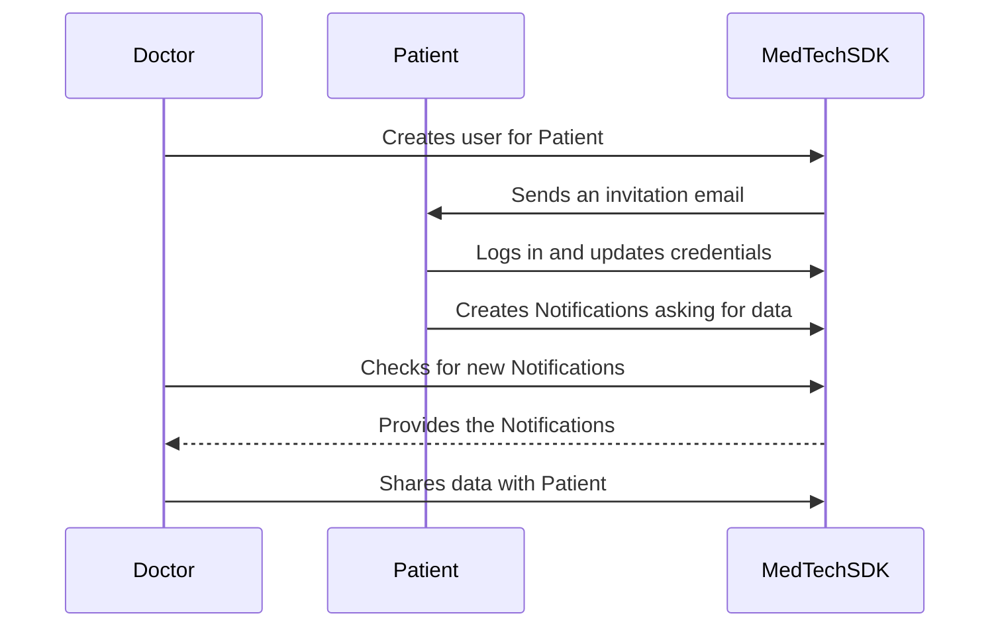

# Inviting an existing patient to become a user

## Use Case Description
There may be some cases where a Healthcare Professional wants to invite one of his patients to the platform. 
If the Patient already exists in the platform, the MedTech SDK provides a method to automatically invite the User, 
link it to the existing Patient and then ask all the Healthcare Professionals that manage their data to share those with 
them.  
The following diagrams summarizes the operations performed by the different actors.  



## Use Case Implementation

:::note

For this example, we assume that your database contains at least one Healthcare Professional, one Patient and one Data 
Sample associated to them.

:::

### The Doctor Invites the Patient

The first step in inviting a User is to create an instance of a class that implements the 
[`{{messageFactory}}`](../references/interfaces/EmailMessageFactory) interface. This interface specify the methods to
define the template of the email or SMS message that will be sent to the user when registering. It also allows to specify
whether prefer to send the user an email or an SMS message.  
The SDK also provides a pre-made implementation of this interface that you can use: `{{defaultMessageFactory}}`.  
The class defined as such must be provided to the builder when instantiating the SDK.

<!-- file://code-samples/{{sdk}}/how-to/create-user-for-patient/index.mts snippet:doctor api initialization-->
```typescript
```

Then, it is possible to invite the User using the newly created factory object and the existing Patient.

<!-- file://code-samples/{{sdk}}/how-to/create-user-for-patient/index.mts snippet:doctor invites user-->
```typescript
```

### The User Logs in and Asks for Access

After that, the User will receive an email or a SMS message that contains their login and a short-lived authentication 
token that they can use to log in.

<!-- file://code-samples/{{sdk}}/how-to/create-user-for-patient/index.mts snippet:user logs in-->
```typescript
```

The `authenticateAndAskAccessToItsExistingData` method will set up the User private and public key, it will create a 
long-lived authentication token, and will send a Notification to all the Healthcare Professionals that have a delegation 
for the Patient to ask access to their data.

### The Patient has Limited Permissions Until he is Given Access to Existing Data

The patient can now start using iCure, but there are still some limitations to what he can do until the doctor gives him access to the existing data.

The patient can't:

- access any existing {{services}} and health elements
- access encrypted data in his `Patient` entity

but the patient can:

- create new {{services}} and health elements
- share newly created medical data with his doctor
- access and modify non-encrypted data in his `Patient` entity

Initially, the patient won't be able to decrypt his own `Patient` entity, and for this reason the method 
`PatientApi.get` will fail. Instead, the patient needs to use the method `PatientApi.getAndTryDecrypt` 
which returns a `PotentiallyEncryptedPatient` which is an interface implemented by both `Patient` and 
`EncryptedPatient`. This method will try to decrypt the retrieved `Patient`, and if not successful instead of failing 
the method will just return the patient without decrypting it as an `EncryptedPatient`.

<!-- file://code-samples/{{sdk}}/how-to/create-user-for-patient/index.mts snippet:get patient details-->
```typescript
```
<!-- output://code-samples/{{sdk}}/how-to/create-user-for-patient/patientDetails.txt -->
<details>
<summary>patientDetails</summary>

```json
```
</details>

It is also possible to for the patient to modify his non-encrypted data using the 
`PatientApi.modifyPotentiallyEncryptedPatient` method. Note however that any attempt to change data which should be 
encrypted according to the api configuration will cause a runtime error.

<!-- file://code-samples/{{sdk}}/how-to/create-user-for-patient/index.mts snippet:modify patient details-->
```typescript
```
<!-- output://code-samples/{{sdk}}/how-to/create-user-for-patient/modifiedPatientDetails.txt -->
<details>
<summary>modifiedPatientDetails</summary>

```json
```
</details>

The patient can also create and share {{service}} and health elements as normal:

<!-- file://code-samples/{{sdk}}/how-to/create-user-for-patient/index.mts snippet:create healthcare element-->
```typescript
```
<!-- output://code-samples/{{sdk}}/how-to/create-user-for-patient/newHealthcareElement.txt -->
<details>
<summary>newHealthcareElement</summary>

```json
```
</details>

<!-- output://code-samples/{{sdk}}/how-to/create-user-for-patient/sharedHealthcareElement.txt -->
<details>
<summary>sharedHealthcareElement</summary>

```json
```
</details>

However, if you only share the medical data the doctor will not be able to find when using filters: this is because the
new data is created using a new secret foreign key that only the patient knows. In order to allow the doctor to find 
this new medical data you will have to share the secret foreign key using the 
`PatientApi.giveAccessToPotentiallyEncrypted` method.

<!-- file://code-samples/{{sdk}}/how-to/create-user-for-patient/index.mts snippet:share healthcare element sfk-->
```typescript
```
<!-- output://code-samples/{{sdk}}/how-to/create-user-for-patient/notFoundHEs.txt -->
<details>
<summary>notFoundHEs</summary>

```json
```
</details>

<!-- output://code-samples/{{sdk}}/how-to/create-user-for-patient/foundHEs.txt -->
<details>
<summary>foundHEs</summary>

```json
```
</details>

:::note

The patient needs to share his new secret foreign key with the delegate (using 
`PatientApi.giveAccessToPotentiallyEncrypted`) only once, and after the delegate will be able to find all new medical 
data created by the patient as long as the medical data itself has been shared with him.

Multiple calls to `PatientApi.giveAccessToPotentiallyEncrypted` from the same data owner with the same patient and
delegate will have no effect.

:::

### The Doctor Receives the Notification and Gives Access

Once the Notification is sent, on the Doctor side you can use the MedTech SDK to filter his Notifications and get the one related to 
the new User.

<!-- file://code-samples/{{sdk}}/how-to/create-user-for-patient/index.mts snippet:doctor gets pending notifications-->
```typescript
```
<!-- output://code-samples/{{sdk}}/how-to/create-user-for-patient/newNotifications.txt -->
<details>
<summary>newNotifications</summary>

```text
```
</details>

Then, you can change the status of the Notification to signal that the operation is being taken care of.

<!-- file://code-samples/{{sdk}}/how-to/create-user-for-patient/index.mts snippet:notification set ongoing-->
```typescript
```
<!-- output://code-samples/{{sdk}}/how-to/create-user-for-patient/ongoingStatusUpdate.txt -->
<details>
<summary>ongoingStatusUpdate</summary>

```json
```
</details>

To allow the new User to access all their own data, you can use the `giveAccessToAllDataOf` method.

<!-- file://code-samples/{{sdk}}/how-to/create-user-for-patient/index.mts snippet:data sharing-->
```typescript
```
<!-- output://code-samples/{{sdk}}/how-to/create-user-for-patient/sharedData.txt -->
<details>
<summary>sharedData</summary>

```json
```
</details>

If the method runs successfully, it will return a report of all the shared objects:


Finally, you can update the Notification status again to signal that the operation was completed successfully. 
Updating the status of the Notification is important, as otherwise you will risk of getting old Notifications when filtering
 for the new pending ones.

<!-- file://code-samples/{{sdk}}/how-to/create-user-for-patient/index.mts snippet:completed status-->
```typescript
```
<!-- output://code-samples/{{sdk}}/how-to/create-user-for-patient/completedStatusUpdate.txt -->
<details>
<summary>completedStatusUpdate</summary>

```json
```
</details>
