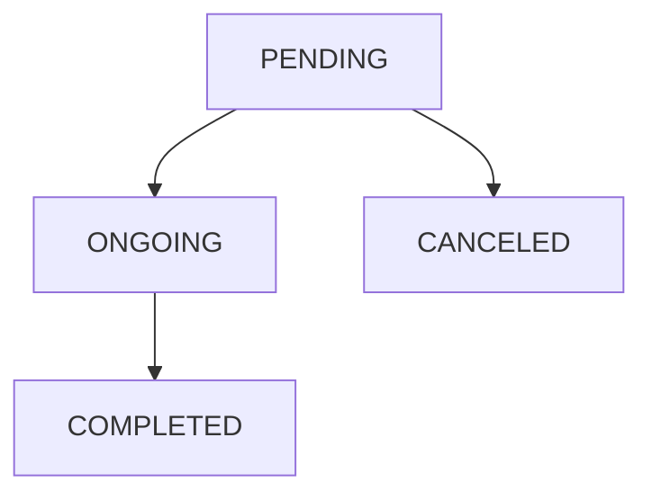

# Handling notifications

## What Is a Notification?

A Notification represents a request from a [Data Owner](/sdks/glossary#data-owner) to another to perform 
an operation.  
As for now, there are three types of Notifications:

* **KEY_PAIR_UPDATE**: when a Patient loses their private key and gets a new one, they can send this type of Notification to a Healthcare Professional to ask them to share their data with them again.
* **NEW_USER_OWN_DATA_ACCESS**: when a Patient logs in for the first time, they can send this type of Notification to a Healthcare Professional to aks for access to their own data.
* **OTHER**: all the other use cases.

### Status of a Notification

You can manage the lifecycle of a Notification by altering its status. Each Notification can have four possible states:

* **pending**: the Notification was created, and it is waiting to be managed.
* **ongoing**: the Notification was acknowledged, and the operations it prescribes are being managed.
* **completed**: the Notification was managed, and the operations it prescribes ended.
* **cancelled**: the Notification was cancelled without starting the operations it prescribes.



## Creating a Notification

:::note

To perform the following operations, we suppose you have at least a Patient and a Healthcare Professional in your database.

:::

In the following example, a Patient creates a Notification for a Healthcare Professional communicating that they have a new
 key and need access to their data.

<!-- file://code-samples/how-to/manage-notifications/index.mts snippet:create a notification as patient-->
```typescript
const accessNotification = await patientApi.notificationApi.createOrModifyNotification(
  new Notification({
    type: NotificationTypeEnum.KEY_PAIR_UPDATE,
  }),
  hcp.id,
)
```

<!-- output://code-samples/how-to/manage-notifications/accessNotification.txt -->
<details>
<summary>accessNotification</summary>

```json
{
  "id": "02298f0d-2728-45f5-a58b-ca8902dc05c8",
  "rev": "1-c9e086b8502d89d43102d84d10392ff4",
  "created": 1680075115759,
  "modified": 1680075115759,
  "author": "68a4f7d3-aa5d-43ff-95a1-ba14675397ca",
  "responsible": "3238dd4f-be09-4375-bb5b-0bf9d737ac94",
  "status": "pending",
  "identifiers": [],
  "properties": [],
  "type": "KEY_PAIR_UPDATE",
  "systemMetaData": {
    "secretForeignKeys": [],
    "cryptedForeignKeys": {},
    "delegations": {
      "3238dd4f-be09-4375-bb5b-0bf9d737ac94": {},
      "b16baab3-b6a3-42a0-b4b5-8dc8e00cc806": {}
    },
    "encryptionKeys": {
      "3238dd4f-be09-4375-bb5b-0bf9d737ac94": {},
      "b16baab3-b6a3-42a0-b4b5-8dc8e00cc806": {}
    }
  }
}
```
</details>

:::note

The default status of a Notification is `pending`

:::

## Retrieving a Notification

### Retrieving a Notification Using its Id

In the following example, a Patient creates a Notification for a Healthcare Professional and then retrieves it using its
 id.

<!-- file://code-samples/how-to/manage-notifications/index.mts snippet:creates a notification, then retrieves it-->
```typescript
const createdNotification = await patientApi.notificationApi.createOrModifyNotification(
  new Notification({
    type: NotificationTypeEnum.OTHER,
  }),
  hcp.id,
)

const retrievedNotification = await patientApi.notificationApi.getNotification(
  createdNotification.id,
)
```

<!-- output://code-samples/how-to/manage-notifications/createdNotification.txt -->
<details>
<summary>createdNotification</summary>

```json
{
  "id": "733a4ff3-9747-49d3-a096-0b6be425659b",
  "rev": "1-b48f928d492f5344c44295b33c93115e",
  "created": 1680075115983,
  "modified": 1680075115983,
  "author": "68a4f7d3-aa5d-43ff-95a1-ba14675397ca",
  "responsible": "3238dd4f-be09-4375-bb5b-0bf9d737ac94",
  "status": "pending",
  "identifiers": [],
  "properties": [],
  "type": "OTHER",
  "systemMetaData": {
    "secretForeignKeys": [],
    "cryptedForeignKeys": {},
    "delegations": {
      "3238dd4f-be09-4375-bb5b-0bf9d737ac94": {},
      "b16baab3-b6a3-42a0-b4b5-8dc8e00cc806": {}
    },
    "encryptionKeys": {
      "3238dd4f-be09-4375-bb5b-0bf9d737ac94": {},
      "b16baab3-b6a3-42a0-b4b5-8dc8e00cc806": {}
    }
  }
}
```
</details>

<!-- output://code-samples/how-to/manage-notifications/retrievedNotification.txt -->
<details>
<summary>retrievedNotification</summary>

```json
{
  "id": "733a4ff3-9747-49d3-a096-0b6be425659b",
  "rev": "1-b48f928d492f5344c44295b33c93115e",
  "created": 1680075115983,
  "modified": 1680075115983,
  "author": "68a4f7d3-aa5d-43ff-95a1-ba14675397ca",
  "responsible": "3238dd4f-be09-4375-bb5b-0bf9d737ac94",
  "status": "pending",
  "identifiers": [],
  "properties": [],
  "type": "OTHER",
  "systemMetaData": {
    "secretForeignKeys": [],
    "cryptedForeignKeys": {},
    "delegations": {
      "3238dd4f-be09-4375-bb5b-0bf9d737ac94": {},
      "b16baab3-b6a3-42a0-b4b5-8dc8e00cc806": {}
    },
    "encryptionKeys": {
      "3238dd4f-be09-4375-bb5b-0bf9d737ac94": {},
      "b16baab3-b6a3-42a0-b4b5-8dc8e00cc806": {}
    }
  }
}
```
</details>

### Retrieving Notifications Using Complex Criteria

If you want to retrieve a set of Notifications that satisfy complex criteria, you can use a Filter.  
In this example, a Healthcare Professional filters all their Notifications that were created after a certain date.

<!-- file://code-samples/how-to/manage-notifications/index.mts snippet:creates after date filter-->
```typescript
const startTimestamp = new Date(2022, 8, 27).getTime()

const afterDateFilter = await new NotificationFilter()
  .forDataOwner(user.healthcarePartyId)
  .afterDate(startTimestamp)
  .build()
```

<!-- output://code-samples/how-to/manage-notifications/afterDateFilter.txt -->
<details>
<summary>afterDateFilter</summary>

```json
{
  "healthcarePartyId": "b16baab3-b6a3-42a0-b4b5-8dc8e00cc806",
  "date": 1664229600000,
  "$type": "NotificationsAfterDateFilter"
}
```
</details>

:::note

You can learn more about filters in the how to

:::

After creating the filter, is it possible to use it to retrieve the Notifications.

<!-- file://code-samples/how-to/manage-notifications/index.mts snippet:gets the first page of results-->
```typescript
const notificationsFirstPage = await api.notificationApi.filterNotifications(
  afterDateFilter,
  undefined,
  10,
)
```

<!-- output://code-samples/how-to/manage-notifications/notificationsFirstPage.txt -->
<details>
<summary>notificationsFirstPage</summary>

```json
{
  "pageSize": 10,
  "totalSize": 0,
  "rows": [
    {
      "id": "733a4ff3-9747-49d3-a096-0b6be425659b",
      "rev": "1-b48f928d492f5344c44295b33c93115e",
      "created": 1680075115983,
      "modified": 1680075115983,
      "author": "68a4f7d3-aa5d-43ff-95a1-ba14675397ca",
      "responsible": "3238dd4f-be09-4375-bb5b-0bf9d737ac94",
      "status": "pending",
      "identifiers": [],
      "properties": [],
      "type": "OTHER",
      "systemMetaData": {
        "secretForeignKeys": [],
        "cryptedForeignKeys": {},
        "delegations": {
          "3238dd4f-be09-4375-bb5b-0bf9d737ac94": {},
          "b16baab3-b6a3-42a0-b4b5-8dc8e00cc806": {}
        },
        "encryptionKeys": {
          "3238dd4f-be09-4375-bb5b-0bf9d737ac94": {},
          "b16baab3-b6a3-42a0-b4b5-8dc8e00cc806": {}
        }
      }
    },
    {
      "id": "02298f0d-2728-45f5-a58b-ca8902dc05c8",
      "rev": "1-c9e086b8502d89d43102d84d10392ff4",
      "created": 1680075115759,
      "modified": 1680075115759,
      "author": "68a4f7d3-aa5d-43ff-95a1-ba14675397ca",
      "responsible": "3238dd4f-be09-4375-bb5b-0bf9d737ac94",
      "status": "pending",
      "identifiers": [],
      "properties": [],
      "type": "KEY_PAIR_UPDATE",
      "systemMetaData": {
        "secretForeignKeys": [],
        "cryptedForeignKeys": {},
        "delegations": {
          "3238dd4f-be09-4375-bb5b-0bf9d737ac94": {},
          "b16baab3-b6a3-42a0-b4b5-8dc8e00cc806": {}
        },
        "encryptionKeys": {
          "3238dd4f-be09-4375-bb5b-0bf9d737ac94": {},
          "b16baab3-b6a3-42a0-b4b5-8dc8e00cc806": {}
        }
      }
    },
    {
      "id": "360f26c2-1e7b-40b1-a20b-48f114644d39",
      "rev": "3-b5a72d5fb8f2f1770574054e2b6052ff",
      "created": 1680075082621,
      "modified": 1680075082621,
      "author": "be11123f-7dcd-4731-b856-9b55b1bb357b",
      "responsible": "1e674fa4-f59e-4f8e-888a-df78f1cb572a",
      "status": "completed",
      "identifiers": [],
      "properties": [],
      "type": "NEW_USER_OWN_DATA_ACCESS",
      "systemMetaData": {
        "secretForeignKeys": [],
        "cryptedForeignKeys": {},
        "delegations": {
          "1e674fa4-f59e-4f8e-888a-df78f1cb572a": {},
          "b16baab3-b6a3-42a0-b4b5-8dc8e00cc806": {}
        },
        "encryptionKeys": {
          "1e674fa4-f59e-4f8e-888a-df78f1cb572a": {},
          "b16baab3-b6a3-42a0-b4b5-8dc8e00cc806": {}
        }
      }
    },
    {
      "id": "84440ac1-4d17-4f80-a27b-859e0cf81af2",
      "rev": "1-3a55504f4fe5efe2642b6ada57077058",
      "created": 1680075052724,
      "modified": 1680075052724,
      "author": "f4c7dd4e-e7c9-4419-8dc1-eb6217654134",
      "responsible": "59b5a1d8-46a6-429f-9b41-005925c8afd5",
      "status": "pending",
      "identifiers": [],
      "properties": [
        {
          "id": "dataOwnerConcernedId",
          "type": {
            "type": "STRING"
          },
          "typedValue": {
            "stringValue": "59b5a1d8-46a6-429f-9b41-005925c8afd5",
            "type": "STRING"
          }
        },
        {
          "id": "dataOwnerConcernedPubKey",
          "type": {
            "type": "STRING"
          },
          "typedValue": {
            "stringValue": "30820122300d06092a864886f70d01010105000382010f003082010a0282010100d0921d7b18d8341444130f89d215d83800db65373d21a036c3f3c840f824b4fc4723024599438105f38106d2ffd7173b8291478c02334cab84e213a9fd9d24f7508e2468b18bdf3db59df9f2fd908082ce6e1aea60bee23fde6efeb500d7911f38bf451e38f4084ed3c8bb794b7b1c768d3756a353822a372029b1959527fa47d951c6c64231d050b3480443b6c82389e12fcc34d844401e06932479a32db49618ef18a1dd63a29cd321a2c4deb62170eb74bf9d243a766de5b0b97e57bae84b0cc4f55bacb6d6245912409703f37fb2a45af5d63d888c233698307ae2234e872e4b425042957ede9a1f5b0ad543c685775a35328a0468691cd0a0c136a9edbb0203010001",
            "type": "STRING"
          }
        }
      ],
      "type": "KEY_PAIR_UPDATE",
      "systemMetaData": {
        "secretForeignKeys": [],
        "cryptedForeignKeys": {},
        "delegations": {
          "59b5a1d8-46a6-429f-9b41-005925c8afd5": {},
          "b16baab3-b6a3-42a0-b4b5-8dc8e00cc806": {}
        },
        "encryptionKeys": {
          "59b5a1d8-46a6-429f-9b41-005925c8afd5": {},
          "b16baab3-b6a3-42a0-b4b5-8dc8e00cc806": {}
        }
      }
    },
    {
      "id": "13e152f8-97ba-49e2-8b96-94d60b092337",
      "rev": "2-8ab12d2e0aa4d8b2b6681f568957a98c",
      "created": 1680074917873,
      "modified": 1680074917873,
      "author": "f7ec463c-44b4-414e-9e7f-f2cc0967cc01",
      "responsible": "b16baab3-b6a3-42a0-b4b5-8dc8e00cc806",
      "status": "ongoing",
      "identifiers": [],
      "properties": [],
      "type": "KEY_PAIR_UPDATE",
      "systemMetaData": {
        "secretForeignKeys": [],
        "cryptedForeignKeys": {},
        "delegations": {
          "b16baab3-b6a3-42a0-b4b5-8dc8e00cc806": {}
        },
        "encryptionKeys": {
          "b16baab3-b6a3-42a0-b4b5-8dc8e00cc806": {}
        }
      }
    },
    {
      "id": "d725cfa4-cf84-458c-8497-cb9e3852e608",
      "rev": "2-63fbbbf8dc7082491b7085228a4c21d2",
      "created": 1680074917211,
      "modified": 1680074917211,
      "author": "f7ec463c-44b4-414e-9e7f-f2cc0967cc01",
      "responsible": "b16baab3-b6a3-42a0-b4b5-8dc8e00cc806",
      "status": "ongoing",
      "identifiers": [],
      "properties": [],
      "type": "KEY_PAIR_UPDATE",
      "systemMetaData": {
        "secretForeignKeys": [],
        "cryptedForeignKeys": {},
        "delegations": {
          "b16baab3-b6a3-42a0-b4b5-8dc8e00cc806": {}
        },
        "encryptionKeys": {
          "b16baab3-b6a3-42a0-b4b5-8dc8e00cc806": {}
        }
      }
    },
    {
      "id": "68c22afb-3e6f-40e8-a6c6-a78c982fd7e1",
      "rev": "1-1ce5678e6867b66daf8bfcd2874bdf84",
      "created": 1680074915461,
      "modified": 1680074915461,
      "author": "68a4f7d3-aa5d-43ff-95a1-ba14675397ca",
      "responsible": "3238dd4f-be09-4375-bb5b-0bf9d737ac94",
      "status": "pending",
      "identifiers": [],
      "properties": [],
      "type": "OTHER",
      "systemMetaData": {
        "secretForeignKeys": [],
        "cryptedForeignKeys": {},
        "delegations": {
          "3238dd4f-be09-4375-bb5b-0bf9d737ac94": {},
          "b16baab3-b6a3-42a0-b4b5-8dc8e00cc806": {}
        },
        "encryptionKeys": {
          "3238dd4f-be09-4375-bb5b-0bf9d737ac94": {},
          "b16baab3-b6a3-42a0-b4b5-8dc8e00cc806": {}
        }
      }
    },
    {
      "id": "b1ebe730-dfb6-4730-83ff-972ae2e4b9de",
      "rev": "1-c324b14cdcbeb33cf0a8f6722f785329",
      "created": 1680074915217,
      "modified": 1680074915217,
      "author": "68a4f7d3-aa5d-43ff-95a1-ba14675397ca",
      "responsible": "3238dd4f-be09-4375-bb5b-0bf9d737ac94",
      "status": "pending",
      "identifiers": [],
      "properties": [],
      "type": "KEY_PAIR_UPDATE",
      "systemMetaData": {
        "secretForeignKeys": [],
        "cryptedForeignKeys": {},
        "delegations": {
          "3238dd4f-be09-4375-bb5b-0bf9d737ac94": {},
          "b16baab3-b6a3-42a0-b4b5-8dc8e00cc806": {}
        },
        "encryptionKeys": {
          "3238dd4f-be09-4375-bb5b-0bf9d737ac94": {},
          "b16baab3-b6a3-42a0-b4b5-8dc8e00cc806": {}
        }
      }
    },
    {
      "id": "b9adbe0a-f224-4564-a355-e09a781a9db6",
      "rev": "3-f1860ef137c60c3a4652603d31be1759",
      "created": 1680074883802,
      "modified": 1680074883802,
      "author": "b373ff74-a235-44d8-b7eb-e1a61314928a",
      "responsible": "65c1aa32-9780-4634-b789-1c5a1e075c3b",
      "status": "completed",
      "identifiers": [],
      "properties": [],
      "type": "NEW_USER_OWN_DATA_ACCESS",
      "systemMetaData": {
        "secretForeignKeys": [],
        "cryptedForeignKeys": {},
        "delegations": {
          "65c1aa32-9780-4634-b789-1c5a1e075c3b": {},
          "b16baab3-b6a3-42a0-b4b5-8dc8e00cc806": {}
        },
        "encryptionKeys": {
          "65c1aa32-9780-4634-b789-1c5a1e075c3b": {},
          "b16baab3-b6a3-42a0-b4b5-8dc8e00cc806": {}
        }
      }
    },
    {
      "id": "a82b655a-6cc5-4727-b15a-375ee28003c2",
      "rev": "1-414c3eb13ff9f787cb2b84ba4746fe58",
      "created": 1680074852281,
      "modified": 1680074852281,
      "author": "14d6bd45-7a28-4d38-9255-16323a2eed92",
      "responsible": "aeda80a9-193d-4f8b-ab4e-1510ab77ccbb",
      "status": "pending",
      "identifiers": [],
      "properties": [
        {
          "id": "dataOwnerConcernedId",
          "type": {
            "type": "STRING"
          },
          "typedValue": {
            "stringValue": "aeda80a9-193d-4f8b-ab4e-1510ab77ccbb",
            "type": "STRING"
          }
        },
        {
          "id": "dataOwnerConcernedPubKey",
          "type": {
            "type": "STRING"
          },
          "typedValue": {
            "stringValue": "30820122300d06092a864886f70d01010105000382010f003082010a0282010100d51cdfd81437e260e49d00636160e930f55c0fd6ad45a055c93496e9e4ce1db5617174433afb5bfba3fddffb4e4e3ce12c2b6e72575a8f347bcc5047325f4883a47cc4bb1009313764973131bb62c93c3176bef9c28176a179b7b2cbbfef3eb6789d11fd5197bf105725eb6ffccfca887e327c009f0b29befeee566cd228b37519aeb0e4be2b72ab25c608b1f304b6416f3d44ea5d111177f39d81f1e2f1d42aa2180555e942653d047681a69116b3b6cfc56005676edcd0d1ce3628eac5a2f567f67c3a9fbc19f6a4388a8010b27e41d8154ca5ab02ff556c0ee8dec88365d49a2f862f6fd55be1906cf076c5424a9b933d128dd2ae3324920e3d36c24ed04f0203010001",
            "type": "STRING"
          }
        }
      ],
      "type": "KEY_PAIR_UPDATE",
      "systemMetaData": {
        "secretForeignKeys": [],
        "cryptedForeignKeys": {},
        "delegations": {
          "aeda80a9-193d-4f8b-ab4e-1510ab77ccbb": {},
          "b16baab3-b6a3-42a0-b4b5-8dc8e00cc806": {}
        },
        "encryptionKeys": {
          "aeda80a9-193d-4f8b-ab4e-1510ab77ccbb": {},
          "b16baab3-b6a3-42a0-b4b5-8dc8e00cc806": {}
        }
      }
    }
  ],
  "nextKeyPair": {
    "startKey": "7a362257-3c3c-4b66-ad4e-e5cfdcc92e0f",
    "startKeyDocId": "7a362257-3c3c-4b66-ad4e-e5cfdcc92e0f"
  }
}
```
</details>


The `filter` method returns a PaginatedList, which contains up to `limit` Notifications in the `rows` field, as specified by the method parameter (1000 by default).
If  the PaginatedList has a non-null field `startKeyDocId` there are more notifications which can be retrieved with this filter: you can use this value to retrieve (part of) the remaining notifications.

<!-- file://code-samples/how-to/manage-notifications/index.mts snippet:gets the second page of results-->
```typescript
const notificationsSecondPage = await api.notificationApi.filterNotifications(
  afterDateFilter,
  notificationsFirstPage.nextKeyPair.startKeyDocId,
  10,
)
```

<!-- output://code-samples/how-to/manage-notifications/notificationsSecondPage.txt -->
<details>
<summary>notificationsSecondPage</summary>

```json
{
  "pageSize": 10,
  "totalSize": 0,
  "rows": [
    {
      "id": "7a362257-3c3c-4b66-ad4e-e5cfdcc92e0f",
      "rev": "3-69a5e899fb7ad7ac0a30243c8b2a7865",
      "created": 1680074584273,
      "modified": 1680074584273,
      "author": "68f40ba6-af34-42a2-8955-09345bd59e27",
      "responsible": "f272cdab-3139-47d2-9fff-a1cb2e082f15",
      "status": "completed",
      "identifiers": [],
      "properties": [],
      "type": "NEW_USER_OWN_DATA_ACCESS",
      "systemMetaData": {
        "secretForeignKeys": [],
        "cryptedForeignKeys": {},
        "delegations": {
          "f272cdab-3139-47d2-9fff-a1cb2e082f15": {},
          "b16baab3-b6a3-42a0-b4b5-8dc8e00cc806": {}
        },
        "encryptionKeys": {
          "f272cdab-3139-47d2-9fff-a1cb2e082f15": {},
          "b16baab3-b6a3-42a0-b4b5-8dc8e00cc806": {}
        }
      }
    },
    {
      "id": "168d0fb1-ab1f-4372-990b-27566df70c1f",
      "rev": "1-07f3fb5766649aa9c05d9c0ddb9cd7bb",
      "created": 1680074568833,
      "modified": 1680074568833,
      "author": "b4269bb4-cf98-491b-b5a6-696895acede2",
      "responsible": "cba719b5-f8df-4e63-b34a-df5378648a29",
      "status": "pending",
      "identifiers": [],
      "properties": [
        {
          "id": "dataOwnerConcernedId",
          "type": {
            "type": "STRING"
          },
          "typedValue": {
            "stringValue": "cba719b5-f8df-4e63-b34a-df5378648a29",
            "type": "STRING"
          }
        },
        {
          "id": "dataOwnerConcernedPubKey",
          "type": {
            "type": "STRING"
          },
          "typedValue": {
            "stringValue": "30820122300d06092a864886f70d01010105000382010f003082010a0282010100c3a5d089bcbe24d444359d1539877032c2ef1c73dbb90261f1ada053db52c70f47cf302b177187f486900a815873f9972a9a1c5b09aa26148b7a5ef6472f832e7b436fc81b676d7b3865de8981969a4c9db148de492667605500e32daefb4ab1ef883658c045137c17a3cd22e47c33dba20af3183febccfd9f63c55537c0511313a5b3f9a3c9a7c157826ee19bc317dacac2aacb661663086a6fb2002b13ae47f6d8b2ba51b4182bee58e41e858d9fe17d512efa3be30d07d0648de82d46158f5744b95a9784db0008b1a1674a52d59e96702ad8ea878400c0f347a5b0ed7b7117bdea1c8b14e7e2376627aa408e6a96bdb7b596af0e467432ce730e230b4a7f0203010001",
            "type": "STRING"
          }
        }
      ],
      "type": "KEY_PAIR_UPDATE",
      "systemMetaData": {
        "secretForeignKeys": [],
        "cryptedForeignKeys": {},
        "delegations": {
          "cba719b5-f8df-4e63-b34a-df5378648a29": {},
          "b16baab3-b6a3-42a0-b4b5-8dc8e00cc806": {}
        },
        "encryptionKeys": {
          "cba719b5-f8df-4e63-b34a-df5378648a29": {},
          "b16baab3-b6a3-42a0-b4b5-8dc8e00cc806": {}
        }
      }
    },
    {
      "id": "69429e52-e336-4b61-8a5e-0621268b7fa4",
      "rev": "3-fc83adc11013df98f7550c59523ca183",
      "created": 1679997718104,
      "modified": 1679997718104,
      "author": "c33c3ee7-6eb3-4c08-a7af-d80433c1de09",
      "responsible": "e3a12c0d-274c-42dd-884b-89e86d6b7cd5",
      "status": "completed",
      "identifiers": [],
      "properties": [],
      "type": "NEW_USER_OWN_DATA_ACCESS",
      "systemMetaData": {
        "secretForeignKeys": [],
        "cryptedForeignKeys": {},
        "delegations": {
          "e3a12c0d-274c-42dd-884b-89e86d6b7cd5": {},
          "b16baab3-b6a3-42a0-b4b5-8dc8e00cc806": {}
        },
        "encryptionKeys": {
          "e3a12c0d-274c-42dd-884b-89e86d6b7cd5": {},
          "b16baab3-b6a3-42a0-b4b5-8dc8e00cc806": {}
        }
      }
    },
    {
      "id": "e41382a3-c508-44ed-b204-211c14e3ce89",
      "rev": "1-986a6a5caa1b3c90f53b3f0f5824dae5",
      "created": 1679997681218,
      "modified": 1679997681218,
      "author": "d4ed8d59-bf6a-42cb-9d25-25f861b56f28",
      "responsible": "df18183f-fabf-4f13-b204-0650dc68c7c6",
      "status": "pending",
      "identifiers": [],
      "properties": [
        {
          "id": "dataOwnerConcernedId",
          "type": {
            "type": "STRING"
          },
          "typedValue": {
            "stringValue": "df18183f-fabf-4f13-b204-0650dc68c7c6",
            "type": "STRING"
          }
        },
        {
          "id": "dataOwnerConcernedPubKey",
          "type": {
            "type": "STRING"
          },
          "typedValue": {
            "stringValue": "30820122300d06092a864886f70d01010105000382010f003082010a0282010100db36eb19d1d91fb09f892a9c6246768053d0307eb361f5c48f2ff63e7c5a5a0860ebcfd996ae4c432215fc7263b64251445f488c3ac22d55b7a661fce523832c775292d39420b72b855d8acb3c2226de7e021618f92c61bd97cd4c5c1c3f0a82fcf309bce96db112b69ae116d479c98d23b86a78d192dd7575a2bdeb9c689135b5cc1d8b2b082a59e4b04db056a9b4af81b2585e31492c8e353a81232efbb9a8c4f500478a3b8084d9d44c50c1cd67ab67fc4e482a0d54c62ce0232ef0db65275bf369a9df570560cc9c87e4d67dc46a68d96c44178e9c5643acb2af6a6d38b00591b1b949257abd45882af9955157b48a2743623aa18e9caadf3c9a2749f84f0203010001",
            "type": "STRING"
          }
        }
      ],
      "type": "KEY_PAIR_UPDATE",
      "systemMetaData": {
        "secretForeignKeys": [],
        "cryptedForeignKeys": {},
        "delegations": {
          "df18183f-fabf-4f13-b204-0650dc68c7c6": {},
          "b16baab3-b6a3-42a0-b4b5-8dc8e00cc806": {}
        },
        "encryptionKeys": {
          "df18183f-fabf-4f13-b204-0650dc68c7c6": {},
          "b16baab3-b6a3-42a0-b4b5-8dc8e00cc806": {}
        }
      }
    },
    {
      "id": "001f7d79-f8a9-464b-9430-68b9cc616dd7",
      "rev": "3-bbe5a729dce107342ecdcd10864ad279",
      "created": 1679997221965,
      "modified": 1679997221965,
      "author": "357f024e-fdd6-4b0c-a593-a475654b3c5c",
      "responsible": "aa8f1340-74d6-47f7-9bb8-0a32384897dc",
      "status": "completed",
      "identifiers": [],
      "properties": [],
      "type": "NEW_USER_OWN_DATA_ACCESS",
      "systemMetaData": {
        "secretForeignKeys": [],
        "cryptedForeignKeys": {},
        "delegations": {
          "aa8f1340-74d6-47f7-9bb8-0a32384897dc": {},
          "b16baab3-b6a3-42a0-b4b5-8dc8e00cc806": {}
        },
        "encryptionKeys": {
          "aa8f1340-74d6-47f7-9bb8-0a32384897dc": {},
          "b16baab3-b6a3-42a0-b4b5-8dc8e00cc806": {}
        }
      }
    },
    {
      "id": "51615526-e486-4512-b8c6-4ff481748888",
      "rev": "1-08d166edecc920acb98e53d3996a5ed3",
      "created": 1679997198745,
      "modified": 1679997198745,
      "author": "c533e90d-fd79-43e6-923f-26bf4cd2ec80",
      "responsible": "f7e4ab5d-965b-468e-bef4-a9cabe7f446f",
      "status": "pending",
      "identifiers": [],
      "properties": [
        {
          "id": "dataOwnerConcernedId",
          "type": {
            "type": "STRING"
          },
          "typedValue": {
            "stringValue": "f7e4ab5d-965b-468e-bef4-a9cabe7f446f",
            "type": "STRING"
          }
        },
        {
          "id": "dataOwnerConcernedPubKey",
          "type": {
            "type": "STRING"
          },
          "typedValue": {
            "stringValue": "30820122300d06092a864886f70d01010105000382010f003082010a0282010100b68ac0a763ecef81fd284f720e917cb2057a6a0286b049146501d638d47e2cb4ba60d6a4a5eeb5f742300bb1a785b3185fd5e1c77b26323a936cdb13b30dc6ac1c4389996db2b7ca6126fd6055b082c80116ded3b431b443773b24b648f37929b27f3ff7c3cd4d94c1e7e06f75a23958b88aa8eee7d01be1ad1db12f33d51ab60323c965922cf4bf6970afcf52decde111be5f5bab8a6f17698f04955ad1118f4fface96a779f29ac5b7a455a0d0a7d3a641a263b8d882c55c83c67e1e552593ce6324bd6fef885a15048b7d61644a27691c5591d077d257a089ff240f9fb109fe23b9ee32960ae7f8068e06ee2a8e0fc2b838c8d23eb68076c5c8f3b49d1ba50203010001",
            "type": "STRING"
          }
        }
      ],
      "type": "KEY_PAIR_UPDATE",
      "systemMetaData": {
        "secretForeignKeys": [],
        "cryptedForeignKeys": {},
        "delegations": {
          "f7e4ab5d-965b-468e-bef4-a9cabe7f446f": {},
          "b16baab3-b6a3-42a0-b4b5-8dc8e00cc806": {}
        },
        "encryptionKeys": {
          "f7e4ab5d-965b-468e-bef4-a9cabe7f446f": {},
          "b16baab3-b6a3-42a0-b4b5-8dc8e00cc806": {}
        }
      }
    },
    {
      "id": "1ac366ba-a984-4506-bd59-e798cfc6f6fd",
      "rev": "2-9f4c293d7fed7db129745a0465b39f17",
      "created": 1679991713726,
      "modified": 1679991713726,
      "author": "f7ec463c-44b4-414e-9e7f-f2cc0967cc01",
      "responsible": "b16baab3-b6a3-42a0-b4b5-8dc8e00cc806",
      "status": "ongoing",
      "identifiers": [],
      "properties": [],
      "type": "KEY_PAIR_UPDATE",
      "systemMetaData": {
        "secretForeignKeys": [],
        "cryptedForeignKeys": {},
        "delegations": {
          "b16baab3-b6a3-42a0-b4b5-8dc8e00cc806": {}
        },
        "encryptionKeys": {
          "b16baab3-b6a3-42a0-b4b5-8dc8e00cc806": {}
        }
      }
    },
    {
      "id": "410e15aa-c60e-48a2-b722-817a92cd4ba4",
      "rev": "2-39181d31f83e35e7131bb3fbda858019",
      "created": 1679991713483,
      "modified": 1679991713483,
      "author": "f7ec463c-44b4-414e-9e7f-f2cc0967cc01",
      "responsible": "b16baab3-b6a3-42a0-b4b5-8dc8e00cc806",
      "status": "ongoing",
      "identifiers": [],
      "properties": [],
      "type": "KEY_PAIR_UPDATE",
      "systemMetaData": {
        "secretForeignKeys": [],
        "cryptedForeignKeys": {},
        "delegations": {
          "b16baab3-b6a3-42a0-b4b5-8dc8e00cc806": {}
        },
        "encryptionKeys": {
          "b16baab3-b6a3-42a0-b4b5-8dc8e00cc806": {}
        }
      }
    },
    {
      "id": "519a4da0-e7b4-4421-be63-6a99904078a2",
      "rev": "1-59504d554510f06b3dac0b21a5387a37",
      "created": 1679991712230,
      "modified": 1679991712230,
      "author": "68a4f7d3-aa5d-43ff-95a1-ba14675397ca",
      "responsible": "3238dd4f-be09-4375-bb5b-0bf9d737ac94",
      "status": "pending",
      "identifiers": [],
      "properties": [],
      "type": "OTHER",
      "systemMetaData": {
        "secretForeignKeys": [],
        "cryptedForeignKeys": {},
        "delegations": {
          "3238dd4f-be09-4375-bb5b-0bf9d737ac94": {},
          "b16baab3-b6a3-42a0-b4b5-8dc8e00cc806": {}
        },
        "encryptionKeys": {
          "3238dd4f-be09-4375-bb5b-0bf9d737ac94": {},
          "b16baab3-b6a3-42a0-b4b5-8dc8e00cc806": {}
        }
      }
    },
    {
      "id": "f9eddd73-03eb-44ea-8487-97cef757ac98",
      "rev": "1-35ea0e607f642e17f7ca33814bd34d76",
      "created": 1679991712162,
      "modified": 1679991712162,
      "author": "68a4f7d3-aa5d-43ff-95a1-ba14675397ca",
      "responsible": "3238dd4f-be09-4375-bb5b-0bf9d737ac94",
      "status": "pending",
      "identifiers": [],
      "properties": [],
      "type": "KEY_PAIR_UPDATE",
      "systemMetaData": {
        "secretForeignKeys": [],
        "cryptedForeignKeys": {},
        "delegations": {
          "3238dd4f-be09-4375-bb5b-0bf9d737ac94": {},
          "b16baab3-b6a3-42a0-b4b5-8dc8e00cc806": {}
        },
        "encryptionKeys": {
          "3238dd4f-be09-4375-bb5b-0bf9d737ac94": {},
          "b16baab3-b6a3-42a0-b4b5-8dc8e00cc806": {}
        }
      }
    }
  ],
  "nextKeyPair": {
    "startKey": "907ef780-7a6e-488b-a5db-68d9d0472c8c",
    "startKeyDocId": "907ef780-7a6e-488b-a5db-68d9d0472c8c"
  }
}
```
</details>


### Retrieving all the Pending Notifications

A Healthcare Professional can also retrieve all the Notifications assigned to him that have a `pending` status.

<!-- file://code-samples/how-to/manage-notifications/index.mts snippet:gets the pending notifications-->
```typescript
const pendingNotifications = await api.notificationApi.getPendingNotificationsAfter()
```

<!-- output://code-samples/how-to/manage-notifications/pendingNotifications.txt -->
<details>
<summary>pendingNotifications</summary>

```text
[
  {
    "id": "733a4ff3-9747-49d3-a096-0b6be425659b",
    "rev": "1-b48f928d492f5344c44295b33c93115e",
    "created": 1680075115983,
    "modified": 1680075115983,
    "author": "68a4f7d3-aa5d-43ff-95a1-ba14675397ca",
    "responsible": "3238dd4f-be09-4375-bb5b-0bf9d737ac94",
    "status": "pending",
    "identifiers": [],
    "properties": [],
    "type": "OTHER",
    "systemMetaData": {
      "secretForeignKeys": [],
      "cryptedForeignKeys": {},
      "delegations": {
        "3238dd4f-be09-4375-bb5b-0bf9d737ac94": {},
        "b16baab3-b6a3-42a0-b4b5-8dc8e00cc806": {}
      },
      "encryptionKeys": {
        "3238dd4f-be09-4375-bb5b-0bf9d737ac94": {},
        "b16baab3-b6a3-42a0-b4b5-8dc8e00cc806": {}
      }
    }
  },
  {
    "id": "02298f0d-2728-45f5-a58b-ca8902dc05c8",
    "rev": "1-c9e086b8502d89d43102d84d10392ff4",
    "created": 1680075115759,
    "modified": 1680075115759,
    "author": "68a4f7d3-aa5d-43ff-95a1-ba14675397ca",
    "responsible": "3238dd4f-be09-4375-bb5b-0bf9d737ac94",
    "status": "pending",
    "identifiers": [],
    "properties": [],
    "type": "KEY_PAIR_UPDATE",
    "systemMetaData": {
      "secretForeignKeys": [],
      "cryptedForeignKeys": {},
      "delegations": {
        "3238dd4f-be09-4375-bb5b-0bf9d737ac94": {},
        "b16baab3-b6a3-42a0-b4b5-8dc8e00cc806": {}
      },
      "encryptionKeys": {
        "3238dd4f-be09-4375-bb5b-0bf9d737ac94": {},
        "b16baab3-b6a3-42a0-b4b5-8dc8e00cc806": {}
      }
    }
  },
  {
    "id": "84440ac1-4d17-4f80-a27b-859e0cf81af2",
    "rev": "1-3a55504f4fe5efe2642b6ada57077058",
    "created": 1680075052724,
    "modified": 1680075052724,
    "author": "f4c7dd4e-e7c9-4419-8dc1-eb6217654134",
    "responsible": "59b5a1d8-46a6-429f-9b41-005925c8afd5",
    "status": "pending",
    "identifiers": [],
    "properties": [
      {
        "id": "dataOwnerConcernedId",
        "type": {
          "type": "STRING"
        },
        "typedValue": {
          "stringValue": "59b5a1d8-46a6-429f-9b41-005925c8afd5",
          "type": "STRING"
        }
      },
      {
        "id": "dataOwnerConcernedPubKey",
        "type": {
          "type": "STRING"
        },
        "typedValue": {
          "stringValue": "30820122300d06092a864886f70d01010105000382010f003082010a0282010100d0921d7b18d8341444130f89d215d83800db65373d21a036c3f3c840f824b4fc4723024599438105f38106d2ffd7173b8291478c02334cab84e213a9fd9d24f7508e2468b18bdf3db59df9f2fd908082ce6e1aea60bee23fde6efeb500d7911f38bf451e38f4084ed3c8bb794b7b1c768d3756a353822a372029b1959527fa47d951c6c64231d050b3480443b6c82389e12fcc34d844401e06932479a32db49618ef18a1dd63a29cd321a2c4deb62170eb74bf9d243a766de5b0b97e57bae84b0cc4f55bacb6d6245912409703f37fb2a45af5d63d888c233698307ae2234e872e4b425042957ede9a1f5b0ad543c685775a35328a0468691cd0a0c136a9edbb0203010001",
          "type": "STRING"
        }
      }
    ],
    "type": "KEY_PAIR_UPDATE",
    "systemMetaData": {
      "secretForeignKeys": [],
      "cryptedForeignKeys": {},
      "delegations": {
        "59b5a1d8-46a6-429f-9b41-005925c8afd5": {},
        "b16baab3-b6a3-42a0-b4b5-8dc8e00cc806": {}
      },
      "encryptionKeys": {
        "59b5a1d8-46a6-429f-9b41-005925c8afd5": {},
        "b16baab3-b6a3-42a0-b4b5-8dc8e00cc806": {}
      }
    }
  },
  {
    "id": "68c22afb-3e6f-40e8-a6c6-a78c982fd7e1",
    "rev": "1-1ce5678e6867b66daf8bfcd2874bdf84",
    "created": 1680074915461,
    "modified": 1680074915461,
    "author": "68a4f7d3-aa5d-43ff-95a1-ba14675397ca",
    "responsible": "3238dd4f-be09-4375-bb5b-0bf9d737ac94",
    "status": "pending",
    "identifiers": [],
    "properties": [],
    "type": "OTHER",
    "systemMetaData": {
      "secretForeignKeys": [],
      "cryptedForeignKeys": {},
      "delegations": {
        "3238dd4f-be09-4375-bb5b-0bf9d737ac94": {},
        "b16baab3-b6a3-42a0-b4b5-8dc8e00cc806": {}
      },
      "encryptionKeys": {
        "3238dd4f-be09-4375-bb5b-0bf9d737ac94": {},
        "b16baab3-b6a3-42a0-b4b5-8dc8e00cc806": {}
      }
    }
  },
  {
    "id": "b1ebe730-dfb6-4730-83ff-972ae2e4b9de",
    "rev": "1-c324b14cdcbeb33cf0a8f6722f785329",
    "created": 1680074915217,
    "modified": 1680074915217,
    "author": "68a4f7d3-aa5d-43ff-95a1-ba14675397ca",
    "responsible": "3238dd4f-be09-4375-bb5b-0bf9d737ac94",
    "status": "pending",
    "identifiers": [],
    "properties": [],
    "type": "KEY_PAIR_UPDATE",
    "systemMetaData": {
      "secretForeignKeys": [],
      "cryptedForeignKeys": {},
      "delegations": {
        "3238dd4f-be09-4375-bb5b-0bf9d737ac94": {},
        "b16baab3-b6a3-42a0-b4b5-8dc8e00cc806": {}
      },
      "encryptionKeys": {
        "3238dd4f-be09-4375-bb5b-0bf9d737ac94": {},
        "b16baab3-b6a3-42a0-b4b5-8dc8e00cc806": {}
      }
    }
  },
  {
    "id": "a82b655a-6cc5-4727-b15a-375ee28003c2",
    "rev": "1-414c3eb13ff9f787cb2b84ba4746fe58",
    "created": 1680074852281,
    "modified": 1680074852281,
    "author": "14d6bd45-7a28-4d38-9255-16323a2eed92",
    "responsible": "aeda80a9-193d-4f8b-ab4e-1510ab77ccbb",
    "status": "pending",
    "identifiers": [],
    "properties": [
      {
        "id": "dataOwnerConcernedId",
        "type": {
          "type": "STRING"
        },
        "typedValue": {
          "stringValue": "aeda80a9-193d-4f8b-ab4e-1510ab77ccbb",
          "type": "STRING"
        }
      },
      {
        "id": "dataOwnerConcernedPubKey",
        "type": {
          "type": "STRING"
        },
        "typedValue": {
          "stringValue": "30820122300d06092a864886f70d01010105000382010f003082010a0282010100d51cdfd81437e260e49d00636160e930f55c0fd6ad45a055c93496e9e4ce1db5617174433afb5bfba3fddffb4e4e3ce12c2b6e72575a8f347bcc5047325f4883a47cc4bb1009313764973131bb62c93c3176bef9c28176a179b7b2cbbfef3eb6789d11fd5197bf105725eb6ffccfca887e327c009f0b29befeee566cd228b37519aeb0e4be2b72ab25c608b1f304b6416f3d44ea5d111177f39d81f1e2f1d42aa2180555e942653d047681a69116b3b6cfc56005676edcd0d1ce3628eac5a2f567f67c3a9fbc19f6a4388a8010b27e41d8154ca5ab02ff556c0ee8dec88365d49a2f862f6fd55be1906cf076c5424a9b933d128dd2ae3324920e3d36c24ed04f0203010001",
          "type": "STRING"
        }
      }
    ],
    "type": "KEY_PAIR_UPDATE",
    "systemMetaData": {
      "secretForeignKeys": [],
      "cryptedForeignKeys": {},
      "delegations": {
        "aeda80a9-193d-4f8b-ab4e-1510ab77ccbb": {},
        "b16baab3-b6a3-42a0-b4b5-8dc8e00cc806": {}
      },
      "encryptionKeys": {
        "aeda80a9-193d-4f8b-ab4e-1510ab77ccbb": {},
        "b16baab3-b6a3-42a0-b4b5-8dc8e00cc806": {}
      }
    }
  },
  {
    "id": "168d0fb1-ab1f-4372-990b-27566df70c1f",
    "rev": "1-07f3fb5766649aa9c05d9c0ddb9cd7bb",
    "created": 1680074568833,
    "modified": 1680074568833,
    "author": "b4269bb4-cf98-491b-b5a6-696895acede2",
    "responsible": "cba719b5-f8df-4e63-b34a-df5378648a29",
    "status": "pending",
    "identifiers": [],
    "properties": [
      {
        "id": "dataOwnerConcernedId",
        "type": {
          "type": "STRING"
        },
        "typedValue": {
          "stringValue": "cba719b5-f8df-4e63-b34a-df5378648a29",
          "type": "STRING"
        }
      },
      {
        "id": "dataOwnerConcernedPubKey",
        "type": {
          "type": "STRING"
        },
        "typedValue": {
          "stringValue": "30820122300d06092a864886f70d01010105000382010f003082010a0282010100c3a5d089bcbe24d444359d1539877032c2ef1c73dbb90261f1ada053db52c70f47cf302b177187f486900a815873f9972a9a1c5b09aa26148b7a5ef6472f832e7b436fc81b676d7b3865de8981969a4c9db148de492667605500e32daefb4ab1ef883658c045137c17a3cd22e47c33dba20af3183febccfd9f63c55537c0511313a5b3f9a3c9a7c157826ee19bc317dacac2aacb661663086a6fb2002b13ae47f6d8b2ba51b4182bee58e41e858d9fe17d512efa3be30d07d0648de82d46158f5744b95a9784db0008b1a1674a52d59e96702ad8ea878400c0f347a5b0ed7b7117bdea1c8b14e7e2376627aa408e6a96bdb7b596af0e467432ce730e230b4a7f0203010001",
          "type": "STRING"
        }
      }
    ],
    "type": "KEY_PAIR_UPDATE",
    "systemMetaData": {
      "secretForeignKeys": [],
      "cryptedForeignKeys": {},
      "delegations": {
        "cba719b5-f8df-4e63-b34a-df5378648a29": {},
        "b16baab3-b6a3-42a0-b4b5-8dc8e00cc806": {}
      },
      "encryptionKeys": {
        "cba719b5-f8df-4e63-b34a-df5378648a29": {},
        "b16baab3-b6a3-42a0-b4b5-8dc8e00cc806": {}
      }
    }
  },
  {
    "id": "e41382a3-c508-44ed-b204-211c14e3ce89",
    "rev": "1-986a6a5caa1b3c90f53b3f0f5824dae5",
    "created": 1679997681218,
    "modified": 1679997681218,
    "author": "d4ed8d59-bf6a-42cb-9d25-25f861b56f28",
    "responsible": "df18183f-fabf-4f13-b204-0650dc68c7c6",
    "status": "pending",
    "identifiers": [],
    "properties": [
      {
        "id": "dataOwnerConcernedId",
        "type": {
          "type": "STRING"
        },
        "typedValue": {
          "stringValue": "df18183f-fabf-4f13-b204-0650dc68c7c6",
          "type": "STRING"
        }
      },
      {
        "id": "dataOwnerConcernedPubKey",
        "type": {
          "type": "STRING"
        },
        "typedValue": {
          "stringValue": "30820122300d06092a864886f70d01010105000382010f003082010a0282010100db36eb19d1d91fb09f892a9c6246768053d0307eb361f5c48f2ff63e7c5a5a0860ebcfd996ae4c432215fc7263b64251445f488c3ac22d55b7a661fce523832c775292d39420b72b855d8acb3c2226de7e021618f92c61bd97cd4c5c1c3f0a82fcf309bce96db112b69ae116d479c98d23b86a78d192dd7575a2bdeb9c689135b5cc1d8b2b082a59e4b04db056a9b4af81b2585e31492c8e353a81232efbb9a8c4f500478a3b8084d9d44c50c1cd67ab67fc4e482a0d54c62ce0232ef0db65275bf369a9df570560cc9c87e4d67dc46a68d96c44178e9c5643acb2af6a6d38b00591b1b949257abd45882af9955157b48a2743623aa18e9caadf3c9a2749f84f0203010001",
          "type": "STRING"
        }
      }
    ],
    "type": "KEY_PAIR_UPDATE",
    "systemMetaData": {
      "secretForeignKeys": [],
      "cryptedForeignKeys": {},
      "delegations": {
        "df18183f-fabf-4f13-b204-0650dc68c7c6": {},
        "b16baab3-b6a3-42a0-b4b5-8dc8e00cc806": {}
      },
      "encryptionKeys": {
        "df18183f-fabf-4f13-b204-0650dc68c7c6": {},
        "b16baab3-b6a3-42a0-b4b5-8dc8e00cc806": {}
      }
    }
  },
  {
    "id": "51615526-e486-4512-b8c6-4ff481748888",
    "rev": "1-08d166edecc920acb98e53d3996a5ed3",
    "created": 1679997198745,
    "modified": 1679997198745,
    "author": "c533e90d-fd79-43e6-923f-26bf4cd2ec80",
    "responsible": "f7e4ab5d-965b-468e-bef4-a9cabe7f446f",
    "status": "pending",
    "identifiers": [],
    "properties": [
      {
        "id": "dataOwnerConcernedId",
        "type": {
          "type": "STRING"
        },
        "typedValue": {
          "stringValue": "f7e4ab5d-965b-468e-bef4-a9cabe7f446f",
          "type": "STRING"
        }
      },
      {
        "id": "dataOwnerConcernedPubKey",
        "type": {
          "type": "STRING"
        },
        "typedValue": {
          "stringValue": "30820122300d06092a864886f70d01010105000382010f003082010a0282010100b68ac0a763ecef81fd284f720e917cb2057a6a0286b049146501d638d47e2cb4ba60d6a4a5eeb5f742300bb1a785b3185fd5e1c77b26323a936cdb13b30dc6ac1c4389996db2b7ca6126fd6055b082c80116ded3b431b443773b24b648f37929b27f3ff7c3cd4d94c1e7e06f75a23958b88aa8eee7d01be1ad1db12f33d51ab60323c965922cf4bf6970afcf52decde111be5f5bab8a6f17698f04955ad1118f4fface96a779f29ac5b7a455a0d0a7d3a641a263b8d882c55c83c67e1e552593ce6324bd6fef885a15048b7d61644a27691c5591d077d257a089ff240f9fb109fe23b9ee32960ae7f8068e06ee2a8e0fc2b838c8d23eb68076c5c8f3b49d1ba50203010001",
          "type": "STRING"
        }
      }
    ],
    "type": "KEY_PAIR_UPDATE",
    "systemMetaData": {
      "secretForeignKeys": [],
      "cryptedForeignKeys": {},
      "delegations": {
        "f7e4ab5d-965b-468e-bef4-a9cabe7f446f": {},
        "b16baab3-b6a3-42a0-b4b5-8dc8e00cc806": {}
      },
      "encryptionKeys": {
        "f7e4ab5d-965b-468e-bef4-a9cabe7f446f": {},
        "b16baab3-b6a3-42a0-b4b5-8dc8e00cc806": {}
      }
    }
  },
  {
    "id": "519a4da0-e7b4-4421-be63-6a99904078a2",
    "rev": "1-59504d554510f06b3dac0b21a5387a37",
    "created": 1679991712230,
    "modified": 1679991712230,
    "author": "68a4f7d3-aa5d-43ff-95a1-ba14675397ca",
    "responsible": "3238dd4f-be09-4375-bb5b-0bf9d737ac94",
    "status": "pending",
    "identifiers": [],
    "properties": [],
    "type": "OTHER",
    "systemMetaData": {
      "secretForeignKeys": [],
      "cryptedForeignKeys": {},
      "delegations": {
        "3238dd4f-be09-4375-bb5b-0bf9d737ac94": {},
        "b16baab3-b6a3-42a0-b4b5-8dc8e00cc806": {}
      },
      "encryptionKeys": {
        "3238dd4f-be09-4375-bb5b-0bf9d737ac94": {},
        "b16baab3-b6a3-42a0-b4b5-8dc8e00cc806": {}
      }
    }
  },
  {
    "id": "f9eddd73-03eb-44ea-8487-97cef757ac98",
    "rev": "1-35ea0e607f642e17f7ca33814bd34d76",
    "created": 1679991712162,
    "modified": 1679991712162,
    "author": "68a4f7d3-aa5d-43ff-95a1-ba14675397ca",
    "responsible": "3238dd4f-be09-4375-bb5b-0bf9d737ac94",
    "status": "pending",
    "identifiers": [],
    "properties": [],
    "type": "KEY_PAIR_UPDATE",
    "systemMetaData": {
      "secretForeignKeys": [],
      "cryptedForeignKeys": {},
      "delegations": {
        "3238dd4f-be09-4375-bb5b-0bf9d737ac94": {},
        "b16baab3-b6a3-42a0-b4b5-8dc8e00cc806": {}
      },
      "encryptionKeys": {
        "3238dd4f-be09-4375-bb5b-0bf9d737ac94": {},
        "b16baab3-b6a3-42a0-b4b5-8dc8e00cc806": {}
      }
    }
  },
  {
    "id": "b4736bbf-5446-4cbe-af23-d160d0fdde5e",
    "rev": "1-68010e8eeccd11a91e494611b06771da",
    "created": 1679991673518,
    "modified": 1679991673518,
    "author": "892602a1-5198-45f8-a3a5-cb19f0eb789c",
    "responsible": "d2a81781-edfe-4886-bc99-b9cc336ffc17",
    "status": "pending",
    "identifiers": [],
    "properties": [
      {
        "id": "dataOwnerConcernedId",
        "type": {
          "type": "STRING"
        },
        "typedValue": {
          "stringValue": "d2a81781-edfe-4886-bc99-b9cc336ffc17",
          "type": "STRING"
        }
      },
      {
        "id": "dataOwnerConcernedPubKey",
        "type": {
          "type": "STRING"
        },
        "typedValue": {
          "stringValue": "30820122300d06092a864886f70d01010105000382010f003082010a0282010100eaf4133d607b1afe286ac71b7481039c99f24756de62ea2c4340353e3538a125ed391e000e1cc2c02feec4a2f9ee1b963b4eaa9c4527193b8983cc42fac09be857e668e20f051bf1839dd3d3d8f9a51fed07993723371aaadf8c4736059fe248f003c45677f43682af38c3006188048e913aa9e84ddcdaab50fa4b314f8fa6701d9503f09bff67b86fdc7764029beb9279cf6f37cbea748bd018ad2a21ee109878fac512f20fdd360396eebcf0c91d5067ddb2e1a19d26c384804f4014cadd2c551d79e82877f65104febc63391cd3d0f7f9162be4373ec01f7f4b7c43360712ef49ce02a43cfade6fa4d6dfc104f81b56b3bd67b359b5f8cf8b8a9fbe7560fb0203010001",
          "type": "STRING"
        }
      }
    ],
    "type": "KEY_PAIR_UPDATE",
    "systemMetaData": {
      "secretForeignKeys": [],
      "cryptedForeignKeys": {},
      "delegations": {
        "d2a81781-edfe-4886-bc99-b9cc336ffc17": {},
        "b16baab3-b6a3-42a0-b4b5-8dc8e00cc806": {}
      },
      "encryptionKeys": {
        "d2a81781-edfe-4886-bc99-b9cc336ffc17": {},
        "b16baab3-b6a3-42a0-b4b5-8dc8e00cc806": {}
      }
    }
  },
  {
    "id": "0f3b9f89-3d6e-49f0-8ce3-af7abff75102",
    "rev": "1-706d91cf61ed2e24fd39e56caa9121b6",
    "created": 1679929565678,
    "modified": 1679929565678,
    "author": "68a4f7d3-aa5d-43ff-95a1-ba14675397ca",
    "responsible": "3238dd4f-be09-4375-bb5b-0bf9d737ac94",
    "status": "pending",
    "identifiers": [],
    "properties": [],
    "type": "OTHER",
    "systemMetaData": {
      "secretForeignKeys": [],
      "cryptedForeignKeys": {},
      "delegations": {
        "3238dd4f-be09-4375-bb5b-0bf9d737ac94": {},
        "b16baab3-b6a3-42a0-b4b5-8dc8e00cc806": {}
      },
      "encryptionKeys": {
        "3238dd4f-be09-4375-bb5b-0bf9d737ac94": {},
        "b16baab3-b6a3-42a0-b4b5-8dc8e00cc806": {}
      }
    }
  },
  {
    "id": "f9a52dbf-a19e-4589-bcd2-599a7256c22f",
    "rev": "1-68ff65bb93d7e9c9e31e9c63230491ef",
    "created": 1679929565617,
    "modified": 1679929565617,
    "author": "68a4f7d3-aa5d-43ff-95a1-ba14675397ca",
    "responsible": "3238dd4f-be09-4375-bb5b-0bf9d737ac94",
    "status": "pending",
    "identifiers": [],
    "properties": [],
    "type": "KEY_PAIR_UPDATE",
    "systemMetaData": {
      "secretForeignKeys": [],
      "cryptedForeignKeys": {},
      "delegations": {
        "3238dd4f-be09-4375-bb5b-0bf9d737ac94": {},
        "b16baab3-b6a3-42a0-b4b5-8dc8e00cc806": {}
      },
      "encryptionKeys": {
        "3238dd4f-be09-4375-bb5b-0bf9d737ac94": {},
        "b16baab3-b6a3-42a0-b4b5-8dc8e00cc806": {}
      }
    }
  },
  {
    "id": "dad6947f-12f7-4d67-9606-107159bc3134",
    "rev": "1-761830d9ba232538d55afe3da55b1fe2",
    "created": 1679929536526,
    "modified": 1679929536526,
    "author": "8f5db3f2-c6b3-4f2e-b448-4c2fc5a731f3",
    "responsible": "348f99d7-d67e-435a-9423-829d7909bf22",
    "status": "pending",
    "identifiers": [],
    "properties": [
      {
        "id": "dataOwnerConcernedId",
        "type": {
          "type": "STRING"
        },
        "typedValue": {
          "stringValue": "348f99d7-d67e-435a-9423-829d7909bf22",
          "type": "STRING"
        }
      },
      {
        "id": "dataOwnerConcernedPubKey",
        "type": {
          "type": "STRING"
        },
        "typedValue": {
          "stringValue": "30820122300d06092a864886f70d01010105000382010f003082010a0282010100a9e333cb8a01c33749903703029c8660dd4cc39d4668d0862d2398baa075915ba4be4a9f9127dc84fc2b813cf20936143fa84415d4d9e06b441fb267e4b783c14a4a7c9ad4600270dd8d6ed7732ca3f7fe835ce5f9d4a4b81f59cadc015ff19c90f1d47eeba792cfc639b7d5335804a0c08ed56820bfd721cda57a148d3cd7ed0d96c6d84b5feb5e4125dd873ced0fe4478f841cd84c9f49008c25212c7aafb73ae97d2b1b479f1bde15b39e08a7db9cbf7cfe30b0bccfc64c64331b0451a3e4943de7a366739ed429510f2b6efcf669d10214e058b7b66e7aacfa6c9f4945dc0c345538c5c4ff724aa75837f2e17b1d92cc73b414f9eeaa6d65ad581ee9becd0203010001",
          "type": "STRING"
        }
      }
    ],
    "type": "KEY_PAIR_UPDATE",
    "systemMetaData": {
      "secretForeignKeys": [],
      "cryptedForeignKeys": {},
      "delegations": {
        "348f99d7-d67e-435a-9423-829d7909bf22": {},
        "b16baab3-b6a3-42a0-b4b5-8dc8e00cc806": {}
      },
      "encryptionKeys": {
        "348f99d7-d67e-435a-9423-829d7909bf22": {},
        "b16baab3-b6a3-42a0-b4b5-8dc8e00cc806": {}
      }
    }
  },
  {
    "id": "fe2c28ec-db59-4f91-94a1-5304b598c5a1",
    "rev": "1-f6a055fb35103693a50c7ff7d1fe70a2",
    "created": 1679929414535,
    "modified": 1679929414535,
    "author": "68a4f7d3-aa5d-43ff-95a1-ba14675397ca",
    "responsible": "3238dd4f-be09-4375-bb5b-0bf9d737ac94",
    "status": "pending",
    "identifiers": [],
    "properties": [],
    "type": "OTHER",
    "systemMetaData": {
      "secretForeignKeys": [],
      "cryptedForeignKeys": {},
      "delegations": {
        "3238dd4f-be09-4375-bb5b-0bf9d737ac94": {},
        "b16baab3-b6a3-42a0-b4b5-8dc8e00cc806": {}
      },
      "encryptionKeys": {
        "3238dd4f-be09-4375-bb5b-0bf9d737ac94": {},
        "b16baab3-b6a3-42a0-b4b5-8dc8e00cc806": {}
      }
    }
  },
  {
    "id": "c1a18deb-499e-4985-95b8-82712eb1fab9",
    "rev": "1-d9c2aa9c207ee7810332acb2ff520c25",
    "created": 1679929414481,
    "modified": 1679929414481,
    "author": "68a4f7d3-aa5d-43ff-95a1-ba14675397ca",
    "responsible": "3238dd4f-be09-4375-bb5b-0bf9d737ac94",
    "status": "pending",
    "identifiers": [],
    "properties": [],
    "type": "KEY_PAIR_UPDATE",
    "systemMetaData": {
      "secretForeignKeys": [],
      "cryptedForeignKeys": {},
      "delegations": {
        "3238dd4f-be09-4375-bb5b-0bf9d737ac94": {},
        "b16baab3-b6a3-42a0-b4b5-8dc8e00cc806": {}
      },
      "encryptionKeys": {
        "3238dd4f-be09-4375-bb5b-0bf9d737ac94": {},
        "b16baab3-b6a3-42a0-b4b5-8dc8e00cc806": {}
      }
    }
  },
  {
    "id": "524cf295-f954-47a6-80d4-29b5e89a3ad4",
    "rev": "1-5ee0928e027ce327d041537e5c9f508b",
    "created": 1679929383887,
    "modified": 1679929383887,
    "author": "cf7bddc1-1df7-45d0-9488-ecde2e57abc0",
    "responsible": "03d42c21-1f27-478c-86d6-9179f32a537a",
    "status": "pending",
    "identifiers": [],
    "properties": [
      {
        "id": "dataOwnerConcernedId",
        "type": {
          "type": "STRING"
        },
        "typedValue": {
          "stringValue": "03d42c21-1f27-478c-86d6-9179f32a537a",
          "type": "STRING"
        }
      },
      {
        "id": "dataOwnerConcernedPubKey",
        "type": {
          "type": "STRING"
        },
        "typedValue": {
          "stringValue": "30820122300d06092a864886f70d01010105000382010f003082010a0282010100d73a6930a70cad7aa1c856679ddc502f8dfa08822f27db6a517b1948a07ce3c97123b1d8da524612b6041e2cacca4139ed0ae8e067fb64ef033a31b36b2d756af0ea2f4f933540d65b99953fbdd1e3d7badbd3ec452162394d433d08b28d1f125288344d36f5a1339b4e69776194cce7e7dc0077ace862db92bcf9eca9aea405774a3aafe011408fecc6e9ad362812ef36f5cafef741c6f541480b44b115ed10510f348086c6daedc82b25ee5ac9feaa6bfdd4336735b6b7f6620d9fd970bb60c432f7b7665427e271297543cad03576cd1ac12a86938df1aced718e9d41673dfad1ff8e2b8a80a0ec502ffd7434b9074091885ddc07b5d279ad7ddb604de1c30203010001",
          "type": "STRING"
        }
      }
    ],
    "type": "KEY_PAIR_UPDATE",
    "systemMetaData": {
      "secretForeignKeys": [],
      "cryptedForeignKeys": {},
      "delegations": {
        "03d42c21-1f27-478c-86d6-9179f32a537a": {},
        "b16baab3-b6a3-42a0-b4b5-8dc8e00cc806": {}
      },
      "encryptionKeys": {
        "03d42c21-1f27-478c-86d6-9179f32a537a": {},
        "b16baab3-b6a3-42a0-b4b5-8dc8e00cc806": {}
      }
    }
  },
  {
    "id": "f5299a54-d73a-482a-851f-73d1dc8fc305",
    "rev": "1-4c5005c59d373ed3f91c264188de718d",
    "created": 1679928192087,
    "modified": 1679928192087,
    "author": "68a4f7d3-aa5d-43ff-95a1-ba14675397ca",
    "responsible": "3238dd4f-be09-4375-bb5b-0bf9d737ac94",
    "status": "pending",
    "identifiers": [],
    "properties": [],
    "type": "OTHER",
    "systemMetaData": {
      "secretForeignKeys": [],
      "cryptedForeignKeys": {},
      "delegations": {
        "3238dd4f-be09-4375-bb5b-0bf9d737ac94": {},
        "b16baab3-b6a3-42a0-b4b5-8dc8e00cc806": {}
      },
      "encryptionKeys": {
        "3238dd4f-be09-4375-bb5b-0bf9d737ac94": {},
        "b16baab3-b6a3-42a0-b4b5-8dc8e00cc806": {}
      }
    }
  },
  {
    "id": "b7f20e61-99d0-4bf4-96dc-04facb4e6110",
    "rev": "1-2077b009df32f36c6bcdeaf8894cd6f6",
    "created": 1679928192027,
    "modified": 1679928192027,
    "author": "68a4f7d3-aa5d-43ff-95a1-ba14675397ca",
    "responsible": "3238dd4f-be09-4375-bb5b-0bf9d737ac94",
    "status": "pending",
    "identifiers": [],
    "properties": [],
    "type": "KEY_PAIR_UPDATE",
    "systemMetaData": {
      "secretForeignKeys": [],
      "cryptedForeignKeys": {},
      "delegations": {
        "3238dd4f-be09-4375-bb5b-0bf9d737ac94": {},
        "b16baab3-b6a3-42a0-b4b5-8dc8e00cc806": {}
      },
      "encryptionKeys": {
        "3238dd4f-be09-4375-bb5b-0bf9d737ac94": {},
        "b16baab3-b6a3-42a0-b4b5-8dc8e00cc806": {}
      }
    }
  },
  {
    "id": "7b93be7a-d7ff-4b1a-a7b3-a2e7d47d8b96",
    "rev": "1-c345e16cadd1dcb825377b8ee70cdc15",
    "created": 1679928162868,
    "modified": 1679928162868,
    "author": "311a0b38-eb54-424c-9d61-b8a190260189",
    "responsible": "d691c3f8-1483-4be4-b66f-2b1645a71b0f",
    "status": "pending",
    "identifiers": [],
    "properties": [
      {
        "id": "dataOwnerConcernedId",
        "type": {
          "type": "STRING"
        },
        "typedValue": {
          "stringValue": "d691c3f8-1483-4be4-b66f-2b1645a71b0f",
          "type": "STRING"
        }
      },
      {
        "id": "dataOwnerConcernedPubKey",
        "type": {
          "type": "STRING"
        },
        "typedValue": {
          "stringValue": "30820122300d06092a864886f70d01010105000382010f003082010a0282010100ce96f68068e7d7d1f68efdc47e27e9029a772782692448e9b8ee7ded88014ab7dd014ac1949b72ff0a1675339520ca7a779f946dafb4e407fbfb14526600c4b6e0320091b89afef827ad5c52bc335e54f6581659af582971a5d766fce20e48efa1db573503ec4273871eeda10edd3a26c159ebe32794c2af7d62a0a5b22b78496ad35afd0a7d2a771b6f7987d03d9c6c7ebade5995d564bc67966add45fe26345e857b0168d3b85a6ff897aee1f07521882e1e31dfac3d46786e8253250d89bfebf852c4ae5ea839fe0503ce715fe011064790390020c68ab11a4a60cd7b3a855cbc596b06d066d4a664a4ed591c061a2654cc4108de4a0f21499548bbdeabf90203010001",
          "type": "STRING"
        }
      }
    ],
    "type": "KEY_PAIR_UPDATE",
    "systemMetaData": {
      "secretForeignKeys": [],
      "cryptedForeignKeys": {},
      "delegations": {
        "d691c3f8-1483-4be4-b66f-2b1645a71b0f": {},
        "b16baab3-b6a3-42a0-b4b5-8dc8e00cc806": {}
      },
      "encryptionKeys": {
        "d691c3f8-1483-4be4-b66f-2b1645a71b0f": {},
        "b16baab3-b6a3-42a0-b4b5-8dc8e00cc806": {}
      }
    }
  },
  {
    "id": "135e9ce3-8051-4d69-ad22-7ef7dd19ee3b",
    "rev": "1-9bfab2d269458b37d678eb0056321e2c",
    "created": 1679927908384,
    "modified": 1679927908384,
    "author": "68a4f7d3-aa5d-43ff-95a1-ba14675397ca",
    "responsible": "3238dd4f-be09-4375-bb5b-0bf9d737ac94",
    "status": "pending",
    "identifiers": [],
    "properties": [],
    "type": "OTHER",
    "systemMetaData": {
      "secretForeignKeys": [],
      "cryptedForeignKeys": {},
      "delegations": {
        "3238dd4f-be09-4375-bb5b-0bf9d737ac94": {},
        "b16baab3-b6a3-42a0-b4b5-8dc8e00cc806": {}
      },
      "encryptionKeys": {
        "3238dd4f-be09-4375-bb5b-0bf9d737ac94": {},
        "b16baab3-b6a3-42a0-b4b5-8dc8e00cc806": {}
      }
    }
  },
  {
    "id": "8461fd5c-0774-4eab-8b2c-c4fd3a62f769",
    "rev": "1-e5a10c72fca305d9371612980b34bda2",
    "created": 1679927908328,
    "modified": 1679927908328,
    "author": "68a4f7d3-aa5d-43ff-95a1-ba14675397ca",
    "responsible": "3238dd4f-be09-4375-bb5b-0bf9d737ac94",
    "status": "pending",
    "identifiers": [],
    "properties": [],
    "type": "KEY_PAIR_UPDATE",
    "systemMetaData": {
      "secretForeignKeys": [],
      "cryptedForeignKeys": {},
      "delegations": {
        "3238dd4f-be09-4375-bb5b-0bf9d737ac94": {},
        "b16baab3-b6a3-42a0-b4b5-8dc8e00cc806": {}
      },
      "encryptionKeys": {
        "3238dd4f-be09-4375-bb5b-0bf9d737ac94": {},
        "b16baab3-b6a3-42a0-b4b5-8dc8e00cc806": {}
      }
    }
  },
  {
    "id": "17323b5c-f3f8-4055-9d57-017380dd43f2",
    "rev": "1-c9bbcafd3875a71ed173af0df325383a",
    "created": 1679927869406,
    "modified": 1679927869406,
    "author": "4f1c27b8-ae05-44ae-8853-4b20a0d988ef",
    "responsible": "63002f77-ad14-415c-9694-c3518a70d1c4",
    "status": "pending",
    "identifiers": [],
    "properties": [
      {
        "id": "dataOwnerConcernedId",
        "type": {
          "type": "STRING"
        },
        "typedValue": {
          "stringValue": "63002f77-ad14-415c-9694-c3518a70d1c4",
          "type": "STRING"
        }
      },
      {
        "id": "dataOwnerConcernedPubKey",
        "type": {
          "type": "STRING"
        },
        "typedValue": {
          "stringValue": "30820122300d06092a864886f70d01010105000382010f003082010a0282010100be68f1d9b0bc455cf7dcc84cb1b1958a067d082f5be523f10eed309d06b9991a94f3f4683ca1489e5373fcaf958754c9a2a31468f916465ac3c43c7fe621d87a435f253ae64c9e39ec96198112dd9561d94cfff417ba18504bc3c21d0afc02b45baeb4f39408f52dd3a7578a50f4c5d6c45cbe3e9733ac6b64066677b70b5d81019ba1f41d2d19edbe85f6fc7be44f5aff39693bed2cd834d62345721938ad6eb35718c676844afc684933af560497775d848381f82b3514b0728a8e899d66bdcbc37757a6a7fb291bd34e5a937c8770ac0f4ffaa3c5b4560e0f214a33a6d5f26527f3e6e6d3c467255c67207f6689a4ada0e0f7cf8895a0553e9388e7eeb7550203010001",
          "type": "STRING"
        }
      }
    ],
    "type": "KEY_PAIR_UPDATE",
    "systemMetaData": {
      "secretForeignKeys": [],
      "cryptedForeignKeys": {},
      "delegations": {
        "63002f77-ad14-415c-9694-c3518a70d1c4": {},
        "b16baab3-b6a3-42a0-b4b5-8dc8e00cc806": {}
      },
      "encryptionKeys": {
        "63002f77-ad14-415c-9694-c3518a70d1c4": {},
        "b16baab3-b6a3-42a0-b4b5-8dc8e00cc806": {}
      }
    }
  },
  {
    "id": "ea8112f3-bd11-44c2-bd01-337ee6687317",
    "rev": "1-a31d8937a73fd0df4a804aeb0c050b7d",
    "created": 1679927264812,
    "modified": 1679927264812,
    "author": "ebe4c24a-a717-4a79-b1a2-982db6ce96b7",
    "responsible": "9af2ac37-edc3-4dde-b1eb-9362892f6167",
    "status": "pending",
    "identifiers": [],
    "properties": [
      {
        "id": "dataOwnerConcernedId",
        "type": {
          "type": "STRING"
        },
        "typedValue": {
          "stringValue": "9af2ac37-edc3-4dde-b1eb-9362892f6167",
          "type": "STRING"
        }
      },
      {
        "id": "dataOwnerConcernedPubKey",
        "type": {
          "type": "STRING"
        },
        "typedValue": {
          "stringValue": "30820122300d06092a864886f70d01010105000382010f003082010a0282010100b19c234107a6bff5d98f5940a8f9af44ac7078a3ecb7c9257444f615bacb260e79ca80d94c85cac601b9e98e85238a63bc6d3983787841d74b2dc6f6cac0e6e6b3369e4cca21be9f373814527ffd789219023ea9d450adba417fb2f1687e8380c1a927b4ee5222db83e93b0bb7eb875a7616afa78ebdd3956bee7ee49edd76225d506c0780e46f98998f52409dc29b09be7e3958b2efecca2d676617a42676ae7db63131c082354e2a97a67dd0fd173db6d57d88e7602d3a46f07d0f707f224305fb568388ce49125072a2f8aa757da0a996d75641eacec8bda31f3119e5c915ddd2b94493c370aee3ea648ed27e0366a2d1f7526b8eb62a6b14a3e938a35a850203010001",
          "type": "STRING"
        }
      }
    ],
    "type": "KEY_PAIR_UPDATE",
    "systemMetaData": {
      "secretForeignKeys": [],
      "cryptedForeignKeys": {},
      "delegations": {
        "9af2ac37-edc3-4dde-b1eb-9362892f6167": {},
        "b16baab3-b6a3-42a0-b4b5-8dc8e00cc806": {}
      },
      "encryptionKeys": {
        "9af2ac37-edc3-4dde-b1eb-9362892f6167": {},
        "b16baab3-b6a3-42a0-b4b5-8dc8e00cc806": {}
      }
    }
  },
  {
    "id": "bf6ee14c-857c-4c87-b914-f2d12a48ebd2",
    "rev": "1-b1ce2fe68062c96c6c5965ce671bf084",
    "created": 1679927178323,
    "modified": 1679927178323,
    "author": "18373c7b-2285-4544-84bf-aef3a324c9d8",
    "responsible": "26e0959f-775b-4572-9b40-4c60b1fda72d",
    "status": "pending",
    "identifiers": [],
    "properties": [
      {
        "id": "dataOwnerConcernedId",
        "type": {
          "type": "STRING"
        },
        "typedValue": {
          "stringValue": "26e0959f-775b-4572-9b40-4c60b1fda72d",
          "type": "STRING"
        }
      },
      {
        "id": "dataOwnerConcernedPubKey",
        "type": {
          "type": "STRING"
        },
        "typedValue": {
          "stringValue": "30820122300d06092a864886f70d01010105000382010f003082010a0282010100d3cc6ef61bcb6becfe49090bee4b0749d89fcc886537c6092e9131fcc29a55c037642a08945748515d5b64cc86bd62772777b4d35d570d60bc56adcbcf2079a90004fbd87da29415a142ba09388d5d624456ebe0738ac907667fb413ee83ed926b1ad7bc9a728fc313b8ac56bf85748502437ad78d5beca0888c3e81f86c6f3b508feb9c2556fc25d08151d576898b0a8fe47d05311b7ac0f7123f15f1dca87e35c75a726ef2aa0ee6baa408b7b4864407b5b623f03847a42463499dfb226fdb541f80ba840c4b9ebf8d49c79de791a0cb93dfeb3d562f156c0f5c239001005843a85939f06bf09212e0ec7f70ac05568a2a35fec23cb719d49f8adca7798e410203010001",
          "type": "STRING"
        }
      }
    ],
    "type": "KEY_PAIR_UPDATE",
    "systemMetaData": {
      "secretForeignKeys": [],
      "cryptedForeignKeys": {},
      "delegations": {
        "26e0959f-775b-4572-9b40-4c60b1fda72d": {},
        "b16baab3-b6a3-42a0-b4b5-8dc8e00cc806": {}
      },
      "encryptionKeys": {
        "26e0959f-775b-4572-9b40-4c60b1fda72d": {},
        "b16baab3-b6a3-42a0-b4b5-8dc8e00cc806": {}
      }
    }
  },
  {
    "id": "e40e2856-4471-419a-a69b-4f7cf6751634",
    "rev": "1-29ef5610ad36d04b80979636a3606381",
    "created": 1679926605867,
    "modified": 1679926605867,
    "author": "4bf2e02d-9370-4145-bcac-f7340b375627",
    "responsible": "9313d25c-292b-4277-9fa4-18bb9bb50090",
    "status": "pending",
    "identifiers": [],
    "properties": [
      {
        "id": "dataOwnerConcernedId",
        "type": {
          "type": "STRING"
        },
        "typedValue": {
          "stringValue": "9313d25c-292b-4277-9fa4-18bb9bb50090",
          "type": "STRING"
        }
      },
      {
        "id": "dataOwnerConcernedPubKey",
        "type": {
          "type": "STRING"
        },
        "typedValue": {
          "stringValue": "30820122300d06092a864886f70d01010105000382010f003082010a0282010100cb4eef41d065c838e45601e9a5cc2c00476e402520fd15493a8f760ebf2b543bbcf3c09bd29beabf517fdcb702de3bf28c6cac1f2b002ccf52335a1e84bda4baa1043f717224e21a39f5f5658666aa1e25ac5686580ace8f4c3d29db69d310a3e0f791c5d68ebc62e1b9e523e5b70f8e04b387382647b0fa9a7711bb98d291e691e30975df21d0e04fc8690a5d419052ed4bbcec5a6e34f257dcf384ac1e49a6b04f09cf1c82a33baf8cf46f57b469d7b53e4e34c39fe0527370f8c08ec6da1f2a5e74a022c321293e7450a2d8770c1dcef4d56c5b8632b8cfa8d4c1ad9e2043ebb7dcb13a3ca849f83690a310514a20e02347ad8ad5f8894cabbfe8b22671ed0203010001",
          "type": "STRING"
        }
      }
    ],
    "type": "KEY_PAIR_UPDATE",
    "systemMetaData": {
      "secretForeignKeys": [],
      "cryptedForeignKeys": {},
      "delegations": {
        "9313d25c-292b-4277-9fa4-18bb9bb50090": {},
        "b16baab3-b6a3-42a0-b4b5-8dc8e00cc806": {}
      },
      "encryptionKeys": {
        "9313d25c-292b-4277-9fa4-18bb9bb50090": {},
        "b16baab3-b6a3-42a0-b4b5-8dc8e00cc806": {}
      }
    }
  },
  {
    "id": "dec9c4fb-3d1a-4f55-96fc-a236004a1305",
    "rev": "1-3128f5cba37e4efae1ececf25f016229",
    "created": 1679926549010,
    "modified": 1679926549010,
    "author": "68a4f7d3-aa5d-43ff-95a1-ba14675397ca",
    "responsible": "3238dd4f-be09-4375-bb5b-0bf9d737ac94",
    "status": "pending",
    "identifiers": [],
    "properties": [],
    "type": "OTHER",
    "systemMetaData": {
      "secretForeignKeys": [],
      "cryptedForeignKeys": {},
      "delegations": {
        "3238dd4f-be09-4375-bb5b-0bf9d737ac94": {},
        "b16baab3-b6a3-42a0-b4b5-8dc8e00cc806": {}
      },
      "encryptionKeys": {
        "3238dd4f-be09-4375-bb5b-0bf9d737ac94": {},
        "b16baab3-b6a3-42a0-b4b5-8dc8e00cc806": {}
      }
    }
  },
  {
    "id": "cba3bd9f-3646-4b2e-8a3d-619c5fc82346",
    "rev": "1-d7f44d9c45ce0901d9f388fc8e43bf15",
    "created": 1679926548780,
    "modified": 1679926548780,
    "author": "68a4f7d3-aa5d-43ff-95a1-ba14675397ca",
    "responsible": "3238dd4f-be09-4375-bb5b-0bf9d737ac94",
    "status": "pending",
    "identifiers": [],
    "properties": [],
    "type": "KEY_PAIR_UPDATE",
    "systemMetaData": {
      "secretForeignKeys": [],
      "cryptedForeignKeys": {},
      "delegations": {
        "3238dd4f-be09-4375-bb5b-0bf9d737ac94": {},
        "b16baab3-b6a3-42a0-b4b5-8dc8e00cc806": {}
      },
      "encryptionKeys": {
        "3238dd4f-be09-4375-bb5b-0bf9d737ac94": {},
        "b16baab3-b6a3-42a0-b4b5-8dc8e00cc806": {}
      }
    }
  },
  {
    "id": "ed1424ae-4dba-40ed-8be3-4e471639a0eb",
    "rev": "1-fd418cba7f4c5f2683bea13e4a46294e",
    "created": 1679926492019,
    "modified": 1679926492019,
    "author": "98b2638c-8050-45f9-b01a-34fea17d5ab7",
    "responsible": "7d3fb98a-6452-4c7f-8ae8-31d8cac6fcb8",
    "status": "pending",
    "identifiers": [],
    "properties": [
      {
        "id": "dataOwnerConcernedId",
        "type": {
          "type": "STRING"
        },
        "typedValue": {
          "stringValue": "7d3fb98a-6452-4c7f-8ae8-31d8cac6fcb8",
          "type": "STRING"
        }
      },
      {
        "id": "dataOwnerConcernedPubKey",
        "type": {
          "type": "STRING"
        },
        "typedValue": {
          "stringValue": "30820122300d06092a864886f70d01010105000382010f003082010a0282010100cf5629d52249b02ea52dad14fb4ba7c22e08a192235ca5c4cc974f190a7a742e203f9dcbd2af1bb7c86def838bce88d452440f1dd6b1b2de940cbd5276515814a4cabf61180466d279e86f03af35dd208a17246f3ddb57c9bc7c6f91044e8d6d072e7ee69547f10e557f9ca411106a875b6a878fe087438520c6da6bf31a0f54ffef4f26e21c0b9e09d6dfec5eb33e4a5c04db0467695022bc43157d88de116cc100639d92090bbe6bd20c1e7a06e03629e48044ae713bdf3c9b0d4294449a982be7bf43d29216eed3ab854628e819c22d1a65d46323378bed9c0747bbd1c8d969735d299bf734d5ef95146b9412f78f67526e23c8b0daf22e60dd51354ba6d50203010001",
          "type": "STRING"
        }
      }
    ],
    "type": "KEY_PAIR_UPDATE",
    "systemMetaData": {
      "secretForeignKeys": [],
      "cryptedForeignKeys": {},
      "delegations": {
        "7d3fb98a-6452-4c7f-8ae8-31d8cac6fcb8": {},
        "b16baab3-b6a3-42a0-b4b5-8dc8e00cc806": {}
      },
      "encryptionKeys": {
        "7d3fb98a-6452-4c7f-8ae8-31d8cac6fcb8": {},
        "b16baab3-b6a3-42a0-b4b5-8dc8e00cc806": {}
      }
    }
  },
  {
    "id": "c986a2e7-e16b-4e40-aaef-5c8f7368d392",
    "rev": "1-877bee2b7ea4d737e1474decfd8e61ff",
    "created": 1679926422559,
    "modified": 1679926422559,
    "author": "f5cbc6d5-87eb-4952-bbe8-e27937762b55",
    "responsible": "2e3d40a8-51b6-494f-921d-e806c5b83010",
    "status": "pending",
    "identifiers": [],
    "properties": [
      {
        "id": "dataOwnerConcernedId",
        "type": {
          "type": "STRING"
        },
        "typedValue": {
          "stringValue": "2e3d40a8-51b6-494f-921d-e806c5b83010",
          "type": "STRING"
        }
      },
      {
        "id": "dataOwnerConcernedPubKey",
        "type": {
          "type": "STRING"
        },
        "typedValue": {
          "stringValue": "30820122300d06092a864886f70d01010105000382010f003082010a0282010100a1b97a2317702a4f0627c4c47ff12ff9449c582eb8a1f82e13353eb4172ff778db4e99cc4f0d5f4de9ddee558172345b1c9259939336a76eec995d257c3fa48f23d3301c96129ed6a5cc3288004e72f5e1fdfd71b64f10631b608fcf800c6a5bc67b87f35d0c7a98042a78744c60d0acb797a0e6d6e589cdd13a0d33a234f0c61d8287437a4486be3e5f03d5d523dd6057c858622e49f995b7e097de087fbf4ffeff3295bbff889cd1477c30a2c4074a6a47e60525453fd28b8f38b3d3b2d78db3f1883d744557680b543d6a84d0e407c6d3b80511fd645bdc273ea3f0684f536d977ccbd43dbe314518ef7e932a971841afca1e3d98afa9fcfa6c0ef0ef773f0203010001",
          "type": "STRING"
        }
      }
    ],
    "type": "KEY_PAIR_UPDATE",
    "systemMetaData": {
      "secretForeignKeys": [],
      "cryptedForeignKeys": {},
      "delegations": {
        "2e3d40a8-51b6-494f-921d-e806c5b83010": {},
        "b16baab3-b6a3-42a0-b4b5-8dc8e00cc806": {}
      },
      "encryptionKeys": {
        "2e3d40a8-51b6-494f-921d-e806c5b83010": {},
        "b16baab3-b6a3-42a0-b4b5-8dc8e00cc806": {}
      }
    }
  },
  {
    "id": "867f2933-aeab-4c72-86d0-19d210d9b970",
    "rev": "1-5958f8cd45dbdb67c970cc7313fe47eb",
    "created": 1679926244077,
    "modified": 1679926244077,
    "author": "68a4f7d3-aa5d-43ff-95a1-ba14675397ca",
    "responsible": "3238dd4f-be09-4375-bb5b-0bf9d737ac94",
    "status": "pending",
    "identifiers": [],
    "properties": [],
    "type": "OTHER",
    "systemMetaData": {
      "secretForeignKeys": [],
      "cryptedForeignKeys": {},
      "delegations": {
        "3238dd4f-be09-4375-bb5b-0bf9d737ac94": {},
        "b16baab3-b6a3-42a0-b4b5-8dc8e00cc806": {}
      },
      "encryptionKeys": {
        "3238dd4f-be09-4375-bb5b-0bf9d737ac94": {},
        "b16baab3-b6a3-42a0-b4b5-8dc8e00cc806": {}
      }
    }
  },
  {
    "id": "5d5f2fd8-aaff-4d71-b79e-02a4d5888492",
    "rev": "1-bf438a9801196eb31ca5bf66abd39c48",
    "created": 1679926244033,
    "modified": 1679926244033,
    "author": "68a4f7d3-aa5d-43ff-95a1-ba14675397ca",
    "responsible": "3238dd4f-be09-4375-bb5b-0bf9d737ac94",
    "status": "pending",
    "identifiers": [],
    "properties": [],
    "type": "KEY_PAIR_UPDATE",
    "systemMetaData": {
      "secretForeignKeys": [],
      "cryptedForeignKeys": {},
      "delegations": {
        "3238dd4f-be09-4375-bb5b-0bf9d737ac94": {},
        "b16baab3-b6a3-42a0-b4b5-8dc8e00cc806": {}
      },
      "encryptionKeys": {
        "3238dd4f-be09-4375-bb5b-0bf9d737ac94": {},
        "b16baab3-b6a3-42a0-b4b5-8dc8e00cc806": {}
      }
    }
  },
  {
    "id": "8f700fa1-73af-4093-87d5-d72106f03994",
    "rev": "1-33120822e52442b4fae2685f742bd12f",
    "created": 1679926209011,
    "modified": 1679926209011,
    "author": "6028a43d-c3a9-4071-9634-915c2a578269",
    "responsible": "e47e6e2f-1e4b-461d-9b92-a3914b4ad7c4",
    "status": "pending",
    "identifiers": [],
    "properties": [
      {
        "id": "dataOwnerConcernedId",
        "type": {
          "type": "STRING"
        },
        "typedValue": {
          "stringValue": "e47e6e2f-1e4b-461d-9b92-a3914b4ad7c4",
          "type": "STRING"
        }
      },
      {
        "id": "dataOwnerConcernedPubKey",
        "type": {
          "type": "STRING"
        },
        "typedValue": {
          "stringValue": "30820122300d06092a864886f70d01010105000382010f003082010a0282010100c0a6df018127ddf91b83f27e950f726cce97e7d70bbe751898ae52da9844c9a0d3b96db621389c41fe2344e4dd96a02f1b647937be61eefdf00ab48c8876e258b15606d63b904f0a67e35442f438d568a55471607a76b3933aeb5904233563673252d3791edcb603bb945df4cc0a1e7e4ddbad0d516ac4de631810fcbbb886ad1181b38e0d11a274e743cbffa761bfd7ae229268a7976f26f7eb4e22f9723dbe5d6df3a25f7af9b351243fd1a7e4a1546eca8e392f14f63563436d67558ab6ee3453f101d7e6a9725b9be42d3271486c61d466ff78b2831b262127073f9376656843de17092ed061dc8537104c604c14f6d350b9e9980ce887e0cbc490d2d6930203010001",
          "type": "STRING"
        }
      }
    ],
    "type": "KEY_PAIR_UPDATE",
    "systemMetaData": {
      "secretForeignKeys": [],
      "cryptedForeignKeys": {},
      "delegations": {
        "e47e6e2f-1e4b-461d-9b92-a3914b4ad7c4": {},
        "b16baab3-b6a3-42a0-b4b5-8dc8e00cc806": {}
      },
      "encryptionKeys": {
        "e47e6e2f-1e4b-461d-9b92-a3914b4ad7c4": {},
        "b16baab3-b6a3-42a0-b4b5-8dc8e00cc806": {}
      }
    }
  },
  {
    "id": "7d0834e9-f15e-45c5-aa77-92b5403ce19d",
    "rev": "1-8ed36847313f4e1be23d2e98f4b90f46",
    "created": 1679925877018,
    "modified": 1679925877018,
    "author": "40d44232-c0a3-4fca-b842-9598767fddf8",
    "responsible": "486a6b23-2fb8-4815-b81d-dd3b5040ce12",
    "status": "pending",
    "identifiers": [],
    "properties": [
      {
        "id": "dataOwnerConcernedId",
        "type": {
          "type": "STRING"
        },
        "typedValue": {
          "stringValue": "486a6b23-2fb8-4815-b81d-dd3b5040ce12",
          "type": "STRING"
        }
      },
      {
        "id": "dataOwnerConcernedPubKey",
        "type": {
          "type": "STRING"
        },
        "typedValue": {
          "stringValue": "30820122300d06092a864886f70d01010105000382010f003082010a0282010100bdece43e8320d67a4a99afa3b229acb4904d658206a06f33bd647db4339ce9f505301a2370c42944e7ac45b6b54bf6245d5fde39a1e46329884dcc3fcbfaddc0009e668f63a7906ebee58bb1ede39f3b6a97166a7fd36756949d98297c97acfada5ee3e0e237c305e1808339ee11712b7729ed1a73335b645362b29faf2d68a2c1dda7575bfc0a7f0d990627b98e9c36a644b3621a81155947c99657ec7936c3fa2420142c613f7fa7e2760dd1ce795c3b99cef8bb6129a45a7ac808ee575c947dbcc7197ef68f4385a51ac246bb372f97ac1230eff1a77d0555f25df7e940af77d8807e2f3a3fcdbee5dc4cdd898e4caa503ffd107c3eeec92c8f0506bc012d0203010001",
          "type": "STRING"
        }
      }
    ],
    "type": "KEY_PAIR_UPDATE",
    "systemMetaData": {
      "secretForeignKeys": [],
      "cryptedForeignKeys": {},
      "delegations": {
        "486a6b23-2fb8-4815-b81d-dd3b5040ce12": {},
        "b16baab3-b6a3-42a0-b4b5-8dc8e00cc806": {}
      },
      "encryptionKeys": {
        "486a6b23-2fb8-4815-b81d-dd3b5040ce12": {},
        "b16baab3-b6a3-42a0-b4b5-8dc8e00cc806": {}
      }
    }
  },
  {
    "id": "a65d7657-3391-431b-9872-941cc3c7d489",
    "rev": "1-bfde6894ac0c0cb56e75927a1c523fd2",
    "created": 1679925849955,
    "modified": 1679925849955,
    "author": "68a4f7d3-aa5d-43ff-95a1-ba14675397ca",
    "responsible": "3238dd4f-be09-4375-bb5b-0bf9d737ac94",
    "status": "pending",
    "identifiers": [],
    "properties": [],
    "type": "OTHER",
    "systemMetaData": {
      "secretForeignKeys": [],
      "cryptedForeignKeys": {},
      "delegations": {
        "3238dd4f-be09-4375-bb5b-0bf9d737ac94": {},
        "b16baab3-b6a3-42a0-b4b5-8dc8e00cc806": {}
      },
      "encryptionKeys": {
        "3238dd4f-be09-4375-bb5b-0bf9d737ac94": {},
        "b16baab3-b6a3-42a0-b4b5-8dc8e00cc806": {}
      }
    }
  },
  {
    "id": "cdbb5396-0516-49a4-94db-824b3aee7c07",
    "rev": "1-d7673f8ed6aad926f20811227cc554c6",
    "created": 1679925849882,
    "modified": 1679925849882,
    "author": "68a4f7d3-aa5d-43ff-95a1-ba14675397ca",
    "responsible": "3238dd4f-be09-4375-bb5b-0bf9d737ac94",
    "status": "pending",
    "identifiers": [],
    "properties": [],
    "type": "KEY_PAIR_UPDATE",
    "systemMetaData": {
      "secretForeignKeys": [],
      "cryptedForeignKeys": {},
      "delegations": {
        "3238dd4f-be09-4375-bb5b-0bf9d737ac94": {},
        "b16baab3-b6a3-42a0-b4b5-8dc8e00cc806": {}
      },
      "encryptionKeys": {
        "3238dd4f-be09-4375-bb5b-0bf9d737ac94": {},
        "b16baab3-b6a3-42a0-b4b5-8dc8e00cc806": {}
      }
    }
  },
  {
    "id": "e1de0bdb-210c-4714-ace2-f754a9d710ae",
    "rev": "1-5e25b2aa812122e2c68185dbff9d7ce6",
    "created": 1679924658464,
    "modified": 1679924658464,
    "author": "68a4f7d3-aa5d-43ff-95a1-ba14675397ca",
    "responsible": "3238dd4f-be09-4375-bb5b-0bf9d737ac94",
    "status": "pending",
    "identifiers": [],
    "properties": [],
    "type": "OTHER",
    "systemMetaData": {
      "secretForeignKeys": [],
      "cryptedForeignKeys": {},
      "delegations": {
        "3238dd4f-be09-4375-bb5b-0bf9d737ac94": {},
        "b16baab3-b6a3-42a0-b4b5-8dc8e00cc806": {}
      },
      "encryptionKeys": {
        "3238dd4f-be09-4375-bb5b-0bf9d737ac94": {},
        "b16baab3-b6a3-42a0-b4b5-8dc8e00cc806": {}
      }
    }
  },
  {
    "id": "aad67930-5775-45be-8300-b5ebf937e93e",
    "rev": "1-a049adaf835260347bc587c523dd7f63",
    "created": 1679924658418,
    "modified": 1679924658418,
    "author": "68a4f7d3-aa5d-43ff-95a1-ba14675397ca",
    "responsible": "3238dd4f-be09-4375-bb5b-0bf9d737ac94",
    "status": "pending",
    "identifiers": [],
    "properties": [],
    "type": "KEY_PAIR_UPDATE",
    "systemMetaData": {
      "secretForeignKeys": [],
      "cryptedForeignKeys": {},
      "delegations": {
        "3238dd4f-be09-4375-bb5b-0bf9d737ac94": {},
        "b16baab3-b6a3-42a0-b4b5-8dc8e00cc806": {}
      },
      "encryptionKeys": {
        "3238dd4f-be09-4375-bb5b-0bf9d737ac94": {},
        "b16baab3-b6a3-42a0-b4b5-8dc8e00cc806": {}
      }
    }
  },
  {
    "id": "cfd0f293-a834-45ac-844d-09f675ef2269",
    "rev": "1-12de2909149bbeb4cf9a34e10e01fef8",
    "created": 1679924615711,
    "modified": 1679924615711,
    "author": "2b20e061-f5a7-48af-890a-a82ac0000690",
    "responsible": "b4efa501-14ad-4ce4-b988-cd05fe261cd4",
    "status": "pending",
    "identifiers": [],
    "properties": [
      {
        "id": "dataOwnerConcernedId",
        "type": {
          "type": "STRING"
        },
        "typedValue": {
          "stringValue": "b4efa501-14ad-4ce4-b988-cd05fe261cd4",
          "type": "STRING"
        }
      },
      {
        "id": "dataOwnerConcernedPubKey",
        "type": {
          "type": "STRING"
        },
        "typedValue": {
          "stringValue": "30820122300d06092a864886f70d01010105000382010f003082010a0282010100a7c9f5fe8abdab47f5b63a248b800ddbae5127d6dae189a41ac43d31a302f730c19c0da1cad6040e2ae11a6b4c18b6334149725121871b174a1795898dbd2147b2fa8f7b26eb6d2b6711a1c8e4e09bf68d8809b5eba12fee48643a5706255c9bd53ad5b3877ee3f48914d1d161a7c900a830e6d6cc07cbc596f0cb0c29ed2961a510d88651ed2b767007f54273a475fbdc65d771353d5dd6d925d619fecb902b7483920b92577fcd0896fecb2194476ec71c17fa0054c81b7d645de205e8b42618994e1d02431916d0504144265f0f9781c2e1d2c67f3730f8592ff1cacfdc85998bcf277c8487c7d4e7df3597fac581e49c6f36286c72fec29fdcfdfad48c4f0203010001",
          "type": "STRING"
        }
      }
    ],
    "type": "KEY_PAIR_UPDATE",
    "systemMetaData": {
      "secretForeignKeys": [],
      "cryptedForeignKeys": {},
      "delegations": {
        "b4efa501-14ad-4ce4-b988-cd05fe261cd4": {},
        "b16baab3-b6a3-42a0-b4b5-8dc8e00cc806": {}
      },
      "encryptionKeys": {
        "b4efa501-14ad-4ce4-b988-cd05fe261cd4": {},
        "b16baab3-b6a3-42a0-b4b5-8dc8e00cc806": {}
      }
    }
  },
  {
    "id": "f39ecbc2-08fd-43a8-b9fe-44815661bef1",
    "rev": "1-04738d5e98c1c2f7c3de713e2a778351",
    "created": 1679924397742,
    "modified": 1679924397742,
    "author": "68a4f7d3-aa5d-43ff-95a1-ba14675397ca",
    "responsible": "3238dd4f-be09-4375-bb5b-0bf9d737ac94",
    "status": "pending",
    "identifiers": [],
    "properties": [],
    "type": "OTHER",
    "systemMetaData": {
      "secretForeignKeys": [],
      "cryptedForeignKeys": {},
      "delegations": {
        "3238dd4f-be09-4375-bb5b-0bf9d737ac94": {},
        "b16baab3-b6a3-42a0-b4b5-8dc8e00cc806": {}
      },
      "encryptionKeys": {
        "3238dd4f-be09-4375-bb5b-0bf9d737ac94": {},
        "b16baab3-b6a3-42a0-b4b5-8dc8e00cc806": {}
      }
    }
  },
  {
    "id": "5b66fadf-65bd-4df2-ac16-99cdcfb60acf",
    "rev": "1-e81f4b4539b54906e4addd9e6e209149",
    "created": 1679924397699,
    "modified": 1679924397699,
    "author": "68a4f7d3-aa5d-43ff-95a1-ba14675397ca",
    "responsible": "3238dd4f-be09-4375-bb5b-0bf9d737ac94",
    "status": "pending",
    "identifiers": [],
    "properties": [],
    "type": "KEY_PAIR_UPDATE",
    "systemMetaData": {
      "secretForeignKeys": [],
      "cryptedForeignKeys": {},
      "delegations": {
        "3238dd4f-be09-4375-bb5b-0bf9d737ac94": {},
        "b16baab3-b6a3-42a0-b4b5-8dc8e00cc806": {}
      },
      "encryptionKeys": {
        "3238dd4f-be09-4375-bb5b-0bf9d737ac94": {},
        "b16baab3-b6a3-42a0-b4b5-8dc8e00cc806": {}
      }
    }
  },
  {
    "id": "0dfdf388-b0a6-4fec-ab40-07efa1043be3",
    "rev": "1-e04b53fd7b28c142116649c7b16b337f",
    "created": 1679924358172,
    "modified": 1679924358172,
    "author": "82bdd9de-3235-4ed2-a8fe-a1644617b152",
    "responsible": "0ced21aa-3ad5-4ba6-8c91-c6e2e4ffaff2",
    "status": "pending",
    "identifiers": [],
    "properties": [
      {
        "id": "dataOwnerConcernedId",
        "type": {
          "type": "STRING"
        },
        "typedValue": {
          "stringValue": "0ced21aa-3ad5-4ba6-8c91-c6e2e4ffaff2",
          "type": "STRING"
        }
      },
      {
        "id": "dataOwnerConcernedPubKey",
        "type": {
          "type": "STRING"
        },
        "typedValue": {
          "stringValue": "30820122300d06092a864886f70d01010105000382010f003082010a0282010100de6f56b118c5d5ccf2a643a0a6e0f255f8eca847852c48a4ea9e23dd0f30e9f42f4d4ded244906d4d7fef2ed2c1dedacb9c89250d480766ef92877e968610b6731d94741dddfe2169d72be8b126e17fa38dc2d2f5f2ec89dfa1d65ecf210afb9b1ae4f3112257b2b89d3aa093c03b1d17c839e53d71d57101d7f9961fc02301ca73cddb04ebc469d783a124d00b19d90e3bf1023223bac447ff3489347cf7d203e6b32a9eb982f0c200e9f37585f7435b94682f0ef343f273e9b5452f86fed7504b00b0be3064f70f2916997e5b2749f22608bf357026ac92270ef5d1c48d98fde179e4091062e235246952a5ee76c78094e80aaf153835f5fe4178b9756a5550203010001",
          "type": "STRING"
        }
      }
    ],
    "type": "KEY_PAIR_UPDATE",
    "systemMetaData": {
      "secretForeignKeys": [],
      "cryptedForeignKeys": {},
      "delegations": {
        "0ced21aa-3ad5-4ba6-8c91-c6e2e4ffaff2": {},
        "b16baab3-b6a3-42a0-b4b5-8dc8e00cc806": {}
      },
      "encryptionKeys": {
        "0ced21aa-3ad5-4ba6-8c91-c6e2e4ffaff2": {},
        "b16baab3-b6a3-42a0-b4b5-8dc8e00cc806": {}
      }
    }
  },
  {
    "id": "3f686d41-6bf0-40b7-b3c7-d2505c318b29",
    "rev": "1-44a0d898b07a30b72d16cb6f4e2cb564",
    "created": 1679923798190,
    "modified": 1679923798190,
    "author": "68a4f7d3-aa5d-43ff-95a1-ba14675397ca",
    "responsible": "3238dd4f-be09-4375-bb5b-0bf9d737ac94",
    "status": "pending",
    "identifiers": [],
    "properties": [],
    "type": "OTHER",
    "systemMetaData": {
      "secretForeignKeys": [],
      "cryptedForeignKeys": {},
      "delegations": {
        "3238dd4f-be09-4375-bb5b-0bf9d737ac94": {},
        "b16baab3-b6a3-42a0-b4b5-8dc8e00cc806": {}
      },
      "encryptionKeys": {
        "3238dd4f-be09-4375-bb5b-0bf9d737ac94": {},
        "b16baab3-b6a3-42a0-b4b5-8dc8e00cc806": {}
      }
    }
  },
  {
    "id": "db387ba4-328b-43ab-8b66-20258df77a1d",
    "rev": "1-5229cf90b2739cb0810c89ada2a816a1",
    "created": 1679923798144,
    "modified": 1679923798144,
    "author": "68a4f7d3-aa5d-43ff-95a1-ba14675397ca",
    "responsible": "3238dd4f-be09-4375-bb5b-0bf9d737ac94",
    "status": "pending",
    "identifiers": [],
    "properties": [],
    "type": "KEY_PAIR_UPDATE",
    "systemMetaData": {
      "secretForeignKeys": [],
      "cryptedForeignKeys": {},
      "delegations": {
        "3238dd4f-be09-4375-bb5b-0bf9d737ac94": {},
        "b16baab3-b6a3-42a0-b4b5-8dc8e00cc806": {}
      },
      "encryptionKeys": {
        "3238dd4f-be09-4375-bb5b-0bf9d737ac94": {},
        "b16baab3-b6a3-42a0-b4b5-8dc8e00cc806": {}
      }
    }
  },
  {
    "id": "8fd86a17-d41e-4257-aae3-6021b55e9c96",
    "rev": "1-022e633d7519154a5cd98671b7e50114",
    "created": 1679923758883,
    "modified": 1679923758883,
    "author": "804c058a-5877-4424-8bed-4eba5300655f",
    "responsible": "b3d2b6a3-ae19-490f-b3d5-acfd36dbcbe0",
    "status": "pending",
    "identifiers": [],
    "properties": [
      {
        "id": "dataOwnerConcernedId",
        "type": {
          "type": "STRING"
        },
        "typedValue": {
          "stringValue": "b3d2b6a3-ae19-490f-b3d5-acfd36dbcbe0",
          "type": "STRING"
        }
      },
      {
        "id": "dataOwnerConcernedPubKey",
        "type": {
          "type": "STRING"
        },
        "typedValue": {
          "stringValue": "30820122300d06092a864886f70d01010105000382010f003082010a0282010100bd7df0510b70316e09624e84aee23c7a159846353dfc4716a6a2550c7759ceee791f312068a4b70f3cf53f3b12279e9b00ce230505d3dc4997187b644d7961110620202693c5403e3af9a5cdcabe2bacac9bd534647999927be52bbc0355baaa4e4020a234aa808b034bfa3c52461ed8e81b7b7f758267c6e9d1af102d19809d1f399957914a52f7676eb4a7384e53f3e774f9efd198378e85df4a87fe85ea291afffd78bbde4b2ac0b8dccc0fe3a3a629d0383b4315c0ed38bdf0dae62e6b43321f254615b09b7f489dd80115c8420b4d123cad46e722e11da0efbd446e57613dafb23eaed651e38a7d3faa11d2c6aee97a38ca7527a27e0a9112b427910dbb0203010001",
          "type": "STRING"
        }
      }
    ],
    "type": "KEY_PAIR_UPDATE",
    "systemMetaData": {
      "secretForeignKeys": [],
      "cryptedForeignKeys": {},
      "delegations": {
        "b3d2b6a3-ae19-490f-b3d5-acfd36dbcbe0": {},
        "b16baab3-b6a3-42a0-b4b5-8dc8e00cc806": {}
      },
      "encryptionKeys": {
        "b3d2b6a3-ae19-490f-b3d5-acfd36dbcbe0": {},
        "b16baab3-b6a3-42a0-b4b5-8dc8e00cc806": {}
      }
    }
  },
  {
    "id": "25f99cd0-fc8b-4f05-accc-d74b99cd6e5e",
    "rev": "1-f84a220f33cea4bcea8b9cfe374b5ae9",
    "created": 1679920642531,
    "modified": 1679920642531,
    "author": "68a4f7d3-aa5d-43ff-95a1-ba14675397ca",
    "responsible": "3238dd4f-be09-4375-bb5b-0bf9d737ac94",
    "status": "pending",
    "identifiers": [],
    "properties": [],
    "type": "OTHER",
    "systemMetaData": {
      "secretForeignKeys": [],
      "cryptedForeignKeys": {},
      "delegations": {
        "3238dd4f-be09-4375-bb5b-0bf9d737ac94": {},
        "b16baab3-b6a3-42a0-b4b5-8dc8e00cc806": {}
      },
      "encryptionKeys": {
        "3238dd4f-be09-4375-bb5b-0bf9d737ac94": {},
        "b16baab3-b6a3-42a0-b4b5-8dc8e00cc806": {}
      }
    }
  },
  {
    "id": "b2ade2b5-775b-4979-9417-cd3a8045b979",
    "rev": "1-0bb5a660817bf063601ab80e60c88b2b",
    "created": 1679920642488,
    "modified": 1679920642488,
    "author": "68a4f7d3-aa5d-43ff-95a1-ba14675397ca",
    "responsible": "3238dd4f-be09-4375-bb5b-0bf9d737ac94",
    "status": "pending",
    "identifiers": [],
    "properties": [],
    "type": "KEY_PAIR_UPDATE",
    "systemMetaData": {
      "secretForeignKeys": [],
      "cryptedForeignKeys": {},
      "delegations": {
        "3238dd4f-be09-4375-bb5b-0bf9d737ac94": {},
        "b16baab3-b6a3-42a0-b4b5-8dc8e00cc806": {}
      },
      "encryptionKeys": {
        "3238dd4f-be09-4375-bb5b-0bf9d737ac94": {},
        "b16baab3-b6a3-42a0-b4b5-8dc8e00cc806": {}
      }
    }
  },
  {
    "id": "84968b08-caed-4779-8888-2ca3c813fda8",
    "rev": "1-ffe353400a6a15ce17671a0fa919455a",
    "created": 1679920604172,
    "modified": 1679920604172,
    "author": "39eb165a-1b18-433a-bf1d-a3b6b87ef4a5",
    "responsible": "c15af6dd-d26a-404f-ac40-07efa5607f89",
    "status": "pending",
    "identifiers": [],
    "properties": [
      {
        "id": "dataOwnerConcernedId",
        "type": {
          "type": "STRING"
        },
        "typedValue": {
          "stringValue": "c15af6dd-d26a-404f-ac40-07efa5607f89",
          "type": "STRING"
        }
      },
      {
        "id": "dataOwnerConcernedPubKey",
        "type": {
          "type": "STRING"
        },
        "typedValue": {
          "stringValue": "30820122300d06092a864886f70d01010105000382010f003082010a0282010100b57746448f36c3406b875005b64c867410a26b5d177e2d9db75644cd21871c4181521cf5388167b3e0c7a3da1d0c54b388acf9ff30b1806ed32a9a5ed8298bd01813585f198b1d6e8a1dd642d3889859e86001dca59e3f282d82bba795105239c37b55644d6bc0969023bb41e90c412f54d786f3054831bba373b168c177fad54b92303dd1090bb2c5473145de1cb742c1a35d141eb418b05d03d711ae9158825b03f44a23b031c2dbc30eb96d9fd3b63e5631ecc5e226135a5ff86cb1e91eea8747eb81fa6341d7d7b9dc5367f909fff6e60c4791ffece9feb5d1671c65901d60460c9810a3427d86fb607b5c7549649740cc85e0427a8dcf9ec9862868564d0203010001",
          "type": "STRING"
        }
      }
    ],
    "type": "KEY_PAIR_UPDATE",
    "systemMetaData": {
      "secretForeignKeys": [],
      "cryptedForeignKeys": {},
      "delegations": {
        "c15af6dd-d26a-404f-ac40-07efa5607f89": {},
        "b16baab3-b6a3-42a0-b4b5-8dc8e00cc806": {}
      },
      "encryptionKeys": {
        "c15af6dd-d26a-404f-ac40-07efa5607f89": {},
        "b16baab3-b6a3-42a0-b4b5-8dc8e00cc806": {}
      }
    }
  },
  {
    "id": "6abae71b-c44b-45db-909d-ef3715b36a80",
    "rev": "1-511cf5b3a9de410f5295cd41ee47b3eb",
    "created": 1679920308705,
    "modified": 1679920308705,
    "author": "68a4f7d3-aa5d-43ff-95a1-ba14675397ca",
    "responsible": "3238dd4f-be09-4375-bb5b-0bf9d737ac94",
    "status": "pending",
    "identifiers": [],
    "properties": [],
    "type": "OTHER",
    "systemMetaData": {
      "secretForeignKeys": [],
      "cryptedForeignKeys": {},
      "delegations": {
        "3238dd4f-be09-4375-bb5b-0bf9d737ac94": {},
        "b16baab3-b6a3-42a0-b4b5-8dc8e00cc806": {}
      },
      "encryptionKeys": {
        "3238dd4f-be09-4375-bb5b-0bf9d737ac94": {},
        "b16baab3-b6a3-42a0-b4b5-8dc8e00cc806": {}
      }
    }
  },
  {
    "id": "e4babda6-983e-4d97-951c-6e2bbade8203",
    "rev": "1-4ae53304d7ae6459a1850e215e7d73e2",
    "created": 1679920308653,
    "modified": 1679920308653,
    "author": "68a4f7d3-aa5d-43ff-95a1-ba14675397ca",
    "responsible": "3238dd4f-be09-4375-bb5b-0bf9d737ac94",
    "status": "pending",
    "identifiers": [],
    "properties": [],
    "type": "KEY_PAIR_UPDATE",
    "systemMetaData": {
      "secretForeignKeys": [],
      "cryptedForeignKeys": {},
      "delegations": {
        "3238dd4f-be09-4375-bb5b-0bf9d737ac94": {},
        "b16baab3-b6a3-42a0-b4b5-8dc8e00cc806": {}
      },
      "encryptionKeys": {
        "3238dd4f-be09-4375-bb5b-0bf9d737ac94": {},
        "b16baab3-b6a3-42a0-b4b5-8dc8e00cc806": {}
      }
    }
  },
  {
    "id": "2730eb4d-3a60-43f1-b023-24f8e4158edc",
    "rev": "1-a9390f74aac66917acc110ac988a37c4",
    "created": 1679920269232,
    "modified": 1679920269232,
    "author": "8dec4a36-dcd0-4619-b078-219a76cb60a7",
    "responsible": "2ca82608-87e0-46aa-8295-cc4bf0366a3c",
    "status": "pending",
    "identifiers": [],
    "properties": [
      {
        "id": "dataOwnerConcernedId",
        "type": {
          "type": "STRING"
        },
        "typedValue": {
          "stringValue": "2ca82608-87e0-46aa-8295-cc4bf0366a3c",
          "type": "STRING"
        }
      },
      {
        "id": "dataOwnerConcernedPubKey",
        "type": {
          "type": "STRING"
        },
        "typedValue": {
          "stringValue": "30820122300d06092a864886f70d01010105000382010f003082010a0282010100dc50fde2afe664b1e67b605f26026f86324cac3d7c589e00d9718d6694fad654f2f5570aff43a8fba16ad4b7adf4a297c8ba16597f4bb029a00d031f80153915de53dadf65ec0ee5d72ee8e9491faafac6554b2e80ff9a28b39838bfdc115aee07f0dca44efa6fcce613134eb454b3fc3a79132b90efc8b9bb7055dc02949f032c7feeab637e599a3bc705c6ce7042bef61e74915fc68962ee05933a26272940a47d8386b5c80c32ec7375e3a81b6ff61830965f35e64afeb93d6353ac2fa9b861ac91cc75caf7d3ae623d3965540775a63dd92e74479fe124387d938a106c68fb651a13ce65763537f22ed0e33fddfc0ca1da9c05522071efd7ff988a95e9cb0203010001",
          "type": "STRING"
        }
      }
    ],
    "type": "KEY_PAIR_UPDATE",
    "systemMetaData": {
      "secretForeignKeys": [],
      "cryptedForeignKeys": {},
      "delegations": {
        "2ca82608-87e0-46aa-8295-cc4bf0366a3c": {},
        "b16baab3-b6a3-42a0-b4b5-8dc8e00cc806": {}
      },
      "encryptionKeys": {
        "2ca82608-87e0-46aa-8295-cc4bf0366a3c": {},
        "b16baab3-b6a3-42a0-b4b5-8dc8e00cc806": {}
      }
    }
  },
  {
    "id": "43192bf9-4f72-454e-ae4a-692249e7af3c",
    "rev": "1-2b145be29a7773bb5e3f86b2b8aeb963",
    "created": 1679920182773,
    "modified": 1679920182773,
    "author": "68a4f7d3-aa5d-43ff-95a1-ba14675397ca",
    "responsible": "3238dd4f-be09-4375-bb5b-0bf9d737ac94",
    "status": "pending",
    "identifiers": [],
    "properties": [],
    "type": "OTHER",
    "systemMetaData": {
      "secretForeignKeys": [],
      "cryptedForeignKeys": {},
      "delegations": {
        "3238dd4f-be09-4375-bb5b-0bf9d737ac94": {},
        "b16baab3-b6a3-42a0-b4b5-8dc8e00cc806": {}
      },
      "encryptionKeys": {
        "3238dd4f-be09-4375-bb5b-0bf9d737ac94": {},
        "b16baab3-b6a3-42a0-b4b5-8dc8e00cc806": {}
      }
    }
  },
  {
    "id": "414b1aaf-a280-4c28-bf79-9dfb443f6729",
    "rev": "1-3348cc8ac8667453e2dc41e9ecab3dac",
    "created": 1679920182722,
    "modified": 1679920182722,
    "author": "68a4f7d3-aa5d-43ff-95a1-ba14675397ca",
    "responsible": "3238dd4f-be09-4375-bb5b-0bf9d737ac94",
    "status": "pending",
    "identifiers": [],
    "properties": [],
    "type": "KEY_PAIR_UPDATE",
    "systemMetaData": {
      "secretForeignKeys": [],
      "cryptedForeignKeys": {},
      "delegations": {
        "3238dd4f-be09-4375-bb5b-0bf9d737ac94": {},
        "b16baab3-b6a3-42a0-b4b5-8dc8e00cc806": {}
      },
      "encryptionKeys": {
        "3238dd4f-be09-4375-bb5b-0bf9d737ac94": {},
        "b16baab3-b6a3-42a0-b4b5-8dc8e00cc806": {}
      }
    }
  },
  {
    "id": "e7a25f4d-aaa9-4f01-b3f0-5f7bf0a142c5",
    "rev": "1-c36b8a28401907fb2ef3e68fa3c28d5e",
    "created": 1679920178399,
    "modified": 1679920178399,
    "author": "97baa9dc-2a0d-49fb-af1d-cb3ca9a87106",
    "responsible": "e308f10d-d0f8-497b-b732-79fc0a79ad83",
    "status": "pending",
    "identifiers": [],
    "properties": [
      {
        "id": "dataOwnerConcernedId",
        "type": {
          "type": "STRING"
        },
        "typedValue": {
          "stringValue": "e308f10d-d0f8-497b-b732-79fc0a79ad83",
          "type": "STRING"
        }
      },
      {
        "id": "dataOwnerConcernedPubKey",
        "type": {
          "type": "STRING"
        },
        "typedValue": {
          "stringValue": "30820122300d06092a864886f70d01010105000382010f003082010a0282010100b8b20272859beff03a3e62a0e46ad697361dbdda3d341d5df89890960a5c90c9fc347d1d00d4acf35c3a4b3e394c51cade568d102f052297c7479f538269c4ae15a995f3176a8afe0958b0aa7afce36a661a248ee98b0c7d0ec6c4887cf5b3b99b2754f2bc95b95283ea64209c837f1f826c91412c4253ad0763c3ee925b96db44a095dc2a1a84ab3200a8e53deb154321255ffe793f5c49071ee933ee1b570751d0c83859b26a6ca9a121a50417973e2b69f3944e2db9d00b785af6120663cf53b3a5f291063e0ba835d3fbabd1ef6e938cc2743a212e3ec3ccb966c605a09462126d60dd2add2eb9418613b9075f058d206a47a5328d75e1a36c4d3b85f90f0203010001",
          "type": "STRING"
        }
      }
    ],
    "type": "KEY_PAIR_UPDATE",
    "systemMetaData": {
      "secretForeignKeys": [],
      "cryptedForeignKeys": {},
      "delegations": {
        "e308f10d-d0f8-497b-b732-79fc0a79ad83": {},
        "b16baab3-b6a3-42a0-b4b5-8dc8e00cc806": {}
      },
      "encryptionKeys": {
        "e308f10d-d0f8-497b-b732-79fc0a79ad83": {},
        "b16baab3-b6a3-42a0-b4b5-8dc8e00cc806": {}
      }
    }
  }
]
```
</details>


## Modifying a Notification

A Data Owner can modify a Notification.

<!-- file://code-samples/how-to/manage-notifications/index.mts snippet:modifies a notification-->
```typescript
const newNotification = await api.notificationApi.createOrModifyNotification(
  new Notification({
    type: NotificationTypeEnum.KEY_PAIR_UPDATE,
  }),
  hcp.id,
)

const notificationToModify = new Notification({ ...newNotification, status: 'ongoing' })

const modifiedNotification = await api.notificationApi.createOrModifyNotification(
  notificationToModify,
  hcp.id,
)
```

<!-- output://code-samples/how-to/manage-notifications/modifiedNotification.txt -->
<details>
<summary>modifiedNotification</summary>

```json
{
  "id": "7bbf9d81-e874-4311-b2f9-14caa75b2064",
  "rev": "2-342735e66c18dd5af4061415ff305aa5",
  "created": 1680075117766,
  "modified": 1680075117766,
  "author": "f7ec463c-44b4-414e-9e7f-f2cc0967cc01",
  "responsible": "b16baab3-b6a3-42a0-b4b5-8dc8e00cc806",
  "status": "ongoing",
  "identifiers": [],
  "properties": [],
  "type": "KEY_PAIR_UPDATE",
  "systemMetaData": {
    "secretForeignKeys": [],
    "cryptedForeignKeys": {},
    "delegations": {
      "b16baab3-b6a3-42a0-b4b5-8dc8e00cc806": {}
    },
    "encryptionKeys": {
      "b16baab3-b6a3-42a0-b4b5-8dc8e00cc806": {}
    }
  }
}
```
</details>


:::caution

Only the `status`, `identifiers`, and `property` fields can be modified.

:::

### Updating the Status of a Notification

The Notification API also provided a shortcut method to update the status of a Notification.

<!-- file://code-samples/how-to/manage-notifications/index.mts snippet:updates notification status-->
```typescript
const notificationToUpdate = await api.notificationApi.createOrModifyNotification(
  new Notification({
    type: NotificationTypeEnum.KEY_PAIR_UPDATE,
    status: 'pending',
  }),
  hcp.id,
)

const updatedNotification = await api.notificationApi.updateNotificationStatus(
  notificationToUpdate,
  'ongoing',
)
```

<!-- output://code-samples/how-to/manage-notifications/updatedNotification.txt -->
<details>
<summary>updatedNotification</summary>

```json
{
  "id": "f2b7e3d5-d5e3-4cec-99ea-b4b02541ba01",
  "rev": "2-291fae7c326085b518c25d5f9fc84ed9",
  "created": 1680075118479,
  "modified": 1680075118479,
  "author": "f7ec463c-44b4-414e-9e7f-f2cc0967cc01",
  "responsible": "b16baab3-b6a3-42a0-b4b5-8dc8e00cc806",
  "status": "ongoing",
  "identifiers": [],
  "properties": [],
  "type": "KEY_PAIR_UPDATE",
  "systemMetaData": {
    "secretForeignKeys": [],
    "cryptedForeignKeys": {},
    "delegations": {
      "b16baab3-b6a3-42a0-b4b5-8dc8e00cc806": {}
    },
    "encryptionKeys": {
      "b16baab3-b6a3-42a0-b4b5-8dc8e00cc806": {}
    }
  }
}
```
</details>


## Deleting a Notification

Finally, a Data Owner that has access to a Notification can decide to delete it.

<!-- file://code-samples/how-to/manage-notifications/index.mts snippet:deletes a notification-->
```typescript
const notificationToDelete = await api.notificationApi.createOrModifyNotification(
  new Notification({
    type: NotificationTypeEnum.KEY_PAIR_UPDATE,
  }),
  hcp.id,
)

const deletedNotificationId = await api.notificationApi.deleteNotification(notificationToDelete.id)
```

<!-- output://code-samples/how-to/manage-notifications/deletedNotificationId.txt -->
<details>
<summary>deletedNotificationId</summary>

```text
665ba1c8-1753-46d8-9b6b-692604335f19
```
</details>
