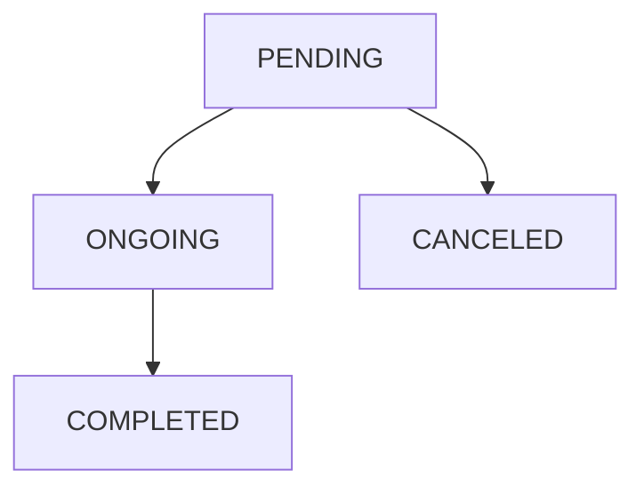

# Handling notifications

## What Is a Notification?

A Notification represents a request from a [Data Owner](/{{sdk}}/glossary#data-owner) to another to perform 
an operation.  
As for now, there are three types of Notifications:

* **KEY_PAIR_UPDATE**: when a Patient loses their private key and gets a new one, they can send this type of Notification to a Healthcare Professional to ask them to share their data with them again.
* **NEW_USER_OWN_DATA_ACCESS**: when a Patient logs in for the first time, they can send this type of Notification to a Healthcare Professional to aks for access to their own data.
* **OTHER**: all the other use cases.

### Status of a Notification

You can manage the lifecycle of a Notification by altering its status. Each Notification can have four possible states:

* **pending**: the Notification was created, and it is waiting to be managed.
* **ongoing**: the Notification was acknowledged, and the operations it prescribes are being managed.
* **completed**: the Notification was managed, and the operations it prescribes ended.
* **cancelled**: the Notification was cancelled without starting the operations it prescribes.



## Creating a Notification

:::note

To perform the following operations, we suppose you have at least a Patient and a Healthcare Professional in your database.

:::

In the following example, a Patient creates a Notification for a Healthcare Professional communicating that they have a new
 key and need access to their data.

<!-- file://code-samples/{{sdk}}/how-to/manage-notifications/index.mts snippet:create a notification as patient-->
```typescript
const accessNotification = await patientApi.notificationApi.createOrModifyNotification(
  new Notification({
    type: NotificationTypeEnum.KEY_PAIR_UPDATE,
  }),
  hcp.id,
)
```

<!-- output://code-samples/{{sdk}}/how-to/manage-notifications/accessNotification.txt -->
<details>
<summary>accessNotification</summary>

```json
{
  "id": "cba3bd9f-3646-4b2e-8a3d-619c5fc82346",
  "rev": "1-d7f44d9c45ce0901d9f388fc8e43bf15",
  "created": 1679926548780,
  "modified": 1679926548780,
  "author": "68a4f7d3-aa5d-43ff-95a1-ba14675397ca",
  "responsible": "3238dd4f-be09-4375-bb5b-0bf9d737ac94",
  "status": "pending",
  "identifiers": [],
  "properties": [],
  "type": "KEY_PAIR_UPDATE",
  "systemMetaData": {
    "secretForeignKeys": [],
    "cryptedForeignKeys": {},
    "delegations": {
      "3238dd4f-be09-4375-bb5b-0bf9d737ac94": {},
      "b16baab3-b6a3-42a0-b4b5-8dc8e00cc806": {}
    },
    "encryptionKeys": {
      "3238dd4f-be09-4375-bb5b-0bf9d737ac94": {},
      "b16baab3-b6a3-42a0-b4b5-8dc8e00cc806": {}
    }
  }
}
```
</details>

:::note

The default status of a Notification is `pending`

:::

## Retrieving a Notification

### Retrieving a Notification Using its Id

In the following example, a Patient creates a Notification for a Healthcare Professional and then retrieves it using its
 id.

<!-- file://code-samples/{{sdk}}/how-to/manage-notifications/index.mts snippet:creates a notification, then retrieves it-->
```typescript
const createdNotification = await patientApi.notificationApi.createOrModifyNotification(
  new Notification({
    type: NotificationTypeEnum.OTHER,
  }),
  hcp.id,
)

const retrievedNotification = await patientApi.notificationApi.getNotification(
  createdNotification.id,
)
```

<!-- output://code-samples/{{sdk}}/how-to/manage-notifications/createdNotification.txt -->
<details>
<summary>createdNotification</summary>

```json
{
  "id": "dec9c4fb-3d1a-4f55-96fc-a236004a1305",
  "rev": "1-3128f5cba37e4efae1ececf25f016229",
  "created": 1679926549010,
  "modified": 1679926549010,
  "author": "68a4f7d3-aa5d-43ff-95a1-ba14675397ca",
  "responsible": "3238dd4f-be09-4375-bb5b-0bf9d737ac94",
  "status": "pending",
  "identifiers": [],
  "properties": [],
  "type": "OTHER",
  "systemMetaData": {
    "secretForeignKeys": [],
    "cryptedForeignKeys": {},
    "delegations": {
      "3238dd4f-be09-4375-bb5b-0bf9d737ac94": {},
      "b16baab3-b6a3-42a0-b4b5-8dc8e00cc806": {}
    },
    "encryptionKeys": {
      "3238dd4f-be09-4375-bb5b-0bf9d737ac94": {},
      "b16baab3-b6a3-42a0-b4b5-8dc8e00cc806": {}
    }
  }
}
```
</details>

<!-- output://code-samples/{{sdk}}/how-to/manage-notifications/retrievedNotification.txt -->
<details>
<summary>retrievedNotification</summary>

```json
{
  "id": "dec9c4fb-3d1a-4f55-96fc-a236004a1305",
  "rev": "1-3128f5cba37e4efae1ececf25f016229",
  "created": 1679926549010,
  "modified": 1679926549010,
  "author": "68a4f7d3-aa5d-43ff-95a1-ba14675397ca",
  "responsible": "3238dd4f-be09-4375-bb5b-0bf9d737ac94",
  "status": "pending",
  "identifiers": [],
  "properties": [],
  "type": "OTHER",
  "systemMetaData": {
    "secretForeignKeys": [],
    "cryptedForeignKeys": {},
    "delegations": {
      "3238dd4f-be09-4375-bb5b-0bf9d737ac94": {},
      "b16baab3-b6a3-42a0-b4b5-8dc8e00cc806": {}
    },
    "encryptionKeys": {
      "3238dd4f-be09-4375-bb5b-0bf9d737ac94": {},
      "b16baab3-b6a3-42a0-b4b5-8dc8e00cc806": {}
    }
  }
}
```
</details>

### Retrieving Notifications Using Complex Criteria

If you want to retrieve a set of Notifications that satisfy complex criteria, you can use a Filter.  
In this example, a Healthcare Professional filters all their Notifications that were created after a certain date.

<!-- file://code-samples/{{sdk}}/how-to/manage-notifications/index.mts snippet:creates after date filter-->
```typescript
const startTimestamp = new Date(2022, 8, 27).getTime()

const afterDateFilter = await new NotificationFilter(api)
  .forDataOwner(user.healthcarePartyId)
  .afterDate(startTimestamp)
  .build()
```

<!-- output://code-samples/{{sdk}}/how-to/manage-notifications/afterDateFilter.txt -->
<details>
<summary>afterDateFilter</summary>

```json
{
  "healthcarePartyId": "b16baab3-b6a3-42a0-b4b5-8dc8e00cc806",
  "date": 1664229600000,
  "$type": "NotificationsAfterDateFilter"
}
```
</details>

:::note

You can learn more about filters in the how to

:::

After creating the filter, is it possible to use it to retrieve the Notifications.

<!-- file://code-samples/{{sdk}}/how-to/manage-notifications/index.mts snippet:gets the first page of results-->
```typescript
const notificationsFirstPage = await api.notificationApi.filterNotifications(
  afterDateFilter,
  undefined,
  10,
)
```

<!-- output://code-samples/{{sdk}}/how-to/manage-notifications/notificationsFirstPage.txt -->
<details>
<summary>notificationsFirstPage</summary>

```json
{
  "pageSize": 10,
  "totalSize": 0,
  "rows": [
    {
      "id": "dec9c4fb-3d1a-4f55-96fc-a236004a1305",
      "rev": "1-3128f5cba37e4efae1ececf25f016229",
      "created": 1679926549010,
      "modified": 1679926549010,
      "author": "68a4f7d3-aa5d-43ff-95a1-ba14675397ca",
      "responsible": "3238dd4f-be09-4375-bb5b-0bf9d737ac94",
      "status": "pending",
      "identifiers": [],
      "properties": [],
      "type": "OTHER",
      "systemMetaData": {
        "secretForeignKeys": [],
        "cryptedForeignKeys": {},
        "delegations": {
          "3238dd4f-be09-4375-bb5b-0bf9d737ac94": {},
          "b16baab3-b6a3-42a0-b4b5-8dc8e00cc806": {}
        },
        "encryptionKeys": {
          "3238dd4f-be09-4375-bb5b-0bf9d737ac94": {},
          "b16baab3-b6a3-42a0-b4b5-8dc8e00cc806": {}
        }
      }
    },
    {
      "id": "cba3bd9f-3646-4b2e-8a3d-619c5fc82346",
      "rev": "1-d7f44d9c45ce0901d9f388fc8e43bf15",
      "created": 1679926548780,
      "modified": 1679926548780,
      "author": "68a4f7d3-aa5d-43ff-95a1-ba14675397ca",
      "responsible": "3238dd4f-be09-4375-bb5b-0bf9d737ac94",
      "status": "pending",
      "identifiers": [],
      "properties": [],
      "type": "KEY_PAIR_UPDATE",
      "systemMetaData": {
        "secretForeignKeys": [],
        "cryptedForeignKeys": {},
        "delegations": {
          "3238dd4f-be09-4375-bb5b-0bf9d737ac94": {},
          "b16baab3-b6a3-42a0-b4b5-8dc8e00cc806": {}
        },
        "encryptionKeys": {
          "3238dd4f-be09-4375-bb5b-0bf9d737ac94": {},
          "b16baab3-b6a3-42a0-b4b5-8dc8e00cc806": {}
        }
      }
    },
    {
      "id": "28c2e0a0-fd9d-4121-b909-c36879e43f09",
      "rev": "3-92baadc118c0e7ece6b7cd32696c4f78",
      "created": 1679926517618,
      "modified": 1679926517618,
      "author": "6052c1fe-2de4-4a78-8a37-72397cc5110c",
      "responsible": "9388453b-8f65-488d-9ff8-ef1fb6be0ee0",
      "status": "completed",
      "identifiers": [],
      "properties": [],
      "type": "NEW_USER_OWN_DATA_ACCESS",
      "systemMetaData": {
        "secretForeignKeys": [],
        "cryptedForeignKeys": {},
        "delegations": {
          "9388453b-8f65-488d-9ff8-ef1fb6be0ee0": {},
          "b16baab3-b6a3-42a0-b4b5-8dc8e00cc806": {}
        },
        "encryptionKeys": {
          "9388453b-8f65-488d-9ff8-ef1fb6be0ee0": {},
          "b16baab3-b6a3-42a0-b4b5-8dc8e00cc806": {}
        }
      }
    },
    {
      "id": "ed1424ae-4dba-40ed-8be3-4e471639a0eb",
      "rev": "1-fd418cba7f4c5f2683bea13e4a46294e",
      "created": 1679926492019,
      "modified": 1679926492019,
      "author": "98b2638c-8050-45f9-b01a-34fea17d5ab7",
      "responsible": "7d3fb98a-6452-4c7f-8ae8-31d8cac6fcb8",
      "status": "pending",
      "identifiers": [],
      "properties": [
        {
          "id": "dataOwnerConcernedId",
          "type": {
            "type": "STRING"
          },
          "typedValue": {
            "stringValue": "7d3fb98a-6452-4c7f-8ae8-31d8cac6fcb8",
            "type": "STRING"
          }
        },
        {
          "id": "dataOwnerConcernedPubKey",
          "type": {
            "type": "STRING"
          },
          "typedValue": {
            "stringValue": "30820122300d06092a864886f70d01010105000382010f003082010a0282010100cf5629d52249b02ea52dad14fb4ba7c22e08a192235ca5c4cc974f190a7a742e203f9dcbd2af1bb7c86def838bce88d452440f1dd6b1b2de940cbd5276515814a4cabf61180466d279e86f03af35dd208a17246f3ddb57c9bc7c6f91044e8d6d072e7ee69547f10e557f9ca411106a875b6a878fe087438520c6da6bf31a0f54ffef4f26e21c0b9e09d6dfec5eb33e4a5c04db0467695022bc43157d88de116cc100639d92090bbe6bd20c1e7a06e03629e48044ae713bdf3c9b0d4294449a982be7bf43d29216eed3ab854628e819c22d1a65d46323378bed9c0747bbd1c8d969735d299bf734d5ef95146b9412f78f67526e23c8b0daf22e60dd51354ba6d50203010001",
            "type": "STRING"
          }
        }
      ],
      "type": "KEY_PAIR_UPDATE",
      "systemMetaData": {
        "secretForeignKeys": [],
        "cryptedForeignKeys": {},
        "delegations": {
          "7d3fb98a-6452-4c7f-8ae8-31d8cac6fcb8": {},
          "b16baab3-b6a3-42a0-b4b5-8dc8e00cc806": {}
        },
        "encryptionKeys": {
          "7d3fb98a-6452-4c7f-8ae8-31d8cac6fcb8": {},
          "b16baab3-b6a3-42a0-b4b5-8dc8e00cc806": {}
        }
      }
    },
    {
      "id": "08b629a0-486e-4746-9ee2-13b07a425223",
      "rev": "2-4d35c2d738e498f54302fb7850524020",
      "created": 1679926465677,
      "modified": 1679926465677,
      "author": "68a4f7d3-aa5d-43ff-95a1-ba14675397ca",
      "responsible": "3238dd4f-be09-4375-bb5b-0bf9d737ac94",
      "status": "completed",
      "identifiers": [],
      "properties": [],
      "type": "OTHER",
      "systemMetaData": {
        "secretForeignKeys": [],
        "cryptedForeignKeys": {},
        "delegations": {
          "3238dd4f-be09-4375-bb5b-0bf9d737ac94": {},
          "b16baab3-b6a3-42a0-b4b5-8dc8e00cc806": {}
        },
        "encryptionKeys": {
          "3238dd4f-be09-4375-bb5b-0bf9d737ac94": {},
          "b16baab3-b6a3-42a0-b4b5-8dc8e00cc806": {}
        }
      }
    },
    {
      "id": "c986a2e7-e16b-4e40-aaef-5c8f7368d392",
      "rev": "1-877bee2b7ea4d737e1474decfd8e61ff",
      "created": 1679926422559,
      "modified": 1679926422559,
      "author": "f5cbc6d5-87eb-4952-bbe8-e27937762b55",
      "responsible": "2e3d40a8-51b6-494f-921d-e806c5b83010",
      "status": "pending",
      "identifiers": [],
      "properties": [
        {
          "id": "dataOwnerConcernedId",
          "type": {
            "type": "STRING"
          },
          "typedValue": {
            "stringValue": "2e3d40a8-51b6-494f-921d-e806c5b83010",
            "type": "STRING"
          }
        },
        {
          "id": "dataOwnerConcernedPubKey",
          "type": {
            "type": "STRING"
          },
          "typedValue": {
            "stringValue": "30820122300d06092a864886f70d01010105000382010f003082010a0282010100a1b97a2317702a4f0627c4c47ff12ff9449c582eb8a1f82e13353eb4172ff778db4e99cc4f0d5f4de9ddee558172345b1c9259939336a76eec995d257c3fa48f23d3301c96129ed6a5cc3288004e72f5e1fdfd71b64f10631b608fcf800c6a5bc67b87f35d0c7a98042a78744c60d0acb797a0e6d6e589cdd13a0d33a234f0c61d8287437a4486be3e5f03d5d523dd6057c858622e49f995b7e097de087fbf4ffeff3295bbff889cd1477c30a2c4074a6a47e60525453fd28b8f38b3d3b2d78db3f1883d744557680b543d6a84d0e407c6d3b80511fd645bdc273ea3f0684f536d977ccbd43dbe314518ef7e932a971841afca1e3d98afa9fcfa6c0ef0ef773f0203010001",
            "type": "STRING"
          }
        }
      ],
      "type": "KEY_PAIR_UPDATE",
      "systemMetaData": {
        "secretForeignKeys": [],
        "cryptedForeignKeys": {},
        "delegations": {
          "2e3d40a8-51b6-494f-921d-e806c5b83010": {},
          "b16baab3-b6a3-42a0-b4b5-8dc8e00cc806": {}
        },
        "encryptionKeys": {
          "2e3d40a8-51b6-494f-921d-e806c5b83010": {},
          "b16baab3-b6a3-42a0-b4b5-8dc8e00cc806": {}
        }
      }
    },
    {
      "id": "9983a993-572a-481c-a8f7-459f384ffcfc",
      "rev": "2-7978d1cf1f471076a7f5bbe5cc31bcbc",
      "created": 1679926401674,
      "modified": 1679926401674,
      "author": "68a4f7d3-aa5d-43ff-95a1-ba14675397ca",
      "responsible": "3238dd4f-be09-4375-bb5b-0bf9d737ac94",
      "status": "completed",
      "identifiers": [],
      "properties": [],
      "type": "OTHER",
      "systemMetaData": {
        "secretForeignKeys": [],
        "cryptedForeignKeys": {},
        "delegations": {
          "3238dd4f-be09-4375-bb5b-0bf9d737ac94": {},
          "b16baab3-b6a3-42a0-b4b5-8dc8e00cc806": {}
        },
        "encryptionKeys": {
          "3238dd4f-be09-4375-bb5b-0bf9d737ac94": {},
          "b16baab3-b6a3-42a0-b4b5-8dc8e00cc806": {}
        }
      }
    },
    {
      "id": "ed9b44af-6f03-4b10-81d1-7b9c4c05dfcc",
      "rev": "2-e3ad859795ec85a51c356c4e1b405e7e",
      "created": 1679926272167,
      "modified": 1679926272167,
      "author": "68a4f7d3-aa5d-43ff-95a1-ba14675397ca",
      "responsible": "3238dd4f-be09-4375-bb5b-0bf9d737ac94",
      "status": "completed",
      "identifiers": [],
      "properties": [],
      "type": "OTHER",
      "systemMetaData": {
        "secretForeignKeys": [],
        "cryptedForeignKeys": {},
        "delegations": {
          "3238dd4f-be09-4375-bb5b-0bf9d737ac94": {},
          "b16baab3-b6a3-42a0-b4b5-8dc8e00cc806": {}
        },
        "encryptionKeys": {
          "3238dd4f-be09-4375-bb5b-0bf9d737ac94": {},
          "b16baab3-b6a3-42a0-b4b5-8dc8e00cc806": {}
        }
      }
    },
    {
      "id": "c0d9244b-0757-43b1-a7bb-3a95356bd4dc",
      "rev": "2-1239bb0fc65c29118a7aa4a622d1d976",
      "created": 1679926244786,
      "modified": 1679926244786,
      "author": "f7ec463c-44b4-414e-9e7f-f2cc0967cc01",
      "responsible": "b16baab3-b6a3-42a0-b4b5-8dc8e00cc806",
      "status": "ongoing",
      "identifiers": [],
      "properties": [],
      "type": "KEY_PAIR_UPDATE",
      "systemMetaData": {
        "secretForeignKeys": [],
        "cryptedForeignKeys": {},
        "delegations": {
          "b16baab3-b6a3-42a0-b4b5-8dc8e00cc806": {}
        },
        "encryptionKeys": {
          "b16baab3-b6a3-42a0-b4b5-8dc8e00cc806": {}
        }
      }
    },
    {
      "id": "ac24ab49-23bc-4ab3-bec1-e64f7aae0e46",
      "rev": "2-9eea552acb6d693ef7f3f25fa1bb1c24",
      "created": 1679926244660,
      "modified": 1679926244660,
      "author": "f7ec463c-44b4-414e-9e7f-f2cc0967cc01",
      "responsible": "b16baab3-b6a3-42a0-b4b5-8dc8e00cc806",
      "status": "ongoing",
      "identifiers": [],
      "properties": [],
      "type": "KEY_PAIR_UPDATE",
      "systemMetaData": {
        "secretForeignKeys": [],
        "cryptedForeignKeys": {},
        "delegations": {
          "b16baab3-b6a3-42a0-b4b5-8dc8e00cc806": {}
        },
        "encryptionKeys": {
          "b16baab3-b6a3-42a0-b4b5-8dc8e00cc806": {}
        }
      }
    }
  ],
  "nextKeyPair": {
    "startKey": "867f2933-aeab-4c72-86d0-19d210d9b970",
    "startKeyDocId": "867f2933-aeab-4c72-86d0-19d210d9b970"
  }
}
```
</details>


The `filter` method returns a PaginatedList, which contains up to `limit` Notifications in the `rows` field, as specified by the method parameter (1000 by default).
If  the PaginatedList has a non-null field `startKeyDocId` there are more notifications which can be retrieved with this filter: you can use this value to retrieve (part of) the remaining notifications.

<!-- file://code-samples/{{sdk}}/how-to/manage-notifications/index.mts snippet:gets the second page of results-->
```typescript
const notificationsSecondPage = await api.notificationApi.filterNotifications(
  afterDateFilter,
  notificationsFirstPage.nextKeyPair.startKeyDocId,
  10,
)
```

<!-- output://code-samples/{{sdk}}/how-to/manage-notifications/notificationsSecondPage.txt -->
<details>
<summary>notificationsSecondPage</summary>

```json
{
  "pageSize": 10,
  "totalSize": 0,
  "rows": [
    {
      "id": "867f2933-aeab-4c72-86d0-19d210d9b970",
      "rev": "1-5958f8cd45dbdb67c970cc7313fe47eb",
      "created": 1679926244077,
      "modified": 1679926244077,
      "author": "68a4f7d3-aa5d-43ff-95a1-ba14675397ca",
      "responsible": "3238dd4f-be09-4375-bb5b-0bf9d737ac94",
      "status": "pending",
      "identifiers": [],
      "properties": [],
      "type": "OTHER",
      "systemMetaData": {
        "secretForeignKeys": [],
        "cryptedForeignKeys": {},
        "delegations": {
          "3238dd4f-be09-4375-bb5b-0bf9d737ac94": {},
          "b16baab3-b6a3-42a0-b4b5-8dc8e00cc806": {}
        },
        "encryptionKeys": {
          "3238dd4f-be09-4375-bb5b-0bf9d737ac94": {},
          "b16baab3-b6a3-42a0-b4b5-8dc8e00cc806": {}
        }
      }
    },
    {
      "id": "5d5f2fd8-aaff-4d71-b79e-02a4d5888492",
      "rev": "1-bf438a9801196eb31ca5bf66abd39c48",
      "created": 1679926244033,
      "modified": 1679926244033,
      "author": "68a4f7d3-aa5d-43ff-95a1-ba14675397ca",
      "responsible": "3238dd4f-be09-4375-bb5b-0bf9d737ac94",
      "status": "pending",
      "identifiers": [],
      "properties": [],
      "type": "KEY_PAIR_UPDATE",
      "systemMetaData": {
        "secretForeignKeys": [],
        "cryptedForeignKeys": {},
        "delegations": {
          "3238dd4f-be09-4375-bb5b-0bf9d737ac94": {},
          "b16baab3-b6a3-42a0-b4b5-8dc8e00cc806": {}
        },
        "encryptionKeys": {
          "3238dd4f-be09-4375-bb5b-0bf9d737ac94": {},
          "b16baab3-b6a3-42a0-b4b5-8dc8e00cc806": {}
        }
      }
    },
    {
      "id": "d54db3c1-4690-4b48-9495-dff0f04a050a",
      "rev": "3-f3bfd10e91d9e644beacb04fdb3767c6",
      "created": 1679926225876,
      "modified": 1679926225876,
      "author": "77ec1ac5-9d52-420a-9231-77516214ef56",
      "responsible": "c9c02fa0-fcfa-4078-ba3b-335ff9686419",
      "status": "completed",
      "identifiers": [],
      "properties": [],
      "type": "NEW_USER_OWN_DATA_ACCESS",
      "systemMetaData": {
        "secretForeignKeys": [],
        "cryptedForeignKeys": {},
        "delegations": {
          "c9c02fa0-fcfa-4078-ba3b-335ff9686419": {},
          "b16baab3-b6a3-42a0-b4b5-8dc8e00cc806": {}
        },
        "encryptionKeys": {
          "c9c02fa0-fcfa-4078-ba3b-335ff9686419": {},
          "b16baab3-b6a3-42a0-b4b5-8dc8e00cc806": {}
        }
      }
    },
    {
      "id": "8f700fa1-73af-4093-87d5-d72106f03994",
      "rev": "1-33120822e52442b4fae2685f742bd12f",
      "created": 1679926209011,
      "modified": 1679926209011,
      "author": "6028a43d-c3a9-4071-9634-915c2a578269",
      "responsible": "e47e6e2f-1e4b-461d-9b92-a3914b4ad7c4",
      "status": "pending",
      "identifiers": [],
      "properties": [
        {
          "id": "dataOwnerConcernedId",
          "type": {
            "type": "STRING"
          },
          "typedValue": {
            "stringValue": "e47e6e2f-1e4b-461d-9b92-a3914b4ad7c4",
            "type": "STRING"
          }
        },
        {
          "id": "dataOwnerConcernedPubKey",
          "type": {
            "type": "STRING"
          },
          "typedValue": {
            "stringValue": "30820122300d06092a864886f70d01010105000382010f003082010a0282010100c0a6df018127ddf91b83f27e950f726cce97e7d70bbe751898ae52da9844c9a0d3b96db621389c41fe2344e4dd96a02f1b647937be61eefdf00ab48c8876e258b15606d63b904f0a67e35442f438d568a55471607a76b3933aeb5904233563673252d3791edcb603bb945df4cc0a1e7e4ddbad0d516ac4de631810fcbbb886ad1181b38e0d11a274e743cbffa761bfd7ae229268a7976f26f7eb4e22f9723dbe5d6df3a25f7af9b351243fd1a7e4a1546eca8e392f14f63563436d67558ab6ee3453f101d7e6a9725b9be42d3271486c61d466ff78b2831b262127073f9376656843de17092ed061dc8537104c604c14f6d350b9e9980ce887e0cbc490d2d6930203010001",
            "type": "STRING"
          }
        }
      ],
      "type": "KEY_PAIR_UPDATE",
      "systemMetaData": {
        "secretForeignKeys": [],
        "cryptedForeignKeys": {},
        "delegations": {
          "e47e6e2f-1e4b-461d-9b92-a3914b4ad7c4": {},
          "b16baab3-b6a3-42a0-b4b5-8dc8e00cc806": {}
        },
        "encryptionKeys": {
          "e47e6e2f-1e4b-461d-9b92-a3914b4ad7c4": {},
          "b16baab3-b6a3-42a0-b4b5-8dc8e00cc806": {}
        }
      }
    },
    {
      "id": "7d0834e9-f15e-45c5-aa77-92b5403ce19d",
      "rev": "1-8ed36847313f4e1be23d2e98f4b90f46",
      "created": 1679925877018,
      "modified": 1679925877018,
      "author": "40d44232-c0a3-4fca-b842-9598767fddf8",
      "responsible": "486a6b23-2fb8-4815-b81d-dd3b5040ce12",
      "status": "pending",
      "identifiers": [],
      "properties": [
        {
          "id": "dataOwnerConcernedId",
          "type": {
            "type": "STRING"
          },
          "typedValue": {
            "stringValue": "486a6b23-2fb8-4815-b81d-dd3b5040ce12",
            "type": "STRING"
          }
        },
        {
          "id": "dataOwnerConcernedPubKey",
          "type": {
            "type": "STRING"
          },
          "typedValue": {
            "stringValue": "30820122300d06092a864886f70d01010105000382010f003082010a0282010100bdece43e8320d67a4a99afa3b229acb4904d658206a06f33bd647db4339ce9f505301a2370c42944e7ac45b6b54bf6245d5fde39a1e46329884dcc3fcbfaddc0009e668f63a7906ebee58bb1ede39f3b6a97166a7fd36756949d98297c97acfada5ee3e0e237c305e1808339ee11712b7729ed1a73335b645362b29faf2d68a2c1dda7575bfc0a7f0d990627b98e9c36a644b3621a81155947c99657ec7936c3fa2420142c613f7fa7e2760dd1ce795c3b99cef8bb6129a45a7ac808ee575c947dbcc7197ef68f4385a51ac246bb372f97ac1230eff1a77d0555f25df7e940af77d8807e2f3a3fcdbee5dc4cdd898e4caa503ffd107c3eeec92c8f0506bc012d0203010001",
            "type": "STRING"
          }
        }
      ],
      "type": "KEY_PAIR_UPDATE",
      "systemMetaData": {
        "secretForeignKeys": [],
        "cryptedForeignKeys": {},
        "delegations": {
          "486a6b23-2fb8-4815-b81d-dd3b5040ce12": {},
          "b16baab3-b6a3-42a0-b4b5-8dc8e00cc806": {}
        },
        "encryptionKeys": {
          "486a6b23-2fb8-4815-b81d-dd3b5040ce12": {},
          "b16baab3-b6a3-42a0-b4b5-8dc8e00cc806": {}
        }
      }
    },
    {
      "id": "7c132851-1577-4b02-807d-f698b68c0b5a",
      "rev": "2-cdc5749d7248f8cfbb33954006ffae6c",
      "created": 1679925850757,
      "modified": 1679925850757,
      "author": "f7ec463c-44b4-414e-9e7f-f2cc0967cc01",
      "responsible": "b16baab3-b6a3-42a0-b4b5-8dc8e00cc806",
      "status": "ongoing",
      "identifiers": [],
      "properties": [],
      "type": "KEY_PAIR_UPDATE",
      "systemMetaData": {
        "secretForeignKeys": [],
        "cryptedForeignKeys": {},
        "delegations": {
          "b16baab3-b6a3-42a0-b4b5-8dc8e00cc806": {}
        },
        "encryptionKeys": {
          "b16baab3-b6a3-42a0-b4b5-8dc8e00cc806": {}
        }
      }
    },
    {
      "id": "ce2c39fc-97d7-4c1d-b279-faa1b60c955f",
      "rev": "2-4565a885aa35eda233125dc47433eff5",
      "created": 1679925850616,
      "modified": 1679925850616,
      "author": "f7ec463c-44b4-414e-9e7f-f2cc0967cc01",
      "responsible": "b16baab3-b6a3-42a0-b4b5-8dc8e00cc806",
      "status": "ongoing",
      "identifiers": [],
      "properties": [],
      "type": "KEY_PAIR_UPDATE",
      "systemMetaData": {
        "secretForeignKeys": [],
        "cryptedForeignKeys": {},
        "delegations": {
          "b16baab3-b6a3-42a0-b4b5-8dc8e00cc806": {}
        },
        "encryptionKeys": {
          "b16baab3-b6a3-42a0-b4b5-8dc8e00cc806": {}
        }
      }
    },
    {
      "id": "a65d7657-3391-431b-9872-941cc3c7d489",
      "rev": "1-bfde6894ac0c0cb56e75927a1c523fd2",
      "created": 1679925849955,
      "modified": 1679925849955,
      "author": "68a4f7d3-aa5d-43ff-95a1-ba14675397ca",
      "responsible": "3238dd4f-be09-4375-bb5b-0bf9d737ac94",
      "status": "pending",
      "identifiers": [],
      "properties": [],
      "type": "OTHER",
      "systemMetaData": {
        "secretForeignKeys": [],
        "cryptedForeignKeys": {},
        "delegations": {
          "3238dd4f-be09-4375-bb5b-0bf9d737ac94": {},
          "b16baab3-b6a3-42a0-b4b5-8dc8e00cc806": {}
        },
        "encryptionKeys": {
          "3238dd4f-be09-4375-bb5b-0bf9d737ac94": {},
          "b16baab3-b6a3-42a0-b4b5-8dc8e00cc806": {}
        }
      }
    },
    {
      "id": "cdbb5396-0516-49a4-94db-824b3aee7c07",
      "rev": "1-d7673f8ed6aad926f20811227cc554c6",
      "created": 1679925849882,
      "modified": 1679925849882,
      "author": "68a4f7d3-aa5d-43ff-95a1-ba14675397ca",
      "responsible": "3238dd4f-be09-4375-bb5b-0bf9d737ac94",
      "status": "pending",
      "identifiers": [],
      "properties": [],
      "type": "KEY_PAIR_UPDATE",
      "systemMetaData": {
        "secretForeignKeys": [],
        "cryptedForeignKeys": {},
        "delegations": {
          "3238dd4f-be09-4375-bb5b-0bf9d737ac94": {},
          "b16baab3-b6a3-42a0-b4b5-8dc8e00cc806": {}
        },
        "encryptionKeys": {
          "3238dd4f-be09-4375-bb5b-0bf9d737ac94": {},
          "b16baab3-b6a3-42a0-b4b5-8dc8e00cc806": {}
        }
      }
    },
    {
      "id": "db048194-153b-4083-9c24-f607e3edb850",
      "rev": "3-ae8190bab92cfbae9b198cbe082604dc",
      "created": 1679925830612,
      "modified": 1679925830612,
      "author": "fc9261ad-c985-4eac-b36a-35331c92239a",
      "responsible": "ac933532-b26b-4a19-b6e9-ead6b3043e6e",
      "status": "completed",
      "identifiers": [],
      "properties": [],
      "type": "NEW_USER_OWN_DATA_ACCESS",
      "systemMetaData": {
        "secretForeignKeys": [],
        "cryptedForeignKeys": {},
        "delegations": {
          "ac933532-b26b-4a19-b6e9-ead6b3043e6e": {},
          "b16baab3-b6a3-42a0-b4b5-8dc8e00cc806": {}
        },
        "encryptionKeys": {
          "ac933532-b26b-4a19-b6e9-ead6b3043e6e": {},
          "b16baab3-b6a3-42a0-b4b5-8dc8e00cc806": {}
        }
      }
    }
  ],
  "nextKeyPair": {
    "startKey": "4730dcfc-b5c1-4858-b6a2-9d28a27b8b06",
    "startKeyDocId": "4730dcfc-b5c1-4858-b6a2-9d28a27b8b06"
  }
}
```
</details>


### Retrieving all the Pending Notifications

A Healthcare Professional can also retrieve all the Notifications assigned to him that have a `pending` status.

<!-- file://code-samples/{{sdk}}/how-to/manage-notifications/index.mts snippet:gets the pending notifications-->
```typescript
const pendingNotifications = await api.notificationApi.getPendingNotificationsAfter()
```

<!-- output://code-samples/{{sdk}}/how-to/manage-notifications/pendingNotifications.txt -->
<details>
<summary>pendingNotifications</summary>

```text
[
  {
    "id": "dec9c4fb-3d1a-4f55-96fc-a236004a1305",
    "rev": "1-3128f5cba37e4efae1ececf25f016229",
    "created": 1679926549010,
    "modified": 1679926549010,
    "author": "68a4f7d3-aa5d-43ff-95a1-ba14675397ca",
    "responsible": "3238dd4f-be09-4375-bb5b-0bf9d737ac94",
    "status": "pending",
    "identifiers": [],
    "properties": [],
    "type": "OTHER",
    "systemMetaData": {
      "secretForeignKeys": [],
      "cryptedForeignKeys": {},
      "delegations": {
        "3238dd4f-be09-4375-bb5b-0bf9d737ac94": {},
        "b16baab3-b6a3-42a0-b4b5-8dc8e00cc806": {}
      },
      "encryptionKeys": {
        "3238dd4f-be09-4375-bb5b-0bf9d737ac94": {},
        "b16baab3-b6a3-42a0-b4b5-8dc8e00cc806": {}
      }
    }
  },
  {
    "id": "cba3bd9f-3646-4b2e-8a3d-619c5fc82346",
    "rev": "1-d7f44d9c45ce0901d9f388fc8e43bf15",
    "created": 1679926548780,
    "modified": 1679926548780,
    "author": "68a4f7d3-aa5d-43ff-95a1-ba14675397ca",
    "responsible": "3238dd4f-be09-4375-bb5b-0bf9d737ac94",
    "status": "pending",
    "identifiers": [],
    "properties": [],
    "type": "KEY_PAIR_UPDATE",
    "systemMetaData": {
      "secretForeignKeys": [],
      "cryptedForeignKeys": {},
      "delegations": {
        "3238dd4f-be09-4375-bb5b-0bf9d737ac94": {},
        "b16baab3-b6a3-42a0-b4b5-8dc8e00cc806": {}
      },
      "encryptionKeys": {
        "3238dd4f-be09-4375-bb5b-0bf9d737ac94": {},
        "b16baab3-b6a3-42a0-b4b5-8dc8e00cc806": {}
      }
    }
  },
  {
    "id": "ed1424ae-4dba-40ed-8be3-4e471639a0eb",
    "rev": "1-fd418cba7f4c5f2683bea13e4a46294e",
    "created": 1679926492019,
    "modified": 1679926492019,
    "author": "98b2638c-8050-45f9-b01a-34fea17d5ab7",
    "responsible": "7d3fb98a-6452-4c7f-8ae8-31d8cac6fcb8",
    "status": "pending",
    "identifiers": [],
    "properties": [
      {
        "id": "dataOwnerConcernedId",
        "type": {
          "type": "STRING"
        },
        "typedValue": {
          "stringValue": "7d3fb98a-6452-4c7f-8ae8-31d8cac6fcb8",
          "type": "STRING"
        }
      },
      {
        "id": "dataOwnerConcernedPubKey",
        "type": {
          "type": "STRING"
        },
        "typedValue": {
          "stringValue": "30820122300d06092a864886f70d01010105000382010f003082010a0282010100cf5629d52249b02ea52dad14fb4ba7c22e08a192235ca5c4cc974f190a7a742e203f9dcbd2af1bb7c86def838bce88d452440f1dd6b1b2de940cbd5276515814a4cabf61180466d279e86f03af35dd208a17246f3ddb57c9bc7c6f91044e8d6d072e7ee69547f10e557f9ca411106a875b6a878fe087438520c6da6bf31a0f54ffef4f26e21c0b9e09d6dfec5eb33e4a5c04db0467695022bc43157d88de116cc100639d92090bbe6bd20c1e7a06e03629e48044ae713bdf3c9b0d4294449a982be7bf43d29216eed3ab854628e819c22d1a65d46323378bed9c0747bbd1c8d969735d299bf734d5ef95146b9412f78f67526e23c8b0daf22e60dd51354ba6d50203010001",
          "type": "STRING"
        }
      }
    ],
    "type": "KEY_PAIR_UPDATE",
    "systemMetaData": {
      "secretForeignKeys": [],
      "cryptedForeignKeys": {},
      "delegations": {
        "7d3fb98a-6452-4c7f-8ae8-31d8cac6fcb8": {},
        "b16baab3-b6a3-42a0-b4b5-8dc8e00cc806": {}
      },
      "encryptionKeys": {
        "7d3fb98a-6452-4c7f-8ae8-31d8cac6fcb8": {},
        "b16baab3-b6a3-42a0-b4b5-8dc8e00cc806": {}
      }
    }
  },
  {
    "id": "c986a2e7-e16b-4e40-aaef-5c8f7368d392",
    "rev": "1-877bee2b7ea4d737e1474decfd8e61ff",
    "created": 1679926422559,
    "modified": 1679926422559,
    "author": "f5cbc6d5-87eb-4952-bbe8-e27937762b55",
    "responsible": "2e3d40a8-51b6-494f-921d-e806c5b83010",
    "status": "pending",
    "identifiers": [],
    "properties": [
      {
        "id": "dataOwnerConcernedId",
        "type": {
          "type": "STRING"
        },
        "typedValue": {
          "stringValue": "2e3d40a8-51b6-494f-921d-e806c5b83010",
          "type": "STRING"
        }
      },
      {
        "id": "dataOwnerConcernedPubKey",
        "type": {
          "type": "STRING"
        },
        "typedValue": {
          "stringValue": "30820122300d06092a864886f70d01010105000382010f003082010a0282010100a1b97a2317702a4f0627c4c47ff12ff9449c582eb8a1f82e13353eb4172ff778db4e99cc4f0d5f4de9ddee558172345b1c9259939336a76eec995d257c3fa48f23d3301c96129ed6a5cc3288004e72f5e1fdfd71b64f10631b608fcf800c6a5bc67b87f35d0c7a98042a78744c60d0acb797a0e6d6e589cdd13a0d33a234f0c61d8287437a4486be3e5f03d5d523dd6057c858622e49f995b7e097de087fbf4ffeff3295bbff889cd1477c30a2c4074a6a47e60525453fd28b8f38b3d3b2d78db3f1883d744557680b543d6a84d0e407c6d3b80511fd645bdc273ea3f0684f536d977ccbd43dbe314518ef7e932a971841afca1e3d98afa9fcfa6c0ef0ef773f0203010001",
          "type": "STRING"
        }
      }
    ],
    "type": "KEY_PAIR_UPDATE",
    "systemMetaData": {
      "secretForeignKeys": [],
      "cryptedForeignKeys": {},
      "delegations": {
        "2e3d40a8-51b6-494f-921d-e806c5b83010": {},
        "b16baab3-b6a3-42a0-b4b5-8dc8e00cc806": {}
      },
      "encryptionKeys": {
        "2e3d40a8-51b6-494f-921d-e806c5b83010": {},
        "b16baab3-b6a3-42a0-b4b5-8dc8e00cc806": {}
      }
    }
  },
  {
    "id": "867f2933-aeab-4c72-86d0-19d210d9b970",
    "rev": "1-5958f8cd45dbdb67c970cc7313fe47eb",
    "created": 1679926244077,
    "modified": 1679926244077,
    "author": "68a4f7d3-aa5d-43ff-95a1-ba14675397ca",
    "responsible": "3238dd4f-be09-4375-bb5b-0bf9d737ac94",
    "status": "pending",
    "identifiers": [],
    "properties": [],
    "type": "OTHER",
    "systemMetaData": {
      "secretForeignKeys": [],
      "cryptedForeignKeys": {},
      "delegations": {
        "3238dd4f-be09-4375-bb5b-0bf9d737ac94": {},
        "b16baab3-b6a3-42a0-b4b5-8dc8e00cc806": {}
      },
      "encryptionKeys": {
        "3238dd4f-be09-4375-bb5b-0bf9d737ac94": {},
        "b16baab3-b6a3-42a0-b4b5-8dc8e00cc806": {}
      }
    }
  },
  {
    "id": "5d5f2fd8-aaff-4d71-b79e-02a4d5888492",
    "rev": "1-bf438a9801196eb31ca5bf66abd39c48",
    "created": 1679926244033,
    "modified": 1679926244033,
    "author": "68a4f7d3-aa5d-43ff-95a1-ba14675397ca",
    "responsible": "3238dd4f-be09-4375-bb5b-0bf9d737ac94",
    "status": "pending",
    "identifiers": [],
    "properties": [],
    "type": "KEY_PAIR_UPDATE",
    "systemMetaData": {
      "secretForeignKeys": [],
      "cryptedForeignKeys": {},
      "delegations": {
        "3238dd4f-be09-4375-bb5b-0bf9d737ac94": {},
        "b16baab3-b6a3-42a0-b4b5-8dc8e00cc806": {}
      },
      "encryptionKeys": {
        "3238dd4f-be09-4375-bb5b-0bf9d737ac94": {},
        "b16baab3-b6a3-42a0-b4b5-8dc8e00cc806": {}
      }
    }
  },
  {
    "id": "8f700fa1-73af-4093-87d5-d72106f03994",
    "rev": "1-33120822e52442b4fae2685f742bd12f",
    "created": 1679926209011,
    "modified": 1679926209011,
    "author": "6028a43d-c3a9-4071-9634-915c2a578269",
    "responsible": "e47e6e2f-1e4b-461d-9b92-a3914b4ad7c4",
    "status": "pending",
    "identifiers": [],
    "properties": [
      {
        "id": "dataOwnerConcernedId",
        "type": {
          "type": "STRING"
        },
        "typedValue": {
          "stringValue": "e47e6e2f-1e4b-461d-9b92-a3914b4ad7c4",
          "type": "STRING"
        }
      },
      {
        "id": "dataOwnerConcernedPubKey",
        "type": {
          "type": "STRING"
        },
        "typedValue": {
          "stringValue": "30820122300d06092a864886f70d01010105000382010f003082010a0282010100c0a6df018127ddf91b83f27e950f726cce97e7d70bbe751898ae52da9844c9a0d3b96db621389c41fe2344e4dd96a02f1b647937be61eefdf00ab48c8876e258b15606d63b904f0a67e35442f438d568a55471607a76b3933aeb5904233563673252d3791edcb603bb945df4cc0a1e7e4ddbad0d516ac4de631810fcbbb886ad1181b38e0d11a274e743cbffa761bfd7ae229268a7976f26f7eb4e22f9723dbe5d6df3a25f7af9b351243fd1a7e4a1546eca8e392f14f63563436d67558ab6ee3453f101d7e6a9725b9be42d3271486c61d466ff78b2831b262127073f9376656843de17092ed061dc8537104c604c14f6d350b9e9980ce887e0cbc490d2d6930203010001",
          "type": "STRING"
        }
      }
    ],
    "type": "KEY_PAIR_UPDATE",
    "systemMetaData": {
      "secretForeignKeys": [],
      "cryptedForeignKeys": {},
      "delegations": {
        "e47e6e2f-1e4b-461d-9b92-a3914b4ad7c4": {},
        "b16baab3-b6a3-42a0-b4b5-8dc8e00cc806": {}
      },
      "encryptionKeys": {
        "e47e6e2f-1e4b-461d-9b92-a3914b4ad7c4": {},
        "b16baab3-b6a3-42a0-b4b5-8dc8e00cc806": {}
      }
    }
  },
  {
    "id": "7d0834e9-f15e-45c5-aa77-92b5403ce19d",
    "rev": "1-8ed36847313f4e1be23d2e98f4b90f46",
    "created": 1679925877018,
    "modified": 1679925877018,
    "author": "40d44232-c0a3-4fca-b842-9598767fddf8",
    "responsible": "486a6b23-2fb8-4815-b81d-dd3b5040ce12",
    "status": "pending",
    "identifiers": [],
    "properties": [
      {
        "id": "dataOwnerConcernedId",
        "type": {
          "type": "STRING"
        },
        "typedValue": {
          "stringValue": "486a6b23-2fb8-4815-b81d-dd3b5040ce12",
          "type": "STRING"
        }
      },
      {
        "id": "dataOwnerConcernedPubKey",
        "type": {
          "type": "STRING"
        },
        "typedValue": {
          "stringValue": "30820122300d06092a864886f70d01010105000382010f003082010a0282010100bdece43e8320d67a4a99afa3b229acb4904d658206a06f33bd647db4339ce9f505301a2370c42944e7ac45b6b54bf6245d5fde39a1e46329884dcc3fcbfaddc0009e668f63a7906ebee58bb1ede39f3b6a97166a7fd36756949d98297c97acfada5ee3e0e237c305e1808339ee11712b7729ed1a73335b645362b29faf2d68a2c1dda7575bfc0a7f0d990627b98e9c36a644b3621a81155947c99657ec7936c3fa2420142c613f7fa7e2760dd1ce795c3b99cef8bb6129a45a7ac808ee575c947dbcc7197ef68f4385a51ac246bb372f97ac1230eff1a77d0555f25df7e940af77d8807e2f3a3fcdbee5dc4cdd898e4caa503ffd107c3eeec92c8f0506bc012d0203010001",
          "type": "STRING"
        }
      }
    ],
    "type": "KEY_PAIR_UPDATE",
    "systemMetaData": {
      "secretForeignKeys": [],
      "cryptedForeignKeys": {},
      "delegations": {
        "486a6b23-2fb8-4815-b81d-dd3b5040ce12": {},
        "b16baab3-b6a3-42a0-b4b5-8dc8e00cc806": {}
      },
      "encryptionKeys": {
        "486a6b23-2fb8-4815-b81d-dd3b5040ce12": {},
        "b16baab3-b6a3-42a0-b4b5-8dc8e00cc806": {}
      }
    }
  },
  {
    "id": "a65d7657-3391-431b-9872-941cc3c7d489",
    "rev": "1-bfde6894ac0c0cb56e75927a1c523fd2",
    "created": 1679925849955,
    "modified": 1679925849955,
    "author": "68a4f7d3-aa5d-43ff-95a1-ba14675397ca",
    "responsible": "3238dd4f-be09-4375-bb5b-0bf9d737ac94",
    "status": "pending",
    "identifiers": [],
    "properties": [],
    "type": "OTHER",
    "systemMetaData": {
      "secretForeignKeys": [],
      "cryptedForeignKeys": {},
      "delegations": {
        "3238dd4f-be09-4375-bb5b-0bf9d737ac94": {},
        "b16baab3-b6a3-42a0-b4b5-8dc8e00cc806": {}
      },
      "encryptionKeys": {
        "3238dd4f-be09-4375-bb5b-0bf9d737ac94": {},
        "b16baab3-b6a3-42a0-b4b5-8dc8e00cc806": {}
      }
    }
  },
  {
    "id": "cdbb5396-0516-49a4-94db-824b3aee7c07",
    "rev": "1-d7673f8ed6aad926f20811227cc554c6",
    "created": 1679925849882,
    "modified": 1679925849882,
    "author": "68a4f7d3-aa5d-43ff-95a1-ba14675397ca",
    "responsible": "3238dd4f-be09-4375-bb5b-0bf9d737ac94",
    "status": "pending",
    "identifiers": [],
    "properties": [],
    "type": "KEY_PAIR_UPDATE",
    "systemMetaData": {
      "secretForeignKeys": [],
      "cryptedForeignKeys": {},
      "delegations": {
        "3238dd4f-be09-4375-bb5b-0bf9d737ac94": {},
        "b16baab3-b6a3-42a0-b4b5-8dc8e00cc806": {}
      },
      "encryptionKeys": {
        "3238dd4f-be09-4375-bb5b-0bf9d737ac94": {},
        "b16baab3-b6a3-42a0-b4b5-8dc8e00cc806": {}
      }
    }
  },
  {
    "id": "e1de0bdb-210c-4714-ace2-f754a9d710ae",
    "rev": "1-5e25b2aa812122e2c68185dbff9d7ce6",
    "created": 1679924658464,
    "modified": 1679924658464,
    "author": "68a4f7d3-aa5d-43ff-95a1-ba14675397ca",
    "responsible": "3238dd4f-be09-4375-bb5b-0bf9d737ac94",
    "status": "pending",
    "identifiers": [],
    "properties": [],
    "type": "OTHER",
    "systemMetaData": {
      "secretForeignKeys": [],
      "cryptedForeignKeys": {},
      "delegations": {
        "3238dd4f-be09-4375-bb5b-0bf9d737ac94": {},
        "b16baab3-b6a3-42a0-b4b5-8dc8e00cc806": {}
      },
      "encryptionKeys": {
        "3238dd4f-be09-4375-bb5b-0bf9d737ac94": {},
        "b16baab3-b6a3-42a0-b4b5-8dc8e00cc806": {}
      }
    }
  },
  {
    "id": "aad67930-5775-45be-8300-b5ebf937e93e",
    "rev": "1-a049adaf835260347bc587c523dd7f63",
    "created": 1679924658418,
    "modified": 1679924658418,
    "author": "68a4f7d3-aa5d-43ff-95a1-ba14675397ca",
    "responsible": "3238dd4f-be09-4375-bb5b-0bf9d737ac94",
    "status": "pending",
    "identifiers": [],
    "properties": [],
    "type": "KEY_PAIR_UPDATE",
    "systemMetaData": {
      "secretForeignKeys": [],
      "cryptedForeignKeys": {},
      "delegations": {
        "3238dd4f-be09-4375-bb5b-0bf9d737ac94": {},
        "b16baab3-b6a3-42a0-b4b5-8dc8e00cc806": {}
      },
      "encryptionKeys": {
        "3238dd4f-be09-4375-bb5b-0bf9d737ac94": {},
        "b16baab3-b6a3-42a0-b4b5-8dc8e00cc806": {}
      }
    }
  },
  {
    "id": "cfd0f293-a834-45ac-844d-09f675ef2269",
    "rev": "1-12de2909149bbeb4cf9a34e10e01fef8",
    "created": 1679924615711,
    "modified": 1679924615711,
    "author": "2b20e061-f5a7-48af-890a-a82ac0000690",
    "responsible": "b4efa501-14ad-4ce4-b988-cd05fe261cd4",
    "status": "pending",
    "identifiers": [],
    "properties": [
      {
        "id": "dataOwnerConcernedId",
        "type": {
          "type": "STRING"
        },
        "typedValue": {
          "stringValue": "b4efa501-14ad-4ce4-b988-cd05fe261cd4",
          "type": "STRING"
        }
      },
      {
        "id": "dataOwnerConcernedPubKey",
        "type": {
          "type": "STRING"
        },
        "typedValue": {
          "stringValue": "30820122300d06092a864886f70d01010105000382010f003082010a0282010100a7c9f5fe8abdab47f5b63a248b800ddbae5127d6dae189a41ac43d31a302f730c19c0da1cad6040e2ae11a6b4c18b6334149725121871b174a1795898dbd2147b2fa8f7b26eb6d2b6711a1c8e4e09bf68d8809b5eba12fee48643a5706255c9bd53ad5b3877ee3f48914d1d161a7c900a830e6d6cc07cbc596f0cb0c29ed2961a510d88651ed2b767007f54273a475fbdc65d771353d5dd6d925d619fecb902b7483920b92577fcd0896fecb2194476ec71c17fa0054c81b7d645de205e8b42618994e1d02431916d0504144265f0f9781c2e1d2c67f3730f8592ff1cacfdc85998bcf277c8487c7d4e7df3597fac581e49c6f36286c72fec29fdcfdfad48c4f0203010001",
          "type": "STRING"
        }
      }
    ],
    "type": "KEY_PAIR_UPDATE",
    "systemMetaData": {
      "secretForeignKeys": [],
      "cryptedForeignKeys": {},
      "delegations": {
        "b4efa501-14ad-4ce4-b988-cd05fe261cd4": {},
        "b16baab3-b6a3-42a0-b4b5-8dc8e00cc806": {}
      },
      "encryptionKeys": {
        "b4efa501-14ad-4ce4-b988-cd05fe261cd4": {},
        "b16baab3-b6a3-42a0-b4b5-8dc8e00cc806": {}
      }
    }
  },
  {
    "id": "f39ecbc2-08fd-43a8-b9fe-44815661bef1",
    "rev": "1-04738d5e98c1c2f7c3de713e2a778351",
    "created": 1679924397742,
    "modified": 1679924397742,
    "author": "68a4f7d3-aa5d-43ff-95a1-ba14675397ca",
    "responsible": "3238dd4f-be09-4375-bb5b-0bf9d737ac94",
    "status": "pending",
    "identifiers": [],
    "properties": [],
    "type": "OTHER",
    "systemMetaData": {
      "secretForeignKeys": [],
      "cryptedForeignKeys": {},
      "delegations": {
        "3238dd4f-be09-4375-bb5b-0bf9d737ac94": {},
        "b16baab3-b6a3-42a0-b4b5-8dc8e00cc806": {}
      },
      "encryptionKeys": {
        "3238dd4f-be09-4375-bb5b-0bf9d737ac94": {},
        "b16baab3-b6a3-42a0-b4b5-8dc8e00cc806": {}
      }
    }
  },
  {
    "id": "5b66fadf-65bd-4df2-ac16-99cdcfb60acf",
    "rev": "1-e81f4b4539b54906e4addd9e6e209149",
    "created": 1679924397699,
    "modified": 1679924397699,
    "author": "68a4f7d3-aa5d-43ff-95a1-ba14675397ca",
    "responsible": "3238dd4f-be09-4375-bb5b-0bf9d737ac94",
    "status": "pending",
    "identifiers": [],
    "properties": [],
    "type": "KEY_PAIR_UPDATE",
    "systemMetaData": {
      "secretForeignKeys": [],
      "cryptedForeignKeys": {},
      "delegations": {
        "3238dd4f-be09-4375-bb5b-0bf9d737ac94": {},
        "b16baab3-b6a3-42a0-b4b5-8dc8e00cc806": {}
      },
      "encryptionKeys": {
        "3238dd4f-be09-4375-bb5b-0bf9d737ac94": {},
        "b16baab3-b6a3-42a0-b4b5-8dc8e00cc806": {}
      }
    }
  },
  {
    "id": "0dfdf388-b0a6-4fec-ab40-07efa1043be3",
    "rev": "1-e04b53fd7b28c142116649c7b16b337f",
    "created": 1679924358172,
    "modified": 1679924358172,
    "author": "82bdd9de-3235-4ed2-a8fe-a1644617b152",
    "responsible": "0ced21aa-3ad5-4ba6-8c91-c6e2e4ffaff2",
    "status": "pending",
    "identifiers": [],
    "properties": [
      {
        "id": "dataOwnerConcernedId",
        "type": {
          "type": "STRING"
        },
        "typedValue": {
          "stringValue": "0ced21aa-3ad5-4ba6-8c91-c6e2e4ffaff2",
          "type": "STRING"
        }
      },
      {
        "id": "dataOwnerConcernedPubKey",
        "type": {
          "type": "STRING"
        },
        "typedValue": {
          "stringValue": "30820122300d06092a864886f70d01010105000382010f003082010a0282010100de6f56b118c5d5ccf2a643a0a6e0f255f8eca847852c48a4ea9e23dd0f30e9f42f4d4ded244906d4d7fef2ed2c1dedacb9c89250d480766ef92877e968610b6731d94741dddfe2169d72be8b126e17fa38dc2d2f5f2ec89dfa1d65ecf210afb9b1ae4f3112257b2b89d3aa093c03b1d17c839e53d71d57101d7f9961fc02301ca73cddb04ebc469d783a124d00b19d90e3bf1023223bac447ff3489347cf7d203e6b32a9eb982f0c200e9f37585f7435b94682f0ef343f273e9b5452f86fed7504b00b0be3064f70f2916997e5b2749f22608bf357026ac92270ef5d1c48d98fde179e4091062e235246952a5ee76c78094e80aaf153835f5fe4178b9756a5550203010001",
          "type": "STRING"
        }
      }
    ],
    "type": "KEY_PAIR_UPDATE",
    "systemMetaData": {
      "secretForeignKeys": [],
      "cryptedForeignKeys": {},
      "delegations": {
        "0ced21aa-3ad5-4ba6-8c91-c6e2e4ffaff2": {},
        "b16baab3-b6a3-42a0-b4b5-8dc8e00cc806": {}
      },
      "encryptionKeys": {
        "0ced21aa-3ad5-4ba6-8c91-c6e2e4ffaff2": {},
        "b16baab3-b6a3-42a0-b4b5-8dc8e00cc806": {}
      }
    }
  },
  {
    "id": "3f686d41-6bf0-40b7-b3c7-d2505c318b29",
    "rev": "1-44a0d898b07a30b72d16cb6f4e2cb564",
    "created": 1679923798190,
    "modified": 1679923798190,
    "author": "68a4f7d3-aa5d-43ff-95a1-ba14675397ca",
    "responsible": "3238dd4f-be09-4375-bb5b-0bf9d737ac94",
    "status": "pending",
    "identifiers": [],
    "properties": [],
    "type": "OTHER",
    "systemMetaData": {
      "secretForeignKeys": [],
      "cryptedForeignKeys": {},
      "delegations": {
        "3238dd4f-be09-4375-bb5b-0bf9d737ac94": {},
        "b16baab3-b6a3-42a0-b4b5-8dc8e00cc806": {}
      },
      "encryptionKeys": {
        "3238dd4f-be09-4375-bb5b-0bf9d737ac94": {},
        "b16baab3-b6a3-42a0-b4b5-8dc8e00cc806": {}
      }
    }
  },
  {
    "id": "db387ba4-328b-43ab-8b66-20258df77a1d",
    "rev": "1-5229cf90b2739cb0810c89ada2a816a1",
    "created": 1679923798144,
    "modified": 1679923798144,
    "author": "68a4f7d3-aa5d-43ff-95a1-ba14675397ca",
    "responsible": "3238dd4f-be09-4375-bb5b-0bf9d737ac94",
    "status": "pending",
    "identifiers": [],
    "properties": [],
    "type": "KEY_PAIR_UPDATE",
    "systemMetaData": {
      "secretForeignKeys": [],
      "cryptedForeignKeys": {},
      "delegations": {
        "3238dd4f-be09-4375-bb5b-0bf9d737ac94": {},
        "b16baab3-b6a3-42a0-b4b5-8dc8e00cc806": {}
      },
      "encryptionKeys": {
        "3238dd4f-be09-4375-bb5b-0bf9d737ac94": {},
        "b16baab3-b6a3-42a0-b4b5-8dc8e00cc806": {}
      }
    }
  },
  {
    "id": "8fd86a17-d41e-4257-aae3-6021b55e9c96",
    "rev": "1-022e633d7519154a5cd98671b7e50114",
    "created": 1679923758883,
    "modified": 1679923758883,
    "author": "804c058a-5877-4424-8bed-4eba5300655f",
    "responsible": "b3d2b6a3-ae19-490f-b3d5-acfd36dbcbe0",
    "status": "pending",
    "identifiers": [],
    "properties": [
      {
        "id": "dataOwnerConcernedId",
        "type": {
          "type": "STRING"
        },
        "typedValue": {
          "stringValue": "b3d2b6a3-ae19-490f-b3d5-acfd36dbcbe0",
          "type": "STRING"
        }
      },
      {
        "id": "dataOwnerConcernedPubKey",
        "type": {
          "type": "STRING"
        },
        "typedValue": {
          "stringValue": "30820122300d06092a864886f70d01010105000382010f003082010a0282010100bd7df0510b70316e09624e84aee23c7a159846353dfc4716a6a2550c7759ceee791f312068a4b70f3cf53f3b12279e9b00ce230505d3dc4997187b644d7961110620202693c5403e3af9a5cdcabe2bacac9bd534647999927be52bbc0355baaa4e4020a234aa808b034bfa3c52461ed8e81b7b7f758267c6e9d1af102d19809d1f399957914a52f7676eb4a7384e53f3e774f9efd198378e85df4a87fe85ea291afffd78bbde4b2ac0b8dccc0fe3a3a629d0383b4315c0ed38bdf0dae62e6b43321f254615b09b7f489dd80115c8420b4d123cad46e722e11da0efbd446e57613dafb23eaed651e38a7d3faa11d2c6aee97a38ca7527a27e0a9112b427910dbb0203010001",
          "type": "STRING"
        }
      }
    ],
    "type": "KEY_PAIR_UPDATE",
    "systemMetaData": {
      "secretForeignKeys": [],
      "cryptedForeignKeys": {},
      "delegations": {
        "b3d2b6a3-ae19-490f-b3d5-acfd36dbcbe0": {},
        "b16baab3-b6a3-42a0-b4b5-8dc8e00cc806": {}
      },
      "encryptionKeys": {
        "b3d2b6a3-ae19-490f-b3d5-acfd36dbcbe0": {},
        "b16baab3-b6a3-42a0-b4b5-8dc8e00cc806": {}
      }
    }
  },
  {
    "id": "25f99cd0-fc8b-4f05-accc-d74b99cd6e5e",
    "rev": "1-f84a220f33cea4bcea8b9cfe374b5ae9",
    "created": 1679920642531,
    "modified": 1679920642531,
    "author": "68a4f7d3-aa5d-43ff-95a1-ba14675397ca",
    "responsible": "3238dd4f-be09-4375-bb5b-0bf9d737ac94",
    "status": "pending",
    "identifiers": [],
    "properties": [],
    "type": "OTHER",
    "systemMetaData": {
      "secretForeignKeys": [],
      "cryptedForeignKeys": {},
      "delegations": {
        "3238dd4f-be09-4375-bb5b-0bf9d737ac94": {},
        "b16baab3-b6a3-42a0-b4b5-8dc8e00cc806": {}
      },
      "encryptionKeys": {
        "3238dd4f-be09-4375-bb5b-0bf9d737ac94": {},
        "b16baab3-b6a3-42a0-b4b5-8dc8e00cc806": {}
      }
    }
  },
  {
    "id": "b2ade2b5-775b-4979-9417-cd3a8045b979",
    "rev": "1-0bb5a660817bf063601ab80e60c88b2b",
    "created": 1679920642488,
    "modified": 1679920642488,
    "author": "68a4f7d3-aa5d-43ff-95a1-ba14675397ca",
    "responsible": "3238dd4f-be09-4375-bb5b-0bf9d737ac94",
    "status": "pending",
    "identifiers": [],
    "properties": [],
    "type": "KEY_PAIR_UPDATE",
    "systemMetaData": {
      "secretForeignKeys": [],
      "cryptedForeignKeys": {},
      "delegations": {
        "3238dd4f-be09-4375-bb5b-0bf9d737ac94": {},
        "b16baab3-b6a3-42a0-b4b5-8dc8e00cc806": {}
      },
      "encryptionKeys": {
        "3238dd4f-be09-4375-bb5b-0bf9d737ac94": {},
        "b16baab3-b6a3-42a0-b4b5-8dc8e00cc806": {}
      }
    }
  },
  {
    "id": "84968b08-caed-4779-8888-2ca3c813fda8",
    "rev": "1-ffe353400a6a15ce17671a0fa919455a",
    "created": 1679920604172,
    "modified": 1679920604172,
    "author": "39eb165a-1b18-433a-bf1d-a3b6b87ef4a5",
    "responsible": "c15af6dd-d26a-404f-ac40-07efa5607f89",
    "status": "pending",
    "identifiers": [],
    "properties": [
      {
        "id": "dataOwnerConcernedId",
        "type": {
          "type": "STRING"
        },
        "typedValue": {
          "stringValue": "c15af6dd-d26a-404f-ac40-07efa5607f89",
          "type": "STRING"
        }
      },
      {
        "id": "dataOwnerConcernedPubKey",
        "type": {
          "type": "STRING"
        },
        "typedValue": {
          "stringValue": "30820122300d06092a864886f70d01010105000382010f003082010a0282010100b57746448f36c3406b875005b64c867410a26b5d177e2d9db75644cd21871c4181521cf5388167b3e0c7a3da1d0c54b388acf9ff30b1806ed32a9a5ed8298bd01813585f198b1d6e8a1dd642d3889859e86001dca59e3f282d82bba795105239c37b55644d6bc0969023bb41e90c412f54d786f3054831bba373b168c177fad54b92303dd1090bb2c5473145de1cb742c1a35d141eb418b05d03d711ae9158825b03f44a23b031c2dbc30eb96d9fd3b63e5631ecc5e226135a5ff86cb1e91eea8747eb81fa6341d7d7b9dc5367f909fff6e60c4791ffece9feb5d1671c65901d60460c9810a3427d86fb607b5c7549649740cc85e0427a8dcf9ec9862868564d0203010001",
          "type": "STRING"
        }
      }
    ],
    "type": "KEY_PAIR_UPDATE",
    "systemMetaData": {
      "secretForeignKeys": [],
      "cryptedForeignKeys": {},
      "delegations": {
        "c15af6dd-d26a-404f-ac40-07efa5607f89": {},
        "b16baab3-b6a3-42a0-b4b5-8dc8e00cc806": {}
      },
      "encryptionKeys": {
        "c15af6dd-d26a-404f-ac40-07efa5607f89": {},
        "b16baab3-b6a3-42a0-b4b5-8dc8e00cc806": {}
      }
    }
  },
  {
    "id": "6abae71b-c44b-45db-909d-ef3715b36a80",
    "rev": "1-511cf5b3a9de410f5295cd41ee47b3eb",
    "created": 1679920308705,
    "modified": 1679920308705,
    "author": "68a4f7d3-aa5d-43ff-95a1-ba14675397ca",
    "responsible": "3238dd4f-be09-4375-bb5b-0bf9d737ac94",
    "status": "pending",
    "identifiers": [],
    "properties": [],
    "type": "OTHER",
    "systemMetaData": {
      "secretForeignKeys": [],
      "cryptedForeignKeys": {},
      "delegations": {
        "3238dd4f-be09-4375-bb5b-0bf9d737ac94": {},
        "b16baab3-b6a3-42a0-b4b5-8dc8e00cc806": {}
      },
      "encryptionKeys": {
        "3238dd4f-be09-4375-bb5b-0bf9d737ac94": {},
        "b16baab3-b6a3-42a0-b4b5-8dc8e00cc806": {}
      }
    }
  },
  {
    "id": "e4babda6-983e-4d97-951c-6e2bbade8203",
    "rev": "1-4ae53304d7ae6459a1850e215e7d73e2",
    "created": 1679920308653,
    "modified": 1679920308653,
    "author": "68a4f7d3-aa5d-43ff-95a1-ba14675397ca",
    "responsible": "3238dd4f-be09-4375-bb5b-0bf9d737ac94",
    "status": "pending",
    "identifiers": [],
    "properties": [],
    "type": "KEY_PAIR_UPDATE",
    "systemMetaData": {
      "secretForeignKeys": [],
      "cryptedForeignKeys": {},
      "delegations": {
        "3238dd4f-be09-4375-bb5b-0bf9d737ac94": {},
        "b16baab3-b6a3-42a0-b4b5-8dc8e00cc806": {}
      },
      "encryptionKeys": {
        "3238dd4f-be09-4375-bb5b-0bf9d737ac94": {},
        "b16baab3-b6a3-42a0-b4b5-8dc8e00cc806": {}
      }
    }
  },
  {
    "id": "2730eb4d-3a60-43f1-b023-24f8e4158edc",
    "rev": "1-a9390f74aac66917acc110ac988a37c4",
    "created": 1679920269232,
    "modified": 1679920269232,
    "author": "8dec4a36-dcd0-4619-b078-219a76cb60a7",
    "responsible": "2ca82608-87e0-46aa-8295-cc4bf0366a3c",
    "status": "pending",
    "identifiers": [],
    "properties": [
      {
        "id": "dataOwnerConcernedId",
        "type": {
          "type": "STRING"
        },
        "typedValue": {
          "stringValue": "2ca82608-87e0-46aa-8295-cc4bf0366a3c",
          "type": "STRING"
        }
      },
      {
        "id": "dataOwnerConcernedPubKey",
        "type": {
          "type": "STRING"
        },
        "typedValue": {
          "stringValue": "30820122300d06092a864886f70d01010105000382010f003082010a0282010100dc50fde2afe664b1e67b605f26026f86324cac3d7c589e00d9718d6694fad654f2f5570aff43a8fba16ad4b7adf4a297c8ba16597f4bb029a00d031f80153915de53dadf65ec0ee5d72ee8e9491faafac6554b2e80ff9a28b39838bfdc115aee07f0dca44efa6fcce613134eb454b3fc3a79132b90efc8b9bb7055dc02949f032c7feeab637e599a3bc705c6ce7042bef61e74915fc68962ee05933a26272940a47d8386b5c80c32ec7375e3a81b6ff61830965f35e64afeb93d6353ac2fa9b861ac91cc75caf7d3ae623d3965540775a63dd92e74479fe124387d938a106c68fb651a13ce65763537f22ed0e33fddfc0ca1da9c05522071efd7ff988a95e9cb0203010001",
          "type": "STRING"
        }
      }
    ],
    "type": "KEY_PAIR_UPDATE",
    "systemMetaData": {
      "secretForeignKeys": [],
      "cryptedForeignKeys": {},
      "delegations": {
        "2ca82608-87e0-46aa-8295-cc4bf0366a3c": {},
        "b16baab3-b6a3-42a0-b4b5-8dc8e00cc806": {}
      },
      "encryptionKeys": {
        "2ca82608-87e0-46aa-8295-cc4bf0366a3c": {},
        "b16baab3-b6a3-42a0-b4b5-8dc8e00cc806": {}
      }
    }
  },
  {
    "id": "43192bf9-4f72-454e-ae4a-692249e7af3c",
    "rev": "1-2b145be29a7773bb5e3f86b2b8aeb963",
    "created": 1679920182773,
    "modified": 1679920182773,
    "author": "68a4f7d3-aa5d-43ff-95a1-ba14675397ca",
    "responsible": "3238dd4f-be09-4375-bb5b-0bf9d737ac94",
    "status": "pending",
    "identifiers": [],
    "properties": [],
    "type": "OTHER",
    "systemMetaData": {
      "secretForeignKeys": [],
      "cryptedForeignKeys": {},
      "delegations": {
        "3238dd4f-be09-4375-bb5b-0bf9d737ac94": {},
        "b16baab3-b6a3-42a0-b4b5-8dc8e00cc806": {}
      },
      "encryptionKeys": {
        "3238dd4f-be09-4375-bb5b-0bf9d737ac94": {},
        "b16baab3-b6a3-42a0-b4b5-8dc8e00cc806": {}
      }
    }
  },
  {
    "id": "414b1aaf-a280-4c28-bf79-9dfb443f6729",
    "rev": "1-3348cc8ac8667453e2dc41e9ecab3dac",
    "created": 1679920182722,
    "modified": 1679920182722,
    "author": "68a4f7d3-aa5d-43ff-95a1-ba14675397ca",
    "responsible": "3238dd4f-be09-4375-bb5b-0bf9d737ac94",
    "status": "pending",
    "identifiers": [],
    "properties": [],
    "type": "KEY_PAIR_UPDATE",
    "systemMetaData": {
      "secretForeignKeys": [],
      "cryptedForeignKeys": {},
      "delegations": {
        "3238dd4f-be09-4375-bb5b-0bf9d737ac94": {},
        "b16baab3-b6a3-42a0-b4b5-8dc8e00cc806": {}
      },
      "encryptionKeys": {
        "3238dd4f-be09-4375-bb5b-0bf9d737ac94": {},
        "b16baab3-b6a3-42a0-b4b5-8dc8e00cc806": {}
      }
    }
  },
  {
    "id": "e7a25f4d-aaa9-4f01-b3f0-5f7bf0a142c5",
    "rev": "1-c36b8a28401907fb2ef3e68fa3c28d5e",
    "created": 1679920178399,
    "modified": 1679920178399,
    "author": "97baa9dc-2a0d-49fb-af1d-cb3ca9a87106",
    "responsible": "e308f10d-d0f8-497b-b732-79fc0a79ad83",
    "status": "pending",
    "identifiers": [],
    "properties": [
      {
        "id": "dataOwnerConcernedId",
        "type": {
          "type": "STRING"
        },
        "typedValue": {
          "stringValue": "e308f10d-d0f8-497b-b732-79fc0a79ad83",
          "type": "STRING"
        }
      },
      {
        "id": "dataOwnerConcernedPubKey",
        "type": {
          "type": "STRING"
        },
        "typedValue": {
          "stringValue": "30820122300d06092a864886f70d01010105000382010f003082010a0282010100b8b20272859beff03a3e62a0e46ad697361dbdda3d341d5df89890960a5c90c9fc347d1d00d4acf35c3a4b3e394c51cade568d102f052297c7479f538269c4ae15a995f3176a8afe0958b0aa7afce36a661a248ee98b0c7d0ec6c4887cf5b3b99b2754f2bc95b95283ea64209c837f1f826c91412c4253ad0763c3ee925b96db44a095dc2a1a84ab3200a8e53deb154321255ffe793f5c49071ee933ee1b570751d0c83859b26a6ca9a121a50417973e2b69f3944e2db9d00b785af6120663cf53b3a5f291063e0ba835d3fbabd1ef6e938cc2743a212e3ec3ccb966c605a09462126d60dd2add2eb9418613b9075f058d206a47a5328d75e1a36c4d3b85f90f0203010001",
          "type": "STRING"
        }
      }
    ],
    "type": "KEY_PAIR_UPDATE",
    "systemMetaData": {
      "secretForeignKeys": [],
      "cryptedForeignKeys": {},
      "delegations": {
        "e308f10d-d0f8-497b-b732-79fc0a79ad83": {},
        "b16baab3-b6a3-42a0-b4b5-8dc8e00cc806": {}
      },
      "encryptionKeys": {
        "e308f10d-d0f8-497b-b732-79fc0a79ad83": {},
        "b16baab3-b6a3-42a0-b4b5-8dc8e00cc806": {}
      }
    }
  }
]
```
</details>


## Modifying a Notification

A Data Owner can modify a Notification.

<!-- file://code-samples/{{sdk}}/how-to/manage-notifications/index.mts snippet:modifies a notification-->
```typescript
const newNotification = await api.notificationApi.createOrModifyNotification(
  new Notification({
    type: NotificationTypeEnum.KEY_PAIR_UPDATE,
  }),
  hcp.id,
)

const notificationToModify = new Notification({ ...newNotification, status: 'ongoing' })

const modifiedNotification = await api.notificationApi.createOrModifyNotification(
  notificationToModify,
  hcp.id,
)
```

<!-- output://code-samples/{{sdk}}/how-to/manage-notifications/modifiedNotification.txt -->
<details>
<summary>modifiedNotification</summary>

```json
{
  "id": "bb845ab6-644f-4b19-8cd2-6ae76f8a1d89",
  "rev": "2-897986ad80ad1d5c3641ea58b61dec52",
  "created": 1679926550774,
  "modified": 1679926550774,
  "author": "f7ec463c-44b4-414e-9e7f-f2cc0967cc01",
  "responsible": "b16baab3-b6a3-42a0-b4b5-8dc8e00cc806",
  "status": "ongoing",
  "identifiers": [],
  "properties": [],
  "type": "KEY_PAIR_UPDATE",
  "systemMetaData": {
    "secretForeignKeys": [],
    "cryptedForeignKeys": {},
    "delegations": {
      "b16baab3-b6a3-42a0-b4b5-8dc8e00cc806": {}
    },
    "encryptionKeys": {
      "b16baab3-b6a3-42a0-b4b5-8dc8e00cc806": {}
    }
  }
}
```
</details>


:::caution

Only the `status`, `identifiers`, and `property` fields can be modified.

:::

### Updating the Status of a Notification

The Notification API also provided a shortcut method to update the status of a Notification.

<!-- file://code-samples/{{sdk}}/how-to/manage-notifications/index.mts snippet:updates notification status-->
```typescript
const notificationToUpdate = await api.notificationApi.createOrModifyNotification(
  new Notification({
    type: NotificationTypeEnum.KEY_PAIR_UPDATE,
    status: 'pending',
  }),
  hcp.id,
)

const updatedNotification = await api.notificationApi.updateNotificationStatus(
  notificationToUpdate,
  'ongoing',
)
```

<!-- output://code-samples/{{sdk}}/how-to/manage-notifications/updatedNotification.txt -->
<details>
<summary>updatedNotification</summary>

```json
{
  "id": "ce6a21b1-6606-4ded-b2b5-81b3239a0767",
  "rev": "2-12b9ea0397e96854767366867037efc2",
  "created": 1679926551587,
  "modified": 1679926551587,
  "author": "f7ec463c-44b4-414e-9e7f-f2cc0967cc01",
  "responsible": "b16baab3-b6a3-42a0-b4b5-8dc8e00cc806",
  "status": "ongoing",
  "identifiers": [],
  "properties": [],
  "type": "KEY_PAIR_UPDATE",
  "systemMetaData": {
    "secretForeignKeys": [],
    "cryptedForeignKeys": {},
    "delegations": {
      "b16baab3-b6a3-42a0-b4b5-8dc8e00cc806": {}
    },
    "encryptionKeys": {
      "b16baab3-b6a3-42a0-b4b5-8dc8e00cc806": {}
    }
  }
}
```
</details>


## Deleting a Notification

Finally, a Data Owner that has access to a Notification can decide to delete it.

<!-- file://code-samples/{{sdk}}/how-to/manage-notifications/index.mts snippet:deletes a notification-->
```typescript
const notificationToDelete = await api.notificationApi.createOrModifyNotification(
  new Notification({
    type: NotificationTypeEnum.KEY_PAIR_UPDATE,
  }),
  hcp.id,
)

const deletedNotificationId = await api.notificationApi.deleteNotification(notificationToDelete.id)
```

<!-- output://code-samples/{{sdk}}/how-to/manage-notifications/deletedNotificationId.txt -->
<details>
<summary>deletedNotificationId</summary>

```text
25c72733-bf36-4c24-bc25-e6fd379b7424
```
</details>
