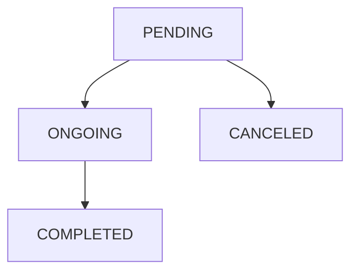

# Handling notifications

## What Is a Notification?

A Notification represents a request from a [Data Owner](/{{sdk}}/glossary#data-owner) to another to perform 
an operation.  
As for now, there are three types of Notifications:

* **KEY_PAIR_UPDATE**: when a Patient loses their private key and gets a new one, they can send this type of Notification to a {{Hcp}} to ask them to share their data with them again.
* **NEW_USER_OWN_DATA_ACCESS**: when a Patient logs in for the first time, they can send this type of Notification to a {{Hcp}} to aks for access to their own data.
* **OTHER**: all the other use cases.

### Status of a Notification

You can manage the lifecycle of a Notification by altering its status. Each Notification can have four possible states:

* **pending**: the Notification was created, and it is waiting to be managed.
* **ongoing**: the Notification was acknowledged, and the operations it prescribes are being managed.
* **completed**: the Notification was managed, and the operations it prescribes ended.
* **cancelled**: the Notification was cancelled without starting the operations it prescribes.



## Creating a Notification

:::note

To perform the following operations, we suppose you have at least a Patient and a {{Hcp}} in your database.

:::

In the following example, a Patient creates a Notification for a {{Hcp}} communicating that they have a new
 key and need access to their data.

<!-- file://code-samples/{{sdk}}/how-to/manage-notifications/index.mts snippet:create a notification as patient-->
```typescript
```

<!-- output://code-samples/{{sdk}}/how-to/manage-notifications/accessNotification.txt -->
<details>
<summary>accessNotification</summary>

```json
```
</details>

:::note

The default status of a Notification is `pending`

:::

## Retrieving a Notification

### Retrieving a Notification Using its Id

In the following example, a Patient creates a Notification for a {{Hcp}} and then retrieves it using its
 id.

<!-- file://code-samples/{{sdk}}/how-to/manage-notifications/index.mts snippet:creates a notification, then retrieves it-->
```typescript
```

<!-- output://code-samples/{{sdk}}/how-to/manage-notifications/createdNotification.txt -->
<details>
<summary>createdNotification</summary>

```json
```
</details>

<!-- output://code-samples/{{sdk}}/how-to/manage-notifications/retrievedNotification.txt -->
<details>
<summary>retrievedNotification</summary>

```json
```
</details>

### Retrieving Notifications Using Complex Criteria

If you want to retrieve a set of Notifications that satisfy complex criteria, you can use a `Filter`.  
In this example, a {{Hcp}} filters all their Notifications that were created after a certain date.

<!-- file://code-samples/{{sdk}}/how-to/manage-notifications/index.mts snippet:creates after date filter-->
```typescript
```

<!-- output://code-samples/{{sdk}}/how-to/manage-notifications/afterDateFilter.txt -->
<details>
<summary>afterDateFilter</summary>

```json
```
</details>

:::note

You can learn more about Filters in the [Filters How-To](/{{sdk}}/how-to/how-to-filter-data-with-advanced-search-criteria)

:::

After creating the filter, is it possible to use it to retrieve the Notifications.

<!-- file://code-samples/{{sdk}}/how-to/manage-notifications/index.mts snippet:gets the first page of results-->
```typescript
```

<!-- output://code-samples/{{sdk}}/how-to/manage-notifications/notificationsFirstPage.txt -->
<details>
<summary>notificationsFirstPage</summary>

```json
```
</details>

The `filter` method returns a PaginatedList, which contains up to `limit` Notifications in the `rows` field, as specified by the method parameter (1000 by default).
If the PaginatedList has a non-null field `startKeyDocId` there are more notifications which can be retrieved with this filter: you can use this value to retrieve (part of) the remaining notifications.

<!-- file://code-samples/{{sdk}}/how-to/manage-notifications/index.mts snippet:gets the second page of results-->
```typescript
```

<!-- output://code-samples/{{sdk}}/how-to/manage-notifications/notificationsSecondPage.txt -->
<details>
<summary>notificationsSecondPage</summary>

```json
```
</details>


### Retrieving all the Pending Notifications

A {{Hcp}} can also retrieve all the Notifications assigned to him that have a `pending` status.

<!-- file://code-samples/{{sdk}}/how-to/manage-notifications/index.mts snippet:gets the pending notifications-->
```typescript
const pendingNotifications = await api.notificationApi.getPendingNotificationsAfter()
```

<!-- output://code-samples/{{sdk}}/how-to/manage-notifications/pendingNotifications.txt -->
<details>
<summary>pendingNotifications</summary>

```text
```
</details>


## Modifying a Notification

A Data Owner can modify a Notification.

<!-- file://code-samples/{{sdk}}/how-to/manage-notifications/index.mts snippet:modifies a notification-->
```typescript
```

<!-- output://code-samples/{{sdk}}/how-to/manage-notifications/modifiedNotification.txt -->
<details>
<summary>modifiedNotification</summary>

```json
```
</details>


:::caution

Only the `status`, `identifiers`, and `property` fields can be modified.

:::

### Updating the Status of a Notification

The `NotificationApi` also provides a shortcut method to update the status of a Notification.

<!-- file://code-samples/{{sdk}}/how-to/manage-notifications/index.mts snippet:updates notification status-->
```typescript
```

<!-- output://code-samples/{{sdk}}/how-to/manage-notifications/updatedNotification.txt -->
<details>
<summary>updatedNotification</summary>

```json
```
</details>


## Deleting a Notification

Finally, a Data Owner that has access to a Notification can decide to delete it.

<!-- file://code-samples/{{sdk}}/how-to/manage-notifications/index.mts snippet:deletes a notification-->
```typescript
```

<!-- output://code-samples/{{sdk}}/how-to/manage-notifications/deletedNotificationId.txt -->
<details>
<summary>deletedNotificationId</summary>

```text
```
</details>
