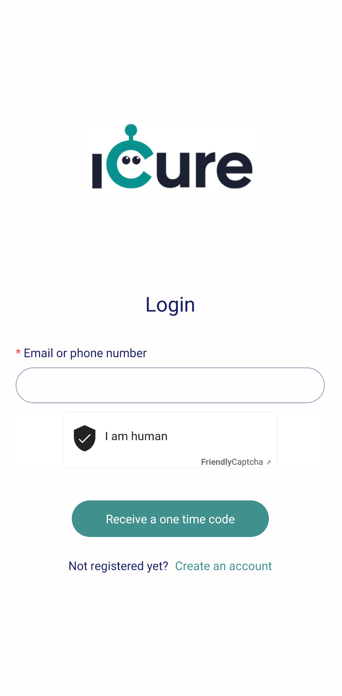
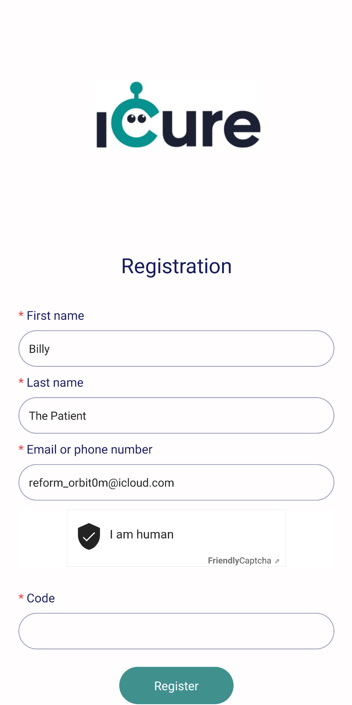
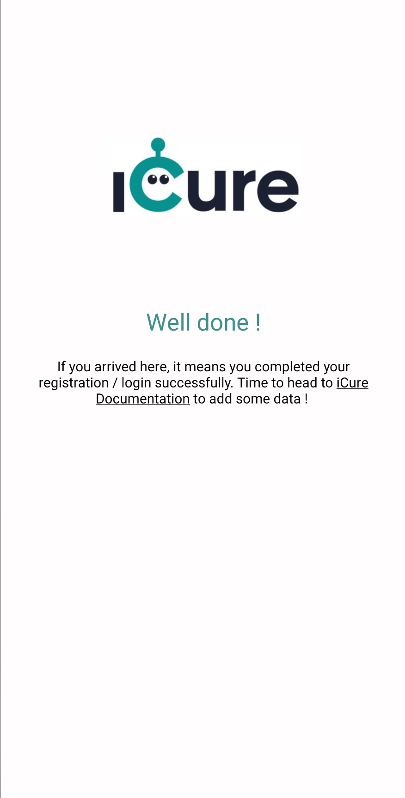

# Start your React Native App

Now your iCure environment is successfully set up, you will be able to start the creation of your React Native App. 

To make it easier for you, we created a [React Native Template Repository](https://github.com/icure/icure-medical-device-react-native-boilerplate-app-template), that includes: 
- All the needed dependencies to work with iCure in a React Native app;
- A fully implemented [authentication flow](https://docs.icure.com/sdks/how-to/how-to-authenticate-a-user/how-to-authenticate-a-user), to allow you to directly start working with medical data. 

:::info
We use [Friendly-Captcha](https://friendlycaptcha.com/) as our CAPTCHA solution in the template's authentication implementation, as we consider it more privacy friendly than Google reCaptcha. If you would like to use Google reCAPTCHA in your React Native App, you will have to implement your own reCAPTCHA component first. 
:::

## Requirements 
To work with our React Native Template, make sure the following tools are installed on your machine: 
- the **package manager Yarn**
- **Ruby**, same version than referenced in the `.ruby-version` file at the root of the template. 
- **XCode**
- **Android Studio**

*Note: XCode and Android Studio are needed in order to run your app on iPhone & Android emulators*


## Create your project
Create your React Native App by executing the following command: 
```
npx create-react-native-app --template https://github.com/icure/icure-medical-device-react-native-boilerplate-app-template
```

Answer the questions in the prompt and once npx instruction is done, you should see a similar entry: 
```
✅ Your project is ready!

To run your project, navigate to the directory and run one of the following yarn commands.

- cd <your-react-native-app-name>
- yarn android
- yarn ios
- yarn web
```

Your React Native App created, let's add the missing information to complete an authentication process successfully in the React Native App. 

## Add the authentication information in constants.ts
While you initialized your environment in [Quick Start](./index.md), we asked you to keep a series of information: 
- the **MSG_GW_SPEC_ID**, identifying your App in our Authentication component; 
- the **EMAIL_AUTHENTICATION_PROCESS_ID**, identifying the email template to send to your users during their registration or login;
- the **SMS_AUTHENTICATION_PROCESS_ID**, identifying the SMS template to send to your users during their registration or login;
- the **PARENT_HEALTHCARE_PROFESSIONAL_ID** (optional), identifying your organization as a healthcare professional, to let your users (patients or doctors) share medical data with you automatically. 

You need to add these information in your newly created React Native App. 
For this, go to the `config/constants.ts` file and complete the values of the variables named the same way. (If you don't have any **PARENT_HEALTHCARE_PROFESSIONAL_ID**, leave its value to `null`). 

The only value missing right now is the one of **FRIENDLY_CAPTCHA_SITE_KEY**. For this one, put your Friendly-Captcha Site Key, that you created previously along with your Friendly-Captcha Secret Key. 

:::caution
As explained earlier, if you're using the Google reCAPTCHA instead of the Friendly-Captcha, you'll need to do some changes in the project. 
After you created your Google reCAPTCHA component, include it in the `screens/Login.tsx` and `screens/Register.tsx` instead of the FriendlyCaptcha component. Go afterwards to the `services/api.ts` file and replace any reference to `friendly-captcha` by `recaptcha`. 
:::

## Launch your App on Android and iOS
Execute `yarn android` or `yarn ios` to launch your React Native App on a native platform. 
The first time you'll execute those commands, you'll have to provide the package name (or bundle identifier if iOS) of your React Native App to the prompt. 

Once your emulator is starting, you should see the following screen on your emulator: 



Click on **Create an account** and complete the information to create a new user in iCure. Click on **Receive a one time code**. 

Within a few minutes, you'll receive an email containing an OTP of 6 digits to the address you provided in the form. 

:::tip
You recognize the template of the email you received ? It is the one [you configured ealier in the Quick Start](./index.md#get-your-authentication-process-ids). If you didn't create a new email template, the one you're seeing is the default one. 
:::

Enter the OTP in the screen and click on **Register**: 



You should now be connected with iCure and see the following screen: 




:::tip
If you encounter any issue starting your app on Android, try to previously start an Android device from Android Studio or follow Expo tutorial to automatically [start an Android Device with ADB](https://docs.expo.dev/workflow/android-studio-emulator/).
:::

## Congratulations !
You're fully ready to start creating medical data inside your React Native App ! Time to have a look to the [Petra tutorial](../tutorial/petra/foreword.md), our patient-centric app which gives you a concrete example of how to use iCure to represent / store / manage medical data. 

You might also be interested to check our [How To's pages](../how-to/index) to directly start implementing the functionalities of your choice. 